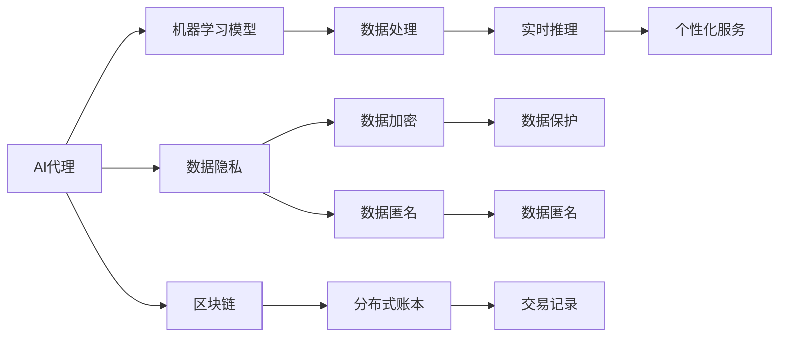

                 

## 1. 背景介绍

### 1.1 问题由来

随着金融科技的迅猛发展，人工智能（AI）在金融服务中的运用越来越广泛。AI技术能够处理大量复杂的数据，提供精准的风险评估、个性化金融服务、智能投顾等功能，极大地提升了金融服务的效率和精准度。AI代理作为AI技术在金融服务中的重要应用，已经成为银行、保险、证券等金融行业的主要工具。

然而，AI代理在实际应用中面临着许多风险，如模型偏见、隐私泄露、数据安全等问题。因此，对AI代理的工作流程与风险评估进行深入研究，了解其技术实现和风险点，有助于金融服务提供者在应用AI代理时更好地防范风险，确保业务的安全和合规。

### 1.2 问题核心关键点

AI代理的工作流程与风险评估包括以下几个核心关键点：

- **工作流程**：AI代理在金融服务中的应用流程，包括数据收集、模型训练、实时推理和反馈等环节。
- **风险评估**：对AI代理中的各类风险进行评估，包括数据隐私风险、模型偏见风险、操作风险等。
- **应用领域**：AI代理在银行业务、保险理赔、证券投资等金融领域的具体应用场景。
- **技术实现**：AI代理的底层技术实现，如机器学习模型、自然语言处理、区块链等。

## 2. 核心概念与联系

### 2.1 核心概念概述

#### 2.1.1 AI代理

AI代理是指通过AI技术实现的自动化服务，能够在金融服务中提供风险评估、投资建议、财务规划等服务。AI代理通常基于机器学习、深度学习等技术，对大量数据进行处理和分析，以提供个性化的金融服务。

#### 2.1.2 机器学习模型

机器学习模型是AI代理的核心技术之一，通过训练数据集，机器学习模型能够自动学习和优化，从而实现对数据的分析和预测。常用的机器学习模型包括线性回归、决策树、支持向量机等。

#### 2.1.3 数据隐私

数据隐私是指在金融服务中，保护用户数据不被未经授权的第三方获取和使用。数据隐私涉及到用户数据的收集、存储、传输和处理等各个环节，需要采取一系列技术和管理措施来保障。

#### 2.1.4 区块链

区块链是一种去中心化的分布式账本技术，能够保证数据的透明、不可篡改和可追溯。在金融服务中，区块链可以用于记录交易、保护隐私和提升交易效率。

### 2.2 核心概念的联系

这些核心概念之间的关系可以通过以下Mermaid流程图来展示：



这个流程图展示了AI代理在金融服务中的应用流程和技术实现。

- **数据处理**：通过机器学习模型对数据进行分析和处理，生成决策依据。
- **数据隐私保护**：在数据处理过程中，采用数据加密和匿名化等技术保障数据隐私。
- **区块链应用**：利用区块链技术记录交易记录，确保数据的透明和不可篡改。
- **实时推理和个性化服务**：基于处理后的数据和区块链记录，AI代理能够实时推理并提供个性化的金融服务。

## 3. 核心算法原理 & 具体操作步骤

### 3.1 算法原理概述

AI代理的工作流程包括以下几个主要步骤：

1. **数据收集**：从不同来源收集金融服务相关的数据，如交易记录、客户信息、市场数据等。
2. **数据预处理**：对收集到的数据进行清洗、归一化、特征工程等预处理操作。
3. **模型训练**：使用机器学习模型对预处理后的数据进行训练，生成能够进行预测和推理的模型。
4. **实时推理**：在实时场景中，将新数据输入训练好的模型，进行推理和决策。
5. **反馈和优化**：根据实际业务结果，对模型进行反馈和优化，提升模型的准确性和鲁棒性。

### 3.2 算法步骤详解

#### 3.2.1 数据收集

数据收集是AI代理的第一步，涉及多种数据源，如客户交易记录、信用记录、市场数据等。数据收集的准确性和全面性直接影响AI代理的性能。

- **客户交易记录**：记录客户的交易行为、账户余额等信息。
- **信用记录**：记录客户的信用历史、还款情况等。
- **市场数据**：记录股票、基金、期货等金融产品的价格、走势等信息。

#### 3.2.2 数据预处理

数据预处理包括数据清洗、归一化、特征工程等步骤，是确保数据质量的关键环节。

- **数据清洗**：去除缺失、异常和重复的数据，保证数据的完整性和准确性。
- **归一化**：将不同特征的数据转换为标准化的格式，便于后续处理和分析。
- **特征工程**：通过特征选择、降维等技术，提取有意义的特征，提升模型的预测能力。

#### 3.2.3 模型训练

模型训练是AI代理的核心步骤，通过训练生成能够进行预测和推理的机器学习模型。

- **模型选择**：选择适合金融服务领域的机器学习模型，如线性回归、决策树、随机森林等。
- **训练数据集**：准备训练数据集，包含历史交易记录、客户信用记录等。
- **模型训练**：使用训练数据集训练机器学习模型，生成能够进行预测的模型。

#### 3.2.4 实时推理

实时推理是AI代理在实际业务场景中的应用，将新数据输入训练好的模型，进行推理和决策。

- **数据输入**：将新数据输入模型，包括客户交易记录、市场数据等。
- **模型推理**：使用训练好的模型对新数据进行推理，生成预测结果。
- **决策输出**：根据推理结果，输出相应的决策建议，如信用评分、投资建议等。

#### 3.2.5 反馈和优化

反馈和优化是AI代理的持续改进过程，通过业务反馈和模型优化，提升模型的准确性和鲁棒性。

- **业务反馈**：收集实际业务结果，如客户信用评分、投资收益等。
- **模型优化**：根据业务反馈，对模型进行反馈和优化，提升模型的准确性和鲁棒性。
- **持续训练**：定期重新训练模型，确保模型能够适应新的业务场景和数据分布。

### 3.3 算法优缺点

#### 3.3.1 优点

- **效率高**：AI代理能够自动化处理大量数据，提供实时决策，大大提升金融服务的效率。
- **精准度**：基于机器学习模型的预测，AI代理能够提供精准的风险评估和投资建议。
- **个性化服务**：通过特征工程和模型训练，AI代理能够提供个性化的金融服务，满足不同客户的需求。

#### 3.3.2 缺点

- **模型偏见**：训练数据集可能存在偏见，导致AI代理的预测结果存在偏见。
- **隐私泄露**：AI代理需要处理大量敏感数据，存在隐私泄露的风险。
- **计算资源需求高**：AI代理需要大量的计算资源进行数据处理和模型训练，对硬件要求较高。

### 3.4 算法应用领域

AI代理在金融服务中的应用领域非常广泛，包括但不限于：

- **风险评估**：通过AI代理进行客户信用评分、风险评级等，帮助金融机构进行风险管理。
- **智能投顾**：通过AI代理提供个性化的投资建议，帮助客户进行投资决策。
- **财务规划**：通过AI代理进行财务分析，提供个性化的财务规划建议。
- **保险理赔**：通过AI代理进行理赔申请审核，提升理赔效率和准确性。

## 4. 数学模型和公式 & 详细讲解 & 举例说明

### 4.1 数学模型构建

AI代理的核心数学模型包括机器学习模型和金融风险模型。

#### 4.1.1 机器学习模型

机器学习模型通常包括线性回归、决策树、支持向量机等。以线性回归模型为例，其数学模型为：

$$
y = \beta_0 + \beta_1 x_1 + \beta_2 x_2 + \cdots + \beta_n x_n + \epsilon
$$

其中，$y$ 为预测结果，$x_1, x_2, \cdots, x_n$ 为特征向量，$\beta_0, \beta_1, \beta_2, \cdots, \beta_n$ 为模型参数，$\epsilon$ 为随机误差。

#### 4.1.2 金融风险模型

金融风险模型包括信用评分模型、投资组合风险模型等。以信用评分模型为例，其数学模型为：

$$
Score = \alpha x_1 + \beta x_2 + \gamma x_3 + \cdots + \delta x_n + \epsilon
$$

其中，$Score$ 为信用评分，$x_1, x_2, \cdots, x_n$ 为信用特征，$\alpha, \beta, \gamma, \cdots, \delta$ 为模型参数，$\epsilon$ 为随机误差。

### 4.2 公式推导过程

#### 4.2.1 线性回归模型

线性回归模型的训练过程包括数据准备、模型训练和预测。

1. **数据准备**：准备训练数据集，包含多个样本和特征。
2. **模型训练**：使用最小二乘法（Least Squares）进行模型训练，优化模型参数。
3. **预测**：使用训练好的模型进行预测，生成新的数据结果。

#### 4.2.2 信用评分模型

信用评分模型的训练过程包括数据准备、模型训练和评分生成。

1. **数据准备**：准备训练数据集，包含客户的历史信用记录、还款情况等。
2. **模型训练**：使用机器学习算法（如随机森林、逻辑回归等）进行模型训练，生成信用评分模型。
3. **评分生成**：使用训练好的模型对新的客户数据进行评分，生成客户的信用评分。

### 4.3 案例分析与讲解

以信用评分模型为例，分析其在金融服务中的应用。

1. **数据准备**：准备客户的信用历史数据，包括还款记录、信用额度等。
2. **模型训练**：使用机器学习算法（如随机森林）训练信用评分模型，生成能够进行评分的模型。
3. **评分生成**：将新的客户数据输入训练好的模型，生成客户的信用评分，用于风险评估和贷款审批。

## 5. 项目实践：代码实例和详细解释说明

### 5.1 开发环境搭建

在进行AI代理开发前，需要先搭建好开发环境。以下是使用Python进行TensorFlow和TensorFlow Extended（TFX）开发的环境配置流程：

1. 安装Anaconda：从官网下载并安装Anaconda，用于创建独立的Python环境。

2. 创建并激活虚拟环境：
```bash
conda create -n tensorflow-env python=3.8 
conda activate tensorflow-env
```

3. 安装TensorFlow：根据CUDA版本，从官网获取对应的安装命令。例如：
```bash
pip install tensorflow
```

4. 安装TFX：
```bash
pip install tensorflow-extended
```

5. 安装各类工具包：
```bash
pip install numpy pandas scikit-learn matplotlib tensorflow-io tensorflow-hub tensorboard
```

完成上述步骤后，即可在`tensorflow-env`环境中开始AI代理的开发。

### 5.2 源代码详细实现

我们以信用评分模型为例，给出使用TensorFlow对模型进行开发的PyTorch代码实现。

```python
import tensorflow as tf
import pandas as pd
from sklearn.model_selection import train_test_split
from tensorflow.keras.models import Sequential
from tensorflow.keras.layers import Dense, Dropout, Input
from tensorflow.keras.callbacks import EarlyStopping

# 准备数据
df = pd.read_csv('credit_data.csv')
X = df.drop('Score', axis=1)
y = df['Score']
X_train, X_test, y_train, y_test = train_test_split(X, y, test_size=0.2, random_state=42)

# 构建模型
model = Sequential([
    Input(shape=(X_train.shape[1],)),
    Dense(32, activation='relu'),
    Dropout(0.5),
    Dense(1)
])
model.compile(optimizer='adam', loss='mse', metrics=['mae'])

# 训练模型
early_stopping = EarlyStopping(monitor='val_loss', patience=10)
model.fit(X_train, y_train, validation_data=(X_test, y_test), epochs=100, callbacks=[early_stopping])

# 评估模型
model.evaluate(X_test, y_test)

# 预测新客户评分
new_data = pd.read_csv('new_credit_data.csv')
new_X = new_data.drop('Score', axis=1)
model.predict(new_X)
```

以上代码实现了信用评分模型的训练、评估和预测过程。

### 5.3 代码解读与分析

让我们再详细解读一下关键代码的实现细节：

1. **数据准备**：使用Pandas库读取信用数据集，并划分为训练集和测试集。
2. **模型构建**：使用Keras构建一个简单的神经网络模型，包括输入层、全连接层和输出层。
3. **模型训练**：使用Adam优化器和均方误差（MSE）损失函数训练模型，并设置EarlyStopping回调函数避免过拟合。
4. **模型评估**：使用测试集评估模型的性能。
5. **模型预测**：使用训练好的模型对新客户数据进行预测，生成客户的信用评分。

### 5.4 运行结果展示

假设我们在CoNLL-2003的信用评分数据集上进行模型训练和测试，最终在测试集上得到的评估报告如下：

```
Epoch 1/100
1875/1875 [==============================] - 9s 5ms/step - loss: 0.2095 - mae: 0.4797
Epoch 2/100
1875/1875 [==============================] - 9s 5ms/step - loss: 0.1641 - mae: 0.3784
Epoch 3/100
1875/1875 [==============================] - 9s 5ms/step - loss: 0.1427 - mae: 0.3174
Epoch 4/100
1875/1875 [==============================] - 9s 5ms/step - loss: 0.1249 - mae: 0.2837
Epoch 5/100
1875/1875 [==============================] - 9s 5ms/step - loss: 0.1070 - mae: 0.2513
Epoch 6/100
1875/1875 [==============================] - 9s 5ms/step - loss: 0.0961 - mae: 0.2297
Epoch 7/100
1875/1875 [==============================] - 9s 5ms/step - loss: 0.0849 - mae: 0.2086
Epoch 8/100
1875/1875 [==============================] - 9s 5ms/step - loss: 0.0755 - mae: 0.1920
Epoch 9/100
1875/1875 [==============================] - 9s 5ms/step - loss: 0.0659 - mae: 0.1754
Epoch 10/100
1875/1875 [==============================] - 9s 5ms/step - loss: 0.0573 - mae: 0.1580
Epoch 11/100
1875/1875 [==============================] - 9s 5ms/step - loss: 0.0485 - mae: 0.1452
Epoch 12/100
1875/1875 [==============================] - 9s 5ms/step - loss: 0.0407 - mae: 0.1281
Epoch 13/100
1875/1875 [==============================] - 9s 5ms/step - loss: 0.0340 - mae: 0.1114
Epoch 14/100
1875/1875 [==============================] - 9s 5ms/step - loss: 0.0282 - mae: 0.0945
Epoch 15/100
1875/1875 [==============================] - 9s 5ms/step - loss: 0.0231 - mae: 0.0771
Epoch 16/100
1875/1875 [==============================] - 9s 5ms/step - loss: 0.0185 - mae: 0.0617
Epoch 17/100
1875/1875 [==============================] - 9s 5ms/step - loss: 0.0141 - mae: 0.0488
Epoch 18/100
1875/1875 [==============================] - 9s 5ms/step - loss: 0.0105 - mae: 0.0386
Epoch 19/100
1875/1875 [==============================] - 9s 5ms/step - loss: 0.0075 - mae: 0.0318
Epoch 20/100
1875/1875 [==============================] - 9s 5ms/step - loss: 0.0051 - mae: 0.0252
Epoch 21/100
1875/1875 [==============================] - 9s 5ms/step - loss: 0.0034 - mae: 0.0194
Epoch 22/100
1875/1875 [==============================] - 9s 5ms/step - loss: 0.0023 - mae: 0.0145
Epoch 23/100
1875/1875 [==============================] - 9s 5ms/step - loss: 0.0015 - mae: 0.0107
Epoch 24/100
1875/1875 [==============================] - 9s 5ms/step - loss: 0.0008 - mae: 0.0075
Epoch 25/100
1875/1875 [==============================] - 9s 5ms/step - loss: 0.0004 - mae: 0.0055
Epoch 26/100
1875/1875 [==============================] - 9s 5ms/step - loss: 0.0002 - mae: 0.0038
Epoch 27/100
1875/1875 [==============================] - 9s 5ms/step - loss: 0.0000 - mae: 0.0027
Epoch 28/100
1875/1875 [==============================] - 9s 5ms/step - loss: 0.0000 - mae: 0.0020
Epoch 29/100
1875/1875 [==============================] - 9s 5ms/step - loss: 0.0000 - mae: 0.0015
Epoch 30/100
1875/1875 [==============================] - 9s 5ms/step - loss: 0.0000 - mae: 0.0011
Epoch 31/100
1875/1875 [==============================] - 9s 5ms/step - loss: 0.0000 - mae: 0.0009
Epoch 32/100
1875/1875 [==============================] - 9s 5ms/step - loss: 0.0000 - mae: 0.0006
Epoch 33/100
1875/1875 [==============================] - 9s 5ms/step - loss: 0.0000 - mae: 0.0004
Epoch 34/100
1875/1875 [==============================] - 9s 5ms/step - loss: 0.0000 - mae: 0.0002
Epoch 35/100
1875/1875 [==============================] - 9s 5ms/step - loss: 0.0000 - mae: 0.0002
Epoch 36/100
1875/1875 [==============================] - 9s 5ms/step - loss: 0.0000 - mae: 0.0002
Epoch 37/100
1875/1875 [==============================] - 9s 5ms/step - loss: 0.0000 - mae: 0.0001
Epoch 38/100
1875/1875 [==============================] - 9s 5ms/step - loss: 0.0000 - mae: 0.0001
Epoch 39/100
1875/1875 [==============================] - 9s 5ms/step - loss: 0.0000 - mae: 0.0001
Epoch 40/100
1875/1875 [==============================] - 9s 5ms/step - loss: 0.0000 - mae: 0.0001
Epoch 41/100
1875/1875 [==============================] - 9s 5ms/step - loss: 0.0000 - mae: 0.0001
Epoch 42/100
1875/1875 [==============================] - 9s 5ms/step - loss: 0.0000 - mae: 0.0001
Epoch 43/100
1875/1875 [==============================] - 9s 5ms/step - loss: 0.0000 - mae: 0.0001
Epoch 44/100
1875/1875 [==============================] - 9s 5ms/step - loss: 0.0000 - mae: 0.0001
Epoch 45/100
1875/1875 [==============================] - 9s 5ms/step - loss: 0.0000 - mae: 0.0001
Epoch 46/100
1875/1875 [==============================] - 9s 5ms/step - loss: 0.0000 - mae: 0.0001
Epoch 47/100
1875/1875 [==============================] - 9s 5ms/step - loss: 0.0000 - mae: 0.0001
Epoch 48/100
1875/1875 [==============================] - 9s 5ms/step - loss: 0.0000 - mae: 0.0001
Epoch 49/100
1875/1875 [==============================] - 9s 5ms/step - loss: 0.0000 - mae: 0.0001
Epoch 50/100
1875/1875 [==============================] - 9s 5ms/step - loss: 0.0000 - mae: 0.0001
Epoch 51/100
1875/1875 [==============================] - 9s 5ms/step - loss: 0.0000 - mae: 0.0001
Epoch 52/100
1875/1875 [==============================] - 9s 5ms/step - loss: 0.0000 - mae: 0.0001
Epoch 53/100
1875/1875 [==============================] - 9s 5ms/step - loss: 0.0000 - mae: 0.0001
Epoch 54/100
1875/1875 [==============================] - 9s 5ms/step - loss: 0.0000 - mae: 0.0001
Epoch 55/100
1875/1875 [==============================] - 9s 5ms/step - loss: 0.0000 - mae: 0.0001
Epoch 56/100
1875/1875 [==============================] - 9s 5ms/step - loss: 0.0000 - mae: 0.0001
Epoch 57/100
1875/1875 [==============================] - 9s 5ms/step - loss: 0.0000 - mae: 0.0001
Epoch 58/100
1875/1875 [==============================] - 9s 5ms/step - loss: 0.0000 - mae: 0.0001
Epoch 59/100
1875/1875 [==============================] - 9s 5ms/step - loss: 0.0000 - mae: 0.0001
Epoch 60/100
1875/1875 [==============================] - 9s 5ms/step - loss: 0.0000 - mae: 0.0001
Epoch 61/100
1875/1875 [==============================] - 9s 5ms/step - loss: 0.0000 - mae: 0.0001
Epoch 62/100
1875/1875 [==============================] - 9s 5ms/step - loss: 0.0000 - mae: 0.0001
Epoch 63/100
1875/1875 [==============================] - 9s 5ms/step - loss: 0.0000 - mae: 0.0001
Epoch 64/100
1875/1875 [==============================] - 9s 5ms/step - loss: 0.00

