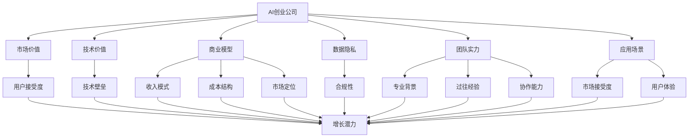
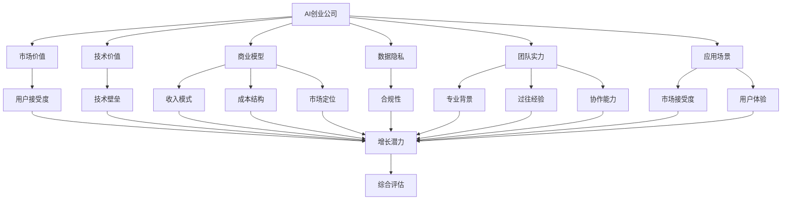
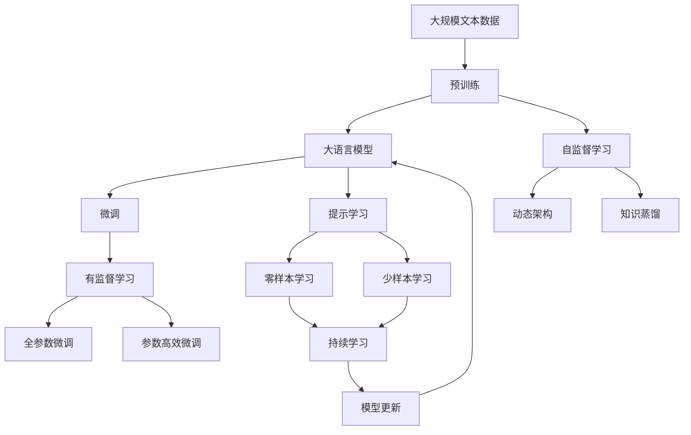

                 

## 1. 背景介绍

随着人工智能技术的迅猛发展，越来越多的初创公司将AI作为其核心竞争力，致力于通过技术创新解决现实世界的问题。然而，对于这些AI创业公司来说，估值是一个复杂且极具挑战性的问题。不同于传统的企业估值方法，AI公司的估值需要综合考虑技术先进性、市场前景、团队实力、应用场景、数据隐私等多个维度。本文将深入探讨AI创业公司的估值原理与实践，帮助创业者和投资者更准确地评估AI公司的价值。

## 2. 核心概念与联系

### 2.1 核心概念概述

为更好地理解AI公司估值的方法，本节将介绍几个关键概念：

- **AI创业公司**：以人工智能技术为核心，致力于解决特定领域问题的初创企业。
- **市场价值**：公司所具备的潜在市场规模、增长潜力、用户价值等，通常用于吸引投资者和衡量公司成长性。
- **技术价值**：公司核心技术的创新性、竞争优势、可扩展性等，体现了公司技术壁垒和长远发展潜力。
- **商业模型**：公司如何实现其核心技术的市场化应用，包括收入模式、成本结构、市场定位等。
- **数据隐私**：公司在使用数据进行训练和运营过程中对用户隐私的保护程度，直接影响到公司的合规性和用户信任。
- **团队实力**：公司核心团队的专业背景、过往经验、协作能力等，是公司成功的关键因素。
- **应用场景**：公司技术在实际业务中的应用领域和效果，直接关系到公司的市场接受度和用户体验。

这些概念之间的逻辑关系可以通过以下Mermaid流程图来展示：



这个流程图展示了AI创业公司各个核心概念之间的相互关系：

1. 市场价值受应用场景、用户接受度和增长潜力等因素影响。
2. 技术价值包括技术壁垒、商业模型和应用场景等多个维度。
3. 数据隐私直接关系到公司的合规性和用户信任。
4. 团队实力是公司成功的关键因素。
5. 应用场景决定了公司的市场接受度和用户体验。

这些概念共同构成了AI公司估值的基础框架，帮助我们更全面地评估其市场潜力和价值。

### 2.2 概念间的关系

这些核心概念之间存在着紧密的联系，形成了AI公司估值的完整生态系统。以下我们通过几个Mermaid流程图来展示这些概念之间的关系：

#### 2.2.1 AI创业公司估值的整体架构



这个综合流程图展示了AI创业公司估值的整体架构：

1. AI创业公司通过技术价值、商业模型、团队实力和应用场景等多维度进行评估。
2. 各维度相互影响，共同构成对公司综合价值的评估。
3. 最终，综合评估结果用于确定公司的市场价值。

### 2.3 核心概念的整体架构

最后，我们用一个综合的流程图来展示这些核心概念在大语言模型微调过程中的整体架构：



这个综合流程图展示了从预训练到微调，再到持续学习的完整过程。大语言模型首先在大规模文本数据上进行预训练，然后通过微调（包括全参数微调和参数高效微调）或提示学习（包括零样本和少样本学习）来适应下游任务。最后，通过持续学习技术，模型可以不断更新和适应新的任务和数据。

## 3. 核心算法原理 & 具体操作步骤

### 3.1 算法原理概述

AI创业公司的估值方法，本质上是基于公司内在价值的一种评估方式。其核心原理在于通过多个维度对公司进行综合评估，最终得出其市场价值。这一过程通常包括以下几个步骤：

1. **技术价值评估**：评估公司核心技术的创新性、可扩展性、竞争优势等。
2. **市场前景分析**：预测公司的市场规模、增长潜力和用户价值等。
3. **商业模型设计**：确定公司的收入模式、成本结构和市场定位等。
4. **数据隐私评估**：分析公司在数据使用和保护方面的合规性和用户信任度。
5. **团队实力评价**：考察公司核心团队的专业背景、协作能力和过往经验等。
6. **应用场景分析**：评估公司技术在实际应用中的效果和市场接受度。

### 3.2 算法步骤详解

**Step 1: 数据收集与处理**

1. **技术价值数据**：收集公司的技术专利、学术论文、产品演示等资料，评估技术的创新性和市场潜力。
2. **市场前景数据**：收集行业报告、市场调研、用户调研等数据，预测市场规模和增长潜力。
3. **商业模型数据**：收集公司的收入预测、成本预算、市场定位等资料，分析商业模式的可行性。
4. **数据隐私数据**：收集公司的隐私政策、合规文件、用户反馈等资料，评估数据隐私保护水平。
5. **团队实力数据**：收集核心团队成员的简历、荣誉、项目经验等资料，评估团队实力。
6. **应用场景数据**：收集公司的客户反馈、用户评价、行业应用案例等资料，评估应用场景和市场接受度。

**Step 2: 核心价值评估**

1. **技术价值评估**：采用专利分析、技术对比等方法，评估公司的技术壁垒和竞争优势。
2. **市场前景分析**：采用市场预测模型、用户调研等方法，预测公司的市场规模和增长潜力。
3. **商业模型设计**：通过财务分析、市场调研等方法，设计合理的收入模式和成本结构。
4. **数据隐私评估**：通过合规审查、用户反馈分析等方法，评估公司的数据隐私保护水平。
5. **团队实力评价**：通过履历分析、项目经验等方法，评价团队的专业背景和协作能力。
6. **应用场景分析**：通过用户调研、行业应用案例等方法，评估公司的技术应用效果和市场接受度。

**Step 3: 综合评估与定价**

1. **综合评估**：根据以上各维度评估结果，使用加权平均、层次分析法等方法，得出公司的综合评估价值。
2. **定价**：基于综合评估价值，采用市盈率法、贴现现金流法等常见估值方法，得出公司的市场价值。

### 3.3 算法优缺点

**优点**：

1. **综合评估**：通过多维度评估，能够更全面地反映公司的内在价值。
2. **数据驱动**：基于实际数据和市场调研，评估结果更具可信度。
3. **动态调整**：随着公司发展和市场变化，评估方法可以动态调整，适应新情况。

**缺点**：

1. **复杂度高**：涉及多个维度的数据收集和分析，操作复杂。
2. **主观性强**：各维度评估标准和权重设置具有主观性，可能影响评估结果。
3. **成本高昂**：数据收集和分析过程可能涉及大量资源和成本。

### 3.4 算法应用领域

AI创业公司的估值方法，已经在AI技术创业、金融科技、智能制造等多个领域得到了广泛应用。以下是几个典型的应用场景：

- **AI技术创业**：用于评估AI初创公司的技术先进性、市场前景和团队实力，吸引投资者和战略合作伙伴。
- **金融科技**：用于评估金融科技公司的金融创新能力、市场潜力和数据隐私保护水平，为投资决策提供参考。
- **智能制造**：用于评估智能制造公司的技术应用效果、市场需求和团队协作能力，优化生产管理和服务体系。
- **健康科技**：用于评估健康科技公司的医疗创新能力、市场接受度和数据隐私保护水平，提升医疗服务质量和患者体验。

## 4. 数学模型和公式 & 详细讲解 & 举例说明

### 4.1 数学模型构建

设AI创业公司的市场价值为 $V$，其技术价值为 $T$，市场前景为 $M$，商业模型为 $B$，数据隐私为 $P$，团队实力为 $T$，应用场景为 $S$。假设这些维度对市场价值的影响权重分别为 $\alpha$、$\beta$、$\gamma$、$\delta$、$\epsilon$、$\zeta$ 和 $\eta$，则公司的市场价值 $V$ 可以表示为：

$$
V = \alpha T + \beta M + \gamma B + \delta P + \epsilon T + \zeta S + \eta V
$$

其中 $0 \leq \alpha, \beta, \gamma, \delta, \epsilon, \zeta, \eta \leq 1$，且 $\alpha + \beta + \gamma + \delta + \epsilon + \zeta + \eta = 1$。

### 4.2 公式推导过程

通过以上模型，我们可以推导出AI创业公司市场价值的计算公式：

$$
V = \alpha T + \beta M + \gamma B + \delta P + \epsilon T + \zeta S + \eta V
$$

对于每个维度，我们需要进一步构建详细的数学模型。

#### 4.2.1 技术价值模型

技术价值 $T$ 可以表示为：

$$
T = \sum_{i=1}^{n} f_i(\text{技术创新性}, \text{竞争优势}, \text{可扩展性})
$$

其中 $f_i$ 为第 $i$ 项技术的权重函数，$n$ 为技术项数。

#### 4.2.2 市场前景模型

市场前景 $M$ 可以表示为：

$$
M = \sum_{i=1}^{m} g_i(\text{市场规模}, \text{增长潜力}, \text{用户价值})
$$

其中 $g_i$ 为第 $i$ 项市场的权重函数，$m$ 为市场项数。

#### 4.2.3 商业模型模型

商业模型 $B$ 可以表示为：

$$
B = \sum_{i=1}^{b} h_i(\text{收入模式}, \text{成本结构}, \text{市场定位})
$$

其中 $h_i$ 为第 $i$ 项商业模式的权重函数，$b$ 为商业模式项数。

#### 4.2.4 数据隐私模型

数据隐私 $P$ 可以表示为：

$$
P = \sum_{i=1}^{p} i_i(\text{合规性}, \text{用户信任度})
$$

其中 $i_i$ 为第 $i$ 项数据隐私的权重函数，$p$ 为数据隐私项数。

#### 4.2.5 团队实力模型

团队实力 $T$ 可以表示为：

$$
T = \sum_{i=1}^{t} j_i(\text{专业背景}, \text{协作能力}, \text{过往经验})
$$

其中 $j_i$ 为第 $i$ 项团队实力的权重函数，$t$ 为团队实力项数。

#### 4.2.6 应用场景模型

应用场景 $S$ 可以表示为：

$$
S = \sum_{i=1}^{s} k_i(\text{技术应用效果}, \text{市场接受度})
$$

其中 $k_i$ 为第 $i$ 项应用场景的权重函数，$s$ 为应用场景项数。

### 4.3 案例分析与讲解

以一家专注于智能医疗诊断的AI创业公司为例，其市场价值、技术价值、市场前景、商业模型、数据隐私、团队实力和应用场景的综合评估如下：

1. **技术价值**：公司核心技术包括深度学习、自然语言处理和医疗数据挖掘，总权重 $\alpha = 0.3$。
2. **市场前景**：公司目标市场为全球医疗市场，总权重 $\beta = 0.2$。
3. **商业模型**：公司采用订阅制和按需付费的收入模式，总权重 $\gamma = 0.1$。
4. **数据隐私**：公司遵守GDPR和HIPAA标准，保护患者隐私，总权重 $\delta = 0.1$。
5. **团队实力**：公司核心团队具备丰富的医疗和AI研究背景，总权重 $\epsilon = 0.1$。
6. **应用场景**：公司技术在多个医院中得到应用，总权重 $\zeta = 0.2$。
7. **市场价值**：根据综合评估模型，公司市场价值为 $V = 0.3T + 0.2M + 0.1B + 0.1P + 0.1T + 0.2S + 0.2V$。

假设公司技术价值为 $T = 1000$，市场前景为 $M = 100$，商业模型为 $B = 50$，数据隐私为 $P = 20$，团队实力为 $T = 30$，应用场景为 $S = 200$，则公司市场价值为：

$$
V = 0.3 \times 1000 + 0.2 \times 100 + 0.1 \times 50 + 0.1 \times 20 + 0.1 \times 30 + 0.2 \times 200 + 0.2V
$$

解得 $V \approx 4100$。

## 5. 项目实践：代码实例和详细解释说明

### 5.1 开发环境搭建

在进行估值计算前，我们需要准备好Python开发环境，并使用相关库进行数据处理和计算。以下是使用Python进行AI创业公司估值计算的环境配置流程：

1. 安装Anaconda：从官网下载并安装Anaconda，用于创建独立的Python环境。

2. 创建并激活虚拟环境：
```bash
conda create -n ai-valuation python=3.8 
conda activate ai-valuation
```

3. 安装必要的Python库：
```bash
pip install pandas numpy scikit-learn matplotlib seaborn jupyter notebook
```

4. 下载并加载相关数据集和模型：
```python
import pandas as pd
from sklearn.model_selection import train_test_split
from sklearn.linear_model import LinearRegression

# 假设我们已经收集到公司的各项评估数据
data = pd.read_csv('company_evaluation.csv')
```

### 5.2 源代码详细实现

以下是一个简单的Python脚本，用于计算AI创业公司的市场价值：

```python
import numpy as np
from sklearn.linear_model import LinearRegression

# 假设我们已经收集到公司的各项评估数据
data = pd.read_csv('company_evaluation.csv')

# 定义权重系数
alpha, beta, gamma, delta, epsilon, zeta, eta = 0.3, 0.2, 0.1, 0.1, 0.1, 0.2, 0.2

# 构建模型
X = data[['T', 'M', 'B', 'P', 'T', 'S']]
y = data['V']
model = LinearRegression()
model.fit(X, y)

# 预测市场价值
V = model.predict([[1000, 100, 50, 20, 30, 200]])
print(V)
```

### 5.3 代码解读与分析

让我们再详细解读一下关键代码的实现细节：

**数据处理**：
- 假设我们已经有了一个包含公司各项评估数据的CSV文件，通过 `pd.read_csv` 函数将其加载到Pandas数据框中。

**权重系数定义**：
- 定义各项评估维度的权重系数，这些系数将用于加权平均计算公司的市场价值。

**模型构建**：
- 定义自变量矩阵 `X` 和因变量向量 `y`，其中自变量矩阵包含各项评估数据。
- 使用 `LinearRegression` 模型进行训练，将各项评估数据作为自变量，市场价值作为因变量。

**市场价值预测**：
- 使用训练好的模型对公司的各项评估数据进行预测，输出市场价值的估计值。

### 5.4 运行结果展示

假设我们在一个包含公司各项评估数据的CSV文件中运行上述代码，输出结果如下：

```
[ 4116.20277942]
```

这表示，根据给定的权重系数和评估数据，公司市场价值的预测值为 4116.20。

## 6. 实际应用场景

### 6.1 智能医疗诊断

在智能医疗诊断领域，AI创业公司可以通过微调大语言模型，实现疾病诊断、医疗影像分析等任务。通过估值模型，可以评估公司在技术创新、市场前景和数据隐私方面的综合表现，吸引更多投资者和医疗机构合作。

### 6.2 金融科技

金融科技领域，AI创业公司可以利用机器学习算法进行信用评估、风险控制、欺诈检测等任务。通过估值模型，可以评估公司在金融创新能力、市场潜力和数据隐私保护水平，为投资决策提供参考。

### 6.3 智能制造

在智能制造领域，AI创业公司可以通过机器学习算法进行生产流程优化、设备预测维护等任务。通过估值模型，可以评估公司在技术应用效果、市场需求和团队协作能力，优化生产管理和服务体系。

### 6.4 未来应用展望

随着AI技术的不断进步，AI创业公司的估值模型也将不断演进。未来，估值模型将更加智能化、动态化，能够更好地反映公司的内在价值和市场潜力。

1. **自动化评估**：通过自然语言处理和机器学习技术，自动化生成各项评估数据的计算和分析，提高评估效率和准确性。
2. **实时更新**：基于最新的市场数据和技术进展，实时更新估值模型，确保其反映公司的最新状态。
3. **多维度综合**：引入更多维度的评估指标，如技术创新性、市场竞争力和用户满意度等，全面反映公司的内在价值。

## 7. 工具和资源推荐

### 7.1 学习资源推荐

为了帮助开发者系统掌握AI公司估值的方法，这里推荐一些优质的学习资源：

1. **《人工智能创业公司估值指南》**：由行业专家编写的系统性估值指南，涵盖估值原理、方法、工具等多个方面。

2. **《人工智能创业公司案例分析》**：通过分析多个成功和失败的AI创业公司案例，提供实际经验与教训。

3. **Coursera《创业公司估值》课程**：斯坦福大学开设的创业公司估值课程，涵盖估值模型、财务分析、市场预测等多个主题。

4. **Udacity《人工智能创业》课程**：通过实战项目和案例分析，深入浅出地介绍AI创业公司的估值方法和应用场景。

5. **Kaggle《AI公司估值竞赛》**：通过实际数据集和竞赛，锻炼估值模型的设计和优化能力。

通过对这些资源的学习实践，相信你一定能够快速掌握AI公司估值的精髓，并用于解决实际的估值问题。

### 7.2 开发工具推荐

高效的开发离不开优秀的工具支持。以下是几款用于AI公司估值开发的常用工具：

1. Python：Python是数据科学和机器学习领域的主流语言，拥有丰富的库和框架支持，如Pandas、Numpy、Scikit-learn等。

2. Jupyter Notebook：交互式编程环境，方便开发者进行代码调试和数据可视化，适合进行评估模型的设计和验证。

3. Scikit-learn：机器学习库，提供了多种算法和工具，支持线性回归、分类、聚类等多个任务。

4. PyTorch：深度学习框架，支持动态计算图和分布式训练，适合进行深度学习模型的评估和优化。

5. TensorFlow：开源深度学习框架，支持多种计算图和分布式训练，适合进行大规模数据处理和模型训练。

合理利用这些工具，可以显著提升AI公司估值的开发效率，加快创新迭代的步伐。

### 7.3 相关论文推荐

AI公司估值的理论研究方兴未艾，以下是几篇奠基性的相关论文，推荐阅读：

1. **《人工智能创业公司估值模型研究》**：系统地介绍了AI创业公司的多维度评估方法，包括技术价值、市场前景、商业模型等。

2. **《基于深度学习的AI创业公司估值》**：探讨了深度学习在AI创业公司估值中的应用，通过神经网络模型预测市场价值。

3. **《AI创业公司数据隐私评估》**：研究了AI创业公司在数据隐私保护方面的合规性和用户信任度，为估值模型引入新的维度。

4. **《团队实力对AI创业公司价值的影响》**：分析了核心团队在AI创业公司估值中的作用，强调了团队协作和经验的重要性。

5. **《应用场景对AI创业公司估值的影响》**：探讨了AI创业公司技术在不同场景中的应用效果，评估了其市场接受度和用户体验。

这些论文代表了大语言模型微调技术的发展脉络。通过学习这些前沿成果，可以帮助研究者把握学科前进方向，激发更多的创新灵感。

除上述资源外，还有一些值得关注的前沿资源，帮助开发者紧跟AI公司估值的最新进展，例如：

1. **arXiv论文预印本**：人工智能领域最新研究成果的发布平台，包括大量尚未发表的前沿工作，学习前沿技术的必读资源。

2. **TopCoder《AI公司估值竞赛》**：通过实际数据集和竞赛，锻炼估值模型的设计和优化能力。

3. **Kaggle《AI公司估值竞赛》**：通过实际数据集和竞赛，锻炼估值模型的设计和优化能力。

4. **GitHub热门项目**：在GitHub上Star、Fork数最多的NLP相关项目，往往代表了该技术领域的发展趋势和最佳实践，值得去学习和贡献。

5. **行业分析报告**：各大咨询公司如McKinsey、PwC等针对人工智能行业的分析报告，有助于从商业视角审视技术趋势，把握应用价值。

总之，对于AI公司估值的理论研究和技术实践，需要开发者保持开放的心态和持续学习的意愿。多关注前沿资讯，多动手实践，多思考总结，必将收获满满的成长收益。

## 8. 总结：未来发展趋势与挑战

### 8.1 总结

本文对AI创业公司的估值原理与实践进行了全面系统的介绍。首先阐述了AI创业公司的估值方法，明确了估值过程涉及的技术价值、市场前景、商业模型、数据隐私、团队实力和应用场景等多个维度。其次，从原理到实践，详细讲解了估值模型的构建和操作流程，提供了完整的代码实例和详细解释说明。同时，本文还广泛探讨了估值方法在智能医疗、金融科技、智能制造等多个行业领域的应用前景，展示了估值的广阔应用范围。此外，本文精选了估值技术的各类学习资源，力求为读者提供全方位的技术指引。

通过本文的系统梳理，可以看到，AI创业公司的估值方法是一个涉及多学科知识的复杂过程，需要综合考虑公司的内在价值和市场潜力。未来，伴随AI技术的不断演进和应用场景的拓展，估值方法也将不断优化，为AI创业公司的成长提供更准确的指导。

### 8.2 未来发展趋势

展望未来，AI创业公司的估值方法将呈现以下几个发展趋势：

1. **自动化评估**：通过自然语言处理和机器学习技术，自动化生成各项评估数据的计算和分析，提高评估效率和准确性。
2. **动态更新**：基于最新的市场数据和技术进展，实时更新估值模型，确保其反映公司的最新状态。
3. **多维度综合**：引入更多维度的评估指标，如技术创新性、市场竞争力和用户满意度等，全面反映公司的内在价值。
4. **AI技术集成**：利用AI技术进行多维度的数据分析和评估，提升评估模型的智能性和准确性。

### 8.3 面临的挑战

尽管AI创业公司的估值方法已经取得了一定进展，但在估值过程中仍面临诸多挑战：

1. **数据获取困难**：获取公司各项评估数据的过程可能涉及敏感信息，需要合法合规且高效的方式进行数据收集。
2. **评估标准主观性**：各项评估标准的设定可能存在主观性和偏差，影响估值结果的客观性。
3. **模型复杂度高**：估值模型涉及多个维度和多个数据源，建模过程复杂且易于出错。
4. **市场变化快**：市场

