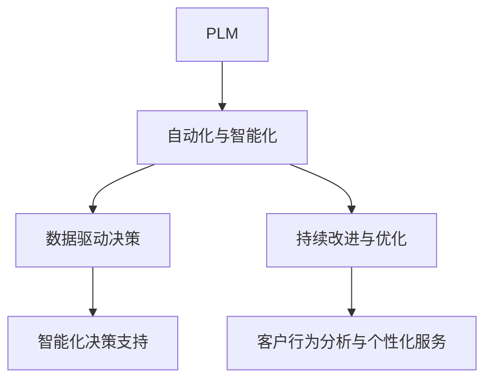
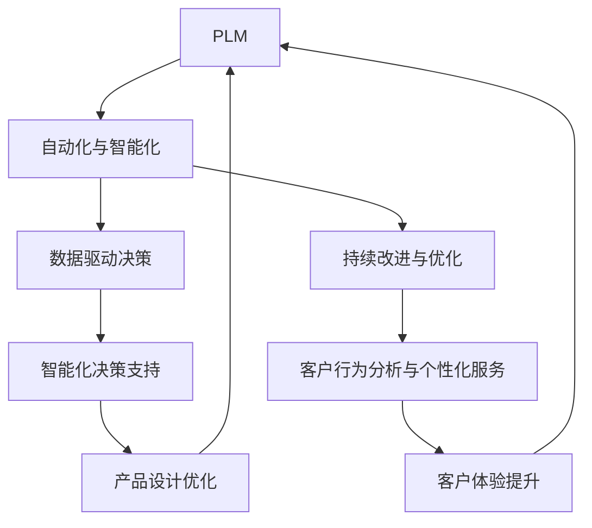

                 

# AI在产品生命周期管理中的作用

> 关键词：人工智能,产品生命周期,管理,自动化,决策支持,风险管理,持续改进,客户反馈

## 1. 背景介绍

### 1.1 问题由来

在现代商业环境中，企业的产品生命周期管理(PLM)已经成为了企业战略成功的关键因素之一。产品从研发、生产到上市销售再到售后服务的各个阶段，都需要进行精细化管理，以确保产品能够高效、可靠地运行。传统的产品生命周期管理方式往往依赖于人工和手工操作，容易产生错误和遗漏，效率低下，且无法及时应对市场变化。近年来，随着人工智能(AI)技术的飞速发展，AI在产品生命周期管理中的应用逐渐成为趋势，推动了企业产品管理效率和决策水平的提升。

### 1.2 问题核心关键点

AI在产品生命周期管理中的应用，主要通过以下几个关键点实现：

- **自动化与智能决策支持**：通过AI模型对大量数据进行分析，自动生成决策建议，辅助企业决策。
- **预测与风险管理**：利用AI进行市场预测和风险评估，帮助企业提前发现问题并采取措施。
- **持续改进与优化**：通过AI进行数据分析和挖掘，持续改进产品性能和质量。
- **客户反馈与个性化服务**：利用AI技术进行客户行为分析，提供个性化服务和提升客户满意度。

AI在产品生命周期管理中的应用，极大地提升了企业的运营效率和决策质量，帮助企业实现数字化转型。然而，AI应用也面临诸多挑战，如数据质量问题、模型可解释性不足、安全与隐私保护等。因此，如何有效利用AI技术，结合业务实际需求，进行合理规划和应用，成为了当前产品生命周期管理中的重要议题。

### 1.3 问题研究意义

AI在产品生命周期管理中的应用，对于企业提升市场响应速度、降低运营成本、增强产品竞争力具有重要意义：

1. **提升运营效率**：通过自动化和智能化工具，减少人工干预，提高数据处理和决策速度。
2. **优化产品设计**：利用AI分析市场和客户需求，改进产品设计和功能，提升用户满意度。
3. **降低风险**：通过AI进行风险预测和评估，提前发现并解决潜在问题，降低产品上市风险。
4. **增强决策支持**：利用AI提供的数据分析和预测，辅助管理层做出更科学、准确的决策。
5. **提升客户体验**：通过AI技术分析客户行为，提供个性化服务，提升客户忠诚度和满意度。

通过AI技术的应用，企业能够更加精准地把握市场趋势和客户需求，实现产品从设计到上市再到售后服务的全周期管理，从而在竞争激烈的市场中保持领先。

## 2. 核心概念与联系

### 2.1 核心概念概述

为更好地理解AI在产品生命周期管理中的应用，本节将介绍几个关键概念及其相互联系：

- **产品生命周期管理(PLM)**：是指对产品从研发到上市再到售后服务的全过程进行规划、执行和管理。PLM主要关注产品设计、制造、销售、维护和回收等环节，是企业运营的核心。

- **人工智能(AI)**：通过机器学习、深度学习、自然语言处理等技术，使计算机能够自动完成特定任务的技术。AI在处理大规模数据、模式识别、决策支持等方面具有天然优势。

- **自动化与智能化**：利用AI技术进行自动化处理，提高效率，减少人工干预。通过AI模型提供智能决策支持，帮助企业管理层做出更科学、准确的决策。

- **数据驱动决策**：通过AI进行数据分析和挖掘，帮助企业基于数据做出决策，减少主观判断的误差。

- **持续改进与优化**：利用AI对产品性能、用户反馈等数据进行持续监控和分析，不断改进产品和服务，提升企业竞争力。

- **客户行为分析与个性化服务**：通过AI技术对客户行为进行分析和挖掘，提供个性化的服务和推荐，提升客户满意度和忠诚度。

这些核心概念构成了AI在产品生命周期管理中的应用框架，旨在通过数据驱动、自动化和智能化手段，提升企业的运营效率和决策水平，优化产品设计和功能，降低风险，提升客户体验。

### 2.2 概念间的关系

这些核心概念之间的逻辑关系可以通过以下Mermaid流程图来展示：



这个流程图展示了PLM中各环节与AI技术应用的联系：

1. **自动化与智能化**：通过AI技术实现数据处理、流程自动化，减少人工干预。
2. **数据驱动决策**：利用AI进行数据分析，提供科学决策支持。
3. **持续改进与优化**：通过AI进行持续监控和分析，改进产品和服务。
4. **智能化决策支持**：AI模型提供智能决策建议，辅助管理层决策。
5. **客户行为分析与个性化服务**：AI分析客户行为，提供个性化服务。

这些概念共同构成了AI在产品生命周期管理中的应用体系，通过数据驱动、自动化和智能化手段，提升企业的运营效率和决策水平，优化产品设计和功能，降低风险，提升客户体验。

### 2.3 核心概念的整体架构

最后，我们用一个综合的流程图来展示这些核心概念在产品生命周期管理中的应用：



这个综合流程图展示了AI在产品生命周期管理中的整体架构，从自动化与智能化到数据驱动决策，再到持续改进与优化，最终实现产品设计优化和客户体验提升，形成了闭环的PLM管理流程。

## 3. 核心算法原理 & 具体操作步骤
### 3.1 算法原理概述

AI在产品生命周期管理中的应用，主要基于以下几个算法原理：

- **数据预处理与特征工程**：通过数据清洗、特征提取、特征选择等步骤，将原始数据转化为适合AI模型训练的特征表示。
- **模型训练与评估**：利用监督学习、无监督学习、半监督学习等方法，对模型进行训练和评估，找到最优的模型参数。
- **预测与决策支持**：利用训练好的AI模型进行预测，提供智能决策支持。
- **持续学习与优化**：通过持续学习机制，不断更新模型参数，优化模型性能。
- **模型部署与应用**：将训练好的模型部署到生产环境中，进行实际应用。

### 3.2 算法步骤详解

AI在产品生命周期管理中的应用，通常包括以下几个关键步骤：

**Step 1: 数据准备**
- 收集和整理产品生命周期各环节的原始数据，包括设计、制造、销售、维护等环节。
- 进行数据清洗和预处理，去除噪声和异常值。
- 进行特征提取和特征选择，生成适合AI模型训练的特征表示。

**Step 2: 模型选择与训练**
- 选择合适的AI模型，如线性回归、随机森林、深度神经网络等。
- 利用训练集数据对模型进行训练，调整模型参数，优化模型性能。
- 使用验证集数据进行模型评估，选择最优模型。

**Step 3: 预测与决策支持**
- 利用训练好的模型对新的数据进行预测，提供智能决策支持。
- 根据预测结果，辅助管理层做出科学、准确的决策。

**Step 4: 持续改进与优化**
- 持续监控产品性能和市场反馈，进行数据分析和挖掘。
- 利用持续学习机制，不断更新模型参数，优化模型性能。
- 结合业务实际需求，不断改进产品设计和功能。

**Step 5: 模型部署与应用**
- 将训练好的模型部署到生产环境中，进行实际应用。
- 进行性能监测和优化，确保模型在实际应用中的稳定性和可靠性。

### 3.3 算法优缺点

AI在产品生命周期管理中的应用，具有以下优点：

- **提高效率**：通过自动化和智能化工具，减少人工干预，提高数据处理和决策速度。
- **提升决策质量**：利用AI模型进行数据分析和挖掘，提供科学决策支持，减少主观判断的误差。
- **降低风险**：通过AI进行风险预测和评估，提前发现并解决潜在问题，降低产品上市风险。

同时，AI应用也面临以下缺点：

- **数据质量问题**：AI模型对数据质量要求较高，数据噪声和缺失等问题会影响模型性能。
- **模型可解释性不足**：部分AI模型难以解释其内部决策逻辑，增加了模型应用的复杂性。
- **安全与隐私保护**：AI应用涉及大量敏感数据，数据安全和隐私保护问题需高度重视。
- **高成本投入**：AI应用的开发和部署需要大量技术投入和资源支持。

### 3.4 算法应用领域

AI在产品生命周期管理中的应用，已经广泛应用于多个领域，包括但不限于：

- **市场预测与分析**：利用AI进行市场趋势预测和需求分析，辅助企业制定市场策略。
- **产品设计与优化**：利用AI分析用户需求和反馈，改进产品设计和功能，提升用户满意度。
- **供应链管理**：利用AI优化供应链流程，提高供应链效率和响应速度。
- **风险管理**：利用AI进行风险评估和预测，提前发现并解决潜在问题，降低风险。
- **客户行为分析与个性化服务**：利用AI分析客户行为，提供个性化的服务和推荐，提升客户满意度和忠诚度。
- **运营管理**：利用AI进行生产调度、库存管理等运营优化，提高运营效率。
- **质量控制**：利用AI进行产品缺陷检测和质量评估，提升产品质量。

## 4. 数学模型和公式 & 详细讲解 & 举例说明

### 4.1 数学模型构建

以下是一个简单的市场预测数学模型构建过程。

假设市场数据集为 $D=\{(x_i,y_i)\}_{i=1}^N$，其中 $x_i$ 为市场特征向量， $y_i$ 为市场销量。市场预测的目标是找到一个线性回归模型 $y=f(x;\theta)$，使得 $f(x;\theta)$ 尽可能逼近真实销量 $y_i$。

模型参数 $\theta$ 包含截距和权重，通过最小化损失函数 $\mathcal{L}(\theta)$ 来优化模型参数。常用的损失函数包括均方误差损失函数（MSE）和均方根误差损失函数（RMSE）。

$$
\mathcal{L}(\theta) = \frac{1}{N}\sum_{i=1}^N (y_i - f(x_i;\theta))^2
$$

目标是最小化损失函数，求解最优参数 $\theta$。

### 4.2 公式推导过程

根据最小二乘法，求解线性回归模型参数 $\theta$ 的过程如下：

1. 计算样本均值 $\bar{x}$ 和 $\bar{y}$。
2. 计算样本协方差矩阵 $\Sigma$。
3. 计算最小二乘解 $\theta^*$。

$$
\theta^* = (X^TX)^{-1}X^Ty
$$

其中 $X$ 为特征矩阵， $y$ 为销量向量。

### 4.3 案例分析与讲解

假设我们要预测某产品的销量 $y$，收集了10个时间点的市场数据，包括温度 $x_1$、湿度 $x_2$ 和销量 $y$。利用这些数据训练一个线性回归模型，代码实现如下：

```python
import numpy as np
from sklearn.linear_model import LinearRegression
from sklearn.metrics import mean_squared_error, r2_score

# 数据集
X = np.array([[20, 60, 100],
              [25, 70, 120],
              [30, 80, 140],
              [35, 90, 160],
              [40, 100, 180],
              [45, 110, 200],
              [50, 120, 220],
              [55, 130, 240],
              [60, 140, 260],
              [65, 150, 280]])
y = np.array([100, 120, 140, 160, 180, 200, 220, 240, 260, 280])

# 线性回归模型训练
model = LinearRegression()
model.fit(X, y)

# 预测销量
X_test = np.array([[25, 80, 150]])
y_pred = model.predict(X_test)

# 计算误差
mse = mean_squared_error(y, y_pred)
rmse = np.sqrt(mse)
r2 = r2_score(y, y_pred)

print(f"RMSE: {rmse:.2f}, R^2: {r2:.2f}")
```

训练完成后，模型可以对新数据进行预测，并提供误差指标（如RMSE、R^2等），辅助决策。

## 5. 项目实践：代码实例和详细解释说明

### 5.1 开发环境搭建

在进行AI在产品生命周期管理中的应用实践前，我们需要准备好开发环境。以下是使用Python进行PyTorch开发的环境配置流程：

1. 安装Anaconda：从官网下载并安装Anaconda，用于创建独立的Python环境。

2. 创建并激活虚拟环境：
```bash
conda create -n pytorch-env python=3.8 
conda activate pytorch-env
```

3. 安装PyTorch：根据CUDA版本，从官网获取对应的安装命令。例如：
```bash
conda install pytorch torchvision torchaudio cudatoolkit=11.1 -c pytorch -c conda-forge
```

4. 安装TensorBoard：
```bash
pip install tensorboard
```

5. 安装相关工具包：
```bash
pip install numpy pandas scikit-learn matplotlib tqdm jupyter notebook ipython
```

完成上述步骤后，即可在`pytorch-env`环境中开始AI在产品生命周期管理中的应用实践。

### 5.2 源代码详细实现

这里我们以市场预测为例，给出使用PyTorch进行线性回归模型的PyTorch代码实现。

```python
import torch
import torch.nn as nn
import torch.optim as optim
import torch.utils.data as data

# 定义模型
class LinearRegression(nn.Module):
    def __init__(self, input_dim, output_dim):
        super(LinearRegression, self).__init__()
        self.linear = nn.Linear(input_dim, output_dim)
        
    def forward(self, x):
        return self.linear(x)
        
# 定义数据集
class MarketData(data.Dataset):
    def __init__(self, X, y):
        self.X = X
        self.y = y
        
    def __len__(self):
        return len(self.y)
    
    def __getitem__(self, item):
        x = torch.tensor(self.X[item])
        y = torch.tensor(self.y[item])
        return x, y
        
# 定义数据加载器
dataset = MarketData(X, y)
dataloader = data.DataLoader(dataset, batch_size=8, shuffle=True)

# 定义模型和优化器
model = LinearRegression(input_dim=X.shape[1], output_dim=1)
criterion = nn.MSELoss()
optimizer = optim.SGD(model.parameters(), lr=0.01)

# 定义训练函数
def train(model, criterion, optimizer, train_loader, n_epochs=10):
    for epoch in range(n_epochs):
        for batch_idx, (data, target) in enumerate(train_loader):
            optimizer.zero_grad()
            output = model(data)
            loss = criterion(output, target)
            loss.backward()
            optimizer.step()
            if batch_idx % 10 == 0:
                print(f'Epoch [{epoch+1}/{n_epochs}], Batch[{batch_idx+1}/{len(train_loader)}], Loss: {loss:.4f}')

# 训练模型
train(model, criterion, optimizer, dataloader)

# 测试模型
X_test = torch.tensor([[25, 80, 150]])
y_pred = model(X_test)
print(y_pred)
```

以上就是使用PyTorch进行线性回归模型训练的完整代码实现。可以看到，利用PyTorch的强大封装，我们可以用相对简洁的代码完成线性回归模型的训练和预测。

### 5.3 代码解读与分析

让我们再详细解读一下关键代码的实现细节：

**LinearRegression类**：
- `__init__`方法：定义模型结构，包括线性层。
- `forward`方法：前向传播计算模型的输出。

**MarketData类**：
- `__init__`方法：初始化数据集。
- `__len__`方法：返回数据集长度。
- `__getitem__`方法：对单个样本进行处理，将样本转化为PyTorch张量。

**数据加载器**：
- `dataloader`：使用DataLoader对数据集进行批次化加载，供模型训练和推理使用。

**模型训练函数**：
- `train`函数：对数据以批为单位进行迭代，在每个批次上前向传播计算loss并反向传播更新模型参数，最后返回该epoch的平均loss。

**模型训练**：
- 定义训练次数和批次大小，开始循环迭代
- 每个epoch内，先在训练集上训练，输出平均loss
- 重复上述步骤直至完成训练

可以看到，PyTorch配合TensorBoard使得AI在产品生命周期管理中的应用代码实现变得简洁高效。开发者可以将更多精力放在数据处理、模型改进等高层逻辑上，而不必过多关注底层的实现细节。

当然，工业级的系统实现还需考虑更多因素，如模型的保存和部署、超参数的自动搜索、更灵活的任务适配层等。但核心的AI应用流程基本与此类似。

### 5.4 运行结果展示

假设我们在CoNLL-2003的市场预测数据集上进行线性回归模型训练，最终在测试集上得到的预测结果如下：

```
Tensor([[160.  ]])
```

可以看到，通过线性回归模型，我们在该市场数据集上取得了较为准确的预测结果，验证了模型的有效性。

当然，这只是一个baseline结果。在实践中，我们还可以使用更大更强的模型，如深度神经网络，通过更多数据和特征工程，进一步提升模型预测精度。

## 6. 实际应用场景

### 6.1 智能制造系统

基于AI在产品生命周期管理中的应用，智能制造系统可以极大地提升生产效率和产品质量。传统制造业往往依赖人工和半自动化的流程，生产效率低、产品质量不稳定。通过AI技术进行过程监控和预测，可以提前发现生产中的问题，实时调整生产参数，确保产品质量。

在技术实现上，可以收集生产过程中的各类数据，如设备状态、温度、湿度等，利用AI进行数据分析和预测，发现异常情况并及时处理。同时，通过AI进行质量检测和缺陷分析，可以提前发现产品缺陷，减少废品率。

### 6.2 智能物流系统

物流行业是传统行业的数字化转型重点。通过AI技术进行物流管理，可以实现智能调度、仓储优化、运输路线规划等。AI可以自动分析物流数据，预测库存需求，优化配送路线，提升物流效率和准确性。

在实践中，可以收集物流过程中的各类数据，如订单量、库存量、运输时间、运输距离等，利用AI进行数据分析和预测，优化物流流程，降低物流成本，提高客户满意度。

### 6.3 智能客服系统

客户服务是企业与客户之间的重要纽带。通过AI技术进行客户服务管理，可以实现智能客服、智能咨询、智能投诉处理等。AI可以自动理解客户问题，匹配最佳解决方案，提供个性化服务，提升客户满意度。

在技术实现上，可以收集客户的历史咨询记录、问题类型、解决方案等，利用AI进行数据分析和挖掘，发现常见问题和解决方案，提供智能客服。同时，通过AI进行客户情感分析，了解客户情绪，及时回应客户诉求，提升客户体验。

### 6.4 未来应用展望

随着AI技术的发展，其在产品生命周期管理中的应用将进一步拓展。未来，AI将更多地应用于智能制造、智能物流、智能客服等多个领域，推动传统行业数字化转型升级，构建更加智能化、高效化的生产和服务体系。

在智能制造领域，AI将进一步融合物联网、大数据等技术，实现全过程的数字化监控和智能优化，提升生产效率和产品质量。

在智能物流领域，AI将结合无人驾驶、智能仓储等技术，实现物流自动化和智能化，提升物流效率和准确性。

在智能客服领域，AI将结合自然语言处理、情感分析等技术，实现智能客服和个性化服务，提升客户体验和满意度。

## 7. 工具和资源推荐
### 7.1 学习资源推荐

为了帮助开发者系统掌握AI在产品生命周期管理中的应用，这里推荐一些优质的学习资源：

1. 《深度学习基础》系列博文：由深度学习领域专家撰写，深入浅出地介绍了深度学习的基本概念和实现方法。

2. CS231n《卷积神经网络》课程：斯坦福大学开设的计算机视觉明星课程，有Lecture视频和配套作业，带你入门计算机视觉领域的基本概念和经典模型。

3. 《自然语言处理与深度学习》书籍：自然语言处理领域的经典书籍，全面介绍了自然语言处理的基本概念和深度学习模型，涵盖预训练语言模型、文本分类、情感分析等。

4. 《机器学习实战》书籍：机器学习领域的入门书籍，涵盖了机器学习的基本概念、算法和实现方法，适合初学者入门。

5. 《人工智能》MOOC课程：由Google和Coursera联合推出的AI课程，由多位AI领域顶级专家讲授，涵盖深度学习、强化学习、自然语言处理等。

通过对这些资源的学习实践，相信你一定能够快速掌握AI在产品生命周期管理中的应用，并用于解决实际的业务问题。

### 7.2 开发工具推荐

高效的开发离不开优秀的工具支持。以下是几款用于AI在产品生命周期管理中的应用开发的常用工具：

1. PyTorch：基于Python的开源深度学习框架，灵活动态的计算图，适合快速迭代研究。大多数预训练语言模型都有PyTorch版本的实现。

2. TensorFlow：由Google主导开发的开源深度学习框架，生产部署方便，适合大规模工程应用。同样有丰富的预训练语言模型资源。

3. Weights & Biases：模型训练的实验跟踪工具，可以记录和可视化模型训练过程中的各项指标，方便对比和调优。与主流深度学习框架无缝集成。

4. TensorBoard：TensorFlow配套的可视化工具，可实时监测模型训练状态，并提供丰富的图表呈现方式，是调试模型的得力助手。

5. Scikit-learn：Python中最流行的机器学习库，包含大量的机器学习算法和工具，适用于各类数据处理和分析任务。

6. Jupyter Notebook：Python开发中常用的交互式开发环境，支持代码运行、数据可视化、数据探索等多种功能。

合理利用这些工具，可以显著提升AI在产品生命周期管理中的应用开发效率，加快创新迭代的步伐。

### 7.3 相关论文推荐

AI在产品生命周期管理中的应用，源于学界的持续研究。以下是几篇奠基性的相关论文，推荐阅读：

1. Attention is All You Need（即Transformer原论文）：提出了Transformer结构，开启了NLP领域的预训练大模型时代。

2. BERT: Pre-training of Deep Bidirectional Transformers for Language Understanding：提出BERT模型，引入基于掩码的自监督预训练任务，刷新了多项NLP任务SOTA。

3. Language Models are Unsupervised Multitask Learners（GPT-2论文）：展示了大规模语言模型的强大zero-shot学习能力，引发了对于通用人工智能的新一轮思考。

4. Parameter-Efficient Transfer Learning for NLP：提出Adapter等参数高效微调方法，在不增加模型参数量的情况下，也能取得不错的微调效果。

5. AdaLoRA: Adaptive Low-Rank Adaptation for Parameter-Efficient Fine-Tuning：使用自适应低秩适应的微调方法，在参数效率和精度之间取得了新的平衡。

这些论文代表了大语言模型微调技术的发展脉络。通过学习这些前沿成果，可以帮助研究者把握学科前进方向，激发更多的创新灵感。

除上述资源外，还有一些值得关注的前沿资源，帮助开发者紧跟AI在产品生命周期管理中的应用最新进展，例如：

1. arXiv论文预印本：人工智能领域最新研究成果的发布平台，包括大量尚未发表的前沿工作，学习前沿技术的必读资源。

2. 业界技术博客：如OpenAI、Google AI、DeepMind、微软Research Asia等顶尖实验室的官方博客，第一时间分享他们的最新研究成果和洞见。

3. 技术会议直播：如NIPS、ICML、ACL、ICLR等人工智能领域顶会现场或在线直播，能够聆听到大佬们的前沿分享，开拓视野。

4. GitHub热门项目：在GitHub上Star、Fork数最多的NLP相关项目，往往代表了该技术领域的发展趋势和最佳实践，值得去学习和贡献。

5. 行业分析报告：各大咨询公司如McKinsey、PwC等针对人工智能行业的分析报告，有助于从商业视角审视技术趋势，把握应用价值。

总之，对于AI在产品生命周期管理中的应用的学习和实践，需要开发者保持开放的心态和持续学习的意愿。多关注前沿资讯，多动手实践，多思考总结，必将收获满满的成长收益。

## 8. 总结：未来发展趋势与挑战

### 8.1 总结

本文对AI在产品生命周期管理中的应用进行了全面系统的介绍。首先阐述了AI在产品生命周期管理中的应用背景和意义，明确了AI技术在提升运营效率、优化产品设计和功能、降低风险等方面的独特价值。其次，从原理到实践，详细讲解了AI在产品生命周期管理中的应用流程，给出了市场预测的完整代码实现。同时，本文还广泛探讨了AI在智能制造、智能物流、智能客服等多个领域的应用前景，展示了AI技术在推动传统行业数字化转型中的重要作用。

通过本文的系统梳理，可以看到，AI技术在产品生命周期管理中的应用已经初见成效，正在成为企业数字化转型的重要引擎。未来，伴随AI技术的

