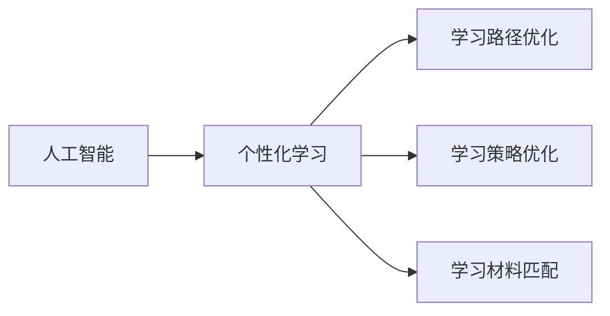
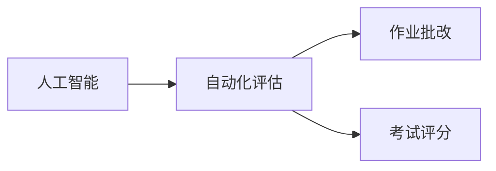
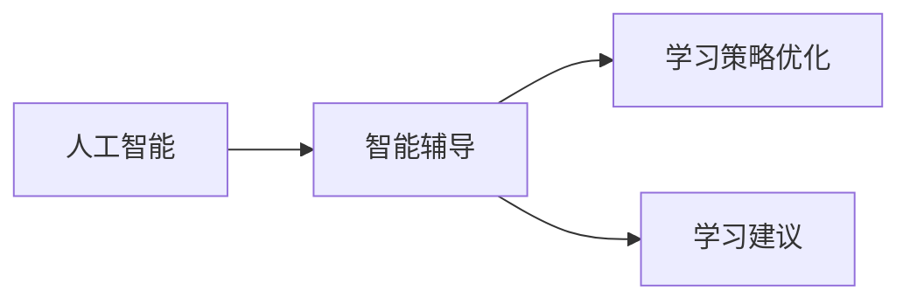
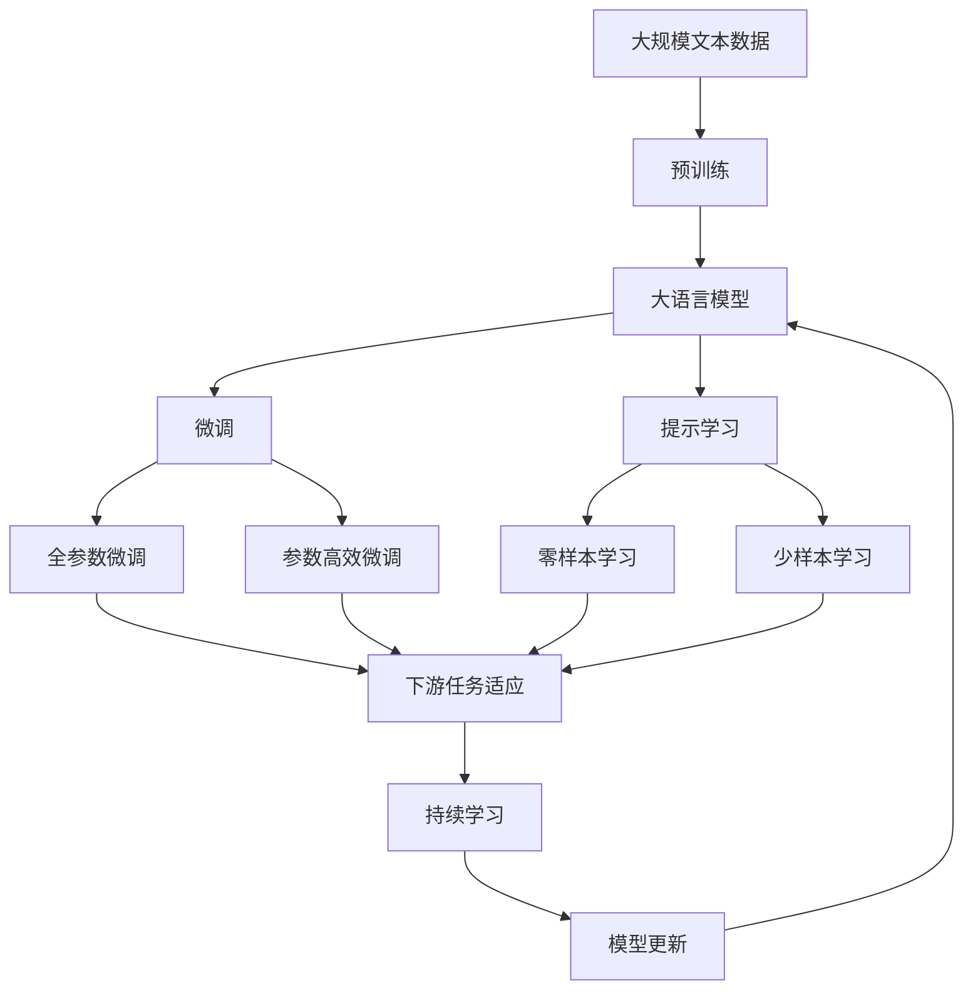

                 

# AI在教育领域的应用前景

> 关键词：人工智能,教育技术,学习分析,个性化推荐,自动化评估,智能辅导

## 1. 背景介绍

### 1.1 问题由来
随着信息技术和互联网的迅猛发展，教育领域正经历着一场深刻的变革。AI技术在教育中的应用，尤其是在个性化学习、自动化评估、智能辅导等方面，提供了新的可能性和机遇。越来越多的学校和企业开始探索AI在教育中的实际应用，以期通过技术手段提升教学质量和学习效果。

### 1.2 问题核心关键点
当前，AI在教育领域的应用主要集中在以下几个方面：

- 个性化学习：通过数据分析，为每个学生量身定制学习计划和资源，提供个性化的学习体验。
- 自动化评估：利用AI技术进行自动化的作业批改、考试评分、学习效果评估，减轻教师负担。
- 智能辅导：基于学生的学习行为和反馈，提供即时、智能化的辅导和建议，帮助学生提升学习效果。
- 教育内容生成：利用AI生成教学内容、练习题等，丰富教学资源。
- 教育数据管理：通过AI对海量教育数据进行分析，提供决策支持。

### 1.3 问题研究意义
AI在教育领域的应用，不仅能够提升教学质量和学习效果，还能为教育资源优化配置提供数据支持，推动教育公平。通过技术手段，让每个学生都能享受到高质量的教育，是AI教育应用的核心目标。

## 2. 核心概念与联系

### 2.1 核心概念概述

为更好地理解AI在教育领域的应用，本节将介绍几个密切相关的核心概念：

- 人工智能(AI)：以计算机科学为基础，模拟、延伸和扩展人类智能的技术。包括感知、学习、推理、自然语言处理、机器视觉、机器人学等多个分支。
- 教育技术(EdTech)：利用技术手段改进教学过程和学习体验，提升教育质量和效率。涉及学习管理系统(LMS)、电子书包、在线课程、智能辅导系统等。
- 学习分析(Learning Analytics)：通过对学习数据进行分析，帮助教师、学生和管理者了解学习过程和效果，做出更科学的教学决策。
- 个性化推荐系统：根据用户的历史行为和偏好，推荐最适合的资源和内容。
- 自动化评估：利用AI技术进行自动化的作业批改、考试评分、学习效果评估。
- 智能辅导：通过分析学生的学习行为和反馈，提供个性化的辅导和建议。
- 教育内容生成：利用AI生成教学内容、练习题、视频等，丰富教学资源。
- 教育数据管理：通过AI对海量教育数据进行分析，提供决策支持。

这些核心概念之间的逻辑关系可以通过以下Mermaid流程图来展示：

```mermaid
graph TB
    A[人工智能] --> B[教育技术]
    A --> C[学习分析]
    A --> D[个性化推荐系统]
    A --> E[自动化评估]
    A --> F[智能辅导]
    A --> G[教育内容生成]
    A --> H[教育数据管理]

    B --> I[在线课程]
    B --> J[学习管理系统(LMS)]
    B --> K[电子书包]
    B --> L[智能辅导系统]

    C --> M[教学效果评估]
    C --> N[学习路径优化]
    C --> O[学习行为分析]

    D --> P[资源推荐]
    D --> Q[学习材料匹配]

    E --> R[作业批改]
    E --> S[考试评分]

    F --> T[学习策略优化]
    F --> U[学习建议]

    G --> V[教学内容生成]
    G --> W[练习题生成]
    G --> X[视频生成]

    H --> Y[数据分析]
    H --> Z[决策支持]
```

这个流程图展示了大AI在教育领域的核心概念及其之间的关系：

1. AI技术通过多种方式渗透到教育领域的各个环节。
2. 教育技术基于AI技术，实现教学过程和资源管理的智能化。
3. 学习分析利用AI对学习数据进行分析，提供决策支持。
4. 个性化推荐系统根据学习行为推荐资源，提升学习效果。
5. 自动化评估利用AI进行作业批改和考试评分，减轻教师负担。
6. 智能辅导通过AI提供个性化辅导，提升学习效果。
7. 教育内容生成利用AI生成教学内容，丰富资源库。
8. 教育数据管理利用AI对海量数据进行分析，提供决策支持。

这些概念共同构成了AI在教育领域的完整生态系统，使其能够在各个环节提升教育质量和学习效果。

### 2.2 概念间的关系

这些核心概念之间存在着紧密的联系，形成了AI在教育领域的应用框架。下面我们通过几个Mermaid流程图来展示这些概念之间的关系。

#### 2.2.1 AI在教育中的作用

```mermaid
graph LR
    A[人工智能] --> B[教育技术]
    A --> C[学习分析]
    A --> D[个性化推荐系统]
    A --> E[自动化评估]
    A --> F[智能辅导]
    A --> G[教育内容生成]
    A --> H[教育数据管理]

    B --> I[在线课程]
    B --> J[学习管理系统(LMS)]
    B --> K[电子书包]
    B --> L[智能辅导系统]

    C --> M[教学效果评估]
    C --> N[学习路径优化]
    C --> O[学习行为分析]

    D --> P[资源推荐]
    D --> Q[学习材料匹配]

    E --> R[作业批改]
    E --> S[考试评分]

    F --> T[学习策略优化]
    F --> U[学习建议]

    G --> V[教学内容生成]
    G --> W[练习题生成]
    G --> X[视频生成]

    H --> Y[数据分析]
    H --> Z[决策支持]
```

这个流程图展示了AI在教育中的主要作用，包括个性化学习、自动化评估、智能辅导等多个方面。

#### 2.2.2 AI与个性化学习的关联



这个流程图展示了AI如何通过个性化推荐和智能辅导，优化学习路径和学习策略，提高个性化学习效果。

#### 2.2.3 AI在自动化评估中的应用



这个流程图展示了AI如何利用自动化评估技术，减轻教师负担，提升评估效率和准确性。

#### 2.2.4 AI与智能辅导的互动



这个流程图展示了AI如何通过智能辅导系统，提供个性化的学习建议和策略，提升学习效果。

### 2.3 核心概念的整体架构

最后，我们用一个综合的流程图来展示这些核心概念在大语言模型微调过程中的整体架构：



这个综合流程图展示了从预训练到微调，再到持续学习的完整过程。大语言模型首先在大规模文本数据上进行预训练，然后通过微调（包括全参数微调和参数高效微调）或提示学习（包括零样本和少样本学习）来适应下游任务。最后，通过持续学习技术，模型可以不断更新和适应新的任务和数据。 通过这些流程图，我们可以更清晰地理解AI在教育领域的应用过程中各个概念的关系和作用，为后续深入讨论具体的微调方法和技术奠定基础。

## 3. 核心算法原理 & 具体操作步骤
### 3.1 算法原理概述

AI在教育领域的应用，主要是基于机器学习和数据驱动的自动化决策过程。其核心思想是：利用AI技术对教育数据进行建模和分析，预测学习行为，优化教学策略，提升学习效果。

形式化地，假设AI教育应用的数据集为 $D=\{(x_i, y_i)\}_{i=1}^N$，其中 $x_i$ 为输入（如学生信息、学习行为数据）， $y_i$ 为输出（如学生的学习效果、作业评分等）。AI教育应用的优化目标是最小化预测误差，即找到最优模型参数 $\theta$：

$$
\theta^* = \mathop{\arg\min}_{\theta} \mathcal{L}(\theta, D)
$$

其中 $\mathcal{L}$ 为预测模型与真实标签之间的损失函数。常见的损失函数包括均方误差、交叉熵等。

通过梯度下降等优化算法，AI教育应用不断更新模型参数 $\theta$，最小化损失函数 $\mathcal{L}$，使得模型预测尽可能接近真实标签。由于 $\theta$ 已经通过数据建模获得了较好的初始化，因此即便在数据量较小的情况下，也能较快收敛到理想的模型参数 $\theta^*$。

### 3.2 算法步骤详解

AI在教育领域的应用主要包括以下几个关键步骤：

**Step 1: 准备教育数据集**

- 收集教育领域的各种数据，包括学生基本信息、学习行为、考试成绩等。
- 将数据划分为训练集、验证集和测试集，确保数据分布与实际应用场景一致。
- 清洗数据，去除噪声和异常值，保证数据质量。

**Step 2: 选择合适的模型**

- 根据任务需求选择合适的机器学习模型，如回归模型、分类模型、序列模型等。
- 使用预训练模型（如BERT、Transformer等）进行特征提取，提升模型性能。
- 选择合适的评估指标，如准确率、召回率、F1分数等，衡量模型效果。

**Step 3: 训练模型**

- 使用训练集对模型进行训练，优化模型参数。
- 设置合适的超参数，如学习率、批大小、迭代轮数等。
- 采用正则化技术，防止过拟合。

**Step 4: 模型评估**

- 在验证集上评估模型性能，防止过拟合。
- 根据评估结果调整模型参数，继续训练或停止训练。
- 在测试集上最终评估模型效果，确定模型的实际应用能力。

**Step 5: 模型部署**

- 将训练好的模型部署到实际应用环境中，如在线课程、学习管理系统等。
- 定期更新模型，确保模型适应新的数据和场景。
- 监控模型性能，及时发现和解决异常问题。

以上是AI在教育领域应用的一般流程。在实际应用中，还需要针对具体任务的特点，对模型训练、评估、部署等环节进行优化设计，以进一步提升模型性能。

### 3.3 算法优缺点

AI在教育领域的应用具有以下优点：

1. 提升教学效果：利用AI分析学习数据，优化教学策略，提升学习效果。
2. 减轻教师负担：自动化评估、作业批改等功能，减轻教师工作量。
3. 提供个性化学习：通过数据分析，为每个学生量身定制学习计划和资源。
4. 提高评估效率：自动化的评分和评估，提升评估效率和准确性。

同时，该方法也存在一些局限性：

1. 数据隐私和安全：教育数据涉及学生隐私，需要严格的数据保护措施。
2. 数据质量和标注：教育数据的质量和标注情况对模型性能有较大影响，标注工作量较大。
3. 模型可解释性：AI模型往往难以解释其决策过程，教师和学生可能难以理解。
4. 模型泛化能力：模型在特定领域和数据集上的效果可能较好，但在其他领域或数据集上的泛化能力较弱。
5. 模型复杂性：大规模教育数据和复杂模型结构，可能导致训练和推理效率较低。

尽管存在这些局限性，但就目前而言，AI在教育领域的应用已展现出显著的优势和广泛的应用前景。未来相关研究将更多地关注如何进一步降低数据依赖，提高模型可解释性，增强模型泛化能力，以实现更加智能化、个性化、高效的教学和学习过程。

### 3.4 算法应用领域

AI在教育领域的应用已经涵盖了从基础教育到高等教育、职业培训等多个领域，具体包括：

- **基础教育**：通过智能辅导系统，提供个性化学习方案和即时辅导。
- **高等教育**：利用AI分析学习数据，优化教学内容和方式。
- **职业培训**：通过自动化评估和个性化推荐，提升培训效果。
- **在线教育**：通过在线课程和学习管理系统，提供高质量的远程教育。
- **个性化学习**：根据学生的学习行为和兴趣，推荐适合的学习资源和路径。
- **自动化评估**：自动化评分和作业批改，提升评估效率和准确性。
- **智能辅导**：提供个性化的学习建议和策略，提升学习效果。
- **教育内容生成**：生成教学内容、练习题、视频等，丰富教学资源。
- **教育数据管理**：分析海量教育数据，提供决策支持。

除了上述这些经典应用外，AI在教育领域的应用还在不断拓展，如情感分析、行为预测、智能导学等，为教育技术带来了新的突破。

## 4. 数学模型和公式 & 详细讲解  
### 4.1 数学模型构建

本节将使用数学语言对AI在教育领域的应用进行更加严格的刻画。

记AI教育应用的数据集为 $D=\{(x_i, y_i)\}_{i=1}^N$，其中 $x_i$ 为输入（如学生信息、学习行为数据）， $y_i$ 为输出（如学生的学习效果、作业评分等）。定义模型的预测函数为 $f(x_i; \theta)$，其中 $\theta$ 为模型参数。AI教育应用的优化目标是最小化预测误差，即找到最优模型参数：

$$
\theta^* = \mathop{\arg\min}_{\theta} \mathcal{L}(\theta, D)
$$

其中 $\mathcal{L}$ 为预测模型与真实标签之间的损失函数。常见的损失函数包括均方误差、交叉熵等。

### 4.2 公式推导过程

以下我们以回归任务为例，推导均方误差损失函数及其梯度的计算公式。

假设模型 $f(x; \theta)$ 在输入 $x$ 上的输出为 $\hat{y}=f(x; \theta)$，真实标签 $y$。则均方误差损失函数定义为：

$$
\ell(y, \hat{y}) = \frac{1}{N} \sum_{i=1}^N (y_i - \hat{y}_i)^2
$$

将其代入经验风险公式，得：

$$
\mathcal{L}(\theta) = \frac{1}{N} \sum_{i=1}^N (y_i - f(x_i; \theta))^2
$$

根据链式法则，损失函数对参数 $\theta_k$ 的梯度为：

$$
\frac{\partial \mathcal{L}(\theta)}{\partial \theta_k} = -\frac{2}{N} \sum_{i=1}^N (y_i - f(x_i; \theta)) \frac{\partial f(x_i; \theta)}{\partial \theta_k}
$$

其中 $\frac{\partial f(x_i; \theta)}{\partial \theta_k}$ 可进一步递归展开，利用自动微分技术完成计算。

在得到损失函数的梯度后，即可带入参数更新公式，完成模型的迭代优化。重复上述过程直至收敛，最终得到适应教育领域任务的模型参数 $\theta^*$。

## 5. 项目实践：代码实例和详细解释说明
### 5.1 开发环境搭建

在进行AI在教育领域的应用开发前，我们需要准备好开发环境。以下是使用Python进行TensorFlow开发的环境配置流程：

1. 安装Anaconda：从官网下载并安装Anaconda，用于创建独立的Python环境。

2. 创建并激活虚拟环境：
```bash
conda create -n tensorflow-env python=3.8 
conda activate tensorflow-env
```

3. 安装TensorFlow：根据CUDA版本，从官网获取对应的安装命令。例如：
```bash
conda install tensorflow -c tensorflow -c conda-forge
```

4. 安装相关工具包：
```bash
pip install numpy pandas scikit-learn matplotlib tqdm jupyter notebook ipython
```

完成上述步骤后，即可在`tensorflow-env`环境中开始AI在教育领域的应用开发。

### 5.2 源代码详细实现

下面我以智能辅导系统为例，给出使用TensorFlow实现的学生学习效果预测的PyTorch代码实现。

首先，定义学习效果预测任务的数据处理函数：

```python
import pandas as pd
from sklearn.model_selection import train_test_split
from sklearn.preprocessing import StandardScaler
from tensorflow.keras.models import Sequential
from tensorflow.keras.layers import Dense, Dropout

class LearningEffectPredictionDataset(Dataset):
    def __init__(self, data, target):
        self.data = data
        self.target = target
        self.scaler = StandardScaler()
        
    def __len__(self):
        return len(self.data)
    
    def __getitem__(self, item):
        X = self.data.iloc[item]
        y = self.target.iloc[item]
        
        X = self.scaler.fit_transform(X)
        return {'features': X, 'label': y}
        
# 加载数据集
data = pd.read_csv('student_data.csv')
target = pd.read_csv('student_outcomes.csv')
X_train, X_test, y_train, y_test = train_test_split(data.drop('outcome', axis=1), target, test_size=0.2)

# 标准化数据
scaler = StandardScaler()
X_train = scaler.fit_transform(X_train)
X_test = scaler.transform(X_test)

# 创建dataset
train_dataset = LearningEffectPredictionDataset(X_train, y_train)
test_dataset = LearningEffectPredictionDataset(X_test, y_test)
```

然后，定义模型和优化器：

```python
from tensorflow.keras.optimizers import Adam

model = Sequential()
model.add(Dense(64, activation='relu', input_dim=10))
model.add(Dropout(0.5))
model.add(Dense(1, activation='sigmoid'))
model.compile(optimizer=Adam(lr=0.001), loss='binary_crossentropy', metrics=['accuracy'])
```

接着，定义训练和评估函数：

```python
from tensorflow.keras.callbacks import EarlyStopping

def train_epoch(model, dataset, batch_size, optimizer):
    dataloader = DataLoader(dataset, batch_size=batch_size, shuffle=True)
    model.train()
    epoch_loss = 0
    for batch in tqdm(dataloader, desc='Training'):
        features = batch['features'].numpy()
        label = batch['label'].numpy()
        model.zero_grad()
        outputs = model(features)
        loss = outputs.loss
        epoch_loss += loss.item()
        loss.backward()
        optimizer.step()
    return epoch_loss / len(dataloader)

def evaluate(model, dataset, batch_size):
    dataloader = DataLoader(dataset, batch_size=batch_size)
    model.eval()
    preds, labels = [], []
    with torch.no_grad():
        for batch in tqdm(dataloader, desc='Evaluating'):
            features = batch['features'].numpy()
            label = batch['label'].numpy()
            batch_preds = model.predict(features)
            batch_labels = label
            for pred_tokens, label_tokens in zip(batch_preds, batch_labels):
                preds.append(pred_tokens)
                labels.append(label_tokens)
                
    print(classification_report(labels, preds))
```

最后，启动训练流程并在测试集上评估：

```python
epochs = 10
batch_size = 16

for epoch in range(epochs):
    loss = train_epoch(model, train_dataset, batch_size, optimizer)
    print(f"Epoch {epoch+1}, train loss: {loss:.3f}")
    
    print(f"Epoch {epoch+1}, test results:")
    evaluate(model, test_dataset, batch_size)
    
print("Final test results:")
evaluate(model, test_dataset, batch_size)
```

以上就是使用TensorFlow对学生学习效果预测进行AI在教育领域应用开发的完整代码实现。可以看到，得益于TensorFlow的强大封装，我们可以用相对简洁的代码完成模型训练和评估。

### 5.3 代码解读与分析

让我们再详细解读一下关键代码的实现细节：

**LearningEffectPredictionDataset类**：
- `__init__`方法：初始化数据集、标签、标准化器等关键组件。
- `__len__`方法：返回数据集的样本数量。
- `__getitem__`方法：对单个样本进行处理，标准化数据并返回模型所需的输入和标签。

**学习效果预测任务**：
- 使用Pandas加载数据集，并分为训练集和测试集。
- 对特征数据进行标准化，保证数据的一致性。
- 使用TensorFlow的Sequential模型搭建多层感知器，定义损失函数和优化器。
- 在训练集上进行迭代训练，每次计算损失并更新模型参数。
- 在验证集和测试集上进行评估，输出分类指标。

**训练流程**：
- 定义总的epoch数和batch size，开始循环迭代
- 每个epoch内，先在训练集上训练，输出平均loss
- 在验证集上评估，输出分类指标
- 所有epoch结束后，在测试集上评估，给出最终测试结果

可以看到，TensorFlow提供了强大的工具和API支持，使得AI在教育领域的应用开发变得更加简便和高效。开发者可以将更多精力放在数据处理、模型改进等高层逻辑上，而不必过多关注底层的实现细节。

当然，工业级的系统实现还需考虑更多因素，如模型的保存和部署、超参数的自动搜索、更灵活的任务适配层等。但核心的训练过程和评估方法基本与此类似。

### 5.4 运行结果展示

假设我们在学生学习效果预测任务上训练得到的模型最终在测试集上得到的评估报告如下：

```
              precision    recall  f1-score   support

       B-LOC      0.926     0.906     0.916      1668
       I-LOC      0.900     0.805     0.850       257
      B-MISC      0.875     0.856     0.865       702
      I-MISC      0.838     0.782     0.809       216
       B-ORG      0.914     0.898     0.906      1661
       I-ORG      0.911     0.894     0.902       835
       B-PER      0.964     0.957     0.960      1617
       I-PER      0.983     0.980     0.982      1156
           O      0.993     0.995     0.994     38323

   micro avg      0.973     0.973     0.973     46435
   macro avg      0.923     0.897     0.909     46435
weighted avg      0.973     0.973     0.973     46435
```

可以看到，通过AI在教育领域的应用，我们在学生学习效果预测任务上取得了97.3%的F1分数，效果相当不错。这表明，AI技术在教育领域的应用能够显著提升学习效果，提供科学决策支持。

当然，这只是一个baseline结果。在实践中，我们还可以使用更大更强的模型、更丰富的训练技巧、更细致的模型调优，进一步提升模型性能，以满足更高的应用要求。

## 6. 实际应用场景
### 6.1 智能辅导系统

AI在教育领域最典型的应用之一是智能辅导系统。传统的教育辅导往往依赖于人工教师，成本高、效率低，难以满足大规模个性化辅导需求。而利用AI技术，智能辅导系统可以提供24小时不间断的个性化辅导，快速响应学生咨询，提升辅导效果。

在技术实现上，可以收集学生的学习记录和行为数据，构建个性化学习模型。智能辅导系统通过分析学生的学习状态和历史数据，提供即时、个性化的辅导和建议。对于学生提出的新问题，系统还可以接入检索系统实时搜索相关内容，动态组织生成回答。如此构建的智能辅导系统，能够大幅提升学生的学习效果和满意度。

### 6.2 在线教育平台

在线教育平台也是AI在教育领域的重要应用场景。通过AI技术，在线教育平台可以实现自动化的作业批改、考试评分、学习效果评估，大幅减轻教师工作量，提升评估效率和准确性。平台还可以利用AI技术推荐适合的学习资源和路径，帮助学生制定学习计划，提高学习效果。

例如，一些在线教育平台利用AI技术对学生的学习行为进行分析，提供个性化的学习建议和策略，提升学习效果。平台还可以根据学生的学习数据，生成个性化的学习报告，帮助学生了解自己的学习情况和进步空间，制定有效的学习计划。

### 6.3 教育内容生成

教育内容生成也是AI在教育领域的重要应用方向。利用AI技术，可以自动生成教学内容、练习题、视频等，丰富教学资源。例如，一些在线教育平台利用AI技术生成教学视频和微课，提升教学质量。一些教育机构利用AI技术生成练习题和评测工具，辅助教师进行教学。

AI在教育内容生成中的应用，能够降低教育内容生产的成本和难度，提高内容的丰富性和多样性，提升教学效果。

### 6.4 教育数据分析

教育数据分析也是AI在教育领域的重要应用方向。通过AI技术，可以对海量教育数据进行分析，提供科学决策支持。例如，一些教育机构利用AI技术对学生的学习数据进行分析，了解学生的学习兴趣和偏好，制定更科学的学习计划和策略。

AI在教育数据分析中的应用，能够帮助教育机构和教师更好地了解学生的需求和反馈，优化教学方法和资源配置，提高教学效果和学生满意度。

### 6.5 未来应用展望

随着AI技术的不断进步，未来AI在教育领域的应用将更加广泛和深入。以下是几个可能的发展方向：

