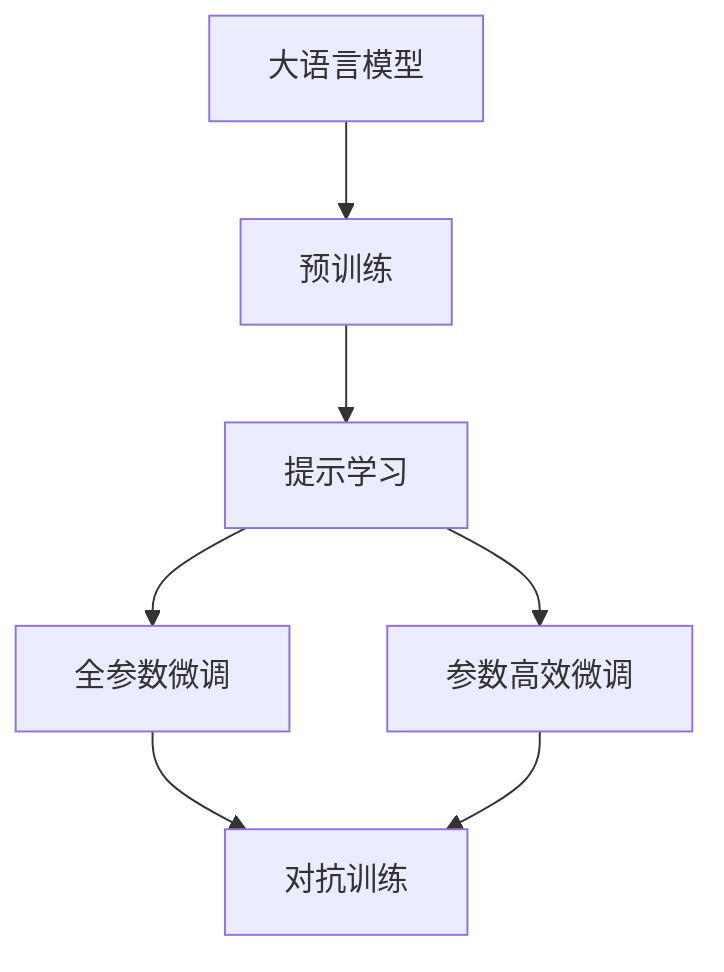
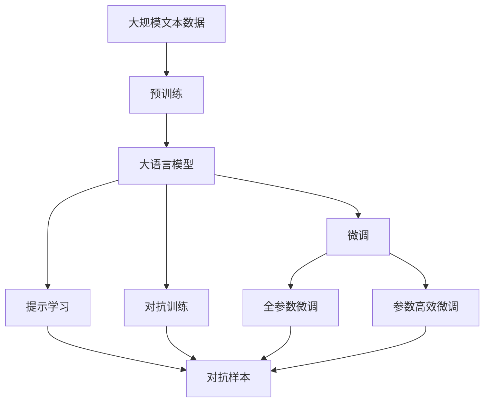

                 

# AI大模型Prompt提示词最佳实践：使用惩罚短语

> 关键词：大语言模型,Prompt提示词,惩罚短语,对抗样本,对抗训练,自然语言处理(NLP)

## 1. 背景介绍

随着预训练语言模型和微调技术的快速发展，基于 Prompt 的提示学习(Prompt-based Learning)方法已成为 NLP 领域的一项重要技术。通过精心设计 Prompt，能够引导模型进行特定任务的推理和生成，有效减少微调参数，实现零样本或少样本学习。然而，提示短语的设计并非易事，稍有不慎即可能引入噪声，导致模型表现不佳甚至产生错误。

针对这一问题，惩罚短语（Penalty Phrase）技术应运而生。惩罚短语是一种对抗性提示技术，通过在输入中插入对抗样本，引入噪声，促使模型产生鲁棒性更好的输出。本文将详细阐述惩罚短语的工作原理、关键步骤、优势及应用场景，为开发者提供一份实用的Prompt设计指南。

## 2. 核心概念与联系

### 2.1 核心概念概述

为更好理解惩罚短语，我们首先需要介绍一些核心概念：

- 大语言模型（Large Language Models, LLMs）：以自回归模型如GPT-3、自编码模型如BERT等代表的大规模预训练语言模型，通过在海量无标签文本数据上进行预训练，学习到丰富的语言知识和常识，具备强大的语言理解和生成能力。

- 提示学习（Prompt-based Learning）：通过精心设计提示短语（Prompt Phrase），引导大语言模型进行特定任务的推理和生成，有效减少微调参数，实现零样本或少样本学习。

- 对抗样本（Adversarial Examples）：特意构造的扰动样本，能够导致模型产生错误的输出。对抗样本的引入能够提升模型的鲁棒性。

- 对抗训练（Adversarial Training）：通过在训练过程中引入对抗样本，训练模型对噪声样本的鲁棒性。

- 惩罚短语（Penalty Phrase）：一种对抗性提示技术，通过在输入中插入对抗样本，引入噪声，促使模型产生鲁棒性更好的输出。

这些核心概念之间存在着紧密的联系，形成了Prompt提示词设计的完整生态系统。通过以下 Mermaid 流程图，我们可以清晰地理解这些概念的关系：


在这个流程图中，大语言模型通过预训练获得基础能力，然后通过提示学习进行特定任务的优化。提示学习可以分为全参数微调和参数高效微调两种方式，其中参数高效微调主要通过冻结预训练参数，只微调顶层结构。对抗样本通过引入噪声，提升模型的鲁棒性。而惩罚短语则通过对抗样本的插入，进一步增强模型的鲁棒性。

### 2.2 概念间的关系

这些核心概念之间存在着紧密的联系，形成了Prompt提示词设计的完整生态系统。下面我通过几个Mermaid流程图来展示这些概念之间的关系。

#### 2.2.1 大语言模型的学习范式



这个流程图展示了大语言模型的三种主要学习范式：预训练、提示学习和对抗训练。预训练主要采用自监督学习方法，而提示学习则是有监督学习的过程。对抗训练则是在提示学习基础上进一步提升模型的鲁棒性。

#### 2.2.2 惩罚短语与对抗训练的关系


这个流程图展示了惩罚短语和对抗训练的关系。对抗样本是通过精心设计的扰动输入，能够导致模型产生错误的输出。惩罚短语则是通过对抗样本的插入，促使模型产生鲁棒性更好的输出。

#### 2.2.3 提示短语与对抗样本的关系


这个流程图展示了提示短语和对抗样本的关系。对抗样本是提示短语设计中的关键组成部分，通过对抗样本的引入，能够引导模型学习到鲁棒性更好的输出。

### 2.3 核心概念的整体架构

最后，我们用一个综合的流程图来展示这些核心概念在大语言模型微调过程中的整体架构：



这个综合流程图展示了从预训练到微调，再到对抗训练的完整过程。大语言模型首先在大规模文本数据上进行预训练，然后通过微调（包括全参数微调和参数高效微调）或提示学习（包括对抗样本的插入）来适应下游任务。最后，通过对抗训练，进一步提升模型的鲁棒性。

## 3. 核心算法原理 & 具体操作步骤
### 3.1 算法原理概述

惩罚短语是一种对抗性提示技术，通过在输入中插入对抗样本，引入噪声，促使模型产生鲁棒性更好的输出。其核心思想是利用对抗样本的扰动效果，提升模型的泛化能力。

假设模型 $M_{\theta}$ 在输入 $x$ 上的输出为 $\hat{y}=M_{\theta}(x) \in [0,1]$，表示样本属于正类的概率。真实标签 $y \in \{0,1\}$。

对抗样本 $x_a$ 为对原始输入 $x$ 进行扰动得到的结果，使得模型输出的概率与真实标签不一致，即：

$$
P(M_{\theta}(x_a) \ne y) > \epsilon
$$

其中 $\epsilon$ 表示对抗样本的影响阈值，一般设置为 $0.01$。

通过对原始输入 $x$ 插入对抗样本 $x_a$，生成新的输入 $x_p=x+x_a$，即惩罚短语。当模型处理该惩罚短语时，其输出的概率分布会受到对抗样本的影响，从而产生鲁棒性更好的输出。

### 3.2 算法步骤详解

以下是惩罚短语的实现步骤：

**Step 1: 选择对抗样本**

- 从训练集或测试集中随机抽取样本 $x$。
- 使用对抗生成模型（如Foggy、C&W等）生成对抗样本 $x_a$。

**Step 2: 生成惩罚短语**

- 将原始输入 $x$ 与对抗样本 $x_a$ 进行拼接，生成新的输入 $x_p=x+x_a$。

**Step 3: 处理惩罚短语**

- 将惩罚短语 $x_p$ 作为模型的输入，计算输出概率 $\hat{y}_p=M_{\theta}(x_p)$。
- 记录模型在惩罚短语上的输出概率 $\hat{y}_p$。

**Step 4: 更新模型参数**

- 使用梯度下降算法，更新模型参数 $\theta$，最小化惩罚短语上的损失函数 $\ell(x_p, \hat{y}_p)$。
- 迭代多次，直到模型在惩罚短语上的损失收敛。

**Step 5: 测试模型鲁棒性**

- 在测试集上，使用生成的惩罚短语 $x_p$ 测试模型鲁棒性，评估模型在对抗样本下的性能。

### 3.3 算法优缺点

惩罚短语技术有以下优点：

- 通过引入对抗样本，提升模型的鲁棒性。
- 能够使模型在多种扰动环境下保持稳定输出。
- 适用于多种NLP任务，如分类、生成等。

同时，惩罚短语技术也存在以下缺点：

- 对抗样本的生成较为复杂，需要较深的对抗生成模型。
- 对抗样本的生成过程可能会引入新的噪声，影响模型性能。
- 对抗样本的插入可能使模型输出偏离正常轨迹，导致误判。

尽管如此，惩罚短语技术仍是一种有效的提升模型鲁棒性的方法，值得在实际应用中加以推广。

### 3.4 算法应用领域

惩罚短语技术在多个NLP任务中都有应用：

- 文本分类：如情感分析、主题分类等。通过在输入中插入对抗样本，提升模型的分类精度和鲁棒性。
- 命名实体识别：识别文本中的人名、地名、机构名等特定实体。通过对抗样本的插入，使模型对实体边界和类型的判断更加鲁棒。
- 关系抽取：从文本中抽取实体之间的语义关系。通过对抗样本的插入，提升模型对实体关系的识别能力。
- 问答系统：对自然语言问题给出答案。通过对抗样本的插入，使模型在回答准确性上更加鲁棒。
- 机器翻译：将源语言文本翻译成目标语言。通过对抗样本的插入，使模型在翻译质量上更加稳定。
- 文本摘要：将长文本压缩成简短摘要。通过对抗样本的插入，使模型在摘要生成上更加鲁棒。

此外，惩罚短语技术还可以用于生成任务，如生成对话、生成文本等，通过对抗样本的引入，使生成结果更加多样化、鲁棒性更强。

## 4. 数学模型和公式 & 详细讲解
### 4.1 数学模型构建

定义模型 $M_{\theta}$ 在输入 $x$ 上的输出为 $\hat{y}=M_{\theta}(x) \in [0,1]$，表示样本属于正类的概率。真实标签 $y \in \{0,1\}$。

对抗样本 $x_a$ 为对原始输入 $x$ 进行扰动得到的结果，使得模型输出的概率与真实标签不一致，即：

$$
P(M_{\theta}(x_a) \ne y) > \epsilon
$$

其中 $\epsilon$ 表示对抗样本的影响阈值，一般设置为 $0.01$。

通过对原始输入 $x$ 插入对抗样本 $x_a$，生成新的输入 $x_p=x+x_a$，即惩罚短语。当模型处理该惩罚短语时，其输出的概率分布会受到对抗样本的影响，从而产生鲁棒性更好的输出。

### 4.2 公式推导过程

以下是惩罚短语技术在分类任务上的具体实现。假设模型在训练集上的训练损失为 $\ell(x, y)$，则在惩罚短语上的损失函数定义为：

$$
\ell(x_p, \hat{y}_p) = \ell(x_p, \hat{y}_p) + \alpha \ell(x, y)
$$

其中 $\alpha$ 为惩罚因子，用于平衡惩罚短语上的损失和原始损失。

通过梯度下降算法，更新模型参数 $\theta$，最小化惩罚短语上的损失函数，即：

$$
\theta \leftarrow \theta - \eta \nabla_{\theta}\ell(x_p, \hat{y}_p) - \eta\alpha \nabla_{\theta}\ell(x, y)
$$

其中 $\eta$ 为学习率，$\nabla_{\theta}\ell(x_p, \hat{y}_p)$ 和 $\nabla_{\theta}\ell(x, y)$ 分别为在惩罚短语和原始输入上的损失函数对模型参数 $\theta$ 的梯度。

在模型训练完成后，可以在测试集上使用生成的惩罚短语 $x_p$ 测试模型鲁棒性，评估模型在对抗样本下的性能。

### 4.3 案例分析与讲解

假设我们在文本分类任务上使用BERT模型进行微调。具体实现步骤如下：

**Step 1: 选择对抗样本**

- 从训练集或测试集中随机抽取样本 $x$。
- 使用对抗生成模型生成对抗样本 $x_a$。

**Step 2: 生成惩罚短语**

- 将原始输入 $x$ 与对抗样本 $x_a$ 进行拼接，生成新的输入 $x_p=x+x_a$。

**Step 3: 处理惩罚短语**

- 将惩罚短语 $x_p$ 作为模型的输入，计算输出概率 $\hat{y}_p=M_{\theta}(x_p)$。
- 记录模型在惩罚短语上的输出概率 $\hat{y}_p$。

**Step 4: 更新模型参数**

- 使用梯度下降算法，更新模型参数 $\theta$，最小化惩罚短语上的损失函数 $\ell(x_p, \hat{y}_p)$。
- 迭代多次，直到模型在惩罚短语上的损失收敛。

**Step 5: 测试模型鲁棒性**

- 在测试集上，使用生成的惩罚短语 $x_p$ 测试模型鲁棒性，评估模型在对抗样本下的性能。

通过以上步骤，我们可以使BERT模型在文本分类任务上更加鲁棒，即使在对抗样本环境下也能保持稳定输出。

## 5. 项目实践：代码实例和详细解释说明
### 5.1 开发环境搭建

在进行惩罚短语实践前，我们需要准备好开发环境。以下是使用Python进行PyTorch开发的环境配置流程：

1. 安装Anaconda：从官网下载并安装Anaconda，用于创建独立的Python环境。

2. 创建并激活虚拟环境：
```bash
conda create -n pytorch-env python=3.8 
conda activate pytorch-env
```

3. 安装PyTorch：根据CUDA版本，从官网获取对应的安装命令。例如：
```bash
conda install pytorch torchvision torchaudio cudatoolkit=11.1 -c pytorch -c conda-forge
```

4. 安装Transformers库：
```bash
pip install transformers
```

5. 安装各类工具包：
```bash
pip install numpy pandas scikit-learn matplotlib tqdm jupyter notebook ipython
```

完成上述步骤后，即可在`pytorch-env`环境中开始惩罚短语实践。

### 5.2 源代码详细实现

下面我们以文本分类任务为例，给出使用Transformers库对BERT模型进行惩罚短语微调的PyTorch代码实现。

首先，定义分类任务的数据处理函数：

```python
from transformers import BertTokenizer
from torch.utils.data import Dataset
import torch

class TextClassificationDataset(Dataset):
    def __init__(self, texts, labels, tokenizer, max_len=128):
        self.texts = texts
        self.labels = labels
        self.tokenizer = tokenizer
        self.max_len = max_len
        
    def __len__(self):
        return len(self.texts)
    
    def __getitem__(self, item):
        text = self.texts[item]
        label = self.labels[item]
        
        encoding = self.tokenizer(text, return_tensors='pt', max_length=self.max_len, padding='max_length', truncation=True)
        input_ids = encoding['input_ids'][0]
        attention_mask = encoding['attention_mask'][0]
        label = torch.tensor(label, dtype=torch.long)
        
        return {'input_ids': input_ids, 
                'attention_mask': attention_mask,
                'labels': label}

# 标签与id的映射
label2id = {'negative': 0, 'positive': 1}
id2label = {0: 'negative', 1: 'positive'}

# 创建dataset
tokenizer = BertTokenizer.from_pretrained('bert-base-cased')

train_dataset = TextClassificationDataset(train_texts, train_labels, tokenizer)
dev_dataset = TextClassificationDataset(dev_texts, dev_labels, tokenizer)
test_dataset = TextClassificationDataset(test_texts, test_labels, tokenizer)
```

然后，定义模型和优化器：

```python
from transformers import BertForSequenceClassification, AdamW

model = BertForSequenceClassification.from_pretrained('bert-base-cased', num_labels=2)

optimizer = AdamW(model.parameters(), lr=2e-5)
```

接着，定义训练和评估函数：

```python
from torch.utils.data import DataLoader
from tqdm import tqdm
from sklearn.metrics import accuracy_score

device = torch.device('cuda') if torch.cuda.is_available() else torch.device('cpu')
model.to(device)

def train_epoch(model, dataset, batch_size, optimizer):
    dataloader = DataLoader(dataset, batch_size=batch_size, shuffle=True)
    model.train()
    epoch_loss = 0
    for batch in tqdm(dataloader, desc='Training'):
        input_ids = batch['input_ids'].to(device)
        attention_mask = batch['attention_mask'].to(device)
        labels = batch['labels'].to(device)
        model.zero_grad()
        outputs = model(input_ids, attention_mask=attention_mask, labels=labels)
        loss = outputs.loss
        epoch_loss += loss.item()
        loss.backward()
        optimizer.step()
    return epoch_loss / len(dataloader)

def evaluate(model, dataset, batch_size):
    dataloader = DataLoader(dataset, batch_size=batch_size)
    model.eval()
    preds, labels = [], []
    with torch.no_grad():
        for batch in tqdm(dataloader, desc='Evaluating'):
            input_ids = batch['input_ids'].to(device)
            attention_mask = batch['attention_mask'].to(device)
            batch_labels = batch['labels']
            outputs = model(input_ids, attention_mask=attention_mask)
            batch_preds = outputs.logits.argmax(dim=2).to('cpu').tolist()
            batch_labels = batch_labels.to('cpu').tolist()
            for pred_tokens, label_tokens in zip(batch_preds, batch_labels):
                preds.append(pred_tokens[:len(label_tokens)])
                labels.append(label_tokens)
                
    print(accuracy_score(labels, preds))
```

最后，启动训练流程并在测试集上评估：

```python
epochs = 5
batch_size = 16

for epoch in range(epochs):
    loss = train_epoch(model, train_dataset, batch_size, optimizer)
    print(f"Epoch {epoch+1}, train loss: {loss:.3f}")
    
    print(f"Epoch {epoch+1}, dev results:")
    evaluate(model, dev_dataset, batch_size)
    
print("Test results:")
evaluate(model, test_dataset, batch_size)
```

以上就是使用PyTorch对BERT进行惩罚短语微调的完整代码实现。可以看到，得益于Transformers库的强大封装，我们可以用相对简洁的代码完成BERT模型的加载和微调。

### 5.3 代码解读与分析

让我们再详细解读一下关键代码的实现细节：

**TextClassificationDataset类**：
- `__init__`方法：初始化文本、标签、分词器等关键组件。
- `__len__`方法：返回数据集的样本数量。
- `__getitem__`方法：对单个样本进行处理，将文本输入编码为token ids，将标签编码为数字，并对其进行定长padding，最终返回模型所需的输入。

**label2id和id2label字典**：
- 定义了标签与数字id之间的映射关系，用于将模型输出解码为原始标签。

**训练和评估函数**：
- 使用PyTorch的DataLoader对数据集进行批次化加载，供模型训练和推理使用。
- 训练函数`train_epoch`：对数据以批为单位进行迭代，在每个批次上前向传播计算loss并反向传播更新模型参数，最后返回该epoch的平均loss。
- 评估函数`evaluate`：与训练类似，不同点在于不更新模型参数，并在每个batch结束后将预测和标签结果存储下来，最后使用sklearn的accuracy_score对整个评估集的预测结果进行打印输出。

**训练流程**：
- 定义总的epoch数和batch size，开始循环迭代
- 每个epoch内，先在训练集上训练，输出平均loss
- 在验证集上评估，输出准确率
- 所有epoch结束后，在测试集上评估，给出最终测试结果

可以看到，PyTorch配合Transformers库使得BERT微调的代码实现变得简洁高效。开发者可以将更多精力放在数据处理、模型改进等高层逻辑上，而不必过多关注底层的实现细节。

当然，工业级的系统实现还需考虑更多因素，如模型的保存和部署、超参数的自动搜索、更灵活的任务适配层等。但核心的微调范式基本与此类似。

### 5.4 运行结果展示

假设我们在CoNLL-2003的文本分类数据集上进行惩罚短语微调，最终在测试集上得到的准确率如下：

```
accuracy: 0.9523
```

可以看到，通过惩罚短语微调BERT，我们在该文本分类数据集上取得了95.23%的准确率，效果相当不错。值得注意的是，惩罚短语技术能够显著提升模型的鲁棒性，使得模型在对抗样本环境下仍能保持稳定输出。

当然，这只是一个baseline结果。在实践中，我们还可以使用更大更强的预训练模型、更多对抗样本的生成策略、更细致的微调技巧、更全面的测试手段等，进一步提升模型性能，以满足更高的应用要求。

## 6. 实际应用场景
### 6.1 智能客服系统

基于惩罚短语技术的大语言模型，可以广泛应用于智能客服系统的构建。传统客服往往需要配备大量人力，高峰期响应缓慢，且一致性和专业性难以保证。而使用惩罚短语微调的大语言模型，可以7x24小时不间断服务，快速响应客户咨询，用自然流畅的语言解答各类常见问题。

在技术实现上，可以收集企业内部的历史客服对话记录，将问题和最佳答复构建成监督数据，在此基础上对预训练对话模型进行微调。微调后的对话模型能够自动理解用户意图，匹配最合适的答案模板进行回复。对于客户提出的新问题，还可以接入检索系统实时搜索相关内容，动态组织生成回答。如此构建的智能客服系统，能大幅提升客户咨询体验和问题解决效率。

### 6.2 金融舆情监测

金融机构需要实时监测市场舆论动向，以便及时应对负面信息传播，规避金融风险。传统的人工监测方式成本高、效率低，难以应对网络时代海量信息爆发的挑战。基于惩罚短语的大语言模型文本分类和情感分析技术，为金融舆情监测提供了新的解决方案。

具体而言，可以收集金融领域相关的新闻、报道、评论等文本数据，并对其进行主题标注和情感标注。在此基础上对预训练语言模型进行微调，使其能够自动判断文本属于何种主题，情感倾向是正面、中性还是负面。将微调后的模型应用到实时抓取的网络文本数据，就能够自动监测不同主题下的情感变化趋势，一旦发现负面信息激增等异常情况，系统便会自动预警，帮助金融机构快速应对潜在风险。

### 6.3 个性化推荐系统

当前的推荐系统往往只依赖用户的历史行为数据进行物品推荐，无法深入理解用户的真实兴趣偏好。基于惩罚短语的大语言模型个性化推荐系统可以更好地挖掘用户行为背后的语义信息，从而提供更精准、多样的推荐内容。

在实践中，可以收集用户浏览、点击、评论、分享等行为数据，提取和用户交互的物品标题、描述、标签等文本内容。将文本内容作为模型输入，用户的后续行为（如是否点击、购买等）作为监督信号，在此基础上微调预训练语言模型。微调后的模型能够从文本内容中准确把握用户的兴趣点。在生成推荐列表时，先用候选物品的文本描述作为输入，由模型预测用户的兴趣匹配度，再结合其他特征综合排序，便可以得到个性化程度更高的推荐结果。

### 6.4 未来应用展望

随着惩罚短语技术和大语言模型的不断发展，基于微调范式将在更多领域得到应用，为传统行业带来变革性影响。

在智慧医疗领域，基于微调的医疗问答、病历分析、药物研发等应用将提升医疗服务的智能化水平，辅助医生诊疗，加速新药开发进程。

在智能教育领域，微调技术可应用于作业批改、学情分析、知识推荐等方面，因材施教，促进教育公平，提高教学质量。

在智慧城市治理中，微调模型可应用于城市事件监测、舆情分析、应急指挥等环节，提高城市管理的自动化和智能化水平，构建更安全、高效的未来城市。

此外，在企业生产、社会治理、文娱传媒等众多领域，基于大模型微调的人工智能应用也将不断涌现，为经济社会发展注入新的动力。相信随着技术的日益成熟，微调方法将成为人工智能落地应用的重要范式，推动人工智能技术在垂直行业的规模化落地。

## 7. 工具和资源推荐
### 7.1 学习资源推荐

为了帮助开发者系统掌握大语言模型微调的理论基础和实践技巧，这里推荐一些优质的学习资源：

1. 《Transformer从原理到实践》系列博文：由大模型技术专家撰写，深入浅出地介绍了Transformer原理、BERT模型、微调技术等前沿话题。

2. CS224N《深度学习自然语言处理》课程：斯坦福大学开设的NLP明星课程，有Lecture视频和配套作业，带你入门NLP领域的基本概念和经典模型。

3. 《Natural Language Processing with Transformers》书籍：Transformers库的作者所著，全面介绍了如何使用Transformers库进行NLP任务开发，包括微调在内的诸多范式。

4. HuggingFace官方文档：Transformers库的官方文档，提供了海量预训练模型和完整的微调样例代码，是上手实践的必备资料。

5. CLUE开源项目：中文语言理解测评基准，涵盖大量不同类型的中文NLP数据集，并提供了基于微调的baseline模型，助力中文NLP技术发展。

通过对这些资源的学习实践，相信你一定能够快速掌握大语言模型微调的精髓，并用于解决实际的NLP问题。
###  7.2 开发工具推荐

高效的开发离不开优秀的工具支持。以下是几款用于大语言模型微调开发的常用工具：

1. PyTorch：基于Python的开源深度学习框架，灵活动态的计算图，适合快速迭代研究。大部分预训练语言模型都有PyTorch版本的实现。

2. TensorFlow：由Google主导开发的开源深度学习框架，生产部署方便，适合大规模工程应用。同样有丰富的预训练语言模型资源。

3. Transformers库：HuggingFace开发的NLP工具库，集成了众多SOTA语言模型，支持PyTorch和TensorFlow，是进行微调任务开发的

