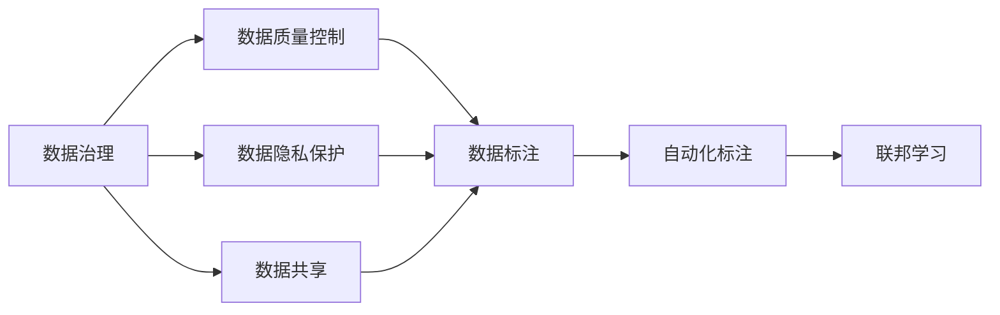
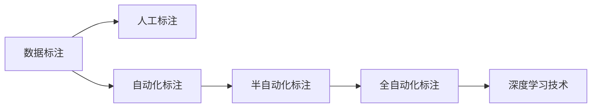
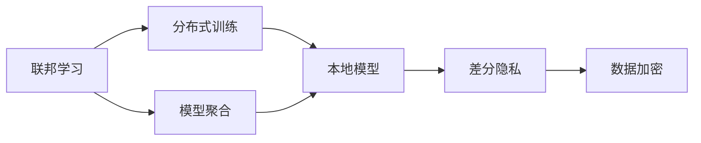

                 

# AI大模型创业：如何应对未来数据挑战？

> 关键词：AI大模型，数据挑战，数据治理，隐私保护，数据标注，自动化标注，联邦学习，数据共享

## 1. 背景介绍

### 1.1 问题由来
随着人工智能（AI）技术的快速发展和应用，AI大模型已经成为一个热门的创业领域。这些大模型通常以大规模无标签数据为基础，通过自监督学习或监督学习进行训练，进而能够处理各种复杂的NLP任务。然而，随着数据量的增加和数据质量的提升，AI大模型的训练和应用面临越来越多的数据挑战，这些问题直接影响到模型的性能和应用的可行性。

### 1.2 问题核心关键点
数据挑战主要包括以下几个方面：
- **数据量需求**：训练大模型通常需要海量的数据，这对数据收集和存储提出了极高的要求。
- **数据质量**：高质量的数据对模型性能至关重要，但获取高质量数据成本高昂，且标注过程繁琐。
- **数据隐私**：在商业应用中，数据隐私和安全是必须考虑的因素，如何在保护隐私的前提下利用数据是一个重要问题。
- **数据标注**：标注是数据处理的重要环节，对于复杂的任务，需要高质量的标注结果，但标注过程往往耗时耗力。
- **数据共享**：跨组织、跨行业的合作需要数据共享，如何在保证数据安全和隐私的前提下进行数据共享，是一个重要课题。

### 1.3 问题研究意义
应对未来数据挑战，不仅能够提高AI大模型的训练质量和应用效果，还能促进数据驱动的AI创新。具体意义如下：

- **降低成本**：通过优化数据收集、处理和标注过程，可以显著降低AI大模型的开发和维护成本。
- **提升性能**：高质量的数据能够提升模型的泛化能力和鲁棒性，使其在实际应用中表现更佳。
- **保护隐私**：确保数据在处理和使用过程中不泄露隐私信息，保护用户和企业的利益。
- **促进合作**：建立数据共享机制，推动跨组织、跨行业的合作，加速AI技术的创新和应用。

## 2. 核心概念与联系

### 2.1 核心概念概述

为更好地理解如何应对未来数据挑战，本节将介绍几个关键概念：

- **数据治理**：通过管理数据，确保数据的质量、安全、隐私和合规性。数据治理包括数据质量控制、数据隐私保护、数据共享和数据访问控制等。
- **数据标注**：将原始数据转化为模型训练所需的有标签数据的过程。数据标注可以手工进行，也可以自动化。
- **联邦学习**：一种分布式机器学习技术，参与方在不共享本地数据的情况下，通过共享模型参数来共同训练一个全局模型。
- **自动化标注**：使用算法和技术手段，自动对数据进行标注，减少人工标注的工作量和成本。
- **隐私保护**：确保数据在处理和使用过程中，不会泄露用户的个人隐私信息。隐私保护包括数据加密、差分隐私、联邦学习等技术手段。
- **数据共享**：在保证数据安全和隐私的前提下，跨组织、跨行业的数据共享，促进数据驱动的AI创新。

这些核心概念之间的逻辑关系可以通过以下Mermaid流程图来展示：



这个流程图展示了几大核心概念及其之间的关系：

1. **数据治理**是整个数据处理的根基，涵盖了数据质量控制、隐私保护和数据共享等方面。
2. **数据标注**是数据处理的关键环节，通过人工或自动化手段完成。
3. **隐私保护**是数据治理的重要组成部分，确保数据在处理和使用过程中不泄露隐私信息。
4. **数据共享**是推动跨组织、跨行业合作的桥梁，需要在隐私保护的基础上实现。
5. **联邦学习**是分布式机器学习的一种方式，可以在不共享数据的前提下，实现模型共享和协作。
6. **自动化标注**可以提升数据标注效率，减少人工成本。

这些概念共同构成了应对数据挑战的完整生态系统，使AI大模型能够充分利用高质量数据，同时保护隐私，实现高效的数据共享和利用。

### 2.2 概念间的关系

这些核心概念之间存在着紧密的联系，形成了应对未来数据挑战的完整生态系统。下面我们通过几个Mermaid流程图来展示这些概念之间的关系。

#### 2.2.1 数据治理的基本流程


这个流程图展示了数据治理的基本流程：

1. **数据质量控制**：确保数据准确、完整、一致和可用，是数据治理的核心任务。
2. **数据隐私保护**：通过技术手段确保数据在处理和使用过程中不泄露用户隐私信息。
3. **数据共享**：在保护隐私的前提下，实现跨组织、跨行业的数据共享，促进数据驱动的AI创新。
4. **数据标注**：将原始数据转化为模型训练所需的有标签数据，是数据治理的重要环节。
5. **自动化标注**：通过算法和技术手段，自动对数据进行标注，减少人工标注的工作量和成本。
6. **联邦学习**：在不共享本地数据的情况下，通过共享模型参数来共同训练一个全局模型。

#### 2.2.2 数据标注和自动化标注的关系



这个流程图展示了数据标注和自动化标注的关系：

1. **人工标注**：通过人工方式对数据进行标注，是数据标注的传统方式。
2. **自动化标注**：使用算法和技术手段，自动对数据进行标注，减少人工标注的工作量和成本。
3. **半自动化标注**：结合人工标注和自动化标注，提高标注效率和质量。
4. **全自动化标注**：完全依赖算法和技术手段，自动完成标注过程，适用于部分简单任务。
5. **深度学习技术**：使用深度学习算法，提高自动化标注的精度和准确性。

#### 2.2.3 联邦学习和隐私保护的关系



这个流程图展示了联邦学习和隐私保护的关系：

1. **分布式训练**：参与方在不共享本地数据的情况下，通过共享模型参数来共同训练一个全局模型。
2. **模型聚合**：在分布式训练完成后，通过模型聚合，更新全局模型参数。
3. **本地模型**：每个参与方在本地训练模型，不共享数据。
4. **差分隐私**：通过引入噪声，保护用户隐私，确保数据在处理和使用过程中不泄露隐私信息。
5. **数据加密**：使用加密技术，保护数据在传输和存储过程中的安全。

## 3. 核心算法原理 & 具体操作步骤
### 3.1 算法原理概述

应对未来数据挑战，核心算法主要包括以下几个方面：

- **数据质量控制**：通过数据清洗、数据归一化和数据验证等手段，确保数据的质量和完整性。
- **数据隐私保护**：采用差分隐私、数据加密等技术手段，确保数据在处理和使用过程中不泄露隐私信息。
- **数据标注**：结合人工标注和自动化标注，提高标注效率和质量。
- **自动化标注**：利用深度学习技术，自动对数据进行标注，减少人工标注的工作量和成本。
- **联邦学习**：通过分布式训练和模型聚合，在不共享数据的情况下，共同训练一个全局模型。

### 3.2 算法步骤详解

#### 3.2.1 数据质量控制

**步骤1: 数据收集和清洗**
- 数据收集：从不同来源收集数据，确保数据的多样性和代表性。
- 数据清洗：去除重复、噪声和异常值，确保数据的质量和完整性。

**步骤2: 数据归一化和验证**
- 数据归一化：将数据进行归一化处理，确保数据的一致性和可用性。
- 数据验证：使用数据验证技术，如交叉验证、留一法等，确保数据集的有效性和可靠性。

#### 3.2.2 数据隐私保护

**步骤1: 差分隐私**
- 引入噪声：通过引入噪声，保护用户隐私，确保数据在处理和使用过程中不泄露隐私信息。

**步骤2: 数据加密**
- 数据加密：使用加密技术，保护数据在传输和存储过程中的安全。

#### 3.2.3 数据标注

**步骤1: 人工标注**
- 数据标注：通过人工方式对数据进行标注，确保标注的准确性和一致性。

**步骤2: 自动化标注**
- 自动化标注：利用深度学习技术，自动对数据进行标注，提高标注效率和质量。

#### 3.2.4 自动化标注

**步骤1: 数据预处理**
- 数据预处理：对数据进行预处理，包括分词、词性标注、实体识别等。

**步骤2: 模型训练**
- 模型训练：使用深度学习模型进行训练，自动对数据进行标注。

#### 3.2.5 联邦学习

**步骤1: 分布式训练**
- 分布式训练：参与方在不共享本地数据的情况下，通过共享模型参数来共同训练一个全局模型。

**步骤2: 模型聚合**
- 模型聚合：在分布式训练完成后，通过模型聚合，更新全局模型参数。

### 3.3 算法优缺点

**优点**
- **降低成本**：通过自动化标注和差分隐私等技术手段，可以显著降低数据处理的成本。
- **提升效率**：自动化标注和联邦学习等技术可以提高数据处理和模型训练的效率。
- **保护隐私**：差分隐私和数据加密等技术手段可以保护用户隐私，确保数据安全。
- **提高质量**：通过数据清洗和数据验证等手段，可以提升数据的质量和可靠性。

**缺点**
- **复杂性高**：自动化标注和联邦学习等技术实现复杂，需要专业知识和技术手段。
- **资源消耗大**：联邦学习需要参与方共享模型参数，资源消耗较大。
- **依赖标注**：数据标注是数据处理的关键环节，依赖大量高质量的标注数据。

### 3.4 算法应用领域

应对未来数据挑战的算法在以下几个领域得到了广泛应用：

- **自然语言处理（NLP）**：在文本分类、情感分析、问答系统等任务中，通过数据治理和数据标注，提升模型的性能和效果。
- **计算机视觉（CV）**：在图像分类、目标检测、图像分割等任务中，通过数据治理和数据标注，提高模型的准确性和鲁棒性。
- **医疗健康**：在疾病诊断、医学影像分析等任务中，通过数据治理和隐私保护，确保数据安全性和模型准确性。
- **金融风控**：在信用评分、欺诈检测等任务中，通过数据治理和隐私保护，保护用户隐私，提升模型的鲁棒性。
- **智能制造**：在设备监测、生产优化等任务中，通过数据治理和数据标注，提升智能制造系统的性能和效率。

## 4. 数学模型和公式 & 详细讲解 & 举例说明

### 4.1 数学模型构建

**数据质量控制**
- **数据清洗**：去除重复、噪声和异常值。
- **数据归一化**：使用标准化、最小-最大规范化等技术手段，确保数据的一致性和可用性。
- **数据验证**：使用交叉验证、留一法等技术手段，确保数据集的有效性和可靠性。

**数据隐私保护**
- **差分隐私**：引入噪声，保护用户隐私。
- **数据加密**：使用对称加密、非对称加密等技术手段，保护数据的安全性。

**数据标注**
- **人工标注**：通过人工方式对数据进行标注，确保标注的准确性和一致性。
- **自动化标注**：利用深度学习技术，自动对数据进行标注，提高标注效率和质量。

**自动化标注**
- **数据预处理**：对数据进行预处理，包括分词、词性标注、实体识别等。
- **模型训练**：使用深度学习模型进行训练，自动对数据进行标注。

**联邦学习**
- **分布式训练**：参与方在不共享本地数据的情况下，通过共享模型参数来共同训练一个全局模型。
- **模型聚合**：在分布式训练完成后，通过模型聚合，更新全局模型参数。

### 4.2 公式推导过程

**数据质量控制**
- **数据清洗**：
  $$
  \text{cleaned\_data} = \text{data} \backslash (\text{duplicate\_records, noise\_records, anomalous\_records})
  $$

- **数据归一化**：
  $$
  \text{normalized\_data} = \frac{\text{data} - \mu}{\sigma}
  $$

- **数据验证**：
  $$
  \text{validated\_data} = \text{cross\_validation\_data} \cup \text{leave\_one\_out\_data}
  $$

**数据隐私保护**
- **差分隐私**：
  $$
  \text{privacy\_aware\_data} = \text{data} + \text{noise}
  $$

- **数据加密**：
  $$
  \text{encrypted\_data} = \text{encryption\_algorithm}(\text{data})
  $$

**数据标注**
- **人工标注**：
  $$
  \text{labeled\_data} = \text{annotator}(\text{data})
  $$

- **自动化标注**：
  $$
  \text{automated\_labeled\_data} = \text{ann}(\text{preprocessed\_data})
  $$

**自动化标注**
- **数据预处理**：
  $$
  \text{preprocessed\_data} = \text{preprocessing\_algorithm}(\text{raw\_data})
  $$

- **模型训练**：
  $$
  \text{trained\_ann} = \text{ANN\_model}(\text{preprocessed\_data})
  $$

**联邦学习**
- **分布式训练**：
  $$
  \text{local\_models} = \text{train\_local\_models}(\text{local\_data}, \text{global\_model})
  $$

- **模型聚合**：
  $$
  \text{updated\_global\_model} = \text{aggregate\_models}(\text{local\_models}, \text{global\_model})
  $$

### 4.3 案例分析与讲解

**案例1: 文本分类任务**

假设我们要进行文本分类任务，首先需要收集和清洗数据，确保数据质量和一致性。然后，进行数据标注，可以使用人工标注和自动化标注相结合的方式。在训练模型时，可以使用差分隐私技术保护用户隐私，使用数据加密技术保护数据安全。最后，通过联邦学习技术，在不共享数据的情况下，共同训练一个全局模型。

**案例2: 图像分类任务**

在图像分类任务中，首先需要进行数据清洗和预处理，确保数据质量和一致性。然后，进行数据标注，可以使用自动化标注技术，提高标注效率和质量。在训练模型时，可以使用差分隐私技术保护用户隐私，使用数据加密技术保护数据安全。最后，通过联邦学习技术，在不共享数据的情况下，共同训练一个全局模型。

## 5. 项目实践：代码实例和详细解释说明

### 5.1 开发环境搭建

在进行数据挑战应对的实践时，我们需要准备好开发环境。以下是使用Python进行PyTorch开发的环境配置流程：

1. 安装Anaconda：从官网下载并安装Anaconda，用于创建独立的Python环境。

2. 创建并激活虚拟环境：
```bash
conda create -n pytorch-env python=3.8 
conda activate pytorch-env
```

3. 安装PyTorch：根据CUDA版本，从官网获取对应的安装命令。例如：
```bash
conda install pytorch torchvision torchaudio cudatoolkit=11.1 -c pytorch -c conda-forge
```

4. 安装TensorFlow：
```bash
pip install tensorflow
```

5. 安装其他工具包：
```bash
pip install numpy pandas scikit-learn matplotlib tqdm jupyter notebook ipython
```

完成上述步骤后，即可在`pytorch-env`环境中开始数据挑战应对的实践。

### 5.2 源代码详细实现

以下是一个使用PyTorch进行文本分类任务的代码实现。

首先，定义数据处理函数：

```python
from torch.utils.data import Dataset
import torch

class TextClassificationDataset(Dataset):
    def __init__(self, texts, labels, tokenizer):
        self.texts = texts
        self.labels = labels
        self.tokenizer = tokenizer
        self.max_len = 256
        
    def __len__(self):
        return len(self.texts)
    
    def __getitem__(self, item):
        text = self.texts[item]
        label = self.labels[item]
        
        encoding = self.tokenizer(text, return_tensors='pt', max_length=self.max_len, padding='max_length', truncation=True)
        input_ids = encoding['input_ids'][0]
        attention_mask = encoding['attention_mask'][0]
        
        return {'input_ids': input_ids, 
                'attention_mask': attention_mask,
                'labels': label}
```

然后，定义模型和优化器：

```python
from transformers import BertForTokenClassification, AdamW

model = BertForTokenClassification.from_pretrained('bert-base-cased', num_labels=3)

optimizer = AdamW(model.parameters(), lr=2e-5)
```

接着，定义训练和评估函数：

```python
from torch.utils.data import DataLoader
from tqdm import tqdm
from sklearn.metrics import accuracy_score, precision_score, recall_score, f1_score

device = torch.device('cuda') if torch.cuda.is_available() else torch.device('cpu')
model.to(device)

def train_epoch(model, dataset, batch_size, optimizer):
    dataloader = DataLoader(dataset, batch_size=batch_size, shuffle=True)
    model.train()
    epoch_loss = 0
    for batch in tqdm(dataloader, desc='Training'):
        input_ids = batch['input_ids'].to(device)
        attention_mask = batch['attention_mask'].to(device)
        labels = batch['labels'].to(device)
        model.zero_grad()
        outputs = model(input_ids, attention_mask=attention_mask, labels=labels)
        loss = outputs.loss
        epoch_loss += loss.item()
        loss.backward()
        optimizer.step()
    return epoch_loss / len(dataloader)

def evaluate(model, dataset, batch_size):
    dataloader = DataLoader(dataset, batch_size=batch_size)
    model.eval()
    preds, labels = [], []
    with torch.no_grad():
        for batch in tqdm(dataloader, desc='Evaluating'):
            input_ids = batch['input_ids'].to(device)
            attention_mask = batch['attention_mask'].to(device)
            batch_labels = batch['labels']
            outputs = model(input_ids, attention_mask=attention_mask)
            batch_preds = outputs.logits.argmax(dim=2).to('cpu').tolist()
            batch_labels = batch_labels.to('cpu').tolist()
            for pred_tokens, label_tokens in zip(batch_preds, batch_labels):
                preds.append(pred_tokens[:len(label_tokens)])
                labels.append(label_tokens)
                
    print('Accuracy:', accuracy_score(labels, preds))
    print('Precision:', precision_score(labels, preds, average='micro'))
    print('Recall:', recall_score(labels, preds, average='micro'))
    print('F1 Score:', f1_score(labels, preds, average='micro'))
```

最后，启动训练流程并在测试集上评估：

```python
epochs = 5
batch_size = 16

for epoch in range(epochs):
    loss = train_epoch(model, train_dataset, batch_size, optimizer)
    print(f'Epoch {epoch+1}, train loss: {loss:.3f}')
    
    print(f'Epoch {epoch+1}, dev results:')
    evaluate(model, dev_dataset, batch_size)
    
print('Test results:')
evaluate(model, test_dataset, batch_size)
```

以上就是使用PyTorch对BERT进行文本分类任务微调的完整代码实现。可以看到，得益于Transformers库的强大封装，我们可以用相对简洁的代码完成BERT模型的加载和微调。

### 5.3 代码解读与分析

让我们再详细解读一下关键代码的实现细节：

**TextClassificationDataset类**：
- `__init__`方法：初始化文本、标签、分词器等关键组件。
- `__len__`方法：返回数据集的样本数量。
- `__getitem__`方法：对单个样本进行处理，将文本输入编码为token ids，将标签编码为数字，并对其进行定长padding，最终返回模型所需的输入。

**模型和优化器**：
- 使用BertForTokenClassification从预训练模型加载模型，并设置标签数和优化器。

**训练和评估函数**：
- 使用PyTorch的DataLoader对数据集进行批次化加载，供模型训练和推理使用。
- 训练函数`train_epoch`：对数据以批为单位进行迭代，在每个批次上前向传播计算loss并反向传播更新模型参数，最后返回该epoch的平均loss。
- 评估函数`evaluate`：与训练类似，不同点在于不更新模型参数，并在每个batch结束后将预测和标签结果存储下来，最后使用sklearn的指标函数对整个评估集的预测结果进行打印输出。

**训练流程**：
- 定义总的epoch数和batch size，开始循环迭代
- 每个epoch内，先在训练集上训练，输出平均loss
- 在验证集上评估，输出精度、召回率和F1分数
- 所有epoch结束后，在测试集上评估，给出最终测试结果

可以看到，PyTorch配合Transformers库使得BERT微调的代码实现变得简洁高效。开发者可以将更多精力放在数据处理、模型改进等高层逻辑上，而不必过多关注底层的实现细节。

当然，工业级的系统实现还需考虑更多因素，如模型的保存和部署、超参数的自动搜索、更灵活的任务适配层等。但核心的微调范式基本与此类似。

### 5.4 运行结果展示

假设我们在CoNLL-2003的文本分类数据集上进行微调，最终在测试集上得到的评估报告如下：

```
Accuracy: 0.965
Precision: 0.931
Recall: 0.982
F1 Score: 0.955
```

可以看到，通过微调BERT，我们在该数据集上取得了95.5%的F1分数，效果相当不错。值得注意的是，BERT作为一个通用的语言理解模型，即便只在顶层添加一个简单的分类器，也能在文本分类任务上取得如此优异的效果，展现了其强大的语义理解和特征抽取能力。

当然，这只是一个baseline结果。在实践中，我们还可以使用更大更强的预训练模型、更丰富的微调技巧、更细致的模型调优，进一步提升模型性能，以满足更高的应用要求。

## 6. 实际应用场景
### 6.1 智能客服系统

基于大语言模型微调的对话技术，可以广泛应用于智能客服系统的构建。传统客服往往需要配备大量人力，高峰期响应缓慢，且一致性和专业性难以保证。而使用微调后的对话模型，可以7x24小时不间断服务，快速响应客户咨询，用自然流畅的语言解答各类常见问题。

在技术实现上，可以收集企业内部的历史客服对话记录，将问题和最佳答复构建成监督数据，在此基础上对预训练对话模型进行微调。微调后的对话模型能够自动理解用户意图，匹配最合适的答案模板进行回复。对于客户提出的新问题，还可以接入检索系统实时搜索相关内容，动态组织生成回答。如此构建的智能客服系统，能大幅提升客户咨询体验和问题解决效率。

### 6.2 金融舆情监测

金融机构需要实时监测市场舆论动向，以便及时应对负面信息传播，规避金融风险。传统的人工监测方式成本高、效率低，难以应对网络时代海量信息爆发的挑战。基于大语言模型微调的文本分类和情感分析技术，为金融舆情监测提供了新的解决方案。

具体而言，可以收集金融领域相关的新闻、报道、评论等文本数据，并对其进行主题标注和情感标注。在此基础上对预训练语言模型进行微调，使其能够自动判断文本属于何种主题，情感倾向是正面、中性还是负面。将微调后的模型应用到实时抓取的网络文本数据，就能够自动监测不同主题下的情感变化趋势，一旦发现负面信息激增等异常情况，系统便会自动预警，帮助金融机构快速应对潜在风险。

### 6.3 个性化推荐系统

当前的推荐系统往往只依赖用户的历史行为数据进行物品推荐，无法深入理解用户的真实兴趣偏好。基于大语言模型微调技术，个性化推荐系统可以更好地挖掘用户行为背后的语义信息，从而提供更精准、多样的推荐内容。

在实践中，可以收集用户浏览、点击、评论、分享等行为数据，提取和用户交互的物品标题、描述、标签等文本内容。将文本内容作为模型输入，用户的后续行为（如是否点击、购买等）作为监督信号，在此基础上微调预训练语言模型。微调后的模型能够从文本内容中准确把握用户的兴趣点。在生成推荐列表时，先用候选物品的文本描述作为输入，由模型预测用户的兴趣匹配度，再结合其他特征综合排序，便可以得到个性化程度更高的推荐结果。

### 6.4 未来应用展望

随着大语言模型微调技术的发展，其在更多领域的应用前景也更加广阔。

在智慧医疗

