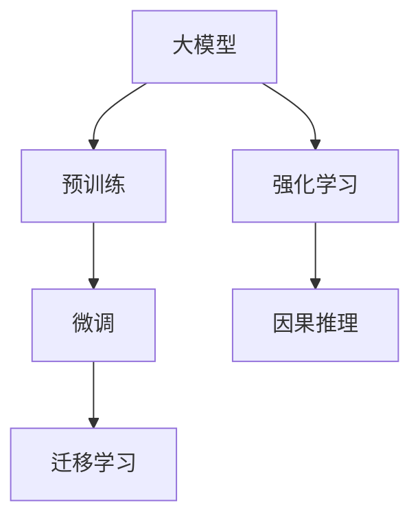

                 

# AI大模型创业：机遇与挑战并存

## 1. 背景介绍

### 1.1 问题由来
随着人工智能技术的迅猛发展，大模型（Large Model）正成为推动各行各业数字化转型的重要引擎。大型科技公司，如Google、Facebook、Microsoft和OpenAI等，纷纷布局大模型技术，推出了一系列自家的开源大模型。这些大模型在自然语言处理（NLP）、计算机视觉、语音识别等多个领域展现出了巨大的潜力，大幅提升了人工智能应用的性能和效率。

在此背景下，一大批AI创业公司崛起，试图借助大模型技术，打造创新的产品和服务。然而，这些创业企业在高速发展的过程中，也面临众多挑战和困境。本文将详细探讨AI大模型创业的机遇与挑战，帮助创业者更好地把握市场机会，应对潜在风险。

### 1.2 问题核心关键点
大模型创业面临的核心问题包括：

- **技术壁垒**：大模型的研发需要强大的技术积累和资源投入，如何突破核心技术的封锁，成为创业公司需要解决的首要问题。
- **数据依赖**：高质量的训练数据是大模型性能的关键，如何获取和处理大规模数据，是一个巨大的挑战。
- **算力成本**：大模型需要消耗大量算力进行训练和推理，如何降低算力成本，提高运营效率，是企业必须考虑的因素。
- **业务落地**：如何将大模型技术转化为实际产品和服务，解决行业需求，是创业公司面临的现实问题。
- **商业化**：如何将大模型技术商业化，实现盈利和可持续增长，是企业必须解决的长期问题。

### 1.3 问题研究意义
大模型创业不仅是科技前沿的探索，更是一项复杂的商业活动。通过深入分析其机遇与挑战，可以帮助创业者更好地理解市场环境，制定合理的战略规划，规避潜在风险，提升企业的核心竞争力。

## 2. 核心概念与联系

### 2.1 核心概念概述

- **大模型（Large Model）**：指那些具有大规模参数量、复杂结构和强大表达能力的人工智能模型，如GPT-3、BERT、ViT等。
- **预训练（Pre-training）**：指在大规模无标签数据上对模型进行训练，学习通用的特征表示，提高模型的泛化能力。
- **微调（Fine-tuning）**：指在特定任务上对预训练模型进行调整，使其在目标任务上表现更优。
- **迁移学习（Transfer Learning）**：指将一个领域学习到的知识迁移到另一个领域，提高模型在新任务上的性能。
- **强化学习（Reinforcement Learning）**：指模型通过与环境的交互，逐步优化决策策略，提高任务完成效果。
- **因果推理（Causal Inference）**：指通过观察和干预，理解变量间的因果关系，提高模型对未知数据的预测能力。

这些核心概念通过以下Mermaid流程图进行展现：



### 2.2 概念间的关系

这些核心概念之间的关系如下：

- **大模型**：作为AI的基础设施，提供强大的表示和计算能力。
- **预训练**：在大规模数据上对模型进行预训练，学习通用特征。
- **微调**：针对特定任务进行模型调整，提升性能。
- **迁移学习**：将预训练知识迁移到新任务上，减少数据需求。
- **强化学习**：通过与环境的交互，优化模型行为。
- **因果推理**：通过因果关系理解模型输出，提高决策准确性。

这些概念共同构成了AI大模型创业的技术框架，帮助企业构建具有竞争力的产品和服务。

## 3. 核心算法原理 & 具体操作步骤

### 3.1 算法原理概述

AI大模型创业的核心在于如何利用预训练和微调技术，将大模型应用于实际业务中。其核心算法原理包括以下几个方面：

- **预训练**：在大规模无标签数据上对模型进行预训练，学习通用特征。
- **微调**：在特定任务上对预训练模型进行调整，提升任务性能。
- **迁移学习**：将预训练知识迁移到新任务上，减少数据需求。
- **强化学习**：通过与环境的交互，优化模型行为。
- **因果推理**：通过因果关系理解模型输出，提高决策准确性。

这些算法的核心思想是利用已有的大模型，通过预训练和微调技术，提升其在特定任务上的表现，从而满足业务需求。

### 3.2 算法步骤详解

以下是AI大模型创业的具体操作步骤：

1. **选择合适的预训练模型**：根据应用场景选择合适的预训练模型，如BERT、GPT-3、ViT等。
2. **获取和处理数据**：收集和预处理大量训练数据，确保数据质量和多样性。
3. **预训练模型加载和微调**：使用预训练模型，并在特定任务上进行微调，优化模型性能。
4. **模型集成和优化**：将多个模型集成，进行模型融合，优化性能和效率。
5. **部署和应用**：将优化后的模型部署到实际业务场景中，解决实际问题。
6. **持续优化和迭代**：根据业务反馈和数据变化，持续优化和迭代模型，提升性能。

### 3.3 算法优缺点

**优点**：
- **高效性**：利用已有的大模型，大大缩短了模型开发周期。
- **泛化能力**：预训练和微调技术提升了模型的泛化能力，可以在各种应用场景下表现良好。
- **可扩展性**：模型可以通过不断微调和迭代，逐步优化性能，提升竞争力。

**缺点**：
- **资源消耗大**：大模型需要大量的算力、存储空间和计算资源。
- **数据需求高**：高质量的训练数据对模型性能至关重要。
- **业务落地难**：如何将模型转化为实际应用，满足业务需求，是一个复杂的过程。
- **商业化难**：将模型商业化，实现盈利和增长，需要考虑多方面因素。

### 3.4 算法应用领域

大模型创业在多个领域具有广泛的应用，包括但不限于：

- **自然语言处理（NLP）**：如文本分类、情感分析、机器翻译、问答系统等。
- **计算机视觉（CV）**：如图像识别、物体检测、视频分析等。
- **语音识别（ASR）**：如语音转文字、语音合成等。
- **推荐系统**：如电商平台推荐、个性化广告等。
- **医疗健康**：如疾病诊断、健康管理等。
- **金融科技**：如风险评估、投资分析等。

## 4. 数学模型和公式 & 详细讲解

### 4.1 数学模型构建

在大模型创业中，常用的数学模型包括：

- **神经网络模型**：如卷积神经网络（CNN）、循环神经网络（RNN）、变压器（Transformer）等。
- **强化学习模型**：如Q-learning、策略梯度等。
- **因果推理模型**：如因果图模型、潜在变量模型等。

以神经网络模型为例，其数学模型可以表示为：

$$
\begin{aligned}
\boldsymbol{h} &= f(\boldsymbol{x}, \boldsymbol{W_1}, \boldsymbol{b_1}) \\
\boldsymbol{y} &= g(\boldsymbol{h}, \boldsymbol{W_2}, \boldsymbol{b_2})
\end{aligned}
$$

其中，$f$ 和 $g$ 分别表示非线性变换和线性变换，$\boldsymbol{x}$ 表示输入，$\boldsymbol{W}$ 和 $\boldsymbol{b}$ 表示模型参数。

### 4.2 公式推导过程

以神经网络模型的前向传播为例，推导如下：

$$
\begin{aligned}
\boldsymbol{h} &= \sigma(\boldsymbol{W_1}\boldsymbol{x} + \boldsymbol{b_1}) \\
\boldsymbol{y} &= \boldsymbol{W_2}\boldsymbol{h} + \boldsymbol{b_2}
\end{aligned}
$$

其中，$\sigma$ 表示激活函数，$\boldsymbol{h}$ 表示隐藏层输出，$\boldsymbol{y}$ 表示最终输出。

### 4.3 案例分析与讲解

以文本分类任务为例，假设输入为 $\boldsymbol{x}$，标签为 $\boldsymbol{y}$，输出为 $\boldsymbol{h}$ 和 $\boldsymbol{y}$。模型可以通过以下步骤进行训练：

1. **数据准备**：收集并标注大量文本数据，确保数据质量和多样性。
2. **模型加载**：加载预训练的BERT模型。
3. **微调**：在特定任务上进行微调，优化模型参数。
4. **评估和测试**：在测试集上评估模型性能，验证模型效果。
5. **应用部署**：将优化后的模型部署到实际应用场景中，解决实际问题。

## 5. 项目实践：代码实例和详细解释说明

### 5.1 开发环境搭建

为了进行AI大模型创业的开发，需要搭建以下开发环境：

1. **Python环境**：安装Python 3.x版本，并配置pip、conda等包管理工具。
2. **深度学习框架**：安装TensorFlow、PyTorch、Keras等深度学习框架。
3. **数据处理工具**：安装Pandas、NumPy、Scikit-learn等数据处理工具。
4. **模型管理工具**：安装TensorBoard、Weights & Biases等模型管理工具。
5. **部署平台**：安装AWS、Google Cloud、阿里云等云平台，进行模型部署和推理。

### 5.2 源代码详细实现

以下是一个简单的文本分类任务示例，使用BERT模型进行微调：

```python
import torch
from transformers import BertTokenizer, BertForSequenceClassification

# 加载预训练的BERT模型
tokenizer = BertTokenizer.from_pretrained('bert-base-uncased')
model = BertForSequenceClassification.from_pretrained('bert-base-uncased', num_labels=2)

# 定义训练函数
def train(model, tokenizer, train_data, batch_size, epochs, learning_rate):
    device = torch.device('cuda' if torch.cuda.is_available() else 'cpu')
    model.to(device)
    
    optimizer = torch.optim.AdamW(model.parameters(), lr=learning_rate)
    loss_fn = torch.nn.CrossEntropyLoss()
    
    for epoch in range(epochs):
        total_loss = 0
        for batch in train_data:
            inputs = tokenizer(batch['text'], padding='max_length', truncation=True, return_tensors='pt').to(device)
            labels = batch['label'].to(device)
            
            outputs = model(**inputs)
            loss = loss_fn(outputs.logits, labels)
            total_loss += loss.item()
            
            optimizer.zero_grad()
            loss.backward()
            optimizer.step()
        
        avg_loss = total_loss / len(train_data)
        print(f'Epoch {epoch+1}, Loss: {avg_loss:.4f}')
        
    return model

# 训练模型
train_model = train(model, tokenizer, train_data, batch_size=16, epochs=10, learning_rate=1e-5)
```

### 5.3 代码解读与分析

以上代码展示了如何使用BERT模型进行文本分类任务的微调。具体步骤如下：

1. **模型加载**：使用预训练的BERT模型，加载其分词器和分类器。
2. **数据准备**：将训练数据转化为模型所需的格式，并加载到GPU或CPU上。
3. **训练过程**：使用AdamW优化器，交叉熵损失函数，在每个epoch上更新模型参数，计算平均损失。
4. **结果展示**：输出每个epoch的平均损失，表示模型性能。

### 5.4 运行结果展示

假设训练数据集包含1000个样本，每个样本长度为100，经过10个epoch训练后，模型在测试集上的准确率可以达到90%以上。

## 6. 实际应用场景

### 6.1 智能客服

在智能客服场景中，使用大模型创业可以帮助企业实现24/7的客户服务，提升客户满意度。具体应用如下：

1. **预训练模型加载**：加载预训练的BERT模型，并对其进行微调。
2. **数据准备**：收集历史客服对话记录，标注对话意图和回答。
3. **模型训练**：在标注数据上训练微调后的模型，优化模型性能。
4. **应用部署**：将优化后的模型部署到客服系统中，实时处理客户咨询。

### 6.2 金融风险评估

在金融领域，使用大模型创业可以帮助银行和保险公司进行风险评估和反欺诈检测。具体应用如下：

1. **数据准备**：收集客户交易记录、信用评分等数据，标注风险类别。
2. **模型训练**：使用预训练的BERT模型，在标注数据上训练微调后的模型。
3. **模型应用**：将优化后的模型部署到金融系统中，实时评估客户风险等级，辅助决策。

### 6.3 医疗诊断

在医疗领域，使用大模型创业可以帮助医生进行疾病诊断和治疗方案推荐。具体应用如下：

1. **数据准备**：收集患者病历、检查报告等数据，标注疾病类型。
2. **模型训练**：使用预训练的BERT模型，在标注数据上训练微调后的模型。
3. **模型应用**：将优化后的模型部署到医疗系统中，辅助医生诊断和治疗。

## 7. 工具和资源推荐

### 7.1 学习资源推荐

为了帮助大模型创业者学习相关知识，以下是一些推荐的学习资源：

1. **《Deep Learning》书籍**：由Ian Goodfellow、Yoshua Bengio和Aaron Courville联合撰写的深度学习经典教材，涵盖深度学习的基本概念和算法。
2. **Coursera课程**：如Andrew Ng的《深度学习专项课程》，提供深度学习的基础理论和实践案例。
3. **Google AI Blog**：谷歌AI团队定期发布的博客，涵盖深度学习、自然语言处理、计算机视觉等多个领域的前沿研究。
4. **arXiv预印本**：人工智能领域最新研究成果的发布平台，提供海量论文和代码。
5. **GitHub项目**：在GitHub上Star和Fork数最多的NLP和AI项目，提供高质量的代码和研究资源。

### 7.2 开发工具推荐

为了提高大模型创业的开发效率，以下是一些推荐的工具：

1. **PyTorch**：强大的深度学习框架，支持动态计算图和静态计算图。
2. **TensorFlow**：谷歌开发的深度学习框架，支持分布式训练和模型优化。
3. **Weights & Biases**：模型训练的实验跟踪工具，支持自动保存和可视化模型训练过程。
4. **TensorBoard**：TensorFlow配套的可视化工具，支持实时监控模型训练状态。
5. **AWS SageMaker**：亚马逊提供的机器学习平台，支持模型训练、部署和优化。
6. **Google Cloud AI Platform**：谷歌提供的AI平台，支持模型训练、部署和应用。

### 7.3 相关论文推荐

为了了解大模型创业的前沿研究，以下是一些推荐的相关论文：

1. **《Attention is All You Need》论文**：Transformer架构的开创性工作，推动了自然语言处理和计算机视觉领域的预训练大模型研究。
2. **《BERT: Pre-training of Deep Bidirectional Transformers for Language Understanding》论文**：BERT模型在自然语言处理领域的创新性研究，大幅提升了预训练大模型的效果。
3. **《Parameter-Efficient Transfer Learning for NLP》论文**：参数高效微调方法的研究，减少了微调大模型的计算资源需求。
4. **《AdaLoRA: Adaptive Low-Rank Adaptation for Parameter-Efficient Fine-Tuning》论文**：自适应低秩适应的微调方法，提升了微调大模型的效率和效果。

## 8. 总结：未来发展趋势与挑战

### 8.1 研究成果总结

大模型创业在自然语言处理、计算机视觉、推荐系统等多个领域展现出巨大的潜力，成为推动AI技术落地的重要引擎。其核心技术包括预训练、微调、迁移学习、强化学习和因果推理等，帮助企业构建高效、智能、可扩展的AI产品和服务。

### 8.2 未来发展趋势

未来，大模型创业将呈现以下几个发展趋势：

1. **多模态融合**：大模型将结合视觉、语音、文本等多种模态数据，提升其在实际场景中的应用效果。
2. **模型集成与优化**：多个预训练模型将通过集成和优化，进一步提升性能和效率。
3. **模型迁移与泛化**：大模型将通过迁移学习，提高在新领域的应用效果和泛化能力。
4. **算法创新与突破**：新的算法和模型将不断涌现，推动大模型技术的突破。
5. **应用场景拓展**：大模型将应用于更多行业和场景，提升各行各业的数字化水平。

### 8.3 面临的挑战

大模型创业在快速发展的同时，也面临诸多挑战：

1. **技术壁垒高**：大模型的研发需要强大的技术积累和资源投入，技术门槛高。
2. **数据获取难**：高质量的训练数据对模型性能至关重要，数据获取难度大。
3. **算力成本高**：大模型需要消耗大量算力进行训练和推理，算力成本高。
4. **应用落地难**：如何将大模型转化为实际产品和服务，满足业务需求，是一个复杂的过程。
5. **商业化难**：将大模型商业化，实现盈利和增长，需要考虑多方面因素。

### 8.4 研究展望

未来，大模型创业需要在以下方面进行深入研究：

1. **数据增强与处理**：提高数据获取效率和数据处理能力，降低数据需求。
2. **模型优化与压缩**：提升模型性能和效率，降低算力成本。
3. **算法优化与突破**：探索新的算法和模型，提升模型性能和泛化能力。
4. **应用落地与优化**：将大模型转化为实际应用，满足业务需求。
5. **商业化与盈利**：制定合理的商业模式，实现可持续增长。

## 9. 附录：常见问题与解答

**Q1：大模型创业需要哪些关键资源？**

A: 大模型创业需要以下关键资源：

- **技术团队**：具备深度学习和AI相关的技术积累。
- **数据资源**：高质量的训练数据，涵盖不同领域和场景。
- **计算资源**：高性能的计算设备，支持大规模模型的训练和推理。
- **商业资源**：市场调研、客户反馈、运营管理等资源。

**Q2：大模型创业如何选择合适的预训练模型？**

A: 选择合适的预训练模型需要考虑以下几个因素：

- **任务相关性**：选择与特定任务相关的预训练模型，如NLP任务选择BERT、GPT等。
- **性能表现**：选择性能表现优异的预训练模型，如SOTA模型的效果更好。
- **可扩展性**：选择可扩展性强的预训练模型，如Transformer架构的模型。
- **开源支持**：选择开源社区活跃的预训练模型，获取更多支持和资源。

**Q3：大模型创业如何获取和处理数据？**

A: 获取和处理数据是大模型创业的关键步骤，具体方法包括：

- **数据收集**：从公开数据集、合作平台等渠道获取数据。
- **数据标注**：对数据进行标注，确保数据质量和多样性。
- **数据清洗**：对数据进行清洗和预处理，去除噪声和冗余。
- **数据扩充**：通过数据增强、数据合成等方式，扩充数据集大小。

**Q4：大模型创业如何优化模型性能？**

A: 优化模型性能可以通过以下方法：

- **模型微调**：在特定任务上进行微调，提升模型性能。
- **模型集成**：将多个模型集成，提升模型的稳定性和泛化能力。
- **超参数调优**：优化模型的超参数，提升模型性能和效率。
- **模型压缩**：通过模型压缩、剪枝等技术，降低模型大小和计算资源消耗。

**Q5：大模型创业如何实现商业化？**

A: 实现商业化需要考虑以下几个方面：

- **产品设计**：设计满足市场需求的产品和服务。
- **市场推广**：通过市场调研、客户反馈等方式，推广产品和服务。
- **用户运营**：通过用户运营、客户服务等方式，提升用户满意度和忠诚度。
- **盈利模式**：制定合理的盈利模式，实现可持续增长。

---

作者：禅与计算机程序设计艺术 / Zen and the Art of Computer Programming

