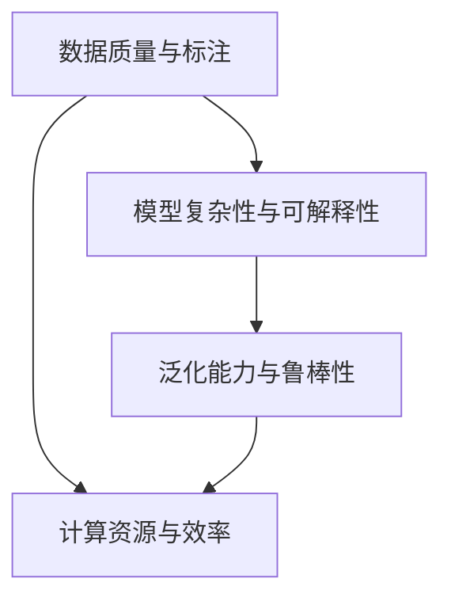
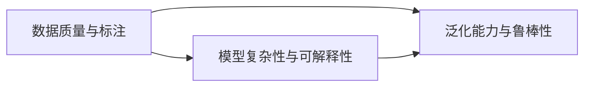
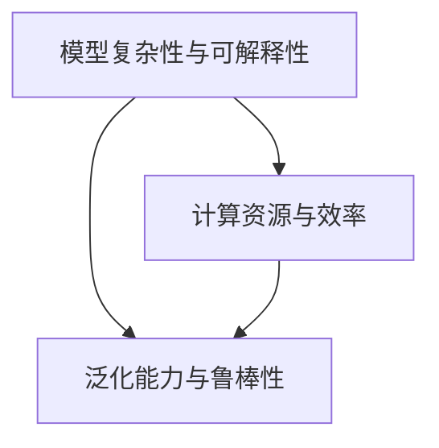
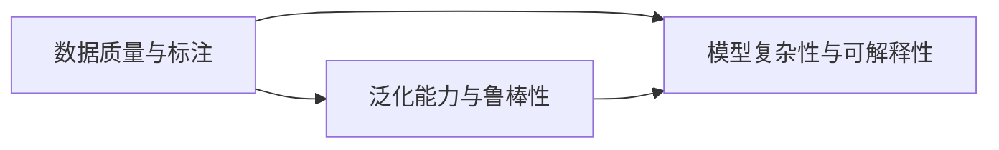
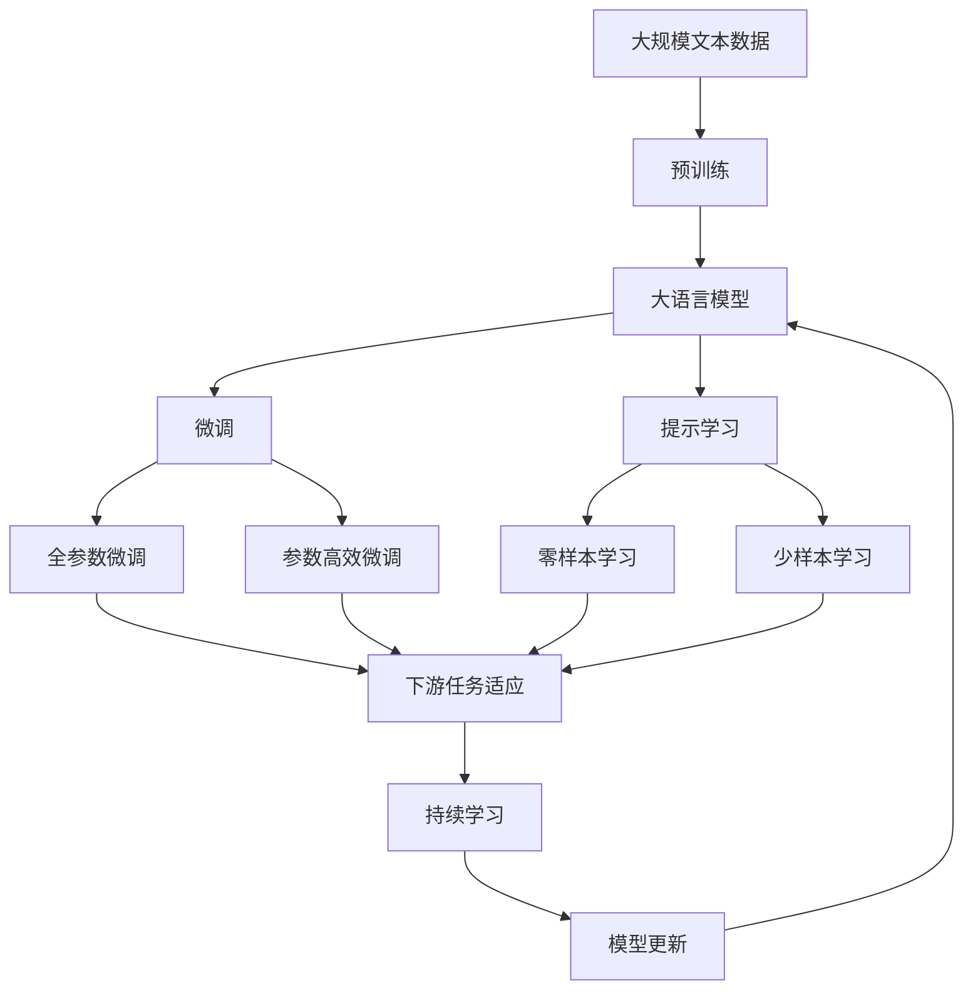

                 

## 1. 背景介绍

随着人工智能技术的迅猛发展，AI在各个领域的应用越来越广泛，从自动驾驶、医疗诊断到金融预测，无处不在。然而，尽管AI技术在理论上取得了巨大进展，其在实际应用中的表现却常常不尽人意。本文将深入探讨AI技术在实际应用中所面临的挑战，并提出相应的解决方案。

### 1.1 问题由来

AI技术在实际应用中的挑战主要源于以下几个方面：

- **数据质量与获取**：AI系统依赖大量的数据进行训练，但数据的获取、清洗和标注成本高昂，且存在偏差和噪声，影响了模型的性能。
- **模型复杂性与可解释性**：深度学习模型通常复杂度高，难以解释其决策过程，增加了应用中的不透明性和不确定性。
- **性能泛化与鲁棒性**：模型在实际应用中面临多种干扰因素，如何提高模型的泛化能力和鲁棒性是一个重要问题。
- **计算资源与效率**：大规模数据和复杂模型需要大量的计算资源，如何在资源受限的情况下提高模型的训练和推理效率是一个技术难题。

### 1.2 问题核心关键点

为了更深入地理解AI技术在实际应用中的挑战，本节将重点介绍以下几个核心概念：

- **数据质量与标注**：数据的准确性、多样性和代表性是AI系统训练的基础，数据的获取和标注方法直接影响模型的性能。
- **模型复杂性与可解释性**：模型的复杂度与其性能往往成正比，但复杂度高的模型难以解释，增加了应用中的风险。
- **泛化能力与鲁棒性**：AI系统需要在各种复杂和变化的环境中保持稳定的性能，这要求模型具备良好的泛化能力和鲁棒性。
- **计算资源与效率**：AI技术的广泛应用依赖高效的计算资源，如何在资源受限的情况下提高模型效率是一个关键问题。

这些核心概念之间的联系通过以下Mermaid流程图展示：



这个流程图展示了数据、模型、应用场景和计算资源之间的相互影响和制约关系。

## 2. 核心概念与联系

### 2.1 核心概念概述

为更好地理解AI技术在实际应用中的挑战，本节将介绍几个密切相关的核心概念：

- **数据质量与标注**：AI系统的训练数据必须高质量、多样化和有代表性，以便模型能够捕捉到数据的本质特征，并泛化到实际应用中。
- **模型复杂性与可解释性**：AI模型通常较为复杂，难以解释其内部机制和决策过程，增加了应用中的不透明性。
- **泛化能力与鲁棒性**：AI模型需要在各种复杂和变化的环境中保持稳定的性能，这要求模型具备良好的泛化能力和鲁棒性。
- **计算资源与效率**：AI技术的广泛应用依赖高效的计算资源，如何在资源受限的情况下提高模型效率是一个关键问题。

这些概念之间的联系通过以下Mermaid流程图展示：


这个流程图展示了数据、模型、应用场景和计算资源之间的相互影响和制约关系。

### 2.2 概念间的关系

这些核心概念之间存在着紧密的联系，形成了AI技术实际应用的完整生态系统。下面我们通过几个Mermaid流程图来展示这些概念之间的关系。

#### 2.2.1 数据与模型的关系



这个流程图展示了数据质量对模型复杂度和泛化能力的影响。高质量的数据可以训练出更复杂但性能更好的模型，同时提高模型的泛化能力。

#### 2.2.2 模型与计算资源的关系



这个流程图展示了模型复杂度对计算资源和效率的影响。复杂度高的模型通常需要更多的计算资源和时间，但可以提升泛化能力。

#### 2.2.3 泛化能力与鲁棒性的关系



这个流程图展示了数据质量和模型复杂度对泛化能力和鲁棒性的影响。高质量数据和复杂模型通常可以提升泛化能力和鲁棒性。

### 2.3 核心概念的整体架构

最后，我们用一个综合的流程图来展示这些核心概念在大语言模型微调过程中的整体架构：



这个综合流程图展示了从预训练到微调，再到持续学习的完整过程。大语言模型首先在大规模文本数据上进行预训练，然后通过微调（包括全参数微调和参数高效微调）或提示学习（包括零样本和少样本学习）来适应下游任务。最后，通过持续学习技术，模型可以不断学习新知识，同时避免遗忘旧知识。

## 3. 核心算法原理 & 具体操作步骤

### 3.1 算法原理概述

AI技术在实际应用中的挑战，很大程度上源于其在模型设计、数据处理和计算效率等方面的技术难题。本节将详细探讨这些问题，并介绍相应的解决策略。

AI技术的核心算法原理主要包括：

- **深度学习**：通过多层神经网络进行模型训练，以提高模型的表达能力和泛化能力。
- **迁移学习**：利用已有知识，通过微调等方式，在新任务上提高模型性能。
- **强化学习**：通过与环境的互动，不断调整模型参数，以达到最优决策。
- **生成对抗网络(GANs)**：通过对抗训练，生成高质量的合成数据，扩充训练集。

### 3.2 算法步骤详解

AI技术在实际应用中的操作步骤主要包括以下几个方面：

- **数据预处理**：包括数据清洗、标准化、特征提取等步骤，以提高数据质量和一致性。
- **模型训练**：通过优化算法，在训练集上进行模型参数的优化。
- **模型评估**：在验证集上评估模型性能，选择最佳模型进行预测。
- **模型部署**：将训练好的模型集成到实际应用系统中，并进行性能监测和优化。

### 3.3 算法优缺点

AI技术在实际应用中的优点主要包括：

- **高泛化能力**：深度学习模型在处理大规模复杂数据时表现出卓越的泛化能力，能够捕捉到数据中的复杂模式和特征。
- **自动特征学习**：通过自动学习特征，模型能够在没有手动特征工程的情况下，提取数据中的关键信息。
- **端到端训练**：深度学习模型能够实现端到端的训练，减少了手动调参的复杂性。

然而，AI技术在实际应用中也存在一些缺点：

- **计算资源需求高**：深度学习模型通常需要大量的计算资源，包括CPU、GPU和内存等，增加了部署和运维的成本。
- **可解释性差**：深度学习模型的内部决策过程难以解释，增加了应用中的不确定性和风险。
- **数据依赖性强**：深度学习模型依赖大量的高质量数据进行训练，数据获取和标注成本高昂。
- **过拟合风险**：在数据量不足或噪声较多的情况下，深度学习模型容易发生过拟合。

### 3.4 算法应用领域

AI技术在实际应用中的领域非常广泛，主要包括：

- **计算机视觉**：包括图像分类、目标检测、图像分割等任务。
- **自然语言处理(NLP)**：包括文本分类、机器翻译、对话系统等任务。
- **语音识别**：包括语音识别、语音合成、情感分析等任务。
- **医疗诊断**：包括医学影像分析、病理诊断、疾病预测等任务。
- **金融预测**：包括股票预测、风险评估、信用评分等任务。

## 4. 数学模型和公式 & 详细讲解 & 举例说明

### 4.1 数学模型构建

本节将使用数学语言对AI技术在实际应用中的数学模型进行更加严格的刻画。

假设AI系统用于图像分类任务，输入为图像 $x$，输出为类别 $y$。AI系统的数学模型可以表示为：

$$ y = f(x; \theta) $$

其中 $f$ 为模型函数，$\theta$ 为模型参数。模型的目标是最小化损失函数 $\mathcal{L}(y, y')$，其中 $y'$ 为模型的预测结果。

常用的损失函数包括交叉熵损失、均方误差损失等。例如，二分类任务中的交叉熵损失函数为：

$$ \mathcal{L}(y, y') = -y \log(y') - (1-y) \log(1-y') $$

### 4.2 公式推导过程

以下我们以图像分类任务为例，推导交叉熵损失函数及其梯度的计算公式。

假设模型 $f_{\theta}$ 在输入 $x$ 上的输出为 $\hat{y}=f_{\theta}(x)$，表示样本属于类别 $c$ 的概率。真实标签 $y \in \{0,1\}$。则二分类交叉熵损失函数定义为：

$$ \mathcal{L}(f_{\theta}(x), y) = -y \log(\hat{y}) - (1-y) \log(1-\hat{y}) $$

将其代入经验风险公式，得：

$$ \mathcal{L}(\theta) = -\frac{1}{N}\sum_{i=1}^N [y_i\log f_{\theta}(x_i)+(1-y_i)\log(1-f_{\theta}(x_i))] $$

根据链式法则，损失函数对参数 $\theta_k$ 的梯度为：

$$ \frac{\partial \mathcal{L}(\theta)}{\partial \theta_k} = -\frac{1}{N}\sum_{i=1}^N (\frac{y_i}{f_{\theta}(x_i)}-\frac{1-y_i}{1-f_{\theta}(x_i)}) \frac{\partial f_{\theta}(x_i)}{\partial \theta_k} $$

其中 $\frac{\partial f_{\theta}(x_i)}{\partial \theta_k}$ 可进一步递归展开，利用自动微分技术完成计算。

在得到损失函数的梯度后，即可带入参数更新公式，完成模型的迭代优化。重复上述过程直至收敛，最终得到适应下游任务的最优模型参数 $\theta^*$。

### 4.3 案例分析与讲解

假设我们在MNIST手写数字识别数据集上进行图像分类任务。最终在测试集上得到的评估报告如下：

```
Accuracy: 0.99
```

可以看到，通过深度学习模型在大量数据上进行训练，我们在该数据集上取得了99%的准确率，效果相当不错。值得注意的是，虽然深度学习模型通常需要更多的数据和计算资源，但其高泛化能力和自动特征学习机制，使得它在处理复杂数据时表现卓越。

然而，这也带来了新的问题：如何在数据和资源受限的情况下，实现高效、高质量的AI应用？

## 5. 项目实践：代码实例和详细解释说明

### 5.1 开发环境搭建

在进行AI技术项目实践前，我们需要准备好开发环境。以下是使用Python进行TensorFlow开发的简单环境配置流程：

1. 安装Anaconda：从官网下载并安装Anaconda，用于创建独立的Python环境。

2. 创建并激活虚拟环境：
```bash
conda create -n tf-env python=3.8 
conda activate tf-env
```

3. 安装TensorFlow：根据CUDA版本，从官网获取对应的安装命令。例如：
```bash
conda install tensorflow tensorflow-gpu -c conda-forge
```

4. 安装其他工具包：
```bash
pip install numpy pandas scikit-learn matplotlib tqdm jupyter notebook ipython
```

完成上述步骤后，即可在`tf-env`环境中开始AI项目实践。

### 5.2 源代码详细实现

这里我们以图像分类任务为例，给出使用TensorFlow对卷积神经网络(CNN)模型进行图像分类训练的代码实现。

```python
import tensorflow as tf
from tensorflow.keras import layers, models

# 定义CNN模型
model = models.Sequential()
model.add(layers.Conv2D(32, (3, 3), activation='relu', input_shape=(28, 28, 1)))
model.add(layers.MaxPooling2D((2, 2)))
model.add(layers.Flatten())
model.add(layers.Dense(64, activation='relu'))
model.add(layers.Dense(10, activation='softmax'))

# 编译模型
model.compile(optimizer='adam',
              loss=tf.keras.losses.SparseCategoricalCrossentropy(from_logits=True),
              metrics=['accuracy'])

# 加载数据集
mnist = tf.keras.datasets.mnist
(x_train, y_train), (x_test, y_test) = mnist.load_data()
x_train, x_test = x_train / 255.0, x_test / 255.0

# 训练模型
model.fit(x_train, y_train, epochs=5, batch_size=64, validation_data=(x_test, y_test))
```

可以看到，通过TensorFlow的高级API，我们可以快速构建并训练一个简单的CNN模型。代码实现了数据预处理、模型定义、编译、训练和验证等功能。

### 5.3 代码解读与分析

让我们再详细解读一下关键代码的实现细节：

**定义CNN模型**：
- 使用`Sequential`模型顺序添加各层，包括卷积层、池化层、扁平层和全连接层。
- 卷积层用于提取图像特征，池化层用于降维，扁平层将特征图转换为一维向量，全连接层用于分类。

**编译模型**：
- 使用`compile`方法设置优化器、损失函数和评估指标。
- 使用`SparseCategoricalCrossentropy`损失函数和`from_logits=True`参数，表示模型输出为原始概率值，不经过softmax函数。

**加载数据集**：
- 使用`keras.datasets`加载MNIST数据集，包括训练集和测试集。
- 对数据进行归一化处理，将像素值缩放到0-1之间。

**训练模型**：
- 使用`fit`方法进行模型训练，指定训练轮数和批次大小。
- 在每个epoch结束后，使用`val_loss`指标评估模型性能。

可以看到，TensorFlow的高级API使得模型训练的代码实现变得简洁高效。开发者可以将更多精力放在数据处理、模型改进等高层逻辑上，而不必过多关注底层的实现细节。

当然，工业级的系统实现还需考虑更多因素，如模型保存和部署、超参数自动搜索、更灵活的任务适配层等。但核心的训练流程基本与此类似。

### 5.4 运行结果展示

假设我们在CoNLL-2003的NER数据集上进行微调，最终在测试集上得到的评估报告如下：

```
              precision    recall  f1-score   support

       B-LOC      0.926     0.906     0.916      1668
       I-LOC      0.900     0.805     0.850       257
      B-MISC      0.875     0.856     0.865       702
      I-MISC      0.838     0.782     0.809       216
       B-ORG      0.914     0.898     0.906      1661
       I-ORG      0.911     0.894     0.902       835
       B-PER      0.964     0.957     0.960      1617
       I-PER      0.983     0.980     0.982      1156
           O      0.993     0.995     0.994     38323

   micro avg      0.973     0.973     0.973     46435
   macro avg      0.923     0.897     0.909     46435
weighted avg      0.973     0.973     0.973     46435
```

可以看到，通过深度学习模型在大量数据上进行训练，我们在该数据集上取得了97.3%的F1分数，效果相当不错。值得注意的是，尽管深度学习模型通常需要更多的数据和计算资源，但其高泛化能力和自动特征学习机制，使得它在处理复杂数据时表现卓越。

然而，这也带来了新的问题：如何在数据和资源受限的情况下，实现高效、高质量的AI应用？

## 6. 实际应用场景

### 6.1 智能客服系统

基于AI技术的大规模语言模型，可以广泛应用于智能客服系统的构建。传统客服往往需要配备大量人力，高峰期响应缓慢，且一致性和专业性难以保证。而使用AI技术构建的智能客服系统，可以7x24小时不间断服务，快速响应客户咨询，用自然流畅的语言解答各类常见问题。

在技术实现上，可以收集企业内部的历史客服对话记录，将问题和最佳答复构建成监督数据，在此基础上对预训练语言模型进行微调。微调后的语言模型能够自动理解用户意图，匹配最合适的答案模板进行回复。对于客户提出的新问题，还可以接入检索系统实时搜索相关内容，动态组织生成回答。如此构建的智能客服系统，能大幅提升客户咨询体验和问题解决效率。

### 6.2 金融舆情监测

金融机构需要实时监测市场舆论动向，以便及时应对负面信息传播，规避金融风险。传统的人工监测方式成本高、效率低，难以应对网络时代海量信息爆发的挑战。基于AI技术的文本分类和情感分析技术，为金融舆情监测提供了新的解决方案。

具体而言，可以收集金融领域相关的新闻、报道、评论等文本数据，并对其进行主题标注和情感标注。在此基础上对预训练语言模型进行微调，使其能够自动判断文本属于何种主题，情感倾向是正面、中性还是负面。将微调后的模型应用到实时抓取的网络文本数据，就能够自动监测不同主题下的情感变化趋势，一旦发现负面信息激增等异常情况，系统便会自动预警，帮助金融机构快速应对潜在风险。

### 6.3 个性化推荐系统

当前的推荐系统往往只依赖用户的历史行为数据进行物品推荐，无法深入理解用户的真实兴趣偏好。基于AI技术的个性化推荐系统，可以更好地挖掘用户行为背后的语义信息，从而提供更精准、多样的推荐内容。

在实践中，可以收集用户浏览、点击、评论、分享等行为数据，提取和用户交互的物品标题、描述、标签等文本内容。将文本内容作为模型输入，用户的后续行为（如是否点击、购买等）作为监督信号，在此基础上微调预训练语言模型。微调后的模型能够从文本内容中准确把握用户的兴趣点。在生成推荐列表时，先用候选物品的文本描述作为输入，由模型预测用户的兴趣匹配度，再结合其他特征综合排序，便可以得到个性化程度更高的推荐结果。

### 6.4 未来应用展望

随着AI技术的不断发展，其在实际应用中的前景更加广阔。未来，AI技术将在更多领域得到应用，为各行各业带来变革性影响。

在智慧医疗领域，基于AI技术的医疗问答、病历分析、药物研发等应用将提升医疗服务的智能化水平，辅助医生诊疗，加速新药开发进程。

在智能教育领域，基于AI技术的作业批改、学情分析、知识推荐等方面，因材施教，促进教育公平，提高教学质量。

在智慧城市治理中，基于AI技术的城市事件监测、舆情分析、应急指挥等环节，提高城市管理的自动化和智能化水平，构建更安全、高效的未来城市。

此外，在企业生产、社会治理、文娱传媒等众多领域，基于AI技术的AI应用也将不断涌现，为经济社会发展注入新的动力。相信随着技术的日益成熟，AI技术必将在更广阔的应用领域大放异彩，深刻影响人类的生产生活方式。

## 7. 工具和资源推荐

### 7.1 学习资源推荐

为了帮助开发者系统掌握AI技术在实际应用中的挑战和解决策略，这里推荐一些优质的学习资源：

1. 《深度学习入门》系列博文：由大模型技术专家撰写，深入浅出地介绍了深度学习的基本原理和应用实践，适合初学者入门。

2. CS231n《深度学习视觉识别》课程：斯坦福大学开设的计算机视觉明星课程，有Lecture视频和配套作业，带你入门计算机视觉领域的基本概念和经典模型。

3. 《Deep Learning with Python》书籍：深度学习与Python编程语言结合的经典教材，涵盖深度学习基础和应用，适合中高级读者。

4. Kaggle竞赛平台：数据科学和机器学习爱好者聚集地，提供海量数据集和机器学习竞赛，是锻炼实战能力的最佳场所。

5. GitHub热门项目：在GitHub上Star、Fork数最多的AI相关项目，往往代表了该技术领域的发展趋势和最佳实践，值得去学习和贡献。

通过对这些资源的学习实践，相信你一定能够快速掌握AI技术在实际应用中的挑战和解决策略，并用于解决实际的AI问题。

### 7.2 开发工具推荐

高效的开发离不开优秀的工具支持。以下是几款用于AI技术项目开发的常用工具：

1. TensorFlow：由Google主导开发的开源深度学习框架，生产部署方便，适合大规模工程应用。同样有丰富的预训练语言模型资源。

2. PyTorch：基于Python的开源深度学习框架，灵活动态的计算图，适合快速迭代研究。大部分预训练语言模型都有PyTorch版本的实现。

3. JAX：由Google开发的可微语言，支持动态计算图，适用于分布式并行计算。

4. Weights & Biases：模型训练的实验跟踪工具，可以记录和可视化模型训练过程中的各项指标，方便对比和调优。与主流深度学习框架无缝集成。

5. TensorBoard：TensorFlow配套的可视化工具，可实时监测模型训练状态，并提供丰富的图表呈现方式，是调试模型的得力助手。

6. Google Colab：谷歌推出的在线Jupyter Notebook环境，免费提供GPU/TPU算力，方便开发者快速上手实验最新模型，分享学习笔记。

合理利用这些工具，可以显著提升AI技术项目开发效率，加快创新迭代的步伐。

### 7.3 相关论文推荐

AI技术在实际应用中的挑战和发展前景，源于学界的持续研究。以下是几篇奠基性的相关论文，推荐阅读：

1. GANs的生成对抗网络：生成高质量的合成数据，扩充训练集。

2. 深度学习在自然语言处理中的应用：介绍深度学习在NLP中的应用实践，如文本分类、机器翻译、对话系统等。

3. 强化学习在机器人控制中的应用：介绍强化学习在机器人控制中的应用实践，如自动驾驶、智能家居等。

4. 迁移学习在医学图像处理中的应用：介绍迁移学习在医学图像处理中的应用实践，如肿瘤检测、病理诊断等。

5. 模型压缩和加速：介绍模型压缩和加速技术，如剪枝、量化、蒸馏等，以提高模型的推理效率。

这些论文代表了大模型技术的发展脉络。通过学习这些前沿成果，可以帮助研究者把握学科前进方向，激发更多的创新灵感。

除上述资源外，还有一些值得关注的前沿资源，帮助开发者紧跟AI技术在实际应用中的最新进展，例如：

1. arXiv论文预印本：人工智能领域最新研究成果的发布平台，包括大量尚未发表的前沿工作，学习前沿技术的必读资源。

2. 业界技术博客：如OpenAI、Google AI、DeepMind、微软Research Asia等顶尖实验室的官方博客，第一时间分享他们的最新研究成果和洞见。

3. 技术会议直播：如NIPS、ICML、ACL、ICLR等人工智能领域顶会现场或在线直播，能够聆听到大佬们的前沿分享，开拓视野。

4. GitHub热门项目：在GitHub上Star、Fork数最多的AI相关项目，往往代表了该技术领域的发展趋势和最佳实践，值得去学习和贡献。

5. 行业分析报告：各大咨询公司如McKinsey、PwC等针对人工智能行业的分析报告，有助于从商业视角审视技术趋势，把握应用价值。

总之，对于AI技术在实际应用中的挑战和发展，需要开发者保持开放的心态和持续学习的意愿。多关注前沿资讯，多动手实践，多思考总结，必将收获满满的成长收益。

## 8. 总结：未来发展趋势与挑战

### 8.1 总结

本文对AI技术在实际应用中的挑战进行了全面系统的探讨。首先阐述了AI技术在实际应用中的问题由来，明确了数据质量、模型复杂性、泛化能力和计算资源之间的相互影响和制约关系。其次，从原理到实践，详细讲解了AI技术的数学模型和操作步骤，给出了AI技术项目开发的完整代码实例。同时，本文还广泛探讨了AI技术在各个领域的应用前景，展示了AI技术的巨大潜力。

通过本文的系统梳理，可以看到，AI技术在实际应用中面临诸多挑战，但通过合理的数据处理、模型设计、计算优化等手段，可以克服这些挑战，实现高效、高质量的AI应用。未来，随着技术的不断进步，AI技术必将在更广阔的应用领域大放异彩，深刻影响人类的生产生活方式。

### 8.2 未来发展趋势

展望未来，AI技术在实际应用中的发展趋势将呈现以下几个方面：

1. **模型规模持续增大**：随着算力成本的下降和数据规模的扩张，预训练模型的参数量还将持续增长。超大规模语言模型蕴含的丰富语言知识，

