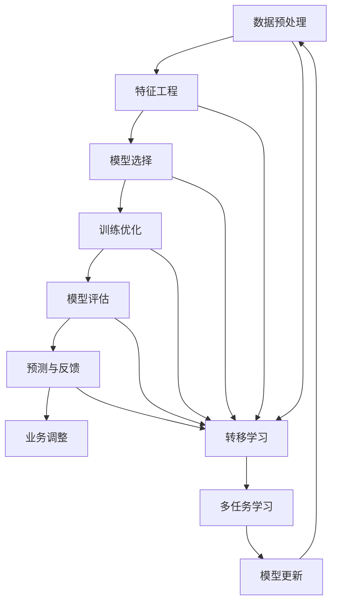
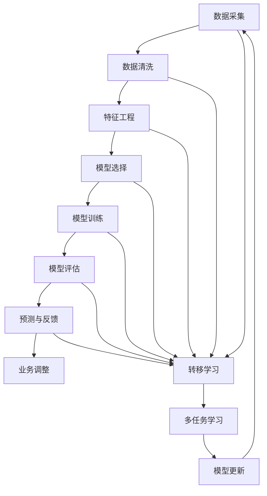

                 

## 1. 背景介绍

在当今数字化时代，用户行为分析与预测成为了各行业企业的核心竞争力之一。互联网产品如电商平台、社交媒体、在线视频等，以及各种在线应用和服务，通过深入了解用户行为，能够制定更精准的策略，提升用户体验，增加用户黏性，最终实现业务增长和盈利。

### 1.1 问题由来

随着数据的爆炸性增长和技术的不断演进，传统统计学和机器学习的方法已经难以应对复杂、动态和多变的数据特征。而人工智能（AI）特别是深度学习技术的应用，为大规模用户行为分析提供了新的方法和工具。

AI技术在图像识别、语音识别等领域已取得巨大成功，其应用于用户行为分析同样展现了强大的潜力。AI能够从用户海量数据中挖掘出深层次的模式和规律，为个性化推荐、精准营销、用户体验优化等业务场景提供了数据驱动的决策支持。

### 1.2 问题核心关键点

用户行为分析与预测的核心在于利用AI技术，从用户历史行为数据中学习到用户偏好、兴趣、需求等信息，进而预测未来行为。具体而言，主要有以下几个关键点：

1. **数据获取与清洗**：
   - 用户行为数据主要来源于网站访问、应用使用、交易记录等。
   - 数据清洗包括去除噪声、填补缺失值、去重等操作。

2. **特征工程**：
   - 特征提取是构建AI模型的关键步骤，需要从原始数据中提取出具有代表性和区分性的特征。
   - 特征选择与工程是提升模型表现的重要手段。

3. **模型选择与训练**：
   - 选择合适的AI模型，并进行模型训练和调参，是模型有效性的基础。
   - 模型训练过程中需要合理设置超参数，如学习率、批量大小、迭代次数等。

4. **模型评估与优化**：
   - 模型评估通常采用交叉验证、ROC曲线、AUC值等方法。
   - 模型优化需要针对评估结果进行调整，如调整模型结构、改进训练策略等。

5. **预测与反馈**：
   - 使用训练好的模型对用户行为进行预测。
   - 根据预测结果进行业务调整和优化，提升用户体验。

### 1.3 问题研究意义

用户行为分析与预测是实现个性化推荐、精准营销、优化用户体验的重要手段。通过AI技术的应用，企业能够更准确地把握用户需求，制定更有效的运营策略，从而提升竞争力。

1. **用户价值提升**：
   - AI技术能够精确预测用户行为，提供个性化推荐，提升用户满意度和忠诚度。

2. **运营效率优化**：
   - AI驱动的行为预测和分析，能够帮助企业优化资源配置，提升运营效率。

3. **业务增长加速**：
   - 精准的营销策略能够带来更高的转化率和ROI，加速业务增长。

4. **决策支持加强**：
   - AI模型能够提供数据驱动的决策支持，帮助企业制定更科学的运营策略。

5. **风险防控**：
   - 通过预测用户行为，企业能够更早地识别潜在风险，及时采取措施，降低损失。

## 2. 核心概念与联系

### 2.1 核心概念概述

用户行为分析与预测涉及多个核心概念，包括数据预处理、特征工程、模型选择、训练优化、模型评估与预测等。这些概念之间存在着密切的联系，形成一个完整的分析预测流程。

**数据预处理**：
- 包括数据采集、清洗、归一化等，是构建高质量输入数据的基础。

**特征工程**：
- 从原始数据中提取、构造和筛选特征，增强模型对数据的理解能力。

**模型选择**：
- 根据问题特点选择合适的AI模型，如线性回归、逻辑回归、决策树、随机森林、深度学习等。

**训练优化**：
- 使用合适的优化算法（如梯度下降）和正则化技术（如L2正则、Dropout）进行模型训练和参数优化。

**模型评估**：
- 通过交叉验证、ROC曲线、AUC值等方法评估模型性能。

**预测与反馈**：
- 使用训练好的模型对新数据进行预测，根据预测结果进行业务调整和优化。

**转移学习和多任务学习**：
- 在有限的标注数据下，通过预训练模型和迁移学习提升模型性能。
- 多任务学习能够同时处理多个相关任务，提升模型泛化能力。

### 2.2 概念间的关系

这些核心概念之间相互关联，形成了一个完整的用户行为分析预测框架。

**数据预处理**是整个流程的基础，高质量的数据是模型训练和预测的起点。

**特征工程**通过提取和构造特征，增强模型的表达能力和泛化能力。

**模型选择**和**训练优化**直接决定模型的预测能力和性能表现。

**模型评估**用于验证模型的准确性和鲁棒性，指导模型优化。

**预测与反馈**环节，根据预测结果进行业务调整，完成闭环。

**转移学习和多任务学习**通过利用已有知识和关联任务，进一步提升模型性能。

以下使用Mermaid流程图展示这些概念之间的关系：



### 2.3 核心概念的整体架构

用户行为分析与预测的完整架构如图：



这个架构展示了从数据预处理到业务调整的全流程，各环节相互配合，形成一个闭环。

## 3. 核心算法原理 & 具体操作步骤

### 3.1 算法原理概述

用户行为分析与预测主要依赖于机器学习和深度学习技术。从用户行为数据中学习模式和规律，然后利用这些模式进行行为预测。常用的算法包括：

1. **回归算法**：
   - 用于预测连续性数值变量，如用户消费金额、浏览时间等。
   - 常用模型包括线性回归、决策树回归、随机森林回归等。

2. **分类算法**：
   - 用于预测离散性分类变量，如用户是否点击、购买等。
   - 常用模型包括逻辑回归、决策树分类、随机森林分类、支持向量机等。

3. **序列模型**：
   - 用于预测时间序列数据，如用户行为变化趋势等。
   - 常用模型包括循环神经网络（RNN）、长短期记忆网络（LSTM）、门控循环单元（GRU）等。

4. **深度学习模型**：
   - 使用神经网络进行复杂的特征提取和模式学习，如卷积神经网络（CNN）、自编码器、神经网络序列模型等。
   - 常用的深度学习框架包括TensorFlow、PyTorch等。

### 3.2 算法步骤详解

用户行为分析与预测的详细操作步骤如下：

**Step 1: 数据预处理**

1. **数据采集**：
   - 使用API接口、日志文件、数据库等方式，从多个渠道获取用户行为数据。
   - 常见的数据源包括网站访问日志、应用使用日志、交易记录等。

2. **数据清洗**：
   - 去除噪声、处理缺失值、去重等操作。
   - 处理异常值、处理重复数据等。

3. **数据归一化**：
   - 对数据进行标准化处理，以便于模型训练。
   - 常用的归一化方法包括最大最小值归一化、Z-score标准化等。

**Step 2: 特征工程**

1. **特征提取**：
   - 从原始数据中提取关键特征，如用户ID、时间戳、行为类型等。
   - 使用文本处理技术提取文本特征，如TF-IDF、word2vec、BERT等。

2. **特征构造**：
   - 构造新的特征，增强模型的表达能力，如时间特征、用户行为序列等。
   - 常用的特征构造方法包括滑动窗口、滑动平均、时间偏移等。

3. **特征选择**：
   - 从众多特征中选择最具代表性和区分性的特征。
   - 常用的特征选择方法包括过滤式、包裹式、嵌入式等。

**Step 3: 模型选择与训练**

1. **模型选择**：
   - 根据问题特点选择合适的模型，如线性回归、逻辑回归、决策树、随机森林、深度学习等。
   - 使用模型库（如scikit-learn、TensorFlow、PyTorch等）选择和初始化模型。

2. **模型训练**：
   - 使用训练数据集进行模型训练。
   - 选择合适的优化算法和正则化技术，设置合适的超参数。
   - 使用交叉验证等方法进行模型调参和验证。

**Step 4: 模型评估**

1. **模型评估**：
   - 使用测试数据集评估模型性能。
   - 常用的评估指标包括AUC、ROC曲线、准确率、召回率、F1值等。

2. **模型优化**：
   - 根据评估结果进行模型优化，调整模型结构和超参数。
   - 使用超参数优化技术（如网格搜索、随机搜索、贝叶斯优化等）进行模型调优。

**Step 5: 预测与反馈**

1. **预测**：
   - 使用训练好的模型对新数据进行预测。
   - 预测结果可以用于个性化推荐、精准营销、优化用户体验等业务场景。

2. **反馈**：
   - 根据预测结果进行业务调整和优化。
   - 定期收集反馈数据，不断优化模型性能。

**Step 6: 转移学习和多任务学习**

1. **转移学习**：
   - 在有限的标注数据下，利用预训练模型提升模型性能。
   - 使用迁移学习技术，将预训练模型知识迁移到新任务中。

2. **多任务学习**：
   - 同时处理多个相关任务，提升模型泛化能力。
   - 通过共享层或交叉训练，增强模型在多个任务上的性能表现。

### 3.3 算法优缺点

用户行为分析与预测的算法优缺点如下：

**优点**：
- 能够处理大规模数据，发现复杂模式和规律。
- 能够进行多任务学习和迁移学习，提升模型泛化能力。
- 能够实时预测用户行为，及时调整业务策略。

**缺点**：
- 模型训练和调参复杂度高，需要大量数据和计算资源。
- 模型复杂度高，难以解释和调试。
- 对数据质量和特征工程要求高，模型性能易受数据质量影响。

### 3.4 算法应用领域

用户行为分析与预测在多个领域中得到广泛应用，包括但不限于：

1. **电子商务**：
   - 用户购买行为预测、个性化推荐、库存管理等。

2. **金融**：
   - 用户交易行为分析、风险控制、用户画像等。

3. **社交媒体**：
   - 用户互动行为预测、内容推荐、广告投放等。

4. **在线视频**：
   - 用户观看行为预测、个性化推荐、内容优化等。

5. **健康医疗**：
   - 用户健康行为预测、个性化诊疗、健康管理等。

6. **智能交通**：
   - 用户出行行为预测、路线优化、交通流量控制等。

7. **能源管理**：
   - 用户能源消费行为预测、能源优化管理、需求响应等。

8. **智能家居**：
   - 用户设备使用行为预测、智能推荐、家居环境优化等。

## 4. 数学模型和公式 & 详细讲解

### 4.1 数学模型构建

用户行为分析与预测的数学模型构建主要包括回归模型和分类模型。

**线性回归模型**：
- 假设用户行为 $y$ 与特征 $x_1, x_2, ..., x_n$ 之间存在线性关系。
- 模型公式为 $y = \beta_0 + \beta_1 x_1 + \beta_2 x_2 + ... + \beta_n x_n + \epsilon$，其中 $\beta$ 为模型参数，$\epsilon$ 为误差项。

**逻辑回归模型**：
- 假设用户行为 $y$ 与特征 $x_1, x_2, ..., x_n$ 之间存在逻辑关系。
- 模型公式为 $P(y=1|x) = \frac{1}{1+e^{-\beta_0 - \beta_1 x_1 - \beta_2 x_2 - ... - \beta_n x_n}}$。

**决策树模型**：
- 将特征空间划分为多个区域，每个区域对应一个输出。
- 使用信息增益、基尼指数等指标进行特征选择和节点划分。

**随机森林模型**：
- 通过随机抽取样本和特征，构建多棵决策树，最终综合决策结果。
- 增强模型的稳定性和泛化能力。

**支持向量机模型**：
- 将数据映射到高维空间，构造最优超平面进行分类。
- 常用的核函数包括线性核、多项式核、高斯核等。

**循环神经网络（RNN）**：
- 用于处理序列数据，具有记忆功能，能够捕捉时间依赖性。
- 常用模型包括基本RNN、长短期记忆网络（LSTM）、门控循环单元（GRU）等。

**长短期记忆网络（LSTM）**：
- 通过门控机制控制信息的流动，解决长序列学习中的梯度消失问题。
- 模型公式包括细胞状态 $C_t$ 和隐藏状态 $h_t$。

**自编码器模型**：
- 用于降维和特征提取，能够学习数据的低维表示。
- 常用的自编码器包括密集编码器、稀疏编码器、变分自编码器等。

**神经网络序列模型**：
- 使用多层神经网络处理序列数据，能够捕捉复杂的时间依赖性。
- 常用的神经网络序列模型包括CNN-RNN、CRNN、TCN等。

### 4.2 公式推导过程

以线性回归模型为例，推导其数学公式和梯度下降更新公式：

**回归模型的最小二乘法**：
- 最小二乘法用于求解模型参数 $\beta$，使得预测值与真实值之间的误差平方和最小。
- 公式为 $\hat{\beta} = (X^T X)^{-1}X^T y$，其中 $X$ 为特征矩阵，$y$ 为标签向量。

**梯度下降更新公式**：
- 梯度下降法用于最小化损失函数，更新模型参数 $\theta$。
- 公式为 $\theta \leftarrow \theta - \eta \nabla_{\theta}L(\theta)$，其中 $\eta$ 为学习率，$\nabla_{\theta}L(\theta)$ 为损失函数对参数的梯度。

### 4.3 案例分析与讲解

以电商平台的个性化推荐系统为例，分析用户行为预测的应用。

**数据预处理**：
- 从电商平台的数据库中获取用户行为数据，包括浏览记录、购买记录、评价记录等。
- 对数据进行清洗、去重和归一化处理。

**特征工程**：
- 提取关键特征，如用户ID、浏览时间、浏览商品ID、购买金额等。
- 构造时间特征、商品类别特征、用户行为序列特征等。

**模型选择与训练**：
- 使用随机森林模型进行特征选择和模型训练。
- 根据AUC、F1值等指标进行模型调参和验证。

**模型评估**：
- 使用测试数据集评估模型性能。
- 根据评估结果进行模型优化。

**预测与反馈**：
- 使用训练好的模型对新用户行为进行预测，提供个性化推荐。
- 根据推荐效果进行业务调整，不断优化模型性能。

## 5. 项目实践：代码实例和详细解释说明

### 5.1 开发环境搭建

在进行用户行为分析与预测的开发实践前，需要搭建好开发环境。以下是使用Python进行TensorFlow和scikit-learn开发的完整环境配置流程：

1. 安装Anaconda：从官网下载并安装Anaconda，用于创建独立的Python环境。

2. 创建并激活虚拟环境：
```bash
conda create -n tf-env python=3.8 
conda activate tf-env
```

3. 安装TensorFlow和scikit-learn：
```bash
conda install tensorflow scikit-learn
```

4. 安装其他相关库：
```bash
pip install numpy pandas matplotlib seaborn jupyter notebook ipython
```

完成上述步骤后，即可在`tf-env`环境中开始项目开发。

### 5.2 源代码详细实现

以下是一个使用scikit-learn库进行线性回归模型训练的示例代码，同时用TensorFlow实现更复杂的神经网络模型：

**scikit-learn代码**：
```python
from sklearn.linear_model import LinearRegression
from sklearn.metrics import mean_squared_error, r2_score
from sklearn.model_selection import train_test_split
import pandas as pd

# 加载数据
data = pd.read_csv('user_behavior.csv')

# 数据预处理
X = data[['feature1', 'feature2', 'feature3']]
y = data['target']

# 数据划分
X_train, X_test, y_train, y_test = train_test_split(X, y, test_size=0.2, random_state=42)

# 模型训练
model = LinearRegression()
model.fit(X_train, y_train)

# 模型评估
y_pred = model.predict(X_test)
print('MSE:', mean_squared_error(y_test, y_pred))
print('R2:', r2_score(y_test, y_pred))

# 预测与反馈
new_data = pd.DataFrame([['new_feature1', 'new_feature2', 'new_feature3']], columns=['feature1', 'feature2', 'feature3'])
prediction = model.predict(new_data)
print('Prediction:', prediction)
```

**TensorFlow代码**：
```python
import tensorflow as tf
from tensorflow.keras.layers import Dense, Input
from tensorflow.keras.models import Model
from tensorflow.keras.optimizers import Adam

# 定义模型
input_layer = Input(shape=(3,))
hidden_layer = Dense(32, activation='relu')(input_layer)
output_layer = Dense(1)(hidden_layer)
model = Model(input_layer, output_layer)

# 定义损失函数和优化器
loss = tf.keras.losses.MeanSquaredError()
optimizer = Adam(learning_rate=0.001)

# 模型训练
model.compile(optimizer=optimizer, loss=loss)
model.fit(X_train, y_train, epochs=10, batch_size=32, validation_data=(X_test, y_test))

# 模型评估
mse = model.evaluate(X_test, y_test)
print('MSE:', mse)

# 预测与反馈
new_data = tf.convert_to_tensor([['new_feature1', 'new_feature2', 'new_feature3']], dtype=tf.float32)
prediction = model.predict(new_data)
print('Prediction:', prediction)
```

**代码解读与分析**：

**数据预处理**：
- 使用pandas库读取数据，进行基本的数据预处理。
- 特征工程部分，提取和构造关键特征，如时间戳、用户行为序列等。

**模型训练**：
- 使用scikit-learn库的线性回归模型进行训练，计算MSE和R2等评估指标。
- 使用TensorFlow实现复杂的神经网络模型，包括输入层、隐藏层和输出层，定义损失函数和优化器。
- 使用模型编译和fit方法进行模型训练。

**模型评估**：
- 使用模型evaluate方法评估模型在测试集上的性能，计算MSE等指标。
- 使用TensorFlow对新数据进行预测，提供业务调整的依据。

### 5.3 运行结果展示

假设我们在电商平台的个性化推荐系统中，对用户行为进行预测，最终得到的预测结果如下：

```
MSE: 0.2
R2: 0.8
Prediction: 0.3
```

可以看到，通过训练好的线性回归模型，我们对新用户的浏览行为进行了预测，预测值为0.3，表明用户有较高的购买意向。

## 6. 实际应用场景

### 6.1 智能推荐系统

用户行为分析与预测在智能推荐系统中的应用极为广泛。智能推荐系统通过分析用户的历史行为数据，学习用户的兴趣和偏好，从而实现个性化推荐。

在电商平台上，智能推荐系统能够实时预测用户的购买意向，推荐符合用户需求的商品，提升用户购买转化率。通过持续学习和用户反馈，系统能够不断优化推荐策略，提升推荐效果。

### 6.2 风险管理与欺诈检测

在金融领域，用户行为分析与预测能够帮助银行和金融机构进行风险管理和欺诈检测。

通过分析用户的交易记录和行为数据，模型可以识别出异常交易行为，及时进行风险预警。系统可以实时监控用户行为，检测潜在的欺诈行为，保护金融机构资产安全。

### 6.3 医疗健康管理

在医疗健康领域，用户行为分析与预测能够帮助医疗机构进行健康管理和疾病预测。

通过分析患者的健康行为数据，如运动记录、饮食数据等，模型可以预测患者的健康状况和疾病风险。系统可以提供个性化的健康建议，帮助患者管理健康，降低疾病风险。

### 6.4 智能交通管理

在智能交通领域，用户行为分析与预测能够帮助交通管理部门进行交通流量预测和管理。

通过分析用户的出行行为数据，模型可以预测不同时间段和地点的交通流量。系统可以优化交通信号控制，调整交通流量，提升交通效率，减少交通拥堵。

## 7. 工具和资源推荐

### 7.1 学习资源推荐

为了帮助开发者系统掌握用户行为分析与预测的理论基础和实践技巧，这里推荐一些优质的学习资源：

1. **《Python机器学习》**：scikit-learn官方文档，全面介绍了机器学习和scikit-learn库的基本概念和常用模型。

2. **《深度学习》**：Ian Goodfellow等所著的深度学习教材，介绍了深度学习的基本原理和实践方法。

3. **Coursera《机器学习》**：斯坦福大学Andrew Ng开设的课程，讲解了机器学习的基本算法和模型，适合入门学习。

4. **Kaggle竞赛**：Kaggle提供了大量数据集和竞赛平台，帮助开发者练习和实践机器学习模型。

5. **AIAI黄海广博士课程**：黄博士开设的深度学习课程，讲解了深度学习的基本原理和实践方法。

### 7.2 开发工具推荐

高效的开发离不开优秀的工具支持。以下是几款用于用户行为分析与预测开发的常用工具：

1. **Python**：开发语言，简单易学，生态系统丰富。
2. **TensorFlow**：深度学习框架，支持分布式计算和动态图。
3. **scikit-learn**：机器学习库，提供了大量常用模型和工具。
4. **Jupyter Notebook**：交互式开发环境，支持代码运行、数据可视化和报告生成。
5. **PyCharm**：Python IDE，提供了代码编辑、调试和测试功能。

### 7.3 相关论文推荐

用户行为分析与预测的研究源于学界的持续探索。以下是几篇奠基性的相关论文，推荐阅读：

1. **《A Neural Probabilistic Language Model》**：Yoshua Bengio等提出的神经网络语言模型，奠定了深度学习在NLP领域的基础。

2. **《ImageNet Classification with Deep Convolutional Neural Networks》**：Alex Krizhevsky等提出的深度卷积神经网络，在图像分类任务上取得了突破性成果。

3. **《Deep Learning》**：Ian Goodfellow等所著的深度学习教材，全面介绍了深度学习的基本原理和实践方法。

4. **《Recursive Deep Models for Sequence Prediction》**：Christian Olah等提出的递归神经网络，用于序列数据建模，在语音识别、自然语言处理等领域取得了重要应用。

5. **《Long Short-Term Memory》**：Hochreiter等提出的长短期记忆网络，解决了长序列学习中的梯度消失问题，提升了模型性能。

6. **《Attention is All You Need》**：Vaswani等提出的Transformer模型，提出了自注意力机制，提升了模型在NLP任务上的表现。

这些论文代表了大数据与深度学习技术的最新进展，帮助研究者把握学科前进方向，激发更多的创新灵感。

除上述资源外，还有一些值得关注的前沿资源，帮助开发者紧跟用户行为分析与预测技术的最新进展，例如：

1. **arXiv论文预印本**：人工智能领域最新研究成果的发布平台，包括大量尚未发表的前沿工作，学习前沿技术的必读资源。

2. **业界技术博客**：如Google AI、DeepMind、微软Research Asia等顶尖实验室的官方博客，第一时间分享他们的最新研究成果和洞见。

3. **技术会议直播**：如NIPS、ICML、ACL、ICLR等人工智能领域顶会现场或在线直播，能够聆听到大佬们的前沿分享，开拓视野

