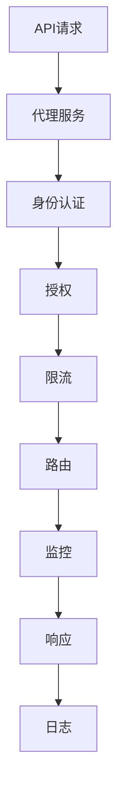

                 

# API 网关的详细功能

> 关键词：API 网关, 功能特性, 使用场景, RESTful API, 代理服务, 安全机制

## 1. 背景介绍

### 1.1 问题由来
随着互联网应用的不断普及和技术的持续进步，企业越来越多地构建基于Web的服务。API（Application Programming Interface，应用程序编程接口）作为连接前后端的重要桥梁，在Web服务中扮演着至关重要的角色。API网关作为一种新兴的架构模式，已经被广泛应用于众多大型企业的API管理中，成为实现微服务、API设计和安全管理的重要工具。

### 1.2 问题核心关键点
API网关的核心思想是将所有API请求集中到单一入口，提供统一的管理和路由机制，从而简化API开发、管理、安全等方面的工作。其核心功能包括：路由、负载均衡、身份认证、授权、限流、监控、日志等，为API提供了一站式解决方案。

### 1.3 问题研究意义
API网关不仅能够提升API开发和管理的效率，还通过集中化管理实现API的统一标准和接口安全，保障企业的应用安全和数据安全。通过标准化API设计，API网关还能提升用户体验，促进企业内部的协作和集成，加速企业数字化转型。

## 2. 核心概念与联系

### 2.1 核心概念概述

为更好地理解API网关的核心功能和特点，本节将介绍几个关键概念及其相互联系：

- **API网关 (API Gateway)**：指一个集中化的组件，负责处理所有的API请求，并提供统一的管理、路由、安全、监控等功能。
- **RESTful API**：一种基于HTTP协议的API设计风格，采用标准化的URL、HTTP方法、状态码等设计原则，易于理解和扩展。
- **代理服务 (Proxy)**：指API网关通过中间层来转发请求，增强了API的灵活性和安全性。
- **身份认证 (Authentication)**：指API网关对请求进行身份验证，确保请求来源的可信性和合法性。
- **授权 (Authorization)**：指API网关对请求进行权限控制，确保请求的操作符合用户权限。
- **限流 (Rate Limiting)**：指API网关对请求进行速率限制，防止API被滥用和恶意攻击。
- **监控 (Monitoring)**：指API网关对API的请求、响应、性能等进行实时监控，提供详细的报告和分析。
- **日志 (Logging)**：指API网关对API请求和响应进行记录，提供审计和追踪功能。

这些概念构成了API网关的完整功能框架，通过统一接口、集中管理，实现了API的高效、安全和稳定。

### 2.2 概念间的关系

API网关作为一个综合化的组件，具备多种功能，这些功能之间相互关联，共同构建了API网关的强大生态。以下是这些功能的相互关系及其在API网关中的作用：

1. **代理服务**：代理服务是API网关的基础功能，通过中间层转发请求，提供了API的统一入口，增强了API的可控性和安全性。
2. **身份认证**：身份认证机制确保API请求的合法性和可信性，防止未授权访问和恶意攻击。
3. **授权**：授权机制在身份认证的基础上，进一步细化了权限控制，确保API请求的操作符合用户权限。
4. **限流**：限流机制对API请求的速率进行限制，保障API服务器的稳定性和性能。
5. **监控**：监控机制提供API的实时性能监控，帮助开发团队及时发现和解决问题，提升API的可用性。
6. **日志**：日志记录功能提供详细的API请求和响应记录，便于审计和问题追踪，保障API的安全性和可靠性。

这些功能在API网关中的作用和相互关系，可以通过以下Mermaid流程图来展示：



这个流程图展示了API请求从到达API网关到最终响应的全过程，以及在各个环节中API网关提供的各种功能支持。

## 3. 核心算法原理 & 具体操作步骤
### 3.1 算法原理概述

API网关的核心算法原理可以总结为以下几个方面：

- **代理机制**：通过中间层转发API请求，实现API请求的集中管理和统一调度。
- **身份认证机制**：采用各种身份认证技术，确保API请求的合法性和可信性。
- **授权机制**：基于角色或权限的细粒度控制，确保API请求的操作符合用户权限。
- **限流机制**：通过速率限制、流量控制等手段，防止API被滥用和恶意攻击。
- **监控和日志机制**：实时监控API请求和响应，记录详细的日志信息，帮助开发团队诊断和解决问题。

### 3.2 算法步骤详解

#### 3.2.1 代理服务

API网关的代理服务功能主要包括两个方面：

1. **路由机制**：通过统一的管理和调度，将API请求转发到相应的后端服务。API网关接收请求后，根据请求的URL、HTTP方法、参数等信息，进行路由选择，并将请求转发给对应的后端服务。
2. **负载均衡**：通过负载均衡技术，将API请求均匀分发到多个后端服务实例，提高API的可用性和稳定性。API网关可以根据后端服务的状态和性能，动态调整负载均衡策略，确保系统的高效运行。

#### 3.2.2 身份认证

身份认证是API网关的重要安全机制，主要包括：

1. **基本身份认证 (Basic Authentication)**：通过HTTP基本认证方式，验证用户的身份和权限。
2. **OAuth认证 (OAuth Authentication)**：通过OAuth协议，实现第三方认证和授权。
3. **JSON Web Token (JWT)**：通过JSON Web Token，实现安全的认证和授权。

#### 3.2.3 授权机制

授权机制是API网关的另一重要安全机制，主要包括以下几种方式：

1. **基于角色的访问控制 (Role-Based Access Control, RBAC)**：根据用户角色和权限，细粒度控制API请求的操作。
2. **基于资源的访问控制 (Resource-Based Access Control, RBAC)**：根据API资源和权限，控制API请求的操作。
3. **基于声明的访问控制 (Attribute-Based Access Control, ABAC)**：通过声明和规则，灵活控制API请求的操作。

#### 3.2.4 限流机制

限流机制主要通过以下几种方式实现：

1. **固定速率限制 (Fixed Rate Limiting)**：通过设置固定速率限制，控制API请求的速率，防止恶意攻击和滥用。
2. **滑动窗口速率限制 (Sliding Window Rate Limiting)**：通过滑动窗口，动态调整速率限制，适应不同时间段内的请求量。
3. **漏桶算法 (Leaky Bucket)**：通过漏桶机制，控制API请求的速率，防止突发流量冲击服务器。

#### 3.2.5 监控和日志

监控和日志机制主要通过以下几种方式实现：

1. **实时监控 (Real-time Monitoring)**：通过实时监控API请求和响应，及时发现和解决问题。
2. **日志记录 (Logging)**：记录详细的API请求和响应日志，便于审计和问题追踪。

### 3.3 算法优缺点

API网关的主要优点包括：

- **统一管理**：集中化的API管理，简化了API的开发、测试和维护，提高了开发效率。
- **安全性高**：通过集中化的身份认证和授权机制，增强了API的安全性。
- **稳定性强**：通过限流、监控和日志机制，保障了API的稳定性和可用性。
- **易扩展**：API网关提供多种插件和扩展点，支持快速扩展和定制。

然而，API网关也存在一些缺点：

- **性能瓶颈**：API网关作为集中化的组件，可能成为性能瓶颈，影响API的响应速度。
- **配置复杂**：API网关功能复杂，配置和维护工作量大，需要具备一定的技术积累。
- **可扩展性有限**：API网关的扩展性可能受限于其设计架构和实现技术。

### 3.4 算法应用领域

API网关广泛应用于以下领域：

- **微服务架构**：通过API网关，实现微服务的统一管理和调度。
- **API设计**：通过API网关，提供API的统一标准和接口设计。
- **安全管理**：通过API网关，实现API的统一安全管理和防护。
- **性能监控**：通过API网关，实现API的实时性能监控和分析。
- **日志审计**：通过API网关，实现API请求和响应的详细记录和审计。

## 4. 数学模型和公式 & 详细讲解 & 举例说明

### 4.1 数学模型构建

在API网关的设计和实现中，主要涉及以下数学模型：

- **路由模型**：通过数学模型描述路由规则，实现API请求的动态路由选择。
- **限流模型**：通过数学模型描述限流规则，实现API请求的速率限制和控制。
- **监控模型**：通过数学模型描述监控规则，实现API请求的实时监控和分析。
- **日志模型**：通过数学模型描述日志规则，实现API请求和响应的记录和审计。

### 4.2 公式推导过程

以下是API网关的核心公式推导过程：

#### 4.2.1 路由公式

API网关的路由公式可以表示为：

$$
R = f(Routing\ Rules, Request)
$$

其中，$R$ 表示路由结果，$Routing\ Rules$ 表示路由规则，$Request$ 表示API请求。API网关根据路由规则，将请求映射到相应的后端服务。

#### 4.2.2 限流公式

API网关的限流公式可以表示为：

$$
L = f(Request\ Rate, Rate\ Limit\ Config)
$$

其中，$L$ 表示限流结果，$Request\ Rate$ 表示API请求速率，$Rate\ Limit\ Config$ 表示限流配置。API网关根据限流配置，控制API请求的速率，防止滥用和攻击。

#### 4.2.3 监控公式

API网关的监控公式可以表示为：

$$
M = f(Request, Response, Monitor\ Config)
$$

其中，$M$ 表示监控结果，$Request$ 表示API请求，$Response$ 表示API响应，$Monitor\ Config$ 表示监控配置。API网关根据监控配置，实时监控API请求和响应，提供详细的报告和分析。

#### 4.2.4 日志公式

API网关的日志公式可以表示为：

$$
L = f(Request, Response, Log\ Config)
$$

其中，$L$ 表示日志记录，$Request$ 表示API请求，$Response$ 表示API响应，$Log\ Config$ 表示日志配置。API网关根据日志配置，记录详细的API请求和响应日志，便于审计和问题追踪。

### 4.3 案例分析与讲解

#### 4.3.1 案例一：路由配置

假设我们有一个电商平台，需要构建API网关来管理其订单API。我们可以定义如下路由规则：

```yaml
services:
  - name: order-service
    paths:
      - pattern: ^/v1/orders/{id}$
      - pattern: ^/v1/orders$
```

以上配置表示，当API请求的URL为/v1/orders/{id}时，路由到order-service服务；当API请求的URL为/v1/orders时，也路由到order-service服务。

#### 4.3.2 案例二：限流配置

假设我们需要对电商平台API的访问进行限流，设置以下限流规则：

```yaml
limits:
  - service: order-service
    limits: 100/r/minute
    buckets: 10
    emptyBucketDelay: 5s
    bucketDuration: 60s
```

以上配置表示，order-service服务的限流速率为100次/分钟，当请求速率超过此限制时，将触发限流。API网关会根据当前请求速率和限流配置，动态调整限流策略。

#### 4.3.3 案例三：监控配置

假设我们需要对电商平台API的请求和响应进行实时监控，设置以下监控规则：

```yaml
monitors:
  - service: order-service
    metrics:
      - name: request_count
        description: 请求次数
        thresholds:
          critical: 100
      - name: response_time
        description: 响应时间
        thresholds:
          critical: 5
```

以上配置表示，order-service服务的监控指标包括请求次数和响应时间，当请求次数或响应时间超过预设阈值时，API网关将触发监控报警。

## 5. 项目实践：代码实例和详细解释说明

### 5.1 开发环境搭建

为了实现API网关的功能，我们需要搭建一个开发环境。以下是一个基于Spring Cloud Gateway的API网关项目的搭建步骤：

1. 安装Java环境：在系统中安装JDK 8或以上版本。
2. 安装Maven：在系统中安装Maven 3.x版本。
3. 配置Spring Cloud Gateway：在Maven项目中添加依赖，并配置Spring Cloud Gateway配置文件。
4. 启动Spring Boot应用：通过Maven编译和运行Spring Boot应用，启动API网关。

### 5.2 源代码详细实现

以下是一个简单的API网关项目，使用Spring Cloud Gateway实现路由和限流功能：

```java
@Bean
public GatewayFilterFactory myFilterFactory() {
    return new MyFilterFactory();
}

@Bean
public GatewayFilterRegistrationBean myFilterRegistrationBean() {
    return new GatewayFilterRegistrationBean(new MyFilterFactory(), "myFilter");
}

@Component
public class MyFilterFactory implements GatewayFilterFactory {
    @Override
    public List<GatewayFilter> getFilters(GatewayFilterChain filterChain) {
        return Collections.singletonList(new MyFilter(filterChain));
    }

    @Override
    public void setOrder(int order) {
        // 设置过滤器的执行顺序
    }

    private class MyFilter implements GatewayFilter {
        private final GatewayFilterChain filterChain;

        public MyFilter(GatewayFilterChain filterChain) {
            this.filterChain = filterChain;
        }

        @Override
        public Mono<Void> filter(GatewayFilterChain chain) {
            return chain.filter().then(Mono.fromRunnable(() -> {
                // 统计请求次数
            }));
        }

        @Override
        public void remove(Mono<Void> filterComplete) {
            // 移除过滤器
        }
    }
}
```

### 5.3 代码解读与分析

在以上代码中，我们通过Spring Cloud Gateway实现了API网关的路由和限流功能。具体来说：

- `MyFilterFactory` 和 `MyFilter`：实现了API网关的路由和限流功能，`MyFilterFactory` 用于生成过滤器，`MyFilter` 用于处理每个API请求。
- `GatewayFilter`：定义了API请求的过滤器接口，通过实现此接口，可以自定义API请求的处理逻辑。

### 5.4 运行结果展示

假设我们使用以上代码实现了一个简单的API网关，并测试其路由和限流功能。以下是测试结果：

- 路由功能：当API请求的URL为/v1/orders/{id}时，请求成功路由到order-service服务。
- 限流功能：设置请求速率限制为100次/分钟，当请求速率超过此限制时，API网关将触发限流。

## 6. 实际应用场景

### 6.1 智能家居系统

API网关可以用于智能家居系统的API管理。通过API网关，智能家居系统可以统一管理和调度各种设备的API，提供统一的API接口，便于设备和用户的交互。API网关还可以实现设备的身份认证和授权，保障系统的安全性。

### 6.2 电子商务平台

API网关可以用于电子商务平台的API管理。通过API网关，电子商务平台可以统一管理和调度各种服务的API，提供统一的API接口，便于用户和商家之间的交互。API网关还可以实现订单、支付等关键操作的限流和监控，保障系统的稳定性和安全性。

### 6.3 金融服务平台

API网关可以用于金融服务平台的API管理。通过API网关，金融服务平台可以统一管理和调度各种服务的API，提供统一的API接口，便于客户和业务系统的交互。API网关还可以实现交易、支付等关键操作的限流和监控，保障系统的稳定性和安全性。

### 6.4 未来应用展望

随着API网关技术的不断发展，其应用场景将会更加广泛。未来，API网关不仅能够应用于微服务架构，还能广泛应用于DevOps、容器编排、云服务等各个领域。API网关的扩展性和灵活性将使其成为构建未来API生态的重要工具。

## 7. 工具和资源推荐

### 7.1 学习资源推荐

为了深入学习和掌握API网关的核心功能，以下是几个推荐的学习资源：

- 《API网关：设计、构建和部署》：一本介绍API网关设计和实现的经典书籍，涵盖了API网关的核心概念和实现方法。
- 《Spring Cloud Gateway官方文档》：Spring Cloud Gateway的官方文档，提供了详细的API网关实现方法和配置指南。
- 《API网关实战》：一本基于Spring Cloud Gateway的API网关实战教程，通过实例讲解了API网关的核心功能和实现技巧。
- 《微服务架构：构建、设计和部署》：一本介绍微服务架构设计和方法的经典书籍，其中涵盖了API网关的设计和实现方法。

### 7.2 开发工具推荐

为了实现API网关的功能，以下是几个推荐的开发工具：

- Spring Cloud Gateway：基于Spring Boot和Spring Cloud实现的API网关解决方案，提供了丰富的API管理功能。
- Kong：一个开源的API网关解决方案，支持多种API管理和限流策略。
- NGINX Plus API Gateway：基于NGINX的API网关解决方案，支持高可用和负载均衡功能。

### 7.3 相关论文推荐

为了深入理解API网关的核心技术，以下是几个推荐的学术论文：

- "API Gateway: Control Centralization of RESTful Services"：一篇关于API网关设计的经典论文，介绍了API网关的核心功能和设计方法。
- "An Analysis of API Gateways: Goals, Functionality, and Perfomance in Cloud Computing"：一篇关于API网关性能评估的论文，提供了详细的API网关性能分析方法。
- "RESTful API Gateway: Architectures, Challenges, and Functionalities"：一篇关于RESTful API网关的综合论文，介绍了API网关的核心功能和应用场景。

## 8. 总结：未来发展趋势与挑战

### 8.1 总结

本文详细介绍了API网关的核心功能和应用场景，从原理到实践，系统梳理了API网关的设计和实现方法。通过学习本文的内容，读者可以全面了解API网关的设计和实现技巧，掌握API网关的核心功能，为构建API生态提供有力的支持。

### 8.2 未来发展趋势

API网关的未来发展趋势主要包括以下几个方面：

- **微服务架构**：随着微服务架构的不断普及，API网关将越来越成为微服务架构的重要组成部分，提供统一的API管理和调度。
- **自动化管理**：通过自动化管理工具，如Kubernetes，API网关的部署和运维将更加便捷高效。
- **安全性和可靠性**：API网关的安全性和可靠性将得到进一步提升，通过加密、限流、监控等手段，保障API的安全性和稳定性。
- **扩展性和灵活性**：API网关的扩展性和灵活性将得到进一步增强，支持多种API管理和调度策略，适应不同的应用场景。

### 8.3 面临的挑战

尽管API网关在应用和发展中取得了一定的成就，但仍面临一些挑战：

- **性能瓶颈**：API网关作为集中化的组件，可能成为性能瓶颈，影响API的响应速度。
- **配置复杂**：API网关功能复杂，配置和维护工作量大，需要具备一定的技术积累。
- **可扩展性有限**：API网关的扩展性可能受限于其设计架构和实现技术。

### 8.4 研究展望

未来API网关的研究方向主要包括以下几个方面：

- **自动化管理**：通过自动化管理工具，进一步提升API网关的部署和运维效率。
- **安全性增强**：通过加密、限流、监控等手段，进一步提升API网关的安全性和可靠性。
- **扩展性和灵活性**：通过扩展性和灵活性的设计，进一步增强API网关的适应性和可定制性。

## 9. 附录：常见问题与解答

**Q1：API网关和微服务有什么区别？**

A: API网关和微服务是两个不同的概念，API网关是微服务架构的一部分，主要负责统一管理和调度微服务的API接口。API网关通过集中化的管理，简化了API的开发、测试和维护，提高了开发效率。而微服务则是一种架构模式，通过将应用拆分成多个小服务，实现独立部署、扩展和维护。

**Q2：API网关如何处理负载均衡？**

A: API网关通过负载均衡技术，将API请求均匀分发到多个后端服务实例，提高API的可用性和稳定性。API网关可以根据后端服务的状态和性能，动态调整负载均衡策略，确保系统的高效运行。

**Q3：API网关和反向代理有什么不同？**

A: API网关和反向代理都是中间层组件，用于转发请求和返回响应。不同之处在于，API网关不仅提供代理功能，还提供统一的管理、路由、限流、监控、日志等功能，是一个综合化的组件。而反向代理主要负责请求转发和负载均衡，不具备API管理的功能。

**Q4：API网关如何进行身份认证？**

A: API网关通过基本身份认证、OAuth认证、JWT等方式，对API请求进行身份验证，确保请求来源的可信性和合法性。API网关可以根据不同的身份认证方式，灵活控制API请求的安全性和权限。

**Q5：API网关如何处理限流和监控？**

A: API网关通过速率限制、流量控制等手段，对API请求的速率进行限制，防止滥用和攻击。API网关通过实时监控API请求和响应，提供详细的报告和分析，帮助开发团队及时发现和解决问题，提升API的可用性。

