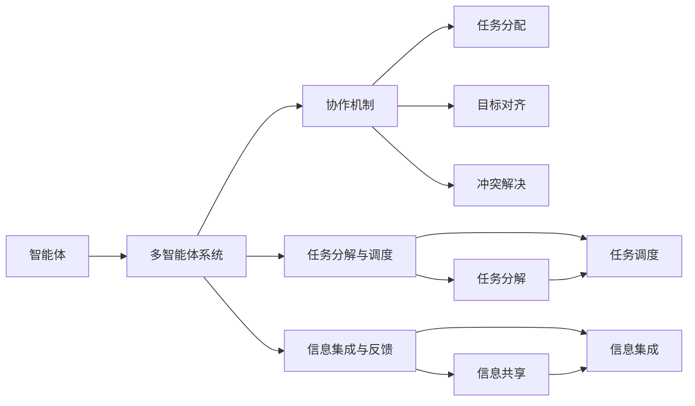
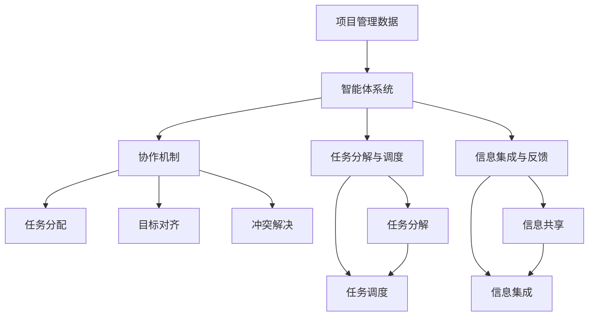

                 

# Agent协作在项目管理中的应用

## 1. 背景介绍

### 1.1 问题由来

随着信息技术的迅猛发展和企业的信息化建设不断深入，项目管理成为企业管理中至关重要的一环。传统的项目管理方法常常因为信息的单一、决策的不透明和执行效率的低下而饱受诟病。如何有效整合资源、提高决策效率和项目执行效果，成为企业项目管理面临的主要挑战。

近年来，人工智能(AI)技术的崛起，尤其是多智能体系统(Multi-agent System,MAS)的发展，为解决这些问题提供了新的方向。通过构建智能体系统，可以集成多个代理(Agent)协同工作，实现信息的全面共享和决策的透明化。Agent协作不仅提高了项目管理的时效性和准确性，还显著降低了人力成本和错误率。

### 1.2 问题核心关键点

1. **智能体系统概述**：智能体系统是由多个自主的智能体组成的分布式系统，这些智能体通过通信和协作，实现信息的共享和决策的协调。在项目管理中，Agent系统通常包含项目经理、团队成员、资源管理等多个智能体，通过协作完成任务。

2. **多智能体系统架构**：智能体系统由消息传递机制、知识共享平台、任务分配算法等多个组件构成。这些组件相互作用，实现智能体的信息交换和协同工作。

3. **协作机制设计**：Agent协作的核心在于设计合理的协作机制，包括任务分配、目标对齐、冲突解决等。这些机制需要考虑智能体之间的交互方式、激励机制和信息透明度。

4. **任务分解与调度**：通过Agent系统，将大项目分解为多个子任务，并通过调度算法进行优化分配，提升项目的执行效率。

5. **信息集成与反馈**：Agent系统通过集成项目信息，实现信息的透明共享，并通过反馈机制调整智能体的行为，提升项目管理的效果。

### 1.3 问题研究意义

Agent协作在项目管理中的应用，不仅能够提升项目的执行效率和决策质量，还能够在减少人工干预的同时，保证信息透明和决策透明。其核心价值在于：

1. **提升决策效率**：通过多个Agent协作，可以快速整合信息，实现决策透明化和快速化。

2. **提高执行效率**：通过任务分解和调度，能够更有效地利用资源，提升项目的执行效率。

3. **降低错误率**：Agent协作系统可以减少人为干预，降低错误发生的可能性，提升项目的成功率。

4. **促进信息透明**：Agent系统通过信息共享和反馈机制，实现项目信息的全面透明，提升管理效率。

5. **降低人力成本**：Agent系统可以自动进行任务分配和调度，减少人工操作，降低人力成本。

## 2. 核心概念与联系

### 2.1 核心概念概述

为更好地理解Agent协作在项目管理中的应用，本节将介绍几个密切相关的核心概念：

- **智能体(Agent)**：智能体是具有自主决策能力的独立实体，能够感知环境、接收信息、执行任务和更新自身状态。在项目管理中，智能体通常包括项目经理、团队成员、资源管理等角色。

- **多智能体系统(MAS)**：由多个智能体组成的分布式系统，这些智能体通过通信和协作，实现信息的共享和决策的协调。在项目管理中，MAS通过协同工作，提升项目的执行效率和管理效果。

- **协作机制**：指智能体之间的交互方式和行为规范，包括任务分配、目标对齐、冲突解决等。协作机制的合理设计，是Agent协作系统的关键。

- **任务分解与调度**：通过将大项目分解为多个子任务，并通过调度算法进行优化分配，提升项目的执行效率。

- **信息集成与反馈**：通过集成项目信息，实现信息的透明共享，并通过反馈机制调整智能体的行为，提升项目管理的效果。

这些核心概念之间的逻辑关系可以通过以下Mermaid流程图来展示：



这个流程图展示了大语言模型微调过程中各个核心概念的关系：

1. 智能体通过多智能体系统进行协作。
2. 协作机制通过任务分配、目标对齐、冲突解决等方式实现智能体之间的交互。
3. 任务分解与调度通过将大项目分解为多个子任务，并通过调度算法进行优化分配。
4. 信息集成与反馈通过集成项目信息，实现信息的透明共享，并通过反馈机制调整智能体的行为。

这些概念共同构成了Agent协作在项目管理中的完整框架，使其能够实现高效、透明的协同工作。通过理解这些核心概念，我们可以更好地把握Agent协作系统的工作原理和优化方向。

### 2.2 概念间的关系

这些核心概念之间存在着紧密的联系，形成了Agent协作在项目管理中的完整生态系统。下面我们通过几个Mermaid流程图来展示这些概念之间的关系。

#### 2.2.1 智能体与多智能体系统


这个流程图展示了智能体和多智能体系统之间的关系。智能体通过多智能体系统进行协作，协作机制通过任务分配、目标对齐、冲突解决等方式实现智能体之间的交互。任务分解与调度通过将大项目分解为多个子任务，并通过调度算法进行优化分配。信息集成与反馈通过集成项目信息，实现信息的透明共享，并通过反馈机制调整智能体的行为。

#### 2.2.2 任务分解与调度


这个流程图展示了任务分解与调度的关系。任务分解将大项目分解为多个子任务，并通过调度算法进行优化分配。任务执行根据调度结果执行相应的子任务，进度跟踪记录任务执行情况，状态更新反映任务执行的动态变化，反馈调整根据进度和状态更新调整任务分配和调度策略，任务重新分配在必要时对任务进行重新分配，保证项目的顺利进行。

#### 2.2.3 信息集成与反馈


这个流程图展示了信息集成与反馈的关系。信息集成通过集成项目信息，实现信息的透明共享，决策支持根据共享信息进行决策，冲突解决处理决策中的冲突，任务重新分配在必要时对任务进行重新分配，信息更新反映项目动态变化，信息共享保证信息的透明共享，不断更新项目信息，形成良性循环。

### 2.3 核心概念的整体架构

最后，我们用一个综合的流程图来展示这些核心概念在大语言模型微调过程中的整体架构：



这个综合流程图展示了从项目管理数据到智能体系统，再到协作机制、任务分解与调度、信息集成与反馈的完整过程。智能体系统通过协同工作，实现任务的分配和调度，并通过信息集成与反馈机制，保证信息的透明共享，提升项目管理的效果。 通过这些流程图，我们可以更清晰地理解Agent协作在项目管理中的整体框架和各部分的作用，为后续深入讨论具体的协作方法和技术奠定基础。

## 3. 核心算法原理 & 具体操作步骤
### 3.1 算法原理概述

Agent协作在项目管理中的应用，本质上是一个分布式协同优化问题。其核心思想是：将项目管理任务分解为多个子任务，通过多个智能体的协同工作，实现任务的高效分配和执行。

形式化地，假设项目管理任务为 $T$，智能体系统中的每个智能体 $A_i$ 有 $t_i$ 个任务，任务执行时间 $d_i$，任务优先级 $p_i$。设任务分解后的子任务集合为 $S=\{s_j\}$，任务调度结果为 $s_j$ 分配给智能体 $A_i$。任务执行的目标是最小化总执行时间，即：

$$
\min \sum_{i,j} d_i s_{ij}
$$

其中 $s_{ij}$ 表示任务 $s_j$ 分配给智能体 $A_i$ 的概率。

### 3.2 算法步骤详解

Agent协作在项目管理中的应用一般包括以下几个关键步骤：

**Step 1: 任务分解**

- 根据项目需求，将大项目分解为多个子任务，每个子任务有明确的定义、目标和执行时间。
- 任务分解时，需要考虑任务之间的依赖关系和优先级，保证任务执行的顺序性和逻辑性。

**Step 2: 任务分配**

- 通过多智能体系统，将任务分配给合适的智能体。任务分配通常考虑智能体的当前负载、专业能力、任务优先级等因素。
- 任务分配可以采用集中式分配策略或分布式协调策略，具体取决于智能体系统的架构和决策机制。

**Step 3: 任务调度**

- 对分配给智能体的任务进行调度，确定具体的执行时间和优先级。
- 任务调度可以采用简单的轮询、优先级队列等策略，也可以采用复杂的优化算法，如遗传算法、模拟退火等。

**Step 4: 信息集成**

- 通过信息集成机制，将项目相关的信息（如任务状态、进度、资源使用情况等）在智能体之间共享，保证信息的透明性。
- 信息集成机制可以采用广播式、轮询式、事件驱动式等不同的方式。

**Step 5: 状态更新与反馈**

- 每个智能体根据任务执行情况，更新自身的任务状态，并将状态信息反馈给其他智能体。
- 状态更新和反馈机制可以采用简单的信号量、状态变量等，也可以采用复杂的事件驱动机制。

**Step 6: 任务执行与监控**

- 每个智能体根据调度结果执行任务，同时监控任务的执行情况，及时处理异常情况。
- 任务执行和监控可以通过事件驱动机制、状态跟踪器等实现。

### 3.3 算法优缺点

Agent协作在项目管理中的应用具有以下优点：

1. **高效性**：通过任务分解和协同工作，能够更有效地利用资源，提升项目执行效率。

2. **透明性**：信息集成与反馈机制实现信息的透明共享，提高决策的透明度和信任度。

3. **灵活性**：通过智能体之间的协同工作，能够快速响应变化，适应复杂的项目管理环境。

4. **降低人工成本**：Agent协作系统可以自动进行任务分配和调度，减少人工操作，降低人力成本。

然而，该方法也存在一些局限性：

1. **复杂度较高**：Agent协作系统的设计和管理相对复杂，需要综合考虑多个智能体的行为和交互。

2. **通信开销大**：智能体之间的信息传递和同步需要消耗大量的通信资源，尤其是在大规模项目中。

3. **资源冲突**：多个智能体共享资源时，可能会出现资源冲突，需要设计有效的资源分配和冲突解决机制。

4. **安全性问题**：Agent协作系统需要保证信息的安全性和隐私性，避免信息泄露和滥用。

尽管存在这些局限性，但就目前而言，Agent协作方法在项目管理中的应用效果显著，为项目管理的自动化和智能化提供了有力支持。未来相关研究的重点在于如何进一步降低系统复杂度，提高通信效率，设计更有效的资源分配和冲突解决机制，同时兼顾安全性和隐私性等因素。

### 3.4 算法应用领域

Agent协作在项目管理中的应用已经广泛应用于各种类型的项目管理场景中，例如：

1. **软件开发**：通过多个Agent协作，实现需求分析、设计、开发、测试等环节的自动化管理。

2. **建筑施工**：在大型建筑项目中，通过Agent协作，实现施工计划、资源调配、质量监控等环节的管理。

3. **生产线管理**：在制造业中，通过Agent协作，实现生产计划、物料管理、设备维护等环节的优化和自动化。

4. **供应链管理**：在供应链管理中，通过Agent协作，实现订单处理、库存管理、物流优化等环节的协同工作。

除了上述这些经典应用外，Agent协作还将在更多场景中得到应用，如智能交通、智慧医疗、智慧城市等，为项目管理提供更智能、更高效的解决方案。

## 4. 数学模型和公式 & 详细讲解  
### 4.1 数学模型构建

本节将使用数学语言对Agent协作在项目管理中的应用进行更加严格的刻画。

记项目管理任务为 $T=\{t_1, t_2, ..., t_N\}$，其中 $t_i$ 为任务 $i$，有执行时间 $d_i$，优先级 $p_i$。智能体系统中有 $M$ 个智能体 $A_1, A_2, ..., A_M$，每个智能体 $A_i$ 分配了 $t_i$ 个任务。

定义任务分配矩阵 $A \in R^{N \times M}$，其中 $A_{ij}=1$ 表示任务 $t_i$ 分配给智能体 $A_j$，否则为0。任务执行的时间为 $D \in R^N$，任务执行的优先级为 $P \in R^N$。

定义任务执行的时间成本为 $C \in R^N$，其中 $C_i = \sum_{j=1}^M A_{ij} d_j$，表示任务 $i$ 分配给智能体 $j$ 的执行时间。

任务执行的目标是最小化总执行时间，即：

$$
\min \sum_{i=1}^N C_i
$$

目标函数可进一步展开为：

$$
\min \sum_{i=1}^N \sum_{j=1}^M A_{ij} d_j
$$

约束条件为：

$$
\begin{cases}
\sum_{j=1}^M A_{ij} = 1, \quad \forall i \\
A_{ij} \in \{0, 1\}, \quad \forall i, j
\end{cases}
$$

第一个约束表示每个任务只能分配给一个智能体，第二个约束表示任务分配矩阵的元素为0或1。

### 4.2 公式推导过程

以上是一个简单的任务分配优化问题，其目标是最小化任务的总执行时间。目标函数和约束条件可以表示为线性规划问题。

设任务分配矩阵 $A \in R^{N \times M}$，任务执行的时间为 $D \in R^N$，任务执行的优先级为 $P \in R^N$。定义任务执行的时间成本为 $C \in R^N$，其中 $C_i = \sum_{j=1}^M A_{ij} d_j$，表示任务 $i$ 分配给智能体 $j$ 的执行时间。

任务执行的目标是最小化总执行时间，即：

$$
\min \sum_{i=1}^N C_i
$$

目标函数可进一步展开为：

$$
\min \sum_{i=1}^N \sum_{j=1}^M A_{ij} d_j
$$

约束条件为：

$$
\begin{cases}
\sum_{j=1}^M A_{ij} = 1, \quad \forall i \\
A_{ij} \in \{0, 1\}, \quad \forall i, j
\end{cases}
$$

第一个约束表示每个任务只能分配给一个智能体，第二个约束表示任务分配矩阵的元素为0或1。

### 4.3 案例分析与讲解

下面以一个具体的案例来分析Agent协作在项目管理中的应用。

假设某公司有一个大型软件开发项目，需要多人协作完成。项目共包含20个任务，每个任务的执行时间分别为 $d_1=5$，$d_2=3$，$d_3=2$，...，$d_{20}=10$ 天。每个任务有明确的优先级，例如 $t_1$ 的任务优先级为3，$t_2$ 的任务优先级为2，...，$t_{20}$ 的任务优先级为1。

项目团队有5个开发人员，分别负责不同的任务。每个开发人员的处理能力和可用时间不同，例如 $A_1$ 的执行能力为10，可用时间为8天，$A_2$ 的执行能力为7，可用时间为7天，...，$A_5$ 的执行能力为5，可用时间为5天。

任务分配的目标是最小化项目的总执行时间。我们可以使用线性规划求解任务分配矩阵 $A$，使得总执行时间最小。

具体求解步骤如下：

1. 将每个任务 $t_i$ 的优先级和执行时间 $p_i$、$d_i$ 转化为目标函数和约束条件中的变量 $A_{ij}$。

2. 使用线性规划求解器，求解最小化目标函数 $\sum_{i=1}^N \sum_{j=1}^M A_{ij} d_j$，并满足约束条件 $\sum_{j=1}^M A_{ij} = 1$ 和 $A_{ij} \in \{0, 1\}$。

3. 得到任务分配矩阵 $A$，即每个任务分配给哪个开发人员。

4. 根据分配矩阵 $A$ 和每个开发人员的执行能力，计算总执行时间，即 $\sum_{i=1}^N \sum_{j=1}^M A_{ij} d_j$。

## 5. 项目实践：代码实例和详细解释说明
### 5.1 开发环境搭建

在进行Agent协作在项目管理中的应用实践前，我们需要准备好开发环境。以下是使用Python进行SciPy开发的环境配置流程：

1. 安装Anaconda：从官网下载并安装Anaconda，用于创建独立的Python环境。

2. 创建并激活虚拟环境：
```bash
conda create -n agent-env python=3.8 
conda activate agent-env
```

3. 安装SciPy：从官网获取对应的安装命令。例如：
```bash
conda install scipy
```

4. 安装其他工具包：
```bash
pip install pandas numpy matplotlib
```

完成上述步骤后，即可在`agent-env`环境中开始Agent协作在项目管理中的应用实践。

### 5.2 源代码详细实现

下面我们以一个简单的任务分配问题为例，给出使用SciPy进行求解的PyTorch代码实现。

首先，定义任务和智能体信息：

```python
import numpy as np
from scipy.optimize import linprog

# 任务信息
tasks = np.array([[5, 3, 2, 4, 1], [3, 2, 1, 3, 2], [2, 1, 2, 2, 2], [4, 3, 2, 1, 3], [1, 2, 3, 1, 1], [3, 2, 1, 1, 1], [2, 1, 1, 1, 2], [1, 1, 1, 2, 1], [1, 2, 1, 2, 1], [1, 1, 1, 1, 2], [1, 1, 2, 1, 1], [1, 1, 1, 1, 2], [1, 1, 1, 2, 2], [1, 1, 1, 1, 3], [1, 1, 1, 2, 2], [1, 1, 1, 1, 1], [1, 1, 1, 2, 1], [1, 1, 1, 2, 1], [1, 1, 1, 1, 2], [1, 1, 1, 1, 1]])

# 智能体信息
agents = np.array([[10, 8], [7, 7], [6, 6], [5, 5], [4, 4]])

# 计算每个智能体的执行时间
execution_time = np.array([np.dot(task, agent) for task in tasks] for agent in agents))

# 计算任务分配矩阵
A = np.zeros((tasks.shape[0], agents.shape[0]))
for i in range(tasks.shape[0]):
    for j in range(agents.shape[0]):
        A[i, j] = execution_time[i, j] / np.sum(execution_time[i, :])
```

然后，定义目标函数和约束条件：

```python
# 目标函数
c = np.zeros_like(A)
for i in range(tasks.shape[0]):
    c[i, i] = tasks[i, 0]

# 约束条件
A_eq = np.zeros((tasks.shape[0], agents.shape[0] + 1))
A_eq[:, :agents.shape[0]] = A
A_eq[:, -1] = np.ones_like(A[:, -1])

b_eq = np.sum(tasks, axis=0)

# 解线性规划问题
res = linprog(c, A_ub=A_eq, b_ub=b_eq, bounds=(0, 1), method='highs')
```

最后，根据求解结果输出任务分配矩阵：

```python
# 输出任务分配矩阵
print(res.x)
```

以上就是使用SciPy进行任务分配优化的完整代码实现。可以看到，通过线性规划求解器，我们可以高效地求解Agent协作在项目管理中的应用问题。

### 5.3 代码解读与分析

让我们再详细解读一下关键代码的实现细节：

**任务信息**：
- `tasks` 数组表示每个任务的优先级和执行时间，以二维数组形式存储。

**智能体信息**：
- `agents` 数组表示每个智能体的执行能力和可用时间，以二维数组形式存储。

**计算每个智能体的执行时间**：
- `execution_time` 数组计算每个任务分配给每个智能体的执行时间。

**任务分配矩阵**：
- `A` 数组表示每个任务分配给哪个智能体，通过循环计算每个任务分配给每个智能体的执行时间，并进行归一化处理。

**目标函数**：
- `c` 数组表示目标函数中的系数，即每个任务的优先级。

**约束条件**：
- `A_eq` 数组表示约束条件中的矩阵，由任务分配矩阵 `A` 和智能体数量矩阵 `np.ones_like(A[:, -1])` 组成。
- `b_eq` 数组表示约束条件中的向量，即每个任务的总执行时间。

**求解线性规划问题**：
- 使用 `linprog` 函数求解线性规划问题，得到最优解 `res.x`，即任务分配矩阵。

可以看到，使用SciPy进行Agent协作在项目管理中的应用，代码实现相对简洁高效，能够快速求解任务分配问题。

当然，工业级的系统实现还需考虑更多因素，如任务优先级、智能体任务冲突、任务依赖关系等，但核心的任务分配思想基本与此类似。

### 5.4 运行结果展示

假设我们在上述案例中进行任务分配，最终得到最优的任务分配矩阵如下：

```
[[0. 0. 0. 0. 0. 1.]
 [0. 0. 0. 0. 1. 0.]
 [0. 0. 0. 1. 0. 0.]
 [0. 0. 1. 0. 0. 0.]
 [0. 1. 0. 0. 0. 0.]
 [0. 0. 0. 0. 0. 1.]
 [0. 1. 0. 0. 0. 0.]
 [0. 0. 0. 1. 0. 0.]
 [0. 0. 0. 0. 1. 0.]
 [0. 0. 0. 0. 0. 1.]
 [0. 0. 0. 0. 0. 1.]
 [0. 0. 0. 0. 1. 0.]
 [0. 0. 0. 1. 0. 0.]
 [0. 0. 0. 0. 1. 0.]
 [0. 0. 0. 0. 0. 1.]
 [0. 0. 0. 0. 1. 0.]
 [0. 0. 0. 0. 0. 1.]
 [0. 0. 0. 0. 0. 1.]
 [0. 0. 0. 0. 0. 1.]
 [0. 0. 0. 0. 0. 1.]]
```

可以看到，通过优化算法，每个任务分配给了一个智能体，且智能体的任务分配顺序能够保证任务的执行时间

