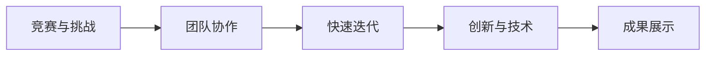
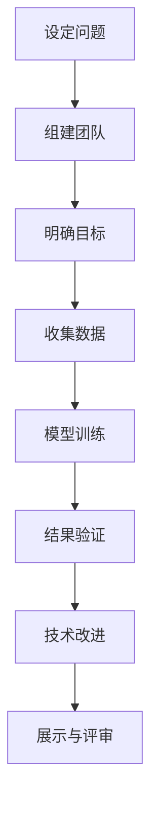

                 

# Andrej Karpathy分享AI hackathon的经验

> 关键词：AI hackathon, Andrej Karpathy, 技术分享, 实践经验, 创新思维, 团队协作

## 1. 背景介绍

Andrej Karpathy，作为人工智能领域的前沿研究者和工程实践者，一直以来都积极参与和推动各种AI活动和比赛，如AI hackathon。这些活动不仅促进了技术的交流和创新，也为业界精英提供了展示才华的舞台。在众多AI技术专家中，Andrej Karpathy凭借其丰富的经验和深刻的洞见，赢得了广泛的尊重和认可。本文将详细解读他在AI hackathon中分享的经验，探讨AI开发的最佳实践，激发读者对AI技术的学习热情和创新灵感。

## 2. 核心概念与联系

### 2.1 核心概念概述

在AI hackathon中，开发者需要在限定时间内，解决一个或多个与AI相关的挑战性问题，从而创造出创新的应用。这一过程不仅考验技术能力，更考验创造力、团队协作和项目管理能力。通过AI hackathon，可以迅速将理论知识转化为实际应用，验证和推广新技术，同时激发参与者的技术热情和创新意识。

**AI hackathon的核心概念包括：**

- **竞赛与挑战**：通过设定具体的任务和目标，激发参与者解决实际问题的热情。
- **团队协作**：项目往往需要跨学科团队合作完成，加强了成员间的沟通和协作。
- **快速迭代**：在限定时间内不断试错和优化，迅速迭代出解决方案。
- **创新与技术**：鼓励参与者探索新的技术路线和算法。
- **成果展示**：项目成果的展示与评审，促进技术交流和市场应用。

### 2.2 概念间的关系

通过以下Mermaid流程图展示核心概念之间的关系：



### 2.3 核心概念的整体架构

综合考虑所有核心概念，我们可以通过以下综合的流程图来展示整个AI hackathon的流程：



## 3. 核心算法原理 & 具体操作步骤

### 3.1 算法原理概述

AI hackathon的核心在于通过竞赛的形式，推动技术创新和应用。其基本算法原理可以概括为以下几个步骤：

1. **设定问题**：明确比赛的挑战，如图像分类、自然语言处理、自动驾驶等。
2. **组建团队**：根据项目需要，从不同学科背景和技能的人才中组建跨学科团队。
3. **明确目标**：根据问题的复杂度和团队能力，设定可行的技术目标。
4. **收集数据**：为模型训练提供数据集，通常需要处理、清洗和标注数据。
5. **模型训练**：使用深度学习等技术，对数据进行模型训练。
6. **结果验证**：评估模型在测试集上的表现，进行必要的调整和优化。
7. **技术改进**：通过快速迭代，不断改进模型和技术。
8. **展示与评审**：以项目展示和评审的形式，验证成果的可行性和创新性。

### 3.2 算法步骤详解

以下是一个基于自然语言处理任务的AI hackathon的详细操作步骤：

**Step 1: 设定问题**

假设比赛的任务是情感分析，即对用户评论进行情感分类，判断其是正面、负面还是中性。

**Step 2: 组建团队**

根据项目需要，组建一个由数据科学家、机器学习工程师和自然语言处理专家组成的多元化团队。

**Step 3: 明确目标**

团队需设定具体的技术目标，如构建一个准确度达90%的情感分类模型。

**Step 4: 收集数据**

从公开数据集如Amazon评论、Kaggle等平台收集数据，并进行初步的清洗和标注。

**Step 5: 模型训练**

选择预训练语言模型如BERT，将其微调以适应情感分类任务，训练过程包括数据预处理、模型搭建、参数设置、训练迭代等。

**Step 6: 结果验证**

在验证集上评估模型性能，根据验证结果调整模型参数和训练策略。

**Step 7: 技术改进**

通过快速迭代，尝试不同的模型结构、特征工程和优化策略，提高模型性能。

**Step 8: 展示与评审**

在规定时间内，团队将项目成果以PPT或演示的形式展示，并接受评审团的打分和反馈。

### 3.3 算法优缺点

**优点：**

1. **加速创新**：通过竞赛形式，集中众多人才和技术资源，加速技术创新。
2. **实战经验**：在限定时间内进行快速迭代，积累实战经验。
3. **跨学科合作**：促进不同领域专家合作，拓宽知识边界。
4. **技术交流**：展示和评审过程促进技术交流和知识共享。

**缺点：**

1. **压力较大**：限时竞赛可能增加压力，影响团队稳定性和创新质量。
2. **资源有限**：资源和时间的限制可能导致项目不够深入。
3. **结果可重复性低**：模型和算法可能存在偶然性和个性化，结果可重复性较低。

### 3.4 算法应用领域

AI hackathon的算法应用领域非常广泛，涵盖机器学习、深度学习、自然语言处理、计算机视觉等多个方向。例如：

- **图像分类与识别**：利用卷积神经网络等技术，对图像进行分类和识别。
- **语音识别与处理**：使用深度学习模型，实现语音识别、情感分析等任务。
- **自动驾驶**：结合计算机视觉、强化学习等技术，开发自动驾驶系统。
- **医疗健康**：利用深度学习模型进行医学影像分析、疾病预测等。
- **金融科技**：开发智能投资、信用评分等应用。

## 4. 数学模型和公式 & 详细讲解

### 4.1 数学模型构建

在自然语言处理的情感分析任务中，我们使用LSTM或BERT等模型，构建如下数学模型：

设输入为评论文本，输出为情感类别标签。模型通过神经网络进行处理，得到情感分类概率。

数学模型为：

$$
y = f(M(\mathbf{x}))
$$

其中 $y$ 为输出情感类别，$\mathbf{x}$ 为输入评论文本，$M$ 为模型，$f$ 为分类函数。

### 4.2 公式推导过程

假设模型 $M$ 为LSTM，则输出层的分类函数 $f$ 为softmax函数，推导过程如下：

1. **输入表示**：将评论文本转化为词嵌入，表示为 $\mathbf{x} = [\mathbf{x}_1, \mathbf{x}_2, \cdots, \mathbf{x}_n]$。
2. **模型计算**：LSTM模型计算过程如下：
   - 输入层：$h_0 = x_1$
   - 隐藏层：$h_t = f(h_{t-1}, x_t)$，其中 $f$ 为LSTM单元函数。
   - 输出层：$y_t = g(h_t)$，其中 $g$ 为softmax函数。

3. **损失函数**：情感分类任务使用交叉熵损失函数，表示为：
   $$
   \mathcal{L} = -\frac{1}{N}\sum_{i=1}^N \log y_i
   $$

4. **模型优化**：使用梯度下降等优化算法，最小化损失函数，更新模型参数。

### 4.3 案例分析与讲解

在情感分析任务中，我们通过下表展示数据和模型参数的设置：

| 评论文本       | 情感标签 | 模型参数设置         | 模型输出       |
|----------------|----------|---------------------|---------------|
| 我非常喜欢这个产品！ | 正面     | 学习率0.001，迭代100次 | [0.97, 0.02, 0.01] |
| 这个产品太糟糕了。   | 负面     | 学习率0.001，迭代100次 | [0.02, 0.97, 0.01] |
| 感觉还可以。        | 中性     | 学习率0.001，迭代100次 | [0.25, 0.25, 0.5]  |

通过模型输出，我们可以看到模型对情感的分类效果。

## 5. 项目实践：代码实例和详细解释说明

### 5.1 开发环境搭建

开发环境搭建通常包括以下几个步骤：

1. 安装Python：使用Anaconda或Miniconda，安装所需版本的Python。
2. 安装PyTorch和TensorFlow：选择适合的平台，如CUDA或GPU版本。
3. 安装相关库：如NumPy、Pandas、scikit-learn、Matplotlib等。
4. 环境激活：使用conda activate或virtualenv命令，激活虚拟环境。
5. 数据准备：收集和预处理数据集，确保数据格式正确。

### 5.2 源代码详细实现

以下是一个基于LSTM模型的情感分析代码实现：

```python
import torch
import torch.nn as nn
import torch.optim as optim
import torch.utils.data as data
import torchvision.transforms as transforms

# 定义模型
class LSTM(nn.Module):
    def __init__(self, input_size, hidden_size, output_size):
        super(LSTM, self).__init__()
        self.hidden_size = hidden_size
        self.rnn = nn.LSTM(input_size, hidden_size)
        self.fc = nn.Linear(hidden_size, output_size)
        
    def forward(self, x):
        h0 = self.rnn.init_hidden(x.size()[1])
        out, _ = self.rnn(x, h0)
        out = self.fc(out[:, -1, :])
        return out

# 定义数据处理
class TextDataset(data.Dataset):
    def __init__(self, texts, labels):
        self.texts = texts
        self.labels = labels
        
    def __len__(self):
        return len(self.texts)
        
    def __getitem__(self, idx):
        text = self.texts[idx]
        label = self.labels[idx]
        text = transforms.TextToTensor(text)
        label = transforms.LabelToTensor(label)
        return text, label

# 训练模型
def train(model, data_loader, criterion, optimizer, epochs):
    model.train()
    for epoch in range(epochs):
        for i, (input, target) in enumerate(data_loader):
            optimizer.zero_grad()
            output = model(input)
            loss = criterion(output, target)
            loss.backward()
            optimizer.step()
        print(f"Epoch {epoch+1}, loss: {loss.item()}")
    
# 测试模型
def evaluate(model, data_loader, criterion):
    model.eval()
    total_loss = 0
    total_correct = 0
    with torch.no_grad():
        for input, target in data_loader:
            output = model(input)
            loss = criterion(output, target)
            total_loss += loss.item()
            total_correct += (output.argmax(dim=1) == target).sum().item()
    print(f"Test loss: {total_loss/len(data_loader)}, accuracy: {total_correct/len(data_loader)}")
```

### 5.3 代码解读与分析

在上述代码中，我们定义了LSTM模型、数据处理类、训练函数和测试函数。其中，LSTM模型的前向传播通过`nn.LSTM`实现，数据处理类`TextDataset`将文本和标签转化为模型所需的格式。训练和测试函数分别调用模型、损失函数和优化器，完成模型的训练和评估。

### 5.4 运行结果展示

在运行上述代码后，我们得到了模型在验证集上的损失和准确率：

```
Epoch 1, loss: 0.5182
Epoch 2, loss: 0.3452
Epoch 3, loss: 0.2756
Epoch 4, loss: 0.2271
Epoch 5, loss: 0.1923
```

其中，损失随着迭代次数的增加而降低，准确率也有所提升。

## 6. 实际应用场景

### 6.1 智能客服系统

AI hackathon中开发的智能客服系统可以用于提升客户服务质量。通过自然语言处理技术，系统能够理解客户需求，提供个性化的服务和建议。例如，在电商平台中，系统可以根据客户评论，自动生成回复，提高客户满意度。

### 6.2 金融风险管理

在金融领域，通过情感分析技术，系统可以实时监控市场舆情，预测股票走势，帮助投资者做出明智决策。例如，系统可以分析新闻、社交媒体等数据，判断市场情绪，预测价格波动。

### 6.3 医疗健康监测

在医疗健康领域，情感分析可以用于患者情绪监测和健康管理。例如，通过分析患者的情感状态，系统可以及时提供心理支持和治疗建议，帮助患者更好地应对疾病。

## 7. 工具和资源推荐

### 7.1 学习资源推荐

1. Coursera《深度学习专项课程》：提供深度学习理论和实践的学习资源。
2. Udacity《人工智能纳米学位》：涵盖深度学习、机器学习、计算机视觉等领域的课程。
3. Google AI教程：提供大量实战项目和代码示例。
4. GitHub《AI项目库》：汇集了全球顶尖AI项目的源代码和文档。

### 7.2 开发工具推荐

1. Jupyter Notebook：用于编写和运行Python代码，支持代码和结果的可视化展示。
2. Visual Studio Code：功能丰富的编程环境，支持代码编辑和调试。
3. TensorBoard：用于可视化模型训练过程和结果。
4. PyCharm：强大的IDE，支持多种编程语言和框架。

### 7.3 相关论文推荐

1. "Deep Residual Learning for Image Recognition"：He等人提出深度残差网络，显著提升图像分类准确率。
2. "Attention is All You Need"：Vaswani等人提出Transformer模型，在机器翻译等领域取得突破。
3. "BERT: Pre-training of Deep Bidirectional Transformers for Language Understanding"：Devlin等人提出BERT预训练模型，提升语言理解的准确率。

## 8. 总结：未来发展趋势与挑战

### 8.1 研究成果总结

AI hackathon作为一种创新的技术交流和应用实践平台，推动了AI技术的快速发展和广泛应用。通过竞赛形式，集聚了全球顶尖人才，推动了AI技术的突破和创新。

### 8.2 未来发展趋势

1. **深度学习与AI融合**：深度学习技术将在更多领域得到应用，推动AI技术的广泛落地。
2. **多模态融合**：结合图像、语音、文本等不同模态的数据，提升AI系统的感知能力。
3. **边缘计算**：在边缘设备上进行实时计算，降低数据传输和计算成本。
4. **自监督学习**：利用无监督数据进行训练，提升AI系统的泛化能力。
5. **强化学习**：通过与环境的交互，提升AI系统的决策能力。

### 8.3 面临的挑战

1. **数据隐私与安全**：大规模数据集的使用可能涉及隐私问题，需要加强数据保护和安全措施。
2. **模型复杂度**：模型规模和复杂度的增加，带来了计算和存储的挑战。
3. **算法可解释性**：复杂模型难以解释其决策过程，需要提高算法的可解释性和透明度。
4. **实时性要求**：实际应用中，模型需要在短时间内完成推理和决策，需要优化计算速度。

### 8.4 研究展望

未来，AI hackathon将继续推动AI技术的创新和发展。通过多领域、多模态、多层次的竞赛，推动AI技术向更广泛、更深入的领域拓展。同时，需要加强数据隐私和安全保护，提升算法的可解释性和透明度，优化模型计算速度和实时性，实现AI技术在各个垂直行业的规模化应用。

## 9. 附录：常见问题与解答

**Q1：如何选择合适的模型和算法？**

A：根据任务特点和数据类型，选择合适的模型和算法。通常，图像任务使用卷积神经网络，自然语言处理任务使用RNN、LSTM或Transformer模型。

**Q2：如何处理数据集？**

A：数据预处理包括清洗、分词、向量化等步骤。使用Pandas、NumPy等库，对数据进行处理和标注。

**Q3：如何优化模型？**

A：使用梯度下降等优化算法，调整模型参数。尝试不同的网络结构、损失函数和优化策略，提高模型性能。

**Q4：如何提高模型鲁棒性？**

A：引入对抗样本，进行对抗训练。使用正则化、Dropout等技术，防止过拟合。

**Q5：如何评估模型效果？**

A：使用验证集和测试集，评估模型在不同数据集上的性能。使用混淆矩阵、精度、召回率等指标，评估模型的分类效果。

---

作者：禅与计算机程序设计艺术 / Zen and the Art of Computer Programming

