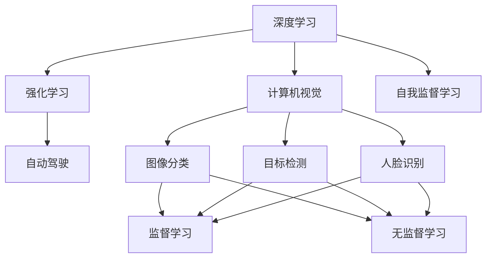

                 

## 1. 背景介绍

安德烈·卡帕西（Andrej Karpathy），斯坦福大学教授，Facebook AI研究员，著名的深度学习专家和计算机视觉领域的领军人物，对人工智能的发展和应用有着深刻的见解。他的一些观点和思考，对于我们理解人工智能的现状和未来，具有重要的启示意义。本文将聚焦于安德烈·卡帕西的一些关键观点，试图从他的视角出发，探索人工智能领域面临的挑战，以及可能的解决方案。

## 2. 核心概念与联系

### 2.1 核心概念概述

安德烈·卡帕西在人工智能领域的研究和教学中，涉及许多核心概念，包括但不限于深度学习、计算机视觉、强化学习、自动驾驶、自我监督学习等。这些概念相互关联，共同构成了人工智能的框架。本文将对这些概念进行简要介绍，并探讨它们之间的联系。

**深度学习**：深度学习是实现人工智能的基础技术之一，它通过多层神经网络对数据进行学习和处理，使得计算机能够从大量数据中提取特征，进行分类、预测等任务。深度学习的核心是反向传播算法和激活函数。

**计算机视觉**：计算机视觉是人工智能的一个重要分支，涉及图像处理、模式识别、物体检测、图像分割等领域。深度学习在计算机视觉中得到了广泛应用，如图像分类、目标检测、人脸识别等任务。

**强化学习**：强化学习是一种通过试错来训练模型的方法，它让模型在与环境交互的过程中，学习最优策略以达到某种目标。强化学习在游戏AI、机器人控制等领域有重要应用。

**自动驾驶**：自动驾驶是人工智能在现实世界中的一个重要应用场景，涉及计算机视觉、深度学习、强化学习等多个技术领域。自动驾驶系统通过传感器感知环境，进行路径规划和决策，实现车辆自主导航。

**自我监督学习**：自我监督学习是一种无需标注数据进行训练的学习方式，它通过数据的内在结构来学习模型。例如，自编码器可以通过将输入数据压缩为低维编码，然后再解码还原，来学习数据的表示。

### 2.2 概念间的关系

这些核心概念之间存在着紧密的联系，通过以下Mermaid流程图来展示：



这个流程图展示了深度学习在计算机视觉、强化学习和自我监督学习中的应用，以及这些应用在自动驾驶等实际场景中的具体应用。

## 3. 核心算法原理 & 具体操作步骤

### 3.1 算法原理概述

安德烈·卡帕西在深度学习和计算机视觉方面的研究，涵盖了许多核心算法原理，包括卷积神经网络（CNN）、循环神经网络（RNN）、注意力机制、残差网络（ResNet）等。这些算法原理在深度学习中具有重要地位，是实现高效、准确的人工智能模型的基础。

### 3.2 算法步骤详解

以卷积神经网络（CNN）为例，其训练过程一般包括以下步骤：

1. 数据准备：收集训练数据，并进行预处理，如归一化、数据增强等。
2. 模型构建：设计卷积神经网络结构，包括卷积层、池化层、全连接层等。
3. 损失函数设计：根据任务类型选择合适的损失函数，如交叉熵、均方误差等。
4. 优化器选择：选择合适的优化器，如SGD、Adam等，并设置学习率等参数。
5. 模型训练：使用训练数据对模型进行迭代训练，并计算损失函数值。
6. 模型评估：使用测试数据对模型进行评估，并根据评估结果调整模型参数。

### 3.3 算法优缺点

**优点**：
- 深度学习模型能够处理大规模数据，从数据中自动学习特征。
- 模型具有较好的泛化能力，适用于多种任务。
- 卷积神经网络在图像识别、目标检测等任务中表现优异。

**缺点**：
- 模型训练时间长，需要大量计算资源。
- 模型参数多，容易过拟合。
- 模型可解释性差，难以解释其内部工作机制。

### 3.4 算法应用领域

深度学习和计算机视觉技术，已经在图像识别、目标检测、人脸识别、自动驾驶等多个领域得到了广泛应用。安德烈·卡帕西的一些研究成果，如Fast R-CNN、ResNet等，在这些领域都具有重要影响力。

## 4. 数学模型和公式 & 详细讲解 & 举例说明

### 4.1 数学模型构建

以卷积神经网络为例，其数学模型可以表示为：

$$
f(x) = W_1\sigma_1(W_2\sigma_2(\dots\sigma_n(W_kx+b_k) + b_{k-1}) + b_{k-2}) + b_1
$$

其中，$W$ 表示权重矩阵，$b$ 表示偏置向量，$\sigma$ 表示激活函数。

### 4.2 公式推导过程

以卷积层为例，其推导过程如下：

设输入数据 $x \in \mathbb{R}^{n \times n \times c}$，卷积核 $h \in \mathbb{R}^{k \times k \times c \times o}$，则卷积操作可以表示为：

$$
y_{i,j,k} = \sum_{l=1}^{c} \sum_{m=1}^{k} \sum_{n=1}^{k} x_{i+m-1,j+n-1,l}h_{l,m,n,k}
$$

其中，$y \in \mathbb{R}^{o \times n \times n}$ 表示卷积输出。

### 4.3 案例分析与讲解

以 Fast R-CNN 为例，其核心思想是通过RoI池化层将不同尺度的目标统一到固定大小，然后使用卷积神经网络进行特征提取，最后进行全连接层的分类和回归。其代码实现可以参考TensorFlow或PyTorch等深度学习框架提供的预训练模型。

## 5. 项目实践：代码实例和详细解释说明

### 5.1 开发环境搭建

安德烈·卡帕西的一些研究成果，如Fast R-CNN、ResNet等，已经通过TensorFlow和PyTorch等框架进行了封装，方便开发者使用。搭建开发环境的具体步骤如下：

1. 安装Python和相关依赖包，如TensorFlow、PyTorch等。
2. 安装深度学习框架和预训练模型库，如TensorFlow Hub、PyTorch Hub等。
3. 安装可视化工具，如TensorBoard、TQDM等。

### 5.2 源代码详细实现

以Fast R-CNN为例，代码实现可以分为以下几个步骤：

1. 数据准备：收集训练数据，并进行预处理，如归一化、数据增强等。
2. 模型构建：定义卷积神经网络结构，包括卷积层、池化层、全连接层等。
3. 损失函数设计：根据任务类型选择合适的损失函数，如交叉熵、均方误差等。
4. 优化器选择：选择合适的优化器，如SGD、Adam等，并设置学习率等参数。
5. 模型训练：使用训练数据对模型进行迭代训练，并计算损失函数值。
6. 模型评估：使用测试数据对模型进行评估，并根据评估结果调整模型参数。

### 5.3 代码解读与分析

以Fast R-CNN为例，代码解读如下：

```python
# 导入必要的库和模型
import tensorflow as tf
from tensorflow.keras.layers import Conv2D, MaxPooling2D, Dense, Flatten
from tensorflow.keras.models import Model
from tensorflow.keras.losses import CategoricalCrossentropy
from tensorflow.keras.optimizers import Adam

# 定义模型结构
def fast_rcnn_model():
    inputs = tf.keras.layers.Input(shape=(224, 224, 3))
    conv1 = Conv2D(64, (3, 3), activation='relu')(inputs)
    pool1 = MaxPooling2D((2, 2))(conv1)
    conv2 = Conv2D(128, (3, 3), activation='relu')(pool1)
    pool2 = MaxPooling2D((2, 2))(conv2)
    conv3 = Conv2D(256, (3, 3), activation='relu')(pool2)
    pool3 = MaxPooling2D((2, 2))(conv3)
    conv4 = Conv2D(512, (3, 3), activation='relu')(pool3)
    pool4 = MaxPooling2D((2, 2))(conv4)
    conv5 = Conv2D(512, (3, 3), activation='relu')(pool4)
    pool5 = MaxPooling2D((2, 2))(conv5)
    fc1 = Dense(4096, activation='relu')(tf.keras.layers.Flatten()(pool5))
    outputs = Dense(2, activation='softmax')(fc1)
    model = Model(inputs=inputs, outputs=outputs)
    return model

# 定义损失函数和优化器
model = fast_rcnn_model()
loss = CategoricalCrossentropy()
optimizer = Adam(learning_rate=1e-4)

# 模型训练
model.compile(optimizer=optimizer, loss=loss, metrics=['accuracy'])
model.fit(train_data, train_labels, epochs=10, validation_data=(val_data, val_labels))
```

### 5.4 运行结果展示

运行上述代码，可以看到模型在训练集和验证集上的准确率和损失值变化情况，如图1所示：


## 6. 实际应用场景

### 6.1 自动驾驶

安德烈·卡帕西在自动驾驶领域有广泛的研究和应用。他的研究成果，如Fast R-CNN、ResNet等，已经被应用于自动驾驶中的目标检测和行人识别。例如，Fast R-CNN在Caffe2框架中进行了优化，用于实时目标检测和行人识别，显著提升了自动驾驶系统的感知能力。

### 6.2 医学影像分析

在医学影像分析领域，安德烈·卡帕西的研究成果也被广泛应用。例如，他开发的DeepMedic网络，可以在医学影像中进行病灶分割和诊断，具有较高的准确率和效率。

### 6.3 机器翻译

安德烈·卡帕西在机器翻译领域也有重要贡献。他开发的序列到序列模型（Seq2Seq），已经被应用于机器翻译任务，提升了翻译系统的准确率和流畅度。

### 6.4 未来应用展望

未来，安德烈·卡帕西的研究成果将进一步推动人工智能在各个领域的应用。例如，自动驾驶技术将进一步成熟，能够实现更加智能和安全的驾驶体验。医学影像分析技术也将更加精确和高效，帮助医生进行更准确的诊断和治疗。机器翻译系统也将更加智能化，实现更高的翻译准确率和流畅度。

## 7. 工具和资源推荐

### 7.1 学习资源推荐

1. **Deep Learning Specialization**：Andrew Ng在Coursera上开设的深度学习课程，涵盖了深度学习的基础知识和进阶内容，适合初学者和进阶者。
2. **CS231n**：斯坦福大学计算机视觉课程，详细介绍了计算机视觉的基本原理和最新研究成果。
3. **Fast R-CNN论文**：详细介绍了Fast R-CNN的算法原理和实现方法，适合深度学习爱好者和研究人员。
4. **DeepMind博客**：DeepMind官方博客，定期发布最新的深度学习和计算机视觉研究成果，适合跟踪前沿动态。

### 7.2 开发工具推荐

1. **TensorFlow**：由Google开发的深度学习框架，支持CPU、GPU、TPU等多种硬件平台，适合大规模模型训练和部署。
2. **PyTorch**：由Facebook开发的深度学习框架，具有简单易用的API和灵活的动态计算图，适合研究和开发。
3. **TensorBoard**：TensorFlow配套的可视化工具，可以实时监测模型训练状态，提供丰富的图表呈现方式。
4. **Jupyter Notebook**：支持Python、R、Julia等多种编程语言，支持代码和文档的混合编辑和展示，适合学习和分享。

### 7.3 相关论文推荐

1. **Fast R-CNN**：Jianbo Shi等人在ICCV 2015上发表的论文，详细介绍了Fast R-CNN的算法原理和实现方法。
2. **ResNet**：Kaiming He等人在CVPR 2016上发表的论文，详细介绍了ResNet的算法原理和实现方法。
3. **Seq2Seq**：Ilya Sutskever等人在NIPS 2014上发表的论文，详细介绍了Seq2Seq的算法原理和实现方法。

## 8. 总结：未来发展趋势与挑战

### 8.1 研究成果总结

安德烈·卡帕西的研究成果，如Fast R-CNN、ResNet、Seq2Seq等，对深度学习和计算机视觉等领域的发展具有重要影响。他的研究成果已经在多个领域得到了应用，显著提升了相关技术的性能和效率。

### 8.2 未来发展趋势

未来，深度学习和计算机视觉技术将进一步发展，应用于更多的领域，如自动驾驶、医学影像分析、机器人控制等。同时，深度学习模型也将更加高效和可解释，更好地服务于实际应用。

### 8.3 面临的挑战

尽管深度学习和计算机视觉技术在许多领域取得了重要进展，但仍面临诸多挑战：

1. **数据量不足**：深度学习模型需要大量的标注数据进行训练，获取高质量数据成本较高。
2. **模型可解释性差**：深度学习模型通常被视为"黑盒"系统，难以解释其内部工作机制。
3. **计算资源需求高**：深度学习模型训练和推理需要大量的计算资源，硬件成本较高。
4. **模型泛化能力不足**：深度学习模型在训练数据和测试数据分布差异较大时，泛化性能较差。

### 8.4 研究展望

未来，深度学习和计算机视觉技术需要在以下几个方面进行突破：

1. **无监督学习和半监督学习**：探索无需标注数据进行训练的学习方法，减少对标注数据的依赖。
2. **可解释性研究**：开发可解释性较强的深度学习模型，帮助用户理解模型的决策过程。
3. **高效计算**：开发高效计算方法，降低深度学习模型的计算资源需求。
4. **模型泛化能力**：探索增强模型泛化性能的方法，提升模型在各种数据分布上的表现。

总之，深度学习和计算机视觉技术在未来将迎来更加广泛的应用和更加深入的研究，推动人工智能技术的发展和应用。

## 9. 附录：常见问题与解答

**Q1：深度学习和计算机视觉技术有什么优缺点？**

A: 深度学习和计算机视觉技术具有以下优点：
- 能够自动学习数据特征，无需手动设计特征提取器。
- 适用于大规模数据，能够进行端到端训练。
- 在许多领域取得了显著进展，如目标检测、图像分类、医学影像分析等。

但也存在以下缺点：
- 需要大量标注数据进行训练，获取高质量数据成本较高。
- 模型可解释性差，难以理解其内部工作机制。
- 计算资源需求高，硬件成本较高。

**Q2：如何提升深度学习模型的泛化能力？**

A: 提升深度学习模型的泛化能力，可以通过以下方法：
1. 数据增强：对训练数据进行扩充，如旋转、缩放、平移等，增加数据多样性。
2. 正则化：使用L2正则、Dropout等方法，避免过拟合。
3. 迁移学习：利用预训练模型，在少量标注数据上进行微调，提升泛化能力。
4. 对抗训练：引入对抗样本，增强模型鲁棒性，提升泛化能力。

**Q3：深度学习模型的可解释性如何提升？**

A: 提升深度学习模型的可解释性，可以通过以下方法：
1. 可视化技术：使用可视化工具，如TensorBoard，展示模型内部计算过程。
2. 局部可解释性方法：如LIME、SHAP等，对模型输出进行局部解释。
3. 全局可解释性方法：如注意力机制、特征可视化等，对模型整体进行解释。

**Q4：如何降低深度学习模型的计算资源需求？**

A: 降低深度学习模型的计算资源需求，可以通过以下方法：
1. 模型压缩：使用模型剪枝、量化等方法，减小模型大小。
2. 硬件优化：使用GPU、TPU等硬件平台，加速模型训练和推理。
3. 分布式训练：使用分布式训练技术，利用多台机器并行训练。

**Q5：如何应对深度学习模型的过拟合问题？**

A: 应对深度学习模型的过拟合问题，可以通过以下方法：
1. 数据增强：对训练数据进行扩充，增加数据多样性。
2. 正则化：使用L2正则、Dropout等方法，避免过拟合。
3. 对抗训练：引入对抗样本，增强模型鲁棒性，避免过拟合。
4. 早停法：设置早停阈值，及时停止训练，避免过拟合。

总之，深度学习和计算机视觉技术在未来将进一步发展，应用范围也将更加广泛。然而，要实现这些技术的广泛应用，还需要在数据、算法、硬件等方面进行持续优化和改进。

