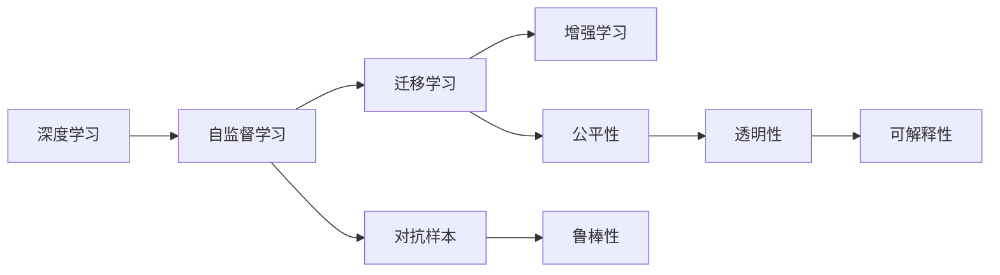

                 

## 1. 背景介绍

安德里·卡帕西（Andrej Karpathy），是当今深度学习领域的杰出代表之一，同时也是一位深受业界敬仰的AI领导者。他不仅是斯坦福大学计算机科学的副教授，更是在自动驾驶、计算机视觉、深度学习等诸多领域做出了杰出贡献。他以其深刻的技术见解和前瞻性的思考，成为了人工智能领域的重要引领者。本文将探讨Andrej Karpathy在人工智能未来的发展挑战方面的观点，从数据利用、模型训练、应用普及、伦理道德等多方面展开深入分析。

## 2. 核心概念与联系

### 2.1 核心概念概述

在探讨人工智能未来发展挑战之前，首先要明确几个核心概念：

- **人工智能（AI）**：模拟人类智能过程的计算机系统，包括学习、推理、自我修正等能力。
- **深度学习（DL）**：利用神经网络处理复杂数据的一种机器学习方法，目前是实现AI的主要技术手段之一。
- **增强学习（RL）**：通过试错训练智能体（agent），以最大化某种累积奖励的机器学习框架。
- **自监督学习（SSL）**：在无需人工标注的情况下，通过数据自身的内在结构进行学习的方法。
- **迁移学习（TL）**：将从一种任务中学到的知识应用到另一种相关任务中，以提升新任务的性能。
- **对抗样本（Adversarial Examples）**：经过精巧设计以误导模型决策的输入数据。
- **公平性、透明性和可解释性（Fairness, Transparency, and Explainability）**：AI系统应满足的基本伦理要求，确保其决策公正、透明且可被理解。

### 2.2 概念间的关系

这些核心概念通过相互关联，构成了人工智能的完整生态系统。深度学习为AI提供了强大的计算能力，自监督学习在数据标注成本高昂的场景下提供了数据利用的新途径，增强学习在决策任务中显示了其优越性，迁移学习则让AI具备了适应新场景的能力。对抗样本提醒我们注意模型的鲁棒性，公平性、透明性和可解释性则为我们指明了伦理和社会责任的方向。

**Mermaid 流程图**：



## 3. 核心算法原理 & 具体操作步骤

### 3.1 算法原理概述

Andrej Karpathy在多个场合强调了深度学习算法的核心原理：

- **前馈神经网络（Feedforward Neural Networks）**：网络由多个线性变换和激活函数组成，可以处理非线性的复杂关系。
- **反向传播算法（Backpropagation）**：通过链式法则计算梯度，用于优化神经网络参数。
- **正则化（Regularization）**：通过L1、L2正则、Dropout等方法防止过拟合，提高模型泛化能力。
- **参数共享（Parameter Sharing）**：在网络的不同层次使用相同权重，提高模型的计算效率和稳定性。
- **自适应学习率（Adaptive Learning Rate）**：通过优化器（如Adam）自动调整学习率，加速收敛。

### 3.2 算法步骤详解

基于上述核心原理，深度学习模型的构建和训练通常遵循以下步骤：

1. **数据预处理**：清洗、归一化、增强等步骤，使数据更适合模型训练。
2. **模型构建**：选择合适的神经网络架构，并进行参数初始化。
3. **模型训练**：前向传播计算损失，反向传播计算梯度，优化器更新参数。
4. **模型评估**：使用验证集和测试集评估模型性能，选择最优模型。
5. **模型部署**：将模型集成到实际应用系统中，进行推理和预测。

### 3.3 算法优缺点

**深度学习算法的优点**：

- **强大的表征能力**：能够自动学习复杂数据结构，捕捉非线性关系。
- **高度并行化**：神经网络可以高效利用GPU等硬件资源。
- **端到端训练**：可以处理从原始数据到最终输出的全部过程。

**深度学习算法的缺点**：

- **高数据需求**：需要大量的标注数据进行训练。
- **计算资源消耗大**：模型规模越大，训练和推理资源需求越高。
- **易受对抗样本攻击**：模型在对抗样本上容易失灵。
- **可解释性差**："黑盒"模型难以理解其决策过程。

### 3.4 算法应用领域

深度学习算法已经在计算机视觉、自然语言处理、语音识别、推荐系统等多个领域取得了突破性进展，成为AI的核心技术。其应用范围涵盖自动驾驶、工业控制、医疗诊断、金融预测、游戏AI等领域，为各行各业带来了革命性的变革。

**计算机视觉**：如目标检测、图像分割、图像生成等任务。
**自然语言处理**：如机器翻译、文本摘要、对话系统等任务。
**语音识别**：如语音转文本、语音合成等任务。
**推荐系统**：如电商推荐、新闻推荐、广告推荐等任务。
**自动驾驶**：如感知、决策、控制等任务。

## 4. 数学模型和公式 & 详细讲解

### 4.1 数学模型构建

深度学习模型的数学模型通常由输入、输出、参数、损失函数和优化器组成。以卷积神经网络（CNN）为例，其数学模型如下：

$$
f(x; \theta) = \sum_{i=1}^{K} \sum_{j=1}^{n} w_i^{(j)} \sigma(\mathcal{F}_i(x_j))
$$

其中，$x$ 为输入样本，$\theta$ 为模型参数，$\sigma$ 为激活函数，$\mathcal{F}_i$ 为卷积核，$w_i^{(j)}$ 为权重。

### 4.2 公式推导过程

以多分类问题为例，常用的交叉熵损失函数如下：

$$
L(y, \hat{y}) = -\frac{1}{N}\sum_{i=1}^{N} \sum_{j=1}^{C} y_{ij} \log \hat{y}_{ij}
$$

其中，$y$ 为真实标签，$\hat{y}$ 为模型预测概率，$C$ 为类别数，$N$ 为样本数。

通过反向传播算法，计算梯度并更新参数：

$$
\frac{\partial L(y, \hat{y})}{\partial \theta} = -\frac{1}{N}\sum_{i=1}^{N} \sum_{j=1}^{C} \frac{y_{ij}}{\hat{y}_{ij}} \frac{\partial \hat{y}_{ij}}{\partial \theta}
$$

### 4.3 案例分析与讲解

**案例**：使用CNN进行图像分类

1. **输入层**：原始像素数据。
2. **卷积层**：通过卷积核提取特征。
3. **池化层**：降低特征图大小，增加模型的鲁棒性。
4. **全连接层**：将特征映射为类别概率。
5. **softmax层**：将输出概率归一化。

## 5. 项目实践：代码实例和详细解释说明

### 5.1 开发环境搭建

要搭建深度学习项目环境，首先需要安装Python和相关的科学计算库，如NumPy、SciPy、pandas等。

- **Python安装**：使用Anaconda或Miniconda等工具，创建虚拟环境，安装所需库。
- **GPU安装**：安装NVIDIA Drive GPU或CUDA Toolkit，配置环境变量。
- **依赖库安装**：使用pip安装TensorFlow、PyTorch、Keras等深度学习框架。

### 5.2 源代码详细实现

以TensorFlow为例，以下是一个简单的图像分类项目：

```python
import tensorflow as tf
from tensorflow.keras import layers

# 构建CNN模型
model = tf.keras.Sequential([
    layers.Conv2D(32, (3, 3), activation='relu', input_shape=(32, 32, 3)),
    layers.MaxPooling2D((2, 2)),
    layers.Conv2D(64, (3, 3), activation='relu'),
    layers.MaxPooling2D((2, 2)),
    layers.Flatten(),
    layers.Dense(64, activation='relu'),
    layers.Dense(10, activation='softmax')
])

# 编译模型
model.compile(optimizer='adam',
              loss=tf.keras.losses.SparseCategoricalCrossentropy(from_logits=True),
              metrics=['accuracy'])

# 训练模型
model.fit(train_images, train_labels, epochs=10, validation_data=(test_images, test_labels))

# 评估模型
test_loss, test_acc = model.evaluate(test_images,  test_labels, verbose=2)
print('\nTest accuracy:', test_acc)
```

### 5.3 代码解读与分析

**代码解读**：

- **数据加载**：使用TensorFlow的`tf.data.Dataset`类加载训练数据。
- **模型构建**：使用`tf.keras.Sequential`创建模型，定义卷积层、池化层、全连接层等。
- **编译模型**：使用`model.compile`方法配置优化器、损失函数和评估指标。
- **训练模型**：使用`model.fit`方法训练模型，设置训练轮数。
- **评估模型**：使用`model.evaluate`方法评估模型性能。

**性能分析**：

- **学习率**：影响模型收敛速度和稳定性，需根据任务和数据集进行调整。
- **批次大小**：影响模型泛化能力和计算效率，需根据硬件资源和数据量进行优化。
- **正则化**：通过L2正则、Dropout等方法，防止过拟合，提高模型泛化能力。
- **优化器**：选择Adam、SGD等优化器，优化学习率调度和参数更新策略。

### 5.4 运行结果展示

运行上述代码，可以得到模型在训练集和测试集上的性能指标，如准确率、损失值等。

## 6. 实际应用场景

### 6.1 医疗影像分析

深度学习在医疗影像分析中的应用非常广泛。例如，使用CNN对X光片进行肺结节检测，使用RNN对病历进行疾病预测，使用GAN生成高质量的医学图像等。这些技术的应用，显著提升了医疗诊断的准确性和效率，为医生提供了有力的辅助工具。

### 6.2 自动驾驶

自动驾驶是深度学习在实际应用中的典型案例。通过使用CNN、RNN、增强学习等技术，车辆可以感知周围环境，进行路径规划和决策控制。未来，自动驾驶技术有望在交通安全、环保、交通效率等方面带来巨大的社会效益。

### 6.3 游戏AI

在游戏AI中，深度学习技术已经广泛应用于玩家行为预测、游戏策略优化等任务。AlphaGo等AI游戏玩家，通过深度学习算法，在围棋、星际争霸等游戏中展示了卓越的性能，推动了人工智能在游戏领域的突破。

## 7. 工具和资源推荐

### 7.1 学习资源推荐

1. **深度学习基础课程**：如Coursera的“深度学习专项课程”，由吴恩达教授主讲。
2. **深度学习书籍**：如《深度学习》（Goodfellow等著），全面介绍了深度学习的原理和应用。
3. **在线资源**：如GitHub、Kaggle等平台，可以找到丰富的深度学习项目和数据集。

### 7.2 开发工具推荐

1. **深度学习框架**：如TensorFlow、PyTorch、Keras等。
2. **数据处理工具**：如Pandas、NumPy等。
3. **可视化工具**：如TensorBoard、Weights & Biases等。

### 7.3 相关论文推荐

1. **深度学习**：如《ImageNet Classification with Deep Convolutional Neural Networks》（AlexNet），开创了深度学习在图像分类领域的新纪元。
2. **自然语言处理**：如《Attention is All You Need》（Transformer），提出了一种新的神经网络架构，显著提升了语言处理性能。
3. **自动驾驶**：如《End to End Training for Self-Driving Cars》，展示了基于深度学习的自动驾驶技术。

## 8. 总结：未来发展趋势与挑战

### 8.1 研究成果总结

Andrej Karpathy在深度学习领域取得了丰硕的成果，包括：

- **图像处理**：提出了一系列的图像处理技术，如卷积神经网络（CNN）、残差网络（ResNet）、时空卷积网络（C3D）等。
- **自动驾驶**：通过深度学习技术实现了自动驾驶系统的关键模块，如感知、决策、控制等。
- **计算机视觉**：在目标检测、图像分割、姿态估计等多个任务上取得突破性进展。

### 8.2 未来发展趋势

1. **模型可解释性**：提升模型的可解释性，使其更加透明和可信。
2. **跨模态学习**：探索跨模态数据融合的方法，增强AI系统的适应能力。
3. **多任务学习**：研究多任务学习，提升模型在多个任务上的泛化能力。
4. **联邦学习**：通过分布式计算，保护数据隐私的同时提高模型性能。
5. **自监督学习**：在无需标注数据的情况下，提升模型的数据利用效率。

### 8.3 面临的挑战

1. **数据质量**：获取高质量的数据是深度学习应用的基础，但数据标注成本高昂。
2. **计算资源**：模型训练和推理需要大量的计算资源，难以在资源受限的场景下应用。
3. **模型鲁棒性**：模型容易受到对抗样本的攻击，需要提高模型的鲁棒性。
4. **公平性和透明性**：确保模型决策的公平性和透明性，避免偏见和歧视。
5. **伦理和社会责任**：AI技术的应用需要考虑其对社会的影响，避免造成伦理风险。

### 8.4 研究展望

未来，深度学习技术需要在数据质量、计算资源、模型鲁棒性、公平性等方面取得突破，才能更好地服务于社会。同时，跨模态学习、多任务学习、联邦学习等方向的研究也将推动AI技术的进一步发展。

## 9. 附录：常见问题与解答

**Q1：深度学习是否适用于所有领域？**

A：深度学习在许多领域取得了显著进展，但在某些特定领域，如金融、法律等，仍需结合领域知识进行改进。

**Q2：深度学习是否容易被攻击？**

A：深度学习模型容易受到对抗样本的攻击，需采取对抗训练、鲁棒性增强等方法进行防御。

**Q3：如何确保深度学习的公平性和透明性？**

A：通过公平性指标、透明性评估和可解释性方法，确保模型决策的公正性和透明性。

**Q4：深度学习的未来方向是什么？**

A：深度学习未来的发展方向包括可解释性、跨模态学习、联邦学习等，以提升模型的应用价值和可信度。

**Q5：深度学习的未来面临哪些挑战？**

A：深度学习未来面临的挑战包括数据质量、计算资源、模型鲁棒性、公平性和伦理责任等，需要多方面的努力和突破。

---

作者：禅与计算机程序设计艺术 / Zen and the Art of Computer Programming

