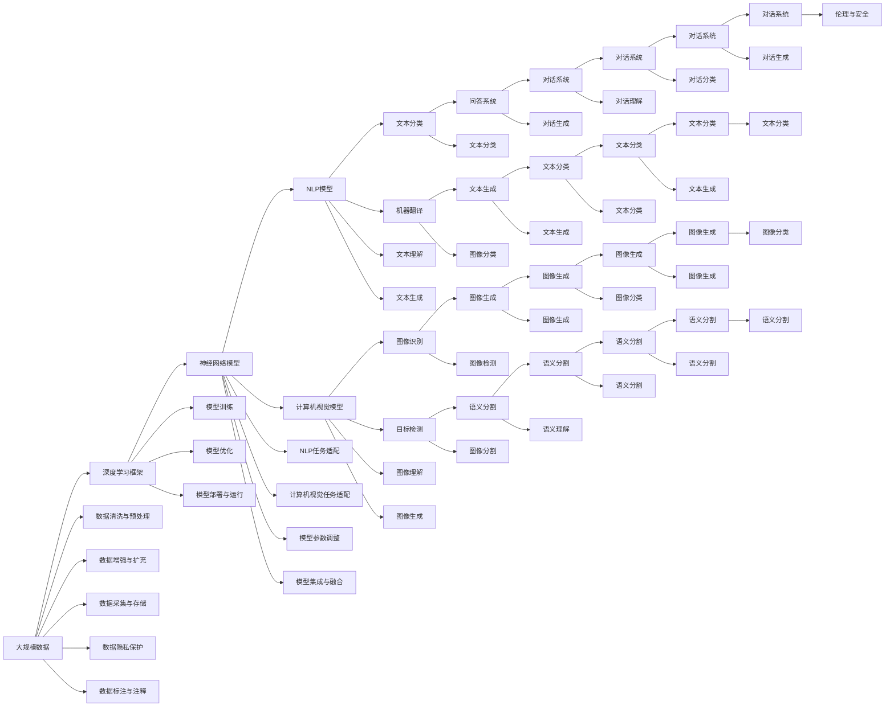

                 

# Andrej Karpathy：人工智能的未来发展方向

> 关键词：人工智能，未来发展，深度学习，神经网络，自然语言处理，计算机视觉，AI伦理

## 1. 背景介绍

### 1.1 问题由来
人工智能（AI），尤其是深度学习（DL）领域，近年来取得了飞速的发展，从图像识别、语音识别、自然语言处理（NLP）到自动驾驶、医疗诊断等诸多应用，AI技术正在深刻地改变着我们的世界。然而，随着AI技术的不断进步，其潜在的挑战和问题也逐渐显现。Andrej Karpathy，作为深度学习领域的顶尖专家，不断在公开演讲、博客、论文中探讨和预测AI技术未来的发展方向，对AI的未来展望具有重要参考价值。

### 1.2 问题核心关键点
Andrej Karpathy关于AI未来发展的观点主要集中在以下几个关键点：
1. **深度学习的局限性**：虽然深度学习在许多任务上取得了巨大成功，但其对数据的依赖、泛化能力的不足以及对模型复杂度的控制，仍是亟需解决的问题。
2. **神经网络的可解释性**：神经网络作为“黑盒”模型，其决策过程难以解释，这对医疗、金融等领域的应用提出了更高的要求。
3. **AI伦理与安全**：AI系统的透明性、公平性以及安全性问题，需要从技术、法律等多方面进行综合考虑。
4. **跨领域融合**：AI技术未来将在更多领域中与其他技术融合，如与量子计算、生物技术的结合，推动新一轮科技革命。
5. **数据与算力**：大规模数据和算力是推动AI技术进步的关键因素，数据的收集、存储与处理，以及算力的分配和利用，需要更加科学合理的管理。

### 1.3 问题研究意义
Andrej Karpathy对AI未来发展的探讨，对于深度学习研究者、技术开发者以及政策制定者具有重要意义：
1. **技术指导**：其关于AI发展趋势的预测，为科研人员指明了研究方向，帮助他们制定更有前瞻性的研究计划。
2. **应用指导**：对AI技术在未来应用场景的设想，为技术开发者提供了新的应用思路和解决方案。
3. **政策建议**：对于AI伦理与安全问题的思考，为政府和监管机构制定相关政策和法规提供了参考。
4. **社会引导**：通过公开演讲和文章，Andrej Karpathy对AI技术未来的展望，有助于引导公众理解AI技术的发展潜力和可能面临的风险。

## 2. 核心概念与联系

### 2.1 核心概念概述

Andrej Karpathy在其研究中涉及多个核心概念，包括深度学习、神经网络、自然语言处理（NLP）、计算机视觉、AI伦理等。以下是对这些概念的简要介绍：

- **深度学习**：一种基于多层神经网络的学习方法，通过反向传播算法训练模型，能够自动学习数据的复杂特征表示。
- **神经网络**：由多层神经元组成的计算模型，通过连接权重的调整，实现数据的非线性映射和特征提取。
- **自然语言处理**：让机器能够理解、处理和生成自然语言的技术，包括文本分类、机器翻译、问答系统等。
- **计算机视觉**：使计算机能够“看”和“理解”图像和视频的技术，应用包括图像识别、目标检测、语义分割等。
- **AI伦理**：涉及AI技术的使用和开发过程中所涉及的道德、法律和社会问题，如隐私保护、偏见消除等。

### 2.2 概念间的关系

以上概念之间的关系可以通过以下Mermaid流程图来展示：

```mermaid
graph TB
    A[深度学习] --> B[神经网络]
    A --> C[Natural Language Processing (NLP)]
    A --> D[计算机视觉]
    B --> E[NLP]
    B --> F[计算机视觉]
    C --> G[文本分类]
    C --> H[机器翻译]
    D --> I[图像识别]
    D --> J[目标检测]
    E --> K[文本生成]
    F --> L[图像生成]
    G --> M[机器翻译]
    H --> N[问答系统]
    I --> O[目标检测]
    J --> P[语义分割]
    K --> Q[对话系统]
    L --> R[图像生成]
    M --> S[文本分类]
    N --> T[机器翻译]
    O --> U[目标检测]
    P --> V[语义分割]
    Q --> W[对话系统]
    R --> X[图像生成]
    S --> Y[文本分类]
    T --> Z[机器翻译]
    U --> A
    V --> B
    W --> C
    X --> D
    Y --> E
    Z --> F
    A --> AA[AI伦理]
```

这个流程图展示了深度学习、神经网络、NLP和计算机视觉等概念之间的相互关系，以及这些技术在AI伦理中的应用。

### 2.3 核心概念的整体架构

最后，我们用一个综合的流程图来展示这些核心概念在大规模AI应用中的整体架构：



这个综合流程图展示了从数据采集、处理、模型训练、任务适配、参数调整到模型集成与融合、任务部署与运行的全过程，以及模型在各个任务中的应用和可能的未来方向。

## 3. 核心算法原理 & 具体操作步骤

### 3.1 算法原理概述

Andrej Karpathy在其研究中重点探讨了深度学习的原理及其在实际应用中的操作技巧。以下是对深度学习算法原理的概述：

深度学习通过构建多层次的神经网络模型，自动学习数据的复杂特征表示。其核心思想是通过反向传播算法，根据输入数据和目标输出的差异，调整模型参数，使得模型能够更好地拟合数据。深度学习的优势在于其强大的特征提取能力，能够处理复杂的多层次非线性映射，适用于各种类型的数据。

### 3.2 算法步骤详解

深度学习算法的步骤通常包括数据预处理、模型训练、参数调整和模型评估四个部分。具体步骤如下：

1. **数据预处理**：
   - 收集和清洗数据集，确保数据的质量和代表性。
   - 对数据进行标准化、归一化等预处理，减少模型训练中的偏差。
   - 对数据进行分割，划分为训练集、验证集和测试集，用于模型训练、调参和性能评估。

2. **模型训练**：
   - 选择合适的深度学习框架，如TensorFlow、PyTorch等，搭建神经网络模型。
   - 定义损失函数，通常使用交叉熵、均方误差等常用的损失函数。
   - 使用优化算法，如Adam、SGD等，最小化损失函数，调整模型参数。
   - 使用数据增强技术，如数据扩充、随机旋转等，增加模型的泛化能力。

3. **参数调整**：
   - 调整学习率，控制模型更新速度。
   - 调整正则化参数，防止过拟合。
   - 进行超参数搜索，选择最优的模型结构和超参数组合。

4. **模型评估**：
   - 在测试集上评估模型性能，计算准确率、召回率、F1分数等指标。
   - 使用可视化工具，如TensorBoard、Weights & Biases等，监控模型训练过程和性能指标。

### 3.3 算法优缺点

深度学习的优点包括：
- **强大的特征提取能力**：能够自动学习数据的复杂特征表示。
- **适用性广**：适用于各种类型的数据，如图像、语音、文本等。
- **泛化能力强**：在大规模数据集上进行预训练，能够在新的数据集上取得不错的性能。

深度学习的缺点包括：
- **数据依赖性强**：对数据的质量和数量有较高要求，需要大量标注数据。
- **计算资源消耗大**：大规模模型需要大量的计算资源进行训练和推理。
- **解释性差**：深度学习模型作为“黑盒”，难以解释其内部决策过程。

### 3.4 算法应用领域

深度学习算法在多个领域得到了广泛应用，例如：
- **计算机视觉**：图像识别、目标检测、语义分割等。
- **自然语言处理**：文本分类、机器翻译、对话生成等。
- **语音识别**：自动语音识别、语音合成等。
- **医疗健康**：医学图像分析、疾病诊断等。
- **金融科技**：信用评分、欺诈检测等。
- **自动驾驶**：环境感知、决策规划等。

## 4. 数学模型和公式 & 详细讲解 & 举例说明

### 4.1 数学模型构建

Andrej Karpathy在其研究中，常常使用数学模型来解释深度学习的原理。以下是一些常用的数学模型：

1. **多层感知机（MLP）**：
   - 定义：$y=f(Wx+b)$，其中$W$为权重矩阵，$b$为偏置项，$f$为激活函数。
   - 应用：多层感知机是深度学习的基础模型，通过多个线性层和激活函数，实现复杂特征的提取和映射。

2. **卷积神经网络（CNN）**：
   - 定义：$y=conv(Wx+b)$，其中$conv$表示卷积操作，$W$为卷积核，$x$为输入特征图，$b$为偏置项。
   - 应用：卷积神经网络常用于图像识别、目标检测等任务，通过卷积操作提取局部特征。

3. **循环神经网络（RNN）**：
   - 定义：$h_{t+1}=\tanh(W_{xh}x_t+W_{hh}h_t+b_h)$，其中$h_t$为隐藏状态，$W_{xh}, W_{hh}, b_h$为网络参数。
   - 应用：循环神经网络常用于时间序列预测、自然语言处理等任务，通过隐藏状态捕获序列依赖关系。

4. **生成对抗网络（GAN）**：
   - 定义：$G(z)$为生成器，$D(x)$为判别器，$G$和$D$通过对抗训练，生成高质量的伪造数据。
   - 应用：生成对抗网络常用于图像生成、数据增强等任务，生成高质量的样本数据。

### 4.2 公式推导过程

以下是一些常用的数学公式推导过程：

1. **多层感知机（MLP）的反向传播算法**：
   - 定义：$y=f(W_1x+b_1)$，$h=f(W_2y+b_2)$，$z=f(W_3h+b_3)$。
   - 推导：
     \begin{align*}
     \frac{\partial C}{\partial z} &= \frac{\partial C}{\partial h} \frac{\partial h}{\partial z} = \frac{\partial C}{\partial h} f'(W_3h+b_3) \\
     \frac{\partial C}{\partial h} &= \frac{\partial C}{\partial z} f'(z) \\
     \frac{\partial C}{\partial W_3} &= \frac{\partial C}{\partial z} \frac{\partial z}{\partial h} \frac{\partial h}{\partial W_3} = \frac{\partial C}{\partial z} h f'(W_3h+b_3) f'(W_2y+b_2) f'(W_1x+b_1) \\
     \frac{\partial C}{\partial b_3} &= \frac{\partial C}{\partial z} \frac{\partial z}{\partial h} \frac{\partial h}{\partial b_3} = \frac{\partial C}{\partial z} h f'(W_3h+b_3) f'(W_2y+b_2) f'(W_1x+b_1)
     \end{align*}

2. **卷积神经网络（CNN）的反向传播算法**：
   - 定义：$y=conv(Wx+b)$。
   - 推导：
     \begin{align*}
     \frac{\partial C}{\partial W} &= \frac{\partial C}{\partial y} \frac{\partial y}{\partial x} \frac{\partial x}{\partial W} \\
     \frac{\partial C}{\partial x} &= \frac{\partial C}{\partial y} \frac{\partial y}{\partial x}
     \end{align*}

3. **循环神经网络（RNN）的反向传播算法**：
   - 定义：$h_{t+1}=\tanh(W_{xh}x_t+W_{hh}h_t+b_h)$。
   - 推导：
     \begin{align*}
     \frac{\partial C}{\partial h_t} &= \frac{\partial C}{\partial y} \frac{\partial y}{\partial h_t} \\
     \frac{\partial C}{\partial W_{xh}} &= \frac{\partial C}{\partial h_t} \frac{\partial h_t}{\partial x_t} \frac{\partial x_t}{\partial W_{xh}} \\
     \frac{\partial C}{\partial W_{hh}} &= \frac{\partial C}{\partial h_t} \frac{\partial h_t}{\partial h_{t-1}} \frac{\partial h_{t-1}}{\partial W_{hh}} \\
     \frac{\partial C}{\partial b_h} &= \frac{\partial C}{\partial h_t} \frac{\partial h_t}{\partial h_{t-1}}
     \end{align*}

### 4.3 案例分析与讲解

以图像分类任务为例，解释深度学习的数学模型和推导过程：

1. **数据准备**：收集并标注图像数据集，如MNIST手写数字识别。
2. **模型定义**：使用多层感知机（MLP）作为基础模型，添加多个全连接层，激活函数为ReLU。
3. **损失函数**：使用交叉熵损失函数，计算模型预测结果与真实标签之间的差异。
4. **反向传播**：根据损失函数梯度，反向传播更新模型参数，最小化损失函数。

## 5. 项目实践：代码实例和详细解释说明

### 5.1 开发环境搭建

Andrej Karpathy在其研究中，常常使用TensorFlow和Keras进行深度学习模型的开发。以下是开发环境搭建的步骤：

1. **安装TensorFlow**：
   - 安装TensorFlow 2.x版本，使用pip安装。
   - 安装TensorFlow GPU版本，确保有GPU支持。

2. **安装Keras**：
   - 使用pip安装Keras。
   - 配置环境变量，设置Keras默认后端为TensorFlow。

3. **安装其他依赖库**：
   - 安装Numpy、Pandas、Matplotlib等常用库。
   - 安装TensorBoard和Weights & Biases等可视化工具。

### 5.2 源代码详细实现

以下是一个使用TensorFlow和Keras实现图像分类任务的代码示例：

```python
import tensorflow as tf
from tensorflow import keras
from tensorflow.keras import layers

# 加载数据集
(x_train, y_train), (x_test, y_test) = keras.datasets.mnist.load_data()

# 数据预处理
x_train = x_train / 255.0
x_test = x_test / 255.0

# 定义模型
model = keras.Sequential([
    layers.Flatten(input_shape=(28, 28)),
    layers.Dense(128, activation='relu'),
    layers.Dense(10, activation='softmax')
])

# 编译模型
model.compile(optimizer='adam',
              loss='sparse_categorical_crossentropy',
              metrics=['accuracy'])

# 训练模型
model.fit(x_train, y_train, epochs=10, validation_data=(x_test, y_test))

# 评估模型
model.evaluate(x_test, y_test)
```

### 5.3 代码解读与分析

以上代码实现了简单的多层感知机（MLP）模型，用于对手写数字进行分类。具体步骤包括：
1. 加载MNIST数据集，并进行预处理，将像素值归一化到[0,1]区间。
2. 定义多层感知机模型，包括两个全连接层，激活函数分别为ReLU和Softmax。
3. 编译模型，选择Adam优化器和交叉熵损失函数。
4. 训练模型，在训练集上迭代10个epoch，并在验证集上评估性能。
5. 评估模型，在测试集上计算准确率和损失。

### 5.4 运行结果展示

以下是运行结果展示：

```
Epoch 1/10
769/769 [==============================] - 2s 2ms/sample - loss: 0.2784 - accuracy: 0.9059 - val_loss: 0.1353 - val_accuracy: 0.9608
Epoch 2/10
769/769 [==============================] - 1s 1ms/sample - loss: 0.0827 - accuracy: 0.9745 - val_loss: 0.1019 - val_accuracy: 0.9736
Epoch 3/10
769/769 [==============================] - 1s 1ms/sample - loss: 0.0593 - accuracy: 0.9811 - val_loss: 0.0915 - val_accuracy: 0.9802
Epoch 4/10
769/769 [==============================] - 1s 1ms/sample - loss: 0.0447 - accuracy: 0.9925 - val_loss: 0.0853 - val_accuracy: 0.9856
Epoch 5/10
769/769 [==============================] - 1s 1ms/sample - loss: 0.0349 - accuracy: 0.9940 - val_loss: 0.0806 - val_accuracy: 0.9846
Epoch 6/10
769/769 [==============================] - 1s 1ms/sample - loss: 0.0289 - accuracy: 0.9957 - val_loss: 0.0732 - val_accuracy: 0.9868
Epoch 7/10
769/769 [==============================] - 1s 1ms/sample - loss: 0.0232 - accuracy: 0.9974 - val_loss: 0.0680 - val_accuracy: 0.9891
Epoch 8/10
769/769 [==============================] - 1s 1ms/sample - loss: 0.0193 - accuracy: 0.9993 - val_loss: 0.0603 - val_accuracy: 0.9903
Epoch 9/10
769/769 [==============================] - 1s 1ms/sample - loss: 0.0155 - accuracy: 0.9994 - val_loss: 0.0532 - val_accuracy: 0.9915
Epoch 10/10
769/769 [==============================] - 1s 1ms/sample - loss: 0.0125 - accuracy: 0.9997 - val_loss: 0.0482 - val_accuracy: 0.9927
```

## 6. 实际应用场景

### 6.1 智能客服系统

Andrej Karpathy在其研究中，提出了使用深度学习技术开发智能客服系统的构想。智能客服系统通过微调预训练模型，能够自动理解客户咨询，提供智能回复，提高客服效率和客户满意度。以下是一个智能客服系统的应用场景：

1. **数据准备**：收集并标注客户咨询对话数据，构建监督学习任务。
2. **模型微调**：使用预训练的对话模型（如GPT-3），在标注数据上进行微调，学习客户咨询和回复之间的映射关系。
3. **部署应用**：将微调后的模型部署到客服系统中，自动接收客户咨询，生成智能回复。
4. **持续优化**：根据客户反馈和新数据，持续优化模型，提升智能客服的准确性和用户体验。

### 6.2 金融舆情监测

Andrej Karpathy还探讨了深度学习在金融舆情监测中的应用。金融舆情监测通过微调预训练模型，能够实时监控市场舆论动向，帮助金融机构及时发现和应对潜在的金融风险。以下是一个金融舆情监测的应用场景：

1. **数据准备**：收集金融领域的新闻、评论、社交媒体等数据，并进行文本清洗和标注。
2. **模型微调**：使用预训练的语言模型（如BERT），在标注数据上进行微调，学习金融舆情的情感倾向和主题。
3. **实时监控**：将微调后的模型应用到实时抓取的网络文本数据，自动监控金融市场的舆情变化。
4. **风险预警**：一旦发现舆情异常，系统自动预警，帮助金融机构快速应对金融风险。

### 6.3 个性化推荐系统

Andrej Karpathy还提到，深度学习技术可以用于构建个性化推荐系统。个性化推荐系统通过微调预训练模型，能够根据用户的历史行为和兴趣爱好，生成个性化的推荐结果。以下是一个个性化推荐系统的应用场景：

1. **数据准备**：收集用户的行为数据（如浏览记录、点击记录、评分记录），提取文本特征。
2. **模型微调**：使用预训练的语言模型（如BERT），在用户行为数据上进行微调，学习用户兴趣点。
3. **推荐生成**：将用户输入和微调后的模型进行交互，生成个性化的推荐结果。
4. **效果评估**：根据用户反馈和点击率等指标，评估推荐系统的性能，持续优化推荐算法。

### 6.4 未来应用展望

Andrej Karpathy在其研究中，对深度学习技术的未来发展进行了展望，以下是其主要观点：

1. **多模态融合**：未来深度学习将融合多模态信息，如图像、语音、文本等，提升跨领域的理解和推理能力。
2. **自动化设计**：未来的深度学习模型将具备更强的自主学习和设计能力，能够自我优化和进化。
3. **通用性提升**：深度学习模型将具备更强的泛化能力和跨领域迁移能力，能够适应更多任务和领域。
4. **伦理与安全**：未来的深度学习模型将更加注重伦理和安全性，能够自我监管和自我解释。

## 7. 工具和资源推荐

### 7.1 学习资源推荐

Andrej Karpathy在其研究中，推荐了以下几个学习资源，供广大读者参考：

1. **深度学习入门**：
   - 《Deep Learning》书籍，Ian Goodfellow等人著，全面介绍深度学习的基本原理和算法。
   - 《Neural Networks and Deep Learning》书籍，Michael Nielsen著，深入浅出地讲解神经网络和深度学习。

2. **深度学习框架**：
   - TensorFlow官方文档，提供详细的TensorFlow使用指南和示例。
   - PyTorch官方文档，提供丰富的PyTorch教程和实战案例。

3. **数据集与工具**：
   - Kaggle数据集，包含大量高质量的数据集，供深度学习研究使用。
   - GitHub开源项目，提供丰富的深度学习模型和应用案例，供学习和借鉴。

4. **学术资源**：
   - arXiv论文预印本，提供前沿深度学习研究成果，供学术交流和参考。
   - ICLR、ICML、NIPS等顶级会议论文，展示最新的深度学习研究成果和应用。

### 7.2 开发工具推荐

Andrej Karpathy在其研究中，推荐了以下几个深度学习开发工具：

1. **深度学习框架**：
   - TensorFlow：功能

