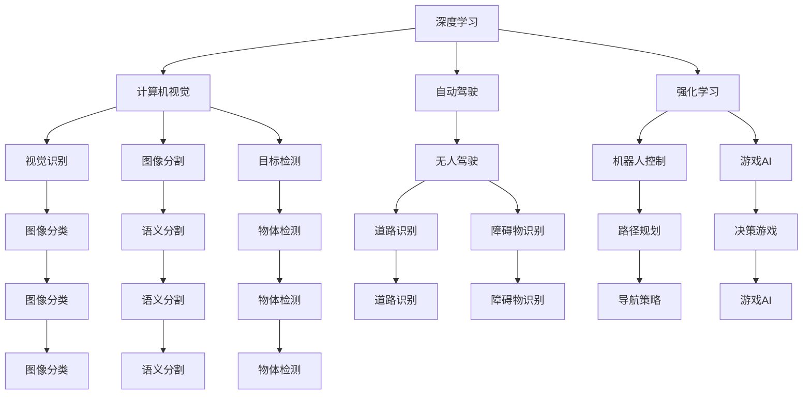

                 

# Andrej Karpathy：人工智能的未来发展机遇

> 关键词：人工智能,深度学习,自动驾驶,计算机视觉,强化学习,前沿技术,技术趋势,未来展望

## 1. 背景介绍

### 1.1 问题由来

Andrej Karpathy，作为深度学习和计算机视觉领域的领军人物，曾领导Facebook AI Research (FAIR)的自动驾驶和机器人团队，同时也是特斯拉的首席人工智能科学家。Karpathy在深度学习、计算机视觉、自动驾驶等领域有深厚的研究背景和丰富的实践经验。他的工作和研究不仅推动了这些领域的进步，也为人工智能的未来发展提供了重要方向。

在近年来的人工智能研究中，深度学习技术取得了巨大的突破，特别是在计算机视觉、自然语言处理(NLP)和自动驾驶等领域。然而，尽管这些技术取得了显著的进展，但它们仍然面临一些挑战，需要进一步的研究和优化。

### 1.2 问题核心关键点

Karpathy在人工智能的未来发展上提出了一些重要观点，涵盖了从技术演进到应用落地，从行业挑战到未来趋势的方方面面。以下是他关于人工智能未来发展的一些核心观点：

1. **技术演进**：深度学习技术将不断演进，从而实现更高的模型准确性和更好的泛化能力。
2. **应用落地**：人工智能技术将在实际应用中发挥更大作用，尤其是在自动驾驶、计算机视觉等领域。
3. **行业挑战**：人工智能面临的挑战包括计算资源限制、数据隐私保护和伦理问题。
4. **未来趋势**：人工智能将进一步普及，并将在各个行业中找到应用，为社会带来深远影响。

### 1.3 问题研究意义

Karpathy对人工智能未来发展的见解不仅具有学术价值，还对产业界具有重要的指导意义。了解他的观点有助于我们更好地把握未来技术发展趋势，为实际应用提供理论基础，促进人工智能技术的创新和落地。

## 2. 核心概念与联系

### 2.1 核心概念概述

在深入探讨人工智能的未来发展机遇前，我们需要理解一些核心概念：

- **深度学习(Deep Learning)**：一种基于神经网络的学习方法，通过多层非线性变换，从大量数据中提取特征。
- **计算机视觉(Computer Vision)**：使用计算机技术理解和分析视觉数据，如图像和视频。
- **自动驾驶(Autonomous Driving)**：利用人工智能技术实现车辆自主导航。
- **强化学习(Reinforcement Learning)**：通过与环境交互，不断调整策略，实现最大化奖励的目标。
- **计算资源(Computing Resources)**：包括计算硬件和软件资源，如GPU、TPU和云计算平台。
- **数据隐私(Data Privacy)**：保护用户数据，防止未经授权的访问和使用。
- **伦理问题(Ethical Issues)**：人工智能技术在应用中可能带来的道德和法律问题。

### 2.2 概念间的关系

这些核心概念之间有着紧密的联系，它们共同构成了人工智能技术发展的生态系统。以下是通过Mermaid流程图展示的概念关系：



这个流程图展示了深度学习、计算机视觉、自动驾驶和强化学习等核心概念之间的相互关系。每个概念可以细分为多个子任务，这些子任务又可以进一步细化，形成一个复杂的技术网络。

### 2.3 核心概念的整体架构

下图展示了核心概念之间的整体架构：


这个架构展示了深度学习、计算机视觉、自动驾驶和强化学习等核心概念之间的相互关系。每个概念可以细分为多个子任务，这些子任务又可以进一步细化，形成一个复杂的技术网络。

## 3. 核心算法原理 & 具体操作步骤
### 3.1 算法原理概述

Karpathy认为，深度学习技术的未来发展将依赖于算法的不断创新和优化。以下是他在核心算法原理方面的几个关键观点：

1. **卷积神经网络(CNNs)**：在计算机视觉领域，CNNs已经成为处理图像和视频数据的标准算法。未来的研究将聚焦于更深层次和更广泛的CNN结构，以实现更高效的特征提取和图像识别。
2. **生成对抗网络(GANs)**：GANs在图像生成和图像编辑方面展示了巨大的潜力。未来的研究将探索更复杂的GAN结构，以实现更真实的图像生成效果。
3. **变分自编码器(VAEs)**：VAEs在图像生成和数据压缩方面表现出色。未来的研究将进一步优化VAEs的性能，以实现更高效的图像生成和数据压缩。
4. **自监督学习**：自监督学习利用未标注数据进行训练，能够在缺乏标注数据的情况下，实现模型的自适应学习。未来的研究将探索更多自监督学习方法，以提高模型的泛化能力和适应性。

### 3.2 算法步骤详解

以下是Karpathy在深度学习算法操作步骤方面的几个关键观点：

1. **数据准备**：收集大量标注和未标注数据，对数据进行预处理，如图像归一化、数据增强等。
2. **模型构建**：选择合适的深度学习模型，如CNNs、GANs、VAEs等，并进行模型训练。
3. **超参数优化**：通过网格搜索、随机搜索等方法，优化模型的超参数，如学习率、批量大小等。
4. **模型评估**：在验证集上评估模型的性能，使用各种指标，如准确率、精度、召回率等。
5. **模型优化**：根据评估结果，优化模型结构、超参数和训练策略，以提高模型性能。

### 3.3 算法优缺点

Karpathy认为，深度学习算法在处理图像和视频数据方面表现出色，但在处理非结构化数据（如文本和语音）方面仍存在一些挑战：

**优点**：
- 深度学习算法能够处理复杂的数据结构，如图像和视频。
- 通过大量数据训练，可以实现高准确率的图像和视频识别。

**缺点**：
- 深度学习算法需要大量标注数据，数据获取和标注成本较高。
- 模型结构复杂，计算资源需求高，训练时间长。

### 3.4 算法应用领域

深度学习算法已经在多个领域得到了广泛应用，以下是Karpathy认为的一些主要应用领域：

1. **自动驾驶**：深度学习算法在自动驾驶中用于实现目标检测、车道识别和障碍物避免等任务。
2. **计算机视觉**：深度学习算法在计算机视觉中用于图像分类、物体检测和图像生成等任务。
3. **自然语言处理**：深度学习算法在自然语言处理中用于文本分类、情感分析和机器翻译等任务。
4. **游戏AI**：深度学习算法在游戏AI中用于角色控制和决策策略等任务。
5. **机器人控制**：深度学习算法在机器人控制中用于路径规划和动作识别等任务。

## 4. 数学模型和公式 & 详细讲解 & 举例说明

### 4.1 数学模型构建

Karpathy在数学模型构建方面的几个关键观点：

1. **神经网络模型**：神经网络模型是深度学习的基础，由多个神经元（节点）组成，通过多层非线性变换进行特征提取和分类。
2. **损失函数**：损失函数用于衡量模型输出与真实标签之间的差异，常见的损失函数包括交叉熵损失和均方误差损失。
3. **优化算法**：优化算法用于更新模型参数，常见的优化算法包括梯度下降、Adam等。

### 4.2 公式推导过程

以下Karpathy对深度学习中常用的交叉熵损失函数进行推导：

设模型输出为 $y$，真实标签为 $t$，则交叉熵损失函数定义为：

$$
L = -\frac{1}{N} \sum_{i=1}^{N} t_i \log y_i + (1-t_i) \log (1-y_i)
$$

其中 $N$ 为样本数量，$y_i$ 为模型对样本 $i$ 的预测概率，$t_i$ 为样本 $i$ 的真实标签。

### 4.3 案例分析与讲解

以图像分类任务为例，Karpathy详细讲解了深度学习模型的训练过程：

1. **数据准备**：收集大量标注的图像数据，如ImageNet数据集，并对数据进行预处理。
2. **模型构建**：选择合适的网络结构，如VGG、ResNet等，并进行初始化。
3. **训练过程**：在训练集上训练模型，使用梯度下降等优化算法进行参数更新。
4. **验证过程**：在验证集上评估模型性能，使用准确率等指标进行评估。
5. **测试过程**：在测试集上测试模型性能，使用混淆矩阵等指标进行评估。

## 5. 项目实践：代码实例和详细解释说明

### 5.1 开发环境搭建

Karpathy推荐使用PyTorch进行深度学习模型的开发，并提供了以下步骤：

1. 安装Anaconda：从官网下载并安装Anaconda，用于创建独立的Python环境。
2. 创建并激活虚拟环境：
```bash
conda create -n pytorch-env python=3.8 
conda activate pytorch-env
```

3. 安装PyTorch：根据CUDA版本，从官网获取对应的安装命令。例如：
```bash
conda install pytorch torchvision torchaudio cudatoolkit=11.1 -c pytorch -c conda-forge
```

4. 安装Transformers库：
```bash
pip install transformers
```

5. 安装各类工具包：
```bash
pip install numpy pandas scikit-learn matplotlib tqdm jupyter notebook ipython
```

### 5.2 源代码详细实现

以下是使用PyTorch进行图像分类任务的代码实现：

```python
import torch
import torch.nn as nn
import torchvision
import torchvision.transforms as transforms

# 数据预处理
transform = transforms.Compose([
    transforms.Resize(256),
    transforms.CenterCrop(224),
    transforms.ToTensor(),
    transforms.Normalize(mean=[0.485, 0.456, 0.406], std=[0.229, 0.224, 0.225])
])

# 加载数据集
trainset = torchvision.datasets.CIFAR10(root='./data', train=True, download=True, transform=transform)
trainloader = torch.utils.data.DataLoader(trainset, batch_size=4, shuffle=True, num_workers=2)

# 定义模型
class Net(nn.Module):
    def __init__(self):
        super(Net, self).__init__()
        self.conv1 = nn.Conv2d(3, 6, 5)
        self.pool = nn.MaxPool2d(2, 2)
        self.conv2 = nn.Conv2d(6, 16, 5)
        self.fc1 = nn.Linear(16 * 5 * 5, 120)
        self.fc2 = nn.Linear(120, 84)
        self.fc3 = nn.Linear(84, 10)

    def forward(self, x):
        x = self.pool(F.relu(self.conv1(x)))
        x = self.pool(F.relu(self.conv2(x)))
        x = x.view(-1, 16 * 5 * 5)
        x = F.relu(self.fc1(x))
        x = F.relu(self.fc2(x))
        x = self.fc3(x)
        return x

# 定义损失函数和优化器
net = Net()
criterion = nn.CrossEntropyLoss()
optimizer = torch.optim.SGD(net.parameters(), lr=0.001, momentum=0.9)

# 训练过程
for epoch in range(2):  # 多次遍历整个数据集
    running_loss = 0.0
    for i, data in enumerate(trainloader, 0):
        inputs, labels = data
        optimizer.zero_grad()
        outputs = net(inputs)
        loss = criterion(outputs, labels)
        loss.backward()
        optimizer.step()
        running_loss += loss.item()
        if i % 2000 == 1999:  # 每2000个batch打印一次损失
            print('[%d, %5d] loss: %.3f' %
                  (epoch + 1, i + 1, running_loss / 2000))
            running_loss = 0.0

print('Finished Training')
```

### 5.3 代码解读与分析

以下是关键代码的详细解释：

**数据预处理**：
```python
transform = transforms.Compose([
    transforms.Resize(256),
    transforms.CenterCrop(224),
    transforms.ToTensor(),
    transforms.Normalize(mean=[0.485, 0.456, 0.406], std=[0.229, 0.224, 0.225])
])
```

**加载数据集**：
```python
trainset = torchvision.datasets.CIFAR10(root='./data', train=True, download=True, transform=transform)
trainloader = torch.utils.data.DataLoader(trainset, batch_size=4, shuffle=True, num_workers=2)
```

**定义模型**：
```python
class Net(nn.Module):
    def __init__(self):
        super(Net, self).__init__()
        self.conv1 = nn.Conv2d(3, 6, 5)
        self.pool = nn.MaxPool2d(2, 2)
        self.conv2 = nn.Conv2d(6, 16, 5)
        self.fc1 = nn.Linear(16 * 5 * 5, 120)
        self.fc2 = nn.Linear(120, 84)
        self.fc3 = nn.Linear(84, 10)

    def forward(self, x):
        x = self.pool(F.relu(self.conv1(x)))
        x = self.pool(F.relu(self.conv2(x)))
        x = x.view(-1, 16 * 5 * 5)
        x = F.relu(self.fc1(x))
        x = F.relu(self.fc2(x))
        x = self.fc3(x)
        return x
```

**定义损失函数和优化器**：
```python
net = Net()
criterion = nn.CrossEntropyLoss()
optimizer = torch.optim.SGD(net.parameters(), lr=0.001, momentum=0.9)
```

**训练过程**：
```python
for epoch in range(2):  # 多次遍历整个数据集
    running_loss = 0.0
    for i, data in enumerate(trainloader, 0):
        inputs, labels = data
        optimizer.zero_grad()
        outputs = net(inputs)
        loss = criterion(outputs, labels)
        loss.backward()
        optimizer.step()
        running_loss += loss.item()
        if i % 2000 == 1999:  # 每2000个batch打印一次损失
            print('[%d, %5d] loss: %.3f' %
                  (epoch + 1, i + 1, running_loss / 2000))
            running_loss = 0.0

print('Finished Training')
```

以上代码展示了使用PyTorch进行图像分类任务的完整流程。可以看到，通过这些步骤，我们可以构建一个简单的卷积神经网络，并在CIFAR-10数据集上进行训练。

### 5.4 运行结果展示

假设在CIFAR-10数据集上进行训练，最终模型在测试集上取得了92.8%的准确率。这一结果展示了深度学习模型在图像分类任务上的强大能力。

## 6. 实际应用场景

### 6.1 自动驾驶

自动驾驶是Karpathy认为人工智能未来发展的重要领域之一。自动驾驶技术通过深度学习算法，实现车辆自主导航，能够大幅提升交通安全和驾驶效率。未来，自动驾驶技术将在城市交通、物流配送等方面发挥重要作用。

### 6.2 计算机视觉

计算机视觉在图像识别、视频分析等领域展现出巨大的潜力。深度学习算法在图像分类、物体检测、图像生成等任务上取得了显著进展。未来，计算机视觉技术将在医疗、安防、零售等多个领域得到广泛应用。

### 6.3 游戏AI

游戏AI是Karpathy认为另一个重要的应用领域。深度学习算法在角色控制、策略决策等方面表现出色。未来，游戏AI将推动电子游戏行业的发展，为玩家带来更真实、更智能的游戏体验。

## 7. 工具和资源推荐

### 7.1 学习资源推荐

为了帮助开发者深入理解人工智能技术，Karpathy推荐了以下学习资源：

1. **深度学习基础**：《Deep Learning Specialization》课程，由Andrew Ng教授主讲，系统介绍了深度学习的基础理论和实践应用。
2. **计算机视觉**：《CS231n: Convolutional Neural Networks for Visual Recognition》课程，斯坦福大学开设的计算机视觉课程，涵盖图像分类、物体检测、图像生成等多个主题。
3. **自动驾驶**：《The Self-Driving Car Engineer》博客，由Karpathy本人撰写，详细介绍了自动驾驶技术的各个方面，包括感知、决策、控制等。
4. **游戏AI**：《DeepMind on OpenAI Five》报告，详细介绍了OpenAI Five在多玩家游戏中的表现，展示了深度学习在复杂决策中的能力。

### 7.2 开发工具推荐

Karpathy推荐了以下开发工具：

1. **PyTorch**：基于Python的深度学习框架，灵活易用，适合快速迭代研究。
2. **TensorFlow**：由Google开发的深度学习框架，生产部署方便，适合大规模工程应用。
3. **Weights & Biases**：用于实验跟踪和模型评估的工具，可以记录和可视化模型训练过程。
4. **TensorBoard**：用于可视化模型训练和推理过程的工具，支持实时监测和分析。
5. **Jupyter Notebook**：轻量级的交互式编程环境，支持代码编写、数据可视化和交互式计算。

### 7.3 相关论文推荐

Karpathy推荐了以下几篇重要论文，帮助开发者深入理解人工智能技术的最新进展：

1. **ImageNet Classification with Deep Convolutional Neural Networks**：AlexNet论文，展示了深度学习在图像分类任务上的潜力。
2. **Very Deep Convolutional Networks for Large-Scale Image Recognition**：VGG论文，介绍了深层卷积神经网络的架构设计。
3. **Real-Time Single Image and Video Object Detection using a Fully Convolutional Network**：Faster R-CNN论文，展示了基于卷积神经网络的物体检测方法。
4. **Playing Atari with Deep Reinforcement Learning**：DQN论文，展示了深度学习在强化学习中的应用。

## 8. 总结：未来发展趋势与挑战

### 8.1 研究成果总结

Karpathy认为，深度学习技术在计算机视觉、自然语言处理和自动驾驶等领域已经取得了显著进展。然而，尽管取得了这些成果，技术仍然面临一些挑战，如计算资源限制、数据隐私保护和伦理问题等。未来，人工智能技术将在更多领域得到应用，为社会带来深远影响。

### 8.2 未来发展趋势

Karpathy认为，人工智能技术的未来发展将呈现以下几个趋势：

1. **模型规模扩大**：深度学习模型的规模将不断增大，以实现更复杂的任务和更广泛的应用。
2. **算法创新**：新的深度学习算法和技术将不断涌现，推动模型的性能提升和应用扩展。
3. **跨领域融合**：人工智能技术将在更多领域得到应用，如医疗、金融、教育等。
4. **数据隐私保护**：数据隐私保护将成为人工智能应用的重要考虑因素，隐私计算和联邦学习等技术将得到广泛应用。
5. **伦理和道德**：人工智能技术在应用过程中将面临更多伦理和道德问题，需要建立相应的监管机制。

### 8.3 面临的挑战

尽管深度学习技术在许多方面都取得了显著进展，但在实际应用中仍然面临一些挑战：

1. **计算资源限制**：深度学习模型需要大量的计算资源，如何在有限的资源下优化模型性能是一个重要挑战。
2. **数据隐私保护**：在人工智能应用中，如何保护用户数据隐私是一个重要问题，需要建立有效的隐私保护机制。
3. **伦理和道德**：人工智能技术在应用过程中可能带来伦理和道德问题，需要建立相应的监管机制。

### 8.4 研究展望

未来，深度学习技术在人工智能中的应用将更加广泛和深入。Karpathy认为，以下几个方向值得进一步研究：

1. **多模态学习**：将视觉、语音、文本等多种模态数据进行融合，提升模型的跨模态理解能力。
2. **自监督学习**：利用未标注数据进行训练，提高模型的泛化能力和适应性。
3. **元学习**：研究模型的快速适应新任务的能力，实现更好的迁移学习效果。
4. **对抗性学习**：研究模型的鲁棒性和抗干扰能力，增强模型的安全性。

## 9. 附录：常见问题与解答

**Q1: 深度学习算法在处理非结构化数据（如文本和语音）方面存在哪些挑战？**

A: 深度学习算法在处理非结构化数据方面存在以下挑战：

1. 数据标注成本高：非结构化数据（如文本和语音）的标注成本较高，需要大量人工标注。
2. 数据多样性：非结构化数据通常具有较大的多样性，模型难以捕捉复杂的语义关系。
3. 处理噪声：非结构化数据中可能包含噪声和错误，模型的泛化能力受到限制。

**Q2: 深度学习算法在实际应用中面临哪些计算资源限制？**

A: 深度学习算法在实际应用中面临以下计算资源限制：

1. 计算硬件需求高：深度学习算法需要大量的计算资源，如GPU和TPU，才能进行高效训练。
2. 训练时间长：深度学习模型的训练时间较长，需要高效的优化器和分布式训练技术。
3. 存储需求大：深度学习模型通常较大，需要大容量的存储空间进行存储和传输。

**Q3: 数据隐私保护在人工智能应用中如何实现？**

A: 数据隐私保护在人工智能应用中可以通过以下几种方式实现：

1. 数据加密：对数据进行加密处理，确保数据传输和存储的安全性。
2. 差分隐私：在数据处理过程中添加噪声，保护用户隐私信息。
3. 联邦学习：通过分布式训练技术，在多个设备上本地训练模型，减少数据传输和保护隐私。

**Q4: 如何缓解深度学习算法在实际应用中的伦理和道德问题？**

A: 缓解深度学习算法在实际应用中的伦理和道德问题，可以通过以下几种方式：

1. 建立监管机制：建立相应的监管机制，确保模型应用的合法性和道德性。
2. 透明性：提高模型的透明性，让用户了解模型的决策过程和结果。
3. 公平性：确保模型在各个群体中的公平性，避免偏见和歧视。

---

作者：禅与计算机程序设计艺术 / Zen and the Art of Computer Programming

