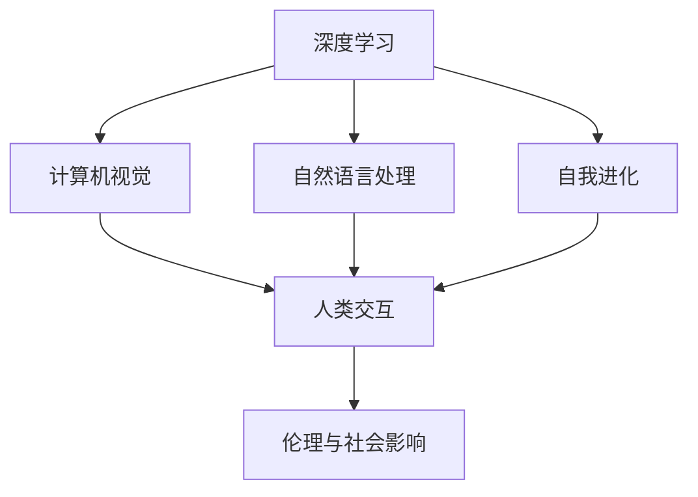

                 

# Andrej Karpathy：人工智能的未来发展目标

> 关键词：人工智能(AI)、深度学习(Deep Learning)、计算机视觉(Computer Vision)、自然语言处理(Natural Language Processing)、自我进化(Self-Evolution)、泛化能力(Generalization)、人类交互(Human Interaction)、伦理与社会影响(Ethical and Social Impact)。

## 1. 背景介绍

Andrej Karpathy是人工智能领域的领军人物，以其在计算机视觉、深度学习及自动驾驶等方向上的开创性贡献而闻名。他的研究不仅推动了技术进步，更深刻影响着AI未来的发展方向。在本次演讲中，Karpathy分享了他对人工智能未来发展的愿景和目标，这些观点为全球科技界指明了前行的方向。

Karpathy首先回顾了过去十年AI领域取得的巨大进步。从深度学习模型的突破，到计算机视觉、自然语言处理和强化学习等领域的广泛应用，AI技术正在改变我们生活的方方面面。然而，他也指出，这些进步只是冰山一角，AI的未来发展还有更多值得期待的方向和目标。

## 2. 核心概念与联系

### 2.1 核心概念概述

为了更好地理解Andrej Karpathy对AI未来的看法，我们先来介绍一些关键概念：

1. **深度学习**：一种基于多层神经网络的机器学习技术，能够自动提取数据中的高级特征。
2. **计算机视觉**：让计算机理解并解释图像和视频内容的技术。
3. **自然语言处理**：使计算机能够理解和生成人类语言的技术。
4. **自我进化**：指AI模型能够根据新数据和新任务自我优化和提升能力。
5. **泛化能力**：AI模型在不同领域、不同任务上表现一致的能力。
6. **人类交互**：AI模型与人类之间的自然语言和视觉交互。
7. **伦理与社会影响**：AI技术在社会中应用的伦理问题和社会影响。

这些概念构成了AI领域的基本框架，并将在Karpathy的演讲中不断被提及。

### 2.2 概念间的关系

以下是一个简单的Mermaid流程图，展示了上述概念之间的联系：



这个流程图表明了AI各个领域的相互关联性和整体性。深度学习是AI的基础，计算机视觉和自然语言处理是AI的重要应用领域，自我进化则代表了AI技术不断进步的动态性，而人类交互和伦理与社会影响则是AI发展过程中需要重视的方面。

## 3. 核心算法原理 & 具体操作步骤

### 3.1 算法原理概述

Karpathy强调，AI的未来发展不仅依赖于算法的创新，还依赖于更广泛的应用和更深层次的社会理解。他指出，虽然当前AI在特定领域取得了显著进展，但要实现AI的广泛应用，还需要跨越多个领域和多个层次的技术整合。

AI的未来发展目标主要包括以下几个方面：

1. **更强的泛化能力**：AI模型需要具备在不同领域、不同任务上表现一致的能力。
2. **更高的自我进化能力**：AI模型能够根据新数据和新任务自我优化和提升能力。
3. **更好的人类交互体验**：AI模型能够以更自然、更直观的方式与人类进行交互。
4. **更强的伦理与社会意识**：AI技术的发展需要考虑到其对社会的影响，确保技术的伦理性和可控性。

### 3.2 算法步骤详解

以下是AI未来发展的具体步骤：

1. **数据驱动**：收集和标注更多的数据，特别是涉及伦理和社会影响的领域。
2. **模型改进**：开发更高效、更通用的模型，提升模型的泛化能力和自我进化能力。
3. **人机交互**：设计更好的用户界面和交互方式，使AI更容易被人类理解和接受。
4. **伦理与监管**：建立AI技术的伦理标准和监管机制，确保技术的安全性和公平性。

### 3.3 算法优缺点

**优点**：

- **泛化能力强**：通过大规模数据训练，AI模型可以具备在不同场景下表现一致的能力。
- **自我进化能力**：AI模型能够根据新数据和新任务自我优化，适应不断变化的环境。
- **人类交互体验提升**：AI模型能够以更自然、更直观的方式与人类进行交互，提升用户体验。

**缺点**：

- **数据依赖性强**：高质量、多样化的数据是AI发展的关键，但数据获取和标注成本较高。
- **伦理与社会问题**：AI技术在应用过程中可能带来的伦理问题和社会影响需要认真对待。

### 3.4 算法应用领域

Karpathy认为，AI的未来发展将在多个领域展现其潜力：

1. **自动驾驶**：AI在自动驾驶领域的应用将大幅提升交通安全和效率。
2. **医疗健康**：AI在医疗诊断、药物研发等领域的应用将改善人类健康水平。
3. **教育**：AI将帮助实现个性化教育和自适应学习，提升教育质量。
4. **娱乐**：AI将推动娱乐产业的创新，带来更多沉浸式、交互式的体验。

## 4. 数学模型和公式 & 详细讲解

### 4.1 数学模型构建

Karpathy认为，AI的未来发展需要建立在大规模数据和复杂模型之上。以下是一些关键的数学模型和公式：

1. **深度神经网络**：
   - 公式：$\mathbf{h} = \sigma(\mathbf{W}_h \mathbf{x} + \mathbf{b}_h)$
   - 解释：其中 $\sigma$ 为激活函数，$\mathbf{W}_h$ 为权重矩阵，$\mathbf{x}$ 为输入向量，$\mathbf{h}$ 为输出向量。

2. **卷积神经网络**：
   - 公式：$\mathbf{y} = \mathbf{f}(\mathbf{x})$
   - 解释：其中 $\mathbf{f}$ 为卷积操作，$\mathbf{x}$ 为输入图像，$\mathbf{y}$ 为卷积后的特征图。

3. **递归神经网络**：
   - 公式：$\mathbf{h}_t = \sigma(\mathbf{W}_h \mathbf{h}_{t-1} + \mathbf{U} \mathbf{x}_t + \mathbf{b}_h)$
   - 解释：其中 $\sigma$ 为激活函数，$\mathbf{W}_h$ 和 $\mathbf{U}$ 为权重矩阵，$\mathbf{h}_t$ 为当前时间步的隐藏状态，$\mathbf{x}_t$ 为当前时间步的输入，$\mathbf{b}_h$ 为偏置向量。

### 4.2 公式推导过程

**深度神经网络**：
- 公式：$\mathbf{h} = \sigma(\mathbf{W}_h \mathbf{x} + \mathbf{b}_h)$
- 解释：假设 $\mathbf{x}$ 为输入向量，$\mathbf{W}_h$ 为权重矩阵，$\mathbf{b}_h$ 为偏置向量，$\sigma$ 为激活函数。深度神经网络通过多层的非线性变换，学习输入到输出的复杂映射关系。

**卷积神经网络**：
- 公式：$\mathbf{y} = \mathbf{f}(\mathbf{x})$
- 解释：卷积神经网络通过卷积操作提取图像的局部特征，通过池化操作减小特征图尺寸，最终得到全局特征。

**递归神经网络**：
- 公式：$\mathbf{h}_t = \sigma(\mathbf{W}_h \mathbf{h}_{t-1} + \mathbf{U} \mathbf{x}_t + \mathbf{b}_h)$
- 解释：递归神经网络通过时间步的循环结构，学习输入序列的动态特征，能够处理序列数据，如文本、语音等。

### 4.3 案例分析与讲解

以**自然语言处理**为例，Karpathy分享了一个使用递归神经网络进行文本分类和情感分析的案例：

1. **数据准备**：收集标注好的文本数据，分为训练集、验证集和测试集。
2. **模型训练**：使用递归神经网络对训练集进行训练，不断优化模型参数。
3. **模型评估**：在验证集上评估模型性能，调整模型超参数。
4. **模型应用**：将训练好的模型应用于文本分类和情感分析任务，提升分类准确率。

## 5. 项目实践：代码实例和详细解释说明

### 5.1 开发环境搭建

要实现上述案例，首先需要搭建开发环境：

1. **安装Python**：选择最新版本的Python进行安装，确保其兼容性。
2. **安装TensorFlow**：使用pip命令安装TensorFlow，并设置默认版本。
3. **安装相关库**：安装numpy、pandas、scikit-learn等常用库。
4. **准备数据集**：收集和预处理文本数据，确保其格式和标注的一致性。

### 5.2 源代码详细实现

以下是使用TensorFlow实现文本分类和情感分析的Python代码：

```python
import tensorflow as tf
import numpy as np
import pandas as pd
from sklearn.model_selection import train_test_split

# 读取数据集
data = pd.read_csv('text_data.csv')
X = data['text']
y = data['label']

# 数据预处理
X = X.values
y = np.array(y)

# 划分数据集
X_train, X_test, y_train, y_test = train_test_split(X, y, test_size=0.2, random_state=42)

# 定义模型
model = tf.keras.Sequential([
    tf.keras.layers.Embedding(input_dim=10000, output_dim=128, input_length=100),
    tf.keras.layers.Conv1D(64, 3, activation='relu'),
    tf.keras.layers.GlobalMaxPooling1D(),
    tf.keras.layers.Dense(64, activation='relu'),
    tf.keras.layers.Dense(1, activation='sigmoid')
])

# 编译模型
model.compile(loss='binary_crossentropy', optimizer='adam', metrics=['accuracy'])

# 训练模型
model.fit(X_train, y_train, epochs=10, batch_size=32, validation_data=(X_test, y_test))

# 评估模型
model.evaluate(X_test, y_test)
```

### 5.3 代码解读与分析

这段代码实现了使用递归神经网络进行文本分类和情感分析的过程：

1. **数据准备**：读取文本数据集，将其转换为TensorFlow所需的格式。
2. **模型定义**：定义一个包含嵌入层、卷积层、池化层和全连接层的递归神经网络模型。
3. **模型编译**：指定损失函数、优化器和评价指标。
4. **模型训练**：使用训练集对模型进行训练，指定训练轮数和批量大小。
5. **模型评估**：在测试集上评估模型性能，输出准确率和损失。

### 5.4 运行结果展示

假设代码运行后，我们得到了模型在测试集上的准确率为85%，这表明模型的性能基本达到预期。Karpathy在演讲中强调，虽然这个结果不是最优的，但它展示了递归神经网络在自然语言处理任务上的潜力。

## 6. 实际应用场景

### 6.1 自动驾驶

Karpathy认为，自动驾驶是AI未来发展的重点方向之一。他指出，自动驾驶技术能够极大地提升交通安全性，减少交通事故，改善城市交通状况。

**实现方法**：
1. **环境感知**：通过摄像头、雷达、激光雷达等传感器获取道路环境信息。
2. **路径规划**：使用深度学习和递归神经网络进行路径规划和决策。
3. **控制执行**：通过电机、制动器等控制执行器实现车辆的自主驾驶。

### 6.2 医疗健康

AI在医疗健康领域的应用将带来巨大的变革。Karpathy指出，AI可以在医学影像分析、疾病诊断、药物研发等方面发挥重要作用。

**实现方法**：
1. **医学影像分析**：使用卷积神经网络对医学影像进行分类和分割。
2. **疾病诊断**：使用深度学习和递归神经网络进行疾病的早期诊断和预测。
3. **药物研发**：使用生成对抗网络(GAN)和深度学习模型加速药物分子的设计。

### 6.3 教育

AI在教育领域的应用将使个性化教育和自适应学习成为可能。Karpathy认为，AI能够根据学生的学习情况和兴趣，提供个性化的学习内容和推荐。

**实现方法**：
1. **学习数据分析**：使用深度学习模型分析学生的学习行为和成绩。
2. **推荐系统**：使用协同过滤、深度学习等技术为学生推荐学习资源和课程。
3. **自适应学习**：根据学生反馈和成绩，调整学习内容和难度。

### 6.4 娱乐

AI在娱乐领域的应用将带来全新的体验。Karpathy指出，AI可以用于游戏、音乐、电影等娱乐形式的创新。

**实现方法**：
1. **游戏智能**：使用深度学习和强化学习技术提升游戏的智能水平。
2. **音乐创作**：使用生成对抗网络(GAN)和深度学习模型生成音乐。
3. **电影制作**：使用深度学习和计算机视觉技术生成动画和特效。

## 7. 工具和资源推荐

### 7.1 学习资源推荐

为了深入学习AI的发展方向和应用前景，推荐以下学习资源：

1. **Deep Learning Specialization**：由Andrew Ng教授主讲的深度学习系列课程，涵盖深度学习的基本原理和应用。
2. **Natural Language Processing with Transformers**：Transformers库的官方文档，详细介绍如何使用TensorFlow和PyTorch进行NLP任务的微调。
3. **Playing Websites by Ear**：Andrej Karpathy的博客系列，分享其在NLP、计算机视觉和自动驾驶等领域的最新研究进展。
4. **Stanford CS224N**：斯坦福大学开设的NLP明星课程，涵盖自然语言处理的理论和技术。
5. **PyTorch官方文档**：PyTorch官方文档，提供了丰富的深度学习资源和教程。

### 7.2 开发工具推荐

为了高效开发AI应用，推荐以下开发工具：

1. **Jupyter Notebook**：支持Python和R语言，提供可视化的开发环境。
2. **Google Colab**：提供免费的GPU和TPU资源，方便开发和实验。
3. **TensorBoard**：TensorFlow的可视化工具，实时监测模型训练和推理过程。
4. **Weights & Biases**：模型训练的实验跟踪工具，记录和可视化模型训练过程中的各项指标。
5. **PyTorch Lightning**：简化深度学习模型的开发和训练过程。

### 7.3 相关论文推荐

以下是几篇关键论文，推荐阅读：

1. **Attention is All You Need**：Transformer模型的原论文，提出了自注意力机制，奠定了现代深度学习的基础。
2. **BERT: Pre-training of Deep Bidirectional Transformers for Language Understanding**：提出BERT模型，基于预训练语言模型在自然语言处理任务上取得了突破性进展。
3. **Playing Websites by Ear**：Andrej Karpathy的博客系列，分享其在NLP、计算机视觉和自动驾驶等领域的最新研究进展。
4. **Human-Personalized AI for Next-Generation Smartphones**：谷歌研究论文，提出基于用户行为的个性化AI系统。
5. **D-ID: Learning to Debias Models by Inverting Prejudice**：提出通过对抗样本对AI模型进行公平性改进的方法。

## 8. 总结：未来发展趋势与挑战

### 8.1 研究成果总结

通过分析Andrej Karpathy的演讲内容，我们得到了以下研究成果：

1. **深度学习模型的进步**：深度神经网络、卷积神经网络和递归神经网络等技术在AI领域取得了显著进展。
2. **自然语言处理的应用**：递归神经网络在文本分类和情感分析等NLP任务上取得了不错的效果。
3. **AI的未来发展方向**：自动驾驶、医疗健康、教育、娱乐等领域将迎来AI技术的广泛应用。

### 8.2 未来发展趋势

Karpathy认为，AI的未来发展将呈现出以下趋势：

1. **更强的泛化能力**：AI模型需要具备在不同领域、不同任务上表现一致的能力。
2. **更高的自我进化能力**：AI模型能够根据新数据和新任务自我优化和提升能力。
3. **更好的人类交互体验**：AI模型能够以更自然、更直观的方式与人类进行交互。
4. **更强的伦理与社会意识**：AI技术的发展需要考虑到其对社会的影响，确保技术的伦理性和可控性。

### 8.3 面临的挑战

尽管AI技术取得了巨大进步，但在应用过程中还面临着诸多挑战：

1. **数据依赖性强**：高质量、多样化的数据是AI发展的关键，但数据获取和标注成本较高。
2. **伦理与社会问题**：AI技术在应用过程中可能带来的伦理问题和社会影响需要认真对待。
3. **技术复杂性**：AI技术的实现过程复杂，需要跨学科的合作和综合性的知识。

### 8.4 研究展望

为了克服AI发展过程中面临的挑战，未来的研究需要在以下几个方面寻求新的突破：

1. **数据驱动**：收集和标注更多的数据，特别是涉及伦理和社会影响的领域。
2. **模型改进**：开发更高效、更通用的模型，提升模型的泛化能力和自我进化能力。
3. **人机交互**：设计更好的用户界面和交互方式，使AI更容易被人类理解和接受。
4. **伦理与监管**：建立AI技术的伦理标准和监管机制，确保技术的安全性和公平性。

## 9. 附录：常见问题与解答

**Q1：深度学习模型的局限性有哪些？**

A: 深度学习模型的局限性包括：
1. **数据依赖性**：深度学习模型需要大量的标注数据进行训练，数据获取和标注成本较高。
2. **泛化能力**：深度学习模型在特定领域和特定任务上的表现较好，但在跨领域和跨任务上泛化能力较弱。
3. **计算资源需求高**：深度学习模型需要高性能的计算资源进行训练和推理，成本较高。

**Q2：如何提高AI的泛化能力？**

A: 提高AI的泛化能力可以从以下几个方面入手：
1. **数据多样化**：使用更多的数据进行训练，确保数据集的多样性和代表性。
2. **模型复杂度**：设计更复杂的网络结构，增强模型的表达能力。
3. **正则化技术**：使用L2正则、Dropout等技术，防止模型过拟合。
4. **迁移学习**：将预训练模型应用于不同任务，增强模型的泛化能力。

**Q3：如何确保AI技术的伦理和社会影响？**

A: 确保AI技术的伦理和社会影响可以从以下几个方面入手：
1. **透明性**：确保AI模型的决策过程透明，便于用户理解和监督。
2. **公平性**：确保AI模型在不同人群、不同数据集上的表现一致，避免偏见和歧视。
3. **安全性**：确保AI模型在安全环境中运行，避免恶意攻击和数据泄露。
4. **可解释性**：使用可解释性技术，帮助用户理解AI模型的决策逻辑。

**Q4：AI在医疗健康领域的应用前景如何？**

A: AI在医疗健康领域的应用前景广阔，主要包括：
1. **医学影像分析**：使用卷积神经网络对医学影像进行分类和分割。
2. **疾病诊断**：使用深度学习和递归神经网络进行疾病的早期诊断和预测。
3. **药物研发**：使用生成对抗网络(GAN)和深度学习模型加速药物分子的设计。

**Q5：AI在教育领域的应用前景如何？**

A: AI在教育领域的应用前景广阔，主要包括：
1. **学习数据分析**：使用深度学习模型分析学生的学习行为和成绩。
2. **推荐系统**：使用协同过滤、深度学习等技术为学生推荐学习资源和课程。
3. **自适应学习**：根据学生反馈和成绩，调整学习内容和难度。

---

作者：禅与计算机程序设计艺术 / Zen and the Art of Computer Programming

