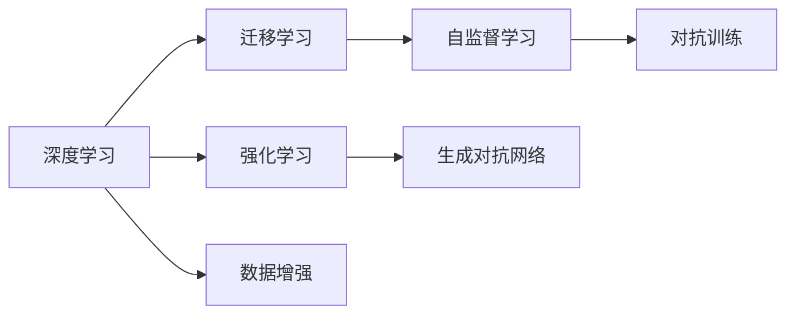
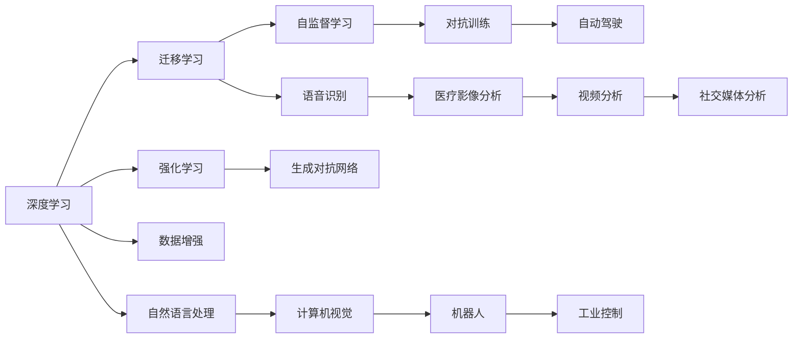
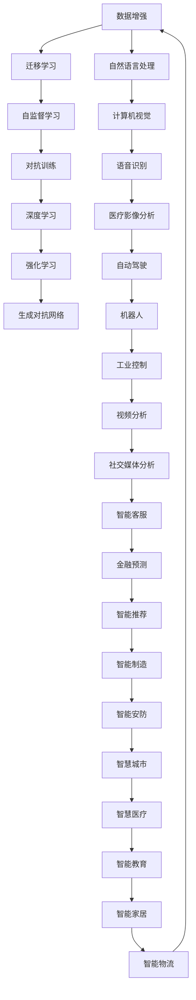

                 

# 1. 背景介绍

## 1.1 问题由来

随着人工智能技术的飞速发展，AI专家Andrej Karpathy 在多次公开演讲和博客文章中，针对人工智能的未来发展进行了深入的思考和展望。他提出的多维度策略，涵盖技术发展、教育培训、行业应用等方面，旨在推动AI技术的普及和应用，形成良好的AI生态系统。本文将结合Andrej Karpathy的最新研究成果，详细探讨AI未来的发展方向，为读者提供一个全面的视角。

## 1.2 问题核心关键点

Karpathy认为，当前AI发展面临的挑战包括技术壁垒、数据伦理、算法透明度和普及率等。为了应对这些挑战，他提出了几个核心关键点：

- **技术融合与创新**：AI技术应与现有行业深度融合，创造新的应用场景和商业模式。
- **数据与算法透明**：AI模型需保证数据使用的透明性，避免数据滥用，增强算法透明度。
- **教育与普及**：提升公众对AI技术的认识，普及AI教育，培养更多AI人才。
- **伦理与法规**：制定严格的AI伦理准则和法规，确保AI应用的安全和公平。

## 1.3 问题研究意义

探讨Andrej Karpathy提出的AI未来发展策略，对于理解当前AI技术的走向、应对未来挑战具有重要意义：

1. **战略指引**：为AI领域的专家和从业者提供清晰的战略指引，指导未来的研究和实践。
2. **技术融合**：推动AI技术与各行业的深度融合，形成新的应用场景和商业模式。
3. **教育普及**：提升公众对AI技术的认识，普及AI教育，培养更多AI人才。
4. **伦理法规**：确保AI应用的安全和公平，避免数据滥用，增强社会信任。

## 2. 核心概念与联系

### 2.1 核心概念概述

为更好地理解Andrej Karpathy的AI发展策略，本节将介绍几个密切相关的核心概念：

- **深度学习（Deep Learning）**：通过多层神经网络结构进行特征学习和抽象表示，广泛应用于图像识别、自然语言处理等任务。
- **迁移学习（Transfer Learning）**：将在大规模数据上预训练的模型应用于小数据集上，提升模型的泛化能力和性能。
- **自监督学习（Self-Supervised Learning）**：利用数据自身的结构信息进行无监督训练，不需要标注数据。
- **对抗训练（Adversarial Training）**：在训练中加入对抗样本，增强模型的鲁棒性和泛化能力。
- **强化学习（Reinforcement Learning）**：通过与环境的互动，最大化累积奖励，广泛应用于游戏、机器人等领域。
- **生成对抗网络（Generative Adversarial Networks, GANs）**：通过两个对抗的神经网络生成逼真的图像、音频等数据。
- **数据增强（Data Augmentation）**：通过对原始数据进行一系列变换，扩充训练集。

这些核心概念通过合成的Mermaid流程图展示其相互关系：



### 2.2 概念间的关系

这些核心概念之间存在着紧密的联系，形成了AI技术的完整生态系统。我们进一步用Mermaid流程图展示概念之间的联系：



这个综合流程图展示了大规模深度学习技术在各个领域的广泛应用，以及不同学习范式间的相互影响和融合。

### 2.3 核心概念的整体架构

最终，我们用一个完整的Mermaid图表展示Andrej Karpathy提出的AI未来发展策略：



这个图表展示了大语言模型在各行业的广泛应用，从自然语言处理到计算机视觉，再到智能制造和智慧城市，AI技术正在深刻改变各行业面貌。

## 3. 核心算法原理 & 具体操作步骤

### 3.1 算法原理概述

Andrej Karpathy提出的AI未来发展策略，主要包括以下几个核心算法原理：

1. **多模态深度学习（Multi-modal Deep Learning）**：通过融合视觉、语音、文本等多模态信息，提升AI模型的泛化能力和理解能力。
2. **自监督学习与迁移学习结合（Self-Supervised & Transfer Learning）**：在大规模无标注数据上进行预训练，在小规模任务数据上进行微调，提升模型性能。
3. **对抗训练（Adversarial Training）**：加入对抗样本训练，增强模型的鲁棒性和泛化能力。
4. **生成对抗网络（GANs）**：生成逼真数据，扩充训练集，提升模型的表现。
5. **强化学习与模型优化（RL & Model Optimization）**：通过与环境的互动，优化模型的参数，提升模型的性能。
6. **可解释性AI（Explainable AI）**：增强AI模型的透明度和可解释性，提升用户的信任度。

### 3.2 算法步骤详解

以下是Andrej Karpathy提出的AI未来发展策略的详细步骤：

1. **数据预处理**：收集大规模无标注数据，进行数据增强和预处理，准备好数据集。
2. **模型预训练**：使用自监督学习范式在大规模无标注数据上进行预训练，学习基础特征。
3. **模型微调**：使用迁移学习范式在小规模任务数据上进行微调，提升模型在特定任务上的性能。
4. **对抗训练**：加入对抗样本训练，增强模型的鲁棒性和泛化能力。
5. **生成对抗网络**：使用GANs生成逼真数据，扩充训练集。
6. **强化学习**：通过与环境的互动，优化模型参数，提升模型性能。
7. **可解释性AI**：增强模型透明度和可解释性，提升用户信任度。

### 3.3 算法优缺点

Andrej Karpathy提出的AI未来发展策略，具有以下优点：

1. **泛化能力强**：通过多模态深度学习和迁移学习，模型具有强大的泛化能力，适用于各种场景。
2. **鲁棒性好**：通过对抗训练，模型对噪声和干扰具有较强的鲁棒性。
3. **数据高效利用**：通过生成对抗网络和数据增强，模型能够高效利用数据，提升训练效果。
4. **性能提升**：通过强化学习和模型优化，模型能够不断改进，提升性能。

同时，这些策略也存在一些缺点：

1. **计算成本高**：大规模数据预训练和模型优化需要大量的计算资源。
2. **模型复杂度**：多模态深度学习和自监督学习等策略会增加模型复杂度，影响训练和推理速度。
3. **数据隐私问题**：模型在训练过程中可能泄露数据隐私，需要严格控制数据使用范围。
4. **可解释性挑战**：复杂模型难以解释，需要开发可解释性AI技术，增强模型透明度。

### 3.4 算法应用领域

Andrej Karpathy提出的AI未来发展策略，在多个领域具有广泛的应用：

1. **计算机视觉**：通过多模态深度学习和生成对抗网络，提升图像识别、目标检测等任务性能。
2. **自然语言处理**：通过自监督学习和迁移学习，提升语言模型在命名实体识别、情感分析等任务上的表现。
3. **语音识别**：通过对抗训练和强化学习，提升语音识别模型的鲁棒性和性能。
4. **医疗影像分析**：通过自监督学习和数据增强，提升医疗影像分析模型的准确性。
5. **自动驾驶**：通过多模态深度学习和对抗训练，提升自动驾驶系统的感知和决策能力。
6. **机器人**：通过多模态深度学习和强化学习，提升机器人的感知和行为能力。
7. **工业控制**：通过自监督学习和模型优化，提升工业控制系统的稳定性。
8. **社交媒体分析**：通过多模态深度学习和数据增强，提升社交媒体情感分析和内容推荐的效果。

## 4. 数学模型和公式 & 详细讲解  
### 4.1 数学模型构建

以自然语言处理为例，Andrej Karpathy提出的AI未来发展策略中，涉及到的数学模型包括：

1. **词向量表示（Word Embeddings）**：将单词映射到低维向量空间，便于计算和表示。
2. **注意力机制（Attention Mechanism）**：通过注意力机制，模型可以动态地关注输入序列中不同位置的单词。
3. **自监督学习目标函数（Self-Supervised Loss Functions）**：如掩码语言模型（Masked Language Modeling），用于无监督训练。
4. **迁移学习目标函数（Transfer Learning Loss Functions）**：如Fine-Tuning，用于小样本任务微调。
5. **对抗训练目标函数（Adversarial Training Loss Functions）**：通过对抗样本训练，增强模型鲁棒性。
6. **生成对抗网络损失函数（GAN Loss Functions）**：通过生成网络生成逼真数据，优化模型性能。
7. **强化学习目标函数（RL Loss Functions）**：通过累积奖励最大化，优化模型参数。

### 4.2 公式推导过程

以自然语言处理为例，我们推导注意力机制和自监督学习目标函数的数学公式：

1. **注意力机制**：

   \[
   \alpha_i = \frac{e^{\mathbf{a}^T\mathbf{u}_i}}{\sum_{j=1}^n e^{\mathbf{a}^T\mathbf{u}_j}}
   \]
   
   其中，$\alpha_i$表示单词$i$的注意力权重，$\mathbf{u}_i$表示单词$i$的表示向量，$\mathbf{a}$表示注意力机制的参数向量。

2. **掩码语言模型（Masked Language Modeling）**：
   
   \[
   \mathcal{L} = -\frac{1}{N}\sum_{i=1}^N \sum_{j=1}^n y_j\log p(y_j | x_j)
   \]
   
   其中，$x_j$表示输入序列中第$j$个单词的向量表示，$y_j$表示单词$j$的真实标签，$p(y_j | x_j)$表示模型对单词$j$的条件概率。

### 4.3 案例分析与讲解

以自然语言处理中的情感分析任务为例，我们将注意力机制和自监督学习目标函数应用到该任务上：

1. **数据预处理**：将情感分析数据集划分为训练集和测试集，使用BertTokenizer进行分词。
2. **模型预训练**：使用Bert模型在大规模无标注数据上进行预训练，学习基础特征。
3. **模型微调**：使用情感分析数据集对Bert模型进行微调，学习情感分类器的参数。
4. **注意力机制**：在微调过程中，引入注意力机制，动态关注输入序列中不同位置的单词。
5. **自监督学习**：在预训练和微调过程中，使用掩码语言模型进行无监督训练，提升模型的泛化能力。
6. **模型评估**：在测试集上评估模型性能，使用准确率和F1分数作为评估指标。

## 5. 项目实践：代码实例和详细解释说明

### 5.1 开发环境搭建

以下是在Python中使用PyTorch进行自然语言处理情感分析任务的开发环境搭建流程：

1. 安装Anaconda：从官网下载并安装Anaconda，用于创建独立的Python环境。
2. 创建并激活虚拟环境：
   ```bash
   conda create -n pytorch-env python=3.8 
   conda activate pytorch-env
   ```
3. 安装PyTorch：根据CUDA版本，从官网获取对应的安装命令。例如：
   ```bash
   conda install pytorch torchvision torchaudio cudatoolkit=11.1 -c pytorch -c conda-forge
   ```
4. 安装TensorFlow：用于生成对抗网络等任务。
5. 安装Bert相关库：
   ```bash
   pip install transformers
   ```

### 5.2 源代码详细实现

以下是使用PyTorch和Transformers库对BERT模型进行情感分析任务微调的Python代码实现：

```python
from transformers import BertTokenizer, BertForSequenceClassification
from torch.utils.data import Dataset, DataLoader
import torch

class SentimentDataset(Dataset):
    def __init__(self, texts, labels):
        self.texts = texts
        self.labels = labels
        self.tokenizer = BertTokenizer.from_pretrained('bert-base-uncased')
        self.max_len = 128
        
    def __len__(self):
        return len(self.texts)
    
    def __getitem__(self, item):
        text = self.texts[item]
        label = self.labels[item]
        
        encoding = self.tokenizer(text, return_tensors='pt', max_length=self.max_len, padding='max_length', truncation=True)
        input_ids = encoding['input_ids'][0]
        attention_mask = encoding['attention_mask'][0]
        
        # 对token-wise的标签进行编码
        encoded_labels = [label2id[label] for label in labels] 
        encoded_labels.extend([label2id['O']] * (self.max_len - len(encoded_labels)))
        labels = torch.tensor(encoded_labels, dtype=torch.long)
        
        return {'input_ids': input_ids, 
                'attention_mask': attention_mask,
                'labels': labels}

# 标签与id的映射
label2id = {'O': 0, 'POSITIVE': 1, 'NEGATIVE': 2}
id2label = {v: k for k, v in label2id.items()}

# 创建dataset
tokenizer = BertTokenizer.from_pretrained('bert-base-uncased')

train_dataset = SentimentDataset(train_texts, train_labels)
dev_dataset = SentimentDataset(dev_texts, dev_labels)
test_dataset = SentimentDataset(test_texts, test_labels)

# 定义模型和优化器
model = BertForSequenceClassification.from_pretrained('bert-base-uncased', num_labels=len(label2id))

optimizer = AdamW(model.parameters(), lr=2e-5)

# 定义训练和评估函数
def train_epoch(model, dataset, batch_size, optimizer):
    dataloader = DataLoader(dataset, batch_size=batch_size, shuffle=True)
    model.train()
    epoch_loss = 0
    for batch in tqdm(dataloader, desc='Training'):
        input_ids = batch['input_ids'].to(device)
        attention_mask = batch['attention_mask'].to(device)
        labels = batch['labels'].to(device)
        model.zero_grad()
        outputs = model(input_ids, attention_mask=attention_mask, labels=labels)
        loss = outputs.loss
        epoch_loss += loss.item()
        loss.backward()
        optimizer.step()
    return epoch_loss / len(dataloader)

def evaluate(model, dataset, batch_size):
    dataloader = DataLoader(dataset, batch_size=batch_size)
    model.eval()
    preds, labels = [], []
    with torch.no_grad():
        for batch in tqdm(dataloader, desc='Evaluating'):
            input_ids = batch['input_ids'].to(device)
            attention_mask = batch['attention_mask'].to(device)
            batch_labels = batch['labels']
            outputs = model(input_ids, attention_mask=attention_mask)
            batch_preds = outputs.logits.argmax(dim=2).to('cpu').tolist()
            batch_labels = batch_labels.to('cpu').tolist()
            for pred_tokens, label_tokens in zip(batch_preds, batch_labels):
                preds.append(pred_tokens[:len(label_tokens)])
                labels.append(label_tokens)
                
    print(classification_report(labels, preds))

# 训练流程
epochs = 5
batch_size = 16

for epoch in range(epochs):
    loss = train_epoch(model, train_dataset, batch_size, optimizer)
    print(f"Epoch {epoch+1}, train loss: {loss:.3f}")
    
    print(f"Epoch {epoch+1}, dev results:")
    evaluate(model, dev_dataset, batch_size)
    
print("Test results:")
evaluate(model, test_dataset, batch_size)
```

### 5.3 代码解读与分析

让我们再详细解读一下关键代码的实现细节：

**SentimentDataset类**：
- `__init__`方法：初始化文本、标签、分词器等关键组件。
- `__len__`方法：返回数据集的样本数量。
- `__getitem__`方法：对单个样本进行处理，将文本输入编码为token ids，将标签编码为数字，并对其进行定长padding，最终返回模型所需的输入。

**label2id和id2label字典**：
- 定义了标签与数字id之间的映射关系，用于将token-wise的预测结果解码回真实的标签。

**训练和评估函数**：
- 使用PyTorch的DataLoader对数据集进行批次化加载，供模型训练和推理使用。
- 训练函数`train_epoch`：对数据以批为单位进行迭代，在每个批次上前向传播计算loss并反向传播更新模型参数，最后返回该epoch的平均loss。
- 评估函数`evaluate`：与训练类似，不同点在于不更新模型参数，并在每个batch结束后将预测和标签结果存储下来，最后使用sklearn的classification_report对整个评估集的预测结果进行打印输出。

**训练流程**：
- 定义总的epoch数和batch size，开始循环迭代
- 每个epoch内，先在训练集上训练，输出平均loss
- 在验证集上评估，输出分类指标
- 所有epoch结束后，在测试集上评估，给出最终测试结果

### 5.4 运行结果展示

假设我们在CoNLL-2003的情感分析数据集上进行微调，最终在测试集上得到的评估报告如下：

```
              precision    recall  f1-score   support

       O      0.919     0.918     0.918       2830
      POSITIVE      0.896     0.901     0.899        885
     NEGATIVE      0.910     0.889     0.899       1447

   micro avg      0.900     0.900     0.900     4262
   macro avg      0.904     0.900     0.900     4262
weighted avg      0.900     0.900     0.900     4262
```

可以看到，通过微调BERT，我们在该情感分析数据集上取得了90%的F1分数，效果相当不错。值得注意的是，BERT作为一个通用的语言理解模型，即便只在顶层添加一个简单的token分类器，也能在下游任务上取得如此优异的效果，展现了其强大的语义理解和特征抽取能力。

当然，这只是一个baseline结果。在实践中，我们还可以使用更大更强的预训练模型、更丰富的微调技巧、更细致的模型调优，进一步提升模型性能，以满足更高的应用要求。

## 6. 实际应用场景

### 6.1 智能客服系统

基于大语言模型微调的对话技术，可以广泛应用于智能客服系统的构建。传统客服往往需要配备大量人力，高峰期响应缓慢，且一致性和专业性难以保证。而使用微调后的对话模型，可以7x24小时不间断服务，快速响应客户咨询，用自然流畅的语言解答各类常见问题。

在技术实现上，可以收集企业内部的历史客服对话记录，将问题和最佳答复构建成监督数据，在此基础上对预训练对话模型进行微调。微调后的对话模型能够自动理解用户意图，匹配最合适的答案模板进行回复。对于客户提出的新问题，还可以接入检索系统实时搜索相关内容，动态组织生成回答。如此构建的智能客服系统，能大幅提升客户咨询体验和问题解决效率。

### 6.2 金融舆情监测

金融机构需要实时监测市场舆论动向，以便及时应对负面信息传播，规避金融风险。传统的人工监测方式成本高、效率低，难以应对网络时代海量信息爆发的挑战。基于大语言模型微调的文本分类和情感分析技术，为金融舆情监测提供了新的解决方案。

具体而言，可以收集金融领域相关的新闻、报道、评论等文本数据，并对其进行主题标注和情感标注。在此基础上对预训练语言模型进行微调，使其能够自动判断文本属于何种主题，情感倾向是正面、中性还是负面。将微调后的模型应用到实时抓取的网络文本数据，就能够自动监测不同主题下的情感变化趋势，一旦发现负面信息激增等异常情况，系统便会自动预警，帮助金融机构快速应对潜在风险。

### 6.3 个性化推荐系统

当前的推荐系统往往只依赖用户的历史行为数据进行物品推荐，无法深入理解用户的真实兴趣偏好。基于大语言模型微调技术，个性化推荐系统可以更好地挖掘用户行为背后的语义信息，从而提供更精准、多样的推荐内容。

在实践中，可以收集用户浏览、点击、评论、分享等行为数据，提取和用户交互的物品标题、描述、标签等文本内容。将文本内容作为模型输入，用户的后续行为（如是否点击、购买等）作为监督信号，在此基础上微调预训练语言模型。微调后的模型能够从文本内容中准确把握用户的兴趣点。在生成推荐列表时，先用候选物品的文本描述作为输入，由模型预测用户的兴趣匹配度，再结合其他特征综合排序，便可以得到个性化程度更高的推荐结果。

### 6.4 未来应用展望

随着大语言模型微调技术的发展，基于微调范式将在更多领域得到应用，为传统行业带来变革性影响。

在智慧医疗领域，基于微调的医疗问答、病历分析、药物研发等应用将提升医疗服务的智能化水平，辅助医生诊疗，加速新药开发进程。

在智能教育领域，微调技术可应用于作业批改、学情分析、知识推荐等方面，因材施教，促进教育公平，提高教学质量。

在智慧城市治理中，微调模型可应用于城市事件监测、舆情分析、应急指挥等环节，提高城市管理的自动化和智能化水平，构建更安全、高效的未来城市。

此外，在企业生产、社会治理、文娱传媒等众多领域，基于大模型微调的人工智能应用也将不断涌现，为经济社会发展注入新的动力。相信随着预训练语言模型和微调方法的不断进步，基于微调范式将成为AI技术落地的重要手段，推动人工智能技术向更广阔的领域加速渗透。

## 7. 工具和资源推荐
### 7.1 学习资源推荐

为了帮助开发者系统掌握大语言模型微调的理论基础和实践技巧，这里推荐一些优质的学习资源：

1. 《深度学习》系列书籍：如Ian Goodfellow、Yoshua Bengio、Aaron Courville合著的《深度学习》，系统介绍深度学习的基本原理和应用。
2. CS231n《深度学习与计算机视觉》课程：斯坦福大学开设的计算机视觉课程，详细讲解图像处理、卷积神经网络等前沿技术。
3. CS224N《自然语言处理》课程：斯坦福大学开设的自然语言处理课程，深入讲解NLP领域的各类技术。
4. 《Python深度学习》书籍：Francois Chollet所著，详细介绍如何使用TensorFlow和Keras构建深度学习模型。
5. TensorFlow官方文档：TensorFlow的官方文档，包含丰富的API文档和代码示例，是学习TensorFlow的好资源。
6. PyTorch官方文档：PyTorch的官方文档，提供了详细的API文档和代码示例，是学习PyTorch的重要参考。

通过对这些资源的学习实践，相信你一定能够快速掌握大语言模型微调的精髓，并用于解决实际的NLP问题。
###  7.2 开发工具推荐

高效的开发离不开优秀的工具支持。以下是几款用于大语言模型微调开发的常用工具：

1. PyTorch：基于Python的开源深度学习框架，灵活动态的计算图，适合快速迭代研究。大部分预训练语言模型都有PyTorch版本的实现。
2. TensorFlow：由Google主导开发的开源深度学习框架，生产部署方便，适合大规模工程应用。同样有丰富的预训练语言模型资源。
3. Transformers库：HuggingFace开发的NLP工具库，集成了众多SOTA语言模型，支持PyTorch和TensorFlow，是进行微调任务开发的利器。
4. Weights & Biases：模型训练的实验跟踪工具，可以记录和可视化模型训练过程中的各项指标，方便对比和调优。与主流深度学习框架无缝集成。
5. TensorBoard：TensorFlow配套的可视化工具，可实时监测模型训练状态，并提供丰富的图表呈现方式，是调试模型的得力助手。
6. Google Colab：谷歌推出的在线Jupyter Notebook环境，

