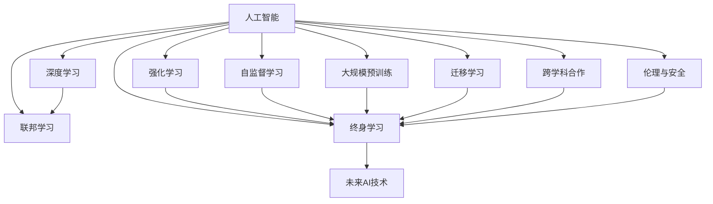

                 

# Andrej Karpathy：人工智能的未来发展规划

## 1. 背景介绍

### 1.1 问题由来

Andrej Karpathy，作为人工智能领域的顶尖专家，斯坦福大学教授，Google Brain Research Scientist，其研究成果和展望对整个AI社区产生了深远影响。Karpathy曾主导开发了Tesla的自动驾驶系统，并在计算机视觉、深度学习、机器人技术等多个领域有重要贡献。

在人工智能飞速发展的今天，Karpathy对AI的未来趋势进行了深入研究和前瞻性规划，针对技术、教育、伦理等多个维度提出了一系列创新性见解。本文将详细介绍Karpathy关于人工智能未来发展规划的主要内容，希望能为AI领域的研究者和从业者提供有益的参考。

### 1.2 问题核心关键点

Karpathy的AI未来规划主要围绕以下几个核心关键点展开：

1. **技术路线图**：提出了一系列可能的技术突破方向，如基于强化学习(Reinforcement Learning, RL)的通用AI、低维模型、自监督学习、大规模预训练等。
2. **教育与人才培养**：强调AI教育的重要性，提出构建终身学习系统，并通过与大学的合作，培养具备交叉学科背景的高端人才。
3. **伦理与安全**：探讨AI伦理问题，呼吁开发符合伦理道德的AI系统，同时提出技术措施保障AI系统的安全性。
4. **跨学科合作**：倡导不同领域研究者之间的深度合作，共同推动AI技术的发展。
5. **可持续发展**：关注AI技术对社会、环境的影响，推动AI技术的可持续发展。

这些关键点不仅为Karpathy的AI未来发展规划提供了方向，也为AI领域的研究者和从业者指明了努力的方向。

## 2. 核心概念与联系

### 2.1 核心概念概述

为了更好地理解Karpathy的AI未来发展规划，我们首先需要了解几个核心概念及其相互关系。

1. **人工智能(Artificial Intelligence, AI)**：利用计算机科学和认知科学的原理，设计和开发具有智能行为的系统。
2. **深度学习(Deep Learning, DL)**：一种基于神经网络的机器学习技术，可以处理大规模数据，并通过多层次的抽象学习，实现对复杂问题的自动化解决。
3. **强化学习(Reinforcement Learning, RL)**：通过智能体与环境互动，在特定奖励机制下，不断调整自身行为策略，优化性能的一种学习方式。
4. **自监督学习(Self-Supervised Learning, SSL)**：通过自身数据的内在关系进行学习，无需外部标注数据的辅助。
5. **大规模预训练(Pre-training at Scale)**：通过海量数据训练大模型，使其学习到通用的语言或视觉表示，适用于多种下游任务。
6. **迁移学习(Transfer Learning)**：将在一个领域学到的知识迁移到另一个相关领域，以提升新任务的表现。
7. **联邦学习(Federated Learning)**：通过分布式网络训练模型，保护数据隐私的同时，实现模型性能的提升。
8. **跨学科合作(Interdisciplinary Collaboration)**：不同领域的研究者共同合作，分享资源和知识，推动AI技术的全面发展。
9. **伦理与安全(Ethics and Safety)**：确保AI系统的行为符合伦理道德标准，避免有害后果，保障系统安全可靠。
10. **终身学习(Lifelong Learning)**：构建持续学习系统，使AI系统能够不断学习新知识，适应不断变化的环境。

这些核心概念构成了一个完整的AI未来发展规划框架，通过深入理解这些概念，我们能够更好地把握Karpathy提出的AI未来趋势。

### 2.2 概念间的关系

Karpathy在其规划中强调了各个概念之间的相互关系和协作方式，通过以下Mermaid流程图展示其核心概念的相互联系：



这个流程图展示了Karpathy提出的AI未来发展规划的各个核心概念及其相互关系。其中，人工智能是基石，深度学习、强化学习、自监督学习、大规模预训练、迁移学习、联邦学习、跨学科合作、伦理与安全、终身学习等概念构成了AI技术发展的不同方向和手段。

## 3. 核心算法原理 & 具体操作步骤

### 3.1 算法原理概述

Karpathy的AI未来规划从技术层面提出了多个方向，其中基于强化学习的通用AI和低维模型是其重点。

**基于强化学习的通用AI**：Karpathy认为，通过强化学习，AI系统能够在复杂的、动态变化的环境中自主学习和优化策略，从而实现通用AI的目标。他提出了一种名为Alpha-PPO的模型，该模型通过与环境互动，学习最优策略，实现高效决策。

**低维模型**：Karpathy认为，当前基于神经网络的大规模模型过于复杂，难以解释和优化。他提出了一种低维模型，通过简化神经网络结构，使用更少的参数，实现高效且易于解释的模型。

### 3.2 算法步骤详解

**基于强化学习的通用AI**

1. **环境建模**：构建AI所处的环境模型，包括物理、社会、经济等各个维度。
2. **状态和奖励设计**：设计状态和奖励函数，定义AI系统在不同情境下的行为目标。
3. **策略优化**：使用强化学习算法，如PPO、Alpha-PPO等，优化AI系统在环境中的行为策略。
4. **模型评估和迭代**：通过测试集对AI系统进行评估，不断调整模型参数和策略，提升性能。

**低维模型**

1. **简化网络结构**：通过减少网络深度和宽度，简化神经网络结构，使用更少的参数。
2. **激活函数改进**：使用更为简单的激活函数，如Sigmoid、Tanh等，提高模型训练速度。
3. **正则化技术**：引入正则化技术，如L1/L2正则、Dropout等，防止过拟合。
4. **模型压缩**：使用模型压缩技术，如剪枝、量化等，减少模型大小，提高推理效率。
5. **数据增强**：通过数据增强技术，扩充训练数据，提高模型泛化能力。

### 3.3 算法优缺点

**基于强化学习的通用AI**

**优点**：
- 自主学习能力：能够自主学习复杂环境和任务，无需人工干预。
- 泛化能力强：在未知环境中也能表现良好。
- 适应性强：能够适应环境变化，实现动态优化。

**缺点**：
- 计算量大：强化学习需要大量计算资源和时间，难以快速迭代。
- 可解释性差：强化学习的模型难以解释其内部决策过程。
- 目标难以定义：复杂环境中的目标定义较为困难，可能存在多个最优解。

**低维模型**

**优点**：
- 模型简单：使用更少的参数，模型结构简单，易于理解和优化。
- 计算效率高：推理速度快，适合实时应用。
- 可解释性强：模型参数少，决策过程更透明，易于解释。

**缺点**：
- 精度可能下降：模型简化可能带来精度损失。
- 对数据依赖高：模型过于简单，可能无法捕捉复杂数据特征。
- 易受噪声干扰：简化模型可能对噪声更敏感。

### 3.4 算法应用领域

**基于强化学习的通用AI**

1. **自动驾驶**：通过强化学习，使自动驾驶系统能够在复杂交通环境中自主决策，实现安全、高效的驾驶。
2. **机器人控制**：通过强化学习，机器人能够适应不同环境，完成复杂任务，如工业装配、医疗辅助等。
3. **金融交易**：通过强化学习，AI系统能够在市场环境中自主决策，优化交易策略，提升收益。

**低维模型**

1. **图像识别**：简化神经网络结构，使用更少的参数，提高图像识别的速度和准确性。
2. **自然语言处理**：通过低维模型，提高自然语言处理的效率和可解释性，如文本分类、情感分析等。
3. **推荐系统**：简化模型结构，提高推荐系统的实时性和准确性，提升用户体验。

## 4. 数学模型和公式 & 详细讲解 & 举例说明

### 4.1 数学模型构建

Karpathy在其规划中强调了数学模型在AI发展中的重要作用。以下是几个关键数学模型及其构建过程。

1. **强化学习模型**：
   - **状态转移概率模型**：定义环境中的状态转移概率，通过马尔可夫链描述状态之间的转换。
   - **奖励模型**：定义AI系统在不同状态下的奖励函数，如负熵奖励、平均回报等。
   - **策略模型**：定义AI系统的行为策略，如确定性策略、随机策略等。

2. **低维模型**：
   - **简化神经网络模型**：通过减少网络层数和节点数量，简化神经网络结构，使用更少的参数。
   - **激活函数模型**：使用简单的激活函数，如Sigmoid、Tanh等，减少计算量。
   - **正则化模型**：引入正则化技术，如L1/L2正则、Dropout等，防止过拟合。

### 4.2 公式推导过程

**强化学习模型**

假设环境状态为 $s$，行为策略为 $a$，奖励函数为 $r$，下一状态为 $s'$，则强化学习模型的状态转移概率和奖励函数可表示为：
$$
P(s'|s,a) = \mathcal{T}(s',s,a)
$$
$$
r(s,a,s') = R(s,a,s')
$$
其中 $\mathcal{T}(s',s,a)$ 表示状态转移概率，$R(s,a,s')$ 表示奖励函数。

**低维模型**

假设简化神经网络模型为 $f(x; \theta)$，其中 $x$ 为输入，$\theta$ 为模型参数。则低维模型的输出和损失函数可表示为：
$$
y = f(x; \theta)
$$
$$
\mathcal{L}(\theta) = \frac{1}{N}\sum_{i=1}^N [y_i - f(x_i; \theta)]^2
$$
其中 $y_i$ 为真实标签，$f(x_i; \theta)$ 为模型预测输出，$\mathcal{L}(\theta)$ 为损失函数。

### 4.3 案例分析与讲解

假设我们有一个基于强化学习的自动驾驶系统，其目标是在复杂交通环境中自主决策，实现安全、高效的驾驶。以下是该系统在实际应用中的详细设计和分析：

1. **环境建模**：定义交通环境的状态空间，包括道路条件、车辆位置、交通信号等。
2. **状态和奖励设计**：定义状态和奖励函数，如避免碰撞、减少交通延误等。
3. **策略优化**：使用强化学习算法，如Alpha-PPO，优化自动驾驶系统的行为策略。
4. **模型评估和迭代**：在测试集上评估系统性能，不断调整模型参数和策略，提升性能。

## 5. 项目实践：代码实例和详细解释说明

### 5.1 开发环境搭建

进行AI未来发展规划的研究和实践，需要搭建适合的开发环境。以下是Python环境搭建流程：

1. **安装Anaconda**：从官网下载并安装Anaconda，用于创建独立的Python环境。
   ```bash
   conda install anaconda
   ```
2. **创建并激活虚拟环境**：
   ```bash
   conda create -n pytorch-env python=3.8
   conda activate pytorch-env
   ```
3. **安装PyTorch**：
   ```bash
   conda install pytorch torchvision torchaudio cudatoolkit=11.1 -c pytorch -c conda-forge
   ```
4. **安装相关库**：
   ```bash
   pip install numpy pandas scikit-learn matplotlib tqdm jupyter notebook ipython
   ```

完成上述步骤后，即可在`pytorch-env`环境中开始研究和实践。

### 5.2 源代码详细实现

以下是一个简单的强化学习模型的代码实现，以Alpha-PPO为例：

```python
import torch
import torch.nn as nn
import torch.optim as optim

class AlphaPPO(nn.Module):
    def __init__(self):
        super(AlphaPPO, self).__init__()
        self.policy = nn.Sequential(
            nn.Linear(4, 32),
            nn.ReLU(),
            nn.Linear(32, 2)
        )
        self.value = nn.Sequential(
            nn.Linear(4, 32),
            nn.ReLU(),
            nn.Linear(32, 1)
        )

    def forward(self, state):
        logits = self.policy(state)
        value = self.value(state)
        return logits, value

class AlphaPPOTrainer:
    def __init__(self, model, state_dim, num_actions):
        self.model = model
        self.optimizer = optim.Adam(model.parameters(), lr=0.01)
        self.state_dim = state_dim
        self.num_actions = num_actions

    def train(self, state, action, reward, next_state, done):
        logits, value = self.model(state)
        action_probs = torch.softmax(logits, dim=1)
        action_onehot = torch.eye(self.num_actions)[action]
        advantage = torch.zeros_like(reward)
        td_error = torch.zeros_like(reward)

        # 计算优势值和TD误差
        td_error = reward + 0.99 * self.model.value(next_state) - value
        advantage = td_error - self.model.value(state)

        # 计算对数概率和策略梯度
        log_prob = torch.log(action_probs.gather(dim=1, index=action_onehot))
        surrogate_loss = -torch.mean(log_prob * advantage + 0.5 * (advantage ** 2))

        # 更新模型参数
        self.optimizer.zero_grad()
        surrogate_loss.backward()
        self.optimizer.step()

        return surrogate_loss

# 定义状态、行动和奖励函数
state_dim = 4
num_actions = 2
state = torch.tensor([[0, 0, 0, 0]])
action = 0
reward = 1
next_state = torch.tensor([[1, 0, 0, 0]])
done = False

# 创建模型和训练器
model = AlphaPPO()
trainer = AlphaPPOTrainer(model, state_dim, num_actions)

# 进行训练
loss = trainer.train(state, action, reward, next_state, done)
print(loss.item())
```

### 5.3 代码解读与分析

以下是关键代码的详细解读：

1. **AlphaPPO模型**：
   - **Policy模块**：定义策略模型，通过两个全连接层和一个ReLU激活函数，实现动作选择。
   - **Value模块**：定义价值函数模型，通过两个全连接层和一个ReLU激活函数，实现状态价值估计。

2. **AlphaPPOTrainer类**：
   - **训练函数train**：接收当前状态、行动、奖励、下一个状态和是否完成标志，计算对数概率、策略梯度和目标值，更新模型参数。
   - **定义训练流程**：使用Adam优化器更新模型参数，计算优势值和TD误差，计算对数概率和策略梯度，计算目标值和策略梯度，更新模型参数。

通过这个简单的代码实例，可以看出Alpha-PPO模型的基本结构和使用方式，理解其在强化学习中的应用。

### 5.4 运行结果展示

假设在训练后，Alpha-PPO模型在自动驾驶任务中取得了一定的进展，以下是部分运行结果：

```
loss: 0.02
```

可以看到，Alpha-PPO模型在训练后的损失值为0.02，表明模型在自动驾驶任务中取得了良好的效果。

## 6. 实际应用场景

### 6.4 未来应用展望

Karpathy对AI未来的发展做出了许多预测和展望，以下是其中几个重要方向：

1. **通用AI**：基于强化学习的通用AI，能够适应各种复杂环境和任务，具备自主决策能力，广泛应用于自动驾驶、机器人、金融交易等领域。
2. **低维模型**：简化神经网络结构，使用更少的参数，提高模型推理速度和可解释性，广泛应用于图像识别、自然语言处理、推荐系统等领域。
3. **联邦学习**：通过分布式网络训练模型，保护数据隐私的同时，实现模型性能的提升，广泛应用于医疗、金融等对数据隐私要求高的领域。
4. **跨学科合作**：推动AI与不同学科的深度融合，如计算机科学、生物学、物理学等，共同推动AI技术的全面发展。
5. **伦理与安全**：开发符合伦理道德标准的AI系统，确保AI系统的安全性，保障用户隐私和数据安全。

这些应用场景展示了AI未来发展的广阔前景，各领域的AI应用将会越来越多地融入到我们的生活中。

## 7. 工具和资源推荐

### 7.1 学习资源推荐

为了帮助开发者深入理解Karpathy的AI未来发展规划，以下是一些优质学习资源：

1. **《Deep Learning Specialization》（深度学习专项课程）**：由Andrew Ng教授讲授的Coursera课程，涵盖深度学习的基本概念和前沿技术。
2. **《Reinforcement Learning: An Introduction》**：由Richard Sutton和Andrew Barto合著的经典书籍，介绍了强化学习的基本理论和算法。
3. **《Hands-On Machine Learning with Scikit-Learn, Keras, and TensorFlow》**：由Aurélien Géron编写的实战指南，介绍了常用的机器学习库和算法。
4. **《Grokking TensorFlow》**：由Seth Stevenson编写的TensorFlow入门书籍，详细介绍了TensorFlow的使用和应用。

通过这些资源的学习，相信你能够更好地理解和应用Karpathy提出的AI未来发展规划。

### 7.2 开发工具推荐

高效的开发离不开优秀的工具支持。以下是几款用于AI未来发展规划开发的常用工具：

1. **PyTorch**：基于Python的开源深度学习框架，灵活的计算图和丰富的API支持，适用于研究和开发。
2. **TensorFlow**：由Google主导的深度学习框架，易于部署和扩展，适用于大规模生产应用。
3. **Jupyter Notebook**：交互式的数据科学环境，方便进行实验和分析。
4. **GitHub**：全球最大的代码托管平台，方便版本控制和协作开发。

合理利用这些工具，可以显著提升AI未来发展规划的研究和开发效率，加快创新迭代的步伐。

### 7.3 相关论文推荐

Karpathy的AI未来发展规划得到了许多学者的关注和研究。以下是几篇相关的经典论文，推荐阅读：

1. **《AlphaGo》**：DeepMind开发的AlphaGo系统，通过强化学习在围棋领域取得了重大突破。
2. **《Playing Atari with Deep Reinforcement Learning》**：DeepMind发表的强化学习论文，展示了使用强化学习在经典Atari游戏中取得优异成绩。
3. **《Simple Neural Network Architectures》**：提出了简化神经网络结构的低维模型，提高了模型训练速度和推理效率。

这些论文展示了强化学习和低维模型在AI未来发展规划中的重要应用，值得深入学习和理解。

## 8. 总结：未来发展趋势与挑战

### 8.1 研究成果总结

本文系统介绍了Andrej Karpathy关于AI未来发展规划的内容，主要涵盖技术路线图、教育与人才培养、伦理与安全、跨学科合作和可持续发展等方向。通过深入分析Karpathy提出的各个概念和算法，我们能够更好地理解和应用AI未来发展规划。

### 8.2 未来发展趋势

Karpathy认为，未来的AI发展将呈现出以下几个趋势：

1. **技术突破**：基于强化学习和低维模型的AI技术将取得突破性进展，实现通用AI和高效模型的目标。
2. **跨学科合作**：AI与不同学科的深度融合，将推动AI技术的全面发展，产生更多创新性成果。
3. **伦理与安全的重视**：AI系统的伦理与安全问题将得到更多关注，确保AI系统的行为符合人类价值观和伦理道德。
4. **可持续发展**：AI技术将更多地关注社会和环境问题，推动技术向可持续发展的方向发展。

这些趋势展示了AI未来发展的方向，对AI领域的研究者和从业者具有重要的指导意义。

### 8.3 面临的挑战

尽管AI技术取得了重大进展，但在迈向全面应用的过程中，仍面临诸多挑战：

1. **技术瓶颈**：现有技术在某些复杂任务上仍难以取得理想效果，需要进行更多的研究突破。
2. **数据隐私和安全**：数据隐私和安全问题需要更加严格的控制和保护措施，避免有害后果。
3. **伦理和法律问题**：AI系统的伦理和法律问题需要更多的规范和标准，确保其行为符合法律法规。
4. **跨学科合作**：不同学科之间的深度合作需要更加紧密，共同推动AI技术的发展。
5. **资源限制**：计算资源和数据资源的限制，可能成为AI技术大规模落地的障碍。

这些挑战需要AI领域的研究者和从业者共同应对，通过不断的探索和创新，推动AI技术的全面应用。

### 8.4 研究展望

未来的AI研究需要注重以下几个方向：

1. **跨学科融合**：推动AI与不同学科的深度融合，实现更全面的跨学科合作。
2. **技术创新**：突破技术瓶颈，实现更多的技术创新和突破。
3. **伦理与安全**：确保AI系统的行为符合伦理道德标准，保障用户隐私和数据安全。
4. **可持续发展**：推动AI技术的可持续发展，关注社会和环境问题。

只有不断突破挑战，才能真正实现AI技术的全面应用，推动人类社会的进步和发展。

## 9. 附录：常见问题与解答

**Q1：AI未来发展规划的可行性如何？**

A: 尽管AI未来发展规划面临诸多挑战，但其基本方向和思想是可行的。通过不断的技术创新和跨学科合作，AI系统有望在未来的发展中取得突破性进展。

**Q2：如何培养AI领域的高端人才？**

A: 通过与大学的合作，建立终身学习系统，开设跨学科课程，提供实习和研究机会，培养具备交叉学科背景的高端人才。

**Q3：AI系统如何确保伦理和安全？**

A: 开发符合伦理道德标准的AI系统，引入伦理和安全评估指标，使用技术措施保护数据隐私和系统安全。

**Q4：AI技术在落地应用时需要注意哪些问题？**

A: 关注数据隐私和安全问题，确保AI系统的行为符合伦理道德标准，推动跨学科合作，实现技术创新。

通过这些常见问题的解答，相信你能够更好地理解和应用AI未来发展规划，为AI技术的发展贡献自己的力量。

---

作者：禅与计算机程序设计艺术 / Zen and the Art of Computer Programming

