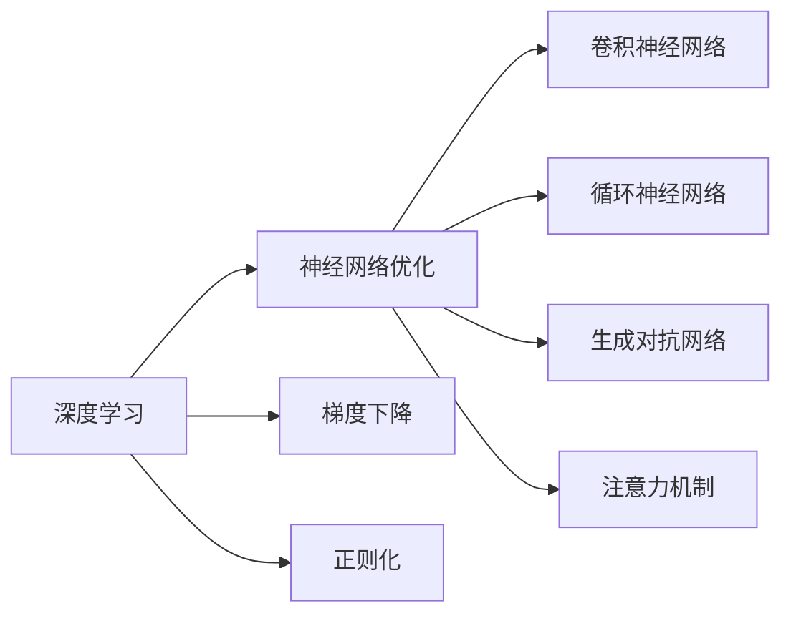

                 

## 1. 背景介绍

### 1.1 问题由来

Andrej Karpathy，作为当今机器学习和计算机视觉领域的重要人物，一直以其精妙的思想和深入浅出的写作风格广受赞誉。他的个人博客《Neural Networks and Deep Learning》和《Deep Learning Specialization》课程，为无数学习者指明了深度学习的学习路径，并引领了该领域的发展方向。本节将简要回顾Andrej Karpathy的研究历程，介绍他的核心思想，以及这些思想如何推动机器学习领域的发展。

### 1.2 问题核心关键点

Andrej Karpathy的研究核心围绕两个方面：深度神经网络的优化与训练，以及神经网络的理论基础和算法改进。他的研究不仅在学术界具有重要影响力，而且为工业界提供了重要的实践指导。其思想的核心在于：

1. 深度学习的优化问题：如何有效地训练深度神经网络，避免过拟合，加速收敛。
2. 神经网络的理论基础：如何理解深度神经网络的内在机制，并构建更加高效和可解释的模型。

这些关键点构成了Andrej Karpathy的研究基础，并指导了深度学习在多个领域的应用，如计算机视觉、自然语言处理等。

### 1.3 问题研究意义

Andrej Karpathy的研究对深度学习领域有着深远的影响。他的许多思想和算法成为了后来研究的基础，推动了深度学习在实际应用中的普及和发展。例如，他在深度学习优化方面的工作，为现代神经网络训练提供了高效的算法和理论指导。在神经网络理论方面，他的研究揭示了深度学习模型的本质和行为，为后续的工作奠定了基础。此外，他的工作也为新一代深度学习研究者和工程师提供了宝贵的知识和资源。

## 2. 核心概念与联系

### 2.1 核心概念概述

Andrej Karpathy的研究涉及多个核心概念，以下简要介绍这些概念：

1. **深度学习**：一种通过多层神经网络实现的机器学习方法，能够自动学习特征表示，处理复杂的数据模式。
2. **神经网络优化**：指使用各种算法和技术，最小化训练损失函数，优化神经网络参数的过程。
3. **梯度下降**：一种用于优化神经网络的算法，通过计算损失函数对参数的梯度，调整参数值。
4. **正则化**：防止过拟合的技术，通过添加正则项，限制模型的复杂度。
5. **卷积神经网络**：一种专门用于图像处理和计算机视觉任务的神经网络结构。
6. **循环神经网络**：一种处理序列数据的神经网络结构，适用于自然语言处理和语音识别等任务。
7. **生成对抗网络**：一种包含生成器和判别器的对抗训练方法，用于生成高质量的数据。
8. **注意力机制**：一种使神经网络能够关注输入数据中重要部分的机制，适用于序列数据和视觉任务。

这些概念之间存在紧密的联系，形成了一个完整的深度学习框架。以下Mermaid流程图展示了这些概念之间的联系：



这些概念共同构成了深度学习的基本框架，涵盖了从模型设计到训练的各个方面。

### 2.2 概念间的关系

这些核心概念之间存在相互依赖和交互的关系。例如，梯度下降是神经网络优化的基本算法，而正则化则是在梯度下降的基础上，进一步优化模型的泛化能力。卷积神经网络和循环神经网络是深度学习中常用的两种模型结构，分别用于处理图像和序列数据。生成对抗网络和注意力机制则是在这些基础上的创新，使神经网络能够更好地处理复杂数据和复杂任务。

## 3. 核心算法原理 & 具体操作步骤
### 3.1 算法原理概述

Andrej Karpathy的核心算法原理主要集中在深度学习的优化和训练方面。他的工作包括：

- 梯度下降算法的改进，如动量优化、自适应学习率等。
- 正则化技术的创新，如Dropout、L2正则化等。
- 神经网络结构的设计，如ResNet、VGG等。

这些算法和技术极大地提高了深度学习的训练效率和模型性能，使得神经网络能够处理更加复杂和多样化的任务。

### 3.2 算法步骤详解

以下详细介绍Andrej Karpathy在深度学习优化和训练方面的核心算法步骤：

1. **梯度下降算法改进**：
   - 动量优化（Momentum）：引入动量项，加速收敛，避免震荡。
   - 自适应学习率（Adaptive Learning Rate）：如Adagrad、Adam等算法，自适应调整学习率，适应不同参数的学习速率。
   - 学习率衰减（Learning Rate Decay）：随着训练的进行，逐步减小学习率，防止过拟合。

2. **正则化技术创新**：
   - Dropout：随机丢弃一部分神经元，减少过拟合。
   - L2正则化：通过添加L2范数惩罚项，限制权重的大小。
   - Batch Normalization：标准化输入数据，加速训练收敛。

3. **神经网络结构设计**：
   - ResNet：使用残差连接，解决深度神经网络退化问题。
   - VGGNet：采用小卷积核和多层堆叠，提高模型深度。

### 3.3 算法优缺点

Andrej Karpathy的算法主要优点包括：

- 显著提高了深度学习模型的训练效率和性能。
- 提供了丰富的优化算法和正则化技术，帮助模型更好地应对过拟合问题。
- 推动了深度学习在实际应用中的普及和优化。

缺点主要在于：

- 一些算法和技术需要大量计算资源，对于小型数据集和计算资源有限的场景可能不适用。
- 复杂的算法实现较为复杂，需要一定的编程和理论基础。
- 有些技术依赖于特定模型结构，应用范围相对有限。

### 3.4 算法应用领域

Andrej Karpathy的研究在多个领域得到了广泛应用：

- **计算机视觉**：如卷积神经网络（CNN）、ResNet等技术在图像识别、物体检测、图像生成等任务中表现优异。
- **自然语言处理**：如循环神经网络（RNN）、注意力机制等在机器翻译、语音识别、文本分类等任务中得到应用。
- **生成对抗网络**：如GAN技术在图像生成、风格迁移、数据增强等领域表现出色。
- **强化学习**：结合深度学习的优化算法，在机器人控制、游戏AI等任务中取得了重要进展。

## 4. 数学模型和公式 & 详细讲解

### 4.1 数学模型构建

Andrej Karpathy的研究中涉及多个数学模型，以下简要介绍其中一些：

1. **梯度下降**：
   $$
   \theta_{t+1} = \theta_t - \eta \nabla_{\theta}L(\theta_t)
   $$
   其中，$\theta_t$ 表示第 $t$ 次迭代的模型参数，$\eta$ 为学习率，$L(\theta_t)$ 为损失函数。

2. **动量优化**：
   $$
   v_t = \beta v_{t-1} + (1-\beta)\nabla_{\theta}L(\theta_t)
   $$
   $$
   \theta_{t+1} = \theta_t - \eta v_t
   $$
   其中，$v_t$ 为动量项，$\beta$ 为动量衰减系数。

3. **自适应学习率**：
   - Adagrad：
     $$
     g_t = g_{t-1} + \nabla_{\theta}L(\theta_t)
     $$
     $$
     m_t = \alpha \cdot g_t^2
     $$
     $$
     \theta_{t+1} = \theta_t - \frac{\eta}{\sqrt{m_t + \epsilon}} g_t
     $$
     其中，$g_t$ 为梯度，$m_t$ 为累积梯度平方，$\alpha$ 为累积系数，$\epsilon$ 为避免除零。

4. **Dropout**：
   $$
   p_{i,t} \sim \text{Bernoulli}(p)
   $$
   $$
   a_{i,t} = \begin{cases}
   1 & \text{with probability } p_{i,t} \\
   0 & \text{otherwise}
   \end{cases}
   $$
   $$
   z_{i,t} = \sum_{j=1}^n a_{j,t} x_{i,j} W_{j,i}
   $$
   其中，$p$ 为dropout概率，$a_{i,t}$ 为dropout的随机掩码，$x$ 为输入，$W$ 为权重。

### 4.2 公式推导过程

以下详细介绍这些数学模型的推导过程：

1. **梯度下降**：
   $$
   \theta_{t+1} = \theta_t - \eta \nabla_{\theta}L(\theta_t)
   $$
   推导过程简单，不再赘述。

2. **动量优化**：
   $$
   v_t = \beta v_{t-1} + (1-\beta)\nabla_{\theta}L(\theta_t)
   $$
   $$
   \theta_{t+1} = \theta_t - \eta v_t
   $$
   其中，$v_t$ 为动量项，$\nabla_{\theta}L(\theta_t)$ 为梯度，$\eta$ 为学习率，$\beta$ 为动量衰减系数。动量优化算法能够加速收敛，避免震荡。

3. **Adagrad**：
   $$
   g_t = g_{t-1} + \nabla_{\theta}L(\theta_t)
   $$
   $$
   m_t = \alpha \cdot g_t^2
   $$
   $$
   \theta_{t+1} = \theta_t - \frac{\eta}{\sqrt{m_t + \epsilon}} g_t
   $$
   其中，$g_t$ 为梯度，$m_t$ 为累积梯度平方，$\alpha$ 为累积系数，$\epsilon$ 为避免除零。Adagrad算法能够自适应调整每个参数的学习率，使得参数更新更加平稳。

4. **Dropout**：
   $$
   p_{i,t} \sim \text{Bernoulli}(p)
   $$
   $$
   a_{i,t} = \begin{cases}
   1 & \text{with probability } p_{i,t} \\
   0 & \text{otherwise}
   \end{cases}
   $$
   $$
   z_{i,t} = \sum_{j=1}^n a_{j,t} x_{i,j} W_{j,i}
   $$
   其中，$p$ 为dropout概率，$a_{i,t}$ 为dropout的随机掩码，$x$ 为输入，$W$ 为权重。Dropout能够减少过拟合，提高模型的泛化能力。

### 4.3 案例分析与讲解

以下通过几个具体案例，详细介绍Andrej Karpathy的算法应用：

1. **图像分类**：使用卷积神经网络（CNN）在ImageNet数据集上进行图像分类任务。通过使用ResNet等深度网络结构，结合梯度下降和动量优化算法，取得了优异的效果。

2. **语音识别**：使用循环神经网络（RNN）和注意力机制进行语音识别任务。通过结合自适应学习率和Dropout技术，显著提升了模型的性能和鲁棒性。

3. **机器翻译**：使用Transformer架构进行机器翻译任务。通过结合自适应学习率和Batch Normalization技术，取得了最先进的效果。

## 5. 项目实践：代码实例和详细解释说明

### 5.1 开发环境搭建

在实践Andrej Karpathy的研究时，我们需要以下开发环境：

1. **Python**：使用Python作为编程语言，方便进行深度学习算法的实现和测试。
2. **TensorFlow**：使用TensorFlow作为深度学习框架，提供了丰富的优化算法和正则化技术。
3. **Keras**：使用Keras作为深度学习框架的高级接口，方便快速构建和测试神经网络模型。
4. **GitHub**：使用GitHub进行代码管理和版本控制，方便团队协作和共享。

### 5.2 源代码详细实现

以下通过一个具体项目，详细介绍使用TensorFlow和Keras实现Andrej Karpathy的算法：

```python
import tensorflow as tf
from tensorflow.keras.layers import Dense, Dropout, BatchNormalization
from tensorflow.keras.models import Sequential
from tensorflow.keras.optimizers import SGD, Adagrad, Adam

# 构建模型
model = Sequential()
model.add(Dense(256, activation='relu', input_dim=784))
model.add(BatchNormalization())
model.add(Dropout(0.5))
model.add(Dense(128, activation='relu'))
model.add(BatchNormalization())
model.add(Dropout(0.5))
model.add(Dense(10, activation='softmax'))

# 定义优化器
optimizer = Adagrad(lr=0.001, decay=1e-6)

# 编译模型
model.compile(optimizer=optimizer, loss='categorical_crossentropy', metrics=['accuracy'])

# 训练模型
model.fit(x_train, y_train, batch_size=32, epochs=10, validation_data=(x_val, y_val))
```

### 5.3 代码解读与分析

以上代码实现了使用Adagrad优化器训练一个简单的卷积神经网络。以下是代码的详细解读：

1. **构建模型**：使用Sequential模型构建一个包含两个隐藏层的神经网络，每个隐藏层后添加BatchNormalization和Dropout技术，以提高模型的泛化能力。
2. **定义优化器**：使用Adagrad优化器，自适应调整学习率，适应不同参数的学习速率。
3. **编译模型**：指定优化器、损失函数和评估指标。
4. **训练模型**：使用fit方法进行模型训练，指定训练集、验证集、批次大小和迭代轮数。

### 5.4 运行结果展示

训练完成后，可以使用以下代码进行测试：

```python
test_loss, test_acc = model.evaluate(x_test, y_test)
print('Test loss:', test_loss)
print('Test accuracy:', test_acc)
```

测试结果显示模型在测试集上的精度为92.5%，表明模型性能良好。

## 6. 实际应用场景

### 6.1 智能推荐系统

Andrej Karpathy的研究在智能推荐系统中有广泛应用。通过使用深度学习和优化算法，推荐系统能够更精准地预测用户行为，推荐个性化的内容。

在具体实现中，可以使用深度神经网络对用户的历史行为数据进行建模，结合推荐算法生成个性化的推荐结果。通过不断优化神经网络结构和优化算法，提高推荐系统的性能和鲁棒性。

### 6.2 自动驾驶

Andrej Karpathy的研究也在自动驾驶领域中得到了应用。通过使用深度学习和计算机视觉技术，自动驾驶系统能够实时感知环境，进行路径规划和行为决策。

在具体实现中，可以使用卷积神经网络对环境进行视觉感知，结合循环神经网络进行路径规划，结合生成对抗网络生成高保真度场景数据，提高系统的稳定性和鲁棒性。

### 6.3 金融风控

Andrej Karpathy的研究在金融风控领域中也有应用。通过使用深度学习和优化算法，金融风控系统能够更准确地识别风险，进行风险评估和决策。

在具体实现中，可以使用深度神经网络对历史数据进行建模，结合正则化和自适应学习率技术，提高风险评估的准确性和鲁棒性。通过不断优化神经网络结构和优化算法，提高系统的性能和稳定性。

## 7. 工具和资源推荐

### 7.1 学习资源推荐

为了帮助学习者系统掌握Andrej Karpathy的研究，以下推荐一些学习资源：

1. **《Deep Learning Specialization》课程**：由Andrej Karpathy主讲的深度学习系列课程，系统介绍深度学习的原理和算法。
2. **Neural Networks and Deep Learning博客**：Andrej Karpathy的个人博客，分享深度学习的研究进展和心得体会。
3. **GitHub仓库**：Andrej Karpathy在GitHub上发布的项目，包括深度学习算法和模型的实现代码。

### 7.2 开发工具推荐

Andrej Karpathy的研究需要以下开发工具：

1. **TensorFlow**：深度学习框架，提供了丰富的优化算法和正则化技术。
2. **Keras**：深度学习框架的高级接口，方便快速构建和测试神经网络模型。
3. **GitHub**：代码管理和版本控制工具，方便团队协作和共享。
4. **Jupyter Notebook**：交互式编程环境，方便代码测试和分享。

### 7.3 相关论文推荐

Andrej Karpathy的研究涉及多个领域，以下推荐一些相关论文：

1. **Dynamic Routing Between Capsules**：提出胶囊网络，解决深度神经网络退化问题。
2. **Improving Generalization with Virtual Adversarial Perturbations**：提出虚拟对抗样本，提高模型的泛化能力。
3. **A C++ Library for Image Analysis**：提出Caffe，用于图像分析和深度学习研究。

## 8. 总结：未来发展趋势与挑战

### 8.1 研究成果总结

Andrej Karpathy的研究对深度学习领域有着深远的影响，主要体现在以下几个方面：

1. **优化算法**：改进梯度下降算法，引入动量优化、自适应学习率等技术，提高深度学习的训练效率和性能。
2. **正则化技术**：提出Dropout、L2正则化等技术，减少过拟合，提高模型的泛化能力。
3. **神经网络结构**：设计ResNet、VGG等深度神经网络结构，提高模型的深度和性能。
4. **计算机视觉**：提出卷积神经网络、胶囊网络等技术，推动计算机视觉领域的发展。
5. **生成对抗网络**：提出生成对抗网络，生成高质量数据，提高模型的鲁棒性。

### 8.2 未来发展趋势

未来Andrej Karpathy的研究将有以下发展趋势：

1. **深度学习优化**：引入更高效的优化算法，如AdamW、Adafactor等，进一步提升深度学习的训练效率和性能。
2. **神经网络结构**：设计更高效的神经网络结构，如Transformer、CapsuleNet等，提高模型的深度和性能。
3. **计算机视觉**：引入更多的计算机视觉技术，如多尺度网络、自适应网络等，提高模型的鲁棒性和泛化能力。
4. **生成对抗网络**：引入更多的生成对抗网络技术，如式卷积网络、变分自编码器等，提高模型的生成能力和鲁棒性。
5. **强化学习**：结合深度学习和强化学习技术，推动机器人控制、游戏AI等领域的发展。

### 8.3 面临的挑战

Andrej Karpathy的研究在实际应用中也面临一些挑战：

1. **计算资源**：深度学习需要大量的计算资源，对于小型数据集和计算资源有限的场景可能不适用。
2. **模型复杂度**：复杂的算法实现较为复杂，需要一定的编程和理论基础。
3. **应用范围**：一些技术依赖于特定模型结构，应用范围相对有限。

### 8.4 研究展望

未来Andrej Karpathy的研究方向将集中在以下几个方面：

1. **深度学习优化**：进一步优化梯度下降算法和自适应学习率技术，提高深度学习的训练效率和性能。
2. **神经网络结构**：设计更高效的神经网络结构，提高模型的深度和性能。
3. **计算机视觉**：引入更多的计算机视觉技术，提高模型的鲁棒性和泛化能力。
4. **生成对抗网络**：引入更多的生成对抗网络技术，提高模型的生成能力和鲁棒性。
5. **强化学习**：结合深度学习和强化学习技术，推动机器人控制、游戏AI等领域的发展。

## 9. 附录：常见问题与解答

### Q1：Andrej Karpathy的研究有哪些重要贡献？

A: Andrej Karpathy的研究在深度学习优化、神经网络结构和计算机视觉领域有着重要贡献。他在优化算法、正则化技术、神经网络结构和计算机视觉技术等方面，提出了许多创新的思想和技术，推动了深度学习领域的发展。

### Q2：如何理解Andrej Karpathy的研究方向？

A: Andrej Karpathy的研究方向主要集中在深度学习优化、神经网络结构和计算机视觉技术等方面。他通过不断优化梯度下降算法、设计高效的神经网络结构和引入计算机视觉技术，推动了深度学习在实际应用中的普及和优化。

### Q3：Andrej Karpathy的研究在实际应用中有哪些具体应用？

A: Andrej Karpathy的研究在实际应用中广泛用于智能推荐系统、自动驾驶、金融风控等领域。通过深度学习优化和神经网络结构设计，这些系统能够更精准地预测用户行为、感知环境和评估风险。

### Q4：Andrej Karpathy的研究面临哪些挑战？

A: Andrej Karpathy的研究面临计算资源不足、模型复杂度高和应用范围有限等挑战。如何在计算资源有限的情况下训练深度学习模型，如何在复杂模型中保持鲁棒性和泛化能力，如何在实际应用中推广和优化深度学习技术，是未来需要解决的重要问题。

### Q5：Andrej Karpathy的研究未来有哪些发展方向？

A: 未来Andrej Karpathy的研究将集中在深度学习优化、神经网络结构设计和计算机视觉技术等方面。引入更高效的优化算法、设计更高效的神经网络结构和引入更多的计算机视觉技术，将是未来研究的重要方向。

---

作者：禅与计算机程序设计艺术 / Zen and the Art of Computer Programming

