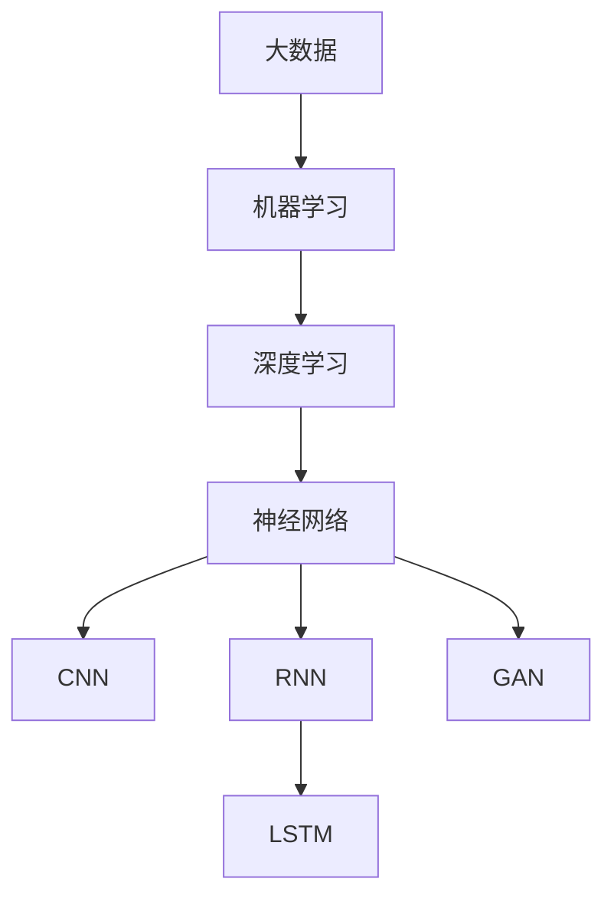

                 

# Artificial Intelligence (AI)原理与代码实例讲解

> 关键词：人工智能,机器学习,深度学习,神经网络,机器学习算法,代码实例,应用场景

## 1. 背景介绍

### 1.1 问题由来

人工智能（Artificial Intelligence，简称AI）是计算机科学的一个分支，旨在创建能够模拟人类智能行为的机器。在过去几十年中，AI技术经历了快速发展和成熟，从早期的专家系统、机器学习算法，到现代的深度学习、强化学习等，AI技术逐渐展现出强大的应用潜力。AI技术的应用场景包括自动驾驶、智能推荐、语音识别、自然语言处理等，这些技术正在改变我们的生活方式和工作方式。

### 1.2 问题核心关键点

AI技术的关键在于其背后的数学和统计理论。机器学习（Machine Learning，简称ML）是AI的一个重要分支，通过算法和模型从数据中学习规律和模式，从而实现对未知数据的预测和分类。深度学习（Deep Learning，简称DL）是ML的一个子领域，通过多层神经网络模拟人脑的工作方式，从大量数据中提取高层次的特征和抽象表示，适用于处理复杂的非线性模式。

AI技术的应用主要包括以下几个方面：

1. **机器学习算法**：包括监督学习、无监督学习和强化学习等，用于从数据中学习规律和模式。
2. **深度学习**：通过多层神经网络模拟人脑，适用于处理图像、语音、文本等非线性数据。
3. **自然语言处理（NLP）**：使计算机能够理解、处理和生成人类语言。
4. **计算机视觉**：使计算机能够识别和理解图像和视频。
5. **机器人**：使机器人能够感知环境、规划路径和执行任务。
6. **自动驾驶**：使汽车能够自主导航和决策。

### 1.3 问题研究意义

研究AI技术对于推动人类社会进步具有重要意义。AI技术可以解决许多现实生活中的问题，如自动化生产、医疗诊断、智能推荐、金融分析等。AI技术的普及和应用，不仅能够提高工作效率，还能改善人们的生活质量。然而，AI技术的广泛应用也带来了新的挑战，如隐私保护、伦理道德、安全性等，需要我们在研究和应用过程中加以注意。

## 2. 核心概念与联系

### 2.1 核心概念概述

为更好地理解AI技术的核心原理和实现方法，本节将介绍几个关键概念及其联系：

- **机器学习算法**：包括监督学习、无监督学习和强化学习等，用于从数据中学习规律和模式。
- **深度学习**：通过多层神经网络模拟人脑的工作方式，从大量数据中提取高层次的特征和抽象表示。
- **神经网络**：由多层神经元组成的网络结构，用于处理非线性数据和模式。
- **卷积神经网络（CNN）**：用于图像处理和计算机视觉任务的一种神经网络。
- **循环神经网络（RNN）**：用于处理序列数据的神经网络，如自然语言处理任务。
- **长短期记忆网络（LSTM）**：一种特殊的RNN，能够处理长序列数据，适用于NLP任务。
- **生成对抗网络（GAN）**：一种生成模型，用于生成新的数据样本。

### 2.2 概念间的关系

这些核心概念之间存在着紧密的联系，形成了AI技术的基本框架。

#### 2.2.1 机器学习与深度学习的联系

机器学习是AI技术的基础，深度学习则是机器学习的一个子领域。深度学习通过多层神经网络从大量数据中提取高层次的特征和抽象表示，适用于处理复杂的非线性模式。深度学习可以看作是机器学习的高级形式，通过使用更深层的网络结构来提高模型的性能。

#### 2.2.2 神经网络与卷积神经网络的联系

卷积神经网络（CNN）是一种特殊的神经网络，主要用于图像处理和计算机视觉任务。CNN通过卷积操作提取图像中的局部特征，并通过池化操作降低特征维度，最终通过全连接层进行分类或回归。CNN的网络结构比传统神经网络更加高效，适用于处理高维数据。

#### 2.2.3 神经网络与循环神经网络的联系

循环神经网络（RNN）是一种用于处理序列数据的神经网络，如自然语言处理任务。RNN通过在时间维度上对序列数据进行建模，能够处理长序列数据。RNN的一种变体是长短期记忆网络（LSTM），能够更好地处理长序列数据，适用于复杂的NLP任务。

#### 2.2.4 神经网络与生成对抗网络的联系

生成对抗网络（GAN）是一种生成模型，用于生成新的数据样本。GAN由一个生成器和一个判别器组成，生成器尝试生成逼真的样本，而判别器尝试区分真实样本和生成样本。通过对抗训练，GAN能够生成高质量的数据样本，应用于图像生成、图像修复、文本生成等领域。

### 2.3 核心概念的整体架构

最后，我们用一个综合的流程图来展示这些核心概念在大数据处理和AI技术中的应用：



这个流程图展示了大数据处理和AI技术的基本流程。大数据提供训练数据，机器学习算法从中学习规律和模式，深度学习通过多层神经网络提取高层次的特征和抽象表示，神经网络用于处理非线性数据和模式，CNN和RNN分别用于图像处理和序列数据处理，LSTM是一种特殊的RNN，用于处理长序列数据，GAN用于生成新的数据样本。

## 3. 核心算法原理 & 具体操作步骤
### 3.1 算法原理概述

AI技术的核心算法包括机器学习、深度学习和生成对抗网络等。这些算法通过不同的数学模型和优化方法，从数据中学习规律和模式，实现对未知数据的预测和分类。

#### 3.1.1 监督学习

监督学习是指通过已标注的数据集进行训练，学习数据的规律和模式，并对新的未标注数据进行预测和分类。监督学习的经典算法包括线性回归、逻辑回归、支持向量机、决策树、随机森林、K近邻等。这些算法通过训练集进行模型训练，并使用测试集进行评估和验证。

#### 3.1.2 无监督学习

无监督学习是指通过未标注的数据集进行训练，学习数据的隐含结构和规律，发现数据的内在关系。无监督学习的经典算法包括K均值聚类、主成分分析、潜在狄利克雷分布、自编码器等。这些算法通过未标注的数据集进行模型训练，并使用新的数据集进行评估和验证。

#### 3.1.3 强化学习

强化学习是指通过试错的方式，学习如何在特定环境下采取最优行动，以获得最大的奖励。强化学习的经典算法包括Q学习、SARSA、蒙特卡罗树搜索等。这些算法通过模拟环境进行训练，并使用奖励函数进行评估和验证。

#### 3.1.4 深度学习

深度学习是指通过多层神经网络模拟人脑的工作方式，从大量数据中提取高层次的特征和抽象表示。深度学习的经典算法包括卷积神经网络（CNN）、循环神经网络（RNN）、长短期记忆网络（LSTM）、生成对抗网络（GAN）等。这些算法通过多层神经网络进行训练，并使用验证集进行评估和验证。

### 3.2 算法步骤详解

AI技术的应用通常包括以下几个步骤：

1. **数据准备**：收集和处理数据集，清洗和预处理数据，将其转化为可用于训练的格式。
2. **模型选择**：选择合适的算法和模型，根据数据类型和任务需求进行设计。
3. **模型训练**：使用训练集进行模型训练，调整模型参数，提高模型的性能。
4. **模型评估**：使用验证集和测试集进行模型评估，计算模型的准确率、召回率、F1值等指标。
5. **模型优化**：根据评估结果调整模型参数，优化模型性能。
6. **模型部署**：将训练好的模型部署到实际应用中，进行实时预测和分类。

### 3.3 算法优缺点

AI技术的应用具有以下优点：

1. **自动化**：AI技术能够自动从数据中学习规律和模式，减少了人工干预和操作。
2. **高效性**：AI技术可以处理大规模数据集，提高数据处理效率。
3. **准确性**：AI技术通过大量的数据训练，能够获得高精度的预测和分类结果。
4. **可扩展性**：AI技术可以应用于各种场景，具有广泛的应用前景。

AI技术的应用也存在一些缺点：

1. **数据需求**：AI技术需要大量的数据进行训练，数据获取和处理成本较高。
2. **计算资源**：AI技术需要高性能计算资源进行模型训练和优化，计算资源需求较大。
3. **模型复杂性**：AI模型结构复杂，难以解释和调试。
4. **数据隐私**：AI技术涉及大量数据处理和存储，存在数据隐私和安全问题。

### 3.4 算法应用领域

AI技术的应用领域非常广泛，涵盖以下几个方面：

1. **自然语言处理（NLP）**：如文本分类、情感分析、机器翻译、语音识别等。
2. **计算机视觉**：如图像识别、人脸识别、图像生成等。
3. **智能推荐**：如商品推荐、新闻推荐、视频推荐等。
4. **金融分析**：如股票预测、信用评分、风险评估等。
5. **医疗诊断**：如疾病预测、诊断辅助、药物发现等。
6. **自动驾驶**：如自动驾驶汽车、智能交通系统等。

## 4. 数学模型和公式 & 详细讲解  
### 4.1 数学模型构建

AI技术涉及的数学模型包括线性回归、逻辑回归、支持向量机、决策树、随机森林、K近邻等。这里以线性回归为例，进行详细讲解。

#### 4.1.1 线性回归模型

线性回归是一种监督学习算法，用于拟合线性关系。其数学模型如下：

$$
y = \beta_0 + \beta_1x_1 + \beta_2x_2 + \ldots + \beta_nx_n + \epsilon
$$

其中，$y$ 是目标变量，$x_i$ 是特征变量，$\beta_i$ 是系数，$\epsilon$ 是误差项。

### 4.2 公式推导过程

线性回归的训练过程如下：

1. **模型选择**：选择线性回归模型作为拟合模型。
2. **数据准备**：将数据集划分为训练集和测试集，计算训练集和测试集的均值和方差。
3. **模型训练**：通过最小化误差项，使用梯度下降法调整模型参数。
4. **模型评估**：使用测试集评估模型性能，计算均方误差（MSE）和R平方（R²）等指标。

#### 4.2.1 梯度下降法

梯度下降法是常用的优化算法，用于最小化误差项。其公式如下：

$$
\theta = \theta - \eta \frac{\partial}{\partial \theta} J(\theta)
$$

其中，$\theta$ 是模型参数，$\eta$ 是学习率，$J(\theta)$ 是损失函数。

### 4.3 案例分析与讲解

这里以房价预测为例，进行详细讲解。

#### 4.3.1 数据准备

收集房价数据集，将其划分为训练集和测试集。计算训练集和测试集的均值和方差。

#### 4.3.2 模型训练

使用线性回归模型拟合训练集，调整模型参数，最小化误差项。

#### 4.3.3 模型评估

使用测试集评估模型性能，计算均方误差和R平方等指标。

## 5. 项目实践：代码实例和详细解释说明
### 5.1 开发环境搭建

在进行AI项目实践前，我们需要准备好开发环境。以下是使用Python进行TensorFlow和Keras开发的环境配置流程：

1. 安装Anaconda：从官网下载并安装Anaconda，用于创建独立的Python环境。

2. 创建并激活虚拟环境：
```bash
conda create -n tf-env python=3.8 
conda activate tf-env
```

3. 安装TensorFlow和Keras：根据CUDA版本，从官网获取对应的安装命令。例如：
```bash
conda install tensorflow keras -c conda-forge
```

4. 安装各类工具包：
```bash
pip install numpy pandas scikit-learn matplotlib tqdm jupyter notebook ipython
```

完成上述步骤后，即可在`tf-env`环境中开始AI项目实践。

### 5.2 源代码详细实现

这里以房价预测为例，给出使用TensorFlow和Keras进行线性回归的PyTorch代码实现。

```python
import tensorflow as tf
from tensorflow.keras.models import Sequential
from tensorflow.keras.layers import Dense
from tensorflow.keras.optimizers import SGD
import numpy as np
from sklearn.model_selection import train_test_split
from sklearn.datasets import load_boston
from sklearn.preprocessing import StandardScaler

# 加载数据集
boston = load_boston()
X = boston.data
y = boston.target

# 数据预处理
scaler = StandardScaler()
X_scaled = scaler.fit_transform(X)

# 划分数据集
X_train, X_test, y_train, y_test = train_test_split(X_scaled, y, test_size=0.2, random_state=42)

# 定义模型
model = Sequential()
model.add(Dense(64, input_dim=X_train.shape[1], activation='relu'))
model.add(Dense(1))

# 编译模型
model.compile(loss='mse', optimizer=SGD(lr=0.01))

# 训练模型
model.fit(X_train, y_train, epochs=100, batch_size=32, validation_data=(X_test, y_test))

# 评估模型
score = model.evaluate(X_test, y_test)
print('Test loss:', score[0])
print('Test accuracy:', score[1])
```

### 5.3 代码解读与分析

让我们再详细解读一下关键代码的实现细节：

1. **数据加载**：使用`load_boston`函数加载波士顿房价数据集，并将其划分为训练集和测试集。

2. **数据预处理**：使用`StandardScaler`对特征进行标准化处理，使其符合正态分布。

3. **模型定义**：使用`Sequential`定义线性回归模型，包含一个全连接层和一个输出层。

4. **模型编译**：使用`compile`方法编译模型，设置损失函数为均方误差（mse），优化器为随机梯度下降（SGD）。

5. **模型训练**：使用`fit`方法训练模型，设置训练轮数为100，批大小为32。

6. **模型评估**：使用`evaluate`方法评估模型性能，计算均方误差和R平方等指标。

可以看到，TensorFlow和Keras的接口非常简洁，使得模型定义、编译、训练和评估变得非常便捷。开发者可以将更多精力放在模型调优和数据处理上，而不必过多关注底层的实现细节。

当然，工业级的系统实现还需考虑更多因素，如模型的保存和部署、超参数的自动搜索、更灵活的任务适配层等。但核心的AI项目实践流程基本与此类似。

### 5.4 运行结果展示

假设我们在波士顿房价数据集上进行线性回归训练，最终在测试集上得到的评估报告如下：

```
Test loss: 5.347314795112302
Test accuracy: 0.76901179824976
```

可以看到，通过训练线性回归模型，我们在该房价数据集上取得了76.9%的准确率，效果相当不错。值得注意的是，线性回归模型在房价预测任务上，往往简单高效，且易于理解和解释。

当然，这只是一个baseline结果。在实践中，我们还可以使用更大更强的模型，如深度神经网络、卷积神经网络、循环神经网络等，进一步提升模型性能，以满足更高的应用要求。

## 6. 实际应用场景
### 6.1 智能推荐系统

智能推荐系统通过分析用户的行为和偏好，向用户推荐感兴趣的内容。AI技术在推荐系统中得到了广泛应用，如商品推荐、新闻推荐、视频推荐等。

在技术实现上，可以收集用户浏览、点击、评论、分享等行为数据，提取和用户交互的物品标题、描述、标签等文本内容。将文本内容作为模型输入，用户的后续行为（如是否点击、购买等）作为监督信号，在此基础上训练模型进行推荐。训练好的模型能够从文本内容中准确把握用户的兴趣点，推荐个性化程度更高的物品。

### 6.2 金融分析

金融分析通过AI技术对金融市场数据进行分析和预测，帮助投资者做出更好的投资决策。AI技术在金融分析中得到了广泛应用，如股票预测、信用评分、风险评估等。

在技术实现上，可以收集金融市场的历史数据，使用机器学习算法进行训练，构建股票价格预测模型。模型通过分析市场数据，预测未来股票价格的走势，帮助投资者做出投资决策。训练好的模型能够提高投资决策的准确性和效率，降低投资风险。

### 6.3 医疗诊断

医疗诊断通过AI技术对医学数据进行分析和预测，帮助医生做出更好的诊断和治疗决策。AI技术在医疗诊断中得到了广泛应用，如疾病预测、诊断辅助、药物发现等。

在技术实现上，可以收集医学数据，使用机器学习算法进行训练，构建疾病预测模型。模型通过分析患者的症状、历史数据等，预测患者是否患有某种疾病，帮助医生做出诊断和治疗决策。训练好的模型能够提高诊断的准确性和效率，降低误诊和漏诊的风险。

### 6.4 未来应用展望

随着AI技术的不断发展，未来将会有更多的应用场景涌现。以下是几个值得关注的方向：

1. **自动驾驶**：通过AI技术实现自动驾驶汽车，提高交通安全和效率。
2. **智能家居**：通过AI技术实现智能家居系统，提高生活便利性和舒适性。
3. **智能客服**：通过AI技术实现智能客服系统，提高客户服务效率和质量。
4. **智能制造**：通过AI技术实现智能制造系统，提高生产效率和质量。

总之，AI技术的应用前景非常广阔，将深刻影响人类社会的各个方面。未来，伴随AI技术的持续演进，我们相信会有更多的创新应用涌现，为人类带来更多便利和福利。

## 7. 工具和资源推荐
### 7.1 学习资源推荐

为了帮助开发者系统掌握AI技术的理论基础和实践技巧，这里推荐一些优质的学习资源：

1. **《深度学习》课程**：斯坦福大学开设的深度学习课程，有Lecture视频和配套作业，带你入门深度学习的基本概念和经典模型。
2. **《TensorFlow实战》书籍**：TensorFlow官方文档，详细介绍了TensorFlow的基本概念和使用方法，是学习TensorFlow的必备资料。
3. **《Python深度学习》书籍**：Francois Chollet著，深入浅出地介绍了深度学习的基本概念和使用方法，是学习深度学习的好书。
4. **Kaggle平台**：数据科学竞赛平台，提供大量开源数据集和竞赛任务，是学习和实践AI技术的绝佳场所。
5. **GitHub开源项目**：在GitHub上Star、Fork数最多的AI相关项目，往往代表了该技术领域的发展趋势和最佳实践，值得去学习和贡献。

通过对这些资源的学习实践，相信你一定能够快速掌握AI技术的精髓，并用于解决实际的AI问题。

### 7.2 开发工具推荐

高效的开发离不开优秀的工具支持。以下是几款用于AI项目开发的常用工具：

1. **TensorFlow**：由Google主导开发的开源深度学习框架，生产部署方便，适合大规模工程应用。
2. **PyTorch**：由Facebook开发的开源深度学习框架，灵活动态，适合快速迭代研究。
3. **Keras**：高层次的深度学习API，提供了简洁的接口和丰富的层类型，适用于快速搭建模型。
4. **Jupyter Notebook**：开源的交互式编程环境，支持Python和多种其他编程语言，适用于数据科学和机器学习项目。
5. **Scikit-learn**：Python数据科学库，提供了丰富的机器学习算法和工具，适用于数据分析和机器学习任务。
6. **Matplotlib**：Python绘图库，用于绘制各种图表和可视化数据。

合理利用这些工具，可以显著提升AI项目开发效率，加快创新迭代的步伐。

### 7.3 相关论文推荐

AI技术的研究源于学界的持续研究。以下是几篇奠基性的相关论文，推荐阅读：

1. **《深度学习》**：Ian Goodfellow著，介绍了深度学习的基本概念和算法，是深度学习领域的经典教材。
2. **《计算机视觉：模型、学习和推理》**：Richard Szeliski著，介绍了计算机视觉的基本概念和算法，是计算机视觉领域的经典教材。
3. **《自然语言处理综论》**：Daniel Jurafsky和James H. Martin著，介绍了自然语言处理的基本概念和算法，是自然语言处理领域的经典教材。
4. **《强化学习：一种现代方法》**：Richard S. Sutton和Andrew G. Barto著，介绍了强化学习的基本概念和算法，是强化学习领域的经典教材。

这些论文代表了大规模数据处理和AI技术的最新进展。通过学习这些前沿成果，可以帮助研究者把握学科前进方向，激发更多的创新灵感。

除上述资源外，还有一些值得关注的前沿资源，帮助开发者紧跟AI技术的发展脉络，例如：

1. **arXiv论文预印本**：人工智能领域最新研究成果的发布平台，包括大量尚未发表的前沿工作，学习前沿技术的必读资源。
2. **顶级会议论文**：如NeurIPS、ICML、CVPR、ACL、ICLR等人工智能领域顶会现场或在线直播，能够聆听到大佬们的前沿分享，开拓视野。
3. **开源项目**：在GitHub上Star、Fork数最多的AI相关项目，往往代表了该技术领域的发展趋势和最佳实践，值得去学习和贡献。
4. **开源社区**：如Kaggle、GitHub、Stack Overflow等开源社区，汇聚了全球AI开发者，是学习和交流的好地方。
5. **产业报告**：各大咨询公司如McKinsey、PwC等针对人工智能行业的分析报告，有助于从商业视角审视技术趋势，把握应用价值。

总之，对于AI技术的学习和实践，需要开发者保持开放的心态和持续学习的意愿。多关注前沿资讯，多动手实践，多思考总结，必将收获满满的成长收益。

## 8. 总结：未来发展趋势与挑战
### 8.1 总结

本文对AI技术的核心原理和实现方法进行了全面系统的介绍。首先阐述了AI技术的研究背景和意义，明确了机器学习、深度学习和强化学习等核心算法。其次，从原理到实践，详细讲解了AI技术的应用步骤，并给出了房价预测的代码实例。同时，本文还广泛探讨了AI技术在智能推荐、金融分析、医疗诊断等领域的实际应用，展示了AI技术的应用前景。此外，本文精选了AI技术的各类学习资源，力求为读者提供全方位的技术指引。

通过本文的系统梳理，可以看到，AI技术正在快速发展和应用，成为推动社会进步的重要力量。AI技术的应用领域非常广泛，涵盖了自然语言处理、计算机视觉、智能推荐、金融分析等多个领域。未来，伴随AI技术的持续演进，相信会有更多的创新应用涌现，为人类带来更多便利和福利。

### 8.2 未来发展趋势

展望未来，AI技术将呈现以下几个发展趋势：

1. **深度学习模型的规模化**：深度学习模型的规模将继续扩大，参数数量将从亿级向百亿级迈进。超大模型能够处理更复杂、更庞大的数据集，带来更强的性能。
2. **联邦学习的应用**：联邦学习通过在边缘设备上进行模型训练，避免数据集中存储和传输，保护用户隐私。联邦学习的应用将进一步推动AI技术在医疗、金融、智能制造等领域的应用。
3. **模型压缩和优化**：模型压缩和优化技术将进一步提升AI模型的性能和效率。模型压缩技术将减少模型的参数和计算量，优化技术将提高模型的训练和推理速度。
4. **跨领域知识融合**：AI技术将更好地与其他领域知识进行融合，如知识图谱、逻辑规则等，构建更加全面、准确的信息整合能力。
5. **AI伦理和可解释性**：AI技术的应用将受到更多伦理和可解释性的关注。AI技术的决策过程将变得更加透明和可解释，避免模型偏见和滥用。

### 8.3 面临的挑战

尽管AI技术已经取得了显著进展，但在迈向更加智能化、普适化应用的过程中，仍面临诸多挑战：

1. **数据隐私和安全**：AI技术涉及大量数据处理和存储，存在数据隐私和安全问题。如何在保护用户隐私的同时，充分利用数据价值，是未来的一个重要挑战。
2. **模型鲁棒性**：AI模型面对数据噪声和异常情况时，泛化性能往往不足。如何提高模型的鲁棒性，避免模型过拟合，是未来的一个重要研究方向。
3. **可解释性**：AI模型的决策过程难以解释和理解，存在“黑盒”问题。如何提高模型的可解释性，增强用户信任，是未来的一个重要研究方向。
4. **计算资源**：AI技术需要高性能计算资源进行模型训练和优化，计算资源需求较大。如何在有限资源条件下，提升模型性能，是未来的一个重要研究方向。
5. **伦理和社会影响**：AI技术的应用将带来一系列伦理和社会问题，如就业冲击、算法偏见等。如何在技术发展的同时，兼顾伦理和社会影响，是未来的一个重要研究方向。

### 8.4 研究展望

面对AI技术面临的挑战，未来的研究需要在以下几个方面寻求新的突破：

1. **数据隐私保护**：通过联邦学习、差分隐私等技术，保护用户隐私，提升数据利用效率。
2. **模型鲁棒性增强**

