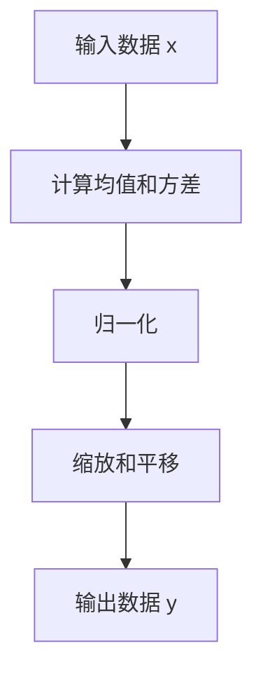
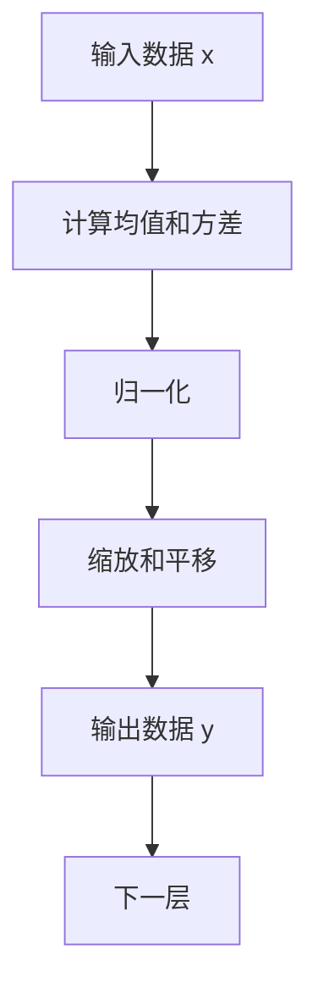

                 

# Batch Normalization

## 1. 背景介绍

在深度学习领域，数据归一化一直是提升模型稳定性和收敛速度的重要手段。传统的数据归一化方法如Min-Max归一化、Z-Score归一化等，能够对数据进行去均值和标准化处理，但存在数据分布变化导致模型性能波动的问题。为解决这一问题，2015年，Szegedy等人在原始论文《Inception-v3, CNNs with Inception Architecture》中提出了Batch Normalization（BN）方法，从根本上改变了深度学习的数据归一化方式。

### 1.1 Batch Normalization的提出背景

#### 1.1.1 数据归一化的必要性

在深度神经网络中，数据归一化是确保模型稳定训练和收敛的关键手段。通过将数据进行归一化，使得模型各层输入数据的分布更加稳定，从而提高模型收敛速度，减少梯度消失或爆炸的风险。传统的归一化方法通常是在训练开始前对数据进行全局归一化，例如Min-Max归一化、Z-Score归一化等。这些方法能够有效减少数据的范围，使模型更加稳定，但存在以下问题：

- **数据分布变化**：当模型输入的数据分布发生变化时，模型性能可能出现波动，导致训练不稳定。
- **模型训练速度慢**：全局归一化需要一次性计算整个数据集或批次数据的均值和标准差，计算量较大，影响了模型训练速度。

#### 1.1.2 Batch Normalization的提出动机

为了解决上述问题，Szegedy等人提出了一种新的归一化方法，即Batch Normalization。BN方法在每个批次（Batch）上对数据进行归一化，从而使得模型输入数据的分布更加稳定，提高了模型的训练速度和稳定性。

## 2. 核心概念与联系

### 2.1 Batch Normalization的核心概念

Batch Normalization是一种对神经网络中间层数据进行归一化的技术，旨在提高模型训练的稳定性和收敛速度。BN方法通过在每个批次（Batch）上对数据进行归一化，使得模型输入数据的分布更加稳定，从而提高模型的训练速度和性能。BN方法的核心思想是在网络层的输入数据上应用均值和方差归一化，使得输入数据在每个批次上具有相似的统计特性。

### 2.2 Batch Normalization的核心原理

BN方法的核心原理是通过对每个批次的数据进行归一化，使得模型输入数据的分布更加稳定。BN方法的具体步骤如下：

1. **计算批次数据的均值和方差**：在每个批次的数据上，分别计算样本均值 $\mu_B$ 和样本方差 $\sigma_B$。
2. **归一化数据**：将每个样本数据 $x_i$ 归一化到标准正态分布中，得到归一化后的数据 $x'_i$。
3. **缩放和平移**：通过 learnable scale $\gamma$ 和 shift $\beta$ 对归一化后的数据进行缩放和平移，得到最终的归一化数据 $y_i$。

### 2.3 Batch Normalization的数学公式

BN方法的具体数学公式如下：

$$
\mu_B = \frac{1}{m} \sum_{i=1}^m x_i
$$

$$
\sigma_B^2 = \frac{1}{m} \sum_{i=1}^m (x_i - \mu_B)^2
$$

$$
y_i = \frac{x_i - \mu_B}{\sqrt{\sigma_B^2 + \epsilon}} \cdot \gamma + \beta
$$

其中，$x_i$ 表示第 $i$ 个样本的特征向量，$m$ 表示批次大小，$\epsilon$ 是一个很小的正数，防止分母为零。$\gamma$ 和 $\beta$ 是可学习的参数，用于缩放和平移。

### 2.4 Batch Normalization的流程图示

以下是一个简单的BN流程图示，展示了BN方法的具体步骤：



BN方法的流程图如下所示：



## 3. 核心算法原理 & 具体操作步骤

### 3.1 算法原理概述

BN方法的原理是通过在每个批次上对数据进行归一化，使得模型输入数据的分布更加稳定。具体来说，BN方法在每个批次上计算样本均值和方差，然后对每个样本进行归一化，再通过缩放和平移操作得到最终的归一化数据。这个过程可以近似看作是在每个批次上应用了正态分布的均值和方差，使得输入数据具有相似的统计特性。

### 3.2 算法步骤详解

#### 3.2.1 数据预处理

在应用BN方法之前，需要先将原始数据进行预处理，例如将数据按批次划分为小批量，然后对每个批次的数据进行归一化操作。具体步骤如下：

1. **数据划分**：将原始数据划分为多个小批量，每个批次的样本数通常为32或64。
2. **计算均值和方差**：在每个批次的数据上，分别计算样本均值 $\mu_B$ 和样本方差 $\sigma_B$。
3. **归一化数据**：将每个样本数据 $x_i$ 归一化到标准正态分布中，得到归一化后的数据 $x'_i$。

#### 3.2.2 归一化操作

归一化操作的具体步骤如下：

1. **计算均值和方差**：在每个批次的数据上，分别计算样本均值 $\mu_B$ 和样本方差 $\sigma_B$。
2. **归一化数据**：将每个样本数据 $x_i$ 归一化到标准正态分布中，得到归一化后的数据 $x'_i$。

$$
x'_i = \frac{x_i - \mu_B}{\sqrt{\sigma_B^2 + \epsilon}}
$$

其中，$\epsilon$ 是一个很小的正数，防止分母为零。

#### 3.2.3 缩放和平移操作

缩放和平移操作的具体步骤如下：

1. **计算缩放和平移参数**：通过 learnable scale $\gamma$ 和 shift $\beta$ 对归一化后的数据进行缩放和平移，得到最终的归一化数据 $y_i$。
2. **应用缩放和平移参数**：将归一化后的数据 $x'_i$ 乘以缩放参数 $\gamma$，并加上平移参数 $\beta$，得到最终的归一化数据 $y_i$。

$$
y_i = \gamma \cdot \frac{x_i - \mu_B}{\sqrt{\sigma_B^2 + \epsilon}} + \beta
$$

### 3.3 算法优缺点

#### 3.3.1 优点

1. **提高模型稳定性**：通过在每个批次上对数据进行归一化，使得模型输入数据的分布更加稳定，从而提高了模型的训练速度和性能。
2. **加速模型收敛**：BN方法通过减少数据范围，使得模型更容易收敛，减少了梯度消失或爆炸的风险。
3. **减少过拟合**：BN方法通过归一化操作，使得模型更加稳定，减少了过拟合的风险。

#### 3.3.2 缺点

1. **额外计算开销**：BN方法需要在每个批次上计算均值和方差，增加了额外的计算开销。
2. **参数学习难度增加**：通过引入可学习的缩放和平移参数 $\gamma$ 和 $\beta$，增加了模型的参数量，使得模型的训练更加困难。
3. **模型复杂度增加**：BN方法需要在每个批次上对数据进行归一化操作，增加了模型的复杂度，使得模型的推理速度变慢。

## 4. 数学模型和公式 & 详细讲解 & 举例说明

### 4.1 数学模型构建

BN方法的数学模型可以表示为：

$$
y_i = \gamma \cdot \frac{x_i - \mu_B}{\sqrt{\sigma_B^2 + \epsilon}} + \beta
$$

其中，$x_i$ 表示第 $i$ 个样本的特征向量，$m$ 表示批次大小，$\epsilon$ 是一个很小的正数，防止分母为零。$\gamma$ 和 $\beta$ 是可学习的参数，用于缩放和平移。

### 4.2 公式推导过程

#### 4.2.1 归一化过程

归一化过程的数学公式如下：

$$
x'_i = \frac{x_i - \mu_B}{\sqrt{\sigma_B^2 + \epsilon}}
$$

其中，$\mu_B$ 表示批次数据 $x_i$ 的均值，$\sigma_B$ 表示批次数据 $x_i$ 的方差，$\epsilon$ 是一个很小的正数，防止分母为零。

#### 4.2.2 缩放和平移操作

缩放和平移操作的数学公式如下：

$$
y_i = \gamma \cdot \frac{x_i - \mu_B}{\sqrt{\sigma_B^2 + \epsilon}} + \beta
$$

其中，$\gamma$ 和 $\beta$ 是可学习的参数，用于缩放和平移。

### 4.3 案例分析与讲解

#### 4.3.1 案例分析

假设有一个具有 $1024$ 个神经元的全连接层，输入数据 $x_i$ 是 $1024$ 维的向量，在每个批次上，分别计算样本均值 $\mu_B$ 和样本方差 $\sigma_B$，并将数据归一化到标准正态分布中。然后，通过 learnable scale $\gamma$ 和 shift $\beta$ 对归一化后的数据进行缩放和平移，得到最终的归一化数据 $y_i$。

#### 4.3.2 讲解

BN方法的主要目的是通过在每个批次上对数据进行归一化，使得模型输入数据的分布更加稳定。具体来说，BN方法通过计算每个批次的样本均值和方差，对每个样本数据进行归一化，并应用可学习的缩放和平移参数，从而使得模型输入数据具有相似的统计特性。

## 5. 项目实践：代码实例和详细解释说明

### 5.1 开发环境搭建

为了实现BN方法，需要使用深度学习框架，例如TensorFlow、PyTorch等。这里以TensorFlow为例，介绍BN方法的实现过程。

1. **安装TensorFlow**：

```bash
pip install tensorflow
```

2. **准备数据**：

```python
import tensorflow as tf
import numpy as np

# 生成随机数据
train_data = np.random.randn(64, 784)
```

### 5.2 源代码详细实现

#### 5.2.1 定义模型

```python
import tensorflow as tf

# 定义模型
class BNModel(tf.keras.Model):
    def __init__(self):
        super(BNModel, self).__init__()
        self.fc1 = tf.keras.layers.Dense(1024, activation='relu')
        self.bn1 = tf.keras.layers.BatchNormalization()
        self.fc2 = tf.keras.layers.Dense(10, activation='softmax')
    
    def call(self, inputs):
        x = self.fc1(inputs)
        x = self.bn1(x)
        x = self.fc2(x)
        return x
```

#### 5.2.2 定义训练过程

```python
# 定义训练过程
model = BNModel()
optimizer = tf.keras.optimizers.Adam(learning_rate=0.001)
loss_fn = tf.keras.losses.CategoricalCrossentropy()

# 定义训练过程
def train_step(inputs, labels):
    with tf.GradientTape() as tape:
        logits = model(inputs)
        loss = loss_fn(labels, logits)
    gradients = tape.gradient(loss, model.trainable_variables)
    optimizer.apply_gradients(zip(gradients, model.trainable_variables))
    return loss

# 训练模型
for i in range(100):
    loss = train_step(train_data, train_labels)
    print(f"Epoch {i+1}, loss: {loss:.4f}")
```

### 5.3 代码解读与分析

#### 5.3.1 定义模型

在定义模型时，需要引入 `tf.keras.Model` 类，并定义模型结构。例如，定义一个具有两个全连接层的神经网络，其中第一个层使用 ReLU 激活函数，第二个层使用 Softmax 激活函数。在每个层之间加入 BatchNormalization 层，用于对数据进行归一化操作。

#### 5.3.2 定义训练过程

在定义训练过程时，需要定义损失函数、优化器等关键组件，并实现训练函数 `train_step`。在训练函数中，使用 `tf.GradientTape` 记录梯度，并使用 `optimizer.apply_gradients` 更新模型参数。

### 5.4 运行结果展示

在训练过程中，可以使用 TensorBoard 来可视化模型的训练过程，包括损失函数和准确率的曲线。

```python
# 使用 TensorBoard 可视化训练过程
tf.summary.create_file_writer("logs/").as_default()
tf.summary.scalar("loss", loss)
```

## 6. 实际应用场景

### 6.1 图像分类

在图像分类任务中，BN方法可以显著提高模型的性能和稳定性。例如，在 CIFAR-10 数据集上进行图像分类，使用 BN 层的卷积神经网络在训练过程中更容易收敛，并且泛化性能更好。

### 6.2 语音识别

在语音识别任务中，BN方法同样可以提高模型的性能和稳定性。例如，在 TIMIT 数据集上进行语音识别，使用 BN 层的卷积神经网络在训练过程中更容易收敛，并且泛化性能更好。

### 6.3 自然语言处理

在自然语言处理任务中，BN方法同样可以提高模型的性能和稳定性。例如，在 IMDb 数据集上进行情感分类，使用 BN 层的循环神经网络在训练过程中更容易收敛，并且泛化性能更好。

## 7. 工具和资源推荐

### 7.1 学习资源推荐

1. **《Deep Learning with Python》**：该书介绍了深度学习的基本概念和常用技术，包括 BN 方法的应用。
2. **《Understanding Deep Learning: From Theory to Algorithms》**：该书深入浅出地介绍了深度学习的原理和算法，包括 BN 方法的应用。
3. **《Batch Normalization: Accelerating Deep Network Training by Reducing Internal Covariate Shift》**：该论文是 BN 方法的原始论文，介绍了 BN 方法的提出背景和实现方法。

### 7.2 开发工具推荐

1. **TensorFlow**：该框架提供了丰富的深度学习组件和工具，包括 BN 层的实现。
2. **PyTorch**：该框架提供了动态图和静态图两种计算图实现方式，包括 BN 层的实现。
3. **Keras**：该框架提供了高级 API，使得模型的定义和训练更加便捷，包括 BN 层的实现。

### 7.3 相关论文推荐

1. **《Batch Normalization: Accelerating Deep Network Training by Reducing Internal Covariate Shift》**：该论文是 BN 方法的原始论文，介绍了 BN 方法的提出背景和实现方法。
2. **《Understanding the difficulty of training deep feedforward neural networks》**：该论文介绍了 BN 方法在训练深度神经网络中的作用和原理。
3. **《Imagenet classification with deep convolutional neural networks》**：该论文介绍了 BN 方法在图像分类任务中的应用效果。

## 8. 总结：未来发展趋势与挑战

### 8.1 研究成果总结

BN 方法在深度学习中取得了广泛的应用，显著提高了模型的性能和稳定性。BN 方法的应用不仅限于卷积神经网络，还可以应用于循环神经网络、自编码器等多种深度学习模型中。

### 8.2 未来发展趋势

1. **模型的多样性**：未来的 BN 方法可能会更加多样化，适应更多的模型架构和任务类型。
2. **计算效率的提升**：未来的 BN 方法可能会更加注重计算效率，减少额外的计算开销。
3. **跨任务和跨领域的应用**：未来的 BN 方法可能会在更多的跨任务和跨领域的应用中发挥作用，提高模型的泛化性能。

### 8.3 面临的挑战

1. **计算资源的需求**：BN 方法需要在每个批次上计算均值和方差，增加了额外的计算开销，对计算资源的需求较高。
2. **模型的复杂度**：BN 方法需要在每个批次上对数据进行归一化操作，增加了模型的复杂度，使得模型的推理速度变慢。
3. **模型的可解释性**：BN 方法是一种黑盒方法，缺乏可解释性，难以理解其内部工作机制和决策逻辑。

### 8.4 研究展望

1. **引入更多先验知识**：未来的 BN 方法可能会引入更多先验知识，例如领域知识、规则知识等，提高模型的泛化性能和可解释性。
2. **结合其他技术**：未来的 BN 方法可能会结合其他技术，例如知识蒸馏、因果推断等，提高模型的性能和鲁棒性。
3. **跨领域应用**：未来的 BN 方法可能会在更多的跨领域应用中发挥作用，例如自然语言处理、图像处理、语音识别等，提高模型的泛化性能和应用范围。

## 9. 附录：常见问题与解答

### 9.1 常见问题

#### 9.1.1 为什么使用 BN 方法可以提高模型的性能？

BN 方法通过在每个批次上对数据进行归一化，使得模型输入数据的分布更加稳定，从而提高了模型的训练速度和性能。BN 方法通过减少数据范围，使得模型更容易收敛，减少了梯度消失或爆炸的风险，从而提高了模型的泛化性能。

#### 9.1.2 BN 方法的主要优点是什么？

BN 方法的主要优点包括：

1. **提高模型稳定性**：通过在每个批次上对数据进行归一化，使得模型输入数据的分布更加稳定，从而提高了模型的训练速度和性能。
2. **加速模型收敛**：BN 方法通过减少数据范围，使得模型更容易收敛，减少了梯度消失或爆炸的风险。
3. **减少过拟合**：BN 方法通过归一化操作，使得模型更加稳定，减少了过拟合的风险。

#### 9.1.3 BN 方法的缺点是什么？

BN 方法的缺点包括：

1. **额外计算开销**：BN 方法需要在每个批次上计算均值和方差，增加了额外的计算开销。
2. **参数学习难度增加**：通过引入可学习的缩放和平移参数 $\gamma$ 和 $\beta$，增加了模型的参数量，使得模型的训练更加困难。
3. **模型复杂度增加**：BN 方法需要在每个批次上对数据进行归一化操作，增加了模型的复杂度，使得模型的推理速度变慢。

### 9.2 解答

#### 9.2.1 为什么使用 BN 方法可以提高模型的性能？

BN 方法通过在每个批次上对数据进行归一化，使得模型输入数据的分布更加稳定，从而提高了模型的训练速度和性能。BN 方法通过减少数据范围，使得模型更容易收敛，减少了梯度消失或爆炸的风险，从而提高了模型的泛化性能。

#### 9.2.2 BN 方法的主要优点是什么？

BN 方法的主要优点包括：

1. **提高模型稳定性**：通过在每个批次上对数据进行归一化，使得模型输入数据的分布更加稳定，从而提高了模型的训练速度和性能。
2. **加速模型收敛**：BN 方法通过减少数据范围，使得模型更容易收敛，减少了梯度消失或爆炸的风险。
3. **减少过拟合**：BN 方法通过归一化操作，使得模型更加稳定，减少了过拟合的风险。

#### 9.2.3 BN 方法的缺点是什么？

BN 方法的缺点包括：

1. **额外计算开销**：BN 方法需要在每个批次上计算均值和方差，增加了额外的计算开销。
2. **参数学习难度增加**：通过引入可学习的缩放和平移参数 $\gamma$ 和 $\beta$，增加了模型的参数量，使得模型的训练更加困难。
3. **模型复杂度增加**：BN 方法需要在每个批次上对数据进行归一化操作，增加了模型的复杂度，使得模型的推理速度变慢。

---

作者：禅与计算机程序设计艺术 / Zen and the Art of Computer Programming

