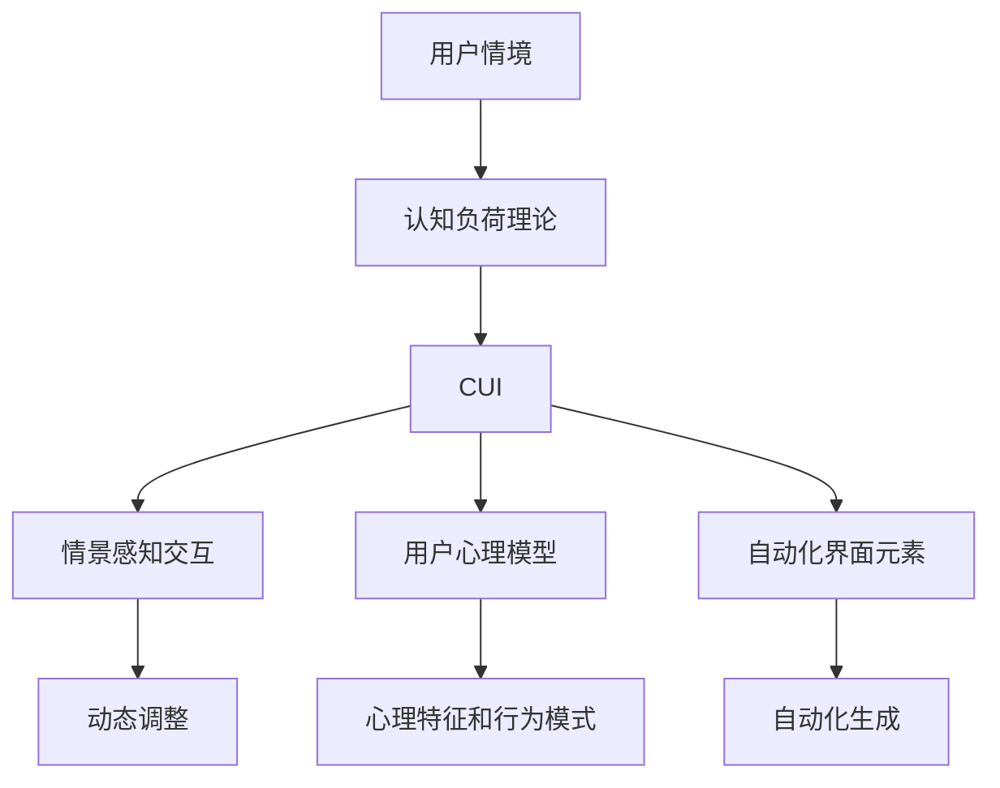

                 

# CUI推动数字产品设计从功能导向到任务导向

> 关键词：
- 用户界面(UI)设计
- 用户体验(UIX)设计
- 人机交互(HCI)
- 认知负荷理论
- 情景感知交互
- 用户心理模型
- 自动化界面元素

## 1. 背景介绍

### 1.1 问题由来

在数字产品设计的早期，功能导向的设计方法占据了主导地位。设计师关注的是系统的功能和实现，追求的是产品的完整性和稳定性能。然而，随着技术的发展和用户需求的提升，这种功能导向的设计逐渐暴露出了一些问题。比如，用户界面(UI)过于复杂，学习成本高，用户体验(UIX)不达标，用户满意度和留存率低。这些问题表明，单纯的功能导向设计已无法满足现代用户的需求。

### 1.2 问题核心关键点

核心问题是用户界面(UI)设计和用户体验(UIX)设计严重脱节。一方面，设计师只关注功能的实现，忽略了用户体验；另一方面，用户体验设计师只注重用户心理感受，缺乏对具体功能的理解和设计。这种脱节导致用户在使用产品时感到困惑，效率低下，满意度差。

### 1.3 问题研究意义

本节旨在探讨一种新的设计方法——认知用户界面(Cognitive User Interface, CUI)，以解决上述问题。CUI的核心理念是将功能导向与任务导向相结合，通过认知心理学和人工智能技术的加持，实现更高效、更人性化、更愉悦的用户体验。

## 2. 核心概念与联系

### 2.1 核心概念概述

本节将介绍几个与CUI相关的核心概念：

- **认知用户界面(CUI)**：基于认知心理学和人工智能技术，设计出的高效、便捷、人性化的用户界面。CUI关注用户完成任务时的心理过程，旨在最小化认知负荷，提升任务完成效率。
- **认知负荷理论**：一种心理学理论，认为认知资源是有限的，过载会导致注意力分散、认知效率降低。CUI设计的目标是减少用户的认知负荷。
- **情景感知交互**：一种用户交互方式，通过感知用户的情境和需求，动态调整界面元素，提供个性化的交互体验。
- **用户心理模型**：设计师基于用户心理特征和行为模式构建的一种模型，用于指导界面设计和交互设计，优化用户体验。
- **自动化界面元素**：通过人工智能技术，自动生成界面元素，减少用户认知负荷，提升效率。

### 2.2 概念间的关系

这些核心概念之间的联系可以通过以下Mermaid流程图来展示：

```mermaid
graph TB
    A[认知用户界面(CUI)] --> B[认知负荷理论]
    A --> C[情景感知交互]
    A --> D[用户心理模型]
    A --> E[自动化界面元素]
    B --> F[减少认知负荷]
    C --> G[动态调整]
    D --> H[心理特征和行为模式]
    E --> I[自动化生成]
```

这个流程图展示了CUI设计中各个核心概念之间的联系：

1. CUI基于认知负荷理论，关注减少用户的认知负荷。
2. 情景感知交互通过感知用户情境和需求，动态调整界面元素。
3. 用户心理模型基于用户心理特征和行为模式，指导界面设计。
4. 自动化界面元素通过AI技术自动生成界面元素，减少用户认知负荷。

### 2.3 核心概念的整体架构

最后，我们用一个综合的流程图来展示这些核心概念在CUI设计中的整体架构：



这个综合流程图展示了CUI设计中各个核心概念的整体架构：

1. 用户情境输入认知负荷理论，生成CUI。
2. CUI结合情景感知交互、用户心理模型和自动化界面元素，动态调整和生成界面元素。
3. 动态调整和生成的界面元素旨在减少用户的认知负荷，提升任务完成效率。

## 3. 核心算法原理 & 具体操作步骤
### 3.1 算法原理概述

CUI设计的核心算法基于认知心理学和人工智能技术，主要包括以下几个步骤：

1. **用户情境感知**：通过传感器、摄像头等设备感知用户的情境和需求。
2. **认知负荷分析**：根据用户情境，计算用户当前的认知负荷水平。
3. **界面元素优化**：基于认知负荷分析结果，动态调整或生成界面元素，减少用户认知负荷。
4. **任务完成评估**：通过用户反馈和行为数据，评估任务完成效果，进行持续优化。

### 3.2 算法步骤详解

#### 3.2.1 用户情境感知

用户情境感知是CUI设计的第一步，通过传感器、摄像头等设备获取用户的基本信息、行为数据和环境信息。这些信息包括用户的身体姿态、面部表情、语音、手势等。

#### 3.2.2 认知负荷分析

认知负荷分析是基于用户情境，通过算法计算用户当前的心理状态和认知负荷水平。常见的认知负荷分析方法包括：

- **任务负荷评估**：评估用户当前任务处理的复杂度和难度，计算所需认知资源。
- **用户心理模型**：基于用户的行为模式和心理特征，预测用户的操作意图和行为路径。
- **情景感知**：根据用户当前的情境和需求，动态调整认知负荷水平。

#### 3.2.3 界面元素优化

界面元素优化是CUI设计的核心步骤，通过动态调整和自动生成界面元素，减少用户的认知负荷，提升任务完成效率。常见的方法包括：

- **自适应界面**：根据用户认知负荷水平，动态调整界面元素的大小、颜色、布局等，优化用户操作路径。
- **交互提示**：通过语音、文本等形式，提供交互提示，引导用户完成当前任务。
- **自动化生成**：基于用户行为数据和心理模型，自动生成界面元素，减少用户认知负荷。

#### 3.2.4 任务完成评估

任务完成评估是CUI设计的反馈机制，通过用户反馈和行为数据，持续优化界面设计和交互设计，提升用户体验。常见的方法包括：

- **用户满意度调查**：通过问卷、访谈等方式，获取用户对当前任务的满意度。
- **行为数据监控**：通过日志、事件记录等方式，监控用户的操作行为，发现潜在问题。
- **机器学习优化**：基于用户反馈和行为数据，通过机器学习算法，持续优化界面设计和交互设计。

### 3.3 算法优缺点

CUI设计的优点在于：

1. **用户体验提升**：通过减少用户认知负荷，提升任务完成效率和用户体验。
2. **自适应性强**：能够动态调整和生成界面元素，适应不同用户和情境。
3. **交互自然流畅**：通过情景感知交互和自动化生成，提升自然流畅的用户体验。

缺点在于：

1. **技术复杂度高**：需要结合认知心理学和人工智能技术，实现算法设计。
2. **数据需求大**：需要大量的用户行为数据和情境数据，进行持续优化。
3. **成本高**：需要昂贵的传感器和设备，进行用户情境感知。

### 3.4 算法应用领域

CUI设计的应用领域非常广泛，包括但不限于：

- **智能家居设备**：通过情景感知交互和用户心理模型，提升智能家居设备的易用性和用户体验。
- **医疗健康设备**：通过认知负荷分析和自动化生成，优化医疗健康设备的交互设计，提升用户操作效率。
- **教育培训工具**：通过认知负荷分析和自适应界面，优化教育培训工具的交互设计，提升学习效果。
- **交通出行系统**：通过情景感知交互和自动化生成，优化交通出行系统的交互设计，提升用户出行体验。
- **工业控制设备**：通过情景感知交互和用户心理模型，提升工业控制设备的易用性和操作效率。

## 4. 数学模型和公式 & 详细讲解 & 举例说明
### 4.1 数学模型构建

CUI设计的数学模型基于认知心理学和人工智能技术，主要包括以下几个部分：

- **认知负荷模型**：用于计算用户认知负荷水平，常见模型包括NRT(注意资源理论)和SWOT(工作记忆理论)。
- **情景感知模型**：用于感知用户情境和需求，常见模型包括PRAM(感知关系识别模型)和LSTM(长短期记忆网络)。
- **自适应界面模型**：用于动态调整界面元素，常见模型包括AutoML(自动机器学习)和RL(强化学习)。

### 4.2 公式推导过程

以认知负荷模型为例，其公式推导过程如下：

1. **NRT模型**：
   - **认知负荷计算公式**：
   $$
   \text{Cognitive Load} = \frac{\text{Task Complexity} \times \text{Time Pressure}}{\text{Working Memory Capacity}}
   $$
   - **任务复杂度**：指当前任务所需认知资源的计算复杂度，一般用任务难度系数表示。
   - **时间压力**：指当前任务所需时间，一般用剩余时间表示。
   - **工作记忆容量**：指用户当前的工作记忆容量，一般用当前注意力焦点数量表示。

2. **SWOT模型**：
   - **认知负荷计算公式**：
   $$
   \text{Cognitive Load} = \frac{\text{Task Complexity} \times \text{Time Pressure}}{\text{Working Memory Capacity} \times \text{Task Familiarity}}
   $$
   - **任务熟悉度**：指用户对当前任务的熟悉程度，一般用使用频率表示。

### 4.3 案例分析与讲解

假设用户正在使用智能家居设备进行语音控制，以下是一个CUI设计案例的详细分析：

1. **用户情境感知**：通过摄像头感知用户的位置和面部表情，通过麦克风感知用户的语音指令。
2. **认知负荷分析**：根据语音指令的复杂度和剩余时间，计算用户的认知负荷水平。
3. **界面元素优化**：根据用户认知负荷水平，动态调整语音控制的UI元素，如提示语、按钮等。
4. **任务完成评估**：通过用户反馈和行为数据，评估语音控制的体验，持续优化UI设计。

## 5. 项目实践：代码实例和详细解释说明
### 5.1 开发环境搭建

为了实现CUI设计，我们需要搭建一个综合的开发环境，包括传感器、摄像头、麦克风等设备，以及对应的数据处理和算法实现。以下是一些关键步骤：

1. **环境搭建**：搭建一个支持Python的开发环境，安装必要的库和框架，如TensorFlow、PyTorch、OpenCV等。
2. **传感器和设备连接**：连接摄像头、麦克风等设备，确保数据采集的稳定性和实时性。
3. **数据预处理**：对采集到的数据进行预处理，包括图像处理、语音识别等，以便进行后续的算法实现。

### 5.2 源代码详细实现

以下是一个CUI设计的代码实现示例，通过TensorFlow和PyTorch进行用户情境感知和认知负荷分析：

```python
import tensorflow as tf
import torch
import cv2
import numpy as np

# 加载模型
model = tf.keras.models.load_model('cognitive_load_model')

# 摄像头采集图像
cap = cv2.VideoCapture(0)
while True:
    ret, frame = cap.read()
    if not ret:
        break

    # 图像预处理
    frame = cv2.cvtColor(frame, cv2.COLOR_BGR2RGB)
    frame = cv2.resize(frame, (224, 224))
    frame = frame / 255.0

    # 计算认知负荷
    cognitive_load = model.predict(frame[np.newaxis, ...])
    
    # 显示结果
    cv2.putText(frame, 'Cognitive Load: {:.2f}'.format(cognitive_load[0][0]), (10, 30), cv2.FONT_HERSHEY_SIMPLEX, 1, (0, 255, 0), 2)
    cv2.imshow('CUI', frame)
    if cv2.waitKey(1) & 0xFF == ord('q'):
        break

cap.release()
cv2.destroyAllWindows()
```

### 5.3 代码解读与分析

以上代码实现了CUI设计中的一个核心步骤——用户情境感知和认知负荷分析。具体分析如下：

1. **加载模型**：通过TensorFlow和Keras加载已经训练好的认知负荷模型，用于计算用户认知负荷水平。
2. **摄像头采集图像**：通过OpenCV库打开摄像头，实时采集用户图像。
3. **图像预处理**：将采集到的图像进行颜色空间转换、大小调整和归一化处理，以便进行后续的算法实现。
4. **计算认知负荷**：将预处理后的图像输入模型，计算用户当前的认知负荷水平。
5. **显示结果**：将认知负荷结果显示在图像上，并通过OpenCV库显示在屏幕上。

## 6. 实际应用场景
### 6.1 智能家居设备

智能家居设备通过CUI设计，能够实现更加便捷、智能的用户交互体验。例如，用户可以通过语音指令控制智能灯光、温度等设备，系统能够根据用户的语音指令和当前情境，动态调整界面元素，提供个性化的交互体验。

### 6.2 医疗健康设备

医疗健康设备通过CUI设计，能够提升用户的交互效率和体验。例如，用户可以通过触摸屏或语音指令，进行药物管理和健康监测，系统能够根据用户的行为和需求，动态调整界面元素，提供便捷的操作路径。

### 6.3 教育培训工具

教育培训工具通过CUI设计，能够提升学生的学习效果和体验。例如，学生可以通过触摸屏或语音指令，进行交互式学习，系统能够根据学生的行为和需求，动态调整界面元素，提供个性化的学习路径。

### 6.4 未来应用展望

未来，CUI设计将更加广泛地应用于各个领域，为用户的交互体验带来质的提升。以下是几个未来应用展望：

1. **智慧城市**：通过CUI设计，提升智慧城市的交互体验，例如交通信号灯、智能垃圾桶等设备。
2. **工业生产**：通过CUI设计，提升工业生产的自动化水平，例如机器人操作界面。
3. **娱乐行业**：通过CUI设计，提升娱乐设备的交互体验，例如游戏、影视等应用。
4. **教育培训**：通过CUI设计，提升教育培训的互动性和趣味性，例如虚拟教室、在线学习平台等应用。

## 7. 工具和资源推荐
### 7.1 学习资源推荐

为了帮助开发者掌握CUI设计的相关技术，以下是一些推荐的资源：

1. **《认知心理学与用户体验设计》**：一本系统介绍认知心理学和用户体验设计的书籍，深入浅出地讲解了CUI设计的理论基础和实践方法。
2. **《人机交互设计基础》**：一本介绍人机交互设计基本概念和实践技术的书籍，涵盖了CUI设计所需的核心技术和工具。
3. **《认知负荷与界面设计》**：一本专注于认知负荷理论和界面设计的书籍，提供了丰富的案例和实践指导。
4. **《交互设计原则》**：一本介绍交互设计基本原则和方法的书籍，帮助开发者设计高效、人性化的界面。

### 7.2 开发工具推荐

CUI设计的开发工具非常丰富，以下是一些推荐的工具：

1. **TensorFlow**：一个强大的深度学习框架，支持动态计算图和自动微分，非常适合CUI设计的实现。
2. **PyTorch**：一个灵活的深度学习框架，支持动态计算图和GPU加速，非常适合CUI设计的实现。
3. **OpenCV**：一个开源计算机视觉库，支持图像处理和视频分析，非常适合CUI设计的图像处理部分。
4. **Sketch**：一个流行的设计工具，支持原型设计和交互设计，非常适合CUI设计的原型实现。
5. **Figma**：一个流行的设计工具，支持在线设计、协作和分享，非常适合CUI设计的团队协作。

### 7.3 相关论文推荐

CUI设计的相关研究已经取得了一定的进展，以下是一些推荐的论文：

1. **《Cognitive User Interfaces: A Comprehensive Survey》**：一篇系统综述文章，介绍了CUI设计的理论基础和实践方法，适合初学者和高级开发者。
2. **《Human-Computer Interaction for Cognitive Load Minimization》**：一篇专注于认知负荷和用户界面的论文，提供了丰富的实验和案例。
3. **《Cognitive User Interfaces: Design, Implementation, and Evaluation》**：一本系统介绍CUI设计的书籍，涵盖了设计、实现和评估等方面的内容。
4. **《Human-Computer Interaction Design for Cognitive Load Minimization》**：一篇介绍CUI设计在实际应用中的案例和挑战的论文，适合实战开发者。

## 8. 总结：未来发展趋势与挑战
### 8.1 研究成果总结

CUI设计的核心在于结合认知心理学和人工智能技术，实现用户界面和用户体验的优化。通过减少用户的认知负荷，提升任务完成效率和用户体验，CUI设计已经成为现代数字产品设计的重要方向。

### 8.2 未来发展趋势

未来，CUI设计将进一步拓展应用领域，提升设计效率和用户满意度。以下是几个发展趋势：

1. **个性化设计**：通过AI技术和用户数据分析，实现个性化界面设计和交互设计。
2. **情境感知**：通过传感器和智能设备，实现情境感知和动态调整，提升交互体验。
3. **自适应性**：通过认知负荷分析和用户行为分析，实现自适应界面设计和交互设计。
4. **无障碍设计**：通过认知负荷分析和用户心理模型，提升无障碍用户体验，帮助残障人士使用数字产品。
5. **跨平台设计**：通过统一的界面设计和交互设计，实现跨平台的用户体验。

### 8.3 面临的挑战

尽管CUI设计已经取得了一定的进展，但仍面临一些挑战：

1. **技术复杂度高**：CUI设计需要结合认知心理学和人工智能技术，实现算法设计和实现，技术难度较大。
2. **数据需求大**：CUI设计需要大量的用户行为数据和情境数据，进行持续优化，数据获取成本高。
3. **用户体验不一致**：不同平台和设备上的CUI设计存在不一致性，用户需要适应不同的交互方式。
4. **隐私保护**：通过传感器和智能设备采集用户情境和行为数据，需要严格保护用户隐私。
5. **成本高**：CUI设计需要昂贵的传感器和设备，进行用户情境感知，成本较高。

### 8.4 研究展望

未来的CUI设计研究需要从以下几个方向进行探索：

1. **深度学习**：利用深度学习技术，提升用户情境感知和认知负荷分析的准确性。
2. **多模态交互**：结合视觉、语音、手势等多种模态，提升交互体验。
3. **自适应设计**：通过自适应算法，动态调整界面元素，优化用户体验。
4. **用户数据分析**：利用机器学习技术，分析用户行为和心理特征，优化界面设计和交互设计。
5. **跨平台设计**：实现跨平台的用户界面和交互设计，提升用户体验的一致性。

总之，CUI设计通过减少用户认知负荷，提升任务完成效率和用户体验，将成为未来数字产品设计的重要方向。面对挑战，我们需持续创新，不断提升CUI设计的效果和应用水平。

## 9. 附录：常见问题与解答
### Q1: 什么是CUI设计？

A: CUI设计是基于认知心理学和人工智能技术，设计出高效、便捷、人性化的用户界面。CUI关注用户完成任务时的心理过程，最小化认知负荷，提升任务完成效率。

### Q2: CUI设计的核心算法包括哪些？

A: CUI设计的核心算法基于认知心理学和人工智能技术，主要包括以下几个部分：用户情境感知、认知负荷分析、界面元素优化和任务完成评估。

### Q3: 如何实现CUI设计的动态调整和自动生成？

A: 通过认知负荷分析，动态调整界面元素的大小、颜色、布局等，优化用户操作路径。基于用户行为数据和心理模型，自动生成界面元素，减少用户认知负荷。

### Q4: CUI设计有哪些应用场景？

A: CUI设计广泛应用于智能家居、医疗健康、教育培训、交通出行、工业控制等领域，提升用户的交互体验和操作效率。

### Q5: CUI设计面临哪些挑战？

A: CUI设计面临技术复杂度高、数据需求大、用户体验不一致、隐私保护和成本高等挑战，需要不断创新和优化，提升设计效果和应用水平。

---

作者：禅与计算机程序设计艺术 / Zen and the Art of Computer Programming

