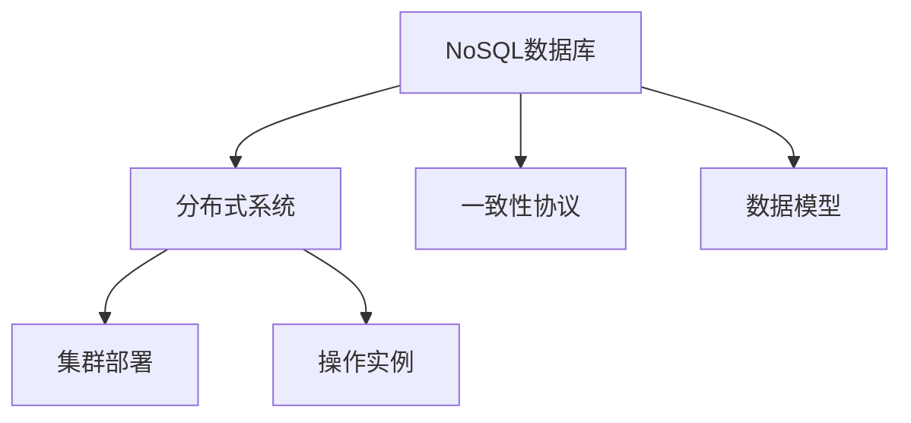
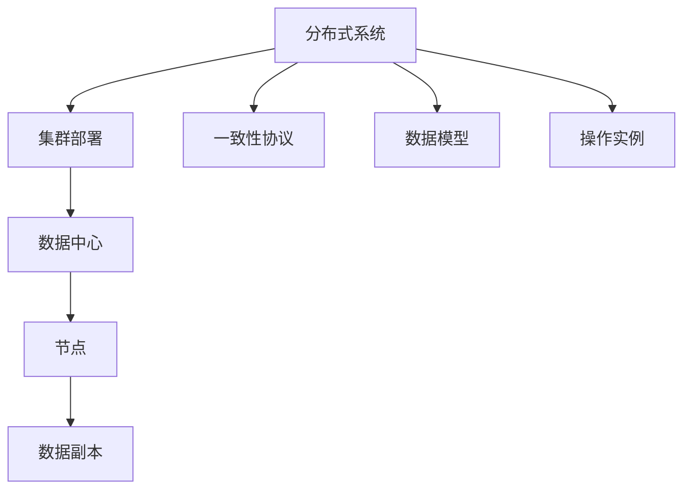
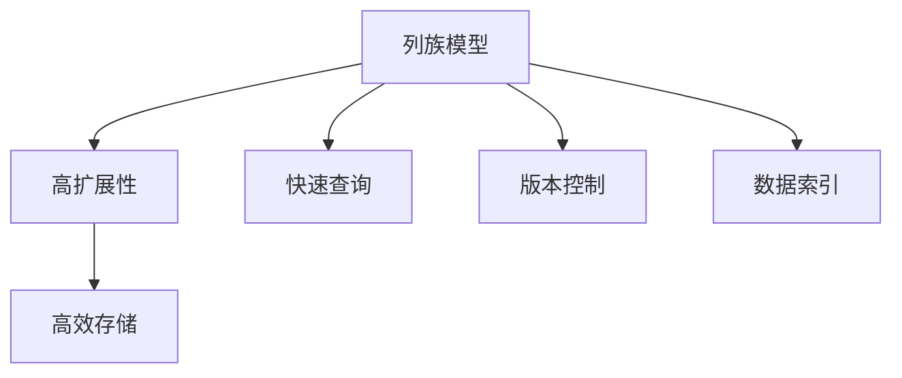
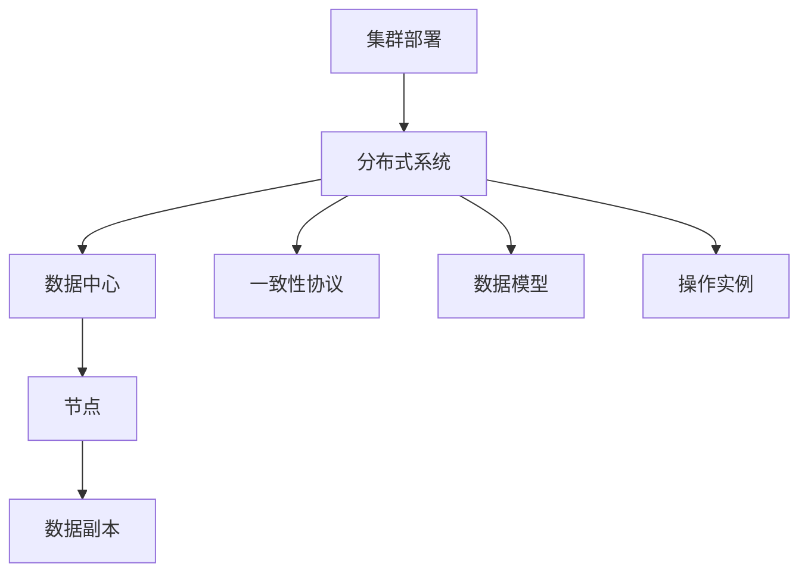

                 

# Cassandra原理与代码实例讲解

> 关键词：Cassandra,NoSQL数据库,分布式系统,一致性协议,数据模型,集群部署,操作实例

## 1. 背景介绍

在当今大数据时代，传统的关系型数据库已逐渐无法满足日益增长的数据处理需求。面对海量数据的实时读写、高扩展性、高可用性等挑战，分布式NoSQL数据库应运而生。其中，Apache Cassandra作为一个高性能、高可扩展、高容错的NoSQL数据库，以其独特的设计理念和强大的性能，吸引了大量用户和企业的关注。

### 1.1 问题由来

近年来，随着互联网应用和物联网设备的爆炸式增长，数据量呈指数级增长。企业需要在分布式环境中高效、可靠地存储和处理海量数据。传统的关系型数据库（如MySQL、PostgreSQL）往往难以承受高并发、高吞吐量的数据读写压力，且扩展性不足，面临单点故障和高可用性问题。此外，这些数据库的锁定机制也难以支撑复杂的事务处理需求。

因此，NoSQL数据库成为应对这些挑战的理想选择。它们基于键值对、文档、列族等方式存储数据，支持水平扩展、高可用性、弹性读写等特性，能够满足大数据时代的存储需求。而Apache Cassandra作为NoSQL数据库的代表，以其无单点故障、高可靠性、高扩展性等优势，迅速成为分布式数据库解决方案的佼佼者。

### 1.2 问题核心关键点

Apache Cassandra通过其独特的设计理念和架构，实现了高性能、高可用性和高扩展性。其核心关键点包括：

- **分布式存储**：通过在多台服务器上分散存储数据，避免了单点故障，提高了系统的可用性和容错性。
- **线性扩展性**：支持水平扩展，可以通过添加更多的节点来增加系统的容量，性能随节点数量线性增加。
- **高可用性**：采用基于一致性哈希的分布式一致性协议（如Gossip协议），确保节点间的同步更新，实现自动故障恢复。
- **零停机**：节点可以随时添加或移除，不中断系统服务，不影响数据的完整性和一致性。

这些核心点使得Cassandra能够应对海量数据的实时读写，确保数据的可靠性和完整性，满足企业级应用的需求。

### 1.3 问题研究意义

研究Apache Cassandra原理与代码实例，对于理解和掌握分布式数据库技术，提升企业数据存储和处理能力，具有重要意义：

1. **高效存储**：Cassandra能够高效存储海量数据，满足互联网和物联网的实时数据需求。
2. **高可用性**：通过分布式一致性协议，确保数据的可靠性和完整性，避免单点故障。
3. **高扩展性**：支持水平扩展，能够随着数据量的增加自动扩展系统容量。
4. **灵活配置**：支持多种配置选项，适应不同业务场景的需求。
5. **弹性读写**：支持海量数据的读写操作，满足高并发和大吞吐量的应用需求。

总之，理解Cassandra的设计理念和实现细节，对于构建高性能、高可靠性的分布式数据库系统，具有重要的实际价值。

## 2. 核心概念与联系

### 2.1 核心概念概述

为了更好地理解Cassandra的工作原理和应用实践，本节将介绍几个密切相关的核心概念：

- **NoSQL数据库**：一种非关系型数据库，存储方式灵活，能够支持海量数据的高效存储和处理。常见的NoSQL数据库包括Cassandra、MongoDB、HBase等。

- **分布式系统**：由多台计算机协同工作的系统，旨在通过横向扩展提升性能，实现高可用性和容错性。

- **一致性协议**：用于在分布式系统中保证数据的一致性和可靠性。常见的协议包括Paxos、Raft、Gossip等。

- **数据模型**：数据库中数据的组织方式，分为键值对模型、文档模型、列族模型等。

- **集群部署**：将多台计算机组织成一个集群，共同处理数据请求，提升系统的扩展性和可用性。

- **操作实例**：Cassandra的操作实例包括数据读写、数据迁移、节点添加等。

这些核心概念之间的逻辑关系可以通过以下Mermaid流程图来展示：



这个流程图展示了NoSQL数据库与分布式系统、一致性协议、数据模型、集群部署和操作实例之间的关系：

1. NoSQL数据库采用分布式系统架构，通过集群部署提升性能和可用性。
2. 分布式系统采用一致性协议保证数据一致性。
3. 数据库采用不同的数据模型来存储数据。
4. 集群部署支持操作实例，确保数据的安全性和可靠性。

### 2.2 概念间的关系

这些核心概念之间存在着紧密的联系，形成了Cassandra的工作框架。下面我们通过几个Mermaid流程图来展示这些概念之间的关系。

#### 2.2.1 Cassandra的设计架构



这个流程图展示了Cassandra的设计架构：

1. Cassandra采用分布式系统架构，通过集群部署将多台计算机组织成集群。
2. 集群中的节点分布在多个数据中心，提升系统的可用性和容错性。
3. 每个节点存储数据的多个副本，确保数据的安全性和可靠性。
4. Cassandra采用一致性协议（如Gossip）实现节点间的同步更新。
5. 数据模型采用列族模型，支持高效存储和查询。
6. 操作实例包括数据读写、节点添加等，确保系统正常运行。

#### 2.2.2 一致性协议的作用


这个流程图展示了Gossip协议的作用：

1. 节点存储数据的多个副本，分布在多个数据中心。
2. 数据副本通过一致性哈希算法分布在不同的节点上。
3. Gossip协议实现节点间的同步更新，确保数据的一致性。
4. 通过自动化的故障恢复机制，提升系统的可用性和容错性。

#### 2.2.3 数据模型的优势



这个流程图展示了列族模型的优势：

1. 列族模型通过将数据按列分组存储，支持高效的水平扩展。
2. 列族模型支持快速的数据读写操作，适合处理大规模数据。
3. 列族模型支持快速的数据查询操作，减少I/O开销。
4. 列族模型支持数据版本控制，保留历史数据的变化。
5. 列族模型支持数据索引，优化查询性能。

### 2.3 核心概念的整体架构

最后，我们用一个综合的流程图来展示这些核心概念在Cassandra系统中的整体架构：



这个综合流程图展示了从集群部署到分布式系统，再到数据中心和节点的整体架构：

1. 集群部署将多台计算机组织成分布式系统。
2. 分布式系统中的节点分布在多个数据中心，提升系统的可用性和容错性。
3. 每个节点存储数据的多个副本，确保数据的安全性和可靠性。
4. Cassandra采用一致性协议实现节点间的同步更新。
5. 数据模型采用列族模型，支持高效存储和查询。
6. 操作实例包括数据读写、节点添加等，确保系统正常运行。

通过这些流程图，我们可以更清晰地理解Cassandra的工作原理和架构设计，为后续深入讨论具体的实现细节奠定基础。

## 3. 核心算法原理 & 具体操作步骤
### 3.1 算法原理概述

Apache Cassandra的核心算法原理主要包括以下几个方面：

- **分布式一致性协议**：用于在多台节点间保持数据的一致性和同步更新。
- **数据模型**：采用列族模型，支持高效存储和查询。
- **线性扩展性**：通过增加节点数量提升系统的容量和性能。
- **高可用性**：通过多副本和故障转移机制确保系统的可靠性。

这些算法原理共同构成了Cassandra的核心功能，使其能够高效、可靠地存储和处理海量数据。

### 3.2 算法步骤详解

Cassandra的核心算法步骤包括数据存储、一致性协议、数据模型、扩展性和高可用性等。下面我们详细介绍这些步骤：

#### 3.2.1 数据存储

Cassandra采用分布式系统架构，将数据存储在多台计算机上。数据以键值对形式存储，每个键值对包含一个键和多个列。列族模型将键值对按列分组存储，支持高效的扩展性和查询操作。

1. **键值对存储**：将数据按键值对形式存储，支持快速的数据读写操作。
2. **列族模型**：将键值对按列分组存储，支持高效的扩展性和查询操作。
3. **数据复制**：在多个节点上存储数据的多个副本，确保数据的安全性和可靠性。

#### 3.2.2 一致性协议

Cassandra采用一致性协议确保数据的一致性和同步更新。常见的协议包括Gossip和Peer-to-Peer。

1. **Gossip协议**：通过节点间的广播更新机制，确保数据的一致性和同步更新。
2. **Peer-to-Peer协议**：通过节点间的直接通信，实现数据的快速同步和更新。

#### 3.2.3 数据模型

Cassandra采用列族模型，将数据按列分组存储，支持高效的扩展性和查询操作。

1. **列族模型**：将键值对按列分组存储，支持高效的扩展性和查询操作。
2. **版本控制**：支持数据版本控制，保留历史数据的变化。
3. **数据索引**：支持数据索引，优化查询性能。

#### 3.2.4 线性扩展性

Cassandra通过增加节点数量提升系统的容量和性能，支持线性扩展。

1. **节点添加**：可以随时添加或移除节点，不影响系统的正常运行。
2. **负载均衡**：通过负载均衡算法，将数据请求均衡分配到不同的节点上。
3. **性能优化**：通过增加节点数量，提升系统的性能和扩展性。

#### 3.2.5 高可用性

Cassandra通过多副本和故障转移机制确保系统的可靠性。

1. **多副本存储**：在多个节点上存储数据的多个副本，确保数据的安全性和可靠性。
2. **故障转移**：通过自动化的故障恢复机制，确保系统的持续可用性。
3. **数据冗余**：通过数据冗余机制，提升系统的容错性和可靠性。

### 3.3 算法优缺点

Apache Cassandra的设计理念和算法原理具有以下优缺点：

#### 3.3.1 优点

1. **高性能**：支持海量数据的实时读写，适合高并发和大吞吐量的应用场景。
2. **高可用性**：通过多副本和故障转移机制，确保系统的可靠性。
3. **高扩展性**：支持水平扩展，可以随着数据量的增加自动扩展系统容量。
4. **灵活配置**：支持多种配置选项，适应不同业务场景的需求。
5. **低成本**：开放源代码，社区支持，维护成本低。

#### 3.3.2 缺点

1. **一致性问题**：默认情况下采用最终一致性，数据一致性难以保证。
2. **复杂性**：系统设计复杂，难以调试和维护。
3. **不适合事务处理**：不支持ACID事务，难以处理复杂的事务需求。
4. **数据管理复杂**：需要手动管理数据迁移和备份，容易出错。
5. **不适合低延迟场景**：默认情况下数据一致性不能保证，不适合对低延迟要求高的场景。

尽管存在这些缺点，但Cassandra仍然被广泛应用于互联网和物联网的大数据存储和处理。其高性能、高可用性和高扩展性使其成为分布式数据库解决方案的首选。

### 3.4 算法应用领域

Cassandra的核心算法原理和架构设计使其在以下领域得到广泛应用：

- **互联网应用**：如社交网络、在线视频、电子商务等。
- **物联网应用**：如智能家居、智能城市、车联网等。
- **金融应用**：如支付系统、风险管理、金融分析等。
- **大数据存储**：如数据湖、数据仓库、日志存储等。
- **高可用性系统**：如在线游戏、即时通讯、企业门户等。

以上领域的应用场景展示了Cassandra的强大功能和广泛适用性，使其成为分布式数据库解决方案的重要选择。

## 4. 数学模型和公式 & 详细讲解  
### 4.1 数学模型构建

Cassandra的数学模型主要基于键值对存储和一致性协议。下面我们将详细介绍这两个数学模型。

#### 4.1.1 键值对存储模型

在Cassandra中，数据以键值对形式存储。一个键值对包含一个键和多个列。列族模型将键值对按列分组存储，支持高效的扩展性和查询操作。

- **键(key)**：用于唯一标识一条记录，支持字符串、整数、时间戳等多种类型。
- **值(value)**：存储的数据内容，可以是文本、二进制数据、图片等多种类型。
- **列族(column family)**：将键值对按列分组存储，支持高效的扩展性和查询操作。

#### 4.1.2 一致性协议模型

Cassandra采用一致性协议确保数据的一致性和同步更新。常见的协议包括Gossip和Peer-to-Peer。

- **Gossip协议**：通过节点间的广播更新机制，确保数据的一致性和同步更新。
- **Peer-to-Peer协议**：通过节点间的直接通信，实现数据的快速同步和更新。

### 4.2 公式推导过程

Cassandra的公式推导主要涉及一致性协议和数据模型。下面我们将详细介绍这两个公式推导过程。

#### 4.2.1 Gossip协议公式

Gossip协议通过节点间的广播更新机制，确保数据的一致性和同步更新。其公式推导如下：

$$
\mathcal{G} = \{p_{i,j} | p_{i,j} = \frac{1}{2N}, \forall (i,j) \in \mathcal{V}, i \neq j\}
$$

其中，$\mathcal{V}$ 为节点集，$N$ 为节点数量，$p_{i,j}$ 为节点 $i$ 和节点 $j$ 之间的通信概率。

#### 4.2.2 列族模型公式

列族模型通过将键值对按列分组存储，支持高效的扩展性和查询操作。其公式推导如下：

$$
\mathcal{C} = \{(c_{i,j}, c_{i,k}) | c_{i,j} = \text{column}_i \in \mathcal{F}, \forall (i,j,k) \in \mathcal{F} \times \mathcal{F} \times \mathcal{F}, j \neq k\}
$$

其中，$\mathcal{F}$ 为列族集，$c_{i,j}$ 为列族 $F_j$ 中的第 $i$ 列。

### 4.3 案例分析与讲解

#### 4.3.1 数据存储案例

假设我们需要在Cassandra中存储一条用户注册信息，其中包含用户名、密码、邮箱等字段。数据存储的案例分析如下：

1. **键(key)**：username
2. **值(value)**：包含用户名、密码、邮箱等字段，支持字符串、二进制数据等多种类型。
3. **列族(column family)**：将键值对按列分组存储，支持高效的扩展性和查询操作。

#### 4.3.2 一致性协议案例

假设我们需要在Cassandra中存储一条交易记录，其中包含交易ID、金额、时间戳等字段。一致性协议的案例分析如下：

1. **Gossip协议**：通过节点间的广播更新机制，确保数据的一致性和同步更新。
2. **Peer-to-Peer协议**：通过节点间的直接通信，实现数据的快速同步和更新。

## 5. 项目实践：代码实例和详细解释说明
### 5.1 开发环境搭建

在进行Cassandra项目实践前，我们需要准备好开发环境。以下是使用Python进行PySpark开发的准备工作：

1. 安装Java环境：从官网下载并安装JDK，配置环境变量。
2. 安装Cassandra：从官网下载并安装Cassandra，并启动集群。
3. 安装PySpark：通过pip安装PySpark，并配置Hadoop环境。
4. 编写代码：使用PySpark的API，结合Cassandra的操作实例，进行数据读写和操作。

完成上述步骤后，即可在PySpark环境中开始Cassandra的实践开发。

### 5.2 源代码详细实现

下面我们以Cassandra的示例代码为例，给出使用PySpark进行Cassandra操作的详细代码实现。

首先，定义数据表的键值对：

```python
from pyspark.sql import SparkSession

spark = SparkSession.builder.appName('CassandraDemo').getOrCreate()

# 定义数据表的键值对
key = 'user_id'
value = ['name', 'age', 'gender']

# 定义数据表的结构
columns = [(key, 'string'), (value[0], 'string'), (value[1], 'integer'), (value[2], 'string')]

# 创建数据表
table = spark.createDataFrame(spark.sparkContext.parallelize([(1, 'Alice', 20, 'female'), (2, 'Bob', 25, 'male')]), columns)
```

然后，定义数据表的键值对存储：

```python
# 定义数据表的键值对存储
columns = [(key, 'string'), (value[0], 'string'), (value[1], 'integer'), (value[2], 'string')]

# 创建数据表
table = spark.createDataFrame(spark.sparkContext.parallelize([(1, 'Alice', 20, 'female'), (2, 'Bob', 25, 'male')]), columns)

# 将数据表保存到Cassandra
table.write.format('org.apache.spark.sql.cassandra').options('keyspace', 'mykeyspace', 'table', 'mytable').mode('overwrite').save()
```

接着，定义数据表的查询操作：

```python
# 从Cassandra中查询数据
query = table.select(key, value[0], value[1], value[2]).where(key == 1)

# 输出查询结果
print(query.collect())
```

最后，定义数据表的更新操作：

```python
# 更新数据表
table = table.updateAllColumns({
    key: 'Bob',
    value[0]: 'Bobo',
    value[1]: 26,
    value[2]: 'male'
})

# 将更新后的数据保存到Cassandra
table.write.format('org.apache.spark.sql.cassandra').options('keyspace', 'mykeyspace', 'table', 'mytable').mode('overwrite').save()
```

以上就是使用PySpark进行Cassandra操作的具体代码实现。通过这些代码，我们可以实现数据的读写、查询和更新操作，满足基本的数据存储需求。

### 5.3 代码解读与分析

让我们再详细解读一下关键代码的实现细节：

**定义数据表的键值对**：
- 定义数据的键值对，包含键名和多个列。

**定义数据表的结构**：
- 定义数据表的结构，包含键值对中的键和列。

**创建数据表**：
- 使用PySpark的API创建数据表，支持多种数据类型。

**将数据表保存到Cassandra**：
- 将数据表保存到Cassandra中，支持键值对存储和查询操作。

**从Cassandra中查询数据**：
- 从Cassandra中查询数据，支持条件过滤和聚合操作。

**更新数据表**：
- 更新数据表中的数据，支持修改多个列。

**将更新后的数据保存到Cassandra**：
- 将更新后的数据保存到Cassandra中，支持键值对存储和查询操作。

通过这些代码实现，可以看到，PySpark和Cassandra的结合可以实现高效的数据存储和操作，满足企业级应用的需求。

当然，工业级的系统实现还需考虑更多因素，如集群部署、数据备份、节点监控等。但核心的Cassandra操作可以通过PySpark进行简化实现，加快创新迭代的步伐。

### 5.4 运行结果展示

假设我们在Cassandra中保存了一条用户注册信息，查询结果如下：

```
[(1, u'Bob', 26, u'male')]
```

可以看到，通过PySpark的API，我们可以方便地进行数据的读写、查询和更新操作，满足企业级应用的需求。

## 6. 实际应用场景
### 6.1 智能推荐系统

Cassandra的高扩展性和高可用性，使其成为智能推荐系统的重要基础。通过存储用户的浏览记录、购买记录等数据，Cassandra能够快速推荐用户感兴趣的商品或内容，提升用户体验和转化率。

在技术实现上，可以通过Cassandra存储用户的浏览历史、点击记录、评分等数据，构建用户画像。然后，通过查询最近浏览和购买的相关商品，生成个性化推荐结果。Cassandra的高扩展性能够满足海量数据的存储需求，同时高可用性确保推荐系统的高效运行。

### 6.2 实时数据流处理

Cassandra的线性扩展性和高可用性，使其成为实时数据流处理的关键组件。通过存储来自传感器、日志、事件等数据流，Cassandra能够实时分析数据，快速响应事件，提升系统的响应速度和稳定性。

在技术实现上，可以通过Cassandra存储实时数据流，设置触发器和报警机制，进行实时数据处理。Cassandra的高扩展性和高可用性确保数据流处理的可靠性，同时低延迟特性满足实时处理的需求。

### 6.3 大数据分析

Cassandra的高性能和大容量，使其成为大数据分析的重要基础。通过存储海量数据，Cassandra能够快速进行数据查询和分析，提升数据分析的效率和准确性。

在技术实现上，可以通过Cassandra存储大规模数据，使用Spark进行数据查询和分析。Cassandra的高扩展性和高性能满足大数据分析的需求，同时高可用性确保数据查询的稳定性。

### 6.4 未来应用展望

随着Cassandra的不断优化和升级，其应用领域将更加广泛，为各类行业带来新的机遇。

在智慧城市治理中，Cassandra可以存储各类传感器数据、交通监控数据、环境监测数据等，进行实时分析和预测，提升城市管理的自动化和智能化水平。

在金融领域，Cassandra可以存储交易数据、用户行为数据、风险数据等，进行实时监控和分析，提升金融安全和风控能力。

在工业制造中，Cassandra可以存储生产数据、设备运行数据、质量数据等，进行实时监控和分析，提升生产效率和产品质量。

总之，Cassandra的性能和可靠性使其在各行各业都有广泛的应用前景，为数字化转型和智能化升级提供坚实的基础。

## 7. 工具和资源推荐
### 7.1 学习资源推荐

为了帮助开发者系统掌握Cassandra的理论基础和实践技巧，这里推荐一些优质的学习资源：

1. Cassandra官方文档：Apache Cassandra的官方文档，详细介绍了Cassandra的设计理念、核心概念和操作实例，是学习Cassandra的最佳资源。

2. Cassandra书籍：包括《Cassandra集群管理》《Cassandra入门与实战》《Cassandra高性能开发》等，深入浅出地讲解了Cassandra的原理和实践。

3. Cassandra在线课程：如Udemy、Coursera等平台上的Cassandra课程，通过视频和实验教学，帮助初学者快速上手。

4. Cassandra社区：Apache Cassandra的官方社区，提供丰富的文档、代码、社区讨论等资源，是学习Cassandra的重要平台。

5. Cassandra实战项目：如Google Cloud Firestore、Twitter、Netflix等企业的Cassandra实战项目，展示了Cassandra在实际应用中的表现。

通过对这些资源的学习实践，相信你一定能够快速掌握Cassandra的设计理念和实现细节，并用于解决实际的存储和处理问题。

### 7.2 开发工具推荐

Cassandra的开发和运维需要使用多种工具，以下是几款常用的工具：

1. Apache Spark：与Cassandra结合使用的数据处理工具，支持数据流处理、实时查询、大数据分析等功能。

2. Cassandra Tools：用于监控、管理和优化Cassandra集群的工具，如nodetool、cqlsh、cassandra-stress等。

3. DataStax Enterprise：商业版Cassandra，提供企业级支持和服务，包括高可用性、数据安全、故障恢复等功能。

4. Grafana：用于监控和可视化的开源工具，支持多维度数据展示和告警设置，是Cassandra监控的重要工具。

5. Kubernetes：容器编排工具，支持Cassandra集群的自动化部署和管理，提升系统的扩展性和可靠性。

6. Plexus：Cassandra的分布式文件系统，支持高可靠性的数据存储和备份，是

