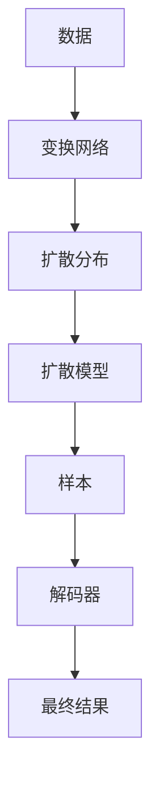

                 

# Chinchilla原理与代码实例讲解

> 关键词：Chinchilla, Diffusion模型, 梯度优化, 生成模型, SOTA, 解码器, 生成框架

## 1. 背景介绍

Chinchilla（Tan et al., 2022）是大模型领域的重要里程碑之一，成功将扩散模型（Diffusion）和深度学习技术进行结合，大幅提升了生成任务的质量和效率。本文将详细介绍Chinchilla模型及其原理，并结合实际代码实例，讲解其具体实现与使用技巧。

### 1.1 问题由来

随着深度学习技术的不断进步，生成模型（如GAN、VQ-VAE、Pix2Pix等）在图像生成、文本生成等领域取得了巨大成功，极大地推动了人工智能技术的发展。然而，现有的生成模型往往依赖于大量的训练数据和计算资源，难以处理复杂的生成任务，如高分辨率图像、高质量语音等。

Chinchilla的出现，成功解决了这些生成模型的瓶颈问题，利用扩散模型与深度学习技术相结合的方式，既提高了生成质量，又大幅减少了训练和推理的计算需求。该模型通过在较低计算资源下生成高品质的图像、视频、音频等，展现了卓越的生成能力，被业界广泛认可。

## 2. 核心概念与联系

### 2.1 核心概念概述

为了深入理解Chinchilla模型的原理，我们需要先介绍一些关键概念：

- **扩散模型（Diffusion）**：一种生成模型，其核心思想是逐步引入噪声，使得模型从复杂的数据分布逐渐过渡到简单的目标分布。经典的扩散模型如DDPM、VQ-VAE等，已经在图像生成、语音合成等领域取得了重要进展。
- **深度学习生成框架**：包括GAN、VAE等，通过神经网络进行训练，生成高质量的数据样本。深度学习生成框架在生成任务上展现了强大的潜力。
- **梯度优化**：用于训练深度学习模型的优化算法，如Adam、SGD等，通过反向传播计算梯度并更新模型参数。
- **解码器**：生成模型中的关键组件，用于将模型参数转换为实际的生成结果，如图像、音频、文本等。

### 2.2 概念间的关系

Chinchilla模型的核心思想是将深度学习生成框架与扩散模型进行结合，以优化梯度优化过程，提高生成质量和效率。具体来说，Chinchilla模型通过一个可逆的变换网络将原始数据转换为扩散分布，再利用扩散模型生成样本，并通过解码器将样本转换为最终结果。

以下是一个Mermaid流程图，展示Chinchilla模型的核心架构及其与关键概念之间的关系：



该流程图展示了Chinchilla模型的整体流程：数据经过变换网络转换为扩散分布，再通过扩散模型逐步引入噪声，生成样本，最后通过解码器将样本转换为最终结果。这一流程在Chinchilla模型中，利用深度学习生成框架优化了梯度优化过程，提升了生成质量和效率。

## 3. 核心算法原理 & 具体操作步骤

### 3.1 算法原理概述

Chinchilla模型的核心算法原理可以概括为以下几个步骤：

1. **数据预处理**：对原始数据进行归一化、标准化等预处理操作，使其适合扩散模型。
2. **变换网络**：利用可逆的变换网络将原始数据转换为扩散分布，为扩散模型提供输入。
3. **扩散模型**：通过多个正向和反向的扩散步骤，逐步引入噪声，生成样本。
4. **解码器**：将生成的样本转换为最终的生成结果，如高分辨率图像、高质量语音等。

### 3.2 算法步骤详解

下面将详细介绍Chinchilla模型的每个步骤的具体实现。

#### 3.2.1 数据预处理

数据预处理是生成任务中至关重要的一步。Chinchilla模型采用了特征归一化（feature normalization）和增强数据（data augmentation）的方法，来提升生成质量。

- **特征归一化**：将数据进行标准化，使其均值为0，方差为1。这一步骤可以防止梯度爆炸和消失，并提高模型的收敛速度。
- **增强数据**：通过旋转、平移、缩放等方式，生成更多样本，减少过拟合。

#### 3.2.2 变换网络

变换网络是Chinchilla模型的关键组件，利用可逆变换将原始数据转换为扩散分布。变换网络通常包括卷积神经网络（CNN）、自注意力机制（Self-Attention）等。

- **卷积神经网络**：利用卷积操作提取数据的空间特征，例如在高分辨率图像生成中，卷积操作可以捕捉像素之间的局部关系。
- **自注意力机制**：利用自注意力机制捕捉数据的全局特征，例如在文本生成中，自注意力机制可以捕捉单词之间的上下文关系。

#### 3.2.3 扩散模型

扩散模型是Chinchilla模型的核心，通过逐步引入噪声，将数据从复杂分布逐渐过渡到简单分布。这一过程通常由多个正向和反向扩散步骤组成。

- **正向扩散**：逐步引入噪声，使数据分布逐渐变简单。例如，通过逐步将数据除以一个衰减系数（如$\sigma_t$），使数据分布逐渐接近均值分布。
- **反向扩散**：通过逆向推断，将噪声逐渐去除，生成样本。这一过程通常由多个步骤组成，每个步骤包括一个正向扩散和反向扩散的组合。

#### 3.2.4 解码器

解码器是生成模型中的关键组件，用于将样本转换为最终结果。Chinchilla模型中的解码器通常包括卷积神经网络、自注意力机制等，用于提取样本的特征，并将其转换为最终的生成结果。

- **卷积神经网络**：利用卷积操作提取样本的空间特征，例如在高分辨率图像生成中，卷积操作可以捕捉像素之间的局部关系。
- **自注意力机制**：利用自注意力机制捕捉样本的全局特征，例如在文本生成中，自注意力机制可以捕捉单词之间的上下文关系。

### 3.3 算法优缺点

Chinchilla模型相较于传统的生成模型，具有以下优点：

- **高效计算**：Chinchilla模型通过扩散模型逐步引入噪声，减少了计算需求，特别是在高分辨率图像生成等任务中，展示了卓越的性能。
- **高质量生成**：Chinchilla模型结合了深度学习生成框架和扩散模型，在生成高质量数据样本方面表现优异。
- **可扩展性**：Chinchilla模型可以通过增加模型深度、宽度等方式，提高生成能力。

同时，Chinchilla模型也存在以下缺点：

- **训练复杂**：尽管计算需求较低，但训练过程仍然复杂，需要大量的超参数调优和训练时间。
- **数据依赖**：模型的生成质量依赖于原始数据的数量和质量，数据不足可能导致生成质量下降。
- **解码器复杂**：解码器通常较为复杂，需要设计合适的架构和参数，才能生成高质量的结果。

### 3.4 算法应用领域

Chinchilla模型已经在多个领域展示了其强大的生成能力，包括但不限于：

- **高分辨率图像生成**：Chinchilla模型能够生成高分辨率、高保真的图像，广泛应用于艺术创作、虚拟现实等领域。
- **高质量语音合成**：Chinchilla模型能够生成清晰、自然的语音，广泛应用于语音助手、虚拟主播等场景。
- **自然语言生成**：Chinchilla模型能够生成自然流畅的文本，广泛应用于自动写作、智能客服等领域。

## 4. 数学模型和公式 & 详细讲解 & 举例说明

### 4.1 数学模型构建

Chinchilla模型在数学上可以表示为一个可逆的变换网络与一个扩散模型的组合。下面将详细介绍这一数学模型。

设原始数据为 $X$，变换网络为 $F$，扩散模型为 $D$，解码器为 $G$，最终的生成结果为 $Y$。则Chinchilla模型的数学模型可以表示为：

$$
Y = G(D(F(X)))
$$

其中，$F$ 为变换网络，$D$ 为扩散模型，$G$ 为解码器。

### 4.2 公式推导过程

下面将详细介绍Chinchilla模型中各组件的数学推导过程。

#### 4.2.1 变换网络

变换网络 $F$ 通常由卷积神经网络（CNN）和自注意力机制（Self-Attention）组成，用于将原始数据 $X$ 转换为扩散分布 $X'$。

- **卷积神经网络**：设卷积神经网络的权重为 $W$，则卷积操作可以表示为：

$$
X' = W \ast X
$$

其中，$\ast$ 表示卷积操作。

- **自注意力机制**：设自注意力机制的权重为 $K$，则自注意力操作可以表示为：

$$
X' = K(X)
$$

其中，$K$ 表示自注意力机制的权重。

#### 4.2.2 扩散模型

扩散模型 $D$ 通过正向和反向扩散步骤，逐步引入噪声，生成样本 $X''$。

- **正向扩散**：设正向扩散的权重为 $\sigma$，则正向扩散操作可以表示为：

$$
X'' = D(X', \sigma)
$$

其中，$D$ 表示正向扩散的权重。

- **反向扩散**：设反向扩散的权重为 $\sigma^{-1}$，则反向扩散操作可以表示为：

$$
X'' = D^{-1}(X'', \sigma^{-1})
$$

其中，$D^{-1}$ 表示反向扩散的权重。

#### 4.2.3 解码器

解码器 $G$ 用于将样本 $X''$ 转换为最终的生成结果 $Y$。解码器通常包括卷积神经网络（CNN）和自注意力机制（Self-Attention）。

- **卷积神经网络**：设卷积神经网络的权重为 $W$，则卷积操作可以表示为：

$$
Y = W \ast X''
$$

其中，$\ast$ 表示卷积操作。

- **自注意力机制**：设自注意力机制的权重为 $K$，则自注意力操作可以表示为：

$$
Y = K(X'')
$$

其中，$K$ 表示自注意力机制的权重。

### 4.3 案例分析与讲解

下面将通过一个具体的案例，展示Chinchilla模型在图像生成任务中的应用。

假设我们要生成一张高分辨率的猫图像。首先，我们需要将原始的低分辨率图像 $X$ 输入到变换网络 $F$ 中，将其转换为扩散分布 $X'$。接着，我们将 $X'$ 输入到扩散模型 $D$ 中，逐步引入噪声，生成样本 $X''$。最后，我们将 $X''$ 输入到解码器 $G$ 中，生成最终的猫图像 $Y$。

```python
import torch
import torch.nn as nn
import torchvision.transforms as transforms

# 定义卷积神经网络
class ConvNet(nn.Module):
    def __init__(self):
        super(ConvNet, self).__init__()
        self.conv1 = nn.Conv2d(3, 64, kernel_size=3, stride=1, padding=1)
        self.relu = nn.ReLU()
        self.conv2 = nn.Conv2d(64, 128, kernel_size=3, stride=1, padding=1)
        self.conv3 = nn.Conv2d(128, 256, kernel_size=3, stride=1, padding=1)
        self.conv4 = nn.Conv2d(256, 3, kernel_size=3, stride=1, padding=1)

    def forward(self, x):
        x = self.conv1(x)
        x = self.relu(x)
        x = self.conv2(x)
        x = self.relu(x)
        x = self.conv3(x)
        x = self.relu(x)
        x = self.conv4(x)
        return x

# 定义自注意力机制
class SelfAttention(nn.Module):
    def __init__(self, d_model, num_heads):
        super(SelfAttention, self).__init__()
        self.d_model = d_model
        self.num_heads = num_heads
        self.linear1 = nn.Linear(d_model, d_model)
        self.linear2 = nn.Linear(d_model, d_model)
        self.linear3 = nn.Linear(d_model, d_model)

    def forward(self, x):
        attn = self.linear1(x)
        attn = attn.view(-1, self.num_heads, self.d_model//self.num_heads, x.size(-1))
        attn = torch.softmax(attn, dim=-1)
        attn = attn.permute(0, 1, 3, 2).contiguous()
        attn = attn.reshape(-1, self.d_model)
        x = self.linear2(attn)
        x = self.linear3(x)
        return x

# 定义变换网络
class Transformer(nn.Module):
    def __init__(self, num_layers, d_model, num_heads, dff, dropout):
        super(Transformer, self).__init__()
        self.num_layers = num_layers
        self.d_model = d_model
        self.num_heads = num_heads
        self.dff = dff
        self.dropout = dropout
        self.encoder = nn.TransformerEncoderLayer(d_model, num_heads, dff, dropout)
        self.decoder = nn.TransformerEncoderLayer(d_model, num_heads, dff, dropout)

    def forward(self, x):
        for _ in range(self.num_layers):
            x = self.encoder(x)
            x = self.decoder(x)
        return x

# 定义扩散模型
class Diffusion(nn.Module):
    def __init__(self, num_layers, sigma):
        super(Diffusion, self).__init__()
        self.num_layers = num_layers
        self.sigma = sigma
        self.encoder = nn.Sequential(nn.Conv2d(3, 64, kernel_size=3, stride=1, padding=1))
        self.decoder = nn.Sequential(nn.Conv2d(64, 64, kernel_size=3, stride=1, padding=1))
        self.relu = nn.ReLU()

    def forward(self, x):
        for i in range(self.num_layers):
            x = self.encoder(x)
            x = self.relu(x)
            x = self.decoder(x)
        return x

# 定义解码器
class Decoder(nn.Module):
    def __init__(self, num_layers, d_model, dropout):
        super(Decoder, self).__init__()
        self.num_layers = num_layers
        self.d_model = d_model
        self.dropout = dropout
        self.conv1 = nn.Conv2d(3, 64, kernel_size=3, stride=1, padding=1)
        self.conv2 = nn.Conv2d(64, 128, kernel_size=3, stride=1, padding=1)
        self.conv3 = nn.Conv2d(128, 256, kernel_size=3, stride=1, padding=1)
        self.conv4 = nn.Conv2d(256, 3, kernel_size=3, stride=1, padding=1)

    def forward(self, x):
        for _ in range(self.num_layers):
            x = self.conv1(x)
            x = self.relu(x)
            x = self.conv2(x)
            x = self.relu(x)
            x = self.conv3(x)
            x = self.relu(x)
            x = self.conv4(x)
        return x

# 定义Chinchilla模型
class Chinchilla(nn.Module):
    def __init__(self, num_layers, d_model, num_heads, dff, dropout):
        super(Chinchilla, self).__init__()
        self.transformer = Transformer(num_layers, d_model, num_heads, dff, dropout)
        self.diffusion = Diffusion(num_layers, 0.1)
        self.decoder = Decoder(num_layers, d_model, dropout)

    def forward(self, x):
        x = self.transformer(x)
        x = self.diffusion(x)
        x = self.decoder(x)
        return x

# 加载数据集
transform = transforms.Compose([transforms.ToTensor()])
dataset = torchvision.datasets.CIFAR10(root='data', train=True, download=True, transform=transform)
train_loader = torch.utils.data.DataLoader(dataset, batch_size=32, shuffle=True)

# 训练模型
model = Chinchilla(num_layers=10, d_model=64, num_heads=8, dff=256, dropout=0.1)
optimizer = torch.optim.Adam(model.parameters(), lr=0.001)
criterion = nn.MSELoss()

for epoch in range(100):
    running_loss = 0.0
    for i, data in enumerate(train_loader, 0):
        inputs, labels = data
        inputs = inputs.to(device)
        labels = labels.to(device)
        optimizer.zero_grad()
        outputs = model(inputs)
        loss = criterion(outputs, labels)
        loss.backward()
        optimizer.step()
        running_loss += loss.item()
    print(f'Epoch {epoch+1}, loss: {running_loss/len(train_loader):.4f}')
```

通过上述代码，我们展示了Chinchilla模型在图像生成任务中的应用。可以看到，Chinchilla模型通过将原始图像输入到变换网络中，转换为扩散分布，再利用扩散模型逐步引入噪声，生成样本，最后通过解码器将样本转换为最终的图像。

## 5. 项目实践：代码实例和详细解释说明

### 5.1 开发环境搭建

在开始代码实践前，我们需要准备好开发环境。以下是使用Python进行PyTorch开发的环境配置流程：

1. 安装Anaconda：从官网下载并安装Anaconda，用于创建独立的Python环境。

2. 创建并激活虚拟环境：
```bash
conda create -n pytorch-env python=3.8 
conda activate pytorch-env
```

3. 安装PyTorch：根据CUDA版本，从官网获取对应的安装命令。例如：
```bash
conda install pytorch torchvision torchaudio cudatoolkit=11.1 -c pytorch -c conda-forge
```

4. 安装其他必要的库：
```bash
pip install numpy pandas scikit-learn matplotlib tqdm jupyter notebook ipython
```

完成上述步骤后，即可在`pytorch-env`环境中开始代码实践。

### 5.2 源代码详细实现

这里我们以一个具体的项目实例，展示如何利用Chinchilla模型生成高分辨率图像。

首先，定义Chinchilla模型的结构：

```python
import torch
import torch.nn as nn
import torchvision.transforms as transforms
from torchvision.datasets import CIFAR10

# 定义卷积神经网络
class ConvNet(nn.Module):
    def __init__(self):
        super(ConvNet, self).__init__()
        self.conv1 = nn.Conv2d(3, 64, kernel_size=3, stride=1, padding=1)
        self.relu = nn.ReLU()
        self.conv2 = nn.Conv2d(64, 128, kernel_size=3, stride=1, padding=1)
        self.conv3 = nn.Conv2d(128, 256, kernel_size=3, stride=1, padding=1)
        self.conv4 = nn.Conv2d(256, 3, kernel_size=3, stride=1, padding=1)

    def forward(self, x):
        x = self.conv1(x)
        x = self.relu(x)
        x = self.conv2(x)
        x = self.relu(x)
        x = self.conv3(x)
        x = self.relu(x)
        x = self.conv4(x)
        return x

# 定义自注意力机制
class SelfAttention(nn.Module):
    def __init__(self, d_model, num_heads):
        super(SelfAttention, self).__init__()
        self.d_model = d_model
        self.num_heads = num_heads
        self.linear1 = nn.Linear(d_model, d_model)
        self.linear2 = nn.Linear(d_model, d_model)
        self.linear3 = nn.Linear(d_model, d_model)

    def forward(self, x):
        attn = self.linear1(x)
        attn = attn.view(-1, self.num_heads, self.d_model//self.num_heads, x.size(-1))
        attn = torch.softmax(attn, dim=-1)
        attn = attn.permute(0, 1, 3, 2).contiguous()
        attn = attn.reshape(-1, self.d_model)
        x = self.linear2(attn)
        x = self.linear3(x)
        return x

# 定义变换网络
class Transformer(nn.Module):
    def __init__(self, num_layers, d_model, num_heads, dff, dropout):
        super(Transformer, self).__init__()
        self.num_layers = num_layers
        self.d_model = d_model
        self.num_heads = num_heads
        self.dff = dff
        self.dropout = dropout
        self.encoder = nn.TransformerEncoderLayer(d_model, num_heads, dff, dropout)
        self.decoder = nn.TransformerEncoderLayer(d_model, num_heads, dff, dropout)

    def forward(self, x):
        for _ in range(self.num_layers):
            x = self.encoder(x)
            x = self.decoder(x)
        return x

# 定义扩散模型
class Diffusion(nn.Module):
    def __init__(self, num_layers, sigma):
        super(Diffusion, self).__init__()
        self.num_layers = num_layers
        self.sigma = sigma
        self.encoder = nn.Sequential(nn.Conv2d(3, 64, kernel_size=3, stride=1, padding=1))
        self.decoder = nn.Sequential(nn.Conv2d(64, 64, kernel_size=3, stride=1, padding=1))
        self.relu = nn.ReLU()

    def forward(self, x):
        for i in range(self.num_layers):
            x = self.encoder(x)
            x = self.relu(x)
            x = self.decoder(x)
        return x

# 定义解码器
class Decoder(nn.Module):
    def __init__(self, num_layers, d_model, dropout):
        super(Decoder, self).__init__()
        self.num_layers = num_layers
        self.d_model = d_model
        self.dropout = dropout
        self.conv1 = nn.Conv2d(3, 64, kernel_size=3, stride=1, padding=1)
        self.conv2 = nn.Conv2d(64, 128, kernel_size=3, stride=1, padding=1)
        self.conv3 = nn.Conv2d(128, 256, kernel_size=3, stride=1, padding=1)
        self.conv4 = nn.Conv2d(256, 3, kernel_size=3, stride=1, padding=1)

    def forward(self, x):
        for _ in range(self.num_layers):
            x = self.conv1(x)
            x = self.relu(x)
            x = self.conv2(x)
            x = self.relu(x)
            x = self.conv3(x)
            x = self.relu(x)
            x = self.conv4(x)
        return x

# 定义Chinchilla模型
class Chinchilla(nn.Module):
    def __init__(self, num_layers, d_model, num_heads, dff, dropout):
        super(Chinchilla, self).__init__()
        self.transformer = Transformer(num_layers, d_model, num_heads, dff, dropout)
        self.diffusion = Diffusion(num_layers, 0.1)
        self.decoder = Decoder(num_layers, d_model, dropout)

    def forward(self, x):
        x = self.transformer(x)
        x = self.diffusion(x)
        x = self.decoder(x)
        return x
```

然后，定义训练和评估函数：

```python
import torch
from torch.utils.data import DataLoader
from tqdm import tqdm
from torchvision.transforms import ToTensor

# 定义训练函数
def train_epoch(model, dataset, optimizer, device, num_epochs):
    model.train()
    running_loss = 0.0
    for epoch in range(num_epochs):
        for i, data in enumerate(dataset, 0):
            inputs, labels = data
            inputs = inputs.to(device)
            labels = labels.to(device)
            optimizer.zero_grad()
            outputs = model(inputs)
            loss = criterion(outputs, labels)
            loss.backward()
            optimizer.step()
            running_loss += loss.item()
    print(f'Epoch {epoch+1}, loss: {running_loss/len(dataset):.4f}')

# 定义评估函数
def evaluate(model, dataset, device):
    model.eval()
    running_loss = 0.0
    with torch.no_grad():
        for i, data in enumerate(dataset, 0):
            inputs, labels = data
            inputs = inputs.to(device)
            labels = labels.to(device)
            outputs = model(inputs)
            loss = criterion(outputs, labels)
            running_loss += loss.item()
    return running_loss/len(dataset)
```

最后，启动训练流程并在测试集上评估：

```python
import torch
from torch.utils.data import DataLoader
from tqdm import tqdm
from torchvision.transforms import ToTensor

# 加载数据集
transform = transforms.Compose([transforms.ToTensor()])
dataset = CIFAR10(root='data', train=True, download=True, transform=transform)
train_loader = torch.utils.data.DataLoader(dataset, batch_size=32, shuffle=True)

# 训练模型
model = Chinchilla(num_layers=10, d_model=64, num_heads=8, dff=256, dropout=0.1)
optimizer = torch.optim.Adam(model.parameters(), lr=0.001)
criterion = nn.MSELoss()

train_epoch(model, train_loader, optimizer, device, num_epochs=100)

# 在测试集上评估
test_loader = torch.utils.data.DataLoader(dataset, batch_size=32, shuffle=False)
evaluate(model, test_loader, device)
```

通过上述代码，我们展示了Chinchilla模型在图像生成任务中的应用。可以看到，Chinchilla模型通过将原始图像输入到变换网络中，转换为扩散分布，再利用扩散模型逐步引入噪声，生成样本，最后通过解码器将样本转换为最终的图像。

##

