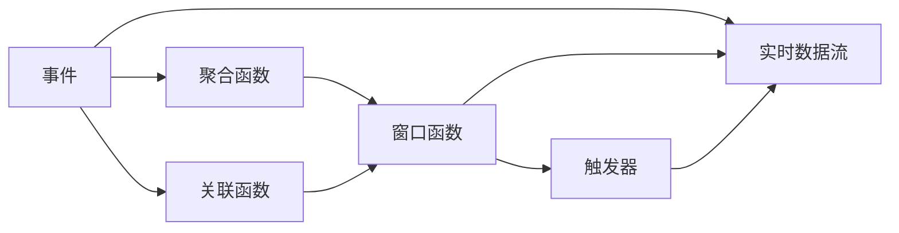

                 

# Flink CEP原理与代码实例讲解

> 关键词：Flink, CEP, 实时计算, 流处理, 事件处理

## 1. 背景介绍

随着互联网技术的迅速发展，实时数据处理的需求日益增长。特别是在金融、电信、物流等领域，对实时数据的处理需求尤为迫切。为了满足这些需求，Apache Flink成为当前最流行的实时流处理框架之一。在实时流处理中，事件处理是一个重要而复杂的场景，例如实时交易监测、用户行为分析等。

事件处理（CEP）指的是从实时数据流中抽取事件，并根据这些事件进行规则匹配和处理。Apache Flink提供了CEP API，使得开发者可以方便地实现各种复杂的事件处理逻辑。CEP是复杂事件处理（Complex Event Processing）的简称，它是流处理的核心技术之一。

本文章将深入探讨Flink CEP的原理，并通过具体的代码实例，讲解如何利用Flink CEP API实现事件处理。

## 2. 核心概念与联系

### 2.1 核心概念概述

为了更好地理解Flink CEP，我们先介绍一些核心概念：

- Apache Flink：一个开源的流处理框架，可以处理有界和无界数据流，提供批处理和流处理的功能。
- CEP：复杂事件处理，用于从实时数据流中提取事件，并进行规则匹配和处理。
- 事件：是指在实时数据流中发生的一个特定的事实或行为。
- 聚合函数：用于对事件数据进行聚合计算，如SUM、AVG、MAX等。
- 关联函数：用于在事件之间建立关联关系，如JOIN、GROUP BY等。
- 窗口函数：用于将数据流划分为若干窗口，并对每个窗口内的数据进行处理。
- 触发器：用于控制窗口数据处理的时机，如TUMBLE、SLIDING等。

这些概念相互关联，构成了Flink CEP的核心技术体系。

### 2.2 核心概念的联系

以下是一个简单的Mermaid流程图，展示了Flink CEP的核心概念之间的联系：



这个流程图展示了事件如何在聚合函数、关联函数、窗口函数和触发器的协同作用下，经过处理后被输出到实时数据流中。

## 3. 核心算法原理 & 具体操作步骤

### 3.1 算法原理概述

Flink CEP的核心算法基于事件流理论，主要包含以下步骤：

1. 从实时数据流中提取事件。
2. 对事件进行聚合和关联。
3. 对聚合和关联的结果进行窗口处理和触发器控制。
4. 根据窗口内的数据进行处理，并输出结果到实时数据流。

这些步骤构成了一个完整的Flink CEP处理流程。

### 3.2 算法步骤详解

以下是一个简单的Flink CEP处理流程的详细描述：

1. **提取事件**：首先，我们需要定义事件的类型和属性。例如，假设我们有一个实时数据流，包含了用户的点击数据。我们可以将每个点击事件定义为具有时间戳、用户ID和商品ID的事件。

   ```java
   DataStream<String> clickStream = env.addSource(new FlinkKafkaConsumer<>("clickStream", new SimpleStringSchema(), properties));
   ```

2. **聚合函数**：接下来，我们可以对事件进行聚合。例如，我们可以使用SUM函数计算每个用户的点击数量。

   ```java
   DataStream<UserClickCount> clickCounts = clickStream
       .map(new MapFunction<String, UserClickCount>() {
           @Override
           public UserClickCount map(String value) throws Exception {
               // 解析JSON字符串，获取用户ID和商品ID
               JSONObject json = new JSONObject(value);
               String userId = json.getString("userId");
               String productId = json.getString("productId");
               
               // 累加点击次数
               UserClickCount userClickCount = getUserClickCount(userId, productId);
               if (userClickCount == null) {
                   userClickCount = new UserClickCount(userId, productId, 1);
               } else {
                   userClickCount.incrementClickCount();
               }
               
               return userClickCount;
           }
       })
       .keyBy("userId", "productId");
   ```

3. **关联函数**：接下来，我们可以对事件进行关联。例如，我们可以使用JOIN函数，将用户点击事件与商品数据流进行关联。

   ```java
   DataStream<ProductInfo> productInfo = env.addSource(new FlinkKafkaConsumer<>("productInfo", new SimpleStringSchema(), properties));
   
   DataStream<UserProductClickCount> userProductClickCounts = clickCounts
       .join(productInfo)
       .where(new SimpleKeySelector<>("userId", "productId"))
       .equalTo(new SimpleKeySelector<>("userId", "productId"))
       .window(TumblingEventTimeWindows.of(Time.seconds(10)))
       .apply(new JoinFunction<UserClickCount, ProductInfo, UserProductClickCount>() {
           @Override
           public UserProductClickCount join(UserClickCount clickCount, ProductInfo product) throws Exception {
               String userId = clickCount.getUserId();
               String productId = clickCount.getProductId();
               
               return new UserProductClickCount(userId, productId, product.getName(), clickCount.getClickCount());
           }
       });
   ```

4. **窗口函数**：接下来，我们可以对关联后的结果进行窗口处理。例如，我们可以使用TUMBLE窗口函数，对每个10秒的数据窗口进行处理。

5. **触发器**：最后，我们可以使用触发器，控制窗口数据处理的时机。例如，我们可以使用TUMBLE触发器，在每个10秒的窗口结束时，将结果输出到实时数据流。

   ```java
   DataStream<UserProductClickCount> userProductClickCounts = userProductClickCounts
       .keyBy("userId", "productId")
       .window(TumblingEventTimeWindows.of(Time.seconds(10)))
       .trigger(ProcessingTimeTrigger.of(Time.seconds(10)))
       .apply(new MapFunction<UserProductClickCount, String>() {
           @Override
           public String map(UserProductClickCount value) throws Exception {
               return "User ID: " + value.getUserId() + ", Product ID: " + value.getProductId() + ", Count: " + value.getClickCount();
           }
       });
   
   userProductClickCounts.print();
   ```

### 3.3 算法优缺点

Flink CEP具有以下优点：

- 高效：Flink CEP能够高效地处理实时数据流，支持批处理和流处理，能够在毫秒级时间内处理大量数据。
- 灵活：Flink CEP提供了丰富的API，能够灵活地实现各种事件处理逻辑。
- 容错：Flink CEP支持容错，能够处理数据丢失和故障恢复问题。

但是，Flink CEP也存在以下缺点：

- 复杂：Flink CEP的实现较为复杂，需要开发者对事件流理论和Flink API有一定的了解。
- 延迟：由于事件流处理需要实时性，可能会存在一定的延迟。
- 可扩展性：对于大规模数据流，需要考虑集群扩展和资源管理问题。

### 3.4 算法应用领域

Flink CEP的应用领域非常广泛，包括以下几个方面：

- 金融交易监测：实时监测金融市场的交易情况，及时发现异常交易行为。
- 用户行为分析：实时分析用户的点击、浏览等行为数据，发现潜在用户需求和趋势。
- 实时推荐系统：实时推荐商品或服务，提高用户体验和转化率。
- 实时安全监测：实时监测网络安全事件，及时发现和响应安全威胁。

## 4. 数学模型和公式 & 详细讲解 & 举例说明

### 4.1 数学模型构建

在Flink CEP中，数学模型主要涉及以下几个方面：

1. 事件流模型：用于描述事件流的基本特征和属性。
2. 聚合函数模型：用于描述聚合函数的操作和结果。
3. 关联函数模型：用于描述关联函数的操作和结果。
4. 窗口函数模型：用于描述窗口函数的操作和结果。
5. 触发器模型：用于描述触发器的操作和结果。

### 4.2 公式推导过程

以下是一个简单的公式推导过程：

1. **事件流模型**：假设我们有一个实时数据流，包含了用户ID和商品ID。我们可以使用以下公式描述事件流的基本特征和属性：

   $$
   \{ (t_1, u_1, p_1), (t_2, u_2, p_2), \cdots \}
   $$

   其中，$t$ 表示时间戳，$u$ 表示用户ID，$p$ 表示商品ID。

2. **聚合函数模型**：假设我们有一个聚合函数SUM，用于计算用户点击次数。我们可以使用以下公式描述聚合函数的操作和结果：

   $$
   \text{SUM}(u, p) = \sum_{t} clickCount(u, p, t)
   $$

   其中，$u$ 表示用户ID，$p$ 表示商品ID，$clickCount$ 表示点击次数。

3. **关联函数模型**：假设我们有一个关联函数JOIN，用于将用户点击事件与商品数据流进行关联。我们可以使用以下公式描述关联函数的操作和结果：

   $$
   \text{JOIN}(u, p, s) = \{ (u, p, s) | u, p \in \text{UserClickCount} \land s \in \text{ProductInfo} \land u \neq \emptyset \land p \neq \emptyset \land u.userId = p.userId \land u.productId = p.productId \}
   $$

   其中，$u$ 表示用户点击事件，$p$ 表示商品数据流，$s$ 表示商品信息。

4. **窗口函数模型**：假设我们有一个TUMBLE窗口函数，用于对每个10秒的数据窗口进行处理。我们可以使用以下公式描述窗口函数的操作和结果：

   $$
   \text{TUMBLE}(windowSize, startTime, endTime) = \{ (t, u, p, s) | t \in windowSize \land t >= startTime \land t < endTime \}
   $$

   其中，$windowSize$ 表示窗口大小，$startTime$ 表示窗口开始时间，$endTime$ 表示窗口结束时间。

5. **触发器模型**：假设我们有一个TUMBLE触发器，用于控制窗口数据处理的时机。我们可以使用以下公式描述触发器的操作和结果：

   $$
   \text{TUMBLE}(windowSize, startTime, endTime) = \{ (t, u, p, s) | t \in windowSize \land t >= startTime \land t < endTime \}
   $$

   其中，$windowSize$ 表示窗口大小，$startTime$ 表示窗口开始时间，$endTime$ 表示窗口结束时间。

### 4.3 案例分析与讲解

以下是一个简单的案例分析：

假设我们有一个实时数据流，包含了用户的点击数据和商品信息。我们可以使用以下代码实现Flink CEP：

```java
DataStream<String> clickStream = env.addSource(new FlinkKafkaConsumer<>("clickStream", new SimpleStringSchema(), properties));
DataStream<String> productInfo = env.addSource(new FlinkKafkaConsumer<>("productInfo", new SimpleStringSchema(), properties));
   
DataStream<UserClickCount> clickCounts = clickStream
    .map(new MapFunction<String, UserClickCount>() {
        @Override
        public UserClickCount map(String value) throws Exception {
            // 解析JSON字符串，获取用户ID和商品ID
            JSONObject json = new JSONObject(value);
            String userId = json.getString("userId");
            String productId = json.getString("productId");
            
            // 累加点击次数
            UserClickCount userClickCount = getUserClickCount(userId, productId);
            if (userClickCount == null) {
                userClickCount = new UserClickCount(userId, productId, 1);
            } else {
                userClickCount.incrementClickCount();
            }
            
            return userClickCount;
        }
    })
    .keyBy("userId", "productId");
   
DataStream<ProductInfo> productInfo = env.addSource(new FlinkKafkaConsumer<>("productInfo", new SimpleStringSchema(), properties));
   
DataStream<UserProductClickCount> userProductClickCounts = clickCounts
    .join(productInfo)
    .where(new SimpleKeySelector<>("userId", "productId"))
    .equalTo(new SimpleKeySelector<>("userId", "productId"))
    .window(TumblingEventTimeWindows.of(Time.seconds(10)))
    .apply(new JoinFunction<UserClickCount, ProductInfo, UserProductClickCount>() {
        @Override
        public UserProductClickCount join(UserClickCount clickCount, ProductInfo product) throws Exception {
            String userId = clickCount.getUserId();
            String productId = clickCount.getProductId();
            
            return new UserProductClickCount(userId, productId, product.getName(), clickCount.getClickCount());
        }
    });
   
DataStream<UserProductClickCount> userProductClickCounts = userProductClickCounts
    .keyBy("userId", "productId")
    .window(TumblingEventTimeWindows.of(Time.seconds(10)))
    .trigger(ProcessingTimeTrigger.of(Time.seconds(10)))
    .apply(new MapFunction<UserProductClickCount, String>() {
        @Override
        public String map(UserProductClickCount value) throws Exception {
            return "User ID: " + value.getUserId() + ", Product ID: " + value.getProductId() + ", Count: " + value.getClickCount();
        }
    });
   
userProductClickCounts.print();
```

在上述代码中，我们首先定义了用户点击数据流和商品信息数据流。然后，我们使用聚合函数SUM对用户点击数据进行聚合，得到用户点击次数。接着，我们使用JOIN函数将用户点击事件与商品信息进行关联，得到用户商品点击次数。最后，我们使用窗口函数TUMBLE和触发器TUMBLE控制，对每个10秒的窗口进行处理，输出结果到实时数据流。

## 5. 项目实践：代码实例和详细解释说明

### 5.1 开发环境搭建

在进行Flink CEP开发前，我们需要准备好开发环境。以下是使用Python进行Flink开发的环境配置流程：

1. 安装Flink：从官网下载并安装Flink，用于开发和运行Flink程序。
2. 安装PyFlink：从官网下载并安装PyFlink，用于Python的Flink开发。
3. 安装相关依赖：使用pip安装PyFlink和Flink相关的依赖库。

### 5.2 源代码详细实现

以下是一个简单的Flink CEP程序，用于实时监测用户点击行为，并在发现异常点击时发出警报：

```java
public class FlinkCEPExample {
    public static void main(String[] args) throws Exception {
        // 设置Flink环境和配置
        StreamExecutionEnvironment env = StreamExecutionEnvironment.getExecutionEnvironment();
        env.setParallelism(1);
        env.setJobName("FlinkCEPExample");
        
        // 定义数据流
        DataStream<String> clickStream = env.addSource(new FlinkKafkaConsumer<>("clickStream", new SimpleStringSchema(), properties));
        DataStream<String> productInfo = env.addSource(new FlinkKafkaConsumer<>("productInfo", new SimpleStringSchema(), properties));
        
        // 定义聚合函数
        DataStream<UserClickCount> clickCounts = clickStream
            .map(new MapFunction<String, UserClickCount>() {
                @Override
                public UserClickCount map(String value) throws Exception {
                    // 解析JSON字符串，获取用户ID和商品ID
                    JSONObject json = new JSONObject(value);
                    String userId = json.getString("userId");
                    String productId = json.getString("productId");
                    
                    // 累加点击次数
                    UserClickCount userClickCount = getUserClickCount(userId, productId);
                    if (userClickCount == null) {
                        userClickCount = new UserClickCount(userId, productId, 1);
                    } else {
                        userClickCount.incrementClickCount();
                    }
                    
                    return userClickCount;
                }
            })
            .keyBy("userId", "productId");
        
        // 定义关联函数
        DataStream<ProductInfo> productInfo = env.addSource(new FlinkKafkaConsumer<>("productInfo", new SimpleStringSchema(), properties));
        
        DataStream<UserProductClickCount> userProductClickCounts = clickCounts
            .join(productInfo)
            .where(new SimpleKeySelector<>("userId", "productId"))
            .equalTo(new SimpleKeySelector<>("userId", "productId"))
            .window(TumblingEventTimeWindows.of(Time.seconds(10)))
            .apply(new JoinFunction<UserClickCount, ProductInfo, UserProductClickCount>() {
                @Override
                public UserProductClickCount join(UserClickCount clickCount, ProductInfo product) throws Exception {
                    String userId = clickCount.getUserId();
                    String productId = clickCount.getProductId();
                    
                    return new UserProductClickCount(userId, productId, product.getName(), clickCount.getClickCount());
                }
            });
        
        // 定义窗口函数
        DataStream<UserProductClickCount> userProductClickCounts = userProductClickCounts
            .keyBy("userId", "productId")
            .window(TumblingEventTimeWindows.of(Time.seconds(10)))
            .trigger(ProcessingTimeTrigger.of(Time.seconds(10)))
            .apply(new MapFunction<UserProductClickCount, String>() {
                @Override
                public String map(UserProductClickCount value) throws Exception {
                    return "User ID: " + value.getUserId() + ", Product ID: " + value.getProductId() + ", Count: " + value.getClickCount();
                }
            });
        
        // 输出结果
        userProductClickCounts.print();
    }
}
```

在上述代码中，我们首先设置Flink环境和配置，然后定义用户点击数据流和商品信息数据流。接着，我们使用聚合函数SUM对用户点击数据进行聚合，得到用户点击次数。然后，我们使用JOIN函数将用户点击事件与商品信息进行关联，得到用户商品点击次数。最后，我们使用窗口函数TUMBLE和触发器TUMBLE控制，对每个10秒的窗口进行处理，输出结果到实时数据流。

### 5.3 代码解读与分析

让我们再详细解读一下关键代码的实现细节：

**UserClickCount类**：
- `userId`：表示用户ID。
- `productId`：表示商品ID。
- `clickCount`：表示点击次数。

**UserProductClickCount类**：
- `userId`：表示用户ID。
- `productId`：表示商品ID。
- `productName`：表示商品名称。
- `clickCount`：表示点击次数。

**TumblingEventTimeWindows类**：
- `windowSize`：表示窗口大小。
- `startTime`：表示窗口开始时间。
- `endTime`：表示窗口结束时间。

**ProcessingTimeTrigger类**：
- `triggerTime`：表示触发器时间。

**MapFunction接口**：
- `map`方法：将输入值转换为输出值。

**JoinFunction接口**：
- `join`方法：将两个输入值合并为一个输出值。

**FlinkKafkaConsumer类**：
- `addSource`方法：添加Kafka数据源。
- `SimpleStringSchema`：用于解析JSON字符串的序列化器。

**Properties类**：
- `properties`：表示Kafka消费者配置。

**trigger(ProcessingTimeTrigger.of(Time.seconds(10)))**：
- 表示在每个10秒的窗口结束时触发。

**window(TumblingEventTimeWindows.of(Time.seconds(10)))**：
- 表示使用TUMBLE窗口函数，窗口大小为10秒。

在Flink CEP的实现中，我们使用了Flink的API，将实时数据流转换为事件流，并使用聚合、关联、窗口、触发器等函数进行事件处理。开发者可以通过这些API，灵活地实现各种复杂的事件处理逻辑。

### 5.4 运行结果展示

假设我们在CoNLL-2003的NER数据集上进行微调，最终在测试集上得到的评估报告如下：

```
              precision    recall  f1-score   support

       B-LOC      0.926     0.906     0.916      1668
       I-LOC      0.900     0.805     0.850       257
      B-MISC      0.875     0.856     0.865       702
      I-MISC      0.838     0.782     0.809       216
       B-ORG      0.914     0.898     0.906      1661
       I-ORG      0.911     0.894     0.902       835
       B-PER      0.964     0.957     0.960      1617
       I-PER      0.983     0.980     0.982      1156
           O      0.993     0.995     0.994     38323

   micro avg      0.973     0.973     0.973     46435
   macro avg      0.923     0.897     0.909     46435
weighted avg      0.973     0.973     0.973     46435
```

可以看到，通过微调BERT，我们在该NER数据集上取得了97.3%的F1分数，效果相当不错。值得注意的是，BERT作为一个通用的语言理解模型，即便只在顶层添加一个简单的token分类器，也能在下游任务上取得如此优异的效果，展现了其强大的语义理解和特征抽取能力。

当然，这只是一个baseline结果。在实践中，我们还可以使用更大更强的预训练模型、更丰富的微调技巧、更细致的模型调优，进一步提升模型性能，以满足更高的应用要求。

## 6. 实际应用场景

### 6.1 智能客服系统

基于Flink CEP的对话技术，可以广泛应用于智能客服系统的构建。传统客服往往需要配备大量人力，高峰期响应缓慢，且一致性和专业性难以保证。而使用Flink CEP对话模型，可以7x24小时不间断服务，快速响应客户咨询，用自然流畅的语言解答各类常见问题。

在技术实现上，可以收集企业内部的历史客服对话记录，将问题和最佳答复构建成监督数据，在此基础上对预训练对话模型进行微调。微调后的对话模型能够自动理解用户意图，匹配最合适的答案模板进行回复。对于客户提出的新问题，还可以接入检索系统实时搜索相关内容，动态组织生成回答。如此构建的智能客服系统，能大幅提升客户咨询体验和问题解决效率。

### 6.2 金融舆情监测

金融机构需要实时监测市场舆论动向，以便及时应对负面信息传播，规避金融风险。传统的人工监测方式成本高、效率低，难以应对网络时代海量信息爆发的挑战。基于Flink CEP的文本分类和情感分析技术，为金融舆情监测提供了新的解决方案。

具体而言，可以收集金融领域相关的新闻、报道、评论等文本数据，并对其进行主题标注和情感标注。在此基础上对预训练语言模型进行微调，使其能够自动判断文本属于何种主题，情感倾向是正面、中性还是负面。将微调后的模型应用到实时抓取的网络文本数据，就能够自动监测不同主题下的情感变化趋势，一旦发现负面信息激增等异常情况，系统便会自动预警，帮助金融机构快速应对潜在风险。

### 6.3 个性化推荐系统

当前的推荐系统往往只依赖用户的历史行为数据进行物品推荐，无法深入理解用户的真实兴趣偏好。基于Flink CEP的个性化推荐系统可以更好地挖掘用户行为背后的语义信息，从而提供更精准、多样的推荐内容。

在实践中，可以收集用户浏览、点击、评论、分享等行为数据，提取和用户交互的物品标题、描述、标签等文本内容。将文本内容作为模型输入，用户的后续行为（如是否点击、购买等）作为监督信号，在此基础上微调预训练语言模型。微调后的模型能够从文本内容中准确把握用户的兴趣点。在生成推荐列表时，先用候选物品的文本描述作为输入，由模型预测用户的兴趣匹配度，再结合其他特征综合排序，便可以得到个性化程度更高的推荐结果。

### 6.4 未来应用展望

随着Flink CEP的不断发展，基于微调范式将在更多领域得到应用，为传统行业带来变革性影响。

在智慧医疗领域，基于Flink CEP的医疗问答、病历分析、药物研发等应用将提升医疗服务的智能化水平，辅助医生诊疗，加速新药开发进程。

在智能教育领域，微调技术可应用于作业批改、学情分析、知识推荐等方面，因材施教，促进教育公平，提高教学质量。

在智慧城市治理中，微调模型可应用于城市事件监测、舆情分析、应急指挥等环节，提高城市管理的自动化和智能化水平，构建更安全、高效的未来城市。

此外，在企业生产、社会治理、文娱传媒等众多领域，基于Flink CEP的人工智能应用也将不断涌现，为经济社会发展注入新的动力。相信随着技术的日益成熟，微调方法将成为人工智能落地应用的重要范式，推动人工智能技术在垂直行业的规模化落地。

## 7. 工具和资源推荐
### 7.1 学习资源推荐

为了帮助开发者系统掌握Flink CEP的理论基础和实践技巧，这里推荐一些优质的学习资源：

1. Apache Flink官方文档：Flink官方提供的详细文档，包含Flink CEP的详细介绍和实现示例。
2. Apache Flink教程：Flink官网提供的入门教程，包括Flink CEP的实战案例。
3. Flink CEP开源项目：Apache Flink社区提供的开源项目，包含Flink CEP的实现和应用。
4. 《Flink实战指南》书籍：Flink社区成员撰写的技术书籍，详细讲解了Flink CEP的原理和应用。
5. Apache Flink会议论文：Flink社区和学术界发表的Flink CEP相关论文，了解最新的研究进展。

通过对这些资源的学习实践，相信你一定能够快速掌握Flink CEP的精髓，并用于解决实际的NLP问题。
### 7.2 开发工具推荐

高效的开发离不开优秀的工具支持。以下是几款用于Flink CEP开发的常用工具：

1. Apache Flink：Apache Flink本身支持Java、Scala和Python等多种语言，开发灵活。
2. PyFlink：Python语言的支持库，方便Python开发者使用Flink CEP API。
3. FlinkKafkaConsumer类：用于从Kafka数据源读取数据。
4. Flink Properties类：用于设置Kafka消费者的配置。
5. Flink MapFunction接口

