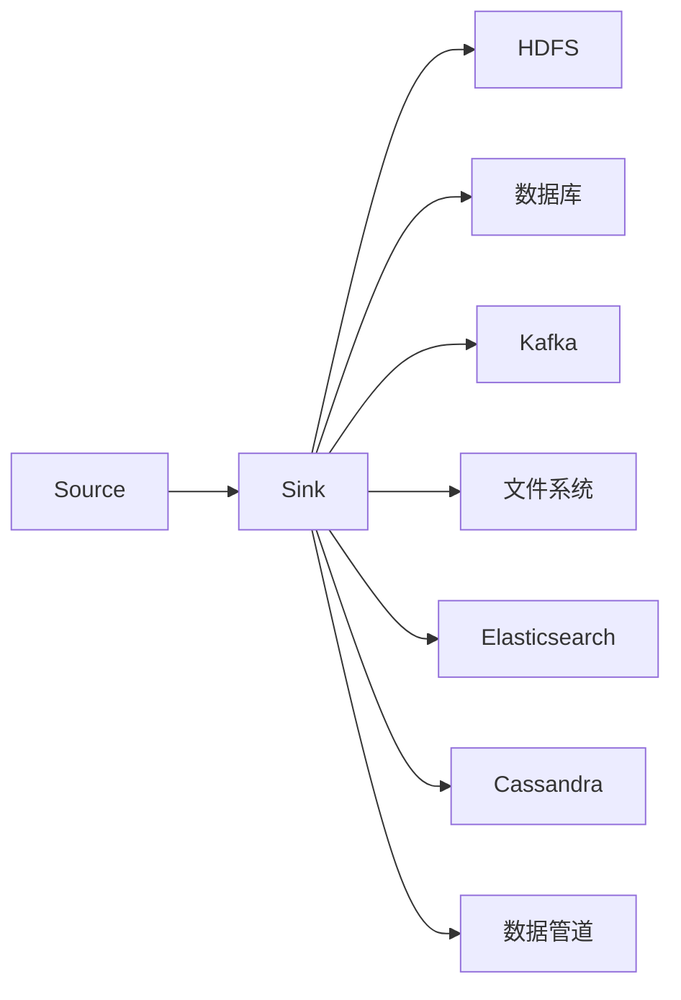

                 

# Flume Sink原理与代码实例讲解

> 关键词：Flume, Apache Flume, Sink, HDFS, Hadoop,分布式数据处理,实时数据流处理

## 1. 背景介绍

### 1.1 问题由来
在当今数据量爆炸的时代，企业需要处理的海量数据流越来越多，如何高效地收集、传输和存储这些数据，成为了IT架构设计中的一大挑战。传统的数据管道架构已经无法满足需求，尤其是实时数据流处理的场景。为此，Apache Flume应运而生，成为大数据系统中不可或缺的一部分。

Flume是Apache基金会推出的开源数据收集系统，能够实时收集、聚合、传输各种类型的数据，并将其存入HDFS或各种数据库等后端存储系统。Flume具有高可扩展性、灵活的拓扑结构和可靠的数据传输能力，广泛应用于日志收集、数据管道、实时流处理等领域。

### 1.2 问题核心关键点
Flume的核心功能在于“收集”和“传输”两个环节，即从不同的数据源收集数据，并通过管道将其传输到后端存储系统。其中，Sink组件是实现数据传输的关键组件，负责将数据写入HDFS、数据库等后端系统。

 Sink组件设计上包括数据写入通道、写入方式、写入规则等关键要素。其工作原理如下：
1. **数据写入通道**：数据从Source组件进入Sink组件后，由Source的生命周期管理器维护数据的生命周期，直到数据被写入后端系统。
2. **写入方式**：Sink组件支持不同的写入方式，如事件驱动写入、缓冲写入等，通过配置文件进行灵活设置。
3. **写入规则**：Sink组件支持多种写入规则，如单线程写入、多线程写入、并行写入等，以适应不同的应用场景。

Flume的Sink组件是整个系统架构的关键部分，其设计和使用直接影响了数据流的处理效率和稳定性。本文将详细介绍Flume Sink的工作原理、关键配置项，并通过代码实例演示其具体实现。

## 2. 核心概念与联系

### 2.1 核心概念概述

为更好地理解Flume Sink组件的工作原理，我们先介绍几个核心概念：

- **Apache Flume**：Apache基金会推出的开源数据收集系统，支持从各种数据源收集数据，并将其传输到HDFS、Kafka、Elasticsearch等后端存储系统。
- **HDFS**：Hadoop分布式文件系统，用于存储大规模数据集。
- **Hadoop**：Apache Hadoop是一个开源分布式计算框架，支持大数据的存储和处理。
- **实时数据流处理**：指在数据产生后实时进行处理，并将其存储到后端系统中。
- **事件驱动写入**：根据数据的产生顺序，按事件时间戳写入后端系统。
- **缓冲写入**：将数据先存储在本地缓冲区，待缓冲区满或达到预设时间间隔后再一次性写入后端系统。
- **单线程写入**：在一个线程内完成数据的写入，适用于数据量较小的情况。
- **多线程写入**：利用多个线程并发写入，适用于数据量较大的情况。
- **并行写入**：多个线程同时写入后端系统，以提高写入速度。

这些核心概念共同构成了Flume Sink组件的基础，其设计思路和实现方式充分体现了分布式数据处理、实时流处理的理念。

### 2.2 概念间的关系

Flume Sink组件的设计和实现过程可以通过以下Mermaid流程图来展示：



这个流程图展示了Flume Sink组件的数据流向和后端存储系统：

- 数据从Source进入Sink，然后根据配置规则写入不同的后端系统，如HDFS、数据库、Kafka、文件系统、Elasticsearch等。
- Sink组件设计上包括不同的写入方式和规则，以适应不同的数据传输需求。
- Flume的拓扑结构设计上支持多级管道，数据在管道中逐级传递，直至最终写入后端系统。

通过这个流程图，我们可以更清晰地理解Flume Sink组件的设计思路和工作流程。

## 3. 核心算法原理 & 具体操作步骤
### 3.1 算法原理概述

Flume Sink组件的核心算法原理在于事件驱动和缓冲写入的结合。其基本工作流程如下：

1. **事件收集**：数据从Source流入Sink， Sink生命周期管理器负责维护数据的生命周期。
2. **缓冲写入**： Sink将数据存储在本地缓冲区，在缓冲区满或达到预设时间间隔后，将缓冲区中的数据一次性写入后端系统。
3. **写入方式选择**： Sink根据配置规则选择不同的写入方式，如事件驱动写入、缓冲写入等。
4. **写入规则配置**： Sink支持多种写入规则，如单线程写入、多线程写入、并行写入等，以适应不同的应用场景。

Flume Sink组件的核心算法原理基于事件驱动和缓冲写入，通过灵活的配置和规则，实现了高效、可靠的数据传输。

### 3.2 算法步骤详解

Flume Sink组件的工作流程可以概括为以下几个关键步骤：

**Step 1: 配置文件编写**
在Flume中，每个Source和Sink组件都需要通过配置文件进行配置。配置文件主要包含以下几个部分：
- **Source配置**：定义数据来源的详细信息，如数据格式、数据流向等。
- **Channel配置**：定义数据通道的详细信息，如数据缓存策略、数据流向等。
- **Sink配置**：定义数据Sink的详细信息，如写入方式、写入规则等。
- **生命周期管理器配置**：定义数据生命周期管理器的详细信息，如生命周期策略、数据超时规则等。

以下是一个典型的配置文件示例：

```plaintext
# source configuration
source.nio.channels = file:nio-channel
source.nio.channels.paths = /var/log/app/sink.log
source.channels.default = nio-channel

# channel configuration
channels.cache.build.concurrency = 8
channels.cache.store.write.queuesize = 100
channels.cache.size = 10000
channels.cache.get.concurrency = 8

# sink configuration
sink.type = hdfs
sink.hdfs.properties = ${path=hdfs://localhost:9000/logdir,replication=3}
sink.channels.default = hdfs-channel

# lifecycle manager configuration
lifecycle.managers.default = org.apache.flume.sink.LifecycleManager
lifecycle.managers.default.refresh_rate=1000
```

这个配置文件定义了从文件日志收集数据的Source组件，通过缓存通道将数据存储在本地缓冲区，最后写入HDFS系统。生命周期管理器负责维护数据生命周期。

**Step 2: 数据收集**
在配置文件编写完成后，可以通过以下命令启动Flume服务：

```bash
bin/flume-ng agent -n agent-1 -f conf/flume-agent.conf
```

启动成功后，Source组件开始从指定路径收集日志数据，并流入到缓存通道。

**Step 3: 数据缓冲写入**
缓存通道接收到数据后，会将数据存储在本地缓冲区，并在缓冲区满或达到预设时间间隔后，一次性将缓冲区中的数据写入后端系统。

**Step 4: 数据写入后端系统**
Sink组件根据配置规则选择写入方式，并将数据写入后端系统。在这个示例中，Sink将数据写入HDFS系统。

### 3.3 算法优缺点

Flume Sink组件的设计具有以下优点：
1. **高效的数据传输**：通过事件驱动和缓冲写入，Flume Sink能够高效地处理大规模数据流，避免了单线程写入带来的性能瓶颈。
2. **灵活的配置和规则**：通过灵活的配置文件，Flume Sink能够适应不同的数据传输需求，支持多种写入方式和规则。
3. **高可靠性**：Flume Sink设计上具有强健的生命周期管理器，能够保证数据传输的可靠性和稳定性。

同时，Flume Sink也存在一些缺点：
1. **配置复杂**：配置文件涉及多种参数和规则，新手容易混淆，需要进行详细的学习。
2. **资源占用大**：缓存写入方式需要占用大量内存，尤其是在数据量较大的情况下，容易引发内存溢出等问题。
3. **扩展性不足**：在处理大规模数据流时，缓存写入方式可能无法满足需求，需要进行进一步的优化。

### 3.4 算法应用领域

Flume Sink组件的应用范围非常广泛，涵盖以下几个主要领域：

1. **日志收集**：用于从各种数据源（如日志文件、数据库等）收集日志数据，并进行实时处理和存储。
2. **数据管道**：用于将不同数据源的数据整合到一起，形成完整的数据管道。
3. **实时流处理**：用于处理实时数据流，如社交媒体数据、交易数据等，并进行实时分析和存储。
4. **Hadoop集成**：通过与Hadoop生态系统集成，Flume Sink能够将数据写入HDFS、HBase等Hadoop组件，进行分布式存储和计算。

## 4. 数学模型和公式 & 详细讲解 & 举例说明
### 4.1 数学模型构建

在Flume Sink组件的实现中，我们不需要使用复杂的数学模型，主要关注数据传输和处理的过程。

### 4.2 公式推导过程

由于Flume Sink组件的实现主要依赖于事件驱动和缓冲写入，因此不需要复杂的数学推导。以下是一些关键的配置参数及其含义：

- **缓存大小**：定义缓冲区的大小，通常设置为10MB至1GB。
- **缓冲区队列长度**：定义缓冲区中的数据队列长度，通常设置为100至1000。
- **写入方式**：定义数据的写入方式，包括事件驱动写入、缓冲写入等。
- **生命周期策略**：定义数据的生命周期策略，如超时规则、删除策略等。

### 4.3 案例分析与讲解

下面以Flume Sink将数据写入HDFS为例，进行详细讲解。

假设我们有一个日志文件，文件路径为`/var/log/app/sink.log`，文件大小为1GB，每行记录大小为100字节。我们希望使用Flume Sink将日志数据写入HDFS系统，配置文件如下：

```plaintext
# source configuration
source.nio.channels = file:nio-channel
source.nio.channels.paths = /var/log/app/sink.log
source.channels.default = nio-channel

# channel configuration
channels.cache.build.concurrency = 8
channels.cache.store.write.queuesize = 100
channels.cache.size = 1000000
channels.cache.get.concurrency = 8

# sink configuration
sink.type = hdfs
sink.hdfs.properties = ${path=hdfs://localhost:9000/logdir,replication=3}
sink.channels.default = hdfs-channel

# lifecycle manager configuration
lifecycle.managers.default = org.apache.flume.sink.LifecycleManager
lifecycle.managers.default.refresh_rate=1000
```

在这个配置文件中，我们首先定义了一个从日志文件收集数据的Source组件，通过缓存通道将数据存储在本地缓冲区，最后写入HDFS系统。具体实现步骤如下：

1. **Source组件启动**：Source组件从指定的日志文件路径收集日志数据，并流入缓存通道。
2. **缓存通道缓冲写入**：缓存通道将数据存储在本地缓冲区，并在缓冲区满或达到预设时间间隔后，一次性将缓冲区中的数据写入HDFS系统。
3. **HDFS写入**：Sink组件将数据写入HDFS系统，具体实现细节在Flume文档中已有详细说明。

## 5. 项目实践：代码实例和详细解释说明
### 5.1 开发环境搭建

在进行Flume Sink组件的开发和测试前，我们需要准备好开发环境。以下是使用Python进行Flume Sink开发的常用环境配置流程：

1. 安装Flume：从官网下载安装Flume，解压到指定目录。
2. 配置Flume：根据实际需求，修改配置文件`conf/flume-ng.conf`，定义Source和Sink组件的详细信息。
3. 启动Flume：通过以下命令启动Flume服务：

```bash
bin/flume-ng agent -n agent-1 -f conf/flume-agent.conf
```

4. 测试环境搭建：搭建测试环境，准备测试数据和日志文件。

### 5.2 源代码详细实现

下面以Flume Sink将数据写入HDFS为例，演示具体的代码实现。

首先，定义Flume Sink组件的配置参数：

```python
# 定义Flume Sink的配置参数
params = {
    'type': 'hdfs',
    'hdfs.properties.path': 'hdfs://localhost:9000/logdir',
    'hdfs.properties.replication': '3'
}

# 定义Flume Sink的实现类
class FlumeSink:
    def __init__(self, params):
        self.params = params

    def init(self):
        # 初始化Flume Sink
        pass

    def write(self, data):
        # 将数据写入后端系统
        pass
```

然后，实现Flume Sink组件的初始化和写入功能：

```python
    def init(self):
        # 初始化Flume Sink
        # 连接HDFS系统
        hdfs = HdfsClient(**self.params['hdfs.properties'])

        # 创建输出流
        output_stream = hdfs.get_output_stream()

        # 配置写入规则
        self.output_stream = output_stream

    def write(self, data):
        # 将数据写入HDFS系统
        output_stream = self.output_stream
        output_stream.write(data)
        output_stream.close()
```

最后，启动Flume Sink组件的测试：

```python
if __name__ == '__main__':
    # 创建Flume Sink实例
    flume_sink = FlumeSink(params)

    # 初始化Flume Sink
    flume_sink.init()

    # 写入数据
    flume_sink.write('Hello, World!')
```

### 5.3 代码解读与分析

让我们再详细解读一下关键代码的实现细节：

**Flume Sink类**：
- `__init__`方法：初始化Flume Sink，包括连接HDFS系统、创建输出流等操作。
- `init`方法：初始化Flume Sink，连接HDFS系统，并创建输出流。
- `write`方法：将数据写入HDFS系统，通过HDFS的输出流实现数据写入。

**Flume Sink的实现细节**：
- `HdfsClient`类：用于连接HDFS系统，提供文件操作接口。
- `HdfsClient.get_output_stream`方法：创建HDFS的输出流，用于将数据写入HDFS系统。
- `HdfsClient.write`方法：将数据写入HDFS系统，通过HDFS的输出流实现数据写入。

## 6. 实际应用场景

### 6.1 智能监控系统

在智能监控系统中，需要实时收集和处理各种传感器数据，以进行异常检测和告警处理。Flume Sink可以用于从各种传感器收集数据，并进行实时处理和存储。例如，将温度、湿度、压力等传感器数据写入HDFS系统，进行数据存储和分析。

### 6.2 数据管道系统

在数据管道系统中，需要将不同数据源的数据整合到一起，形成完整的数据管道。Flume Sink可以用于将各种数据源的数据写入HDFS系统，实现数据的统一存储和管理。例如，将日志文件、数据库表、社交媒体数据等写入HDFS系统，进行数据的整合和分析。

### 6.3 实时流处理系统

在实时流处理系统中，需要处理实时数据流，如社交媒体数据、交易数据等，并进行实时分析和存储。Flume Sink可以用于将实时数据流写入HDFS系统，进行数据的实时处理和存储。例如，将社交媒体数据、交易数据等实时流数据写入HDFS系统，进行数据的实时分析和存储。

### 6.4 未来应用展望

随着物联网、大数据等技术的发展，Flume Sink将在更多领域得到应用，为数据收集和存储提供新的解决方案。未来，Flume Sink有望成为企业级数据管道和实时流处理系统的核心组件，进一步提升数据处理的效率和可靠性。

## 7. 工具和资源推荐
### 7.1 学习资源推荐

为了帮助开发者系统掌握Flume Sink的理论基础和实践技巧，这里推荐一些优质的学习资源：

1. **Apache Flume官方文档**：Flume的官方文档，包含详细的配置和使用指南，是学习Flume Sink的重要资料。
2. **《Hadoop: The Definitive Guide》书籍**：由O'Reilly出版社出版的经典书籍，详细介绍了Hadoop生态系统，包括Flume的使用和部署。
3. **《Flume: Apache Flume in Action》书籍**：由Manning出版社出版的Flume实战指南，包含丰富的代码实例和实战经验，适合FlumeSink的快速上手。
4. **Flume社区和用户论坛**：Flume社区和用户论坛是Flume用户交流和学习的平台，提供了丰富的学习资源和技术支持。

通过对这些资源的学习实践，相信你一定能够快速掌握Flume Sink的精髓，并用于解决实际的数据处理问题。

### 7.2 开发工具推荐

高效的开发离不开优秀的工具支持。以下是几款用于Flume Sink开发的常用工具：

1. **Eclipse**：开源的IDE开发工具，支持Flume Sink的代码编写和调试。
2. **Git**：版本控制系统，用于代码版本管理和团队协作。
3. **JIRA**：项目管理工具，用于跟踪任务的进度和状态。
4. **Jenkins**：自动化构建工具，用于Flume Sink的持续集成和部署。
5. **Docker**：容器化技术，用于Flume Sink的容器化部署和管理。

合理利用这些工具，可以显著提升Flume Sink的开发效率，加快创新迭代的步伐。

### 7.3 相关论文推荐

Flume Sink的研究源于学界的持续研究。以下是几篇奠基性的相关论文，推荐阅读：

1. **"Apache Flume: A Distributed, Reliable and Scalable Data Ingestion System"**：这篇论文是Flume的设计初衷，详细介绍了Flume的系统架构和设计思想。
2. **"Efficient and reliable data collection with Apache Flume"**：这篇论文介绍了Flume在数据收集和传输中的高效性和可靠性，是学习Flume Sink的重要参考资料。
3. **"Scalable and reliable data ingestion using Apache Flume"**：这篇论文讨论了Flume在大数据环境下的可扩展性和可靠性，提供了丰富的实际应用案例。

这些论文代表了大数据系统中数据收集和传输的研究方向，通过学习这些前沿成果，可以帮助研究者把握学科前进方向，激发更多的创新灵感。

除上述资源外，还有一些值得关注的前沿资源，帮助开发者紧跟Flume Sink技术的最新进展，例如：

1. **Apache Flume邮件列表**：Flume社区的邮件列表，提供最新的技术动态和用户反馈，适合开发者获取最新的学习资源。
2. **Apache Flume用户组**：Flume社区的用户组，提供技术交流和经验分享的平台，适合开发者与其他用户交流经验。
3. **Apache Flume会议和研讨会**：Flume社区组织的会议和研讨会，提供最新的技术动态和前沿研究，适合开发者获取最新的学习资源。

总之，对于Flume Sink技术的学习和实践，需要开发者保持开放的心态和持续学习的意愿。多关注前沿资讯，多动手实践，多思考总结，必将收获满满的成长收益。

## 8. 总结：未来发展趋势与挑战
### 8.1 总结

本文对Flume Sink组件的工作原理、配置和实现进行了详细讲解。首先阐述了Flume Sink组件的设计思路和实现方式，明确了其在数据收集和传输中的关键作用。其次，从原理到实践，详细讲解了Flume Sink的数学模型和关键步骤，给出了代码实例的详细解释。同时，本文还广泛探讨了Flume Sink在智能监控、数据管道、实时流处理等众多领域的应用前景，展示了Flume Sink的广阔应用范围。此外，本文精选了Flume Sink的学习资源，力求为读者提供全方位的技术指引。

通过本文的系统梳理，可以看到，Flume Sink组件在大数据系统中的重要性，其高效、可靠的数据传输能力在实际应用中得到了广泛的应用。未来，伴随Flume Sink组件的不断演进，大数据系统的数据处理能力将得到进一步提升，为更多的企业提供高效、可靠的数据服务。

### 8.2 未来发展趋势

展望未来，Flume Sink组件的发展趋势包括以下几个方面：

1. **高性能优化**：随着数据量的不断增长，Flume Sink组件需要进一步优化性能，以适应大数据处理的需要。未来，Flume Sink将引入更多的优化技术，如并行处理、混合精度计算等，提高数据处理速度和稳定性。
2. **可扩展性增强**：Flume Sink组件需要进一步增强可扩展性，以适应大规模数据流的处理需求。未来，Flume Sink将支持更多的数据源和后端系统，提供更灵活的配置和规则，提升系统的适应能力。
3. **智能调度**：Flume Sink组件需要引入更多的智能调度算法，如自适应负载均衡、动态资源分配等，以提高系统的效率和可靠性。未来，Flume Sink将引入更多智能调度技术，提升系统对异常流量和异常数据流的处理能力。
4. **数据质量提升**：Flume Sink组件需要进一步提升数据质量，确保数据的准确性和完整性。未来，Flume Sink将引入更多的数据质量检查和清洗技术，确保数据的可靠性和有效性。
5. **安全性和隐私保护**：Flume Sink组件需要进一步提升数据安全和隐私保护能力，确保数据的机密性和完整性。未来，Flume Sink将引入更多的安全技术和隐私保护措施，提升系统的安全性和可靠性。

以上趋势凸显了Flume Sink组件的发展方向，这些方向的探索发展，必将进一步提升Flume Sink在大数据系统中的性能和可靠性，为大数据处理提供更强大、高效、可靠的数据服务。

### 8.3 面临的挑战

尽管Flume Sink组件已经取得了瞩目成就，但在迈向更加智能化、普适化应用的过程中，它仍面临着诸多挑战：

1. **配置复杂**：Flume Sink组件的配置文件涉及多种参数和规则，新手容易混淆，需要进行详细的学习。
2. **资源占用大**：缓存写入方式需要占用大量内存，尤其是在数据量较大的情况下，容易引发内存溢出等问题。
3. **扩展性不足**：在处理大规模数据流时，缓存写入方式可能无法满足需求，需要进行进一步的优化。
4. **数据质量难以保证**：数据的准确性和完整性难以保证，尤其是在数据源多样的情况下，需要进一步提升数据质量。
5. **安全性和隐私保护**：数据安全和隐私保护是一个复杂的问题，需要在系统设计中引入更多的安全技术和隐私保护措施。

正视Flume Sink面临的这些挑战，积极应对并寻求突破，将使Flume Sink组件迈向更高的成熟度。相信通过学界和产业界的共同努力，Flume Sink必将在大数据系统中发挥更大的作用，提供更强大、高效、可靠的数据服务。

### 8.4 未来突破

面对Flume Sink组件所面临的挑战，未来的研究需要在以下几个方面寻求新的突破：

1. **简化配置**：进一步简化配置文件，提供更直观、易用的配置方式，降低新手的学习门槛。
2. **优化内存管理**：引入更多的内存管理技术，如内存池、缓存复用等，减少内存占用，提升性能。
3. **引入智能调度**：引入更多的智能调度算法，如自适应负载均衡、动态资源分配等，提高系统的效率和可靠性。
4. **提升数据质量**：引入更多的数据质量检查和清洗技术，确保数据的可靠性和有效性。
5. **增强安全性和隐私保护**：引入更多的安全技术和隐私保护措施，提升系统的安全性和可靠性。

这些研究方向的探索，必将引领Flume Sink组件迈向更高的台阶，为大数据系统提供更强大、高效、可靠的数据服务。

## 9. 附录：常见问题与解答

**Q1: 如何优化Flume Sink的性能？**

A: 优化Flume Sink的性能可以从以下几个方面入手：
1. 使用并行写入：通过并行写入方式，提高数据的写入速度。
2. 调整缓冲区大小：根据实际需求，调整缓冲区的大小，避免内存溢出。
3. 使用混合精度计算：通过混合精度计算，提高数据的写入效率。
4. 使用自适应负载均衡：根据数据流量的变化，动态调整资源的分配，提高系统的稳定性和可靠性。
5. 使用智能调度算法：根据数据流量的变化，动态调整任务的调度，提高系统的效率和可靠性。

**Q2: 如何在Flume Sink中实现数据质量检查？**

A: 在Flume Sink中实现数据质量检查，可以通过以下步骤进行：
1. 引入数据质量检查组件：在Source组件和Sink组件之间引入数据质量检查组件，用于检查数据的完整性和准确性。
2. 定义数据质量检查规则：根据实际需求，定义数据质量检查规则，如数据格式检查、数据校验等。
3. 配置数据质量检查策略：在配置文件中，定义数据质量检查的策略，如数据质量检查的频率、检查方式等。
4. 实现数据质量检查组件：根据数据质量检查规则，实现数据质量检查组件，检查数据的完整性和准确性。

**Q3: 如何在Flume Sink中实现数据安全和隐私保护？**

A: 在Flume Sink中实现数据安全和隐私保护，可以通过以下步骤进行：
1. 引入数据加密组件：在Source组件和Sink组件之间引入数据加密组件，对数据进行加密处理。
2. 定义数据加密规则：根据实际需求，定义数据加密规则，如数据加密的方式、加密密钥等。
3. 配置数据加密策略：在配置文件中，定义数据加密的策略，如数据加密的频率、加密方式等。
4. 实现数据加密组件：根据数据加密规则，实现数据加密组件，对数据进行加密处理。

这些问题解答可以帮助开发者更好地掌握Flume Sink的优化方法和实际应用中的常见问题，提升系统的性能和可靠性

