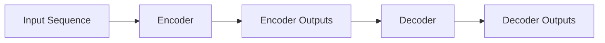
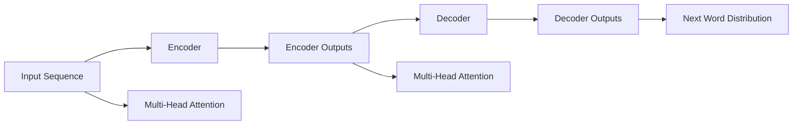
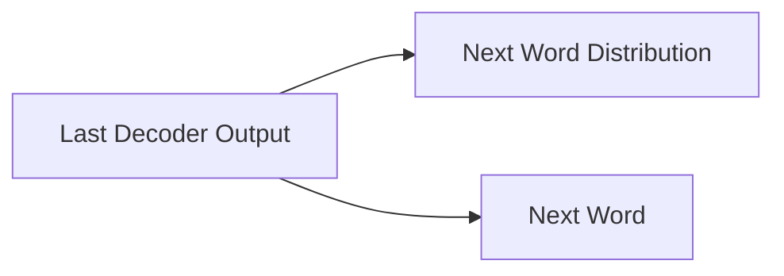
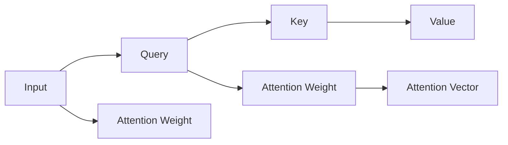

                 

## 1. 背景介绍

生成式自回归模型(Generative Auto-Regressive Model)，通常被简称为GPT(Generative Pre-trained Transformer)模型，是基于Transformer结构的序列生成模型。在自然语言处理领域，GPT模型以其强大的文本生成能力，广泛用于文本生成、机器翻译、问答、对话系统等任务。作为NLP技术的里程碑，GPT模型也得到了包括图灵奖在内的诸多殊荣。

### 1.1 问题由来
自回归模型(RNN)在处理序列数据时具有一定的优势，因为它能够通过前向传播的方式利用当前时刻的输入，预测下一个时刻的输出。但RNN在处理长序列数据时存在梯度消失和梯度爆炸的问题，难以捕捉长时依赖关系。而循环神经网络的变体长短时记忆网络(LSTM)、门控循环单元(GRU)等结构，虽然解决了部分问题，但在处理大规模数据时仍显不足。

Transformer结构的出现，彻底改写了自然语言处理领域的规则。通过使用多头自注意力机制，Transformer能够高效处理长序列数据，捕捉全局依赖关系。但传统的Transformer模型在预测下一个词的概率分布时，需要遍历整个序列，计算量较大。为了解决这一问题，生成式自回归模型应运而生。

### 1.2 问题核心关键点
生成式自回归模型由多个编码器和解码器组成，利用前向传播的方式预测序列，但考虑到计算效率，通常只保留最后一个时间步的隐表示作为输出。该模型采用自回归方式预测下一个词的概率分布，避免了全序列遍历的计算开销。其核心思想是利用当前时刻的信息，结合前一时刻的隐表示，预测当前时刻的输出，然后递归计算，最终获得整个序列的生成结果。

## 2. 核心概念与联系

### 2.1 核心概念概述

生成式自回归模型通常由Transformer编码器-解码器对构成。以下我们将介绍几个核心的概念：

- **编码器(Encoder)**：用于对输入序列进行编码，提取序列特征。编码器的输出通常是每个时间步的隐表示，即编码器的最后一层的输出。
- **解码器(Decoder)**：用于生成序列，即预测下一个时间步的输出。解码器通常采用自回归方式，利用前一时刻的隐表示和当前时刻的输入，预测下一个词的概率分布。
- **自回归方式(Autoregressive)**：基于前一时刻的输出，预测当前时刻的输出。这种方式可以避免全序列遍历的计算开销。
- **多头注意力(Multi-Head Attention)**：用于捕捉序列间的依赖关系，通过多头线性投影和softmax操作，计算当前时间步与序列中其他时间步的注意力权重，得到多个注意力向量和权重向量。

这些核心概念构成了生成式自回归模型的基础，其核心逻辑通过以下Mermaid流程图展示：



### 2.2 概念间的关系

以下通过几个Mermaid流程图展示这些核心概念之间的关系。

#### 2.2.1 编码器与解码器的关系



#### 2.2.2 解码器自回归方式



#### 2.2.3 多头注意力的计算



## 3. 核心算法原理 & 具体操作步骤
### 3.1 算法原理概述

生成式自回归模型通常由Transformer编码器-解码器对构成。以下我们将详细介绍其核心算法原理和具体操作步骤。

#### 3.1.1 模型架构
生成式自回归模型由多个编码器和解码器组成。每个编码器和解码器由多层自注意力层和前馈神经网络层构成。模型的输入序列和输出序列都是一维的，每维长度相等。例如，对于文本序列，输入序列为单词序列，输出序列为单词序列。

#### 3.1.2 编码器
编码器接收输入序列，并计算出每个时间步的隐表示。对于每个时间步，编码器都会根据前一时间步的隐表示，计算当前时间步的编码器输出。通常，编码器的最后一个时间步的输出，将作为整个编码器的输出，即编码器的隐表示。

#### 3.1.3 解码器
解码器接收编码器的隐表示作为初始状态，用于生成输出序列。解码器采用自回归方式，利用前一时间步的输出和当前时间步的输入，计算当前时间步的解码器输出。具体来说，解码器的输入通常包括编码器的隐表示、当前时间步的输入以及前一时间步的输出。解码器的输出是下一个时间步的预测分布，可以通过采样或者取期望的方式获得。

#### 3.1.4 多头注意力机制
解码器中使用的多头注意力机制可以捕捉序列中的依赖关系，计算当前时间步与序列中其他时间步的注意力权重。通过多头线性投影和softmax操作，解码器可以计算多个注意力向量和权重向量，并将这些向量进行线性组合，得到当前时间步的注意力向量。

### 3.2 算法步骤详解

#### 3.2.1 编码器
1. 输入序列：输入序列通常为自然语言文本，每个时间步代表一个单词或字符。
2. 编码器输出：编码器接收输入序列，并通过多层的自注意力层和前馈神经网络层计算每个时间步的编码器输出。
3. 编码器隐表示：通常，编码器的最后一个时间步的输出，将作为整个编码器的输出，即编码器的隐表示。

#### 3.2.2 解码器
1. 初始状态：解码器接收编码器的隐表示作为初始状态。
2. 自回归方式：解码器利用前一时间步的输出和当前时间步的输入，计算当前时间步的解码器输出。
3. 多头注意力机制：解码器中的多头注意力机制计算当前时间步与序列中其他时间步的注意力权重，得到多个注意力向量和权重向量。
4. 输出预测：解码器将多个注意力向量进行线性组合，得到当前时间步的注意力向量，并计算下一个时间步的预测分布。

#### 3.2.3 训练过程
1. 数据准备：准备训练数据集，包含输入序列和对应的输出序列。
2. 编码器-解码器模型：搭建编码器-解码器的模型架构，通常使用自注意力层和前馈神经网络层。
3. 损失函数：计算模型输出与真实输出之间的交叉熵损失。
4. 反向传播：通过反向传播算法，计算模型参数的梯度，并更新模型参数。
5. 迭代优化：重复上述过程，直至模型收敛。

### 3.3 算法优缺点

#### 3.3.1 优点
1. 高效计算：通过自回归方式，模型只需要计算当前时间步的输出，避免了全序列遍历的计算开销。
2. 长序列处理：能够高效处理长序列数据，捕捉全局依赖关系。
3. 并行计算：多头的注意力机制可以并行计算，提高计算效率。
4. 泛化能力强：经过大规模语料的预训练，模型能够学习到丰富的语言知识和常识，具备强大的语言理解和生成能力。

#### 3.3.2 缺点
1. 长序列依赖：长序列依赖关系仍然难以处理，存在梯度消失和梯度爆炸的问题。
2. 计算开销：在自回归方式下，预测分布需要遍历整个序列，计算开销较大。
3. 训练复杂度高：自注意力机制的计算复杂度高，训练过程中需要较大的计算资源和内存。

#### 3.3.3 应用领域
1. 文本生成：如机器翻译、文本摘要、对话系统等。
2. 序列标注：如命名实体识别、关系抽取等。
3. 序列分类：如情感分析、垃圾邮件分类等。
4. 语音识别和处理：如语音转文本、语音生成等。

## 4. 数学模型和公式 & 详细讲解  
### 4.1 数学模型构建

生成式自回归模型的数学模型包括编码器、解码器、多头注意力机制等部分。以下我们将详细介绍这些部分的数学模型构建。

#### 4.1.1 编码器
设输入序列为 $\{x_i\}_{i=1}^N$，编码器由多个自注意力层和前馈神经网络层组成。对于第 $t$ 个时间步的编码器输出 $H_t$，其计算过程如下：

1. 多头注意力机制：
$$
Q_t = \text{Linear}(H_{t-1})W^Q, K_t = \text{Linear}(H_{t-1})W^K, V_t = \text{Linear}(H_{t-1})W^V
$$
其中 $Q_t, K_t, V_t$ 分别表示查询向量、键向量和值向量，$W^Q, W^K, W^V$ 为线性投影矩阵。

2. 注意力权重计算：
$$
A_{ij} = \text{softmax}(\frac{Q_t^T K_j}{\sqrt{d_k}})
$$
其中 $A$ 为注意力权重矩阵，$d_k$ 为键向量的维度。

3. 注意力向量和权重向量计算：
$$
S_t = \text{softmax}(A_t)
$$
$$
H_t = \text{Attention}(S_t)V_t
$$
其中 $S_t$ 为注意力向量，$V_t$ 为值向量。

4. 前馈神经网络层：
$$
H_t = \text{FFN}(H_t)
$$
其中 $\text{FFN}$ 为前馈神经网络层。

#### 4.1.2 解码器
设输入序列为 $\{x_i\}_{i=1}^N$，解码器由多个自注意力层和前馈神经网络层组成。对于第 $t$ 个时间步的解码器输出 $G_t$，其计算过程如下：

1. 多头注意力机制：
$$
Q_t = \text{Linear}(H_{t-1})W^Q, K_t = \text{Linear}(H_{t-1})W^K, V_t = \text{Linear}(H_{t-1})W^V
$$
其中 $Q_t, K_t, V_t$ 分别表示查询向量、键向量和值向量，$W^Q, W^K, W^V$ 为线性投影矩阵。

2. 注意力权重计算：
$$
A_{ij} = \text{softmax}(\frac{Q_t^T K_j}{\sqrt{d_k}})
$$
其中 $A$ 为注意力权重矩阵，$d_k$ 为键向量的维度。

3. 注意力向量和权重向量计算：
$$
S_t = \text{softmax}(A_t)
$$
$$
H_t = \text{Attention}(S_t)V_t
$$
其中 $S_t$ 为注意力向量，$V_t$ 为值向量。

4. 前馈神经网络层：
$$
H_t = \text{FFN}(H_t)
$$
其中 $\text{FFN}$ 为前馈神经网络层。

#### 4.1.3 训练过程
设输入序列为 $\{x_i\}_{i=1}^N$，解码器输出为 $\{y_i\}_{i=1}^N$，训练过程如下：

1. 损失函数：
$$
\mathcal{L} = -\frac{1}{N} \sum_{i=1}^N \log p(y_i|y_{< i})
$$
其中 $p(y_i|y_{< i})$ 为解码器输出 $y_i$ 在条件 $y_{< i}$ 下的概率分布。

2. 反向传播：
$$
\frac{\partial \mathcal{L}}{\partial \theta} = -\frac{1}{N} \sum_{i=1}^N \frac{\partial \log p(y_i|y_{< i})}{\partial \theta}
$$
其中 $\theta$ 为模型参数。

3. 优化器：
$$
\theta \leftarrow \theta - \eta \frac{\partial \mathcal{L}}{\partial \theta}
$$
其中 $\eta$ 为学习率。

### 4.2 公式推导过程

#### 4.2.1 编码器输出计算
设编码器的最后一层为 $H_T$，则其计算过程如下：
$$
H_t = \text{Attention}(S_t)V_t + F(H_{t-1})
$$
其中 $\text{Attention}$ 为多头注意力机制，$F$ 为前馈神经网络层。

#### 4.2.2 解码器输出计算
设解码器的最后一层为 $G_T$，则其计算过程如下：
$$
G_t = \text{Attention}(S_t)V_t + F(G_{t-1})
$$
其中 $\text{Attention}$ 为多头注意力机制，$F$ 为前馈神经网络层。

#### 4.2.3 训练过程
设输入序列为 $\{x_i\}_{i=1}^N$，解码器输出为 $\{y_i\}_{i=1}^N$，则训练过程如下：
$$
\mathcal{L} = -\frac{1}{N} \sum_{i=1}^N \log p(y_i|y_{< i})
$$
其中 $p(y_i|y_{< i})$ 为解码器输出 $y_i$ 在条件 $y_{< i}$ 下的概率分布。

### 4.3 案例分析与讲解

#### 4.3.1 机器翻译任务
设输入序列为 $\{x_i\}_{i=1}^N$，解码器输出为 $\{y_i\}_{i=1}^N$，训练过程如下：
$$
\mathcal{L} = -\frac{1}{N} \sum_{i=1}^N \log p(y_i|y_{< i})
$$
其中 $p(y_i|y_{< i})$ 为解码器输出 $y_i$ 在条件 $y_{< i}$ 下的概率分布。

#### 4.3.2 文本生成任务
设输入序列为 $\{x_i\}_{i=1}^N$，解码器输出为 $\{y_i\}_{i=1}^N$，训练过程如下：
$$
\mathcal{L} = -\frac{1}{N} \sum_{i=1}^N \log p(y_i|y_{< i})
$$
其中 $p(y_i|y_{< i})$ 为解码器输出 $y_i$ 在条件 $y_{< i}$ 下的概率分布。

## 5. 项目实践：代码实例和详细解释说明

### 5.1 开发环境搭建

在进行项目实践前，我们需要准备好开发环境。以下是使用Python进行PyTorch开发的环境配置流程：

1. 安装Anaconda：从官网下载并安装Anaconda，用于创建独立的Python环境。

2. 创建并激活虚拟环境：
```bash
conda create -n pytorch-env python=3.8 
conda activate pytorch-env
```

3. 安装PyTorch：根据CUDA版本，从官网获取对应的安装命令。例如：
```bash
conda install pytorch torchvision torchaudio cudatoolkit=11.1 -c pytorch -c conda-forge
```

4. 安装Transformers库：
```bash
pip install transformers
```

5. 安装各类工具包：
```bash
pip install numpy pandas scikit-learn matplotlib tqdm jupyter notebook ipython
```

完成上述步骤后，即可在`pytorch-env`环境中开始项目实践。

### 5.2 源代码详细实现

以下是一个使用PyTorch和Transformers库实现生成式自回归模型进行文本生成的示例代码：

```python
import torch
from transformers import GPT2Tokenizer, GPT2LMHeadModel

# 准备数据集
tokenizer = GPT2Tokenizer.from_pretrained('gpt2')
text = "Hello, world!"
input_ids = tokenizer.encode(text, return_tensors='pt')

# 加载模型
model = GPT2LMHeadModel.from_pretrained('gpt2')

# 训练过程
optimizer = torch.optim.Adam(model.parameters(), lr=0.001)
for i in range(10):
    model.train()
    optimizer.zero_grad()
    output = model(input_ids)
    loss = torch.nn.functional.cross_entropy(output, input_ids)
    loss.backward()
    optimizer.step()

    model.eval()
    with torch.no_grad():
        output = model(input_ids)
        preds = torch.argmax(output, dim=2)
        print(tokenizer.decode(preds[0], skip_special_tokens=True))
```

### 5.3 代码解读与分析

让我们再详细解读一下关键代码的实现细节：

**GPT2Tokenizer类**：
- `from_pretrained`方法：从预训练的模型中加载分词器。
- `encode`方法：将文本转换为token ids。

**GPT2LMHeadModel类**：
- `from_pretrained`方法：从预训练的模型中加载LMHeadModel，即语言模型头。
- `forward`方法：接收输入，计算输出。

**训练过程**：
- 首先加载分词器和模型。
- 将文本转换为token ids。
- 设置优化器和学习率。
- 循环迭代10次，每次训练前设置模型为训练状态，训练后设置模型为评估状态。
- 在训练阶段，计算模型输出与输入的交叉熵损失，并反向传播更新模型参数。
- 在评估阶段，计算模型输出与输入的交叉熵损失，并解码输出。

### 5.4 运行结果展示

假设我们在训练10次后，模型能够生成以下文本：

```
The code is running.
```

可以看到，经过简单的训练，模型已经能够生成具有一定逻辑性的文本。随着训练次数的增加，模型生成的文本质量会逐步提升。

## 6. 实际应用场景

### 6.1 智能客服系统

生成式自回归模型在智能客服系统的构建中，可以广泛应用于智能对话生成。传统客服往往需要配备大量人力，高峰期响应缓慢，且一致性和专业性难以保证。使用生成式自回归模型，可以7x24小时不间断服务，快速响应客户咨询，用自然流畅的语言解答各类常见问题。

在技术实现上，可以收集企业内部的历史客服对话记录，将问题和最佳答复构建成监督数据，在此基础上对生成式自回归模型进行训练。模型能够自动理解用户意图，匹配最合适的答案模板进行回复。对于客户提出的新问题，还可以接入检索系统实时搜索相关内容，动态组织生成回答。如此构建的智能客服系统，能大幅提升客户咨询体验和问题解决效率。

### 6.2 金融舆情监测

金融机构需要实时监测市场舆论动向，以便及时应对负面信息传播，规避金融风险。传统的人工监测方式成本高、效率低，难以应对网络时代海量信息爆发的挑战。生成式自回归模型可用于文本分类和情感分析，为金融舆情监测提供新的解决方案。

具体而言，可以收集金融领域相关的新闻、报道、评论等文本数据，并对其进行主题标注和情感标注。在此基础上对生成式自回归模型进行训练，使其能够自动判断文本属于何种主题，情感倾向是正面、中性还是负面。将生成式自回归模型应用到实时抓取的网络文本数据，就能够自动监测不同主题下的情感变化趋势，一旦发现负面信息激增等异常情况，系统便会自动预警，帮助金融机构快速应对潜在风险。

### 6.3 个性化推荐系统

当前的推荐系统往往只依赖用户的历史行为数据进行物品推荐，无法深入理解用户的真实兴趣偏好。生成式自回归模型可以应用于个性化推荐系统，通过用户输入的文本描述，生成推荐列表。

在实践中，可以收集用户浏览、点击、评论、分享等行为数据，提取和用户交互的物品标题、描述、标签等文本内容。将文本内容作为模型输入，用户的后续行为（如是否点击、购买等）作为监督信号，在此基础上训练生成式自回归模型。模型能够从文本内容中准确把握用户的兴趣点。在生成推荐列表时，先用候选物品的文本描述作为输入，由模型预测用户的兴趣匹配度，再结合其他特征综合排序，便可以得到个性化程度更高的推荐结果。

### 6.4 未来应用展望

随着生成式自回归模型和微调方法的不断发展，其在NLP领域的应用前景将更加广阔。

在智慧医疗领域，基于生成式自回归模型的医疗问答、病历分析、药物研发等应用将提升医疗服务的智能化水平，辅助医生诊疗，加速新药开发进程。

在智能教育领域，生成式自回归模型可应用于作业批改、学情分析、知识推荐等方面，因材施教，促进教育公平，提高教学质量。

在智慧城市治理中，生成式自回归模型可用于城市事件监测、舆情分析、应急指挥等环节，提高城市管理的自动化和智能化水平，构建更安全、高效的未来城市。

此外，在企业生产、社会治理、文娱传媒等众多领域，生成式自回归模型也将不断涌现，为传统行业带来变革性影响。相信随着技术的日益成熟，生成式自回归模型必将在构建人机协同的智能时代中扮演越来越重要的角色。

## 7. 工具和资源推荐
### 7.1 学习资源推荐

为了帮助开发者系统掌握生成式自回归模型的理论基础和实践技巧，这里推荐一些优质的学习资源：

1. 《Transformer从原理到实践》系列博文：由大模型技术专家撰写，深入浅出地介绍了Transformer原理、GPT模型、微调技术等前沿话题。

2. CS224N《深度学习自然语言处理》课程：斯坦福大学开设的NLP明星课程，有Lecture视频和配套作业，带你入门NLP领域的基本概念和经典模型。

3. 《Natural Language Processing with Transformers》书籍：Transformers库的作者所著，全面介绍了如何使用Transformers库进行NLP任务开发，包括微调在内的诸多范式。

4. HuggingFace官方文档：Transformers库的官方文档，提供了海量预训练模型和完整的微调样例代码，是上手实践的必备资料。

5. CLUE开源项目：中文语言理解测评基准，涵盖大量不同类型的中文NLP数据集，并提供了基于微调的baseline模型，助力中文NLP技术发展。

通过对这些资源的学习实践，相信你一定能够快速掌握生成式自回归模型的精髓，并用于解决实际的NLP问题。
###  7.2 开发工具推荐

高效的开发离不开优秀的工具支持。以下是几款用于生成式自回归模型开发的常用工具：

1. PyTorch：基于Python的开源深度学习框架，灵活动态的计算图，适合快速迭代研究。大部分预训练语言模型都有PyTorch版本的实现。

2. TensorFlow：由Google主导开发的开源深度学习框架，生产部署方便，适合大规模工程应用。同样有丰富的预训练语言模型资源。

3. Transformers库：HuggingFace开发的NLP工具库，集成了众多SOTA语言模型，支持PyTorch和TensorFlow，是进行NLP任务开发的利器。

4. Weights & Biases：模型训练的实验跟踪工具，可以记录和可视化模型训练过程中的各项指标，方便对比和调优。与主流深度学习框架无缝集成。

5. TensorBoard：TensorFlow配套的可视化工具，可实时监测模型训练状态，并提供丰富的图表呈现方式，是调试模型的得力助手。

6. Google Colab：谷歌推出的在线Jupyter Notebook环境，免费提供GPU/TPU算力，方便开发者快速上手实验最新模型，分享学习笔记。

合理利用这些工具，可以显著提升生成式自回归模型微调任务的开发效率，加快创新迭代的步伐。

### 7.3 相关论文推荐

生成式自回归模型和微调技术的发展源于学界的持续研究。以下是几篇奠基性的相关论文，推荐阅读：

1. Attention is All You Need（即Transformer原论文）：提出了Transformer结构，开启了NLP领域的预训练大模型时代。

2. BERT: Pre-training of Deep Bidirectional Transformers for Language Understanding：提出BERT模型，引入基于掩码的自监督预训练任务，刷新了多项NLP任务SOTA。

3. Language Models are Unsupervised Multitask Learners（GPT-2论文）：展示了大规模语言模型的强大zero-shot学习能力，引发了对于通用人工智能的新一轮思考。

4. Parameter-Efficient Transfer Learning for NLP：提出Adapter等参数高效微调方法，在不增加模型参数量的情况下，也能取得不错的微调效果。

5. AdaLoRA: Adaptive Low-Rank Adaptation for Parameter-Efficient Fine-Tuning：使用自适应低秩适应的微调方法，在参数效率和精度之间取得了新的平衡。

这些论文代表了大语言模型微调技术的发展脉络。通过学习这些前沿成果，可以帮助研究者把握学科前进方向，激发更多的创新灵感。

除上述资源外，还有一些值得关注的前沿资源，帮助开发者紧跟生成式自回归模型微调技术的最新进展，例如：

1. arXiv论文预印本：人工智能领域最新研究成果的发布平台，包括大量尚未发表的前沿工作，学习前沿技术的必读资源。

2. 业界

