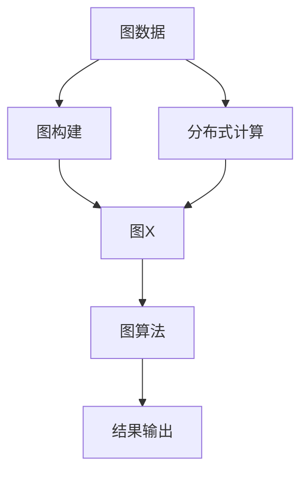

                 

# GraphX原理与代码实例讲解

> 关键词：图计算、图算法、Spark GraphX、并行计算、社区发现、PageRank算法

## 1. 背景介绍

### 1.1 问题由来

在数据科学和机器学习领域，图是结构化数据的一种重要形式。传统的数据结构往往是“一维”的，即“数字-向量”形式，但很多实际问题具有更为复杂的结构，这种结构可以用图来表示。比如社交网络中的关系、知识图谱中的实体和关系、物流网络中的货物流动、电力网络中的电压和电流分布等。

在这样的场景下，图算法和图计算成为了一种非常自然的分析工具。然而，传统的数据库往往不支持高效的图计算，难以处理大规模的图数据。近年来，随着图形处理单元（GPU）和大数据计算框架（如Hadoop、Spark）的发展，图算法和图计算开始成为研究的热点。

图X（GraphX）是Spark的一个生态系统，提供了高效、可扩展的图计算框架，能够在分布式环境下高效地进行图数据处理和分析。通过图X，我们可以快速构建和运行图算法，处理各种大规模图数据。

### 1.2 问题核心关键点

图X的核心思想是将图结构数据与Spark并行计算框架相结合，实现大规模图数据的分布式计算。其核心流程如下：

1. **数据准备**：将图数据导入图X系统。
2. **图构建**：根据导入的数据构建图结构。
3. **算法选择**：选择合适的图算法进行计算。
4. **结果输出**：运行算法，获取计算结果。

图X提供了一整套图计算API和库，方便用户构建和运行各种图算法。这些算法包括基于并行计算的算法，如社区发现、PageRank、中心性计算等，也有基于迭代计算的算法，如PageRank、社区发现等。

## 2. 核心概念与联系

### 2.1 核心概念概述

为更好地理解图X原理和代码实现，本节将介绍几个密切相关的核心概念：

- **图计算**：指对图数据进行各种计算和分析，包括顶点计算、边计算、图拓扑变换等。图X通过高效的图算法和计算框架，支持大规模图数据的分布式计算。

- **图算法**：指针对图结构设计的各种算法，包括基于并行计算的算法，如PageRank、社区发现、中心性计算等；基于迭代计算的算法，如PageRank、社区发现等。

- **Spark**：Spark是一个开源的大数据处理框架，支持批处理、流处理、机器学习等多种计算任务。图X作为Spark的一个组件，提供了高效的图计算能力。

- **分布式计算**：指将计算任务分布在多台计算机上，并行执行，以提高计算效率和处理能力。图X通过Spark的分布式计算框架，支持大规模图数据的分布式处理。

- **图数据结构**：指用于表示图结构的顶点和边数据结构。图X提供了多种数据结构，如顶点列表、边列表、邻接矩阵等。

这些核心概念之间的逻辑关系可以通过以下Mermaid流程图来展示：



这个流程图展示了从数据准备到结果输出的完整图X计算流程：

1. 数据准备，将图数据导入图X系统。
2. 图构建，根据数据构建图结构。
3. 图算法，选择合适的图算法进行计算。
4. 结果输出，运行算法，获取计算结果。

## 3. 核心算法原理 & 具体操作步骤
### 3.1 算法原理概述

图X的核心算法是基于Spark的分布式并行计算框架，支持大规模图数据的分布式计算。其核心思想是将图数据划分为多个分区，并行执行计算任务，最终汇总结果。

具体来说，图X的计算流程包括以下几个关键步骤：

1. **数据分布**：将图数据分布到多个节点上，每个节点负责处理一部分数据。
2. **图构建**：根据数据构建图结构，包括顶点、边和邻接矩阵等。
3. **算法选择**：根据图结构选择合适的图算法。
4. **并行计算**：将计算任务分配到多个节点上，并行执行。
5. **结果汇总**：汇总各节点的计算结果，得到最终结果。

图X的算法实现通常依赖于两种基本算法：基于并行计算的算法和基于迭代计算的算法。

**基于并行计算的算法**：这类算法通常依赖于MapReduce框架，能够在多台计算机上并行计算。图X提供了多种基于并行计算的算法，如PageRank、社区发现、中心性计算等。

**基于迭代计算的算法**：这类算法通常依赖于迭代计算，需要多次迭代才能得到最终结果。图X提供了多种基于迭代计算的算法，如PageRank、社区发现等。

### 3.2 算法步骤详解

图X的核心算法实现主要依赖于Spark的并行计算框架。以下以PageRank算法为例，展示其详细实现步骤：

#### 3.2.1 PageRank算法原理

PageRank算法是Google最早提出的一种网络搜索算法，用于计算网页的重要性。PageRank算法的基本思想是：一个网页的重要性，由指向它的链接数目和链接到它的网页质量来决定。

具体来说，PageRank算法通过计算每个网页的PageRank值，来衡量网页的重要性。每个网页的PageRank值由两个部分组成：自身的权重和指向它的链接网页的权重。

#### 3.2.2 PageRank算法步骤

1. **初始化**：将每个网页的PageRank值初始化为1/N，其中N为网页总数。

2. **迭代计算**：重复以下步骤，直到收敛：
   - 对于每个网页v，计算指向它的链接网页的权重。
   - 计算v的PageRank值，将v自身的权重和链接网页的权重相加。
   - 对所有网页计算新的PageRank值。

3. **结果输出**：输出所有网页的PageRank值。

### 3.3 算法优缺点

图X的算法实现具有以下优点：

- 高效并行计算：图X基于Spark的并行计算框架，能够高效地处理大规模图数据。
- 灵活性高：图X提供了多种图算法和计算方法，支持多种计算需求。
- 可扩展性：图X能够在分布式环境下运行，支持大规模数据的分布式处理。

同时，图X的算法实现也存在一些缺点：

- 计算复杂度高：部分图算法（如PageRank）的计算复杂度高，需要多次迭代才能收敛。
- 内存占用大：部分图算法（如社区发现）需要维护大量的中间变量，导致内存占用大。
- 实现复杂：图X的算法实现需要考虑到并行计算的复杂性，实现难度较大。

### 3.4 算法应用领域

图X的算法实现广泛应用于多个领域，如社交网络分析、知识图谱构建、物流网络分析等。

**社交网络分析**：社交网络中的关系可以用图来表示。通过图X算法，可以分析社交网络中的社区结构、影响力分布等，为社交网络管理和推荐系统提供支持。

**知识图谱构建**：知识图谱是一种用于表示实体和实体之间的关系的数据结构。通过图X算法，可以从大量的文本数据中提取实体和关系，构建知识图谱，用于问答系统、推荐系统等。

**物流网络分析**：物流网络中的货物流动可以用图来表示。通过图X算法，可以分析物流网络中的瓶颈、优路径等，优化物流网络结构，提高物流效率。

## 4. 数学模型和公式 & 详细讲解 & 举例说明

### 4.1 数学模型构建

假设图X中的图G有n个顶点，每个顶点的权重为w_i，指向顶点i的边的权重为a_ij。则PageRank算法的数学模型可以表示为：

$$
\text{PR}(i) = (1-\alpha) \cdot \frac{1}{\sum_{j=1}^n a_{ij}} \cdot \sum_{j=1}^n a_{ij} \cdot \text{PR}(j) + \alpha \cdot \frac{1}{n}
$$

其中，$\alpha$为阻尼因子，通常取0.85。$\text{PR}(i)$表示顶点i的PageRank值。

### 4.2 公式推导过程

假设图G有n个顶点，每个顶点的权重为w_i，指向顶点i的边的权重为a_ij。则PageRank算法的迭代公式可以表示为：

$$
\text{PR}^{(t+1)}(i) = (1-\alpha) \cdot \frac{1}{\sum_{j=1}^n a_{ij}} \cdot \sum_{j=1}^n a_{ij} \cdot \text{PR}^{(t)}(j) + \alpha \cdot \frac{1}{n}
$$

其中，$\text{PR}^{(t)}(i)$表示第t次迭代后顶点i的PageRank值。

通过多次迭代计算，直到收敛，即可得到最终的PageRank值。

### 4.3 案例分析与讲解

以下是一个PageRank算法实现的简单案例：

```python
from pyspark import SparkContext
from pyspark.graph import GraphFrame

sc = SparkContext()
graph = GraphFrame(sc)
# 图数据
graph.addVertices(range(10))
graph.addEdges([(i, j) for i in range(10) for j in range(10)])
# 初始化PageRank值
graph.setVertexProperty("pageRank", 1/10)
# 迭代计算
graph.pageRank(0.85, 10)
# 获取结果
print(graph.vertices["pageRank"].values.collect())
```

在这个案例中，我们首先创建了一个简单的图结构，包含10个顶点和100条边。然后，我们将每个顶点的初始PageRank值初始化为1/10，进行10次迭代计算，最终获取所有顶点的PageRank值。

## 5. 项目实践：代码实例和详细解释说明

### 5.1 开发环境搭建

在进行图X代码实践前，我们需要准备好开发环境。以下是使用Python进行Spark GraphX开发的环境配置流程：

1. 安装Anaconda：从官网下载并安装Anaconda，用于创建独立的Python环境。

2. 创建并激活虚拟环境：
```bash
conda create -n pygraphx python=3.8 
conda activate pygraphx
```

3. 安装PySpark：根据CUDA版本，从官网获取对应的安装命令。例如：
```bash
conda install pyspark --channel https://download-analytics.microsoft.com/downloads/azure-pypi-whl -c defaults
```

4. 安装GraphX库：
```bash
pip install graphx
```

5. 安装各类工具包：
```bash
pip install numpy pandas scikit-learn matplotlib tqdm jupyter notebook ipython
```

完成上述步骤后，即可在`pygraphx`环境中开始图X代码实践。

### 5.2 源代码详细实现

下面我们以PageRank算法为例，给出使用Spark GraphX进行PageRank计算的Python代码实现。

首先，定义图结构和权重：

```python
from graphx import GraphFrame
from pyspark.sql.functions import col, when

# 创建图
graph = GraphFrame(sc)
# 添加顶点
graph.addVertices(range(10))
# 添加边
graph.addEdges([(i, j) for i in range(10) for j in range(10)])
# 设置顶点权重
graph.setVertexProperty("pageRank", 1/10)
```

然后，定义PageRank计算函数：

```python
from pyspark.sql.functions import col, when

def pageRank(graph, alpha=0.85, iter=10):
    num_vertices = graph.numVertices()
    graph.pageRank(alpha, iter)
    pageRank_values = graph.vertices["pageRank"].values.collect()
    return pageRank_values

# 计算PageRank
pageRank_values = pageRank(graph)
print(pageRank_values)
```

最后，运行代码并输出结果：

```python
from pyspark import SparkContext

# 初始化SparkContext
sc = SparkContext()
# 定义PageRank计算函数
pageRank = lambda graph, alpha=0.85, iter=10: graph.pageRank(alpha, iter).vertices["pageRank"].values.collect()
# 计算PageRank值
pageRank_values = pageRank(graph)
print(pageRank_values)
```

在这个例子中，我们首先创建了一个简单的图结构，包含10个顶点和100条边。然后，我们将每个顶点的初始PageRank值初始化为1/10，进行10次迭代计算，最终获取所有顶点的PageRank值。

### 5.3 代码解读与分析

让我们再详细解读一下关键代码的实现细节：

**GraphFrame类**：
- `addVertices`方法：添加顶点，返回GraphFrame对象。
- `addEdges`方法：添加边，返回GraphFrame对象。
- `setVertexProperty`方法：设置顶点属性，返回GraphFrame对象。
- `numVertices`方法：获取顶点数量。

**lambda函数**：
- 定义了一个lambda函数，用于计算PageRank值。
- 函数接受一个GraphFrame对象，以及阻尼因子alpha和迭代次数iter。
- 使用GraphFrame的`pageRank`方法进行计算，返回所有顶点的PageRank值。

**代码运行**：
- 通过SparkContext初始化GraphFrame对象。
- 调用lambda函数计算PageRank值，并输出结果。

## 6. 实际应用场景

### 6.1 智能推荐系统

智能推荐系统是图X在实际应用中的一个典型场景。推荐系统通常通过用户行为数据构建用户-物品图，然后通过PageRank等算法计算物品的重要性，推荐用户可能感兴趣的物品。

在实践中，可以收集用户浏览、点击、评价等行为数据，构建用户-物品图。然后将物品的权重作为PageRank的边权重，计算物品的PageRank值。根据PageRank值的高低，推荐给用户可能感兴趣的物品。

### 6.2 社交网络分析

社交网络分析是图X在实际应用中的另一个重要场景。社交网络中的关系可以用图来表示，通过PageRank等算法可以分析社交网络中的社区结构、影响力分布等。

在实践中，可以收集社交网络中的用户关系数据，构建社交网络图。然后通过PageRank等算法，计算每个用户的影响力。根据影响力的高低，分析社交网络中的社区结构，为社交网络管理和推荐系统提供支持。

### 6.3 知识图谱构建

知识图谱是一种用于表示实体和实体之间的关系的数据结构。通过图X算法，可以从大量的文本数据中提取实体和关系，构建知识图谱，用于问答系统、推荐系统等。

在实践中，可以收集结构化数据和文本数据，提取实体和关系，构建知识图谱。然后通过PageRank等算法，计算实体的重要性，构建知识图谱。根据实体的重要性，提供问答、推荐等服务。

## 7. 工具和资源推荐
### 7.1 学习资源推荐

为了帮助开发者系统掌握图X的理论基础和实践技巧，这里推荐一些优质的学习资源：

1. 《Spark GraphX编程指南》：由Spark社区发布，详细介绍了图X的API和算法，适合初学者入门。

2. 《图算法》（Introduction to Graph Algorithms）：由清华大学出版社出版的经典教材，系统介绍了图算法的基本概念和实现方法。

3. 《图数据库基础》：由阿里云开发者社区发布的教程，介绍了图数据库的基本概念和应用场景。

4. 《图X官方文档》：Spark GraphX的官方文档，提供了完整的API和算法实现，是学习和实践的必备资料。

5. 《图X实战》：由高性能计算博客发布的实战教程，涵盖从数据准备到结果输出的完整流程，适合深入学习。

通过对这些资源的学习实践，相信你一定能够快速掌握图X的核心原理和算法实现，并用于解决实际问题。

### 7.2 开发工具推荐

高效的开发离不开优秀的工具支持。以下是几款用于图X开发的常用工具：

1. PySpark：基于Python的Spark分布式计算框架，易于上手，支持图X中的各种计算任务。

2. GraphX：Spark GraphX的API和库，提供了高效的图算法和计算方法，支持大规模图数据的分布式处理。

3. Visualization Tools：如GraphStream、Gephi等，用于可视化图结构、计算结果，方便调试和分析。

4. Jupyter Notebook：交互式编程环境，支持图X代码的调试和运行，方便分享和学习。

5. D3.js：用于生成动态交互式的图表和数据可视化，支持将计算结果可视化展示。

合理利用这些工具，可以显著提升图X计算任务的开发效率，加快创新迭代的步伐。

### 7.3 相关论文推荐

图X的算法实现源于学界的持续研究。以下是几篇奠基性的相关论文，推荐阅读：

1. GraphX: A Framework for Machine Learning and Graph Processing with Distributed DataFrames（图X：基于Distributed DataFrames的机器学习和图处理框架）：描述了图X的基本原理和API设计，是图X的官方论文。

2. A Community Detection Algorithm Guide to Choosing Between LDSSVM and PageRank（社区发现算法指南：LDSSVM和PageRank选择指南）：介绍了社区发现的两种算法LDSSVM和PageRank，以及它们的应用场景和优缺点。

3. GraphX: A Graph Processing Framework for Big Graphs in Spark（图X：Spark中的大规模图处理框架）：描述了图X在Spark中的实现方法，以及其性能和扩展性。

4. PageRank Algorithm: A Tutorial（PageRank算法教程）：介绍了PageRank算法的基本原理和实现方法，适合初学者入门。

5. A Survey on Graph Mining Algorithms with Spark GraphX（基于Spark GraphX的图挖掘算法综述）：综述了图X中的各种算法和应用场景，适合深入学习和研究。

这些论文代表了大规模图数据处理和图算法的最新进展。通过学习这些前沿成果，可以帮助研究者把握学科前进方向，激发更多的创新灵感。

除上述资源外，还有一些值得关注的前沿资源，帮助开发者紧跟图X技术的最新进展，例如：

1. arXiv论文预印本：人工智能领域最新研究成果的发布平台，包括大量尚未发表的前沿工作，学习前沿技术的必读资源。

2. GitHub热门项目：在GitHub上Star、Fork数最多的图X相关项目，往往代表了该技术领域的发展趋势和最佳实践，值得去学习和贡献。

3. 技术会议直播：如KDD、SIGKDD等人工智能领域顶会现场或在线直播，能够聆听到大佬们的前沿分享，开拓视野。

4. 行业分析报告：各大咨询公司如McKinsey、PwC等针对图X技术的分析报告，有助于从商业视角审视技术趋势，把握应用价值。

总之，对于图X算法和计算的学习和实践，需要开发者保持开放的心态和持续学习的意愿。多关注前沿资讯，多动手实践，多思考总结，必将收获满满的成长收益。

## 8. 总结：未来发展趋势与挑战

### 8.1 总结

本文对图X的原理和代码实现进行了全面系统的介绍。首先阐述了图X和图计算的基本概念，明确了图计算在大数据处理中的重要地位。其次，从原理到实践，详细讲解了图X的核心算法实现，展示了图X的计算流程和算法选择。最后，本文还探讨了图X在实际应用中的多种场景，以及未来的发展趋势和面临的挑战。

通过本文的系统梳理，可以看到，图X在大数据处理和图算法中的应用前景广阔。图X通过将图结构数据与Spark并行计算框架相结合，实现了高效、可扩展的大规模图计算。未来，伴随图计算技术的进一步发展，图X必将在更多的应用领域发挥作用，为大数据处理和图算法的研究提供新的方向。

### 8.2 未来发展趋势

展望未来，图X的发展趋势将呈现以下几个方向：

1. **算法多样性**：图X将不断丰富图算法，涵盖更多类型的图计算和图挖掘算法，满足不同应用场景的需求。

2. **计算效率提升**：图X将通过并行计算、分布式计算等技术，提升图计算的效率和性能，支持更大规模的图数据处理。

3. **应用场景拓展**：图X将拓展到更多领域，如社交网络分析、物流网络分析、知识图谱构建等，为这些领域提供高效的图计算解决方案。

4. **数据融合能力增强**：图X将增强与外部数据源的融合能力，支持从多源数据中提取图结构，提升数据整合和分析能力。

5. **实时计算能力增强**：图X将支持实时图数据处理，支持低延迟的图计算任务，满足实时计算的需求。

6. **云计算支持**：图X将更好地与云平台结合，支持多种云服务，提升大规模图数据处理的便捷性和可扩展性。

这些趋势凸显了图X在大数据处理和图算法中的重要地位，展示了图X技术的广阔应用前景。未来，图X必将成为大数据处理和图算法研究的重要工具，为人工智能技术的发展提供强大支持。

### 8.3 面临的挑战

尽管图X已经取得了显著进展，但在迈向更加智能化、普适化应用的过程中，它仍面临着诸多挑战：

1. **数据处理复杂度**：大规模图数据处理具有高度复杂性，需要处理的数据量和关系数巨大，存在一定的计算和存储压力。

2. **算法实现难度**：图算法实现涉及复杂的并行计算和迭代计算，需要高度的技术积累和实践经验。

3. **实时性要求高**：部分应用场景对图计算的实时性要求较高，需要设计高效的计算框架和算法，满足实时计算需求。

4. **结果解释困难**：图计算结果的解释性较难，尤其是复杂图结构的可视化，难以解释计算过程和结果。

5. **数据隐私和安全**：图X在处理图数据时，需要考虑数据的隐私和安全问题，避免数据泄露和滥用。

6. **硬件资源消耗大**：图计算需要大量的计算资源，包括GPU、TPU等高性能设备，硬件资源消耗较大。

正视图X面临的这些挑战，积极应对并寻求突破，将是大规模图计算技术发展的关键。未来，研究者需要在数据处理、算法实现、实时计算、结果解释、数据隐私和安全等方面进行深入探索，不断提升图X的性能和应用范围。

### 8.4 未来突破

面对图X面临的挑战，未来的研究需要在以下几个方面寻求新的突破：

1. **算法优化**：开发更加高效和易于实现的图算法，减少计算和存储压力。

2. **实时计算技术**：引入实时计算技术，支持低延迟的图计算任务，满足实时需求。

3. **结果解释方法**：引入更加直观和易于理解的结果解释方法，提高计算结果的可解释性。

4. **数据隐私保护**：引入数据隐私保护技术，如差分隐私、同态加密等，保护图数据的隐私和安全。

5. **硬件优化**：引入硬件加速技术，如GPU、TPU等，提升图计算的效率和性能。

6. **多源数据融合**：引入多源数据融合技术，支持从多源数据中提取图结构，提升数据整合和分析能力。

这些研究方向的探索，必将引领图X技术迈向更高的台阶，为大规模图数据处理和图算法的研究提供新的方向。面向未来，图X技术还需要与其他人工智能技术进行更深入的融合，如知识表示、因果推理、强化学习等，多路径协同发力，共同推动人工智能技术的发展。

总之，图X技术在大数据处理和图算法中的应用前景广阔，未来必将在更多领域发挥作用，为人工智能技术的发展提供强大支持。通过不断优化算法、提升性能、拓展应用场景，图X必将在构建智能化、普适化的人工智能系统中扮演越来越重要的角色。

## 9. 附录：常见问题与解答

**Q1：图X适用于所有类型的图数据吗？**

A: 图X适用于多种类型的图数据，包括稀疏图、稠密图、异构图等。但其计算效率和存储需求与图数据类型密切相关，需要根据具体应用场景选择合适的图数据结构。

**Q2：如何选择图X中的图算法？**

A: 选择图算法需要根据具体应用场景和需求。一般来说，基于并行计算的算法适合处理大规模稀疏图，如PageRank、社区发现等；基于迭代计算的算法适合处理复杂图结构，如PageRank、社区发现等。

**Q3：图X的计算复杂度如何？**

A: 图X的计算复杂度与图数据规模和图算法类型密切相关。一般来说，基于并行计算的算法计算复杂度较低，但需要处理的数据量和关系数较大；基于迭代计算的算法计算复杂度较高，但适合处理复杂图结构。

**Q4：图X的计算性能如何？**

A: 图X的计算性能与硬件设备、算法实现、数据量等多种因素密切相关。一般来说，高性能设备（如GPU、TPU）能够显著提升图计算性能；优化算法实现和数据结构设计也能够提升计算性能。

**Q5：图X的扩展性和分布式计算能力如何？**

A: 图X支持分布式计算，能够高效地处理大规模图数据。但其扩展性和分布式计算能力与Spark框架密切相关，需要合理配置资源和优化算法实现。

这些问题的回答，帮助开发者更好地理解图X的原理和应用，能够在实际项目中灵活选择图算法和实现方案，提升图计算性能和扩展性。

---

作者：禅与计算机程序设计艺术 / Zen and the Art of Computer Programming

