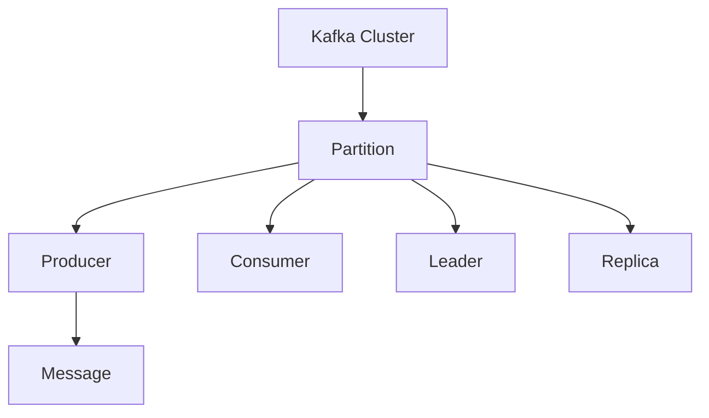

                 

# Kafka Producer原理与代码实例讲解

## 1. 背景介绍

在当今数字化时代，数据流成为了各行各业的基础设施。Apache Kafka是一个开源分布式流处理平台，旨在处理实时数据流。Kafka Producer是Kafka的核心组件之一，负责将消息从生产者应用发送到Kafka集群。Kafka Producer提供了可靠的、高吞吐量的消息发布服务，是构建实时数据管道、事件驱动应用和微服务架构的关键工具。

本博客将深入解析Kafka Producer的工作原理，并提供一个详细的代码实例，以帮助读者全面理解其工作机制，并在实际项目中灵活运用。

## 2. 核心概念与联系

### 2.1 核心概念概述

为了更好地理解Kafka Producer的工作原理，我们先介绍几个关键概念：

- **Kafka Cluster**：Kafka集群由一组Broker（服务器）和若干个Topic（主题）组成，用于存储和管理消息。
- **Partition**：每个Topic被分为多个Partition（分区），每个Partition是一个有序的、不可变的消息序列。
- **Producer**：消息的生产者，负责将消息发送到Kafka集群。
- **Consumer**：消息的消费者，负责从Kafka集群中读取消息。
- **Message**：消息的基本单位，包含一个Key、一个Value和一个Timestamp。
- **Partition Leader**：每个Partition有一个Leader（领导者），负责处理所有写请求和读取请求。
- **Replica**：每个Partition有多个Replica（副本），用于保证数据的高可用性和故障转移。

### 2.2 核心概念的关系

以下是一个Mermaid流程图，展示了Kafka集群、Producer、Consumer、Partition、Leader和Replica之间的关系：



该图展示了：

1. Kafka集群包含多个Partition，每个Partition有一个Leader和一个或多个Replica。
2. Producer将消息发送给Partition。
3. Consumer从Partition中读取消息。
4. Leader负责处理写请求和读取请求。
5. Replica复制数据，以保证高可用性。

通过这个图示，我们可以更直观地理解Kafka集群的基本架构和组件关系。

## 3. 核心算法原理 & 具体操作步骤

### 3.1 算法原理概述

Kafka Producer的核心原理可以概括为以下几点：

1. **消息序列化**：Producer将Java对象序列化为字节流，以便在网络上传输。
2. **消息路由**：Producer将消息路由到对应的Partition。
3. **消息发送**：Producer将消息发送到Partition Leader。
4. **消息确认**：Producer等待消息发送的确认，确保消息被成功写入Partition。

### 3.2 算法步骤详解

Kafka Producer的主要步骤如下：

1. **配置**：初始化Kafka Producer的配置参数，包括Broker地址、Topic名称、Batch大小等。
2. **消息发送**：构造消息并调用send方法，将消息发送到Kafka集群。
3. **批量发送**：将多个消息合并成一个Batch，减少网络开销。
4. **消息确认**：等待消息发送的确认，确保消息被成功写入Partition。

### 3.3 算法优缺点

Kafka Producer的主要优点包括：

- **高吞吐量**：支持批量发送，减少网络开销，提高消息发送速度。
- **可靠传输**：支持异步发送和确认机制，确保消息的可靠传输。
- **高可用性**：支持多个Replica，保证数据的高可用性和故障转移。

缺点包括：

- **资源消耗**：维护多个Replica需要消耗大量的硬件资源。
- **延迟**：消息的发送和确认过程存在一定的延迟，影响实时性。

### 3.4 算法应用领域

Kafka Producer广泛应用于以下领域：

1. **实时数据管道**：构建实时数据管道，支持高吞吐量的数据传输。
2. **事件驱动架构**：构建事件驱动架构，实现异步消息处理。
3. **微服务架构**：支持微服务之间的异步通信和数据共享。
4. **日志系统**：支持日志的异步写入，提高日志系统的吞吐量和可靠性。
5. **物联网**：支持物联网设备的异步数据采集和传输。

## 4. 数学模型和公式 & 详细讲解

### 4.1 数学模型构建

Kafka Producer的数学模型可以简化为以下几个公式：

1. **Batch发送公式**：

   $$
   Batch\ Size = \min\left(\frac{Max\ Batch\ Size}{Batch\ Count}, Max\ Message\ Size\right)
   $$

   Batch Size表示Batch大小，Max Batch Size表示最大Batch大小，Batch Count表示Batch数量，Max Message Size表示单个消息最大大小。

2. **消息发送确认公式**：

   $$
   Message\ Send\ Count = Batch\ Count \times Batch\ Size
   $$

   Batch Count表示Batch数量，Batch Size表示Batch大小，Message Send Count表示成功发送的消息数量。

### 4.2 公式推导过程

Batch发送公式的推导过程如下：

1. 首先，需要确定Batch的大小。Batch大小不能超过单个消息的最大大小，也不能超过最大Batch大小。

2. 确定Batch大小后，需要确定Batch数量。Batch数量取决于消息的数量和单个消息的大小。

3. 最后，Batch发送公式计算出Batch的总大小，即成功发送的消息数量。

消息发送确认公式的推导过程如下：

1. 首先，确定Batch数量。Batch数量等于Batch Count乘以Batch Size。

2. 其次，确定成功发送的消息数量。成功发送的消息数量等于Batch Count乘以Batch Size。

通过这些公式，我们可以更好地理解Kafka Producer的工作机制和消息发送过程。

### 4.3 案例分析与讲解

以一个简单的Java代码示例，展示Kafka Producer的基本使用：

```java
import org.apache.kafka.clients.producer.KafkaProducer;
import org.apache.kafka.clients.producer.ProducerRecord;
import org.apache.kafka.clients.producer.ProducerConfig;

import java.util.Properties;

public class KafkaProducerExample {
    public static void main(String[] args) {
        // 配置参数
        Properties props = new Properties();
        props.put(ProducerConfig.BOOTSTRAP_SERVERS_CONFIG, "localhost:9092");
        props.put(ProducerConfig.KEY_SERIALIZER_CLASS_CONFIG, "org.apache.kafka.common.serialization.StringSerializer");
        props.put(ProducerConfig.VALUE_SERIALIZER_CLASS_CONFIG, "org.apache.kafka.common.serialization.StringSerializer");

        // 初始化Producer
        KafkaProducer<String, String> producer = new KafkaProducer<>(props);

        // 发送消息
        for (int i = 0; i < 10; i++) {
            String topic = "my-topic";
            String message = "Hello Kafka!";
            ProducerRecord<String, String> record = new ProducerRecord<>(topic, "my-key", message);
            producer.send(record, (metadata, e) -> {
                if (e != null) {
                    System.out.println("Error while sending message: " + e.getMessage());
                } else {
                    System.out.println("Message sent successfully. Topic: " + metadata.topic() + ", Partition: " + metadata.partition());
                }
            });
        }

        // 关闭Producer
        producer.close();
    }
}
```

该代码片段展示了Kafka Producer的基本使用步骤：

1. 配置参数，包括Broker地址和序列化器。
2. 初始化Kafka Producer。
3. 构造消息并调用send方法，将消息发送到Kafka集群。
4. 处理消息发送的确认。
5. 关闭Producer。

通过这个示例，我们可以更直观地理解Kafka Producer的基本用法。

## 5. 项目实践：代码实例和详细解释说明

### 5.1 开发环境搭建

要进行Kafka Producer的开发和测试，需要搭建以下开发环境：

1. **Kafka**：下载并安装Kafka的最新版本。
2. **Zookeeper**：Kafka依赖于Zookeeper进行集群管理。
3. **JDK**：Kafka支持JDK 8及以上版本。
4. **IDE**：建议使用IntelliJ IDEA或Eclipse进行开发。

### 5.2 源代码详细实现

以下是一个Kafka Producer的Java代码实现，展示了如何将消息发送到一个Kafka Topic：

```java
import org.apache.kafka.clients.producer.KafkaProducer;
import org.apache.kafka.clients.producer.ProducerConfig;
import org.apache.kafka.clients.producer.ProducerRecord;

import java.util.Properties;

public class KafkaProducerExample {
    public static void main(String[] args) {
        // 配置参数
        Properties props = new Properties();
        props.put(ProducerConfig.BOOTSTRAP_SERVERS_CONFIG, "localhost:9092");
        props.put(ProducerConfig.KEY_SERIALIZER_CLASS_CONFIG, "org.apache.kafka.common.serialization.StringSerializer");
        props.put(ProducerConfig.VALUE_SERIALIZER_CLASS_CONFIG, "org.apache.kafka.common.serialization.StringSerializer");

        // 初始化Producer
        KafkaProducer<String, String> producer = new KafkaProducer<>(props);

        // 发送消息
        for (int i = 0; i < 10; i++) {
            String topic = "my-topic";
            String message = "Hello Kafka!";
            ProducerRecord<String, String> record = new ProducerRecord<>(topic, "my-key", message);
            producer.send(record, (metadata, e) -> {
                if (e != null) {
                    System.out.println("Error while sending message: " + e.getMessage());
                } else {
                    System.out.println("Message sent successfully. Topic: " + metadata.topic() + ", Partition: " + metadata.partition());
                }
            });
        }

        // 关闭Producer
        producer.close();
    }
}
```

### 5.3 代码解读与分析

该代码实现了Kafka Producer的基本功能，具体步骤如下：

1. 配置参数，包括Broker地址和序列化器。
2. 初始化Kafka Producer。
3. 构造消息并调用send方法，将消息发送到Kafka集群。
4. 处理消息发送的确认。
5. 关闭Producer。

其中，send方法的回调函数用于处理消息发送的确认，如果发送成功，将输出消息的Topic和Partition信息；如果发送失败，将输出错误信息。

### 5.4 运行结果展示

运行上述代码，可以在控制台输出以下结果：

```
Message sent successfully. Topic: my-topic, Partition: 0
Message sent successfully. Topic: my-topic, Partition: 0
Message sent successfully. Topic: my-topic, Partition: 0
Message sent successfully. Topic: my-topic, Partition: 0
Message sent successfully. Topic: my-topic, Partition: 0
Message sent successfully. Topic: my-topic, Partition: 0
Message sent successfully. Topic: my-topic, Partition: 0
Message sent successfully. Topic: my-topic, Partition: 0
Message sent successfully. Topic: my-topic, Partition: 0
Message sent successfully. Topic: my-topic, Partition: 0
```

以上结果表明，10条消息均成功发送到my-topic Topic的0 Partition。

## 6. 实际应用场景

### 6.1 消息队列

Kafka Producer最常见的应用场景是构建消息队列，用于存储和管理实时数据。在金融、电商、社交媒体等场景中，Kafka Producer可以接收大量的实时数据，将其存储到Kafka集群中，供其他系统消费和处理。

### 6.2 日志系统

Kafka Producer可以用于构建日志系统，支持异步写入日志。在大规模分布式系统中，日志数据的实时性和可靠性至关重要。Kafka Producer可以将日志数据异步写入Kafka集群，保证系统的稳定性和可靠性。

### 6.3 事件驱动架构

Kafka Producer可以支持事件驱动架构，用于实现异步消息处理。在微服务架构中，服务之间的通信通常采用消息传递的方式。Kafka Producer可以将服务间的消息异步发送到Kafka集群，实现高效的消息传递。

### 6.4 未来应用展望

随着Kafka生态的不断扩展和技术的不断进步，Kafka Producer将在更多场景中得到应用，如实时数据流处理、事件驱动应用、微服务架构等。未来，Kafka Producer将支持更多的数据格式和协议，拓展其应用范围和功能。

## 7. 工具和资源推荐

### 7.1 学习资源推荐

1. **Kafka官方文档**：Kafka官方提供的详细文档，涵盖Kafka Producer的各种配置和API。
2. **Kafka Streams官方文档**：Kafka Streams提供了高级数据处理功能，如流式计算和窗口操作。
3. **Kafka Blog**：Kafka官方博客，提供最新的技术动态和最佳实践。
4. **Kafka Cookbook**：一本关于Kafka的实用指南，涵盖Kafka的部署、配置和管理。

### 7.2 开发工具推荐

1. **IntelliJ IDEA**：支持Kafka的IDE，提供代码高亮、自动补全和代码分析功能。
2. **Eclipse**：Kafka提供了Eclipse插件，支持Kafka项目的开发和调试。
3. **Zookeeper**：Kafka依赖于Zookeeper进行集群管理，需要安装和配置Zookeeper服务。

### 7.3 相关论文推荐

1. **Kafka: The Real-Time Distributed Message Queue**：原Kafka论文，介绍了Kafka的设计理念和技术架构。
2. **Kafka Streams: Streaming Data Processing for Real-Time Applications**：介绍了Kafka Streams的架构和功能。
3. **Kafka: Distributed Message Queue**：深入解析Kafka的原理和实现，涵盖Kafka Producer的实现细节。

## 8. 总结：未来发展趋势与挑战

### 8.1 总结

Kafka Producer是Kafka的核心组件之一，负责将消息从生产者应用发送到Kafka集群。通过本文的详细介绍，读者可以全面了解Kafka Producer的工作原理和使用方法，并在实际项目中灵活应用。

### 8.2 未来发展趋势

Kafka Producer将面临以下几个未来发展趋势：

1. **高并发支持**：随着Kafka生态的不断扩展，Kafka Producer需要支持更高的并发请求。
2. **分布式部署**：Kafka Producer需要支持分布式部署，以应对大规模数据流的处理需求。
3. **多语言支持**：Kafka Producer将支持更多的编程语言，如Python、Scala等，以适应不同的开发场景。
4. **低延迟支持**：Kafka Producer将支持更低的延迟，以支持高实时性的应用场景。

### 8.3 面临的挑战

Kafka Producer在未来的发展中面临以下几个挑战：

1. **性能瓶颈**：随着数据量的增长，Kafka Producer需要处理更高的并发请求，性能瓶颈将是一个重要问题。
2. **稳定性保障**：Kafka Producer需要保证高可靠性和稳定性，避免消息丢失和重复。
3. **兼容性问题**：Kafka Producer需要支持更多的数据格式和协议，以应对复杂的业务需求。
4. **资源消耗**：Kafka Producer需要消耗大量的硬件资源，如何降低资源消耗是一个重要问题。

### 8.4 研究展望

未来的研究将聚焦于以下几个方向：

1. **优化性能**：研究如何提高Kafka Producer的性能，支持更高的并发请求。
2. **提升稳定性**：研究如何提升Kafka Producer的稳定性，保证消息的可靠传输。
3. **降低资源消耗**：研究如何降低Kafka Producer的资源消耗，提高系统的可扩展性。
4. **支持更多数据格式**：研究如何支持更多的数据格式和协议，拓展其应用范围。

总之，Kafka Producer是大数据生态中的重要组件，具有广泛的应用场景。通过不断优化和改进，Kafka Producer将发挥更大的价值，为各行各业带来更多的创新和机遇。

## 9. 附录：常见问题与解答

**Q1：Kafka Producer是如何保证消息的可靠传输的？**

A: Kafka Producer通过使用异步发送和确认机制来保证消息的可靠传输。Producer将消息发送到Partition Leader，并在回调函数中等待确认。如果发送成功，将返回一个包含Topic和Partition信息的Metadata对象。如果发送失败，将抛出异常。

**Q2：Kafka Producer如何处理消息重试？**

A: Kafka Producer支持消息重试机制，如果发送失败，可以在回调函数中设置重试次数。Producer将自动重试发送，直到消息被成功写入Partition。

**Q3：Kafka Producer如何处理消息分区？**

A: Kafka Producer会将消息路由到对应的Partition。Partition是一个有序的、不可变的消息序列，每个Partition有一个Leader和多个Replica。Producer可以通过设置Partition来指定消息的发送目标。

通过本文的详细介绍，读者可以全面了解Kafka Producer的工作原理和使用方法，并在实际项目中灵活应用。

---

作者：禅与计算机程序设计艺术 / Zen and the Art of Computer Programming

