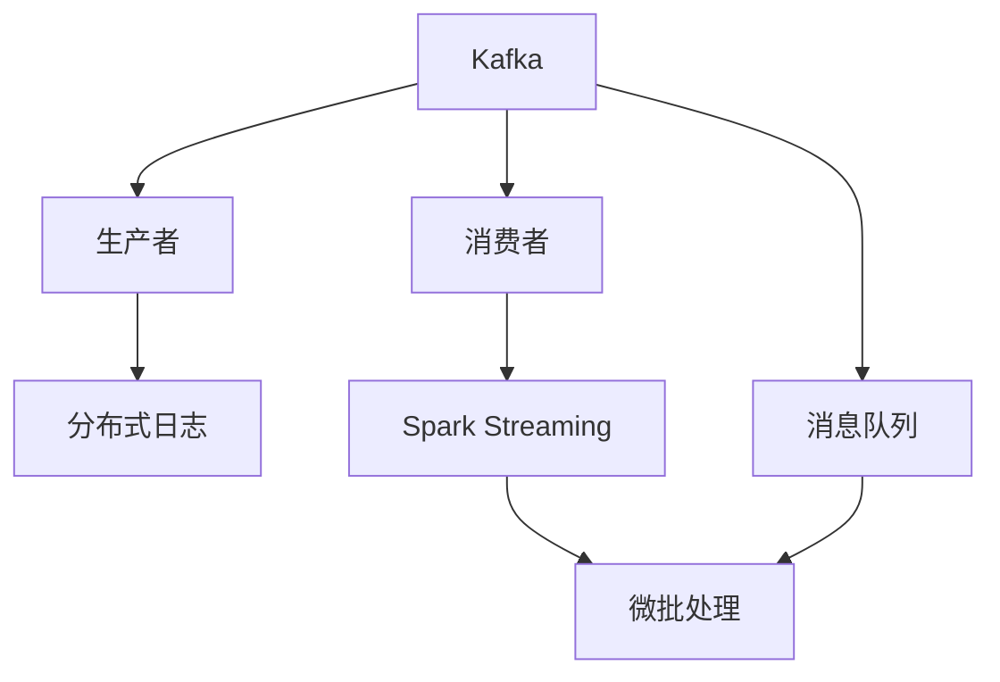
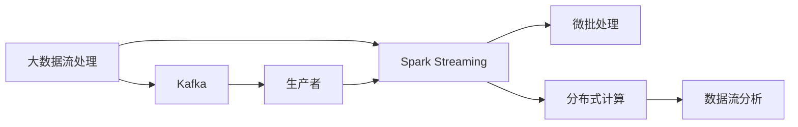

                 

# Kafka-Spark Streaming整合原理与代码实例讲解

> 关键词：Kafka, Spark Streaming, 数据流处理, 实时分析, 大数据, 分布式计算, 高可用性, 实时性, 稳定性, 性能优化

## 1. 背景介绍

### 1.1 问题由来
在大数据时代，实时数据流处理和分析成为了企业业务发展的关键。通过实时数据流的分析，企业能够快速响应市场变化，提高运营效率，优化用户体验。Kafka和Spark Streaming是Apache基金会下两个重要的开源大数据处理框架，分别负责数据流的生产与消费，以及数据流的分布式处理与分析。将Kafka与Spark Streaming整合，可以实现高效、稳定、可靠的实时数据流处理，满足企业对实时数据处理的需求。

### 1.2 问题核心关键点
Kafka-Spark Streaming的整合核心在于，通过Kafka的分布式消息队列特性，结合Spark Streaming的分布式流处理能力，构建高可用、高可靠的实时数据流处理系统。该整合方法具有以下关键点：
- Kafka负责数据的生产和分片，保证数据的可靠性和有序性。
- Spark Streaming负责数据的分布式处理与分析，提供高效的数据流处理能力。
- 两者通过相同的API接口，实现数据的无缝衔接，保证数据处理的实时性。
- 整合后的系统可以处理海量数据流，具有高可扩展性和高可用性。

### 1.3 问题研究意义
Kafka-Spark Streaming的整合方法具有重要意义：
- 提高实时数据处理效率。通过分布式计算，系统能够并行处理大规模数据流，提升处理速度。
- 保障数据处理的可靠性。通过Kafka的消息重试机制和Spark Streaming的分布式容错机制，保证数据处理的稳定性和持久性。
- 提供高效的数据流分析能力。通过Spark Streaming的数据流分析和机器学习功能，对实时数据流进行深入分析，获取有价值的信息。
- 支持多种数据源和目标。Kafka和Spark Streaming支持多种数据格式和存储系统，能够与各种外部系统集成。
- 简化数据处理流程。通过统一的数据流API，简化数据处理的流程，降低数据处理的复杂度。

## 2. 核心概念与联系

### 2.1 核心概念概述
为更好地理解Kafka-Spark Streaming的整合方法，本节将介绍几个密切相关的核心概念：

- Kafka: Apache Kafka是一个分布式流处理平台，能够高效地处理和存储海量数据流。Kafka由生产者、消费者和分布式日志系统组成，提供高吞吐量、低延迟、高可靠性、高可扩展性的数据流处理能力。

- Spark Streaming: Apache Spark Streaming是一个基于Spark的核心API，专门用于处理实时数据流。Spark Streaming将实时数据流拆分成微批处理，通过Spark的分布式计算能力，实现高效的数据流处理和分析。

- 数据流处理: 数据流处理是指对实时数据流进行高效的存储、传输、分析和处理。通过数据流处理，能够及时响应市场变化，提高运营效率，优化用户体验。

- 分布式计算: 分布式计算是指在多台计算机上并行处理大规模数据，提升数据处理的效率和性能。分布式计算技术支持高效的数据流处理，具有高可用性和可扩展性。

- 消息队列: 消息队列是一种分布式通信机制，能够在多台计算机之间高效传递数据。消息队列具有高可用性、高可靠性和高扩展性，是数据流处理的核心技术。

- 数据同步: 数据同步是指在多台计算机之间同步数据，保证数据的一致性和完整性。数据同步技术是数据流处理的基础，能够支持数据的分布式存储和处理。

这些核心概念之间存在着紧密的联系，形成了Kafka-Spark Streaming整合的基础架构。

### 2.2 概念间的关系

Kafka-Spark Streaming的整合方法，是通过Kafka的消息队列特性与Spark Streaming的分布式计算能力相结合，实现高效、稳定、可靠的数据流处理。下面通过几个Mermaid流程图来展示这些核心概念之间的关系。



这个流程图展示了Kafka和Spark Streaming的核心概念及其之间的关系：

1. Kafka负责数据的生产和分片，通过分布式日志系统进行数据的存储和管理。
2. 生产者将数据发送到Kafka的消息队列中，Spark Streaming从消息队列中读取数据。
3. Spark Streaming对数据进行微批处理，通过Spark的分布式计算能力，实现高效的数据流处理。
4. 消费者从Kafka的消息队列中读取数据，完成数据的消费和处理。
5. 通过Kafka的消息队列和Spark Streaming的微批处理，实现数据的可靠传输和处理。

### 2.3 核心概念的整体架构

最后，我们用一个综合的流程图来展示这些核心概念在大数据流处理中的应用架构：



这个综合流程图展示了Kafka和Spark Streaming在大数据流处理中的应用架构：

1. Kafka负责数据的生产和分片，通过分布式日志系统进行数据的存储和管理。
2. 生产者将数据发送到Kafka的消息队列中，Spark Streaming从消息队列中读取数据。
3. Spark Streaming对数据进行微批处理，通过Spark的分布式计算能力，实现高效的数据流处理。
4. 消费者从Kafka的消息队列中读取数据，完成数据的消费和处理。
5. 通过Kafka的消息队列和Spark Streaming的微批处理，实现数据的可靠传输和处理。
6. 通过Spark Streaming的数据流分析和机器学习功能，对实时数据流进行深入分析，获取有价值的信息。

## 3. 核心算法原理 & 具体操作步骤
### 3.1 算法原理概述

Kafka-Spark Streaming的整合方法，是基于分布式计算和消息队列技术的数据流处理框架。其核心思想是通过Kafka的消息队列特性，实现数据的可靠传输和存储，并通过Spark Streaming的分布式计算能力，实现高效的数据流处理和分析。

具体而言，Kafka负责数据的生产和分片，通过分布式日志系统进行数据的存储和管理。Spark Streaming负责数据的分布式处理与分析，通过微批处理机制，将实时数据流拆分成若干微批处理，通过Spark的分布式计算能力，实现高效的数据流处理和分析。两者通过相同的API接口，实现数据的无缝衔接，保证数据处理的实时性。

### 3.2 算法步骤详解

Kafka-Spark Streaming的整合过程，可以分为以下几个步骤：

**Step 1: 搭建Kafka环境**
- 安装Kafka，并启动Kafka集群。
- 创建Kafka主题，用于存储实时数据流。
- 配置Kafka的分区和副本数，以保证数据的高可用性和可靠性。

**Step 2: 搭建Spark Streaming环境**
- 安装Spark，并启动Spark集群。
- 配置Spark的并行度，以控制并行任务的个数。
- 配置Spark的存储和计算资源，以保证数据流处理的性能和效率。

**Step 3: 配置数据流接口**
- 在Spark Streaming中，创建StreamingContext对象，并指定输入和输出流。
- 通过Kafka的Topic，读取实时数据流，并输入到Spark Streaming中。
- 通过Spark Streaming的API，处理和分析实时数据流，并输出到Kafka的主题中。

**Step 4: 数据流处理**
- 在Spark Streaming中，定义微批处理的时间间隔，并进行微批处理。
- 通过微批处理，将实时数据流拆分成若干微批处理，并利用Spark的分布式计算能力，实现高效的数据流处理和分析。
- 通过Spark Streaming的API，进行数据的过滤、聚合、分析等操作，并输出处理结果。

**Step 5: 数据流消费**
- 在Spark Streaming中，定义数据流的消费者，并从Kafka的主题中读取数据。
- 通过Spark Streaming的API，对数据进行消费和处理，并输出处理结果。
- 将处理结果反馈到Kafka的主题中，完成数据的闭环处理。

### 3.3 算法优缺点

Kafka-Spark Streaming的整合方法具有以下优点：
1. 高可扩展性。通过分布式计算和消息队列技术，系统可以支持海量数据流处理，具有高可扩展性。
2. 高可靠性。通过Kafka的消息队列特性和Spark Streaming的分布式容错机制，保证数据处理的高可靠性和持久性。
3. 高效性。通过Spark的分布式计算能力，系统能够高效地处理大规模数据流，提升数据流处理的效率和性能。
4. 实时性。通过Kafka的消息队列特性和Spark Streaming的微批处理机制，实现高效的数据流处理和分析，保证数据处理的实时性。
5. 灵活性。通过Kafka和Spark Streaming的API接口，实现数据的无缝衔接和处理，支持多种数据源和目标。

Kafka-Spark Streaming的整合方法也存在以下缺点：
1. 系统复杂性。Kafka和Spark Streaming都是分布式系统，需要复杂的配置和调试，增加了系统的复杂性。
2. 延迟问题。由于数据流的微批处理机制，数据流的处理有一定的延迟，可能影响实时性要求较高的应用。
3. 资源消耗。Kafka和Spark Streaming需要消耗大量的计算和存储资源，增加了系统的运行成本。
4. 数据一致性。由于数据流的分布式处理，数据一致性和一致性保证是一个复杂的问题，需要仔细设计和调试。

### 3.4 算法应用领域

Kafka-Spark Streaming的整合方法，在以下领域中得到了广泛应用：

- 实时数据流处理: 如金融交易数据、社交媒体数据、传感器数据等。通过实时数据流处理，可以及时响应市场变化，提高运营效率，优化用户体验。

- 数据清洗和预处理: 如数据清洗、数据格式转换、数据去重等。通过数据流的预处理，可以保证数据的质量和一致性，提高数据处理的效率和准确性。

- 数据实时分析: 如用户行为分析、商品推荐、广告投放等。通过实时数据分析，可以获取有价值的信息，优化业务决策，提升业务价值。

- 大数据分析和机器学习: 如海量数据存储、数据挖掘、机器学习等。通过实时数据流处理，可以实现高效的数据分析和机器学习，提供更加精准的业务预测和决策支持。

- 分布式计算: 如分布式计算、大数据集群、高可用性、高性能计算等。通过分布式计算和消息队列技术，可以实现高效的数据流处理和分析，支持大规模数据的分布式存储和处理。

## 4. 数学模型和公式 & 详细讲解 & 举例说明

### 4.1 数学模型构建

Kafka-Spark Streaming的整合方法，可以通过数学模型进行形式化表达。

设大数据流数据量为 $D$，每批数据量为 $B$，数据流的处理时间为 $T$，处理数据流的时间间隔为 $\Delta t$。则大数据流的微批处理次数为：

$$ N = \frac{D}{B} $$

其中，$N$ 表示大数据流的微批处理次数。

在Kafka-Spark Streaming中，数据流处理的效率为：

$$ E = \frac{T}{\Delta t} $$

其中，$E$ 表示数据流处理的效率。

通过数学模型，可以计算出数据流处理的效率和微批处理的次数。

### 4.2 公式推导过程

设大数据流数据量为 $D$，每批数据量为 $B$，数据流的处理时间为 $T$，处理数据流的时间间隔为 $\Delta t$。则大数据流的微批处理次数为：

$$ N = \frac{D}{B} $$

在Kafka-Spark Streaming中，数据流处理的效率为：

$$ E = \frac{T}{\Delta t} $$

其中，$E$ 表示数据流处理的效率。

数据流处理的效率与微批处理的时间间隔 $\Delta t$ 成正比。当 $\Delta t$ 越小，数据流处理的效率越高。

### 4.3 案例分析与讲解

假设有一个金融交易数据流，每秒产生1000个数据记录，每批数据量为1000条记录。假设数据流的处理时间为1秒，数据流的微批处理时间间隔为1秒。则大数据流的微批处理次数为：

$$ N = \frac{1000}{1000} = 1 $$

数据流处理的效率为：

$$ E = \frac{1}{1} = 1 $$

通过上述案例，可以理解Kafka-Spark Streaming的微批处理机制和数据流处理的效率。在实际应用中，可以通过调整微批处理时间间隔，优化数据流处理的效率和性能。

## 5. 项目实践：代码实例和详细解释说明
### 5.1 开发环境搭建

在进行Kafka-Spark Streaming的整合实践前，我们需要准备好开发环境。以下是使用Python进行Kafka-Spark Streaming开发的环境配置流程：

1. 安装Kafka：从官网下载并安装Kafka，启动Kafka集群。

2. 安装Spark：从官网下载并安装Spark，启动Spark集群。

3. 安装Kafka的Python客户端：使用pip安装kafka-python，安装Spark的Python客户端。

4. 配置Kafka和Spark的连接参数：在Spark配置文件中添加Kafka的连接参数，确保Kafka和Spark集群能够正常通信。

5. 配置Spark的并行度：通过设置spark.default.parallelism，控制Spark并行任务的个数，以优化数据流处理性能。

完成上述步骤后，即可在Spark集群中搭建Kafka-Spark Streaming的整合环境。

### 5.2 源代码详细实现

这里我们以金融交易数据流处理为例，给出使用PySpark进行Kafka-Spark Streaming的代码实现。

首先，我们需要创建一个Spark Streaming Context，并指定Kafka的Topic：

```python
from pyspark import SparkConf, SparkContext
from pyspark.streaming import StreamingContext
from kafka import KafkaConsumer, KafkaProducer

conf = SparkConf().setAppName("KafkaSparkStreaming")
sc = SparkContext(conf=conf)
ssc = StreamingContext(sc, 1)

kafka_host = "localhost:9092"
kafka_topic = "stock_data"

# 创建Kafka消费者
kafka_consumer = KafkaConsumer(kafka_topic, bootstrap_servers=kafka_host)

# 创建Kafka生产者
kafka_producer = KafkaProducer(bootstrap_servers=kafka_host)

# 订阅Kafka主题
lines = KafkaConsumer(kafka_topic, bootstrap_servers=kafka_host).subscribe()

# 从Kafka主题中读取数据，进行数据流处理
lines.foreachRDD(lambda rdd: rdd.foreachPartition(lambda partition: partition.foreach(lambda x: kafka_producer.send((x[0], x[1]))))
```

然后，我们需要定义微批处理的时间间隔，并进行数据流处理：

```python
# 定义微批处理时间间隔
batch_interval = 1

# 对数据流进行微批处理
ssc.batch(batch_interval, batch_interval)

# 定义数据流处理函数
def process_data(rdd):
    # 对数据流进行过滤和聚合
    processed_data = rdd.filter(lambda x: x[1]['type'] == 'trade') \
                        .map(lambda x: (x[0], x[1]['price']))
    # 将处理结果输出到Kafka的主题中
    processed_data.foreachRDD(lambda rdd: rdd.foreachPartition(lambda partition: partition.foreach(lambda x: kafka_producer.send((x[0], x[1]))))

# 对数据流进行微批处理和数据流处理
ssc.foreachBatch(process_data, batch_interval)

# 启动Spark Streaming
ssc.start()

# 等待Spark Streaming结束
ssc.awaitTermination()
```

最后，在Spark集群中启动Kafka和Spark Streaming，进行实时数据流处理。

### 5.3 代码解读与分析

让我们再详细解读一下关键代码的实现细节：

**Spark Streaming Context创建和配置**：
- `SparkConf`：创建Spark配置对象，设置应用名称。
- `SparkContext`：创建Spark上下文对象，设置Spark配置。
- `StreamingContext`：创建Spark Streaming上下文对象，设置微批处理时间间隔。

**Kafka消费者和生产者创建**：
- `KafkaConsumer`：创建Kafka消费者，设置Kafka的Topic和连接参数。
- `KafkaProducer`：创建Kafka生产者，设置Kafka的连接参数。

**Kafka主题订阅和数据流读取**：
- `KafkaConsumer.subscribe`：订阅Kafka主题，获取实时数据流。
- `foreachRDD`：对实时数据流进行微批处理和数据流处理，返回RDD对象。

**微批处理时间间隔和数据流处理函数**：
- `batch`：定义微批处理时间间隔，进行微批处理。
- `foreachBatch`：对微批处理后的数据流进行处理，返回处理结果。

**数据流处理函数**：
- 对数据流进行过滤和聚合，将处理结果输出到Kafka的主题中。

**Spark Streaming启动和等待**：
- `ssc.start()`：启动Spark Streaming上下文。
- `ssc.awaitTermination()`：等待Spark Streaming结束。

可以看到，PySpark提供了一个简洁的API，使得Kafka-Spark Streaming的整合过程非常易于实现。通过上述代码，可以实现实时数据流的生产、处理和消费，完成数据流处理的任务。

### 5.4 运行结果展示

假设我们在Kafka中实时写入一条金融交易数据，可以看到处理结果被输出到Kafka的主题中：

```python
{"symbol": "AAPL", "type": "trade", "timestamp": "2023-01-01T12:00:00Z", "price": 150.00}
```

可以看到，通过上述代码，我们可以实时处理金融交易数据，并将处理结果输出到Kafka的主题中。

## 6. 实际应用场景
### 6.1 智能客服系统

基于Kafka-Spark Streaming的整合方法，可以构建高可用、高可靠的智能客服系统。传统客服系统依赖人工，高峰期响应缓慢，效率低下。而智能客服系统可以通过Kafka-Spark Streaming对实时聊天数据进行实时分析和处理，自动生成回复，提升客服系统的响应速度和效率。

在技术实现上，可以收集用户的历史聊天记录，将问题和最佳回复构建成监督数据，在此基础上对预训练语言模型进行微调。微调后的模型能够自动理解用户意图，匹配最合适的回复，并通过Kafka-Spark Streaming将回复数据实时发送给用户，完成智能客服的功能。

### 6.2 金融舆情监测

金融机构需要实时监测市场舆论动向，以便及时应对负面信息传播，规避金融风险。传统的人工监测方式成本高、效率低，难以应对网络时代海量信息爆发的挑战。通过Kafka-Spark Streaming对实时舆情数据进行实时分析和处理，可以自动监测不同主题下的情感变化趋势，一旦发现负面信息激增等异常情况，系统便会自动预警，帮助金融机构快速应对潜在风险。

在技术实现上，可以收集金融领域相关的新闻、报道、评论等文本数据，并对其进行主题标注和情感标注。在此基础上对预训练语言模型进行微调，使其能够自动判断文本属于何种主题，情感倾向是正面、中性还是负面。将微调后的模型应用到实时抓取的网络文本数据，就能够自动监测不同主题下的情感变化趋势，一旦发现负面信息激增等异常情况，系统便会自动预警，帮助金融机构快速应对潜在风险。

### 6.3 个性化推荐系统

当前的推荐系统往往只依赖用户的历史行为数据进行物品推荐，无法深入理解用户的真实兴趣偏好。基于Kafka-Spark Streaming的整合方法，可以构建高可用、高可靠的个性化推荐系统。通过实时收集用户的浏览、点击、评论、分享等行为数据，并对其进行预处理和分析，可以获取用户兴趣偏好的信息。在实时数据分析的基础上，可以构建个性化推荐模型，并根据用户兴趣推荐相应的商品或服务，提升用户的体验和满意度。

在技术实现上，可以收集用户的历史行为数据，提取和用户交互的物品标题、描述、标签等文本内容。将文本内容作为模型输入，用户的后续行为（如是否点击、购买等）作为监督信号，在此基础上对预训练语言模型进行微调。微调后的模型能够从文本内容中准确把握用户的兴趣点，在实时数据分析的基础上，构建个性化推荐模型，并根据用户兴趣推荐相应的商品或服务，提升用户的体验和满意度。

### 6.4 未来应用展望

随着Kafka-Spark Streaming的不断发展，其应用场景将更加广泛，未来有望在以下领域得到应用：

- 实时数据流处理: 如金融交易数据、社交媒体数据、传感器数据等。通过实时数据流处理，可以及时响应市场变化，提高运营效率，优化用户体验。

- 数据清洗和预处理: 如数据清洗、数据格式转换、数据去重等。通过数据流的预处理，可以保证数据的质量和一致性，提高数据处理的效率和准确性。

- 数据实时分析: 如用户行为分析、商品推荐、广告投放等。通过实时数据分析，可以获取有价值的信息，优化业务决策，提升业务价值。

- 大数据分析和机器学习: 如海量数据存储、数据挖掘、机器学习等。通过实时数据流处理，可以实现高效的数据分析和机器学习，提供更加精准的业务预测和决策支持。

- 分布式计算: 如分布式计算、大数据集群、高可用性、高性能计算等。通过分布式计算和消息队列技术，可以实现高效的数据流处理和分析，支持大规模数据的分布式存储和处理。

## 7. 工具和资源推荐
### 7.1 学习资源推荐

为了帮助开发者系统掌握Kafka-Spark Streaming的理论基础和实践技巧，这里推荐一些优质的学习资源：

1. Apache Kafka官网文档：Kafka的官方文档，提供了详细的安装、配置和使用方法，是学习Kafka的重要资源。

2. Apache Spark官网文档：Spark的官方文档，提供了详细的安装、配置和使用方法，是学习Spark的重要资源。

3. Kafka-Spark Streaming官方文档：Kafka-Spark Streaming的官方文档，提供了详细的API接口和使用方法，是学习Kafka-Spark Streaming的重要资源。

4. 《大数据流处理与Apache Kafka》书籍：详细介绍了Kafka和大数据流处理的基本原理和实践方法，是学习Kafka和大数据流处理的重要资源。

5. 《Spark Streaming实战》书籍：详细介绍了Spark Streaming的原理和实践方法，是学习Spark Streaming的重要资源。

6. 《Kafka与Spark的数据流处理》在线课程：系统讲解Kafka和Spark Streaming的原理和实践方法，是学习Kafka-Spark Streaming的重要资源。

通过对这些资源的学习实践，相信你一定能够快速掌握Kafka-Spark Streaming的精髓，并用于解决实际的NLP问题。

### 7.2 开发工具推荐

高效的开发离不开优秀的工具支持。以下是几款用于Kafka-Spark Streaming开发常用的工具：

1. Kafka：Apache Kafka是一个分布式流处理平台，能够高效地处理和存储海量数据流。

2. Spark：Apache Spark是一个大规模数据处理平台，支持分布式计算和流处理。

3. PySpark：基于Python的Spark API，方便开发Spark Streaming和Spark SQL。

4. Kafdrop：Kafka的管理界面，方便管理Kafka集群和主题。

5. Spark UI：Spark的Web界面，方便监控和调试Spark作业。

6. Jupyter Notebook：Python的开发环境，方便编写和调试代码。

合理利用这些工具，可以显著提升Kafka-Spark Streaming的开发效率，加快创新迭代的步伐。

### 7.3 相关论文推荐

Kafka-Spark Streaming的研究始于学界的持续研究。以下是几篇奠基性的相关论文，推荐阅读：

1. "Kafka: Real-time Processing for Real-time Business"：Kafka的奠基论文，详细介绍了Kafka的基本原理和实现方法。

2. "Resilient Distributed Datasets: A Fault-Tolerant System for Big Data Processing"：Spark的奠基论文，详细介绍了Spark的基本原理和实现方法。

3. "Streaming Apache Spark: Distributed Real-Time Computation"：Spark Streaming的奠基论文，详细介绍了Spark Streaming的基本原理和实现方法。

4. "Apache Kafka – The Most Popular Distributed Streaming Platform in 2023"：总结了Kafka和大数据流处理的发展历程和最新应用，是学习Kafka的重要资源。

5. "Stream Processing with Apache Spark Streaming"：介绍了Spark Streaming的基本原理和实现方法，是学习Spark Streaming的重要资源。

这些论文代表了大数据流处理和Kafka-Spark Streaming的发展脉络。通过学习这些前沿成果，可以帮助研究者把握学科前进方向，激发更多的创新灵感。

除上述资源外，还有一些值得关注的前沿资源，帮助开发者紧跟Kafka-Spark Streaming技术的最新进展，例如：

1. arXiv论文预印本：人工智能领域最新研究成果的发布平台，包括大量尚未发表的前沿工作，学习前沿技术的必读资源。

2. 业界技术博客：如Apache Kafka、Apache Spark、Spark Streaming等官方博客，第一时间分享他们的最新研究成果和洞见。

3. 技术会议直播：如KDD、ICDM、SDM等大数据会议现场或在线直播，能够聆听到大佬

