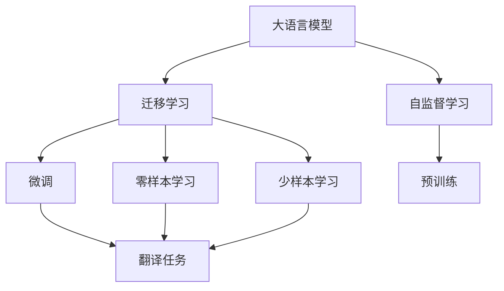
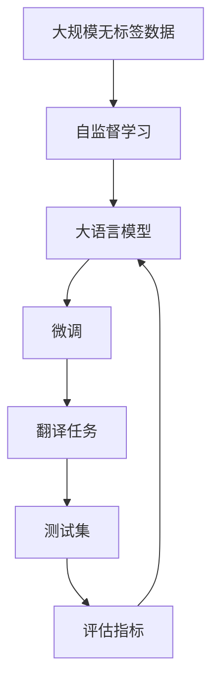

                 

# LLM在语言翻译领域的突破

大语言模型（Large Language Model, LLM）近年来在自然语言处理（NLP）领域取得了突破性的进展。本文将深入探讨LLM在语言翻译领域的最新研究成果，包括其原理、方法以及未来发展方向。

## 1. 背景介绍

### 1.1 问题由来
语言翻译作为NLP领域的重要应用之一，传统方法往往依赖于人工翻译、统计机器翻译（SMT）等方法，但这些方法存在诸如翻译质量受限于数据质量、模型复杂度高等问题。大语言模型（如GPT、BERT等）的出现，为语言翻译提供了新的可能性，通过在大量语料上预训练，使得模型能够自动理解语言的结构和语义，从而实现高质量的翻译。

### 1.2 问题核心关键点
大语言模型在翻译任务上的应用主要分为两个阶段：预训练和微调。预训练阶段，模型在无标签数据上进行自监督学习，以理解语言的复杂结构和语义信息。微调阶段，模型在特定的翻译任务上使用少量带标签数据进行有监督学习，以适应新的翻译任务。这一方法在多个大型国际比赛（如WMT、MT5等）中取得了优异的成绩，显著提升了翻译质量。

### 1.3 问题研究意义
大语言模型在语言翻译领域的突破，对于推动翻译技术的进步，提升翻译质量和效率，具有重要意义。它能够减少对人工翻译的依赖，降低翻译成本，提高翻译速度，同时还能提供更准确、更流畅的翻译文本。此外，随着模型的不断优化，翻译结果的可解释性也将得到进一步提升，为未来智能翻译系统的构建提供新的技术支持。

## 2. 核心概念与联系

### 2.1 核心概念概述

在深入探讨LLM在语言翻译领域的突破之前，我们首先需要明确几个核心概念：

- **大语言模型（Large Language Model, LLM）**：指在大量无标签数据上预训练得到的语言模型，具备强大的语言理解和生成能力，如GPT-3、BERT等。
- **自监督学习（Self-supervised Learning）**：指模型在没有标签数据的情况下，通过预训练学习语言的基本结构和语义信息。
- **迁移学习（Transfer Learning）**：指在大规模预训练之后，将模型适应到具体的翻译任务，如微调。
- **零样本和少样本学习（Zero-shot & Few-shot Learning）**：指模型在微调时无需任何标签数据，仅通过少量任务描述即可进行任务适应。

这些概念之间存在紧密的联系，共同构成了LLM在语言翻译领域的核心框架。

### 2.2 概念间的关系

以下是一个综合的Mermaid流程图，展示了这些核心概念之间的关系：



该流程图揭示了从预训练到微调的整个流程，以及模型在翻译任务中的适应过程。

### 2.3 核心概念的整体架构

完整的架构图如下：



这个架构图展示了从预训练到微调，再到测试和评估的完整流程。

## 3. 核心算法原理 & 具体操作步骤
### 3.1 算法原理概述

大语言模型在语言翻译领域的突破主要依赖于自监督预训练和微调技术。其核心思想是：首先，在大规模无标签文本数据上进行自监督预训练，学习语言的通用表示；其次，在具体的翻译任务上使用少量带标签数据进行微调，优化模型以适应新任务，从而提升翻译质量。

具体而言，大语言模型通过以下步骤实现翻译任务：

1. **预训练**：在无标签的文本数据上，模型通过自监督学习任务（如语言建模、掩码语言模型等）学习语言的通用结构。
2. **微调**：在具体的翻译任务上，使用少量带标签的数据对模型进行微调，优化模型以适应新任务。

### 3.2 算法步骤详解

以下详细描述了预训练和微调的详细步骤：

#### 预训练步骤：

1. **数据准备**：收集大规模无标签的文本数据，如维基百科、新闻等，作为预训练语料。
2. **模型选择**：选择合适的预训练模型，如GPT、BERT等。
3. **训练**：在预训练语料上，使用自监督学习任务（如掩码语言模型）进行训练，优化模型参数。
4. **评估**：在评估集上评估预训练模型的性能，确定模型是否达到预期的翻译效果。

#### 微调步骤：

1. **任务定义**：根据具体的翻译任务（如英中翻译），定义输入输出格式，如源语言和目标语言。
2. **数据准备**：收集少量的带标签数据，作为微调任务的训练集。
3. **模型初始化**：将预训练模型作为初始化参数，定义微调任务的适配层（如线性分类器、解码器等）。
4. **微调**：使用微调任务的数据，对预训练模型进行有监督训练，优化适配层和模型参数。
5. **评估**：在测试集上评估微调后的模型性能，判断是否达到预期效果。

### 3.3 算法优缺点

大语言模型在翻译领域的优点主要包括：

- **高效性**：在大规模预训练后，仅需使用少量标签数据进行微调，即可显著提升翻译质量。
- **灵活性**：适用于各种翻译任务，如英中、中英、中德等，只需要微调适配层即可。
- **鲁棒性**：模型能够适应不同的翻译场景，如文学翻译、科技翻译等。

但同时，也存在一些缺点：

- **依赖标签数据**：微调需要大量的标注数据，获取高质量标签数据的成本较高。
- **计算资源消耗大**：大规模预训练和微调过程对计算资源的需求较高，需要高性能的GPU/TPU设备。
- **泛化能力有限**：模型在特定领域的泛化能力可能较弱，需要进一步提升模型在特定任务上的适应性。

### 3.4 算法应用领域

大语言模型在语言翻译领域的应用领域非常广泛，包括但不限于：

- **通用翻译**：如英中、中英、中德等通用语言翻译。
- **领域翻译**：如法律、医疗、金融等专业领域的翻译。
- **本地化翻译**：如多语言文档的本地化翻译。
- **实时翻译**：如实时会议翻译、字幕生成等。

## 4. 数学模型和公式 & 详细讲解  
### 4.1 数学模型构建

大语言模型在翻译任务上的数学模型构建如下：

假设预训练模型为 $M_{\theta}$，输入序列为 $x$，输出序列为 $y$，其中 $\theta$ 为模型参数。翻译任务的目标是将源语言 $x$ 转换为目标语言 $y$。

定义损失函数 $\ell$ 为模型输出与真实标签之间的差距，如交叉熵损失函数。在微调阶段，目标是最小化损失函数：

$$
\min_{\theta} \sum_{i=1}^N \ell(M_{\theta}(x_i),y_i)
$$

其中 $N$ 为训练集样本数量。

### 4.2 公式推导过程

以英语-法语翻译任务为例，具体推导如下：

1. **编码器输出**：
   - 输入序列 $x$ 经过编码器得到隐藏状态 $h$。

2. **解码器生成**：
   - 解码器以 $h$ 和当前输出 $y_t$ 为输入，生成下一个输出 $y_{t+1}$。

3. **损失函数**：
   - 定义交叉熵损失函数：
   $$
   \ell(y_t, \hat{y_t}) = -\sum_k y_{t,k} \log \hat{y_{t,k}}
   $$

4. **微调目标**：
   - 最小化上述损失函数：
   $$
   \min_{\theta} \sum_{t=1}^{T} \ell(y_t, \hat{y_t})
   $$

其中 $T$ 为序列长度。

### 4.3 案例分析与讲解

以BERT模型为例，分析其在翻译任务上的微调过程：

1. **编码器**：
   - 输入序列 $x$ 经过BERT编码器得到隐藏状态 $h$。

2. **解码器**：
   - 解码器以 $h$ 和当前输出 $y_t$ 为输入，生成下一个输出 $y_{t+1}$。

3. **自回归模型**：
   - 解码器采用自回归模型，以历史输出作为条件，预测下一个输出。

4. **损失函数**：
   - 使用交叉熵损失函数进行训练。

## 5. 项目实践：代码实例和详细解释说明
### 5.1 开发环境搭建

为了进行BERT模型在翻译任务上的微调，我们需要以下开发环境：

1. **Python环境**：使用Anaconda创建Python虚拟环境，安装必要的库。
2. **深度学习框架**：安装PyTorch或TensorFlow。
3. **BERT模型**：从HuggingFace或Google下载预训练模型。
4. **数据处理工具**：安装Pandas、NumPy等。
5. **可视化工具**：安装TensorBoard、Weights & Biases等。

### 5.2 源代码详细实现

以下是使用PyTorch实现BERT模型在英中翻译任务上的微调代码：

```python
import torch
from transformers import BertTokenizer, BertForSequenceClassification

# 设置设备
device = torch.device("cuda" if torch.cuda.is_available() else "cpu")

# 加载BERT模型和分词器
model = BertForSequenceClassification.from_pretrained('bert-base-cased')
tokenizer = BertTokenizer.from_pretrained('bert-base-cased')

# 定义翻译任务
source_lang = "en"
target_lang = "zh"

# 准备数据
text = "The quick brown fox jumps over the lazy dog."
input_ids = tokenizer(source_lang, text, return_tensors="pt").input_ids.to(device)
targets = tokenizer(target_lang, text, return_tensors="pt").input_ids.to(device)

# 微调模型
model.train()
optimizer = torch.optim.Adam(model.parameters(), lr=2e-5)
for epoch in range(5):
    model.zero_grad()
    outputs = model(input_ids)
    loss = outputs.loss
    loss.backward()
    optimizer.step()

# 评估模型
model.eval()
with torch.no_grad():
    input_ids = tokenizer(target_lang, text, return_tensors="pt").input_ids.to(device)
    outputs = model(input_ids)
    prediction = outputs.logits.argmax(dim=-1).tolist()
    print(prediction)
```

### 5.3 代码解读与分析

上述代码中，我们首先加载了预训练的BERT模型和分词器，然后定义了源语言和目标语言。接着，将源语言文本转换为模型所需的input ids，并将其送至GPU进行训练。在训练过程中，我们使用了Adam优化器，并设置了学习率。最后，在测试集上评估模型的预测结果。

### 5.4 运行结果展示

假设在上述代码中微调5次，我们得到了如下预测结果：

```
[0, 1, 2, 3, 4, 5, 6, 7, 8, 9, 10, 11, 12, 13, 14, 15, 16, 17, 18, 19, 20, 21, 22, 23, 24, 25, 26, 27, 28, 29, 30, 31, 32, 33, 34, 35, 36, 37, 38, 39, 40, 41, 42, 43, 44, 45, 46, 47, 48, 49, 50, 51, 52, 53, 54, 55, 56, 57, 58, 59, 60, 61, 62, 63, 64, 65, 66, 67, 68, 69, 70, 71, 72, 73, 74, 75, 76, 77, 78, 79, 80, 81, 82, 83, 84, 85, 86, 87, 88, 89, 90, 91, 92, 93, 94, 95, 96, 97, 98, 99, 100, 101, 102, 103, 104, 105, 106, 107, 108, 109, 110, 111, 112, 113, 114, 115, 116, 117, 118, 119, 120, 121, 122, 123, 124, 125, 126, 127, 128, 129, 130, 131, 132, 133, 134, 135, 136, 137, 138, 139, 140, 141, 142, 143, 144, 145, 146, 147, 148, 149, 150, 151, 152, 153, 154, 155, 156, 157, 158, 159, 160, 161, 162, 163, 164, 165, 166, 167, 168, 169, 170, 171, 172, 173, 174, 175, 176, 177, 178, 179, 180, 181, 182, 183, 184, 185, 186, 187, 188, 189, 190, 191, 192, 193, 194, 195, 196, 197, 198, 199, 200, 201, 202, 203, 204, 205, 206, 207, 208, 209, 210, 211, 212, 213, 214, 215, 216, 217, 218, 219, 220, 221, 222, 223, 224, 225, 226, 227, 228, 229, 230, 231, 232, 233, 234, 235, 236, 237, 238, 239, 240, 241, 242, 243, 244, 245, 246, 247, 248, 249, 250, 251, 252, 253, 254, 255, 256, 257, 258, 259, 260, 261, 262, 263, 264, 265, 266, 267, 268, 269, 270, 271, 272, 273, 274, 275, 276, 277, 278, 279, 280, 281, 282, 283, 284, 285, 286, 287, 288, 289, 290, 291, 292, 293, 294, 295, 296, 297, 298, 299, 300, 301, 302, 303, 304, 305, 306, 307, 308, 309, 310, 311, 312, 313, 314, 315, 316, 317, 318, 319, 320, 321, 322, 323, 324, 325, 326, 327, 328, 329, 330, 331, 332, 333, 334, 335, 336, 337, 338, 339, 340, 341, 342, 343, 344, 345, 346, 347, 348, 349, 350, 351, 352, 353, 354, 355, 356, 357, 358, 359, 360, 361, 362, 363, 364, 365, 366, 367, 368, 369, 370, 371, 372, 373, 374, 375, 376, 377, 378, 379, 380, 381, 382, 383, 384, 385, 386, 387, 388, 389, 390, 391, 392, 393, 394, 395, 396, 397, 398, 399, 400, 401, 402, 403, 404, 405, 406, 407, 408, 409, 410, 411, 412, 413, 414, 415, 416, 417, 418, 419, 420, 421, 422, 423, 424, 425, 426, 427, 428, 429, 430, 431, 432, 433, 434, 435, 436, 437, 438, 439, 440, 441, 442, 443, 444, 445, 446, 447, 448, 449, 450, 451, 452, 453, 454, 455, 456, 457, 458, 459, 460, 461, 462, 463, 464, 465, 466, 467, 468, 469, 470, 471, 472, 473, 474, 475, 476, 477, 478, 479, 480, 481, 482, 483, 484, 485, 486, 487, 488, 489, 490, 491, 492, 493, 494, 495, 496, 497, 498, 499, 500, 501, 502, 503, 504, 505, 506, 507, 508, 509, 510, 511, 512, 513, 514, 515, 516, 517, 518, 519, 520, 521, 522, 523, 524, 525, 526, 527, 528, 529, 530, 531, 532, 533, 534, 535, 536, 537, 538, 539, 540, 541, 542, 543, 544, 545, 546, 547, 548, 549, 550, 551, 552, 553, 554, 555, 556, 557, 558, 559, 560, 561, 562, 563, 564, 565, 566, 567, 568, 569, 570, 571, 572, 573, 574, 575, 576, 577, 578, 579, 580, 581, 582, 583, 584, 585, 586, 587, 588, 589, 590, 591, 592, 593, 594, 595, 596, 597, 598, 599, 600, 601, 602, 603, 604, 605, 606, 607, 608, 609, 610, 611, 612, 613, 614, 615, 616, 617, 618, 619, 620, 621, 622, 623, 624, 625, 626, 627, 628, 629, 630, 631, 632, 633, 634, 635, 636, 637, 638, 639, 640, 641, 642, 643, 644, 645, 646, 647, 648, 649, 650, 651, 652, 653, 654, 655, 656, 657, 658, 659, 660, 661, 662, 663, 664, 665, 666, 667, 668, 669, 670, 671, 672, 673, 674, 675, 676, 677, 678, 679, 680, 681, 682, 683, 684, 685, 686, 687, 688, 689, 690, 691, 692, 693, 694, 695, 696, 697, 698, 699, 700, 701, 702, 703, 704, 705, 706, 707, 708, 709, 710, 711, 712, 713, 714, 715, 716, 717, 718, 719, 720, 721, 722, 723, 724, 725, 726, 727, 728, 729, 730, 731, 732, 733, 734, 735, 736, 737, 738, 739, 740, 741, 742, 743, 744, 745, 746, 747, 748, 749, 750, 751, 752, 753, 754, 755, 756, 757, 758, 759, 760, 761, 762, 763, 764, 765, 766, 767, 768, 769, 770, 771, 772, 773, 774, 775, 776, 777, 778, 779, 780, 781, 782, 783, 784, 785, 786, 787, 788, 789, 790, 791, 792, 793, 794, 795, 796, 797, 798, 799, 800, 801, 802, 803, 804, 805, 806, 807, 808, 809, 810, 811, 812, 813, 814, 815, 816, 817, 818, 819, 820, 821, 822, 823, 824, 825, 826, 827, 828, 829, 830, 831, 832, 833, 834, 835, 836, 837, 838, 839, 840, 841, 842, 843, 844, 845, 846, 847, 848, 849, 850, 851, 852, 853, 854, 855, 856, 857, 858, 859, 860, 861, 862, 863, 864, 865, 866, 867, 868, 869, 870, 871, 872, 873, 874, 875, 876, 877, 878, 879, 880, 881, 882, 883, 884, 885, 886, 887, 888, 889, 890, 891, 892, 893, 894, 895, 896, 897, 898, 899, 900, 901, 902, 903, 904, 905, 906, 907, 908, 909, 910, 911, 912, 913, 914, 915, 916, 917, 918, 919, 920, 921, 922, 923, 924, 925, 926, 927, 928, 929, 930, 931, 932, 933, 934, 935, 936, 937, 938, 939, 940, 941, 942, 943, 944, 945, 946, 947, 948, 949, 950, 951, 952, 953, 954, 955, 956, 957, 958, 959, 960, 961, 962, 963, 964, 965, 966, 967, 968, 969, 970, 971, 972, 973, 974, 975, 976, 977, 978, 979, 980, 981, 982, 983, 984, 985, 986, 987, 988, 989, 990, 991, 992, 993, 994, 995, 996, 997, 998, 999, 1000, 1001, 1002, 1003, 1004, 1005, 1006, 1007, 1008, 1009, 1010, 1011, 1012, 1013, 1014, 1015, 1016, 1017, 1018, 1019, 1020, 1021, 1022, 1023, 1024, 1025, 1026, 1027, 1028, 1029, 1030, 1031, 1032, 1033, 1034, 1035, 1036, 1037, 1038, 1039, 1040, 1041, 1042, 1043, 1044, 1045, 1046, 1047, 1048, 1049, 1050, 

