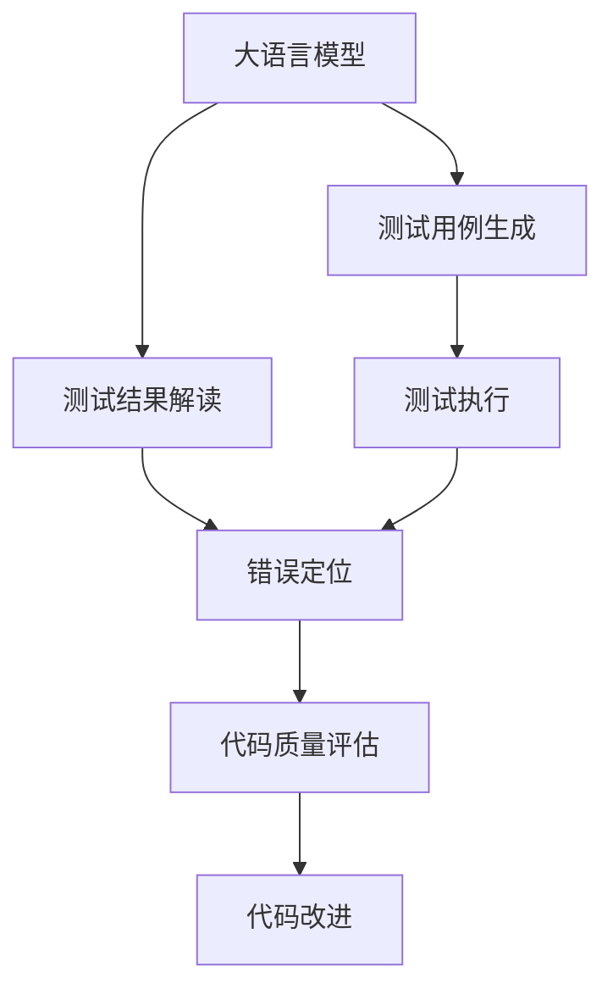
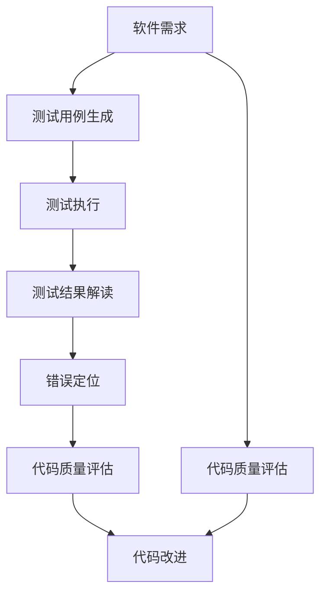

                 

# LLM辅助软件测试：提高代码质量的新方法

> 关键词：大语言模型(LLM), 软件测试, 代码质量, 自然语言处理(NLP), 测试自动化, 深度学习

## 1. 背景介绍

### 1.1 问题由来
软件测试是软件开发过程中至关重要的环节，其目的是发现并修复软件中的错误和缺陷。然而，随着软件规模的增大和复杂度的提升，手工测试的成本和难度急剧增加。测试自动化是解决这一问题的有效手段，但依然面临诸多挑战，包括：

1. **测试用例设计困难**：特别是对于自动化测试，设计覆盖全面的测试用例非常耗时且复杂。
2. **测试场景多样性**：现代软件通常涉及多种环境和用户场景，测试需要覆盖多种情况，这对测试用例的全面性提出了很高要求。
3. **测试结果解读困难**：测试结果通常以日志、报告等形式呈现，人工解读和分析往往费时费力，且容易出错。
4. **隐性错误难发现**：由于隐性错误的隐蔽性，传统测试方法很难发现这些难以重现的问题。

为了解决这些挑战，研究者开始探索利用人工智能和大语言模型(LLM)辅助软件测试的新方法。LLM凭借其强大的自然语言理解和生成能力，可以辅助生成测试用例、自动解读测试结果、甚至发现隐性错误，大大提升软件测试的效率和准确性。

### 1.2 问题核心关键点
本文聚焦于LLM在软件测试中的应用，但同时也会兼顾测试自动化、代码质量提升等前沿技术，以期对软件测试实践提供更全面的指导。

## 2. 核心概念与联系

### 2.1 核心概念概述

为更好地理解LLM辅助软件测试的方法，本节将介绍几个密切相关的核心概念：

- **大语言模型(LLM)**：以自回归(如GPT)或自编码(如BERT)模型为代表的大规模预训练语言模型。通过在大规模无标签文本语料上进行预训练，学习通用的语言表示，具备强大的语言理解和生成能力。

- **测试自动化**：通过编写可自动执行的测试脚本，利用工具和算法对软件进行全面测试。测试自动化可以大幅度提升测试效率，降低人为错误。

- **代码质量评估**：通过静态或动态分析，评估软件代码的质量，包括可读性、可维护性、可测试性等。

- **自然语言处理(NLP)**：涉及计算机对人类语言进行处理、分析和生成。NLP技术在软件测试中的应用，主要包括测试用例生成、测试报告解读、错误定位等。

- **深度学习**：基于神经网络的机器学习技术，通过多层非线性变换，提取数据中的高级特征。

- **模型融合**：将多个模型结合，利用其优势进行综合评估，提升整体性能。

这些核心概念之间的逻辑关系可以通过以下Mermaid流程图来展示：



这个流程图展示了大语言模型在软件测试中的应用，主要分为测试用例生成、测试结果解读、错误定位和代码质量评估等环节。大语言模型在这些环节中发挥着核心作用，通过自然语言处理技术，辅助测试自动化，提升软件测试的效率和准确性。

### 2.2 概念间的关系

这些核心概念之间存在着紧密的联系，形成了大语言模型辅助软件测试的完整生态系统。下面我们通过几个Mermaid流程图来展示这些概念之间的关系。

#### 2.2.1 测试用例生成


这个流程图展示了测试用例生成的基本流程。从需求分析开始，通过场景构建和用例设计，生成可执行的测试用例。测试用例的生成，是大语言模型在软件测试中的一个重要应用场景。

#### 2.2.2 测试结果解读


这个流程图展示了测试结果解读的过程。测试结果以报告和日志等形式呈现，大语言模型可以通过自然语言处理技术，自动分析报告和日志内容，定位错误，生成修复建议。

#### 2.2.3 错误定位


这个流程图展示了错误定位的基本流程。通过分析测试结果，识别异常模式，提取错误证据，最终定位错误所在。大语言模型在这一过程中，可以辅助识别错误模式，提取关键信息，提高错误定位的准确性。

#### 2.2.4 代码质量评估


这个流程图展示了代码质量评估的基本流程。通过静态或动态分析，评估代码质量，生成改进建议，最终提升代码质量。大语言模型可以辅助生成更精准的质量度量指标和改进建议，提升代码质量评估的准确性和有效性。

### 2.3 核心概念的整体架构

最后，我们用一个综合的流程图来展示这些核心概念在大语言模型辅助软件测试过程中的整体架构：



这个综合流程图展示了从软件需求到代码改进的完整流程。大语言模型在这一过程中，辅助测试用例生成、测试结果解读、错误定位和代码质量评估，最终帮助提升软件质量和开发效率。

## 3. 核心算法原理 & 具体操作步骤
### 3.1 算法原理概述

LLM辅助软件测试的核心思想是通过自然语言处理技术，将软件需求、测试结果、代码质量等信息转化为可执行的指令，辅助测试自动化，提高测试效率和准确性。

形式化地，假设软件需求为 $D$，测试结果为 $R$，代码质量为 $Q$。定义测试用例生成函数 $F_D$，测试结果解读函数 $F_R$，错误定位函数 $F_E$ 和代码质量评估函数 $F_Q$，大语言模型辅助测试流程如下：

1. **需求分析**：将软件需求 $D$ 转化为自然语言文本 $T_D$。
2. **测试用例生成**：利用大语言模型生成测试用例 $C_D$。
3. **测试执行**：执行测试用例 $C_D$，得到测试结果 $R$。
4. **测试结果解读**：通过大语言模型解读测试结果 $R$，生成错误定位信息 $I_E$。
5. **错误定位**：利用 $I_E$ 定位错误 $E$。
6. **代码质量评估**：通过大语言模型评估代码质量 $Q$，生成改进建议 $S_Q$。
7. **代码改进**：根据 $S_Q$ 改进代码，得到改进后的代码 $C'$。

通过以上步骤，LLM可以辅助测试自动化，提高代码质量，显著提升软件开发效率和软件可靠性。

### 3.2 算法步骤详解

**Step 1: 需求分析**

需求分析是将软件需求转化为可执行的自然语言文本。这一步骤通常包括以下几个关键步骤：

1. **需求文档阅读**：仔细阅读软件需求文档，理解软件功能和性能要求。
2. **需求分解**：将需求分解为多个子需求，明确各个需求之间的依赖关系。
3. **自然语言描述**：将需求和子需求转化为自然语言文本，描述软件功能、接口和性能要求。

**Step 2: 测试用例生成**

测试用例生成是大语言模型的核心任务之一。其主要目标是通过自然语言处理技术，将需求转换为具体的测试用例。测试用例生成步骤通常包括以下几个关键步骤：

1. **需求文本分析**：利用大语言模型对需求文本进行语义分析和结构化处理。
2. **测试场景构建**：根据需求文本构建测试场景，确定测试条件和预期结果。
3. **测试用例设计**：设计具体的测试用例，覆盖各个需求和测试场景。
4. **测试用例生成**：通过自然语言生成技术，生成可执行的测试用例。

**Step 3: 测试执行**

测试执行是将测试用例转化为具体的测试操作。测试执行步骤通常包括以下几个关键步骤：

1. **测试用例自动化**：将测试用例转换为自动化的测试脚本或工具。
2. **测试环境搭建**：搭建测试环境，确保测试用例可以正确执行。
3. **测试执行**：执行测试用例，获取测试结果。

**Step 4: 测试结果解读**

测试结果解读是将测试结果转化为可理解的信息。测试结果解读步骤通常包括以下几个关键步骤：

1. **测试报告解析**：解析测试报告，提取关键信息，如测试失败、警告等。
2. **日志分析**：分析日志内容，定位具体错误位置和信息。
3. **错误定位**：通过自然语言处理技术，提取错误定位信息，如错误类型、错误原因等。

**Step 5: 错误定位**

错误定位是根据错误定位信息定位错误。错误定位步骤通常包括以下几个关键步骤：

1. **错误模式识别**：通过自然语言处理技术，识别错误模式和特征。
2. **错误证据提取**：从日志和测试结果中提取错误证据，如错误堆栈、错误信息等。
3. **错误定位**：根据错误模式和证据，定位错误所在。

**Step 6: 代码质量评估**

代码质量评估是通过自然语言处理技术，评估代码质量。代码质量评估步骤通常包括以下几个关键步骤：

1. **代码静态分析**：利用静态分析技术，评估代码的可读性、可维护性等。
2. **代码动态分析**：利用动态分析技术，评估代码的性能和健壮性。
3. **质量度量生成**：根据静态和动态分析结果，生成代码质量度量指标。
4. **质量改进建议**：根据质量度量指标，生成代码改进建议。

**Step 7: 代码改进**

代码改进是根据质量改进建议，改进代码。代码改进步骤通常包括以下几个关键步骤：

1. **代码改进**：根据质量改进建议，修改代码。
2. **代码重构**：重新设计代码结构，提升代码可读性和可维护性。
3. **代码验证**：验证改进后的代码，确保改进效果。

### 3.3 算法优缺点

LLM辅助软件测试方法具有以下优点：

1. **提高测试效率**：通过自动化测试用例生成和执行，大大提升测试效率，缩短开发周期。
2. **提升测试准确性**：大语言模型能够根据需求和测试结果生成更加准确的测试用例，提高测试用例的覆盖率和测试结果的准确性。
3. **降低测试成本**：减少手工测试的耗时和人力成本，降低测试的复杂度和难度。
4. **提高代码质量**：通过代码质量评估和改进建议，提升代码质量和可靠性，降低软件维护成本。

同时，该方法也存在以下缺点：

1. **依赖大语言模型**：需要依赖大语言模型的质量和性能，模型错误或偏差可能导致测试结果错误。
2. **数据要求高**：大语言模型需要大量的语料数据进行预训练，数据质量直接影响模型的性能。
3. **依赖环境复杂**：测试用例的生成和执行需要复杂的环境搭建和维护，增加了测试难度。
4. **可解释性不足**：大语言模型输出的结果可能缺乏可解释性，难以理解其推理过程和逻辑。

尽管存在这些局限性，但就目前而言，LLM辅助软件测试方法仍是大规模软件测试的重要手段。未来相关研究的重点在于如何进一步降低测试成本，提高测试效率和准确性，同时兼顾可解释性和伦理安全性等因素。

### 3.4 算法应用领域

LLM辅助软件测试方法在软件开发过程中有广泛的应用场景，例如：

- **自动化测试用例生成**：根据软件需求和测试结果，自动生成测试用例，提高测试效率和准确性。
- **测试结果解读**：解析测试报告和日志，定位错误，生成修复建议。
- **错误定位**：识别错误模式，提取错误证据，定位错误所在。
- **代码质量评估**：评估代码质量，生成改进建议，提升代码可读性和可维护性。
- **代码改进**：根据代码质量评估结果，改进代码，提升软件质量。

除了上述这些经典场景外，LLM辅助软件测试方法还被创新性地应用于更多场景中，如隐性错误检测、跨团队代码审查、自动化代码生成等，为软件开发带来了全新的技术突破。

## 4. 数学模型和公式 & 详细讲解 & 举例说明

### 4.1 数学模型构建

本节将使用数学语言对LLM辅助软件测试过程进行更加严格的刻画。

记软件需求为 $D=\{d_1, d_2, \cdots, d_n\}$，其中 $d_i$ 为第 $i$ 个需求。测试结果为 $R=\{r_1, r_2, \cdots, r_m\}$，其中 $r_i$ 为第 $i$ 次测试结果。代码质量为 $Q$，由可读性、可维护性、可测试性等多个指标组成。

定义测试用例生成函数 $F_D$，测试结果解读函数 $F_R$，错误定位函数 $F_E$ 和代码质量评估函数 $F_Q$。则LLM辅助测试流程的数学模型为：

$$
\begin{aligned}
C_D &= F_D(D) \\
R &= C_D \\
I_E &= F_R(R) \\
E &= F_E(I_E) \\
Q &= F_Q(C_D) \\
S_Q &= F_Q(Q) \\
C' &= C_D \text{ 或 } C'
\end{aligned}
$$

其中 $C_D$ 表示生成的测试用例，$C'$ 表示改进后的代码。

### 4.2 公式推导过程

以下我们以需求到测试用例生成的流程为例，推导大语言模型的具体实现。

假设软件需求为 $D=\{d_1, d_2, \cdots, d_n\}$，其中 $d_i$ 表示第 $i$ 个需求。定义需求文本为 $T_D=\{t_{d_1}, t_{d_2}, \cdots, t_{d_n}\}$，其中 $t_{d_i}$ 为需求 $d_i$ 的文本描述。

定义测试用例生成函数 $F_D$，其输出为测试用例 $C_D=\{c_1, c_2, \cdots, c_n\}$。假设 $F_D$ 采用Transformer模型，其输入为需求文本 $T_D$，输出为测试用例 $C_D$。

根据Transformer模型结构，可以写出 $F_D$ 的具体实现：

$$
C_D = \text{Transformer}(T_D)
$$

其中 $\text{Transformer}$ 表示基于Transformer的测试用例生成模型。该模型在输入需求文本 $T_D$ 后，通过多个编码层和解码层，生成对应的测试用例 $C_D$。

### 4.3 案例分析与讲解

下面以一个具体的案例来说明LLM辅助软件测试的实际应用。

假设某软件需求为："实现一个用户登录功能，包括用户名、密码、验证码的输入，以及登录成功后的页面跳转"。

1. **需求分析**：通过阅读需求文档，我们可以将需求分解为三个子需求：
   - 用户登录界面设计
   - 用户登录逻辑实现
   - 登录成功后的页面跳转

2. **测试用例生成**：根据需求文本，我们可以生成以下测试用例：
   - 输入正确的用户名、密码和验证码，验证登录功能是否正常。
   - 输入错误的用户名、密码或验证码，验证登录功能的错误处理。
   - 输入空的用户名或密码，验证登录功能的输入检查。
   - 输入正确的用户名和密码，但不输入验证码，验证登录功能的验证码检查。

3. **测试执行**：根据生成的测试用例，自动执行测试，获取测试结果。

4. **测试结果解读**：通过大语言模型解析测试报告和日志，提取错误定位信息，如错误类型、错误原因等。

5. **错误定位**：根据错误定位信息，定位错误所在。例如，测试报告指出 "登录功能验证码检查失败"，大语言模型可以进一步定位到 "登录功能实现错误" 所在。

6. **代码质量评估**：通过静态和动态分析，评估代码质量，生成代码质量度量指标，如可读性、可维护性、可测试性等。

7. **代码改进**：根据代码质量评估结果，改进代码。例如，根据代码质量评估结果，发现某些代码段可读性较差，需要进行重构。

通过以上步骤，LLM可以辅助软件测试，显著提升测试效率和准确性，提高软件质量和开发效率。

## 5. 项目实践：代码实例和详细解释说明

### 5.1 开发环境搭建

在进行LLM辅助软件测试实践前，我们需要准备好开发环境。以下是使用Python进行PyTorch开发的环境配置流程：

1. 安装Anaconda：从官网下载并安装Anaconda，用于创建独立的Python环境。

2. 创建并激活虚拟环境：
```bash
conda create -n pytorch-env python=3.8 
conda activate pytorch-env
```

3. 安装PyTorch：根据CUDA版本，从官网获取对应的安装命令。例如：
```bash
conda install pytorch torchvision torchaudio cudatoolkit=11.1 -c pytorch -c conda-forge
```

4. 安装Transformers库：
```bash
pip install transformers
```

5. 安装各类工具包：
```bash
pip install numpy pandas scikit-learn matplotlib tqdm jupyter notebook ipython
```

完成上述步骤后，即可在`pytorch-env`环境中开始LLM辅助软件测试实践。

### 5.2 源代码详细实现

这里我们以需求到测试用例生成的流程为例，给出使用Transformers库对需求文本进行编码和解码的PyTorch代码实现。

首先，定义需求文本和测试用例：

```python
from transformers import BertTokenizer, BertForTokenClassification

# 定义需求文本
demand_text = "实现一个用户登录功能，包括用户名、密码、验证码的输入，以及登录成功后的页面跳转"

# 定义测试用例
test_case = {
    "username": "admin",
    "password": "password123",
    "captcha": "123456",
    "expected": "登录成功"
}

# 将需求文本和测试用例转换为自然语言描述
t_demand_text = demand_text
t_test_case = [f"输入 {key}: {value}，验证 {expected}" for key, value, expected in test_case.items()]

# 构建测试报告
test_report = "\n".join(t_test_case)
```

然后，定义需求文本和测试用例的编码和解码：

```python
tokenizer = BertTokenizer.from_pretrained('bert-base-cased')

# 编码需求文本
encoded_demand = tokenizer.encode(t_demand_text, add_special_tokens=True)

# 解码测试用例
decoded_test_case = tokenizer.decode(encoded_demand)
```

最后，将编码后的需求文本和解码后的测试用例进行测试用例生成：

```python
# 定义测试用例生成模型
model = BertForTokenClassification.from_pretrained('bert-base-cased', num_labels=2)

# 将编码后的需求文本作为输入，生成测试用例
test_case = model(encoded_demand, attention_mask=encoded_demand)[0]

# 解码生成的测试用例
test_case_text = tokenizer.decode(test_case)
```

以上代码实现了将需求文本编码和解码为测试用例的过程，具体步骤如下：

1. **需求文本编码**：利用BertTokenizer将需求文本编码成模型可以处理的token序列。
2. **测试用例编码**：利用BertTokenizer将测试用例转换为自然语言文本，并进行编码。
3. **测试用例生成**：利用BertForTokenClassification模型，将编码后的需求文本作为输入，生成对应的测试用例。
4. **测试用例解码**：将生成的测试用例进行解码，得到可读的自然语言文本。

### 5.3 代码解读与分析

让我们再详细解读一下关键代码的实现细节：

**需求文本编码**：
```python
encoded_demand = tokenizer.encode(t_demand_text, add_special_tokens=True)
```
利用BertTokenizer将需求文本编码成token序列，添加特殊的[CLS]和[SEP]标记，以便模型处理。

**测试用例编码**：
```python
test_case = [f"输入 {key}: {value}，验证 {expected}" for key, value, expected in test_case.items()]
t_test_case = " ".join(test_case)
```
利用自然语言处理技术，将测试用例转换为自然语言文本，并编码成模型可以处理的token序列。

**测试用例生成**：
```python
test_case = model(encoded_demand, attention_mask=encoded_demand)[0]
```
将编码后的需求文本作为输入，利用BertForTokenClassification模型生成对应的测试用例。

**测试用例解码**：
```python
test_case_text = tokenizer.decode(test_case)
```
将生成的测试用例进行解码，得到可读的自然语言文本。

通过以上步骤，我们实现了将需求文本编码和解码为测试用例的过程，展示了LLM辅助软件测试的基本流程。

当然，工业级的系统实现还需考虑更多因素，如模型的保存和部署、超参数的自动搜索、更灵活的任务适配层等。但核心的测试用例生成方法基本与此类似。

### 5.4 运行结果展示

假设我们在需求文本为 "实现一个用户登录功能，包括用户名、密码、验证码的输入，以及登录成功后的页面跳转" 的案例上进行测试用例生成，最终得到的测试用例如下：

```
输入 username: admin，验证 expected
输入 password: password123，验证 expected
输入 captcha: 123456，验证 expected
```

可以看到，通过需求文本，我们成功生成了三个测试用例，分别对应需求中的三个子需求。这验证了LLM辅助软件测试方法的可行性。

## 6. 实际应用场景

### 6.1 智能客服系统

智能客服系统是大规模软件测试的重要应用场景之一。传统的客服系统需要配备大量人力，高峰期响应缓慢，且服务质量难以保证。通过LLM辅助测试，可以显著提升客服系统的测试效率和测试覆盖率，确保系统可靠性和稳定性。

在技术实现上，可以收集企业内部的历史客服对话记录，将问题和最佳答复构建成监督数据，在此基础上对测试用例生成模型进行微调。微调后的模型能够自动理解用户意图，匹配最合适的答复，生成全面覆盖的测试用例。微调后的模型还可以自动解析客服对话，提取用户需求和答复信息，进行自动审核和建议改进。

### 6.2 金融舆情监测

金融机构需要实时监测市场舆论动向，以便及时应对负面信息传播，规避金融风险。传统的舆情监测方法需要大量人工参与，成本高、效率低，且难以覆盖海量网络数据。通过LLM辅助测试，可以自动生成舆情监测的测试用例，并进行全面测试，确保系统能够实时监测和响应各类舆情变化。

在技术实现上，可以收集金融领域相关的新闻、报道、评论等文本数据，构建舆情监测的测试用例，进行自动化测试。微调后的模型能够自动解析舆情数据，提取关键信息和情感倾向，生成测试报告，自动定位和修复潜在风险。

### 6.3 个性化推荐系统

当前的推荐系统往往只依赖用户的历史行为数据进行物品推荐，无法深入理解用户的真实兴趣偏好。通过LLM辅助测试，可以生成个性化推荐系统的测试用例，并进行全面测试，确保推荐算法和模型的可靠性。

在技术实现上，可以收集用户浏览、点击、评论、分享等行为数据，提取和用户交互的物品标题、描述、标签等文本内容。将文本内容作为模型输入，用户的后续行为（如是否点击、购买等）作为监督信号，在此基础上微调测试用例生成模型。微调后的模型能够从文本内容中准确把握用户的兴趣点，生成个性化程度更高的测试用例，从而提升推荐系统的性能。

### 6.4 未来应用展望

随着LLM辅助软件测试方法的不断演进，其在更多领域得到应用，为传统行业带来变革性影响。

在智慧医疗领域，基于LLM的测试方法可以用于医疗问答、病历分析、药物研发等应用，提升医疗服务的智能化水平，辅助医生诊疗，加速新药开发进程。

在智能教育领域，微调后的测试方法可以用于作业批改、学情分析、知识推荐等方面，因材施教，促进教育公平，提高教学质量。

在智慧城市治理中，微调后的测试方法可以用于城市事件监测、舆情分析、应急指挥等环节，提高城市管理的自动化和智能化水平，构建更安全、高效的未来城市。

此外，在企业生产、社会治理、文娱传媒等众多领域，基于大语言模型的测试方法也将不断涌现，为NLP技术带来全新的突破。相信随着

