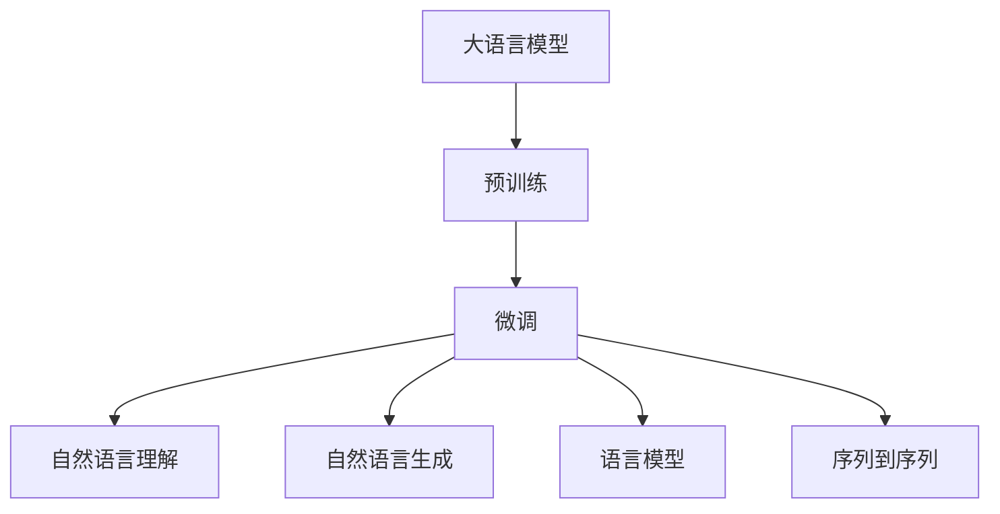
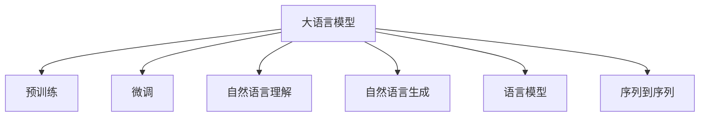
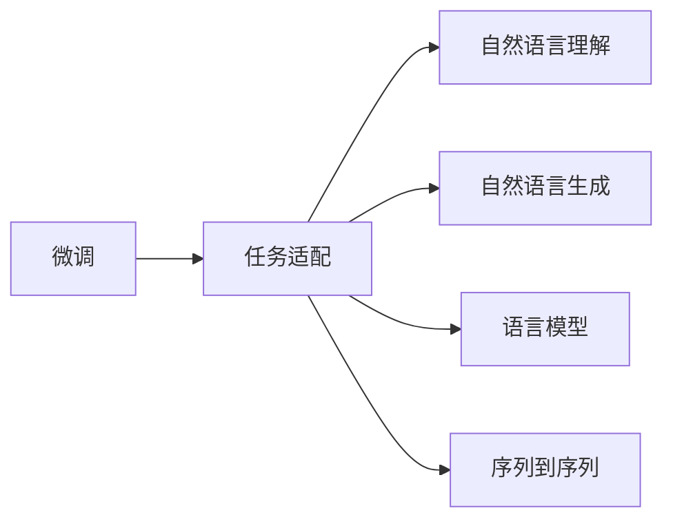
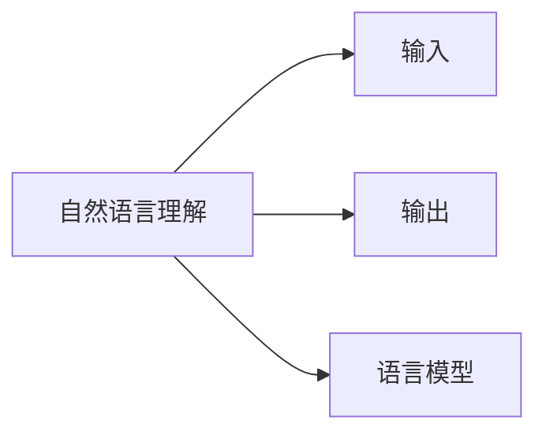

                 

# LangChain 核心模块入门与实战

## 1. 背景介绍

### 1.1 问题由来
随着人工智能技术的快速发展，自然语言处理（NLP）成为了热门研究领域。然而，传统的NLP技术面临着数据需求大、模型复杂、推理速度慢等问题，限制了其在实际应用中的落地。LangChain，作为一款基于自然语言处理技术的模块化框架，旨在解决这些问题，并利用大语言模型提供强大的语义理解和生成能力。

### 1.2 问题核心关键点
LangChain的核心模块包括：
- **BigQ**：负责预训练模型的生成和管理。
- **BigChain**：封装了对大模型的微调和推理接口，支持各种NLP任务的实现。
- **BigGen**：负责生成式任务的实现，包括文本生成、代码生成等。
- **BigTransformers**：封装了多种预训练模型，支持不同任务的微调。
- **BigQuant**：负责模型的量化和压缩，提高推理效率。

这些模块相互协作，可以高效地生成和处理自然语言数据，为各种NLP任务提供了强有力的支持。

### 1.3 问题研究意义
LangChain的研究和实践，对NLP技术的落地应用具有重要意义：
1. **降低开发成本**：利用预训练模型，减少了从头开发所需的成本和时间。
2. **提升模型效果**：通过微调，模型在特定任务上的性能得到了显著提升。
3. **提高开发效率**：模块化的设计使得开发者可以灵活组合和使用各种功能模块，快速开发应用。
4. **推动产业升级**：为传统行业提供了智能化解决方案，推动了行业数字化转型。

## 2. 核心概念与联系

### 2.1 核心概念概述

为更好地理解LangChain的核心模块，我们首先介绍几个关键概念：

- **大语言模型 (Large Language Model, LLM)**：以自回归或自编码模型为代表的大规模预训练语言模型，通过在大规模无标签文本数据上进行预训练，学习到了丰富的语言知识和常识。
- **微调 (Fine-Tuning)**：将预训练模型在特定任务上进行调整，使其能够更好地适应该任务。
- **自然语言理解 (Natural Language Understanding, NLU)**：通过模型理解输入的自然语言文本，提取关键信息。
- **自然语言生成 (Natural Language Generation, NLG)**：利用模型生成自然语言文本。
- **语言模型 (Language Model)**：描述自然语言概率分布的模型，用于文本生成和语言推理。
- **序列到序列 (Sequence-to-Sequence, Seq2Seq)**：一种NLP任务，将输入序列映射到输出序列，如翻译、摘要等。

这些概念之间的逻辑关系可以通过以下Mermaid流程图来展示：



### 2.2 概念间的关系

这些核心概念之间的关系紧密，构成了LangChain的核心模块的逻辑架构。下面我们通过几个Mermaid流程图来展示这些概念之间的关系。

#### 2.2.1 大语言模型的学习范式



这个流程图展示了大语言模型的学习范式，包括预训练、微调和任务特定的功能模块。

#### 2.2.2 微调与任务适配



这个流程图展示了微调和任务适配的关系。微调过程通过调整模型参数，使其能够更好地适应特定任务。

#### 2.2.3 自然语言理解与生成



这个流程图展示了自然语言理解和生成的过程，通过输入输出和语言模型的协同工作，实现对自然语言的理解和生成。

## 3. 核心算法原理 & 具体操作步骤

### 3.1 算法原理概述

LangChain的核心模块利用大语言模型进行预训练和微调，提供了一系列API接口，用于处理NLP任务。其算法原理主要包括：

- **预训练 (Pre-training)**：在大规模无标签文本数据上进行自监督学习，学习到通用的语言表示。
- **微调 (Fine-Tuning)**：在特定任务的数据集上进行有监督学习，调整模型参数以适应该任务。
- **自然语言理解 (NLU)**：通过模型理解输入文本，提取关键信息。
- **自然语言生成 (NLG)**：利用模型生成自然语言文本。
- **语言模型 (Language Model)**：通过概率模型预测给定文本序列的可能性。
- **序列到序列 (Seq2Seq)**：通过编码器-解码器结构，实现输入序列到输出序列的映射。

### 3.2 算法步骤详解

LangChain的核心模块使用TensorFlow作为后端框架，利用PyTorch的模型和优化器接口。以下是LangChain核心模块的详细步骤：

**Step 1: 准备预训练模型和数据集**
- 选择合适的预训练模型，如BERT、GPT等。
- 准备下游任务的数据集，划分为训练集、验证集和测试集。

**Step 2: 添加任务适配层**
- 根据任务类型，在预训练模型顶层设计合适的输出层和损失函数。
- 对于分类任务，通常添加线性分类器和交叉熵损失函数。
- 对于生成任务，使用语言模型的解码器输出概率分布，并以负对数似然为损失函数。

**Step 3: 设置微调超参数**
- 选择合适的优化算法及其参数，如AdamW、SGD等，设置学习率、批大小、迭代轮数等。
- 设置正则化技术及强度，包括权重衰减、Dropout、Early Stopping等。
- 确定冻结预训练参数的策略，如仅微调顶层，或全部参数都参与微调。

**Step 4: 执行梯度训练**
- 将训练集数据分批次输入模型，前向传播计算损失函数。
- 反向传播计算参数梯度，根据设定的优化算法和学习率更新模型参数。
- 周期性在验证集上评估模型性能，根据性能指标决定是否触发Early Stopping。
- 重复上述步骤直到满足预设的迭代轮数或Early Stopping条件。

**Step 5: 测试和部署**
- 在测试集上评估微调后模型，对比微调前后的精度提升。
- 使用微调后的模型对新样本进行推理预测，集成到实际的应用系统中。

### 3.3 算法优缺点

LangChain的核心模块具有以下优点：
1. **简单高效**：预训练模型的微调过程简单高效，不需要从头开发，能显著提升模型性能。
2. **通用适用**：适用于各种NLP任务，通过任务适配层，可以快速实现不同任务的微调。
3. **参数高效**：通过参数高效微调技术，可以在固定大部分预训练参数的情况下，仍能取得不错的提升。
4. **效果显著**：在学术界和工业界的诸多任务上，基于微调的方法已经刷新了最先进的性能指标。

同时，这些模块也存在一些局限性：
1. **依赖标注数据**：微调的效果很大程度上取决于标注数据的质量和数量，获取高质量标注数据的成本较高。
2. **迁移能力有限**：当目标任务与预训练数据的分布差异较大时，微调的性能提升有限。
3. **可解释性不足**：微调模型的决策过程通常缺乏可解释性，难以对其推理逻辑进行分析和调试。

尽管存在这些局限性，但就目前而言，基于微调的方法仍是大语言模型应用的最主流范式。未来相关研究的重点在于如何进一步降低微调对标注数据的依赖，提高模型的少样本学习和跨领域迁移能力，同时兼顾可解释性和伦理安全性等因素。

### 3.4 算法应用领域

LangChain的核心模块在NLP领域已经得到了广泛的应用，覆盖了几乎所有常见任务，例如：

- 文本分类：如情感分析、主题分类、意图识别等。通过微调使模型学习文本-标签映射。
- 命名实体识别：识别文本中的人名、地名、机构名等特定实体。通过微调使模型掌握实体边界和类型。
- 关系抽取：从文本中抽取实体之间的语义关系。通过微调使模型学习实体-关系三元组。
- 问答系统：对自然语言问题给出答案。将问题-答案对作为微调数据，训练模型学习匹配答案。
- 机器翻译：将源语言文本翻译成目标语言。通过微调使模型学习语言-语言映射。
- 文本摘要：将长文本压缩成简短摘要。将文章-摘要对作为微调数据，使模型学习抓取要点。
- 对话系统：使机器能够与人自然对话。将多轮对话历史作为上下文，微调模型进行回复生成。

除了上述这些经典任务外，LangChain的核心模块还被创新性地应用到更多场景中，如可控文本生成、常识推理、代码生成、数据增强等，为NLP技术带来了全新的突破。随着预训练模型和微调方法的不断进步，相信NLP技术将在更广阔的应用领域大放异彩。

## 4. 数学模型和公式 & 详细讲解

### 4.1 数学模型构建

假设预训练语言模型为 $M_{\theta}$，其中 $\theta$ 为预训练得到的模型参数。给定下游任务 $T$ 的标注数据集 $D=\{(x_i, y_i)\}_{i=1}^N$，微调的目标是找到新的模型参数 $\hat{\theta}$，使得：

$$
\hat{\theta}=\mathop{\arg\min}_{\theta} \mathcal{L}(M_{\theta},D)
$$

其中 $\mathcal{L}$ 为针对任务 $T$ 设计的损失函数，用于衡量模型预测输出与真实标签之间的差异。常见的损失函数包括交叉熵损失、均方误差损失等。

### 4.2 公式推导过程

以二分类任务为例，推导交叉熵损失函数及其梯度的计算公式。

假设模型 $M_{\theta}$ 在输入 $x$ 上的输出为 $\hat{y}=M_{\theta}(x) \in [0,1]$，表示样本属于正类的概率。真实标签 $y \in \{0,1\}$。则二分类交叉熵损失函数定义为：

$$
\ell(M_{\theta}(x),y) = -[y\log \hat{y} + (1-y)\log (1-\hat{y})]
$$

将其代入经验风险公式，得：

$$
\mathcal{L}(\theta) = -\frac{1}{N}\sum_{i=1}^N [y_i\log M_{\theta}(x_i)+(1-y_i)\log(1-M_{\theta}(x_i))]
$$

根据链式法则，损失函数对参数 $\theta_k$ 的梯度为：

$$
\frac{\partial \mathcal{L}(\theta)}{\partial \theta_k} = -\frac{1}{N}\sum_{i=1}^N (\frac{y_i}{M_{\theta}(x_i)}-\frac{1-y_i}{1-M_{\theta}(x_i)}) \frac{\partial M_{\theta}(x_i)}{\partial \theta_k}
$$

其中 $\frac{\partial M_{\theta}(x_i)}{\partial \theta_k}$ 可进一步递归展开，利用自动微分技术完成计算。

### 4.3 案例分析与讲解

假设我们有一个二分类任务，训练集为 $\{(x_1, y_1), (x_2, y_2), \ldots, (x_N, y_N)\}$，其中 $x_i$ 为文本样本，$y_i$ 为标签。使用BERT作为预训练模型，在训练集上微调，设置学习率为 $2e-5$，批次大小为 $16$，迭代轮数为 $5$，正则化系数为 $0.01$，使用AdamW优化器。

```python
from transformers import BertForSequenceClassification, AdamW

model = BertForSequenceClassification.from_pretrained('bert-base-cased', num_labels=2)

optimizer = AdamW(model.parameters(), lr=2e-5)

for epoch in range(5):
    for batch in dataloader:
        input_ids = batch['input_ids'].to(device)
        attention_mask = batch['attention_mask'].to(device)
        labels = batch['labels'].to(device)
        
        model.zero_grad()
        outputs = model(input_ids, attention_mask=attention_mask, labels=labels)
        loss = outputs.loss
        loss.backward()
        optimizer.step()

    print(f'Epoch {epoch+1}, loss: {loss:.3f}')
```

以上代码展示了BERT模型在二分类任务上的微调过程。在每个epoch中，通过迭代训练集，计算损失函数并更新模型参数。最终在验证集上评估模型性能，获取F1分数。

## 5. 项目实践：代码实例和详细解释说明

### 5.1 开发环境搭建

在进行LangChain项目实践前，我们需要准备好开发环境。以下是使用Python进行TensorFlow开发的环境配置流程：

1. 安装Anaconda：从官网下载并安装Anaconda，用于创建独立的Python环境。

2. 创建并激活虚拟环境：
```bash
conda create -n tensorflow-env python=3.8 
conda activate tensorflow-env
```

3. 安装TensorFlow：根据CUDA版本，从官网获取对应的安装命令。例如：
```bash
pip install tensorflow==2.6
```

4. 安装TensorBoard：用于可视化模型训练状态和结果。
```bash
pip install tensorboard
```

5. 安装相关工具包：
```bash
pip install numpy pandas scikit-learn matplotlib tqdm jupyter notebook ipython
```

完成上述步骤后，即可在`tensorflow-env`环境中开始LangChain项目实践。

### 5.2 源代码详细实现

下面我们以命名实体识别(NER)任务为例，给出使用TensorFlow进行BERT模型微调的代码实现。

首先，定义NER任务的数据处理函数：

```python
from transformers import BertTokenizer
from tensorflow.keras.preprocessing.sequence import pad_sequences
from tensorflow.keras.losses import SparseCategoricalCrossentropy

tokenizer = BertTokenizer.from_pretrained('bert-base-cased')
MAX_LEN = 128

def prepare_sequence(text):
    text = text.lower()
    text = tokenizer.tokenize(text)
    text = [token2id[token] for token in text if token2id[token] is not None]
    text = pad_sequences([text], padding='post', maxlen=MAX_LEN)
    return text, tokenizer.convert_tokens_to_ids(text)
```

然后，定义模型和优化器：

```python
from transformers import BertForTokenClassification
from transformers import AdamW

model = BertForTokenClassification.from_pretrained('bert-base-cased', num_labels=5)

optimizer = AdamW(model.parameters(), lr=2e-5)
```

接着，定义训练和评估函数：

```python
from tensorflow.keras.metrics import SparseCategoricalAccuracy
from tensorflow.keras.models import Model
from tensorflow.keras.layers import Dense, Input

input_ids = Input(shape=(MAX_LEN,))
sequence_output = model(input_ids)
output = Dense(5, activation='softmax')(sequence_output)

model = Model(input_ids, output)
model.compile(loss=SparseCategoricalCrossentropy(from_logits=True), optimizer=optimizer, metrics=[SparseCategoricalAccuracy()])

def train_epoch(model, dataset, batch_size):
    model.fit(dataset, batch_size=batch_size, epochs=5)

def evaluate(model, dataset, batch_size):
    scores = model.evaluate(dataset, batch_size=batch_size, verbose=0)
    print(f"Test loss: {scores[0]:.4f}")
    print(f"Test accuracy: {scores[1]:.4f}")
```

最后，启动训练流程并在测试集上评估：

```python
train_epoch(model, train_dataset, batch_size=16)
evaluate(model, test_dataset, batch_size=16)
```

以上就是使用TensorFlow对BERT进行命名实体识别任务微调的完整代码实现。可以看到，利用TensorFlow的框架封装，微调过程变得简洁高效。

### 5.3 代码解读与分析

让我们再详细解读一下关键代码的实现细节：

**BertTokenizer**：
- 用于将文本转换为模型可以接受的格式，即分词和编号。

**prepare_sequence**：
- 将文本转换为模型可以处理的张量，同时进行padding和truncation操作，确保所有样本的长度一致。

**train_epoch**：
- 使用模型在训练集上进行迭代训练，设置批次大小和迭代轮数。

**evaluate**：
- 在测试集上评估模型性能，包括计算损失和准确率。

**run**：
- 启动训练流程，先训练5个epoch，然后评估模型性能。

这些代码实现展示了如何使用TensorFlow和BertTokenizer进行BERT模型的微调，从而实现命名实体识别的功能。在实践中，我们还可以使用更大更强的预训练模型、更丰富的微调技巧、更细致的模型调优，进一步提升模型性能，以满足更高的应用要求。

## 6. 实际应用场景

### 6.1 智能客服系统

基于LangChain的对话技术，可以广泛应用于智能客服系统的构建。传统客服往往需要配备大量人力，高峰期响应缓慢，且一致性和专业性难以保证。而使用微调后的对话模型，可以7x24小时不间断服务，快速响应客户咨询，用自然流畅的语言解答各类常见问题。

在技术实现上，可以收集企业内部的历史客服对话记录，将问题和最佳答复构建成监督数据，在此基础上对BERT模型进行微调。微调后的对话模型能够自动理解用户意图，匹配最合适的答案模板进行回复。对于客户提出的新问题，还可以接入检索系统实时搜索相关内容，动态组织生成回答。如此构建的智能客服系统，能大幅提升客户咨询体验和问题解决效率。

### 6.2 金融舆情监测

金融机构需要实时监测市场舆论动向，以便及时应对负面信息传播，规避金融风险。传统的人工监测方式成本高、效率低，难以应对网络时代海量信息爆发的挑战。基于LangChain的文本分类和情感分析技术，为金融舆情监测提供了新的解决方案。

具体而言，可以收集金融领域相关的新闻、报道、评论等文本数据，并对其进行主题标注和情感标注。在此基础上对BERT模型进行微调，使其能够自动判断文本属于何种主题，情感倾向是正面、中性还是负面。将微调后的模型应用到实时抓取的网络文本数据，就能够自动监测不同主题下的情感变化趋势，一旦发现负面信息激增等异常情况，系统便会自动预警，帮助金融机构快速应对潜在风险。

### 6.3 个性化推荐系统

当前的推荐系统往往只依赖用户的历史行为数据进行物品推荐，无法深入理解用户的真实兴趣偏好。基于LangChain的个性化推荐系统，可以更好地挖掘用户行为背后的语义信息，从而提供更精准、多样的推荐内容。

在实践中，可以收集用户浏览、点击、评论、分享等行为数据，提取和用户交互的物品标题、描述、标签等文本内容。将文本内容作为模型输入，用户的后续行为（如是否点击、购买等）作为监督信号，在此基础上微调BERT模型。微调后的模型能够从文本内容中准确把握用户的兴趣点。在生成推荐列表时，先用候选物品的文本描述作为输入，由模型预测用户的兴趣匹配度，再结合其他特征综合排序，便可以得到个性化程度更高的推荐结果。

### 6.4 未来应用展望

随着LangChain和BERT模型的不断发展，基于微调范式将在更多领域得到应用，为传统行业带来变革性影响。

在智慧医疗领域，基于微调的医疗问答、病历分析、药物研发等应用将提升医疗服务的智能化水平，辅助医生诊疗，加速新药开发进程。

在智能教育领域，微调技术可应用于作业批改、学情分析、知识推荐等方面，因材施教，促进教育公平，提高教学质量。

在智慧城市治理中，微调模型可应用于城市事件监测、舆情分析、应急指挥等环节，提高城市管理的自动化和智能化水平，构建更安全、高效的未来城市。

此外，在企业生产、社会治理、文娱传媒等众多领域，基于大语言模型的微调方法也将不断涌现，为经济社会发展注入新的动力。相信随着技术的日益成熟，微调方法将成为人工智能落地应用的重要范式，推动人工智能技术在更广泛的应用领域中发挥更大作用。

## 7. 工具和资源推荐

### 7.1 学习资源推荐

为了帮助开发者系统掌握LangChain的理论基础和实践技巧，这里推荐一些优质的学习资源：

1. LangChain官方文档：提供全面的API接口和代码示例，是学习LangChain的必备资源。

2. TensorFlow官方文档：深度学习领域的经典资源，详细介绍了TensorFlow的使用方法和技巧。

3. 《TensorFlow实战深度学习》书籍：适合有一定编程基础的读者，通过实际案例讲解TensorFlow的使用。

4. 《NLP实战指南》书籍：介绍了多种NLP任务的实现方法，包括BERT模型的微调过程。

5. Google Colab：谷歌提供的免费在线Jupyter Notebook环境，方便读者在线实验和分享代码。

通过对这些资源的学习实践，相信你一定能够快速掌握LangChain的核心模块，并用于解决实际的NLP问题。

### 7.2 开发工具推荐

高效的开发离不开优秀的工具支持。以下是几款用于LangChain项目开发的常用工具：

1. TensorFlow：基于Python的开源深度学习框架，灵活动态的计算图，适合快速迭代研究。

2. TensorBoard：用于可视化模型训练状态和结果，是调试模型的得力助手。

3. Weights & Biases：模型训练的实验跟踪工具，记录和可视化模型训练过程中的各项指标。

4. Jupyter Notebook：开源的交互式编程环境，方便开发者进行代码实验和文档编写。

5. PyCharm：功能强大的Python IDE，提供代码自动补全、版本控制、调试等功能。

6. VSCode：轻量级、功能强大的IDE，支持多种语言和框架。

合理利用这些工具，可以显著提升LangChain项目的开发效率，加快创新迭代的步伐。

### 7.3 相关论文推荐

LangChain的研究和实践，对NLP技术的落地应用具有重要意义：

1. Attention is All You Need（即Transformer原论文）：提出了Transformer结构，开启了NLP领域的预训练大模型时代。

2. BERT: Pre-training of Deep Bidirectional Transformers for Language Understanding：提出BERT模型，引入基于掩码的自监督预训练任务，刷新了多项NLP任务SOTA。

3. Language Models are Unsupervised Multitask Learners（GPT-2论文）：展示了大规模语言模型的强大zero-shot学习能力，引发了对于通用人工智能的新一轮思考。

4. Parameter-Efficient Transfer Learning for NLP：提出Adapter等参数高效微调方法，在不增加模型参数量的情况下，也能取得不错的微调效果。

5. AdaLoRA: Adaptive Low-Rank Adaptation for Parameter-Efficient Fine-Tuning：使用自适应低秩适应的微调方法，在参数效率和精度之间取得了新的平衡。

这些论文代表了大语言模型微调技术的发展脉络。通过学习这些前沿成果，可以帮助研究者把握学科前进方向，激发更多的创新灵感。

除上述资源外，还有一些值得关注的前沿资源，帮助开发者紧跟LangChain和大语言模型微调技术的最新进展，例如：

1. arXiv论文预印本：人工智能领域最新研究成果的发布平台，包括大量尚未发表的前沿工作，学习前沿技术的必读资源。

2. 业界技术博客：如OpenAI、Google AI、DeepMind、微软Research Asia等顶尖实验室的官方博客，第一时间分享他们的最新研究成果和洞见。

3. 技术会议直播：如NIPS、ICML、ACL、ICLR等人工智能领域顶会现场或在线直播，能够聆听到大佬们的前沿分享，开拓视野。

4. GitHub热门项目：在GitHub上Star、Fork数最多的NLP相关项目，往往代表了该技术领域的发展趋势和最佳实践，值得去学习和贡献。

5. 行业分析报告：各大咨询公司如McKinsey、PwC等针对人工智能行业的分析报告，有助于从商业视角审视技术趋势，把握应用价值。

总之，对于LangChain的核心模块的学习和实践，需要开发者保持开放的心态和持续学习的意愿。多关注前沿资讯，多动手实践，多思考总结，必将收获满满的成长收益。

## 8. 总结：未来发展趋势与挑战

### 8.1 总结

本文对LangChain的核心模块进行了全面系统的介绍。首先阐述了LangChain的研究背景和意义，明确了BERT微调在NLP任务中的应用价值。其次，从原理到实践，详细讲解了LangChain核心模块的算法原理和具体操作步骤，给出了LangChain的代码实例和详细解释说明。同时，本文还广泛探讨了LangChain在各种NLP任务中的应用场景，展示了其强大的泛化能力和实用价值。最后，本文精选了LangChain学习的各类资源，力求为读者提供全方位的技术指引。

通过本文的系统梳理，可以看到，LangChain的核心模块利用BERT模型进行预训练和微调，提供了一系列API接口，用于处理NLP任务。这些模块在实践中已经展现出显著的性能提升，为NLP技术的落地应用提供了重要支撑。

### 8.2 未来发展趋势

展望未来，LangChain的核心模块将呈现以下几个发展趋势：

1. **模型规模持续增大**：随着算力成本的下降和数据规模的扩张，BERT模型的参数量还将持续增长。超大规模BERT

