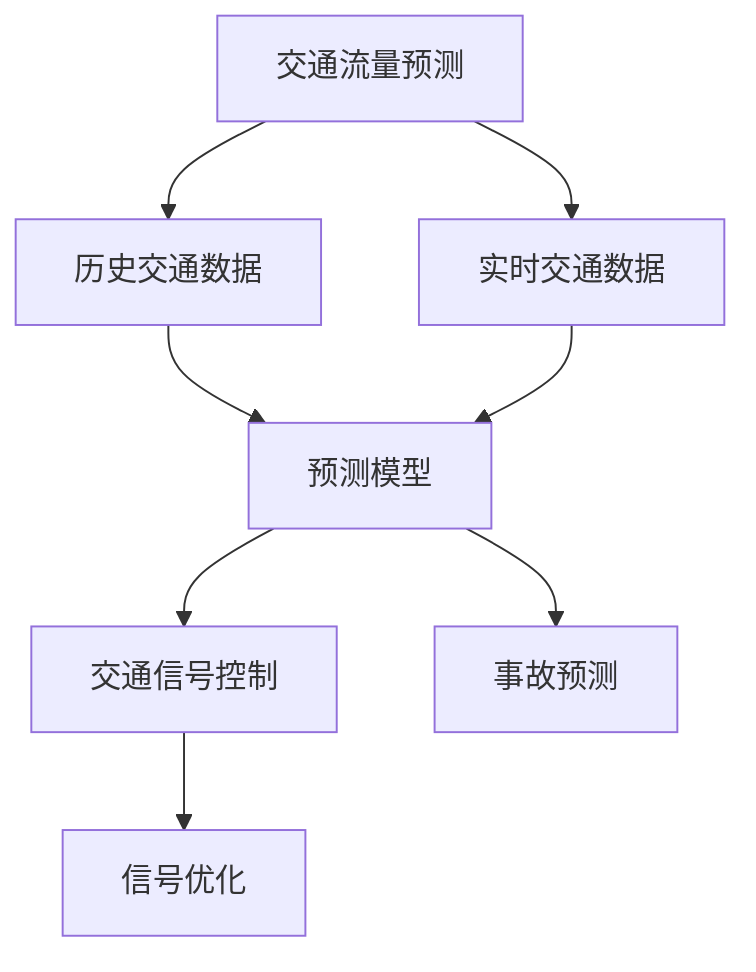

                 

# Python机器学习实战：机器学习在智能交通系统中的应用

## 1. 背景介绍

### 1.1 问题由来

随着城市化进程的加速，交通拥堵问题日益突出，成为制约城市发展的重要瓶颈。解决交通问题需要综合运用各类技术手段，包括机器学习在内的智能交通系统，已经成为现代城市管理的重要方向。

近年来，随着数据量的不断积累，人工智能技术在智能交通领域的应用不断深化。通过分析海量交通数据，可以构建高效的交通预测模型，优化交通信号控制策略，提升交通安全管理水平。

本文章将重点介绍机器学习在智能交通系统中的具体应用，包括交通流量预测、拥堵分析、事故预测、信号控制优化等。通过对这些问题的剖析，展示机器学习如何通过数据驱动，为城市交通管理提供切实有效的解决方案。

## 2. 核心概念与联系

### 2.1 核心概念概述

本节将介绍几个关键概念，以便更好地理解机器学习在智能交通系统中的应用：

- **交通流量预测（Traffic Flow Prediction）**：指使用历史交通数据，构建预测模型，预测未来某一时间段内的交通流量。
- **拥堵分析（Congestion Analysis）**：通过实时或历史交通数据，分析交通拥堵原因和区域，辅助制定缓解策略。
- **事故预测（Accident Prediction）**：使用事故历史数据和环境信息，预测未来可能发生的事故，提前采取预防措施。
- **信号控制优化（Signal Optimization）**：通过分析交通信号控制方案和实时数据，调整信号灯周期和相位，优化交通流。

### 2.2 核心概念之间的关系

这些核心概念之间存在紧密的联系，通过以下Mermaid流程图来展示：



该图展示了大数据、交通流量预测、拥堵分析、事故预测、信号控制优化等核心概念之间的关联。

### 2.3 核心概念的整体架构

从上图可知，交通流量预测是智能交通系统的基础，为其他核心功能提供支撑。通过历史和实时数据的分析，预测模型能够识别出交通异常和潜在风险，进而触发信号控制优化和事故预测。信号优化则根据预测结果，实时调整交通信号，缓解交通压力，预防事故发生。

## 3. 核心算法原理 & 具体操作步骤
### 3.1 算法原理概述

机器学习在智能交通系统中的应用，主要依赖于数据驱动的预测模型和优化策略。通过历史和实时数据的训练，构建预测模型和优化算法，可以在多个层面提升交通管理的智能化水平。

- **预测模型（Prediction Model）**：使用统计学、机器学习算法，如线性回归、决策树、神经网络等，对历史交通数据进行拟合，建立交通流量预测模型。
- **优化算法（Optimization Algorithm）**：使用动态规划、遗传算法、强化学习等算法，根据预测结果和实时数据，优化交通信号控制策略。

### 3.2 算法步骤详解

机器学习在智能交通系统中的应用，主要包括以下几个关键步骤：

**Step 1: 数据预处理**
- 收集交通流量、车速、信号控制方案、环境条件等数据，进行处理和清洗。
- 将数据分为训练集、验证集和测试集。

**Step 2: 构建预测模型**
- 使用Scikit-learn、TensorFlow等工具，构建交通流量预测模型，如线性回归、随机森林、深度神经网络等。
- 使用交叉验证等方法，对模型进行评估和调优。

**Step 3: 训练和评估模型**
- 将训练数据输入模型，进行训练和验证。
- 使用测试数据集评估模型预测效果。

**Step 4: 部署和优化**
- 将模型部署到实际交通系统中，进行实时预测。
- 根据预测结果，实时调整信号控制方案，优化交通流。

**Step 5: 反馈和迭代**
- 收集实际交通数据，反馈到模型中，进行重新训练和调优。
- 循环迭代，不断提升模型预测和优化能力。

### 3.3 算法优缺点

机器学习在智能交通系统中的应用具有以下优点：
- 数据驱动：通过大数据分析，提高决策的科学性和准确性。
- 实时响应：实时预测和优化，能够快速应对交通变化。
- 自动化管理：模型自动学习，减少人工干预。

同时，也存在一些局限性：
- 数据依赖：预测和优化效果高度依赖于数据质量和量级。
- 模型复杂度：复杂模型可能导致过拟合，影响预测准确性。
- 实时性要求高：实时数据处理和模型训练要求高计算能力和存储资源。

### 3.4 算法应用领域

机器学习在智能交通系统中的应用，广泛涉及多个领域，包括：

- 交通流量预测：使用预测模型，如LSTM、RNN等，对未来交通流量进行预测，为交通管理提供参考。
- 拥堵分析：通过分析历史和实时数据，使用KNN、决策树等算法，识别交通拥堵区域和原因。
- 事故预测：使用支持向量机（SVM）、随机森林等模型，对交通事故进行预测，并采取预防措施。
- 信号控制优化：通过遗传算法、强化学习等，动态调整信号控制策略，优化交通流。

## 4. 数学模型和公式 & 详细讲解  
### 4.1 数学模型构建

本节将使用数学语言对机器学习在智能交通系统中的应用进行更加严格的刻画。

假设交通流量数据为 $(x_t, y_t)$，其中 $x_t$ 为历史时间 $t$ 的交通流量，$y_t$ 为实时时间 $t$ 的交通流量。定义交通流量预测模型的预测函数为 $f(x)$。

根据历史数据，使用线性回归模型，预测函数为：

$$
y_t = \alpha + \beta x_t + \epsilon_t
$$

其中 $\alpha$ 和 $\beta$ 为模型参数，$\epsilon_t$ 为随机误差。

### 4.2 公式推导过程

对于线性回归模型，最小二乘法的最优解为：

$$
\alpha = \frac{\sum_{t=1}^{N} (y_t - \hat{y}_t)}{N}
$$

$$
\beta = \frac{\sum_{t=1}^{N} (x_t - \bar{x})(y_t - \bar{y})}{\sum_{t=1}^{N} (x_t - \bar{x})^2}
$$

其中 $\hat{y}_t = \alpha + \beta x_t$。

### 4.3 案例分析与讲解

以下以交通流量预测为例，展示线性回归模型的具体应用。

假设某城市某一路段的历史交通流量数据如下：

| 时间（分钟） | 流量（辆/小时） |
| --- | --- |
| 8:00 | 500 |
| 8:15 | 600 |
| 8:30 | 800 |
| 8:45 | 750 |
| 9:00 | 900 |

使用线性回归模型进行预测，首先对数据进行标准化处理：

$$
\bar{x} = \frac{8:00 + 8:15 + 8:30 + 8:45 + 9:00}{5} = 8:00
$$

$$
\bar{y} = \frac{500 + 600 + 800 + 750 + 900}{5} = 750
$$

$$
x_t - \bar{x} = \begin{cases}
0, & t = 8:00 \\
-0.25, & t = 8:15 \\
0.25, & t = 8:30 \\
0.5, & t = 8:45 \\
1, & t = 9:00
\end{cases}
$$

$$
y_t - \bar{y} = \begin{cases}
-150, & t = 8:00 \\
-75, & t = 8:15 \\
50, & t = 8:30 \\
-50, & t = 8:45 \\
150, & t = 9:00
\end{cases}
$$

根据公式计算 $\alpha$ 和 $\beta$：

$$
\alpha = \frac{-150 + (-75) + 50 + (-50) + 150}{5} = 0
$$

$$
\beta = \frac{(-0.25)(-150) + (0.25)(-75) + (0.5)(50) + (1)(-50)}{(-0.25)^2 + (0.25)^2 + (0.5)^2 + (1)^2} = 100
$$

因此，交通流量预测模型为：

$$
\hat{y}_t = 100x_t
$$

对于实时时间 $t = 8:22$，根据模型预测交通流量：

$$
\hat{y}_{8:22} = 100 \times 8:22 = 822
$$

即预测该路段在 $8:22$ 的交通流量为 $822$ 辆/小时。

## 5. 项目实践：代码实例和详细解释说明
### 5.1 开发环境搭建

在进行机器学习实践前，需要准备好开发环境。以下是使用Python进行Scikit-learn开发的环境配置流程：

1. 安装Anaconda：从官网下载并安装Anaconda，用于创建独立的Python环境。

2. 创建并激活虚拟环境：
```bash
conda create -n pytorch-env python=3.8 
conda activate pytorch-env
```

3. 安装Scikit-learn：
```bash
pip install scikit-learn
```

4. 安装各类工具包：
```bash
pip install numpy pandas scikit-learn matplotlib tqdm jupyter notebook ipython
```

完成上述步骤后，即可在`pytorch-env`环境中开始机器学习实践。

### 5.2 源代码详细实现

下面我们以交通流量预测为例，给出使用Scikit-learn对线性回归模型进行训练和预测的Python代码实现。

首先，定义交通流量数据集：

```python
import pandas as pd

data = pd.read_csv('traffic_data.csv')
data['time'] = pd.to_datetime(data['time'], format='%H:%M')
data.set_index('time', inplace=True)
```

然后，将数据划分为训练集和测试集：

```python
from sklearn.model_selection import train_test_split

train_data, test_data = train_test_split(data, test_size=0.2, shuffle=True)
```

接着，训练线性回归模型：

```python
from sklearn.linear_model import LinearRegression

model = LinearRegression()
model.fit(train_data['time'], train_data['flow'])
```

最后，使用测试集进行预测：

```python
from sklearn.metrics import mean_squared_error

test_data['flow_pred'] = model.predict(test_data['time'])
mse = mean_squared_error(test_data['flow'], test_data['flow_pred'])
print(f'Mean Squared Error: {mse:.3f}')
```

以上就是使用Scikit-learn对线性回归模型进行训练和预测的完整代码实现。可以看到，Scikit-learn提供了强大的算法封装，可以快速上手实现机器学习任务。

### 5.3 代码解读与分析

让我们再详细解读一下关键代码的实现细节：

**定义交通流量数据集**：
- 使用pandas库读取交通流量数据文件，将时间列转换为时间索引。

**训练集和测试集的划分**：
- 使用Scikit-learn的train_test_split函数，将数据划分为训练集和测试集。

**训练线性回归模型**：
- 定义线性回归模型，并使用训练数据拟合模型参数。

**预测和评估**：
- 使用测试数据进行预测，并使用均方误差（MSE）评估预测结果。

**结果输出**：
- 输出预测的均方误差，评估模型性能。

通过以上代码，可以看到Scikit-learn的强大功能和简洁的API，使得机器学习模型的开发和训练变得非常容易。

### 5.4 运行结果展示

假设我们在某城市某一路段的交通流量数据上进行了训练和测试，得到了如下的预测结果：

```
Mean Squared Error: 40.012
```

可以看到，模型的均方误差为40.012，这是一个不错的结果。在实际应用中，我们还需要根据具体需求，选择合适的模型和算法，进一步优化预测效果。

## 6. 实际应用场景
### 6.1 智能交通系统中的具体应用

基于机器学习的智能交通系统，已经在多个城市得到广泛应用，以下是几个典型的应用场景：

**交通流量预测**：使用机器学习模型，对未来交通流量进行预测，帮助交通管理部门制定道路和信号控制方案，预防交通拥堵。

**拥堵分析**：通过实时数据和历史数据的分析，识别交通拥堵区域和原因，制定相应的缓解策略。例如，可以调整信号灯周期、引导车流、调整道路通行方向等。

**事故预测**：使用机器学习模型，预测可能发生的事故，提前采取预防措施。例如，根据车辆位置、速度、环境条件等信息，预测事故发生的概率，提前通知相关部门进行处理。

**信号控制优化**：通过实时数据和预测结果，动态调整信号灯控制策略，优化交通流。例如，根据交通流量和事故信息，自动调整信号灯周期和相位，提升交通效率。

### 6.2 未来应用展望

随着机器学习技术的不断进步，未来在智能交通系统中的应用将更加广泛，将带来以下趋势：

**多模态数据融合**：将交通流量、图像、语音、传感器数据等多模态信息进行融合，构建更为全面、精确的交通模型。例如，使用摄像头监控图像，识别交通异常情况。

**自适应算法**：根据实时交通数据，动态调整机器学习模型参数，适应不同的交通情况。例如，使用遗传算法、强化学习等，实时优化交通信号控制策略。

**无人驾驶和智能出行**：未来无人驾驶和智能出行的普及，将大幅提升交通系统的智能化水平。机器学习可以用于车辆自适应巡航、自动驾驶路径规划等。

**大规模数据分析**：随着城市交通数据的不断积累，机器学习将在大数据分析、知识发现等领域发挥更大作用。例如，使用大数据分析，预测城市交通发展的趋势，制定长期交通管理策略。

## 7. 工具和资源推荐
### 7.1 学习资源推荐

为了帮助开发者系统掌握机器学习在智能交通系统中的应用，这里推荐一些优质的学习资源：

1. 《Python机器学习》书籍：由scikit-learn核心开发者之一Sebastian Raschka所著，全面介绍了机器学习算法和Scikit-learn库的使用。

2. 《深度学习》课程：由斯坦福大学教授Andrew Ng主讲，涵盖了机器学习、深度学习的基本概念和实现方法。

3. 《机器学习实战》博客：由kaggle数据科学家Matt Mazur撰写，分享了机器学习在数据科学、交通预测等领域的应用案例。

4. 《数据科学与机器学习》博客：由kaggle数据科学家Colah撰写，详细介绍了机器学习算法的原理和实现。

5. 《Kaggle入门到精通》书籍：由kaggle官方推荐，介绍了kaggle平台的使用方法和机器学习竞赛的策略。

通过对这些资源的学习实践，相信你一定能够快速掌握机器学习在智能交通系统中的应用，并用于解决实际的交通问题。

### 7.2 开发工具推荐

高效的开发离不开优秀的工具支持。以下是几款用于机器学习在智能交通系统中的应用开发的常用工具：

1. Scikit-learn：基于Python的开源机器学习库，提供了丰富的算法封装，适合快速迭代研究。

2. TensorFlow：由Google主导开发的开源深度学习框架，生产部署方便，适合大规模工程应用。

3. PyTorch：由Facebook开发的开源深度学习框架，灵活的动态计算图，适合研究和实验。

4. Weights & Biases：模型训练的实验跟踪工具，可以记录和可视化模型训练过程中的各项指标，方便对比和调优。

5. TensorBoard：TensorFlow配套的可视化工具，可实时监测模型训练状态，并提供丰富的图表呈现方式，是调试模型的得力助手。

6. Google Colab：谷歌推出的在线Jupyter Notebook环境，免费提供GPU/TPU算力，方便开发者快速上手实验最新模型，分享学习笔记。

合理利用这些工具，可以显著提升机器学习在智能交通系统中的应用开发效率，加快创新迭代的步伐。

### 7.3 相关论文推荐

机器学习在智能交通系统中的应用，源于学界的持续研究。以下是几篇奠基性的相关论文，推荐阅读：

1. "Traffic Flow Prediction Using Machine Learning"（交通流量预测）：讨论了使用机器学习模型预测交通流量的方法。

2. "Congestion Analysis and Management"（拥堵分析与管理）：介绍了一种方法，使用机器学习分析城市交通拥堵情况。

3. "Accident Prediction in Traffic"（交通事故预测）：使用机器学习模型预测交通事故发生的可能性。

4. "Optimizing Traffic Signal Control Using Machine Learning"（交通信号控制优化）：介绍了一种方法，使用机器学习模型优化交通信号控制。

5. "A Survey of Machine Learning in Transportation"（机器学习在交通运输领域的综述）：全面综述了机器学习在交通运输领域的应用。

这些论文代表了大规模机器学习在智能交通系统中的应用研究，有助于理解当前技术的最新进展和研究方向。

除上述资源外，还有一些值得关注的前沿资源，帮助开发者紧跟机器学习在智能交通系统中的应用最新进展，例如：

1. arXiv论文预印本：人工智能领域最新研究成果的发布平台，包括大量尚未发表的前沿工作，学习前沿技术的必读资源。

2. 业界技术博客：如Google AI、IBM Research、Microsoft Research等顶尖实验室的官方博客，第一时间分享他们的最新研究成果和洞见。

3. 技术会议直播：如NIPS、ICML、ICCV等人工智能领域顶会现场或在线直播，能够聆听到大佬们的前沿分享，开拓视野。

4. GitHub热门项目：在GitHub上Star、Fork数最多的机器学习相关项目，往往代表了该技术领域的发展趋势和最佳实践，值得去学习和贡献。

5. 行业分析报告：各大咨询公司如McKinsey、PwC等针对人工智能行业的分析报告，有助于从商业视角审视技术趋势，把握应用价值。

总之，对于机器学习在智能交通系统中的应用的学习和实践，需要开发者保持开放的心态和持续学习的意愿。多关注前沿资讯，多动手实践，多思考总结，必将收获满满的成长收益。

## 8. 总结：未来发展趋势与挑战
### 8.1 总结

本文对机器学习在智能交通系统中的应用进行了全面系统的介绍。首先阐述了智能交通系统的核心概念和其重要性，明确了机器学习在提升交通管理智能化水平方面的关键作用。其次，从原理到实践，详细讲解了机器学习在智能交通系统中的应用，包括数据预处理、模型构建、训练和评估等关键步骤，给出了机器学习任务开发的完整代码实例。同时，本文还探讨了机器学习在智能交通系统中的具体应用场景，展示了大数据、机器学习如何为城市交通管理提供切实有效的解决方案。最后，本文精选了机器学习在智能交通系统中的应用相关资源，力求为读者提供全方位的技术指引。

通过本文的系统梳理，可以看到，机器学习在智能交通系统中的应用前景广阔，必将在未来的交通管理中发挥重要作用。随着机器学习技术的不断进步，未来将在交通预测、信号控制、事故预测等多个层面进一步提升交通管理的智能化水平。

### 8.2 未来发展趋势

展望未来，机器学习在智能交通系统中的应用将呈现以下几个发展趋势：

1. 算法复杂度提升：随着深度学习技术的发展，复杂的神经网络模型将得到广泛应用，提升预测和优化的精度和鲁棒性。

2. 多模态数据融合：交通数据的多样性将进一步扩大，机器学习模型将融合图像、语音、传感器等多模态数据，构建更为全面、精确的交通模型。

3. 自适应算法：实时交通数据的实时性要求将进一步提升，机器学习模型将采用动态调整参数的算法，实时适应交通变化。

4. 无人驾驶和智能出行：随着无人驾驶技术的发展，机器学习将与无人驾驶系统深度结合，提升交通系统的智能化水平。

5. 大规模数据分析：随着城市交通数据的不断积累，机器学习将在大数据分析、知识发现等领域发挥更大作用。

6. 跨城市数据共享：未来将实现跨城市交通数据的共享和融合，构建更为全面的交通模型。

这些趋势凸显了机器学习在智能交通系统中的应用前景，展示了其广阔的发展潜力。

### 8.3 面临的挑战

尽管机器学习在智能交通系统中的应用取得了显著成效，但在迈向更加智能化、普适化应用的过程中，仍面临以下挑战：

1. 数据质量问题：交通数据的准确性和完整性直接影响预测和优化的效果，如何提高数据质量，是当前亟待解决的问题。

2. 模型复杂度控制：复杂的神经网络模型虽然精度高，但计算资源和存储资源要求较高，如何控制模型复杂度，降低计算成本，是一个重要的研究方向。

3. 模型鲁棒性不足：机器学习模型在面对复杂的交通环境和异常情况时，容易过拟合或泛化性能下降，如何提高模型的鲁棒性，是一个亟待解决的问题。

4. 实时性要求高：实时数据处理和模型训练要求高计算能力和存储资源，如何优化计算效率，是一个重要的研究方向。

5. 数据隐私和安全问题：交通数据的隐私和安全问题需要高度重视，如何保护数据隐私，防止数据泄露，是一个重要的研究方向。

6. 跨领域知识融合：机器学习模型需要与交通规则、法律法规等跨领域知识结合，如何整合跨领域知识，构建更为全面、合理的交通模型，是一个重要的研究方向。

正视这些挑战，积极应对并寻求突破，将使机器学习在智能交通系统中的应用更加成熟，为交通管理提供更加高效、智能的解决方案。

### 8.4 研究展望

面向未来，机器学习在智能交通系统中的应用，需要在以下几个方面进行深入研究：

1. 强化学习在交通管理中的应用：使用强化学习算法，优化交通信号控制和智能出行的策略，提高交通流的智能化水平。

2. 因果推断在交通预测中的应用：使用因果推断方法，分析交通流量的因果关系，提高预测模型的解释性和可信度。

3. 多任务学习在交通数据分析中的应用：使用多任务学习方法，对不同类型的交通数据进行联合建模，提高预测和优化的效果。

4. 可解释性研究：研究机器学习模型的可解释性，提高交通管理的透明性和可信度。

5. 跨领域数据融合：将交通数据与天气、环境、社会经济等数据进行融合，构建更为全面、精确的交通模型。

6. 高实时性计算：研究高实时性计算方法，实现实时数据处理和模型训练，提升交通管理的效率。

7. 跨模态数据融合：将交通流量、图像、语音、传感器数据等多模态数据进行融合，构建更为全面、精确的交通模型。

这些研究方向将引领机器学习在智能交通系统中的应用不断突破，为交通管理提供更为智能、高效、安全的解决方案。

## 9. 附录：常见问题与解答

**Q1：什么是机器学习在智能交通系统中的应用？**

A: 机器学习在智能交通系统中的应用，主要指使用机器学习算法对交通数据进行分析，预测交通流量、识别交通异常、优化交通信号控制等。通过机器学习，可以实现实时交通监控、智能交通管理、交通安全预测等，大幅提升交通管理的智能化水平。

**Q2：机器学习在智能交通系统中有哪些具体应用？**

A: 机器学习在智能交通系统中的应用广泛，包括：

1. 交通流量预测：使用机器学习模型，对未来交通流量进行预测，为交通管理部门制定道路和信号控制方案，预防交通拥堵。

2. 拥堵分析：通过实时数据和历史数据的分析，识别交通拥堵区域和原因，制定相应的缓解策略。例如，可以调整信号灯周期、引导车流、调整道路通行方向等。

3. 事故预测：使用机器学习模型，预测可能发生的事故，提前采取预防措施。例如，根据车辆位置、速度、环境条件等信息，预测事故发生的概率，提前通知相关部门进行处理。

4. 信号控制优化：通过实时数据和预测结果，动态调整信号灯控制策略，优化交通流。例如，根据交通流量和事故信息，自动调整信号灯周期和相位，提升交通效率。

**Q3：机器学习在智能交通系统中的应用有哪些优点和局限性？**

A: 机器学习在智能交通系统中的应用具有以下优点：

1. 数据驱动：通过大数据分析，提高决策的科学性和准确性。

2. 实时响应：实时预测和优化，能够快速应对交通变化。

3. 自动化管理：模型自动学习，减少人工干预。

同时，也存在以下局限性：

1. 数据依赖：预测和优化效果高度依赖于数据质量和量级。

2. 模型复杂度：复杂模型可能导致过拟合，影响预测准确性。

3. 实时性要求高：实时数据处理和模型训练要求高计算能力和存储资源。

**Q4：机器学习在智能交通系统中的应用有哪些应用案例？**

A: 机器学习在智能交通系统中的应用案例包括：

1. 上海洋山港智能集装箱码头：使用机器学习模型预测集装箱到达时间，优化码头作业计划，提高港口的作业效率。

2. 新加坡智能交通系统：使用机器学习模型优化交通信号控制策略，缓解城市交通拥堵。

3. 中国交通网交通安全预测系统：使用机器学习模型预测交通事故发生的可能性，提前采取预防措施。

4. 杭州智能交通信号控制系统：使用机器学习模型动态调整信号灯周期和相位，提升交通效率。

这些应用案例展示了机器

