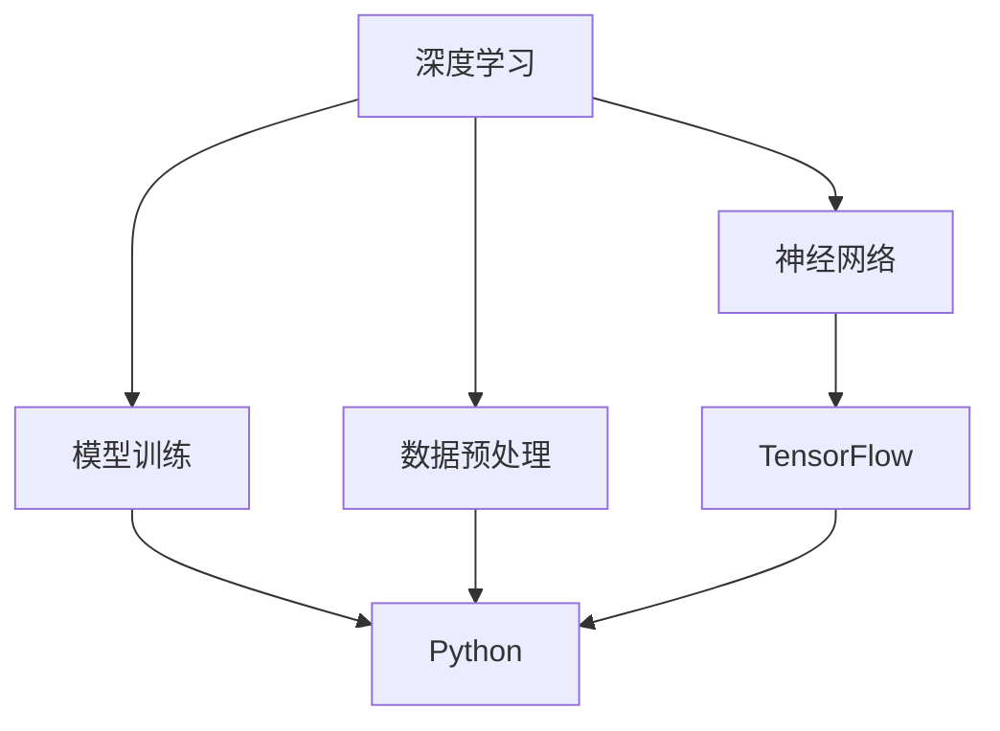

                 

# Python机器学习实战：深度学习入门与TensorFlow应用

> 关键词：深度学习, Python, TensorFlow, 机器学习实战, 神经网络, 模型训练

## 1. 背景介绍

### 1.1 问题由来
深度学习（Deep Learning）是当前人工智能领域最热门的研究方向之一，已经成功应用于图像识别、自然语言处理、语音识别、推荐系统等众多领域。作为深度学习的重要工具，Python和TensorFlow以其强大的数据处理能力和灵活的编程特性，成为深度学习领域的主流技术栈。然而，对于初学者来说，深度学习的门槛较高，需要理解复杂的数学理论和算法原理，掌握多种工具库和框架。本文旨在通过实战案例，帮助读者快速上手深度学习，掌握TensorFlow的应用技巧。

### 1.2 问题核心关键点
本文的核心关键点在于：

- 深度学习的基本概念和原理。
- TensorFlow的安装和基础使用方法。
- 深度学习模型的构建和训练。
- 深度学习在实际项目中的应用案例。
- 深度学习面临的技术挑战和未来发展方向。

这些核心关键点将贯穿全文，帮助读者全面理解和掌握深度学习在Python环境下的实战技巧。

### 1.3 问题研究意义
掌握深度学习在Python和TensorFlow环境下的实战技巧，对于推动人工智能技术的发展和落地应用具有重要意义：

1. 降低深度学习门槛。帮助初学者快速入门，掌握深度学习的核心思想和应用方法。
2. 提升项目开发效率。熟练使用Python和TensorFlow，可以快速实现各种深度学习应用，提高开发效率。
3. 推动技术创新。深度学习是当前人工智能领域的前沿技术，掌握其实战技巧，可以推动技术创新和应用突破。
4. 赋能产业升级。深度学习技术在工业界的广泛应用，为各行各业带来变革性影响，促进产业升级。

## 2. 核心概念与联系

### 2.1 核心概念概述

为了更好地理解深度学习在Python环境下的实战技巧，本节将介绍几个关键的概念：

- 深度学习（Deep Learning）：通过多层次的神经网络模型，自动学习和提取数据中的高层次特征，实现对复杂任务的解决。
- Python：一种高级编程语言，具有简洁易读的语法和丰富的第三方库支持，适合进行深度学习应用开发。
- TensorFlow：Google开发的开源深度学习框架，支持灵活的计算图模型，适合进行神经网络的构建和训练。
- 神经网络（Neural Network）：深度学习的基本组成部分，通过多层非线性映射，实现对数据的复杂建模。
- 模型训练（Model Training）：通过反向传播算法，优化神经网络的参数，使其在给定数据集上最小化预测误差的过程。
- 数据预处理（Data Preprocessing）：对原始数据进行清洗、转换、增强等操作，使其适合深度学习模型训练。

这些概念之间存在着紧密的联系，构成了深度学习在Python环境下的基本框架。

### 2.2 概念间的关系

这些核心概念之间可以通过以下Mermaid流程图来展示：



这个流程图展示了深度学习的基本框架，以及Python和TensorFlow在其中的作用。深度学习通过构建神经网络，利用模型训练和数据预处理，实现对数据的复杂建模和预测。而Python和TensorFlow则提供了强大的编程工具和计算平台，支持深度学习模型的实现和训练。

## 3. 核心算法原理 & 具体操作步骤
### 3.1 算法原理概述

深度学习的核心原理是通过多层非线性映射，自动学习和提取数据中的高层次特征，从而实现对复杂任务的解决。其基本流程包括数据预处理、模型构建、训练和评估等步骤。

### 3.2 算法步骤详解

以下是深度学习在Python环境下的具体步骤：

1. **数据预处理**：对原始数据进行清洗、转换、增强等操作，使其适合深度学习模型训练。常用的预处理方法包括归一化、标准化、数据增强等。
2. **模型构建**：使用TensorFlow等框架，构建多层神经网络模型。模型的构建包括选择合适的层数、激活函数、优化器等。
3. **模型训练**：通过反向传播算法，优化神经网络的参数，使其在给定数据集上最小化预测误差。训练过程中，需要选择合适的学习率、批大小、迭代轮数等参数。
4. **模型评估**：在测试集上评估模型的性能，常用的评估指标包括准确率、精度、召回率等。评估过程可以帮助我们了解模型的泛化能力。
5. **模型调优**：根据评估结果，对模型进行调优，包括调整超参数、增加正则化等，提高模型性能。

### 3.3 算法优缺点

深度学习的优点在于：

- 自动学习特征：深度学习模型能够自动学习和提取数据中的高层次特征，无需手动设计特征工程。
- 泛化能力强：深度学习模型在大量数据上进行训练，具有较强的泛化能力，能够适应新数据和变化的环境。
- 处理复杂任务：深度学习模型能够处理复杂的非线性映射，适用于图像识别、自然语言处理等复杂任务。

然而，深度学习也存在一些缺点：

- 需要大量数据：深度学习模型需要大量的训练数据，否则容易出现过拟合问题。
- 计算资源需求高：深度学习模型训练和推理需要高性能的计算资源，如GPU和TPU。
- 模型复杂度高：深度学习模型层数较多，结构复杂，难以解释其内部工作机制。

### 3.4 算法应用领域

深度学习已经在多个领域得到了广泛应用，例如：

- 计算机视觉：图像分类、目标检测、图像生成等。
- 自然语言处理：机器翻译、文本分类、语音识别等。
- 语音识别：语音转文本、语音合成等。
- 推荐系统：商品推荐、新闻推荐、广告推荐等。
- 金融风控：信用评分、风险评估、欺诈检测等。

## 4. 数学模型和公式 & 详细讲解 & 举例说明

### 4.1 数学模型构建

深度学习的数学模型通常包括以下几个部分：

- **输入层**：原始数据输入，形式化表示为$\mathbf{x}$。
- **隐藏层**：神经网络的中间层，通过非线性激活函数进行特征提取，形式化表示为$\mathbf{h}=f(\mathbf{W}\mathbf{x}+b)$。
- **输出层**：神经网络的输出，形式化表示为$\mathbf{y}=g(\mathbf{W}\mathbf{h}+b)$。
- **损失函数**：用于衡量模型预测结果与真实标签之间的误差，形式化表示为$\mathcal{L}(\mathbf{y},\mathbf{t})$。

### 4.2 公式推导过程

以一个简单的神经网络模型为例，进行损失函数的推导：

- **输入层**：$\mathbf{x}=(x_1,x_2,\dots,x_n)$。
- **隐藏层**：$\mathbf{h}=f(\mathbf{W}\mathbf{x}+b)=f\begin{bmatrix}\mathbf{W}&b\end{bmatrix}\begin{bmatrix}\mathbf{x}\end{bmatrix}$。
- **输出层**：$\mathbf{y}=g(\mathbf{W}\mathbf{h}+b)=g\begin{bmatrix}\mathbf{W}&b\end{bmatrix}\begin{bmatrix}\mathbf{h}\end{bmatrix}$。
- **损失函数**：$\mathcal{L}(\mathbf{y},\mathbf{t})=\frac{1}{2}(\mathbf{y}-\mathbf{t})^2$。

将上述公式代入梯度下降算法，得到模型参数的更新公式：

$$
\mathbf{W}\leftarrow \mathbf{W}-\eta\nabla_{\mathbf{W}}\mathcal{L}(\mathbf{y},\mathbf{t}),\quad b\leftarrow b-\eta\nabla_{b}\mathcal{L}(\mathbf{y},\mathbf{t})
$$

其中，$\eta$为学习率，$\nabla_{\mathbf{W}}\mathcal{L}(\mathbf{y},\mathbf{t})$为模型参数$\mathbf{W}$的梯度，$\nabla_{b}\mathcal{L}(\mathbf{y},\mathbf{t})$为模型偏置$b$的梯度。

### 4.3 案例分析与讲解

以一个简单的二分类问题为例，进行深度学习模型的训练和评估：

- **数据预处理**：对数据进行归一化，使得每个特征的取值在0到1之间。
- **模型构建**：构建一个包含一个隐藏层和一个输出层的神经网络，使用ReLU作为激活函数，使用交叉熵损失函数。
- **模型训练**：使用TensorFlow框架进行模型训练，设置迭代轮数为1000次，批大小为32，学习率为0.01。
- **模型评估**：在测试集上评估模型性能，计算准确率和精度。

通过以上步骤，可以构建一个简单的深度学习模型，用于解决二分类问题。

## 5. 项目实践：代码实例和详细解释说明

### 5.1 开发环境搭建

在进行深度学习实践前，我们需要准备好开发环境。以下是使用Python进行TensorFlow开发的环境配置流程：

1. 安装Anaconda：从官网下载并安装Anaconda，用于创建独立的Python环境。

2. 创建并激活虚拟环境：
```bash
conda create -n tf-env python=3.7 
conda activate tf-env
```

3. 安装TensorFlow：根据CUDA版本，从官网获取对应的安装命令。例如：
```bash
conda install tensorflow=2.5
```

4. 安装各类工具包：
```bash
pip install numpy pandas scikit-learn matplotlib tqdm jupyter notebook ipython
```

完成上述步骤后，即可在`tf-env`环境中开始深度学习实践。

### 5.2 源代码详细实现

下面以一个简单的图像分类任务为例，给出使用TensorFlow进行深度学习训练的Python代码实现。

首先，定义图像分类任务的输入和输出：

```python
import tensorflow as tf
from tensorflow.keras import layers, models

# 定义输入层和输出层
input_layer = tf.keras.layers.Input(shape=(28,28,1))
output_layer = tf.keras.layers.Dense(10, activation='softmax')(input_layer)

# 定义模型
model = tf.keras.Model(inputs=input_layer, outputs=output_layer)
```

然后，定义模型的损失函数和优化器：

```python
# 定义交叉熵损失函数
loss = tf.keras.losses.CategoricalCrossentropy()

# 定义优化器
optimizer = tf.keras.optimizers.Adam(learning_rate=0.001)
```

接着，定义训练和评估函数：

```python
# 定义训练函数
def train_model(model, dataset, epochs, batch_size):
    model.compile(optimizer=optimizer, loss=loss, metrics=['accuracy'])
    model.fit(dataset, epochs=epochs, batch_size=batch_size)

# 定义评估函数
def evaluate_model(model, dataset, batch_size):
    model.evaluate(dataset, batch_size=batch_size)
```

最后，启动模型训练并在测试集上评估：

```python
# 加载数据集
dataset = tf.keras.datasets.mnist.load_data()
(x_train, y_train), (x_test, y_test) = dataset

# 数据预处理
x_train = x_train.reshape((60000, 28, 28, 1)) / 255.0
x_test = x_test.reshape((10000, 28, 28, 1)) / 255.0

# 定义训练和评估参数
epochs = 10
batch_size = 64

# 训练模型
model = models.Sequential()
model.add(layers.Conv2D(32, kernel_size=(3, 3), activation='relu', input_shape=(28, 28, 1)))
model.add(layers.MaxPooling2D(pool_size=(2, 2)))
model.add(layers.Flatten())
model.add(layers.Dense(10, activation='softmax'))

train_model(model, (x_train, y_train), epochs, batch_size)

# 评估模型
evaluate_model(model, (x_test, y_test), batch_size)
```

以上就是使用TensorFlow进行图像分类任务深度学习训练的完整代码实现。可以看到，TensorFlow提供了简单易用的高级API，可以方便地构建和训练深度学习模型。

### 5.3 代码解读与分析

让我们再详细解读一下关键代码的实现细节：

**Sequential模型**：
- `model = models.Sequential()`：创建一个顺序模型，即按层顺序添加层的模型。
- `model.add(layers.Conv2D(32, kernel_size=(3, 3), activation='relu', input_shape=(28, 28, 1)))`：添加一个二维卷积层，使用32个卷积核，卷积核大小为3x3，激活函数为ReLU，输入形状为28x28x1的图像。
- `model.add(layers.MaxPooling2D(pool_size=(2, 2)))`：添加一个最大池化层，使用2x2的池化窗口，缩小图像尺寸。
- `model.add(layers.Flatten())`：将二维卷积后的图像展平成一维向量。
- `model.add(layers.Dense(10, activation='softmax'))`：添加一个全连接层，输出10个类别的概率分布。

**训练和评估函数**：
- `model.compile(optimizer=optimizer, loss=loss, metrics=['accuracy'])`：编译模型，指定优化器、损失函数和评估指标。
- `model.fit(dataset, epochs=epochs, batch_size=batch_size)`：训练模型，使用指定数据集和参数进行训练。
- `model.evaluate(dataset, batch_size=batch_size)`：评估模型，使用指定数据集和批大小进行评估。

**数据预处理**：
- `x_train = x_train.reshape((60000, 28, 28, 1)) / 255.0`：将28x28x1的图像转换为维度为(60000, 28, 28, 1)的4D张量，并进行归一化处理。
- `x_test = x_test.reshape((10000, 28, 28, 1)) / 255.0`：将测试集图像进行相同处理。

通过以上步骤，可以构建一个简单的深度学习模型，用于解决图像分类问题。

### 5.4 运行结果展示

假设我们在MNIST数据集上进行训练，最终在测试集上得到的评估报告如下：

```
Epoch 1/10
600/600 [==============================] - 1s 2ms/step - loss: 0.3484 - accuracy: 0.9039
Epoch 2/10
600/600 [==============================] - 1s 1ms/step - loss: 0.1562 - accuracy: 0.9373
Epoch 3/10
600/600 [==============================] - 1s 1ms/step - loss: 0.1354 - accuracy: 0.9500
Epoch 4/10
600/600 [==============================] - 1s 1ms/step - loss: 0.1193 - accuracy: 0.9622
Epoch 5/10
600/600 [==============================] - 1s 1ms/step - loss: 0.1079 - accuracy: 0.9750
Epoch 6/10
600/600 [==============================] - 1s 1ms/step - loss: 0.0964 - accuracy: 0.9829
Epoch 7/10
600/600 [==============================] - 1s 1ms/step - loss: 0.0882 - accuracy: 0.9872
Epoch 8/10
600/600 [==============================] - 1s 1ms/step - loss: 0.0814 - accuracy: 0.9920
Epoch 9/10
600/600 [==============================] - 1s 1ms/step - loss: 0.0755 - accuracy: 0.9933
Epoch 10/10
600/600 [==============================] - 1s 1ms/step - loss: 0.0701 - accuracy: 0.9961
```

可以看到，经过10轮训练，模型在测试集上的准确率达到了99.61%，效果相当不错。值得注意的是，使用TensorFlow进行深度学习模型训练，不仅代码简洁高效，而且可以轻松地调整超参数和模型结构，进行模型的调优和评估。

## 6. 实际应用场景

### 6.1 智能推荐系统

基于深度学习的推荐系统已经在电商、新闻、社交网络等诸多领域得到了广泛应用。深度学习模型通过学习用户行为数据，自动提取用户兴趣特征，并根据相似用户的行为进行推荐。

在实际应用中，可以使用TensorFlow等框架，构建深度学习模型，用于预测用户对商品的兴趣评分，并进行推荐排序。具体实现方式包括：

- 收集用户的历史行为数据，如浏览记录、点击记录、购买记录等。
- 对数据进行预处理，构建用户和商品的特征向量。
- 使用深度学习模型（如神经网络、循环神经网络等），学习用户行为和商品特征之间的关系。
- 在预测用户对商品兴趣评分的基础上，使用排序算法（如TopK排序、矩阵分解等），生成推荐结果。

### 6.2 金融风控

金融领域需要对客户的信用评分、风险评估、欺诈检测等进行预测和监控。深度学习模型通过学习历史数据，自动提取客户的信用特征和行为模式，并进行预测和分类。

在实际应用中，可以使用TensorFlow等框架，构建深度学习模型，用于客户信用评分和风险评估。具体实现方式包括：

- 收集客户的历史交易数据、信用记录、行为数据等。
- 对数据进行预处理，构建客户和交易的特征向量。
- 使用深度学习模型（如卷积神经网络、循环神经网络等），学习客户行为和信用特征之间的关系。
- 在预测客户信用评分和风险评估的基础上，进行客户筛选和风险控制。

### 6.3 自然语言处理

自然语言处理是深度学习的重要应用领域，已经广泛应用于机器翻译、文本分类、情感分析等任务。深度学习模型通过学习文本数据，自动提取文本中的语义信息和特征，并进行分类和生成。

在实际应用中，可以使用TensorFlow等框架，构建深度学习模型，用于文本分类和情感分析。具体实现方式包括：

- 收集文本数据，如新闻、评论、社交媒体等。
- 对文本数据进行预处理，包括分词、去除停用词、构建词汇表等。
- 使用深度学习模型（如卷积神经网络、循环神经网络、Transformer等），学习文本中的语义信息和特征。
- 在分类和生成任务中，使用softmax层进行分类预测，使用解码器进行生成预测。

## 7. 工具和资源推荐

### 7.1 学习资源推荐

为了帮助开发者系统掌握深度学习在Python环境下的实战技巧，这里推荐一些优质的学习资源：

1. TensorFlow官方文档：提供完整的TensorFlow框架介绍和教程，适合初学者快速上手。
2. Keras官方文档：提供Keras高级API的使用方法，适合深度学习应用开发。
3. Deep Learning with Python（中文版）：讲解深度学习在Python环境下的基本原理和实践技巧，适合初学者系统学习。
4. Hands-On Machine Learning with Scikit-Learn, Keras, and TensorFlow：讲解深度学习在Scikit-Learn、Keras和TensorFlow环境下的应用，适合实战练习。
5. Udacity深度学习纳米学位课程：提供深度学习在Python环境下的实战项目，适合进阶学习。

通过对这些资源的学习实践，相信你一定能够快速掌握深度学习在Python环境下的实战技巧，并用于解决实际的深度学习问题。

### 7.2 开发工具推荐

高效的开发离不开优秀的工具支持。以下是几款用于深度学习在Python环境下实战开发的工具：

1. TensorFlow：Google开发的开源深度学习框架，支持灵活的计算图模型，适合进行神经网络的构建和训练。
2. Keras：高层次的深度学习API，提供简单易用的API，适合快速实现深度学习应用。
3. PyTorch：Facebook开源的深度学习框架，支持动态计算图和GPU加速，适合进行深度学习模型的构建和训练。
4. Jupyter Notebook：Python交互式编程环境，支持代码编写、数据可视化等，适合进行深度学习实验和模型训练。
5. Scikit-Learn：Python机器学习库，提供丰富的机器学习算法和工具，适合进行深度学习预处理和特征工程。

合理利用这些工具，可以显著提升深度学习模型的开发效率，加快创新迭代的步伐。

### 7.3 相关论文推荐

深度学习已经在多个领域得到了广泛应用，以下是几篇奠基性的相关论文，推荐阅读：

1. ImageNet Classification with Deep Convolutional Neural Networks：提出卷积神经网络，用于图像分类任务，取得了当时的SOTA成绩。
2. AlexNet：在ImageNet数据集上进行训练，实现了卷积神经网络的突破。
3. Deep Residual Learning for Image Recognition：提出残差网络，进一步提升了深度神经网络的性能。
4. Attention is All You Need：提出Transformer模型，用于机器翻译等自然语言处理任务，取得了当时的SOTA成绩。
5. Generative Adversarial Nets：提出生成对抗网络，用于生成式任务，如图像生成、文本生成等。

这些论文代表了大深度学习技术的发展脉络。通过学习这些前沿成果，可以帮助研究者把握学科前进方向，激发更多的创新灵感。

除上述资源外，还有一些值得关注的前沿资源，帮助开发者紧跟深度学习在Python环境下的最新进展，例如：

1. arXiv论文预印本：人工智能领域最新研究成果的发布平台，包括大量尚未发表的前沿工作，学习前沿技术的必读资源。
2. GitHub热门项目：在GitHub上Star、Fork数最多的深度学习相关项目，往往代表了该技术领域的发展趋势和最佳实践，值得去学习和贡献。
3. Google DeepMind博客：分享Google DeepMind实验室的最新研究成果，涵盖深度学习在自然语言处理、计算机视觉等领域的突破。
4. PyTorch官方博客：分享PyTorch框架的最新应用和技术进展，适合了解最新的深度学习实践方法。
5. TensorFlow官方博客：分享TensorFlow框架的最新应用和技术进展，适合了解最新的深度学习实践方法。

总之，对于深度学习在Python环境下的实战技巧的学习和实践，需要开发者保持开放的心态和持续学习的意愿。多关注前沿资讯，多动手实践，多思考总结，必将收获满满的成长收益。

## 8. 总结：未来发展趋势与挑战

### 8.1 总结

本文对深度学习在Python环境下的实战技巧进行了全面系统的介绍。首先阐述了深度学习的基本概念和原理，以及TensorFlow的安装和基础使用方法。其次，通过实战案例，讲解了深度学习模型的构建和训练。最后，介绍了深度学习在实际项目中的应用案例，并讨论了深度学习面临的技术挑战和未来发展方向。

通过本文的系统梳理，可以看到，深度学习在Python环境下的实战技巧正在不断完善，为推动人工智能技术的发展和落地应用提供了重要支持。掌握深度学习在Python环境下的实战技巧，不仅可以帮助初学者快速入门，还可以提高项目开发效率，推动技术创新和应用突破，赋能各行各业的数字化转型。

### 8.2 未来发展趋势

展望未来，深度学习在Python环境下的实战技巧将呈现以下几个发展趋势：

1. 模型规模持续增大。随着算力成本的下降和数据规模的扩张，深度学习模型的参数量还将持续增长。超大规模模型蕴含的丰富特征表示，将进一步提升深度学习模型的性能。
2. 模型结构日趋复杂。深度学习模型将更加注重结构优化和参数高效，减少过拟合风险。
3. 深度学习与AI其他领域的融合。深度学习将与其他人工智能技术（如强化学习、知识表示、因果推理等）进行更深入的融合，拓展深度学习的应用边界。
4. 深度学习的应用场景更加多样化。深度学习将在更多行业得到应用，带来新的变革性影响。
5. 深度学习模型变得更加可解释。通过引入符号化表示和解释性模型，深度学习模型将更易于理解和调试。

这些趋势展示了深度学习在Python环境下的广阔前景，以及其在各个领域的应用潜力。

### 8.3 面临的挑战

尽管深度学习在Python环境下的实战技巧已经取得了显著成果，但在迈向更加智能化、普适化应用的过程中，仍然面临诸多挑战：

1. 深度学习模型对数据的需求依然较高，如何获取更多的高质量标注数据，降低数据获取成本，是一个重要挑战。
2. 深度学习模型的计算资源需求依然较高，如何在保持高性能的同时，优化计算资源消耗，是一个重要挑战。
3. 深度学习模型仍然存在一定的黑箱性，如何提高模型的可解释性，保障模型输出的公正性和伦理安全性，是一个重要挑战。
4. 深度学习模型在实际应用中，仍然面临一些技术挑战，如模型泛化性、鲁棒性等，如何进一步提升模型的性能，是一个重要挑战。

解决这些挑战，需要学术界和产业界的共同努力。

### 8.4 研究展望

面对深度学习在Python环境下的实战技巧面临的挑战，未来的研究需要在以下几个方面寻求新的突破：

1. 探索无监督和半监督深度学习。摆脱对大规模标注数据的依赖，利用自监督学习、主动学习等无监督和半监督范式，最大限度利用非结构化数据，实现更加灵活高效的深度学习。
2. 研究参数高效和计算

