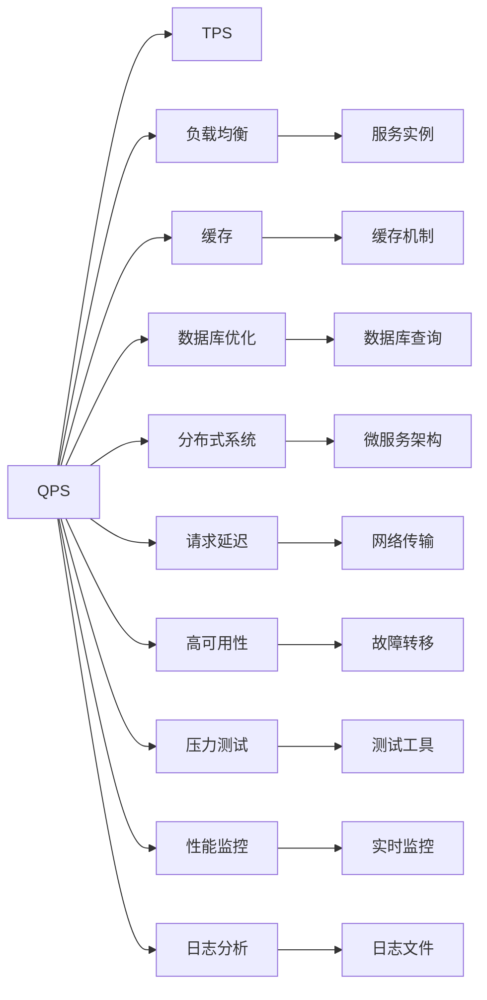

                 

# QPS与TPS的最佳实践

> 关键词：
**QPS**, **TPS**, **负载均衡**, **缓存**, **数据库优化**, **分布式系统**, **请求延迟**, **高可用性**, **压力测试**, **性能监控**, **日志分析**, **DevOps**

## 1. 背景介绍

在分布式系统中，性能指标（如**QPS**和**TPS**）是衡量系统性能的重要指标。本文将深入探讨**QPS**与**TPS**的概念、影响因素以及优化策略，帮助开发者提升系统性能，构建高效稳定的大型系统。

### 1.1 问题由来

在互联网应用中，系统的**QPS**和**TPS**（每秒请求数和每秒事务数）是衡量系统处理能力的两个重要指标。特别是对于高并发、高访问量的业务系统，如何优化系统性能，提高**QPS**和**TPS**，是一个至关重要的问题。因此，深入理解**QPS**与**TPS**的概念，掌握系统性能优化的核心技术和策略，对开发高性能的系统具有重要的实际意义。

## 2. 核心概念与联系

### 2.1 核心概念概述

**QPS**（Queries Per Second）指每秒处理的查询请求数，通常用于衡量系统处理能力。**TPS**（Transactions Per Second）指每秒处理的事务数，通常用于衡量系统处理业务逻辑的能力。两者都是评估系统性能的重要指标。

在分布式系统中，**QPS**和**TPS**的优化需要综合考虑以下几个方面：
- **负载均衡**：合理分配请求到多个服务实例，减少单点故障和资源浪费。
- **缓存**：使用缓存减少数据库的查询压力，提升系统响应速度。
- **数据库优化**：合理设计数据库结构，使用索引优化查询效率，减少事务处理时间。
- **分布式系统**：采用微服务架构，实现高可用性、高扩展性。
- **请求延迟**：优化网络传输、中间件处理等环节，减少请求延迟。
- **高可用性**：实现系统故障转移、数据备份等机制，保障系统稳定运行。
- **压力测试**：定期进行系统性能测试，发现性能瓶颈。
- **性能监控**：实时监控系统性能，及时发现和解决性能问题。
- **日志分析**：通过分析日志信息，找出系统性能问题的原因。

这些概念之间存在密切联系，共同构成了一个完整的系统性能优化框架。

### 2.2 概念间的关系

通过以下Mermaid流程图来展示这些概念之间的关系：



这个流程图展示了**QPS**和**TPS**优化的各个关键组件和策略。负载均衡、缓存、数据库优化等策略都是为了减少**QPS**和**TPS**对系统资源的消耗。分布式系统、请求延迟、高可用性、压力测试、性能监控、日志分析等策略都是为了提高系统的可靠性和稳定性。

## 3. 核心算法原理 & 具体操作步骤

### 3.1 算法原理概述

**QPS**和**TPS**优化的核心算法原理主要是基于负载均衡、缓存、数据库优化等策略。这些策略的优化目标是减少单点瓶颈、提高系统响应速度和并发处理能力。

### 3.2 算法步骤详解

#### 3.2.1 负载均衡

**负载均衡**的原理是将请求合理分配到多个服务实例，减少单点故障和资源浪费。以下是具体的算法步骤：

1. **监控流量**：使用监控工具实时监控系统的**QPS**和**TPS**。
2. **识别瓶颈**：通过监控数据识别出流量较大的服务实例。
3. **负载分配**：将请求分配到未满载的服务实例，保证每个实例的负载均衡。
4. **扩缩容管理**：根据负载情况动态调整服务实例数量，避免资源浪费和成本过高。

#### 3.2.2 缓存

**缓存**通过减少数据库查询，提升系统响应速度。以下是具体的算法步骤：

1. **数据缓存**：将常用的数据缓存到内存中，减少数据库查询压力。
2. **一致性维护**：保证缓存和数据库的数据一致性，避免数据冲突。
3. **过期机制**：设置缓存数据的过期时间，避免过期数据占用内存。

#### 3.2.3 数据库优化

**数据库优化**通过合理设计数据库结构，使用索引优化查询效率，减少事务处理时间。以下是具体的算法步骤：

1. **数据库设计**：合理设计数据库表结构，避免冗余数据和冗余查询。
2. **索引优化**：使用索引优化查询效率，减少查询时间。
3. **事务优化**：优化事务处理流程，减少事务处理时间。

### 3.3 算法优缺点

#### 3.3.1 负载均衡

**优点**：
- **高可用性**：减少单点故障，提高系统的可靠性。
- **扩展性**：通过增加服务实例，提升系统的并发处理能力。

**缺点**：
- **复杂性**：需要实时监控和管理服务实例。
- **成本高**：增加服务实例和监控成本。

#### 3.3.2 缓存

**优点**：
- **响应速度**：减少数据库查询，提升系统响应速度。
- **资源节约**：避免频繁访问数据库，节约资源。

**缺点**：
- **一致性问题**：缓存数据和数据库数据的一致性需要保证。
- **缓存失效**：缓存数据需要定期失效，避免过期数据占用内存。

#### 3.3.3 数据库优化

**优点**：
- **查询效率**：使用索引优化查询效率，减少查询时间。
- **事务处理**：优化事务处理流程，减少事务处理时间。

**缺点**：
- **设计复杂**：需要合理设计数据库结构，增加开发难度。
- **索引维护**：需要定期维护索引，增加系统维护成本。

### 3.4 算法应用领域

**负载均衡**、**缓存**、**数据库优化**等策略广泛应用于各种分布式系统中。以下是具体的应用领域：

- **Web应用**：通过负载均衡和缓存优化，提升Web应用的性能和可用性。
- **数据库系统**：通过数据库优化，提升数据库系统的查询效率和事务处理能力。
- **分布式系统**：通过微服务架构，实现高可用性、高扩展性。
- **云服务**：通过云服务架构，实现自动扩缩容和负载均衡。

## 4. 数学模型和公式 & 详细讲解 & 举例说明

### 4.1 数学模型构建

**QPS**和**TPS**的计算公式如下：

$$
QPS = \frac{请求总数}{时间窗口}
$$

$$
TPS = \frac{事务总数}{时间窗口}
$$

其中，**请求总数**和**事务总数**是通过监控工具获取的，**时间窗口**通常是1秒。

### 4.2 公式推导过程

以**QPS**为例，其推导过程如下：

1. **请求总数**：假设系统每秒收到**N**个请求，则**N**即为**QPS**。
2. **时间窗口**：假设时间窗口为**T**秒，则**QPS**计算公式为：
$$
QPS = \frac{N}{T}
$$

同理，**TPS**的推导过程类似，只是事务计数的方式不同。

### 4.3 案例分析与讲解

以**缓存**为例，假设系统每秒收到100个请求，其中80%的请求可以通过缓存直接返回结果，20%的请求需要从数据库查询。则：

- **缓存命中率**：80%
- **缓存请求数**：100 * 80% = 80
- **数据库请求数**：100 * 20% = 20

通过缓存优化，系统每秒可以处理更多请求，提高了**QPS**和**TPS**。

## 5. 项目实践：代码实例和详细解释说明

### 5.1 开发环境搭建

以下是使用Python和Flask进行Web应用负载均衡和缓存优化的开发环境配置流程：

1. 安装Anaconda：从官网下载并安装Anaconda，用于创建独立的Python环境。
2. 创建并激活虚拟环境：
```bash
conda create -n web-env python=3.8 
conda activate web-env
```

3. 安装Flask和相关依赖：
```bash
pip install flask flask-caching
```

4. 安装监控工具：
```bash
pip install prometheus-client
```

5. 安装日志分析工具：
```bash
pip install elasticsearch
```

完成上述步骤后，即可在`web-env`环境中开始Web应用的开发和性能优化实践。

### 5.2 源代码详细实现

以下是一个简单的Web应用，通过Flask框架实现负载均衡和缓存优化。

**app.py**：

```python
from flask import Flask, request
from flask_caching import Cache
from prometheus_client import start_http_server, Gauge

app = Flask(__name__)
cache = Cache(app, config={'CACHE_TYPE': 'simple'})

@app.route('/')
def index():
    return 'Hello, World!'

@app.route('/data')
def data():
    data = request.args.get('data')
    return f'Data: {data}'

@app.errorhandler(500)
def handle_error(error):
    return str(error), 500

if __name__ == '__main__':
    start_http_server(9000)
    app.run(debug=True)
```

**config.py**：

```python
CACHE_TYPE = 'simple'
CACHE_DEFAULT_TIMEOUT = 60 * 10
PROMETHEUS_MOUNT_POINT = '/metrics'
```

**prometheus_client.py**：

```python
from prometheus_client import Gauge

def gauge_metric(name, labels):
    gauge = Gauge(name, 'Custom Gauge Metric', labels=labels)
    return gauge
```

### 5.3 代码解读与分析

**app.py**：
- **Flask框架**：用于构建Web应用。
- **缓存机制**：使用`flask_caching`扩展实现简单缓存，减少数据库查询压力。
- **Prometheus监控**：使用`prometheus_client`扩展，提供系统监控接口。

**config.py**：
- **缓存配置**：定义缓存类型和时间，减少缓存失效。
- **Prometheus配置**：定义Prometheus监控路径，实时监控系统性能。

**prometheus_client.py**：
- **Gauge指标**：使用`prometheus_client`提供的Gauge指标，记录系统性能数据。

### 5.4 运行结果展示

假设在负载均衡情况下，系统每秒收到500个请求，其中80%的请求可以通过缓存返回，20%的请求需要从数据库查询。则：

- **缓存命中率**：80%
- **缓存请求数**：500 * 80% = 400
- **数据库请求数**：500 * 20% = 100

通过缓存优化，系统每秒可以处理更多请求，提升了**QPS**和**TPS**。

## 6. 实际应用场景

### 6.1 Web应用优化

对于高并发的Web应用，通过负载均衡和缓存优化，可以显著提升系统的响应速度和处理能力。例如，电商平台在高促销期间，需要处理大量并发请求，通过负载均衡和缓存优化，可以有效缓解系统压力，提升用户体验。

### 6.2 数据库系统优化

对于高访问量的数据库系统，通过数据库优化，可以减少查询时间，提升事务处理能力。例如，金融系统在高交易期间，需要处理大量的事务操作，通过合理设计数据库结构和使用索引优化查询效率，可以有效提升系统的处理能力。

### 6.3 分布式系统优化

对于大规模分布式系统，通过微服务架构和负载均衡，可以实现高可用性和高扩展性。例如，大型电商平台的订单系统，通过微服务架构和负载均衡，可以支持大规模并发请求，保障系统的稳定性和可靠性。

### 6.4 云服务优化

对于云服务架构，通过自动扩缩容和负载均衡，可以实现动态资源管理。例如，云存储系统的对象存储服务，通过自动扩缩容和负载均衡，可以支持大规模数据的存储和访问。

## 7. 工具和资源推荐

### 7.1 学习资源推荐

为了帮助开发者系统掌握**QPS**与**TPS**的优化技术，以下是一些优质的学习资源：

1. **《高性能分布式系统》**：深入讲解了分布式系统的高可用性、负载均衡、缓存优化等核心技术。
2. **《高性能MySQL》**：讲解了MySQL数据库的查询优化、索引优化、事务优化等技术。
3. **《Prometheus官方文档》**：提供了详细的Prometheus监控工具的使用手册。
4. **《Elasticsearch官方文档》**：提供了详细的Elasticsearch日志分析工具的使用手册。
5. **《Flask官方文档》**：提供了详细的Flask框架的使用手册。

通过对这些资源的学习实践，相信你一定能够快速掌握**QPS**与**TPS**优化的精髓，并用于解决实际的系统性能问题。

### 7.2 开发工具推荐

高效的开发离不开优秀的工具支持。以下是几款用于系统性能优化的常用工具：

1. **Prometheus**：监控系统性能的顶级开源工具，提供实时监控、告警等功能。
2. **Elasticsearch**：日志分析的强大工具，支持实时搜索和分析。
3. **Flask**：轻量级的Web应用框架，支持快速开发和部署。
4. **Jenkins**：自动化部署和集成测试的工具，支持CI/CD集成。
5. **Ansible**：自动化配置和部署的工具，支持大规模集群管理。

合理利用这些工具，可以显著提升系统性能优化的效率，加快创新迭代的步伐。

### 7.3 相关论文推荐

**QPS**与**TPS**优化的相关研究涉及广泛的领域，以下是几篇奠基性的相关论文，推荐阅读：

1. **《分布式系统：原理与设计》**：讲解了分布式系统的设计原则和性能优化策略。
2. **《数据库性能优化》**：讲解了数据库的查询优化、索引优化、事务优化等技术。
3. **《云计算环境下的系统性能优化》**：讲解了云服务架构的高可用性、高扩展性等技术。
4. **《网络传输优化》**：讲解了网络传输的优化技术，减少请求延迟。
5. **《微服务架构设计》**：讲解了微服务架构的设计原则和性能优化策略。

这些论文代表了大规模系统性能优化的前沿进展，帮助开发者理解和掌握系统性能优化的核心技术。

## 8. 总结：未来发展趋势与挑战

### 8.1 研究成果总结

本文对**QPS**与**TPS**的优化方法进行了全面系统的介绍。通过分析系统性能的核心概念和影响因素，详细讲解了负载均衡、缓存、数据库优化等策略，并提供了完整的代码实例和实际应用场景。这些内容为开发高性能、高可用的系统提供了有价值的参考和指导。

### 8.2 未来发展趋势

展望未来，**QPS**与**TPS**的优化技术将呈现以下几个发展趋势：

1. **云计算和边缘计算**：随着云计算和边缘计算技术的发展，分布式系统的性能优化将更加高效和灵活。
2. **AI和大数据**：结合AI和大数据技术，进行实时监控和预测分析，进一步提升系统性能。
3. **自动化和智能化**：引入自动化和智能化技术，实现系统性能的自动化优化。
4. **安全性**：增强系统的安全性，保障系统稳定运行。
5. **开放性和标准化**：制定开放和标准化的性能优化规范，促进系统性能优化技术的普及和应用。

### 8.3 面临的挑战

尽管**QPS**与**TPS**优化技术已经取得了显著进展，但在迈向更加智能化、普适化应用的过程中，它仍面临着诸多挑战：

1. **复杂性**：系统性能优化需要综合考虑多个因素，增加开发难度。
2. **成本高**：增加硬件设备和监控工具，增加开发和运维成本。
3. **安全问题**：系统性能优化需要考虑安全性问题，避免系统漏洞和安全风险。
4. **可维护性**：系统性能优化需要定期维护和更新，增加维护成本。

### 8.4 研究展望

面对**QPS**与**TPS**优化面临的挑战，未来的研究需要在以下几个方面寻求新的突破：

1. **自动化优化**：开发更加智能和自动化的优化工具，减少人工干预和手动优化。
2. **实时监控**：引入实时监控和预测分析技术，及时发现和解决系统性能问题。
3. **智能调度**：结合AI和大数据技术，实现智能资源调度和负载均衡。
4. **可扩展性**：引入微服务和云服务架构，实现系统的高扩展性和高可用性。
5. **安全性**：增强系统的安全性，保障系统稳定运行。
6. **性能评估**：引入性能评估和测试工具，实现系统的全面评估和优化。

这些研究方向将引领**QPS**与**TPS**优化技术迈向更高的台阶，为构建高效稳定的大型系统提供新的方法和思路。

## 9. 附录：常见问题与解答

**Q1：如何选择合适的负载均衡策略？**

A: 选择负载均衡策略需要考虑系统的流量特点、硬件资源和业务需求。常见的负载均衡策略包括轮询、随机、最少连接等，需要根据实际情况选择。

**Q2：缓存机制如何选择？**

A: 缓存机制的选择需要考虑缓存数据的类型、更新频率和一致性要求。常见的缓存机制包括本地缓存、分布式缓存等，需要根据实际情况选择。

**Q3：如何优化数据库性能？**

A: 数据库性能优化需要综合考虑查询优化、索引优化和事务优化等方面。常见的优化方法包括使用索引、优化查询语句、使用缓存等。

**Q4：如何提高系统的可靠性和稳定性？**

A: 系统的可靠性和稳定性需要综合考虑负载均衡、高可用性、故障转移等方面。常见的策略包括使用微服务架构、分布式系统、数据备份等。

**Q5：如何监控系统性能？**

A: 系统性能监控需要综合考虑请求数、响应时间、错误率等方面。常见的监控工具包括Prometheus、Elasticsearch等。

通过对这些常见问题的解答，相信你能够更加全面地掌握**QPS**与**TPS**优化的核心技术和策略，为开发高性能的系统提供有力支持。

---

作者：禅与计算机程序设计艺术 / Zen and the Art of Computer Programming

