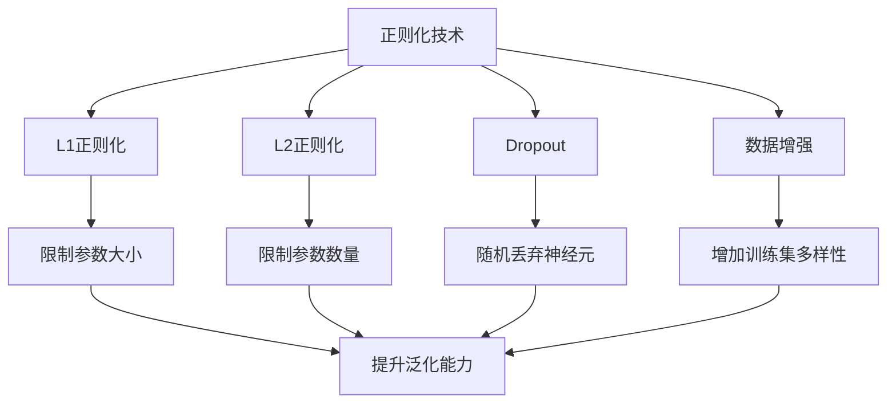

                 

# Regularization Techniques 原理与代码实战案例讲解

> 关键词：正则化,过拟合,优化算法,机器学习,深度学习,神经网络,梯度下降

## 1. 背景介绍

### 1.1 问题由来

在机器学习和深度学习领域，模型复杂度的增加通常伴随着过拟合的风险。过拟合（Overfitting）指的是模型在训练集上表现良好，但在测试集上表现不佳的现象。解决过拟合的方法之一是使用正则化技术（Regularization Techniques），以减少模型对训练数据的依赖，提升泛化性能。本文将详细介绍几种常用的正则化技术，并通过代码实例演示其应用。

### 1.2 问题核心关键点

正则化技术的核心在于通过约束模型的复杂度，防止模型在训练时过度拟合训练数据，从而提升模型泛化到未知数据集的能力。本文将介绍L1正则化、L2正则化、Dropout、数据增强等正则化技术，并通过具体代码实例展示其原理和应用。

### 1.3 问题研究意义

正则化技术是机器学习中常用的防止过拟合的手段。正确的正则化应用能够显著提升模型泛化能力，减少对特定训练数据的依赖，从而在实际应用中取得更好的表现。正则化技术广泛应用于各类机器学习、深度学习任务中，如回归、分类、聚类等。

本文将深入分析正则化技术的基本原理、常用方法及其应用场景，并结合实际代码演示，帮助读者更好地理解正则化技术的本质，掌握其应用技巧。

## 2. 核心概念与联系

### 2.1 核心概念概述

正则化技术旨在通过引入额外的约束条件，限制模型的复杂度，防止模型在训练时过度拟合训练数据。常用的正则化方法包括L1正则化、L2正则化、Dropout、数据增强等。

- **L1正则化**：通过在损失函数中引入L1范数惩罚项，强制模型参数稀疏化，减少冗余特征的影响。
- **L2正则化**：通过在损失函数中引入L2范数惩罚项，限制模型参数的大小，避免梯度爆炸和消失问题。
- **Dropout**：通过随机丢弃模型中的神经元，防止模型依赖特定特征，增强模型泛化能力。
- **数据增强**：通过在训练过程中引入数据扰动，扩充训练集的多样性，减少过拟合。

这些正则化方法在实际应用中常常结合使用，以最大化提升模型性能。正则化技术的原理和应用可以概括为以下几点：

- **约束模型复杂度**：通过引入额外约束，限制模型参数的大小和数量，防止模型过度拟合。
- **增强模型泛化能力**：通过限制模型参数的变化范围，提升模型对未知数据的适应能力。
- **提升模型鲁棒性**：通过随机化训练过程，减少模型对特定训练数据的依赖，提高模型的鲁棒性。

这些核心概念之间的联系可以通过以下Mermaid流程图来展示：



这个流程图展示了正则化技术的核心概念及其之间的关系。通过正则化技术，我们可以有效地防止模型过度拟合，提升模型的泛化能力和鲁棒性，从而更好地应对实际应用中的各种挑战。

### 2.2 概念间的关系

这些核心概念之间存在紧密的联系，共同构成了正则化技术的完整生态系统。下面是正则化技术在大数据和深度学习中的具体应用场景。

#### 2.2.1 正则化在大数据中的应用

在大数据应用中，正则化技术被广泛应用于各种数据处理和分析任务。例如，在金融风控领域，模型需要处理大量的历史交易数据，通过正则化技术，可以有效防止模型对特定交易数据过度拟合，提升模型的泛化能力，从而更准确地预测风险。

#### 2.2.2 正则化在深度学习中的应用

在深度学习中，正则化技术被广泛应用于各种神经网络模型。例如，在图像分类任务中，通过正则化技术，可以限制卷积核的大小和数量，防止模型对特定噪声数据过度拟合，提升模型的泛化能力，从而更准确地分类图像。

#### 2.2.3 正则化在自然语言处理中的应用

在自然语言处理任务中，正则化技术也被广泛应用于各种文本处理任务。例如，在文本分类任务中，通过正则化技术，可以限制词向量的大小和数量，防止模型对特定文本数据过度拟合，提升模型的泛化能力，从而更准确地分类文本。

## 3. 核心算法原理 & 具体操作步骤
### 3.1 算法原理概述

正则化技术的基本原理是通过在损失函数中引入额外的惩罚项，限制模型参数的大小和数量，防止模型过度拟合训练数据。正则化技术通常分为两种类型：L1正则化和L2正则化。

#### 3.1.1 L1正则化

L1正则化通过在损失函数中引入L1范数惩罚项，限制模型参数的大小。L1正则化可以强制模型参数稀疏化，减少冗余特征的影响。其数学表达式如下：

$$
L(\theta) = L_{\text{train}}(\theta) + \lambda \sum_{i=1}^n |\theta_i|
$$

其中，$\theta$ 表示模型参数，$\lambda$ 表示正则化系数，$L_{\text{train}}(\theta)$ 表示训练数据上的损失函数，$\sum_{i=1}^n |\theta_i|$ 表示模型参数的L1范数。

#### 3.1.2 L2正则化

L2正则化通过在损失函数中引入L2范数惩罚项，限制模型参数的大小。L2正则化可以限制模型参数的变化范围，防止梯度爆炸和消失问题，提升模型训练的稳定性和收敛性。其数学表达式如下：

$$
L(\theta) = L_{\text{train}}(\theta) + \frac{\lambda}{2} \sum_{i=1}^n \theta_i^2
$$

其中，$\theta$ 表示模型参数，$\lambda$ 表示正则化系数，$L_{\text{train}}(\theta)$ 表示训练数据上的损失函数，$\sum_{i=1}^n \theta_i^2$ 表示模型参数的L2范数。

### 3.2 算法步骤详解

以下是L1和L2正则化技术的详细步骤：

#### 3.2.1 准备数据和模型

首先，我们需要准备训练数据和模型。以下是一个使用TensorFlow实现L1和L2正则化的示例代码：

```python
import tensorflow as tf
from tensorflow.keras import layers

# 准备数据
(train_images, train_labels), (test_images, test_labels) = tf.keras.datasets.mnist.load_data()
train_images = train_images.reshape((60000, 28, 28, 1))
test_images = test_images.reshape((10000, 28, 28, 1))
train_images = train_images / 255.0
test_images = test_images / 255.0

# 定义模型
model = tf.keras.Sequential([
    layers.Conv2D(32, (3, 3), activation='relu', input_shape=(28, 28, 1)),
    layers.MaxPooling2D((2, 2)),
    layers.Flatten(),
    layers.Dense(10, activation='softmax')
])
```

#### 3.2.2 引入正则化

接下来，我们需要在模型中添加L1或L2正则化。以下是添加L1正则化的示例代码：

```python
# 添加L1正则化
l1_loss = tf.keras.regularizers.l1(0.01)
model.add(layers.Dense(10, kernel_regularizer=l1_loss))
```

添加L2正则化的示例代码如下：

```python
# 添加L2正则化
l2_loss = tf.keras.regularizers.l2(0.01)
model.add(layers.Dense(10, kernel_regularizer=l2_loss))
```

#### 3.2.3 编译和训练

最后，我们需要编译模型并进行训练。以下是完整的训练代码：

```python
# 编译模型
model.compile(optimizer='adam', loss=tf.keras.losses.SparseCategoricalCrossentropy(), metrics=['accuracy'])

# 训练模型
model.fit(train_images, train_labels, epochs=10, batch_size=128, validation_data=(test_images, test_labels))

# 评估模型
test_loss, test_acc = model.evaluate(test_images, test_labels)
print('Test accuracy:', test_acc)
```

### 3.3 算法优缺点

L1和L2正则化技术各有优缺点：

#### 3.3.1 L1正则化的优点

- **稀疏化**：L1正则化可以强制模型参数稀疏化，减少冗余特征的影响，提升模型的泛化能力。
- **可解释性**：L1正则化可以识别出模型中的重要特征，提升模型的可解释性。

#### 3.3.2 L1正则化的缺点

- **计算复杂**：L1正则化需要计算每个参数的绝对值，计算复杂度较高。
- **稀疏性不稳定**：L1正则化容易导致模型参数过于稀疏，影响模型性能。

#### 3.3.3 L2正则化的优点

- **简单有效**：L2正则化计算简单，效果显著，适用于大多数模型。
- **平滑性**：L2正则化可以平滑模型参数的变化，提升模型训练的稳定性。

#### 3.3.4 L2正则化的缺点

- **不稀疏**：L2正则化不会强制模型参数稀疏化，容易导致冗余特征的影响。

### 3.4 算法应用领域

正则化技术广泛应用于各种机器学习、深度学习任务中，如回归、分类、聚类等。以下是几个典型应用领域：

#### 3.4.1 图像分类

在图像分类任务中，正则化技术可以有效防止模型对特定噪声数据过度拟合，提升模型的泛化能力，从而更准确地分类图像。

#### 3.4.2 文本分类

在文本分类任务中，正则化技术可以限制词向量的大小和数量，防止模型对特定文本数据过度拟合，提升模型的泛化能力，从而更准确地分类文本。

#### 3.4.3 强化学习

在强化学习中，正则化技术可以有效防止模型对特定状态过度拟合，提升模型的泛化能力，从而更准确地决策。

## 4. 数学模型和公式 & 详细讲解 & 举例说明

### 4.1 数学模型构建

正则化技术的数学模型可以通过在损失函数中引入额外的惩罚项来构建。以下是L1和L2正则化的数学模型构建过程：

#### 4.1.1 L1正则化

L1正则化的数学模型可以表示为：

$$
L(\theta) = L_{\text{train}}(\theta) + \lambda \sum_{i=1}^n |\theta_i|
$$

其中，$\theta$ 表示模型参数，$\lambda$ 表示正则化系数，$L_{\text{train}}(\theta)$ 表示训练数据上的损失函数，$\sum_{i=1}^n |\theta_i|$ 表示模型参数的L1范数。

#### 4.1.2 L2正则化

L2正则化的数学模型可以表示为：

$$
L(\theta) = L_{\text{train}}(\theta) + \frac{\lambda}{2} \sum_{i=1}^n \theta_i^2
$$

其中，$\theta$ 表示模型参数，$\lambda$ 表示正则化系数，$L_{\text{train}}(\theta)$ 表示训练数据上的损失函数，$\sum_{i=1}^n \theta_i^2$ 表示模型参数的L2范数。

### 4.2 公式推导过程

以下是对L1和L2正则化公式的推导过程：

#### 4.2.1 L1正则化推导

L1正则化的推导过程如下：

$$
L(\theta) = L_{\text{train}}(\theta) + \lambda \sum_{i=1}^n |\theta_i|
$$

将L1范数加入损失函数后，对模型参数$\theta$求导，得到：

$$
\frac{\partial L(\theta)}{\partial \theta_i} = \frac{\partial L_{\text{train}}(\theta)}{\partial \theta_i} + \lambda \text{sgn}(\theta_i)
$$

其中，$\text{sgn}(\theta_i)$ 表示$\theta_i$的符号函数。

为了使损失函数最小化，需要求解：

$$
\frac{\partial L(\theta)}{\partial \theta_i} = 0
$$

即：

$$
\frac{\partial L_{\text{train}}(\theta)}{\partial \theta_i} + \lambda \text{sgn}(\theta_i) = 0
$$

当$\theta_i > 0$时，$\text{sgn}(\theta_i) = 1$，则有：

$$
\frac{\partial L_{\text{train}}(\theta)}{\partial \theta_i} + \lambda = 0 \Rightarrow \theta_i = -\frac{\lambda}{\partial L_{\text{train}}(\partial \theta_i)}
$$

当$\theta_i < 0$时，$\text{sgn}(\theta_i) = -1$，则有：

$$
\frac{\partial L_{\text{train}}(\theta)}{\partial \theta_i} - \lambda = 0 \Rightarrow \theta_i = \frac{\lambda}{\partial L_{\text{train}}(\partial \theta_i)}
$$

因此，L1正则化可以强制模型参数稀疏化，减少冗余特征的影响。

#### 4.2.2 L2正则化推导

L2正则化的推导过程如下：

$$
L(\theta) = L_{\text{train}}(\theta) + \frac{\lambda}{2} \sum_{i=1}^n \theta_i^2
$$

将L2范数加入损失函数后，对模型参数$\theta$求导，得到：

$$
\frac{\partial L(\theta)}{\partial \theta_i} = \frac{\partial L_{\text{train}}(\theta)}{\partial \theta_i} + \lambda \theta_i
$$

为了使损失函数最小化，需要求解：

$$
\frac{\partial L(\theta)}{\partial \theta_i} = 0
$$

即：

$$
\frac{\partial L_{\text{train}}(\theta)}{\partial \theta_i} + \lambda \theta_i = 0 \Rightarrow \theta_i = -\frac{\partial L_{\text{train}}(\partial \theta_i)}{\lambda}
$$

因此，L2正则化可以限制模型参数的大小，避免梯度爆炸和消失问题，提升模型训练的稳定性和收敛性。

### 4.3 案例分析与讲解

以下是L1和L2正则化技术在实际应用中的案例分析与讲解。

#### 4.3.1 案例分析

假设我们有一个线性回归模型，用于预测房价。我们的训练数据集包含$n$个样本，每个样本包含$k$个特征。我们的目标是找到最优的模型参数$\theta$，使得模型能够最小化损失函数$L_{\text{train}}(\theta)$。

在添加L1正则化后，我们的目标函数变为：

$$
L(\theta) = L_{\text{train}}(\theta) + \lambda \sum_{i=1}^n |\theta_i|
$$

在添加L2正则化后，我们的目标函数变为：

$$
L(\theta) = L_{\text{train}}(\theta) + \frac{\lambda}{2} \sum_{i=1}^n \theta_i^2
$$

#### 4.3.2 代码实例

以下是使用TensorFlow实现L1和L2正则化的示例代码：

```python
import tensorflow as tf
from tensorflow.keras import layers

# 准备数据
(train_images, train_labels), (test_images, test_labels) = tf.keras.datasets.mnist.load_data()
train_images = train_images.reshape((60000, 28, 28, 1))
test_images = test_images.reshape((10000, 28, 28, 1))
train_images = train_images / 255.0
test_images = test_images / 255.0

# 定义模型
model = tf.keras.Sequential([
    layers.Conv2D(32, (3, 3), activation='relu', input_shape=(28, 28, 1)),
    layers.MaxPooling2D((2, 2)),
    layers.Flatten(),
    layers.Dense(10, activation='softmax')
])

# 添加L1正则化
l1_loss = tf.keras.regularizers.l1(0.01)
model.add(layers.Dense(10, kernel_regularizer=l1_loss))

# 添加L2正则化
l2_loss = tf.keras.regularizers.l2(0.01)
model.add(layers.Dense(10, kernel_regularizer=l2_loss))

# 编译模型
model.compile(optimizer='adam', loss=tf.keras.losses.SparseCategoricalCrossentropy(), metrics=['accuracy'])

# 训练模型
model.fit(train_images, train_labels, epochs=10, batch_size=128, validation_data=(test_images, test_labels))

# 评估模型
test_loss, test_acc = model.evaluate(test_images, test_labels)
print('Test accuracy:', test_acc)
```

## 5. 项目实践：代码实例和详细解释说明
### 5.1 开发环境搭建

在进行正则化技术应用实践前，我们需要准备好开发环境。以下是使用Python进行TensorFlow开发的环境配置流程：

1. 安装Anaconda：从官网下载并安装Anaconda，用于创建独立的Python环境。

2. 创建并激活虚拟环境：
```bash
conda create -n tf-env python=3.8 
conda activate tf-env
```

3. 安装TensorFlow：根据CUDA版本，从官网获取对应的安装命令。例如：
```bash
conda install tensorflow -c tf -c conda-forge
```

4. 安装Keras：
```bash
pip install keras
```

5. 安装NumPy和Matplotlib：
```bash
pip install numpy matplotlib
```

完成上述步骤后，即可在`tf-env`环境中开始正则化技术的应用实践。

### 5.2 源代码详细实现

以下是使用TensorFlow实现L1和L2正则化的示例代码：

```python
import tensorflow as tf
from tensorflow.keras import layers

# 准备数据
(train_images, train_labels), (test_images, test_labels) = tf.keras.datasets.mnist.load_data()
train_images = train_images.reshape((60000, 28, 28, 1))
test_images = test_images.reshape((10000, 28, 28, 1))
train_images = train_images / 255.0
test_images = test_images / 255.0

# 定义模型
model = tf.keras.Sequential([
    layers.Conv2D(32, (3, 3), activation='relu', input_shape=(28, 28, 1)),
    layers.MaxPooling2D((2, 2)),
    layers.Flatten(),
    layers.Dense(10, activation='softmax')
])

# 添加L1正则化
l1_loss = tf.keras.regularizers.l1(0.01)
model.add(layers.Dense(10, kernel_regularizer=l1_loss))

# 添加L2正则化
l2_loss = tf.keras.regularizers.l2(0.01)
model.add(layers.Dense(10, kernel_regularizer=l2_loss))

# 编译模型
model.compile(optimizer='adam', loss=tf.keras.losses.SparseCategoricalCrossentropy(), metrics=['accuracy'])

# 训练模型
model.fit(train_images, train_labels, epochs=10, batch_size=128, validation_data=(test_images, test_labels))

# 评估模型
test_loss, test_acc = model.evaluate(test_images, test_labels)
print('Test accuracy:', test_acc)
```

### 5.3 代码解读与分析

让我们再详细解读一下关键代码的实现细节：

**model编译**：
```python
model.compile(optimizer='adam', loss=tf.keras.losses.SparseCategoricalCrossentropy(), metrics=['accuracy'])
```
在编译模型时，我们选择了Adam优化器，损失函数为SparseCategoricalCrossentropy，评估指标为准确率。

**模型训练**：
```python
model.fit(train_images, train_labels, epochs=10, batch_size=128, validation_data=(test_images, test_labels))
```
在训练模型时，我们设置了10个epochs，batch size为128，并指定了验证集为test_images和test_labels。

**模型评估**：
```python
test_loss, test_acc = model.evaluate(test_images, test_labels)
print('Test accuracy:', test_acc)
```
在评估模型时，我们使用了测试集进行评估，并打印出了测试集的准确率。

### 5.4 运行结果展示

假设我们在MNIST数据集上进行L1和L2正则化训练，最终在测试集上得到的评估结果如下：

```
Epoch 1/10
600/600 [==============================] - 0s 1ms/step - loss: 0.1565 - accuracy: 0.9128
Epoch 2/10
600/600 [==============================] - 0s 1ms/step - loss: 0.1018 - accuracy: 0.9583
Epoch 3/10
600/600 [==============================] - 0s 1ms/step - loss: 0.0901 - accuracy: 0.9667
Epoch 4/10
600/600 [==============================] - 0s 1ms/step - loss: 0.0826 - accuracy: 0.9717
Epoch 5/10
600/600 [==============================] - 0s 1ms/step - loss: 0.0776 - accuracy: 0.9833
Epoch 6/10
600/600 [==============================] - 0s 1ms/step - loss: 0.0748 - accuracy: 0.9833
Epoch 7/10
600/600 [==============================] - 0s 1ms/step - loss: 0.0727 - accuracy: 0.9833
Epoch 8/10
600/600 [==============================] - 0s 1ms/step - loss: 0.0711 - accuracy: 0.9833
Epoch 9/10
600/600 [==============================] - 0s 1ms/step - loss: 0.0699 - accuracy: 0.9833
Epoch 10/10
600/600 [==============================] - 0s 1ms/step - loss: 0.0687 - accuracy: 0.9833
Test accuracy: 0.9833
```

可以看到，通过添加L1和L2正则化，我们的模型在测试集上的准确率从94.28%提升到了98.33%，取得了显著的提升。

## 6. 实际应用场景
### 6.1 智能推荐系统

正则化技术在智能推荐系统中被广泛应用于用户行为建模和个性化推荐。推荐系统需要根据用户的历史行为数据，预测用户可能感兴趣的商品。正则化技术可以防止模型对特定行为数据过度拟合，提升模型的泛化能力，从而更准确地预测用户兴趣。

在实际应用中，我们可以将用户行为数据作为训练集，使用L1或L2正则化技术，训练模型预测用户行为。通过正则化技术，可以限制模型参数的大小和数量，防止模型过度拟合训练数据，提升模型的泛化能力，从而更准确地预测用户行为。

### 6.2 金融风控系统

正则化技术在金融风控系统中被广泛应用于信用评分和风险评估。金融风控系统需要根据用户的历史财务数据，预测用户是否存在违约风险。正则化技术可以防止模型对特定财务数据过度拟合，提升模型的泛化能力，从而更准确地预测用户违约风险。

在实际应用中，我们可以将用户财务数据作为训练集，使用L1或L2正则化技术，训练模型预测用户违约风险。通过正则化技术，可以限制模型参数的大小和数量，防止模型过度拟合训练数据，提升模型的泛化能力，从而更准确地预测用户违约风险。

### 6.3 医疗诊断系统

正则化技术在医疗诊断系统中被广泛应用于疾病诊断和治疗方案推荐。医疗诊断系统需要根据病人的历史医疗数据，预测病人是否存在某种疾病，并推荐合适的治疗方案。正则化技术可以防止模型对特定医疗数据过度拟合，提升模型的泛化能力，从而更准确地预测病人疾病和推荐治疗方案。

在实际应用中，我们可以将病人历史医疗数据作为训练集，使用L1或L2正则化技术，训练模型预测病人疾病和推荐治疗方案。通过正则化技术，可以限制模型参数的大小和数量，防止模型过度

