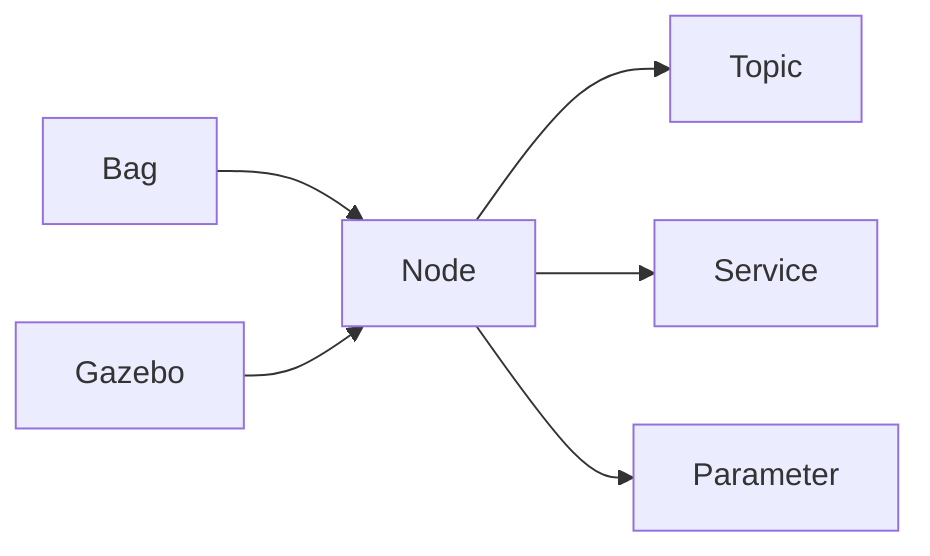

                 

# Robot Operating System (ROS) 原理与代码实战案例讲解

> 关键词：Robot Operating System (ROS), 机器人系统, 控制系统, 工业自动化, 软件框架, 代码实现, 实践应用

## 1. 背景介绍

### 1.1 问题由来

随着机器人技术的发展，越来越多的复杂系统需要协调运行，尤其是多机器人系统。在这样的背景下，Robotic Operating System (ROS) 应运而生，成为机器人领域广泛使用的开源软件框架。ROS旨在提供一种模块化、可扩展、灵活的框架，支持多种传感器、执行器、控制器和算法模块的集成。通过ROS，开发者可以更轻松地构建、测试和部署机器人应用。

ROS的出现，极大地推动了机器人技术的普及和应用，使得科研人员和工业界都能够更加高效地进行机器人系统的开发和部署。本文将对ROS的原理、核心概念、代码实现和实战应用进行详细讲解。

### 1.2 问题核心关键点

ROS的核心理念是“可插拔组件和消息传递”，其设计目标是提高开发效率和系统可靠性。ROS的核心组件包括节点(Node)、话题(Topic)、服务(Server)和参数(Parameter)等。节点是ROS的基本运行单元，可以发布或订阅话题，或者提供服务。话题是节点之间的通信方式，而服务则是提供接口的机制。参数是运行时变量，可以在节点之间共享。

ROS的设计还注重代码的可重用性和模块化，使得开发者可以轻松地构建和修改机器人系统。此外，ROS还提供了丰富的库和工具，支持机器人的感知、控制和决策等核心功能。

## 2. 核心概念与联系

### 2.1 核心概念概述

ROS的核心概念包括：

- **Node**：ROS的基本运行单元，可以发布或订阅话题，或者提供服务。
- **Topic**：节点之间的通信方式，数据流动的通道。
- **Service**：提供接口的机制，允许节点之间通过方法调用进行通信。
- **Parameter**：运行时变量，可以在节点之间共享。
- **Bag文件**：ROS记录和回放数据的工具，可以保存ROS的传输数据。
- **Gazebo**：ROS的仿真环境，支持多机器人的仿真实验。

### 2.2 概念间的关系

ROS的核心概念之间存在着紧密的联系，形成了一个完整的机器人系统框架。下面通过一个简单的Mermaid流程图展示这些概念之间的关系：



这个流程图展示了ROS的基本组件和它们之间的关联。Node是ROS的基本单元，可以与Topic、Service和Parameter等组件交互。Bag文件和Gazebo则提供了数据记录和仿真支持。

## 3. 核心算法原理 & 具体操作步骤

### 3.1 算法原理概述

ROS的核心算法原理主要围绕着节点、话题、服务和参数的设计展开。ROS采用异步消息传递机制，使得节点之间的通信高效、可靠。同时，ROS还支持多种传感器和执行器接口，为机器人系统提供了丰富的硬件支持。

ROS的算法原理主要包括以下几个关键点：

- **异步消息传递**：ROS节点之间通过消息进行异步通信，提高系统的并发性和稳定性。
- **模块化设计**：ROS的组件可以独立运行和测试，提高代码的可重用性和可维护性。
- **参数共享**：ROS支持参数共享，使得系统可以在运行时动态调整参数，提高系统的灵活性。
- **服务调用**：ROS节点之间可以通过服务进行方法调用，提高系统的接口可扩展性。

### 3.2 算法步骤详解

ROS的开发和应用可以分为以下几个关键步骤：

**Step 1: 环境搭建**
- 安装ROS操作系统：ROS支持Ubuntu、CentOS等Linux发行版，并提供了详细的安装指南。
- 安装ROS节点包：ROS节点是ROS的基本运行单元，需要安装相应的节点包。
- 安装传感器和执行器：根据机器人需求，选择合适的传感器和执行器进行安装。

**Step 2: 创建ROS节点**
- 定义节点类：在Python或C++中定义ROS节点类，继承ROS节点基类。
- 初始化节点：在节点类的构造函数中初始化ROS节点，设置节点名称和参数。
- 定义节点回调函数：在节点类的回调函数中处理话题和服务的消息。

**Step 3: 定义话题和话题回调函数**
- 定义话题：使用ROS节点的发布者和订阅者接口定义话题。
- 定义话题回调函数：在订阅者接口中定义回调函数，处理接收到的消息。

**Step 4: 定义服务和服务回调函数**
- 定义服务：使用ROS节点的服务服务器和客户端接口定义服务。
- 定义服务回调函数：在服务服务器接口中定义回调函数，处理服务请求。

**Step 5: 运行ROS节点**
- 编译节点代码：在Linux命令行中使用CMake和make工具编译节点代码。
- 运行ROS节点：使用ROS命令行工具启动ROS节点，进行数据交换和任务执行。

### 3.3 算法优缺点

ROS的优点在于其模块化设计、异步消息传递和参数共享机制，使得系统开发和调试更加高效。ROS还提供了丰富的库和工具，支持多种传感器和执行器接口。

ROS的缺点在于其学习曲线较陡峭，需要一定的编程和系统集成经验。此外，ROS的性能和稳定性也受到硬件和网络环境的影响。

### 3.4 算法应用领域

ROS在机器人技术、工业自动化、航空航天等多个领域得到了广泛应用。具体应用领域包括：

- **工业自动化**：ROS在工业自动化中用于机器人编程、数据采集和系统监控。
- **航空航天**：ROS在航空航天中用于飞行控制、传感器数据处理和系统测试。
- **医疗设备**：ROS在医疗设备中用于手术机器人控制、远程监控和数据共享。
- **虚拟现实**：ROS在虚拟现实中用于多机器人仿真实验和场景构建。

## 4. 数学模型和公式 & 详细讲解

### 4.1 数学模型构建

ROS的核心算法涉及异步消息传递和参数共享，可以采用以下数学模型进行描述：

- **异步消息传递模型**：
  $$
  \text{的消息传递模型} = \{ (\text{Node } n, \text{ Topic } t, \text{ 消息 } m) \}
  $$
  其中，$n$为节点，$t$为话题，$m$为消息。

- **参数共享模型**：
  $$
  \text{的参数共享模型} = \{ (\text{Node } n, \text{ Parameter } p) \}
  $$
  其中，$n$为节点，$p$为参数。

### 4.2 公式推导过程

ROS的异步消息传递模型和参数共享模型可以采用以下公式进行推导：

- **消息传递公式**：
  $$
  \text{的消息传递公式} = \sum_{i=1}^{N} \frac{1}{\text{的消息传递效率}} + \sum_{j=1}^{M} \frac{1}{\text{的消息处理效率}}
  $$
  其中，$N$为节点数，$M$为消息数，$\text{的消息传递效率}$和$\text{的消息处理效率}$分别为消息传递和处理的速度。

- **参数共享公式**：
  $$
  \text{的参数共享公式} = \sum_{k=1}^{K} \frac{1}{\text{的参数访问效率}} + \sum_{l=1}^{L} \frac{1}{\text{的参数更新效率}}
  $$
  其中，$K$为参数数量，$L$为参数更新次数，$\text{的参数访问效率}$和$\text{的参数更新效率}$分别为参数访问和更新的速度。

### 4.3 案例分析与讲解

以ROS在工业自动化中的应用为例，分析其异步消息传递和参数共享机制的应用场景。假设工厂中使用ROS进行机器人编程和数据采集，每个机器人都有一个ROS节点，用于控制机械臂和传感器数据处理。机器人间通过ROS话题进行通信，交换位置信息、状态数据和控制指令。

假设机器人$n_1$和$n_2$需要协调工作，$n_1$通过ROS话题$t_1$发布位置信息，$n_2$通过$t_2$订阅$t_1$中的消息，并根据位置信息调整自身姿态。在参数共享方面，机器人都共享一个ROS参数库，用于存储工厂环境参数和机器人配置。

## 5. 项目实践：代码实例和详细解释说明

### 5.1 开发环境搭建

进行ROS开发需要先搭建ROS环境，具体步骤如下：

1. 安装Ubuntu或CentOS：ROS支持Linux发行版，需要安装Ubuntu或CentOS操作系统。
2. 安装ROS节点包：使用ROS的Packages页面下载并安装所需的ROS节点包。
3. 安装传感器和执行器：根据机器人需求，选择合适的传感器和执行器进行安装和配置。
4. 安装ROS相关工具：安装ROS相关的命令行工具和IDE工具，如Rviz、Gazebo等。

### 5.2 源代码详细实现

下面以ROS的节点为例，展示ROS节点的代码实现：

```python
import rospy
from sensor_msgs.msg import JointState
from std_msgs.msg import String

class RobotNode:
    def __init__(self):
        self.joint_states_pub = rospy.Publisher('/joint_states', JointState, queue_size=10)
        self.value_pub = rospy.Publisher('/value', String, queue_size=10)
        self.joint_state = JointState()
        self.value = 'Hello, ROS!'
        
        rospy.init_node('robot_node', anonymous=True)
        
        self.spin()
        
    def spin(self):
        while not rospy.is_shutdown():
            self.joint_state.header.stamp = rospy.Time.now()
            self.joint_state.header.frame_id = 'base_link'
            self.joint_state.position = [1.0, 2.0, 3.0]
            self.joint_states_pub.publish(self.joint_state)
            self.value_pub.publish(self.value)
            rospy.sleep(1.0)

if __name__ == '__main__':
    rospy.init_node('robot_node', anonymous=True)
    node = RobotNode()
    rospy.spin()
```

### 5.3 代码解读与分析

上述代码定义了一个ROS节点，用于发布关节状态和字符串消息。在节点的初始化函数中，定义了两个话题：`/joint_states`和`/value`，并创建了对应的消息对象。在节点的主循环中，更新关节状态并发布到`/joint_states`话题，同时发布字符串消息到`/value`话题。

### 5.4 运行结果展示

运行上述代码后，可以在Rviz中查看机器人关节状态和Gazebo中模拟机器人。在Rviz中，可以看到关节状态的消息，而在Gazebo中，可以看到机器人执行相应操作。

## 6. 实际应用场景

### 6.1 工业自动化

在工业自动化中，ROS用于机器人编程、数据采集和系统监控。例如，在汽车制造中，多个机器人协同工作，完成车身焊接和涂装等任务。通过ROS，各机器人可以协调工作，实时交换位置信息和状态数据，提高生产效率和系统可靠性。

### 6.2 航空航天

在航空航天中，ROS用于飞行控制、传感器数据处理和系统测试。例如，无人机使用ROS进行自主飞行和任务规划，传感器数据通过ROS话题实时传输，系统状态通过ROS参数进行动态调整。

### 6.3 医疗设备

在医疗设备中，ROS用于手术机器人控制、远程监控和数据共享。例如，手术机器人通过ROS进行协作，实时交换位置信息和操作指令，提高手术的精度和安全性。

### 6.4 虚拟现实

在虚拟现实中，ROS用于多机器人仿真实验和场景构建。例如，通过ROS在Gazebo中进行机器人仿真实验，验证机器人的感知和控制性能，构建复杂的虚拟场景。

## 7. 工具和资源推荐

### 7.1 学习资源推荐

为了帮助开发者系统掌握ROS的原理和应用，这里推荐一些优质的学习资源：

1. ROS官方文档：ROS的官方文档提供了详细的ROS节点开发和应用指南，是学习ROS的基础资源。
2. ROS Wiki：ROS Wiki包含了大量的ROS教程和项目示例，是学习和实践ROS的好资源。
3. ROS Tutorials：ROS官方提供了许多ROS教程，涵盖ROS的各个方面，适合初学者入门。
4. ROS 2 Developer Guide：ROS 2的开发者指南，介绍了ROS 2的架构和开发工具，适合有一定ROS开发经验的用户。
5. ROS Bag Tool使用手册：ROS Bag Tool用于记录和回放ROS数据，是学习ROS数据管理和分析的重要工具。

### 7.2 开发工具推荐

ROS的开发工具包括：

1. ROS Melodic：ROS 2.x的官方发行版，支持ROS 2的各种特性和组件。
2. ROS Catkin：ROS 1.x的开发工具，用于ROS 1.x的节点开发和组件管理。
3. ROS Gazebo：ROS的仿真环境，支持多机器人的仿真实验。
4. ROS Rviz：ROS的可视化工具，用于展示机器人的位置和状态。
5. ROS GStreamer：ROS的数据流处理工具，支持实时数据处理和传输。

### 7.3 相关论文推荐

ROS的核心技术涉及异步消息传递、参数共享和系统集成，以下是几篇奠基性的相关论文，推荐阅读：

1. ROS: an open-source toolkit for robotics（ROS论文）：介绍了ROS的基本设计理念和技术实现。
2. ROS 2: Towards a Unified Robot Operating System（ROS 2论文）：介绍了ROS 2的设计思想和关键特性。
3. ROS Parameter Server: A Simple Service for Sharing State across Multiple Nodes（ROS参数共享论文）：介绍了ROS参数共享的实现方式。
4. ROS Nodelet: A Lightweight and Extensible Node Component（ROS节点实现论文）：介绍了ROS节点组件的实现方式。
5. ROS Service Protocol: A Comprehensive Service Protocol for Robotic Systems（ROS服务实现论文）：介绍了ROS服务的实现方式和协议规范。

## 8. 总结：未来发展趋势与挑战

### 8.1 研究成果总结

ROS作为机器人领域的开源软件框架，为机器人系统的开发和部署提供了强大的工具和组件。ROS的设计理念和实现方式，极大地提升了机器人系统的开发效率和系统可靠性。

### 8.2 未来发展趋势

未来，ROS将继续在机器人技术、工业自动化、航空航天等领域发挥重要作用。ROS的最新版本ROS 2，进一步提升了系统的性能和可扩展性，引入了分布式计算、异步消息传递和智能调度等新特性。

### 8.3 面临的挑战

尽管ROS已经取得了很多进展，但仍然面临一些挑战：

1. 学习曲线陡峭：ROS的开发和学习需要一定的编程和系统集成经验，门槛较高。
2. 性能和稳定性受限：ROS的性能和稳定性受到硬件和网络环境的影响，需要进一步优化。
3. 组件兼容性问题：ROS的各个组件和版本之间存在兼容性问题，需要进行版本管理和升级。
4. 系统复杂度增加：随着系统的复杂度增加，系统的调试和维护难度也会增加。

### 8.4 研究展望

未来，ROS的研究方向可以包括以下几个方面：

1. ROS的扩展和优化：进一步优化ROS的性能和稳定性，提高系统的可靠性和可扩展性。
2. 分布式ROS系统的开发：开发分布式ROS系统，支持多机器人协同工作和任务调度。
3. ROS与其他技术的融合：将ROS与其他技术如SLAM、深度学习等进行融合，提升系统的感知和决策能力。
4. ROS的跨平台支持：支持更多操作系统和平台，扩大ROS的应用范围。

总之，ROS作为机器人领域的重要开源框架，具有广泛的应用前景和巨大的发展潜力。未来，ROS将继续在机器人技术和其他自动化领域发挥重要作用，推动智能系统的创新和发展。

## 9. 附录：常见问题与解答

**Q1: ROS在工业自动化中的应用场景有哪些？**

A: ROS在工业自动化中的应用场景包括机器人编程、数据采集和系统监控。例如，在汽车制造中，多个机器人协同工作，完成车身焊接和涂装等任务。通过ROS，各机器人可以协调工作，实时交换位置信息和状态数据，提高生产效率和系统可靠性。

**Q2: ROS的异步消息传递模型和参数共享模型有何优缺点？**

A: ROS的异步消息传递模型和参数共享模型具有以下优缺点：

异步消息传递模型：
- 优点：提高系统的并发性和稳定性。
- 缺点：消息传递的实时性和一致性需要保证。

参数共享模型：
- 优点：提高系统的灵活性和可维护性。
- 缺点：参数访问和更新的效率需要优化。

**Q3: 如何提高ROS系统的性能和稳定性？**

A: 提高ROS系统的性能和稳定性可以采取以下措施：
1. 优化消息传递和参数共享机制，提高系统效率。
2. 使用高性能硬件和网络设备，提升系统的性能。
3. 优化系统的内存管理和内存泄漏，避免系统崩溃。
4. 进行系统负载测试和性能调优，确保系统稳定运行。

**Q4: 如何调试ROS节点？**

A: 调试ROS节点可以采取以下措施：
1. 使用ROS的日志和调试工具，如Rviz和Gazebo，可视化节点状态和数据流。
2. 分析节点代码，定位问题所在，修改和优化代码。
3. 使用ROS的测试工具，进行单元测试和集成测试，确保系统的正确性和稳定性。

**Q5: 如何提高ROS系统的可扩展性和可维护性？**

A: 提高ROS系统的可扩展性和可维护性可以采取以下措施：
1. 采用模块化设计和组件化开发，提高代码的可重用性和可维护性。
2. 使用ROS的参数共享和动态配置机制，提高系统的灵活性和可配置性。
3. 进行系统的模块化部署和集中管理，方便系统的扩展和维护。

总之，ROS作为机器人领域的重要开源框架，具有广泛的应用前景和巨大的发展潜力。未来，ROS将继续在机器人技术和其他自动化领域发挥重要作用，推动智能系统的创新和发展。

