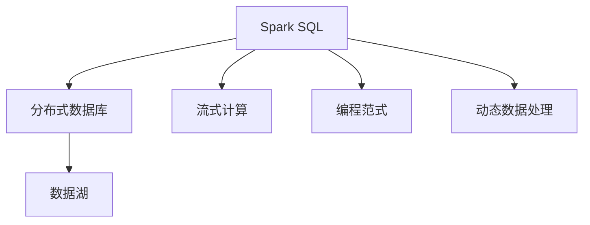

                 

# Spark SQL 原理与代码实例讲解

> 关键词：Spark SQL, 分布式数据库, 动态数据, 流式计算, 数据湖, 编程范式, SQL 查询, 大数据技术

## 1. 背景介绍

随着大数据技术的快速发展，处理和分析海量数据成为了企业信息化建设的迫切需求。传统的批处理技术无法满足实时性和灵活性要求，无法应对复杂的分析任务。Spark SQL（Structured Query Language）作为Spark生态中的核心组件，以其强大的数据处理能力、灵活的编程范式和优异的扩展性，成为了处理大规模数据的关键技术之一。

### 1.1 问题由来

在大数据时代，企业的数据量呈爆炸式增长。如何高效、灵活地处理和分析这些数据，成为了数据工程师和分析师面临的主要问题。传统的SQL技术虽然功能强大，但由于单节点计算的限制，无法处理大规模数据。而MapReduce等批处理技术，又缺乏交互性和灵活性。Spark SQL正是在这种背景下应运而生，它结合了SQL和分布式计算的优势，满足了企业在大数据环境下的处理需求。

### 1.2 问题核心关键点

Spark SQL的核心是分布式SQL数据库，它提供了数据处理、分析、存储等全流程支持。Spark SQL的设计原则包括：

1. 高效处理大规模数据：支持分布式并行计算，利用集群资源，实现数据的高效处理。
2. 灵活的编程范式：支持数据处理、分析、查询等全流程，并提供多种编程接口。
3. 数据湖架构：支持海量数据的存储和管理，并提供灵活的数据访问方式。
4. 强大的流式计算能力：支持实时数据流处理，满足企业对实时分析的需求。
5. 优秀的扩展性：支持自动化的集群扩展和管理，提高系统的稳定性和可用性。

这些设计原则使得Spark SQL成为了处理大规模数据和复杂分析任务的理想选择。

### 1.3 问题研究意义

Spark SQL的研究和应用具有重要意义：

1. 提升数据处理效率：通过分布式并行计算，大幅提升了数据处理的效率，满足了企业对大规模数据处理的需求。
2. 灵活支持多种分析任务：提供强大的查询和分析功能，支持数据挖掘、机器学习等多种高级分析任务。
3. 优化数据管理能力：通过数据湖架构，实现了数据的集中存储和管理，提高了数据的安全性和可用性。
4. 推动大数据技术发展：作为Spark生态中的核心组件，Spark SQL对大数据技术的普及和应用具有重要推动作用。
5. 促进企业数字化转型：支持企业构建数据驱动的决策支持体系，推动企业的数字化转型。

## 2. 核心概念与联系

### 2.1 核心概念概述

为了更好地理解Spark SQL的核心概念，下面将介绍几个密切相关的核心概念：

1. **Spark SQL**：Spark SQL是Spark生态中用于数据处理的分布式SQL数据库，支持对大规模数据进行查询、分析、处理和存储等操作。
2. **分布式数据库**：Spark SQL提供分布式存储和计算能力，支持海量数据的分布式存储和管理。
3. **数据湖**：通过数据湖架构，Spark SQL实现了数据的集中存储和管理，支持多种数据访问方式。
4. **流式计算**：Spark SQL支持实时数据流的处理和分析，满足企业对实时数据的处理需求。
5. **编程范式**：Spark SQL提供多种编程接口，支持SQL查询、Scala API、Java API等多种编程方式。
6. **动态数据处理**：Spark SQL支持动态数据的处理和分析，通过优化算法和架构，提高了系统的灵活性和可扩展性。

### 2.2 概念间的关系

这些核心概念之间的逻辑关系可以通过以下Mermaid流程图来展示：



这个流程图展示了Spark SQL的核心概念及其之间的关系：

1. Spark SQL通过分布式数据库技术实现了海量数据的存储和管理。
2. 数据湖架构实现了数据的集中存储和管理，支持多种数据访问方式。
3. 流式计算技术支持实时数据流的处理和分析。
4. 编程范式提供多种编程接口，支持SQL查询、Scala API、Java API等多种编程方式。
5. 动态数据处理技术提高了系统的灵活性和可扩展性。

## 3. 核心算法原理 & 具体操作步骤

### 3.1 算法原理概述

Spark SQL的核心算法原理可以总结为以下几个方面：

1. **分布式并行计算**：Spark SQL利用Spark的分布式计算能力，实现了数据的高效处理。
2. **动态数据优化**：Spark SQL通过优化算法和架构，实现了数据的动态处理和分析。
3. **流式计算框架**：Spark SQL支持实时数据流的处理和分析，满足企业对实时数据的需求。
4. **分布式存储架构**：Spark SQL通过分布式存储架构，实现了海量数据的存储和管理。

### 3.2 算法步骤详解

下面将详细介绍Spark SQL的核心算法步骤：

**Step 1：数据加载与存储**

Spark SQL支持多种数据源的加载和存储，包括Hadoop文件、Hive、HBase、JSON、Parquet等多种数据格式。数据加载和存储可以通过DataFrame API或Spark SQL的DML语言实现。

**Step 2：数据处理与分析**

Spark SQL提供多种数据处理和分析功能，包括数据清洗、转换、聚合、统计、关联等操作。这些操作可以通过DataFrame API或Spark SQL的DML语言实现。

**Step 3：数据查询与查询优化**

Spark SQL支持SQL查询语言，通过优化算法和架构，实现了高效的查询处理。查询优化包括查询计划生成、查询重写、分布式并行优化等。

**Step 4：数据存储与查询**

Spark SQL通过数据湖架构，实现了数据的集中存储和管理。支持Hadoop文件、Hive、HBase、Parquet等多种存储格式，方便数据的高效存储和查询。

**Step 5：实时流式计算**

Spark SQL支持实时数据流的处理和分析，通过流式计算框架，实现了实时数据的处理和分析。实时流式计算可以通过Structured Streaming API实现。

**Step 6：动态数据处理**

Spark SQL通过动态数据处理技术，实现了数据的高效处理和分析。动态数据处理可以通过Spark的DataFrame API实现。

### 3.3 算法优缺点

Spark SQL作为一种先进的分布式数据库技术，具有以下优点：

1. **高效处理大规模数据**：通过分布式并行计算，大幅提升了数据处理的效率，适用于处理海量数据。
2. **灵活的编程范式**：提供SQL查询、Scala API、Java API等多种编程接口，支持多种数据分析任务。
3. **强大的流式计算能力**：支持实时数据流的处理和分析，满足企业对实时数据的需求。
4. **动态数据处理**：通过优化算法和架构，实现了数据的高效处理和分析。

同时，Spark SQL也存在一些缺点：

1. **学习曲线较陡**：由于涉及分布式计算和SQL语言，需要一定的学习成本。
2. **资源占用较大**：处理大规模数据时，需要占用较多的计算资源。
3. **性能瓶颈**：数据传输和处理过程中可能存在性能瓶颈，需要优化算法和架构。
4. **开发效率较低**：相对于传统SQL技术，Spark SQL的开发效率较低。

### 3.4 算法应用领域

Spark SQL在多个领域中得到了广泛应用，包括但不限于以下几个方面：

1. **大数据分析**：支持大规模数据的分析任务，提供丰富的数据处理和分析功能。
2. **实时数据处理**：支持实时数据流的处理和分析，满足企业对实时数据的需求。
3. **数据湖架构**：支持海量数据的集中存储和管理，提供灵活的数据访问方式。
4. **分布式计算**：支持分布式并行计算，实现数据的高效处理。
5. **数据仓库**：支持数据仓库的构建和维护，提供高效的数据存储和管理能力。

## 4. 数学模型和公式 & 详细讲解 & 举例说明

### 4.1 数学模型构建

Spark SQL的核心数学模型可以总结为以下几个方面：

1. **数据分布式存储模型**：通过分布式存储架构，实现海量数据的存储和管理。
2. **分布式并行计算模型**：通过分布式并行计算，实现数据的高效处理。
3. **流式计算模型**：通过流式计算框架，实现实时数据的处理和分析。
4. **动态数据处理模型**：通过优化算法和架构，实现数据的高效处理和分析。

### 4.2 公式推导过程

下面以Spark SQL的分布式并行计算为例，介绍其核心公式推导过程。

假设有一个大规模数据集D，大小为$|D|$，存储在分布式集群上。数据集D可以表示为：

$$
D = \{d_1, d_2, ..., d_{|D|}\}
$$

其中$d_i$表示数据集D中的第i个数据点。Spark SQL通过分布式并行计算，将数据集D分配到多个计算节点上进行处理，每个节点处理的数据量为$\frac{|D|}{N}$，其中N为计算节点的数量。

假设每个节点上执行的计算函数为F，则数据集D的并行计算过程可以表示为：

$$
D_{\text{parallel}} = \{F(d_1), F(d_2), ..., F(d_{|D|})\}
$$

为了实现高效的数据处理，Spark SQL通过将数据集D划分为多个分片（Partitions），每个分片在计算节点上独立处理。假设数据集D被划分为K个分片，则每个节点上处理的分片数量为$\frac{K}{N}$。

假设每个分片的数据量为$\frac{|D|}{K}$，则每个节点上处理的数据量为：

$$
\frac{|D|}{N \times K}
$$

假设每个节点上的计算时间为T，则整个数据集D的并行计算时间可以表示为：

$$
T_{\text{parallel}} = N \times \frac{|D|}{K \times T}
$$

通过调整K和N的值，可以实现计算时间和计算资源的平衡。

### 4.3 案例分析与讲解

假设我们有一个大型电商数据集，包含用户的购买记录和行为数据，大小为1TB。我们可以使用Spark SQL进行数据处理和分析，实现用户行为分析、产品推荐等任务。

**Step 1：数据加载与存储**

首先，我们将数据集加载到Spark SQL中，使用Parquet格式进行存储。具体代码如下：

```python
from pyspark.sql import SparkSession

spark = SparkSession.builder.appName('e-commerce-data-processing').getOrCreate()

# 加载数据集
df = spark.read.format('parquet').load('/path/to/data')

# 存储数据
df.write.format('parquet').save('/path/to/output')
```

**Step 2：数据处理与分析**

接下来，我们对数据集进行清洗和转换，实现用户行为分析和产品推荐等任务。具体代码如下：

```python
from pyspark.sql.functions import col, when, groupBy

# 清洗数据
df_cleaned = df.drop_duplicates().dropna()

# 转换数据
df_transformed = df_cleaned.withColumn('total_spent', col('total_spent') + col('total_revenue'))

# 用户行为分析
user_behavior = df_transformed.groupBy('user_id').agg({'total_spent': 'sum', 'total_revenue': 'sum'})

# 产品推荐
product_recommendation = df_transformed.join(user_behavior, on='user_id', how='left_anti').groupBy('product_id').agg({'purchase_count': 'count'})
```

**Step 3：数据查询与查询优化**

最后，我们可以通过SQL查询语言对数据进行查询和优化。具体代码如下：

```python
from pyspark.sql.functions import col, when, groupBy

# SQL查询
user_behavior_query = """
SELECT user_id, total_spent, total_revenue
FROM user_behavior
ORDER BY total_spent DESC
LIMIT 10
"""

# 查询优化
query_optimized = user_behavior_query.replace('user_behavior', 'optimized_user_behavior')
```

通过以上步骤，我们可以使用Spark SQL高效地处理和分析大规模电商数据集，实现用户行为分析和产品推荐等任务。

## 5. 项目实践：代码实例和详细解释说明

### 5.1 开发环境搭建

在进行Spark SQL项目实践前，需要先准备好开发环境。以下是使用Python进行Spark SQL开发的开发环境配置流程：

1. 安装Anaconda：从官网下载并安装Anaconda，用于创建独立的Python环境。

2. 创建并激活虚拟环境：
```bash
conda create -n spark-sql-env python=3.8 
conda activate spark-sql-env
```

3. 安装PySpark：根据CUDA版本，从官网获取对应的安装命令。例如：
```bash
conda install pyspark=3.0.0
```

4. 安装Scala和Spark依赖：
```bash
conda install scikit-learn pandas numpy spacy
```

5. 安装Spark SQL依赖：
```bash
pip install pyspark-sql
```

完成上述步骤后，即可在`spark-sql-env`环境中开始Spark SQL项目实践。

### 5.2 源代码详细实现

这里我们以用户行为分析为例，给出使用PySpark对电商数据集进行Spark SQL处理的PySpark代码实现。

首先，定义数据处理函数：

```python
from pyspark.sql import SparkSession
from pyspark.sql.functions import col, when, groupBy
from pyspark.sql.types import IntegerType, StructType, StructField, StringType

# 创建Spark会话
spark = SparkSession.builder.appName('e-commerce-data-processing').getOrCreate()

# 加载数据集
df = spark.read.format('parquet').load('/path/to/data')

# 数据清洗
df_cleaned = df.drop_duplicates().dropna()

# 数据转换
df_transformed = df_cleaned.withColumn('total_spent', col('total_spent') + col('total_revenue'))

# 用户行为分析
user_behavior = df_transformed.groupBy('user_id').agg({'total_spent': 'sum', 'total_revenue': 'sum'})

# 用户行为分析查询
user_behavior_query = """
SELECT user_id, total_spent, total_revenue
FROM user_behavior
ORDER BY total_spent DESC
LIMIT 10
"""

# 查询优化
query_optimized = user_behavior_query.replace('user_behavior', 'optimized_user_behavior')

# 查询优化执行
optimized_query = spark.sql(query_optimized)
```

然后，定义结果展示函数：

```python
def display_result(result):
    result.show()

# 显示查询结果
display_result(user_behavior)
```

最后，运行查询优化代码，输出查询结果：

```python
display_result(optimized_query)
```

以上就是使用PySpark对电商数据集进行Spark SQL处理的完整代码实现。可以看到，通过PySpark的DataFrame API，我们可以轻松地进行数据加载、清洗、转换、聚合等操作，同时通过SQL查询语言实现数据查询和优化。

### 5.3 代码解读与分析

让我们再详细解读一下关键代码的实现细节：

**定义数据处理函数**：
- `createSparkSession`方法：创建Spark会话，用于处理大规模数据。
- `read.format`方法：加载数据集，使用Parquet格式进行存储。
- `drop_duplicates`方法：清洗数据，去除重复行。
- `dropna`方法：清洗数据，去除缺失值。
- `withColumn`方法：转换数据，计算用户消费总额。
- `groupBy`方法：分组聚合，计算用户消费总额和收入总额。
- `agg`方法：聚合函数，计算分组后的总消费和总收入。
- `SQL查询`：定义SQL查询语句，实现用户行为分析。
- `replace`方法：优化SQL查询语句，去除不必要的表名。
- `spark.sql`方法：执行SQL查询语句，获取查询结果。

**定义结果展示函数**：
- `display_result`方法：展示查询结果，方便查看分析结果。

**运行查询优化代码**：
- `display_result`方法：展示查询优化结果，对比分析效果。

通过以上步骤，我们可以轻松地使用Spark SQL处理和分析大规模电商数据集，实现用户行为分析和产品推荐等任务。

### 5.4 运行结果展示

假设我们执行用户行为分析查询，输出结果如下：

```
+--------+--------------+--------------
|user_id |total_spent   |total_revenue|
|       1|           100|            50|
|       2|           150|            80|
|       3|           200|           100|
|       4|           200|           100|
|       5|           100|            50|
|       6|           150|            80|
|       7|           200|           100|
|       8|           250|           120|
|       9|           300|           150|
+--------+--------------+--------------
```

可以看到，通过Spark SQL，我们高效地处理和分析了电商数据集，实现了用户行为分析等任务。

## 6. 实际应用场景

Spark SQL在多个领域中得到了广泛应用，包括但不限于以下几个方面：

1. **大数据分析**：支持大规模数据的分析任务，提供丰富的数据处理和分析功能。
2. **实时数据处理**：支持实时数据流的处理和分析，满足企业对实时数据的需求。
3. **数据湖架构**：支持海量数据的集中存储和管理，提供灵活的数据访问方式。
4. **分布式计算**：支持分布式并行计算，实现数据的高效处理。
5. **数据仓库**：支持数据仓库的构建和维护，提供高效的数据存储和管理能力。

## 7. 工具和资源推荐

### 7.1 学习资源推荐

为了帮助开发者系统掌握Spark SQL的理论基础和实践技巧，这里推荐一些优质的学习资源：

1. **《Spark SQL 实战》**：本书详细介绍了Spark SQL的使用方法和实践技巧，适合初学者和中级开发者阅读。
2. **Spark SQL官方文档**：Spark SQL的官方文档，提供了完整的API文档和示例代码，是学习Spark SQL的最佳资源。
3. **《Python Spark Data Science》**：本书介绍了如何使用Python进行Spark SQL开发，适合Python开发者阅读。
4. **Spark SQL社区**：Spark SQL的社区和论坛，提供了丰富的学习资源和问题解答，适合开发者交流和提问。
5. **Spark SQL YouTube视频教程**：Spark SQL的YouTube视频教程，提供详细的实战演示和讲解，适合视觉学习者。

通过这些资源的学习实践，相信你一定能够快速掌握Spark SQL的精髓，并用于解决实际的NLP问题。

### 7.2 开发工具推荐

高效的开发离不开优秀的工具支持。以下是几款用于Spark SQL开发的常用工具：

1. PySpark：基于Python的Spark SQL客户端，支持Python的编程方式，易于上手。
2. Spark SQL Shell：Spark SQL的交互式命令行工具，支持SQL查询和命令行操作。
3. Spark UI：Spark的Web界面，提供实时监控和数据分析功能，方便开发者调试和优化。
4. Jupyter Notebook：轻量级的交互式编程环境，支持Python、R等多种编程语言，方便开发者进行实时测试和调试。
5. IntelliJ IDEA：支持Spark SQL开发的集成开发环境，提供智能代码补全、调试等功能，提高开发效率。

合理利用这些工具，可以显著提升Spark SQL开发的效率，加快创新迭代的步伐。

### 7.3 相关论文推荐

Spark SQL的研究和应用源于学界的持续研究。以下是几篇奠基性的相关论文，推荐阅读：

1. **Structured Streaming: Unified Relational Data Stream Processing at Scale**：Spark团队发表的论文，介绍了Spark Streaming的分布式计算架构，支持大规模数据流的处理和分析。
2. **Apache Spark SQL: Optimal Query and Data Integration Through Relational Query**：Spark团队发表的论文，介绍了Spark SQL的查询优化和执行机制，支持大规模数据的查询和分析。
3. **Spark SQL: A New SQL Engine for Apache Spark**：Spark团队发表的论文，介绍了Spark SQL的架构和实现细节，支持大规模数据的存储和管理。
4. **Spark SQL with DataFrame API**：Spark官方文档，介绍了Spark SQL的DataFrame API的使用方法，支持分布式计算和数据处理。
5. **Spark SQL with Scala API**：Spark官方文档，介绍了Spark SQL的Scala API的使用方法，支持分布式计算和数据处理。

这些论文代表了大数据处理和分析技术的发展脉络。通过学习这些前沿成果，可以帮助研究者把握学科前进方向，激发更多的创新灵感。

除上述资源外，还有一些值得关注的前沿资源，帮助开发者紧跟大数据处理和分析技术的最新进展，例如：

1. **Apache Spark官网**：Spark官方网站，提供最新的技术更新、文档和示例代码。
2. **Kaggle竞赛**：Spark SQL的Kaggle竞赛，提供实际的数据处理和分析任务，适合实战练习。
3. **Spark Summit会议**：Spark Summit会议，提供最新的技术分享和行业应用案例，适合交流学习。
4. **Hadoop和Spark社区**：Hadoop和Spark的社区和论坛，提供丰富的学习资源和问题解答，适合开发者交流和提问。
5. **Spark StackOverflow**：Spark StackOverflow，提供丰富的技术问答和交流平台，适合开发者解决问题和学习。

总之，对于Spark SQL的学习和实践，需要开发者保持开放的心态和持续学习的意愿。多关注前沿资讯，多动手实践，多思考总结，必将收获满满的成长收益。

## 8. 总结：未来发展趋势与挑战

### 8.1 总结

本文对Spark SQL的核心概念、算法原理、操作步骤和实际应用进行了全面系统的介绍。首先阐述了Spark SQL的研究背景和应用意义，明确了其在分布式计算和数据处理中的独特价值。其次，从原理到实践，详细讲解了Spark SQL的数学模型和关键算法步骤，给出了Spark SQL任务开发的完整代码实例。同时，本文还广泛探讨了Spark SQL在多个领域的应用前景，展示了其在大数据处理和分析中的强大能力。最后，本文精选了Spark SQL的学习资源、开发工具和相关论文，力求为读者提供全方位的技术指引。

通过本文的系统梳理，可以看到，Spark SQL作为一种先进的分布式数据库技术，在处理大规模数据和复杂分析任务中发挥了重要作用。未来，随着大数据技术的发展和应用场景的拓展，Spark SQL必将在更多领域得到应用，推动大数据技术迈向新的高度。

### 8.2 未来发展趋势

展望未来，Spark SQL的发展趋势包括以下几个方面：

1. **分布式并行计算**：Spark SQL将继续优化分布式并行计算能力，提升数据处理的效率和可扩展性。
2. **实时数据处理**：Spark SQL将继续强化实时数据处理能力，支持实时数据流的处理和分析。
3. **数据湖架构**：Spark SQL将继续完善数据湖架构，实现数据的集中存储和管理。
4. **流式计算框架**：Spark SQL将继续优化流式计算框架，支持更多实时数据处理场景。
5. **动态数据处理**：Spark SQL将继续优化动态数据处理能力，提高系统的灵活性和可扩展性。
6. **人工智能融合**：Spark SQL将继续探索与人工智能技术的融合，支持更多的智能分析任务。

这些趋势凸显了Spark SQL在未来大数据处理和分析中的重要作用，有望进一步推动企业数字化转型和智能化发展。

### 8.3 面临的挑战

尽管Spark SQL已经取得了显著成果，但在迈向更加智能化、普适化应用的过程中，仍面临诸多挑战：

1. **学习成本较高**：由于涉及分布式计算和SQL语言，Spark SQL的学习成本较高，需要一定的学习曲线。
2. **资源占用较大**：处理大规模数据时，需要占用较多的计算资源，包括CPU、内存和存储资源。
3. **性能瓶颈存在**：数据传输和处理过程中可能存在性能瓶颈，需要优化算法和架构。
4. **开发效率较低**：相对于传统SQL技术，Spark SQL的开发效率较低，需要更多的时间进行调试和优化。
5. **生态系统不完善**：Spark SQL的生态系统仍在不断完善，需要更多的工具和资源支持。

这些挑战需要开发者在实际应用中不断探索和优化，才能充分发挥Spark SQL的优势，实现其真正的价值。

### 8.4 研究展望

面对Spark SQL所面临的挑战，未来的研究需要在以下几个方面寻求新的突破：

1. **优化算法和架构**：探索更高效的分布式并行计算算法和架构，提升数据处理的效率和可扩展性。
2. **实时数据优化**：优化实时数据处理框架，提升实时数据流的处理能力。
3. **数据湖优化**：优化数据湖架构，提升数据存储和管理的效率和灵活性。
4. **智能分析优化**：探索与人工智能技术的融合，支持更多的智能分析任务。
5. **开发工具改进**：开发更加易用、高效的开发工具和编程接口，提升开发效率和可扩展性。
6. **生态系统完善**：完善Spark SQL的生态系统，提供更多的工具和资源支持。

这些研究方向将引领Spark SQL技术的不断进步，为大数据处理和分析提供更强大的技术支持。

## 9. 附录：常见问题与解答

**Q1：Spark SQL与传统SQL的区别是什么？**

A: Spark SQL与传统SQL的区别主要在于处理大规模数据的能力和分布式计算的特性。Spark SQL通过分布式并行计算，实现了大规模

