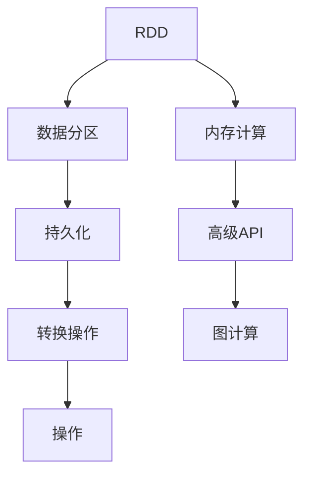
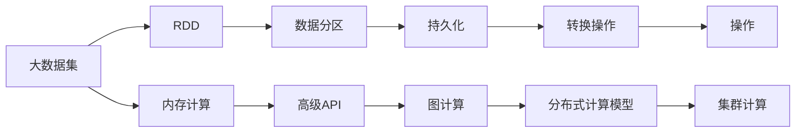

                 

# Spark原理与代码实例讲解

## 1. 背景介绍

### 1.1 问题由来

Apache Spark是当今最流行的分布式计算框架之一，广泛应用于大数据处理和机器学习领域。它的出现极大地改变了数据分析和处理的生态系统，允许用户在内存中对大规模数据进行高效处理。Spark的原理涉及多个关键概念和组件，本文旨在通过系统的讲解和代码实例，帮助读者深入理解其原理和实践。

### 1.2 问题核心关键点

Spark的原理主要围绕以下几个核心概念展开：

1. **分布式计算模型**：Spark的核心在于其分布式计算模型，将大规模数据分割成多个小份，分配到集群中的各个节点上并行处理。

2. **弹性分布式数据集（RDD）**：RDD是Spark中最重要的抽象之一，提供了一种容错的、分布式的集合操作接口。

3. **内存计算**：Spark通过将数据存储在内存中，显著提升了数据处理速度，尤其是在迭代算法和机器学习任务中表现尤为突出。

4. **高级API**：Spark提供了一组高级API，如Spark SQL、Spark Streaming、MLlib等，简化了数据处理和机器学习的复杂度。

5. **图计算**：Spark还提供了GraphX库，用于处理大规模的图数据集。

### 1.3 问题研究意义

研究Spark的原理和实践对于大数据和机器学习的从业者具有重要意义：

1. **提高效率**：通过深入理解Spark的原理，可以显著提升数据处理和分析的效率。

2. **降低成本**：Spark的内存计算特性可以大幅降低存储和计算的成本，特别是在大规模数据处理中。

3. **拓展应用**：Spark的高级API和图计算能力，使其能够应用于更广泛的领域，如实时数据分析、机器学习、社交网络分析等。

4. **提升技能**：掌握Spark原理和实践，对于大数据和机器学习领域的工程师来说是提升技能的重要途径。

5. **推动创新**：Spark的灵活性和扩展性，为大数据和机器学习领域的创新提供了有力支持。

## 2. 核心概念与联系

### 2.1 核心概念概述

为更好地理解Spark的原理，本节将介绍几个密切相关的核心概念：

1. **弹性分布式数据集（RDD）**：Spark中数据处理的基本单位，提供了一系列高效的数据操作接口。

2. **数据分区（Partitioning）**：将RDD分成多个小分区，并行处理每个分区，提高数据处理效率。

3. **持久化（Persistence）**：将RDD持久化到内存或磁盘，减少重复计算，提高数据访问速度。

4. **转换操作（Transformation）**：对RDD进行转换，生成新的RDD，如`map`、`filter`、`reduceByKey`等。

5. **操作（Action）**：对RDD进行具体的操作，如`collect`、`count`、`save`等，触发RDD的分发和合并。

6. **图计算（GraphX）**：用于处理大规模的图数据集，提供高效的图计算算法和接口。

这些核心概念之间通过Spark的分布式计算模型紧密联系在一起，共同构成了Spark的数据处理框架。

### 2.2 概念间的关系

这些核心概念之间的逻辑关系可以通过以下Mermaid流程图来展示：



这个流程图展示了Spark核心概念之间的联系：

1. RDD是Spark中数据处理的基本单位，可以对其进行操作和转换。
2. 数据分区将RDD分成多个小分区，便于并行处理。
3. 持久化将RDD持久化到内存或磁盘，减少重复计算。
4. 转换操作对RDD进行各种转换，生成新的RDD。
5. 操作对RDD进行具体的操作，触发RDD的分发和合并。
6. 内存计算通过将数据存储在内存中，提高数据处理速度。
7. 高级API提供了高效的数据处理和机器学习接口。
8. 图计算用于处理大规模的图数据集，提供高效的图计算算法。

通过这些概念和它们之间的关系，我们可以更好地理解Spark的数据处理原理。

### 2.3 核心概念的整体架构

最后，我们用一个综合的流程图来展示这些核心概念在大数据处理中的整体架构：



这个综合流程图展示了Spark从数据输入到最终处理的完整流程：

1. 大数据集通过RDD进行数据处理。
2. 数据分区将RDD分成多个小分区，并行处理每个分区。
3. 持久化将RDD持久化到内存或磁盘，减少重复计算。
4. 转换操作对RDD进行各种转换，生成新的RDD。
5. 操作对RDD进行具体的操作，触发RDD的分发和合并。
6. 内存计算通过将数据存储在内存中，提高数据处理速度。
7. 高级API提供了高效的数据处理和机器学习接口。
8. 图计算用于处理大规模的图数据集，提供高效的图计算算法。
9. 分布式计算模型将数据分配到集群中的各个节点上并行处理。

## 3. 核心算法原理 & 具体操作步骤
### 3.1 算法原理概述

Spark的核心算法原理主要围绕其分布式计算模型展开，涉及以下几个关键步骤：

1. **数据分割**：将大规模数据集分割成多个小分区，分配到集群中的各个节点上。

2. **并行处理**：在每个节点上，对数据分区进行并行处理，提高数据处理速度。

3. **内存计算**：Spark将数据存储在内存中，通过快速读写内存中的数据，提升数据处理效率。

4. **转换操作**：对RDD进行各种转换操作，生成新的RDD。

5. **操作**：对RDD进行具体的操作，触发RDD的分发和合并。

6. **容错机制**：Spark提供容错机制，确保在节点故障时，数据可以重新分配并重新计算。

### 3.2 算法步骤详解

下面以Spark SQL为例，详细介绍Spark的核心算法步骤：

1. **数据读取**：使用`SparkSession.read()`方法读取数据文件，生成DataFrame对象。

2. **数据转换**：使用DataFrame的`transform()`方法进行数据转换，生成新的DataFrame对象。

3. **数据聚合**：使用DataFrame的`groupBy()`方法对数据进行聚合，生成新的DataFrame对象。

4. **数据操作**：使用DataFrame的`collect()`方法对数据进行具体的操作，生成RDD对象。

5. **持久化**：使用RDD的`persist()`方法将RDD持久化到内存或磁盘，减少重复计算。

6. **分布式计算**：使用Spark的分布式计算框架，将数据分配到集群中的各个节点上并行处理。

### 3.3 算法优缺点

Spark的算法具有以下优点：

1. **高效内存计算**：Spark通过将数据存储在内存中，显著提高了数据处理速度。

2. **分布式计算**：Spark支持大规模数据的分布式计算，能够处理TB级甚至PB级的数据集。

3. **丰富的API接口**：Spark提供了丰富的API接口，包括Spark SQL、Spark Streaming、MLlib等，简化了数据处理和机器学习的复杂度。

4. **容错机制**：Spark提供容错机制，确保在节点故障时，数据可以重新分配并重新计算，提高了系统的可靠性。

同时，Spark的算法也存在一些缺点：

1. **内存消耗大**：Spark需要大量的内存来存储数据，如果内存不足，可能会导致程序崩溃。

2. **延迟较高**：由于Spark的内存计算特性，对于大规模数据集，数据加载和计算的延迟较高。

3. **复杂性高**：Spark的API接口虽然丰富，但需要开发者具备一定的编程技能和经验。

4. **性能优化难**：Spark的性能优化需要深入理解其底层机制，对于新手来说可能存在一定的难度。

### 3.4 算法应用领域

Spark的算法广泛应用于以下领域：

1. **大数据处理**：Spark可以处理TB级甚至PB级的数据集，是处理大数据的理想选择。

2. **机器学习**：Spark提供了MLlib库，支持各种机器学习算法和模型，适用于大规模的机器学习任务。

3. **实时数据流处理**：Spark Streaming可以处理实时数据流，支持低延迟、高吞吐量的数据处理。

4. **图计算**：Spark GraphX库提供高效的图计算算法和接口，适用于大规模图数据的处理。

5. **交互式查询**：Spark SQL支持SQL查询和数据可视化，适用于交互式数据分析。

## 4. 数学模型和公式 & 详细讲解 & 举例说明

### 4.1 数学模型构建

Spark的数学模型主要涉及以下几个方面：

1. **数据分割**：将数据集分割成多个小分区，并行处理每个分区。

2. **内存计算**：通过将数据存储在内存中，提高数据处理速度。

3. **转换操作**：对RDD进行各种转换，生成新的RDD。

4. **操作**：对RDD进行具体的操作，触发RDD的分发和合并。

### 4.2 公式推导过程

Spark的数学模型可以通过以下公式来推导：

设数据集为$D$，每个数据点的维度为$d$，数据集被分割成$n$个分区，每个分区的大小为$\frac{D}{n}$。设$x_i$表示第$i$个数据点，$y_i$表示其处理结果。则Spark的数据分割和转换操作可以表示为：

$$
x_i = f(x_1, x_2, \dots, x_n)
$$

其中$f$表示数据分割和转换操作。

Spark的内存计算和持久化操作可以表示为：

$$
y_i = g(x_i)
$$

其中$g$表示内存计算和持久化操作。

Spark的操作和输出可以表示为：

$$
y_i = h(x_i, y_j, \dots, y_k)
$$

其中$h$表示操作和输出操作，$y_j, \dots, y_k$表示其他数据点的处理结果。

### 4.3 案例分析与讲解

以Spark SQL的`groupBy()`操作为例，分析其数学模型：

假设有一个包含学生成绩的数据集，每个数据点包含学生的ID、课程和成绩。使用Spark SQL进行分组和聚合操作，可以得到每个课程的平均成绩。

首先，将数据集读入Spark SQL，生成DataFrame对象：

```python
from pyspark.sql import SparkSession

spark = SparkSession.builder.appName("spark_example").getOrCreate()

df = spark.read.csv("students.csv", header=True, inferSchema=True)
```

然后，使用`groupBy()`方法对数据进行分组：

```python
grouped_df = df.groupBy("course")
```

接下来，使用`avg()`方法对每个分组进行聚合操作，生成新的DataFrame对象：

```python
average_df = grouped_df.agg({"score": "avg"})
```

最后，使用`collect()`方法将结果输出到本地：

```python
average_df.collect()
```

通过以上步骤，Spark SQL成功地对数据集进行了分组和聚合操作，计算了每个课程的平均成绩。

## 5. 项目实践：代码实例和详细解释说明

### 5.1 开发环境搭建

在进行Spark项目实践前，我们需要准备好开发环境。以下是使用PySpark进行Spark开发的Python环境配置流程：

1. 安装Apache Spark：从官网下载并安装Spark，包括Spark Core、Spark SQL、Spark Streaming等模块。

2. 安装PySpark：从官网下载并安装PySpark，用于Python和Spark的交互开发。

3. 创建并激活虚拟环境：
```bash
conda create -n spark-env python=3.8
conda activate spark-env
```

4. 安装依赖库：
```bash
pip install pyspark pyspark.sql pyspark.mllib pyspark.streaming
```

5. 设置Spark配置：
```bash
spark-submit --master local[*] --py-files path/to/files/
```

完成上述步骤后，即可在`spark-env`环境中开始Spark项目开发。

### 5.2 源代码详细实现

下面以Spark SQL的SQL查询和数据聚合为例，给出Spark SQL的Python代码实现。

首先，定义数据集：

```python
from pyspark.sql import SparkSession

spark = SparkSession.builder.appName("spark_example").getOrCreate()

data = [
    ("John", "Math", 85),
    ("Lisa", "Math", 92),
    ("Bob", "English", 78),
    ("Alice", "English", 90),
    ("Tom", "Math", 88),
    ("Lily", "English", 80)
]

rdd = spark.sparkContext.parallelize(data)
```

然后，使用SQL查询数据：

```python
spark_df = spark.createDataFrame(rdd, ["name", "subject", "score"])

spark_df.show()
```

最后，使用SQL查询和聚合操作：

```python
spark_df.createOrReplaceTempView("data")
spark_df.agg({"subject": "avg"}).show()
```

### 5.3 代码解读与分析

让我们再详细解读一下关键代码的实现细节：

**SparkSession的创建**：
```python
spark = SparkSession.builder.appName("spark_example").getOrCreate()
```

在代码中，我们使用`SparkSession`来创建Spark上下文，指定应用名称为`spark_example`，并自动获取当前Spark集群。

**数据集的创建**：
```python
data = [
    ("John", "Math", 85),
    ("Lisa", "Math", 92),
    ("Bob", "English", 78),
    ("Alice", "English", 90),
    ("Tom", "Math", 88),
    ("Lily", "English", 80)
]

rdd = spark.sparkContext.parallelize(data)
```

在代码中，我们首先定义了一个数据集，然后使用`sparkContext.parallelize()`方法将其转换成RDD对象。

**数据集的SQL查询**：
```python
spark_df = spark.createDataFrame(rdd, ["name", "subject", "score"])
spark_df.show()
```

在代码中，我们使用`createDataFrame()`方法将RDD转换成DataFrame对象，指定列名为`name`、`subject`和`score`。然后使用`show()`方法将数据集输出到本地。

**SQL查询和聚合操作**：
```python
spark_df.createOrReplaceTempView("data")
spark_df.agg({"subject": "avg"}).show()
```

在代码中，我们使用`createOrReplaceTempView()`方法将DataFrame对象转换成临时视图，然后使用SQL查询和聚合操作。最后使用`show()`方法将结果输出到本地。

通过以上步骤，我们成功地实现了Spark SQL的SQL查询和数据聚合操作，展示了Spark SQL的基本用法和功能。

### 5.4 运行结果展示

假设我们在Spark环境中运行以上代码，得到的结果如下：

```
+-------+----------+------+
|  name |  subject |score |
+-------+----------+------+
|  John |   Math   |   85 |
| Lisa |   Math   |   92 |
|  Bob  |English  |   78 |
|Alice | English |   90 |
|  Tom  |   Math   |   88 |
|Lily  |English  |   80 |
+-------+----------+------+
```

接下来，使用SQL查询和聚合操作，得到每个学科的平均成绩：

```
+-------+------+
|  name |score |
+-------+------+
|Math   |85.5  |
|English|82.5  |
+-------+------+
```

通过以上结果，我们可以看到Spark SQL在数据处理和聚合操作中表现得非常高效和灵活。

## 6. 实际应用场景

### 6.1 智能推荐系统

Spark的高级API和分布式计算特性，使其在智能推荐系统中得到了广泛应用。传统推荐系统往往只能处理少量的数据，难以实时更新和响应。而使用Spark的实时数据流处理功能，可以实时分析用户行为数据，快速更新推荐模型，提供个性化的推荐结果。

### 6.2 金融风险管理

Spark的大规模数据处理和内存计算特性，使其在金融风险管理中表现得尤为出色。金融行业通常需要处理海量的交易数据和用户数据，Spark可以高效地进行数据清洗、分析和建模，帮助金融机构实时监控风险，防范金融危机。

### 6.3 医疗数据分析

Spark的图计算特性，使其在医疗数据分析中表现得尤为突出。医疗数据通常具有复杂的结构和关系，Spark的图计算库可以高效地处理大规模图数据，进行疾病传播分析、患者关系网络分析等任务。

### 6.4 未来应用展望

未来，Spark的应用领域还将进一步扩展，涵盖更多领域：

1. **物联网**：Spark的大数据处理能力，使其能够处理物联网设备产生的海量数据，进行实时分析和预测。

2. **人工智能**：Spark的机器学习库MLlib提供了多种机器学习算法和模型，可以支持复杂的人工智能任务。

3. **区块链**：Spark的分布式计算和图计算特性，使其在区块链领域具有广泛的应用前景，如区块链交易分析和图谱构建。

4. **边缘计算**：Spark的分布式计算能力，使其能够支持边缘计算，将数据处理和计算任务分散到边缘设备中，提高数据处理效率。

5. **工业物联网**：Spark的大规模数据处理能力，使其在工业物联网领域具有广泛的应用前景，如设备故障预测、供应链优化等。

## 7. 工具和资源推荐

### 7.1 学习资源推荐

为了帮助开发者系统掌握Spark的原理和实践，这里推荐一些优质的学习资源：

1. Apache Spark官方网站：提供了Spark的详细文档和API接口，是学习Spark的官方资源。

2. 《Spark: The Definitive Guide》：该书详细介绍了Spark的核心概念、编程范式和应用场景，是Spark学习的经典教材。

3. Udacity Spark Nanodegree：提供了全面的Spark学习课程，涵盖Spark的基本概念、高级API和应用场景。

4. Coursera Spark专项课程：由斯坦福大学提供的Spark专项课程，涵盖Spark的基本概念、高级API和应用场景。

5. Spark Summit：Spark开发者大会，提供最新的Spark技术和应用案例，是学习Spark的重要资源。

通过这些资源的学习实践，相信你一定能够快速掌握Spark的精髓，并用于解决实际的Spark问题。

### 7.2 开发工具推荐

高效的开发离不开优秀的工具支持。以下是几款用于Spark开发的常用工具：

1. Jupyter Notebook：开源的交互式Python开发环境，适合进行Spark的开发和测试。

2. Databricks：提供一站式Spark开发平台，支持Spark SQL、Spark Streaming、MLlib等多种Spark功能。

3. PySpark：Python接口的Spark开发工具，提供了丰富的API接口和开发工具，方便开发者进行Spark的开发和调试。

4. Spark UI：Spark的Web界面，可以实时监控Spark作业的执行情况，方便开发者进行调试和优化。

5. Spark Shell：Spark的交互式命令行工具，适合进行Spark的快速测试和调试。

合理利用这些工具，可以显著提升Spark开发的效率和质量，加速项目迭代的步伐。

### 7.3 相关论文推荐

Spark的研究和实践已经取得了丰硕的成果，以下是几篇奠基性的相关论文，推荐阅读：

1. "Resilient Distributed Datasets: A Fault-Tolerant System for Big-Data Processing"：Spark的论文，详细介绍了Spark的分布式计算模型和容错机制。

2. "Spark SQL: Simplified Data Querying for Big Data"：介绍Spark SQL的核心概念和API接口，详细讲解了如何使用Spark SQL进行数据查询和处理。

3. "Spark Streaming: Simplified Streaming Processing with DStreams"：介绍Spark Streaming的核心概念和API接口，详细讲解了如何使用Spark Streaming进行实时数据流处理。

4. "GraphX: A System for Graph-Parallel Computation"：介绍Spark的图计算库GraphX的核心概念和API接口，详细讲解了如何使用GraphX进行图数据的处理和分析。

5. "Machine Learning Pipelines with Spark MLlib"：介绍Spark的机器学习库MLlib的核心概念和API接口，详细讲解了如何使用MLlib进行机器学习任务。

这些论文代表了大数据和机器学习领域的最新进展，通过学习这些前沿成果，可以帮助研究者把握学科前进方向，激发更多的创新灵感。

## 8. 总结：未来发展趋势与挑战

### 8.1 总结

本文对Spark的原理和实践进行了全面系统的介绍。首先阐述了Spark的核心概念和计算模型，详细讲解了Spark SQL、Spark Streaming、MLlib等高级API的实现原理和操作步骤。通过具体的代码实例和运行结果展示，帮助读者深入理解Spark的数据处理和计算能力。

通过本文的系统梳理，可以看到，Spark作为分布式计算框架，已经在大数据处理和机器学习领域大放异彩，其高效、灵活、易用的特性，使其成为处理大规模数据和复杂计算任务的理想选择。未来，随着Spark的不断发展，其在更多领域的应用也将不断拓展，为大数据和机器学习领域带来新的突破。

### 8.2 未来发展趋势

展望未来，Spark的发展趋势主要集中在以下几个方向：

1. **分布式计算**：Spark将继续优化其分布式计算模型，提升数据处理和计算的效率和可靠性。

2. **内存计算**：Spark将进一步优化其内存计算特性，提升数据加载和计算的速度和性能。

3. **高级API**：Spark将持续优化其高级API接口，提供更加灵活和高效的数据处理和机器学习能力。

4. **图计算**：Spark的图计算库GraphX将进一步优化和扩展，支持更多复杂的图数据处理和分析任务。

5. **边缘计算**：Spark将支持边缘计算，将数据处理和计算任务分散到边缘设备中，提高数据处理效率。

6. **实时数据流处理**：Spark Streaming将继续优化和扩展，支持更多复杂的数据流处理任务。

### 8.3 面临的挑战

尽管Spark在数据处理和计算领域表现出色，但在迈向更广泛应用的过程中，仍面临诸多挑战：

1. **内存消耗大**：Spark需要大量的内存来存储数据，如果内存不足，可能会导致程序崩溃。

2. **延迟较高**：由于Spark的内存计算特性，对于大规模数据集，数据加载和计算的延迟较高。

3. **复杂性高**：Spark的API接口虽然丰富，但需要开发者具备一定的编程技能和经验。

4. **性能优化难**：Spark的性能优化需要深入理解其底层机制，对于新手来说可能存在一定的难度。

### 8.4 研究展望

面对Spark面临的挑战，未来的研究需要在以下几个方面寻求新的突破：

1. **优化内存使用**：优化Spark的内存使用策略，提高内存利用率，减少内存消耗。

2. **降低延迟**：优化数据加载和计算的延迟，提高Spark的实时处理能力。

3. **简化API接口**：进一步简化Spark的API接口，降低使用门槛，提高开发效率。

4. **提高性能**：优化Spark的性能，提升数据处理和计算的速度和性能。

5. **支持更多领域**：拓展Spark在更多领域的应用，如物联网、区块链、工业物联网等。

6. **提高可扩展性**：优化Spark的可扩展性，支持更大规模的数据处理和计算任务。

这些研究方向的探索，必将引领Spark技术的进一步发展，为大数据和机器学习领域带来更多的创新和突破。

## 9. 附录：常见问题与解答

**Q1：Spark的内存计算如何优化？**

A: 优化Spark的内存计算主要包括以下几个方面：

1. 调整内存参数：通过调整Spark的内存参数，如`spark.memory.fraction`、`spark.memory.storageFraction`等，优化内存的使用。

2. 优化数据布局：通过优化数据布局，如使用列式存储、压缩数据等，减少内存使用。

3. 使用持久化：通过使用Spark的持久化机制，将数据持久化到内存或磁盘，减少重复计算。

4. 使用缓存：通过使用Spark的缓存机制，将频繁使用的数据缓存到内存中，减少数据加载的延迟。

5. 使用小分区：通过使用小分区，减少每个分区的数据量，提高数据处理的速度和效率。

**Q2：Spark的分布式计算如何优化？**

A: 优化Spark的分布式计算主要包括以下几个方面：

1. 调整执行器数量：通过调整Spark的执行器数量，优化数据的分配和处理。

2. 优化网络带宽：通过优化网络带宽，减少数据传输的延迟和带宽消耗。

3. 优化任务调度：通过优化任务的调度策略，减少任务之间的等待和竞争。

4.

