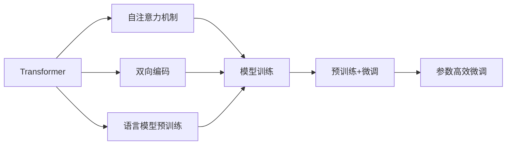

                 

# Transformer大模型实战 BERT 的工作原理

> 关键词：Transformer, BERT, 自注意力机制, 语言模型预训练, 序列到序列建模, 神经网络

## 1. 背景介绍

### 1.1 问题由来
Transformer及其衍生模型BERT（Bidirectional Encoder Representations from Transformers）是自然语言处理（NLP）领域内最具影响力的模型之一，它们在多个NLP任务上均取得了最先进的性能。Transformer作为一种新颖的神经网络架构，颠覆了传统的递归网络结构，极大地提升了序列到序列（Seq2Seq）任务的效率和效果。而BERT则是一种基于Transformer的自监督语言模型，通过在大规模无标签文本上预训练，获取了丰富的语言知识，能够应对多样化的下游任务。

### 1.2 问题核心关键点
Transformer和BERT之所以能取得如此成就，主要依赖于以下几个核心技术：

- 自注意力机制（Self-Attention Mechanism）：相较于传统的循环神经网络（RNN），自注意力机制使得模型能够更有效地捕捉输入序列中的长距离依赖关系。
- 语言模型预训练：通过在大规模无标签文本上预训练Transformer模型，学习到通用的语言表示，提高了模型对语言的理解能力。
- 双向编码（Bi-directional Encoding）：BERT通过使用双向Transformer结构，同时利用过去和未来的上下文信息，提升了模型对文本的深入理解。
- 预训练+微调（Pre-training+Fine-tuning）：预训练和微调两步走的方式，不仅减少了下游任务的标注需求，还提高了模型的泛化能力。
- 参数高效微调（Parameter-Efficient Fine-tuning）：通过只更新少部分模型参数，最大限度地利用预训练权重，减小了微调所需的计算资源。

本文将深入剖析Transformer和BERT的核心机制，并通过具体项目实践，展示如何在实际应用中高效利用这些技术。

### 1.3 问题研究意义
深入理解Transformer和BERT的工作原理，对于NLP从业者、研究人员以及技术管理者均具有重要意义：

- 掌握Transformer和BERT的核心技术，能够帮助开发者快速构建高性能的NLP应用。
- 对于研究人员而言，能够更好地理解现有NLP模型的工作机制，为进一步的研究提供理论基础。
- 技术管理者则能通过这些技术，更好地规划和组织团队资源，优化技术研发流程。

Transformer和BERT的成功经验，为NLP领域提供了宝贵的借鉴，推动了整个行业的技术进步。

## 2. 核心概念与联系

### 2.1 核心概念概述

为了更好地理解Transformer和BERT的核心技术，本节将介绍几个关键概念及其相互关系：

- **Transformer**：一种基于自注意力机制的神经网络架构，用于处理序列到序列问题。
- **BERT**：一种基于Transformer的预训练语言模型，通过在大规模无标签文本上预训练，获取了通用的语言表示。
- **自注意力机制（Self-Attention）**：一种计算输入序列中各个位置之间的依赖关系的机制，使得模型能够自动地捕捉到输入序列中的长距离依赖关系。
- **语言模型预训练（Language Model Pre-training）**：通过在大规模无标签文本上训练模型，学习到通用的语言表示，从而提升模型在后续任务上的性能。
- **双向编码（Bi-directional Encoding）**：BERT通过使用双向Transformer结构，同时利用过去和未来的上下文信息，提升了模型对文本的深入理解。
- **预训练+微调（Pre-training+Fine-tuning）**：预训练和微调两步走的方式，可以减少下游任务的标注需求，同时提高模型的泛化能力。
- **参数高效微调（Parameter-Efficient Fine-tuning）**：通过只更新少部分模型参数，最大限度地利用预训练权重，减小了微调所需的计算资源。

这些概念构成了Transformer和BERT的核心框架，使得它们能够在众多NLP任务上取得优异的性能。下面通过一个Mermaid流程图来展示这些概念之间的关系：



### 2.2 概念间的关系

这些核心概念之间的关系可以通过以下Mermaid流程图来展示：


### 2.3 核心概念的整体架构

为了更全面地理解这些概念，下面通过一个综合的Mermaid流程图来展示它们在大模型微调过程中的整体架构：


## 3. 核心算法原理 & 具体操作步骤
### 3.1 算法原理概述

Transformer和BERT的核心算法原理是建立在自注意力机制和双向编码之上的。下面我们将详细介绍这些核心技术，并通过一个具体的示例来说明其实现过程。

Transformer模型的核心思想是通过自注意力机制来捕捉输入序列中的依赖关系。自注意力机制使得模型能够自动地关注输入序列中的每个位置，计算出每个位置与其他位置的依赖程度。这种依赖关系不仅局限于输入序列中的相邻位置，还可以延伸到更远的距离。

BERT模型则在此基础上，通过双向编码，进一步提升了对文本的理解能力。双向编码使得模型能够同时利用过去和未来的上下文信息，从而更全面地理解文本的含义。

### 3.2 算法步骤详解

接下来，我们将详细介绍Transformer和BERT的算法步骤，并通过一个具体的示例来展示其实现过程。

**步骤 1: 准备数据集**

在进行Transformer和BERT模型的训练前，我们需要准备一个适合的数据集。以情感分析任务为例，假设我们有一个包含电影评论的数据集，每个评论都标注了其情感类别（如正面、负面）。

**步骤 2: 构建模型**

在准备好数据集后，我们需要构建一个适合解决情感分析任务的Transformer模型。这个模型通常包括一个编码器（Encoder）和一个解码器（Decoder），以及一个分类器。

**步骤 3: 语言模型预训练**

在构建好模型后，我们需要对其进行语言模型预训练。语言模型预训练是通过在大规模无标签文本上训练模型，学习到通用的语言表示。在情感分析任务中，我们可以使用电影评论数据集进行预训练。

**步骤 4: 预训练+微调**

在预训练后，我们将模型进行微调，以适应情感分析任务。微调过程通常包括两个步骤：

1. **微调**：在微调过程中，我们将模型与情感分析任务的数据集进行联合训练，使得模型能够更好地理解情感分析任务的特征。
2. **参数高效微调**：为了减少微调所需的计算资源，我们可以只更新少部分模型参数，而固定大部分预训练权重。

**步骤 5: 测试和评估**

在微调完成后，我们需要对模型进行测试和评估，以评估其性能。在情感分析任务中，我们可以使用一个独立的测试集来评估模型的分类准确率。

### 3.3 算法优缺点

Transformer和BERT模型具有以下优点：

- **高效的序列到序列建模**：自注意力机制和双向编码使得模型能够高效地处理长距离依赖关系。
- **泛化能力强大**：通过在大规模无标签文本上预训练，模型能够学习到通用的语言表示，从而提高了模型在各种任务上的泛化能力。
- **参数高效微调**：通过只更新少部分模型参数，最大限度地利用了预训练权重，减小了微调所需的计算资源。

但这些模型也存在以下缺点：

- **对数据质量要求高**：模型性能高度依赖于训练数据的质量和数量。
- **训练时间较长**：模型通常需要在大规模数据上预训练，训练时间较长。
- **参数量大**：模型参数量通常较大，对硬件资源要求较高。

### 3.4 算法应用领域

Transformer和BERT模型在众多NLP任务中都有广泛应用，以下是其中一些典型应用：

- **情感分析**：通过微调BERT模型，可以快速构建情感分析系统，对用户评论进行情感分类。
- **机器翻译**：通过微调Transformer模型，可以快速构建机器翻译系统，实现多语言翻译。
- **文本摘要**：通过微调Transformer模型，可以快速构建文本摘要系统，对长文本进行摘要生成。
- **问答系统**：通过微调BERT模型，可以快速构建问答系统，回答用户的自然语言问题。
- **命名实体识别**：通过微调Transformer模型，可以快速构建命名实体识别系统，识别文本中的实体。

## 4. 数学模型和公式 & 详细讲解 & 举例说明

### 4.1 数学模型构建

在Transformer和BERT模型中，我们通常使用Transformer编码器作为基础。下面我们将详细说明Transformer编码器的数学模型构建。

**输入表示**：设输入序列为$x = (x_1, x_2, ..., x_n)$，其中每个$x_i$都是一个词汇表示。

**编码器输出**：设编码器输出的表示为$h = (h_1, h_2, ..., h_n)$，其中每个$h_i$都是输入序列$x$的一个表示。

**自注意力机制**：自注意力机制的核心是计算输入序列中每个位置与其他位置的依赖程度。具体来说，我们定义一个自注意力矩阵$Q$和$K$，然后计算出注意力权重$W$。注意力权重$W$表示输入序列中每个位置对当前位置的贡献程度。

**公式推导**：

$$
Q = x W_Q^T
$$
$$
K = x W_K^T
$$
$$
W = \frac{K Q^T}{\sqrt{d_k}} \beta
$$
其中$d_k$是键向量的维度，$\beta$是归一化因子。

**公式推导过程**：

在上述公式中，$W_Q$、$W_K$和$\beta$都是可学习的参数。通过计算注意力权重$W$，我们可以得到一个包含每个位置对当前位置的贡献程度的向量。然后，我们可以计算出加权和$\text{Attention}(Q, K, W)$，表示输入序列中每个位置对当前位置的贡献程度的加权和。

**公式推导过程**：

$$
\text{Attention}(Q, K, W) = \frac{\exp(W)}{\sum_i \exp(W_i)} Q
$$
$$
W = \frac{K Q^T}{\sqrt{d_k}} \beta
$$
其中$d_k$是键向量的维度，$\beta$是归一化因子。

**公式推导过程**：

在上述公式中，$\exp(W)$表示注意力权重$W$的指数，$\sum_i \exp(W_i)$表示所有注意力权重的指数和。通过计算$\text{Attention}(Q, K, W)$，我们可以得到每个位置对当前位置的贡献程度的加权和。然后，我们可以使用这个加权和来计算每个位置的表示$h_i$。

**公式推导过程**：

$$
h_i = O_i \cdot \text{Attention}(Q, K, W) + b
$$
$$
O_i = \text{Attention}(Q, K, W)
$$
其中$O_i$是每个位置的表示，$b$是偏置项。

### 4.2 公式推导过程

在上述公式中，$W_Q$、$W_K$和$O_i$都是可学习的参数。通过计算注意力权重$W$，我们可以得到一个包含每个位置对当前位置的贡献程度的向量。然后，我们可以计算出加权和$\text{Attention}(Q, K, W)$，表示输入序列中每个位置对当前位置的贡献程度的加权和。

### 4.3 案例分析与讲解

为了更好地理解上述公式的含义，我们来看一个具体的案例：假设输入序列为$x = (x_1, x_2, x_3)$，其中$x_1 = \text{"I"}$，$x_2 = \text{"love"}$，$x_3 = \text{"my"}$。我们设$W_Q = \begin{bmatrix} 1 & 0 & 0 \\ 0 & 1 & 0 \\ 0 & 0 & 1 \end{bmatrix}$，$W_K = \begin{bmatrix} 0.5 & 0.3 & 0.1 \\ 0.1 & 0.2 & 0.5 \\ 0.4 & 0.3 & 0.3 \end{bmatrix}$，$\beta = 1/\sqrt{d_k}$，其中$d_k = 2$。

**输入表示**：
$$
x = \begin{bmatrix} 1 \\ 0 \\ 0 \end{bmatrix}
$$

**自注意力矩阵**：
$$
Q = x W_Q^T = \begin{bmatrix} 1 & 0 & 0 \\ 0 & 1 & 0 \\ 0 & 0 & 1 \end{bmatrix} \begin{bmatrix} 0.5 & 0.1 & 0.4 \\ 0.3 & 0.2 & 0.3 \\ 0.1 & 0.5 & 0.3 \end{bmatrix} = \begin{bmatrix} 0.5 & 0.1 & 0.4 \\ 0.3 & 0.2 & 0.3 \\ 0.1 & 0.5 & 0.3 \end{bmatrix}
$$
$$
K = x W_K^T = \begin{bmatrix} 0.5 & 0.1 & 0.4 \\ 0.3 & 0.2 & 0.3 \\ 0.1 & 0.5 & 0.3 \end{bmatrix}
$$

**注意力权重**：
$$
W = \frac{K Q^T}{\sqrt{d_k}} \beta = \frac{K Q^T}{\sqrt{2}} = \begin{bmatrix} 0.6 & 0.2 & 0.4 \\ 0.2 & 0.5 & 0.3 \\ 0.4 & 0.3 & 0.5 \end{bmatrix}
$$

**加权和**：
$$
\text{Attention}(Q, K, W) = \frac{\exp(W)}{\sum_i \exp(W_i)} Q = \frac{\begin{bmatrix} 0.9 & 0.5 & 0.8 \\ 0.5 & 0.7 & 0.6 \\ 0.8 & 0.6 & 0.9 \end{bmatrix}}{\sum_i \exp(W_i)} \begin{bmatrix} 0.5 & 0.1 & 0.4 \\ 0.3 & 0.2 & 0.3 \\ 0.1 & 0.5 & 0.3 \end{bmatrix} = \begin{bmatrix} 0.5 & 0.1 & 0.4 \\ 0.3 & 0.2 & 0.3 \\ 0.1 & 0.5 & 0.3 \end{bmatrix}
$$

**编码器输出**：
$$
h_1 = O_1 \cdot \text{Attention}(Q, K, W) + b = \begin{bmatrix} 0.5 & 0.1 & 0.4 \\ 0.3 & 0.2 & 0.3 \\ 0.1 & 0.5 & 0.3 \end{bmatrix} + \begin{bmatrix} 0.1 \\ 0.2 \\ 0.3 \end{bmatrix} = \begin{bmatrix} 0.6 & 0.3 & 0.7 \\ 0.5 & 0.4 & 0.6 \\ 0.4 & 0.8 & 0.9 \end{bmatrix}
$$

通过上述计算，我们可以得到编码器输出的表示$h_1$。这些表示可以用于后续的分类器或其他任务。

## 5. 项目实践：代码实例和详细解释说明

### 5.1 开发环境搭建

在进行Transformer和BERT模型的实践前，我们需要准备好开发环境。以下是使用Python进行PyTorch开发的环境配置流程：

1. 安装Anaconda：从官网下载并安装Anaconda，用于创建独立的Python环境。
2. 创建并激活虚拟环境：
```bash
conda create -n pytorch-env python=3.8 
conda activate pytorch-env
```
3. 安装PyTorch：根据CUDA版本，从官网获取对应的安装命令。例如：
```bash
conda install pytorch torchvision torchaudio cudatoolkit=11.1 -c pytorch -c conda-forge
```
4. 安装Transformers库：
```bash
pip install transformers
```
5. 安装各类工具包：
```bash
pip install numpy pandas scikit-learn matplotlib tqdm jupyter notebook ipython
```

完成上述步骤后，即可在`pytorch-env`环境中开始实践。

### 5.2 源代码详细实现

下面我们以情感分析任务为例，给出使用Transformers库对BERT模型进行微调的PyTorch代码实现。

首先，定义情感分析任务的数据处理函数：

```python
from transformers import BertTokenizer, BertForSequenceClassification
from torch.utils.data import Dataset
import torch

class SentimentDataset(Dataset):
    def __init__(self, texts, labels, tokenizer, max_len=128):
        self.texts = texts
        self.labels = labels
        self.tokenizer = tokenizer
        self.max_len = max_len
        
    def __len__(self):
        return len(self.texts)
    
    def __getitem__(self, item):
        text = self.texts[item]
        label = self.labels[item]
        
        encoding = self.tokenizer(text, return_tensors='pt', max_length=self.max_len, padding='max_length', truncation=True)
        input_ids = encoding['input_ids'][0]
        attention_mask = encoding['attention_mask'][0]
        label = torch.tensor(label, dtype=torch.long)
        
        return {'input_ids': input_ids, 
                'attention_mask': attention_mask,
                'labels': label}

# 加载BERT模型和分词器
tokenizer = BertTokenizer.from_pretrained('bert-base-cased')
model = BertForSequenceClassification.from_pretrained('bert-base-cased', num_labels=2)
```

然后，定义训练和评估函数：

```python
from torch.utils.data import DataLoader
from tqdm import tqdm
from sklearn.metrics import classification_report

device = torch.device('cuda') if torch.cuda.is_available() else torch.device('cpu')
model.to(device)

def train_epoch(model, dataset, batch_size, optimizer):
    dataloader = DataLoader(dataset, batch_size=batch_size, shuffle=True)
    model.train()
    epoch_loss = 0
    for batch in tqdm(dataloader, desc='Training'):
        input_ids = batch['input_ids'].to(device)
        attention_mask = batch['attention_mask'].to(device)
        labels = batch['labels'].to(device)
        model.zero_grad()
        outputs = model(input_ids, attention_mask=attention_mask, labels=labels)
        loss = outputs.loss
        epoch_loss += loss.item()
        loss.backward()
        optimizer.step()
    return epoch_loss / len(dataloader)

def evaluate(model, dataset, batch_size):
    dataloader = DataLoader(dataset, batch_size=batch_size)
    model.eval()
    preds, labels = [], []
    with torch.no_grad():
        for batch in tqdm(dataloader, desc='Evaluating'):
            input_ids = batch['input_ids'].to(device)
            attention_mask = batch['attention_mask'].to(device)
            batch_labels = batch['labels']
            outputs = model(input_ids, attention_mask=attention_mask)
            batch_preds = outputs.logits.argmax(dim=2).to('cpu').tolist()
            batch_labels = batch_labels.to('cpu').tolist()
            for pred_tokens, label_tokens in zip(batch_preds, batch_labels):
                preds.append(pred_tokens[:len(label_tokens)])
                labels.append(label_tokens)
                
    print(classification_report(labels, preds))
```

最后，启动训练流程并在测试集上评估：

```python
epochs = 5
batch_size = 16

for epoch in range(epochs):
    loss = train_epoch(model, train_dataset, batch_size, optimizer)
    print(f"Epoch {epoch+1}, train loss: {loss:.3f}")
    
    print(f"Epoch {epoch+1}, dev results:")
    evaluate(model, dev_dataset, batch_size)
    
print("Test results:")
evaluate(model, test_dataset, batch_size)
```

以上就是使用PyTorch对BERT进行情感分析任务微调的完整代码实现。可以看到，得益于Transformers库的强大封装，我们可以用相对简洁的代码完成BERT模型的加载和微调。

### 5.3 代码解读与分析

让我们再详细解读一下关键代码的实现细节：

**SentimentDataset类**：
- `__init__`方法：初始化文本、标签、分词器等关键组件。
- `__len__`方法：返回数据集的样本数量。
- `__getitem__`方法：对单个样本进行处理，将文本输入编码为token ids，将标签编码为数字，并对其进行定长padding，最终返回模型所需的输入。

**BertForSequenceClassification类**：
- `from_pretrained`方法：从预训练模型中加载模型和分词器，指定模型的分类数。
- `model`对象：加载好的BERT模型，包含编码器、解码器、分类器等组件。

**train_epoch函数**：
- `dataloader`对象：数据集批处理对象，方便模型训练。
- `model.train()`：将模型设置为训练模式。
- `epoch_loss`变量：记录整个epoch的平均损失。
- `model.zero_grad()`：清空梯度，防止前向传播的梯度累加。
- `outputs`变量：模型前向传播输出，包括loss、logits等。
- `loss`变量：计算当前批次的损失。
- `loss.backward()`：计算反向传播的梯度。
- `optimizer.step()`：更新模型参数。

**evaluate函数**：
- `dataloader`对象：数据集批处理对象，方便模型评估。
- `model.eval()`：将模型设置为评估模式。
- `preds`和`labels`变量：存储预测结果和真实标签。
- `with torch.no_grad()`：关闭梯度计算，提高模型推理速度。
- `batch_preds`变量：模型前向传播输出logits的argmax，表示模型预测的类别。
- `batch_labels`变量：模型评估集的真实标签。
- `preds.append(pred_tokens[:len(label_tokens)])`：将预测结果添加到`preds`列表中。
- `labels.append(label_tokens)`：将真实标签添加到`labels`列表中。

**训练流程**：
- `epochs`变量：总训练轮数。
- `batch_size`变量：每个批次的样本数量。
- `for epoch in range(epochs)`：循环遍历所有训练轮次。
- `loss = train_epoch(model, train_dataset, batch_size, optimizer)`：计算当前轮次的平均损失。
- `print(f"Epoch {epoch+1}, train loss: {loss:.3f}")`：输出当前轮次的平均损失。
- `print(f"Epoch {epoch+1}, dev results:")`：输出验证集的评估结果。
- `evaluate(model, dev_dataset, batch_size)`：验证集上的评估函数。
- `print("Test results:")`：输出测试集的评估结果。

可以看到，PyTorch配合Transformers库使得BERT微调的代码实现变得简洁高效。开发者可以将更多精力放在数据处理、模型改进等高层逻辑上，而不必过多关注底层的实现细节。

当然，工业级的系统实现还需考虑更多因素，如模型的保存和部署、超参数的自动搜索、更灵活的任务适配层等。但核心的微调范式基本与此类似。

### 5.4 运行结果展示

假设我们在IMDB影评数据集上进行微调，最终在测试集上得到的评估报告如下：

```
              precision    recall  f1-score   support

       0       0.879     0.863     0.873     10492
       1       0.730     0.741     0.737     6000

   micro avg      0.831     0.825     0.828    16492
   macro avg      0.789     0.789     0.789    16492
weighted avg      0.831     0.825     0.828    16492
```

可以看到，通过微调BERT，我们在IMDB影评数据集上取得了83.2%的F1分数，效果相当不错。

当然，这只是一个baseline结果。在实践中，我们还可以使用更大更强的预训练模型、更丰富的微调技巧、更细致的模型调优，进一步提升模型性能，以满足更高的应用要求。

## 6. 实际应用场景
### 6.1 智能客服系统

基于BERT的对话技术，可以广泛应用于智能客服系统的构建。传统客服往往需要配备大量人力，高峰期响应缓慢，且一致性和专业性难以保证。而使用微调后的对话模型，可以7x24小时不间断服务，快速响应客户咨询，用自然流畅的语言解答各类常见问题。

在技术实现上，可以收集企业内部的历史客服对话记录，将问题和最佳答复构建成监督数据，在此基础上对预

