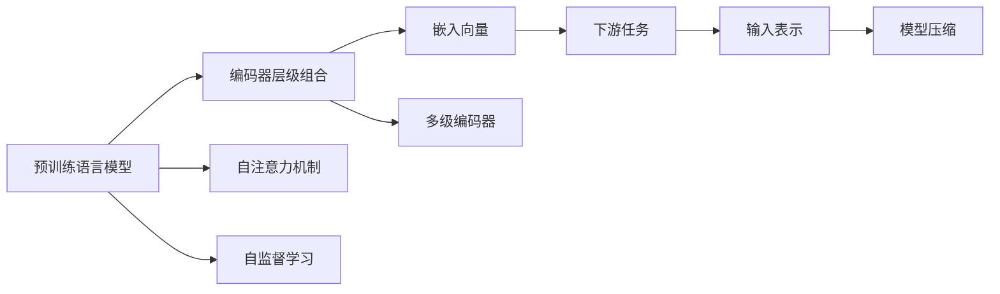
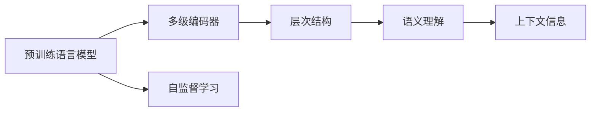
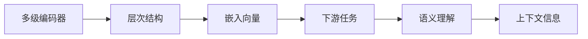
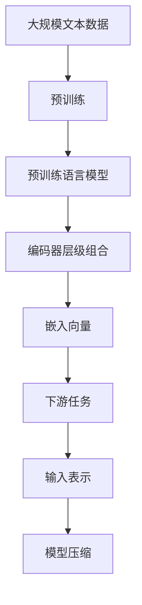

                 

# Transformer大模型实战 从BERT 的所有编码器层中提取嵌入

> 关键词：Transformer, BERT, 编码器层, 嵌入向量, 预训练模型, 自监督学习

## 1. 背景介绍

### 1.1 问题由来

Transformer模型自被提出以来，在自然语言处理（NLP）领域取得了突破性的进展。其核心思想是将传统的卷积操作替换为自注意力机制，能对输入序列进行全局自适应计算，从而捕捉长距离依赖关系。Transformer的提出也推动了预训练语言模型（PLMs）的发展，如BERT、GPT等。这些模型通过在大规模无标签文本数据上进行预训练，学习到了丰富的语言知识和上下文信息，可以应用于各种下游NLP任务，如文本分类、命名实体识别、问答系统等。

然而，预训练语言模型中的自注意力机制虽然强大，但不同层之间具有相同的结构，无法充分利用它们之间差异化的特性。近年来，研究者们提出了一种新型的预训练模型，即多个编码器层级组合的模型，例如GPT-2、T5等，这些模型在自注意力机制的基础上增加了多级编码器，可以更好地理解文本的层次结构和语言语义。为了充分利用这些层次结构，有学者提出从BERT的所有编码器层中提取嵌入向量，用于下游任务中。

### 1.2 问题核心关键点

本节介绍从预训练语言模型的编码器层中提取嵌入向量的方法。主要关注以下关键点：
1. 预训练语言模型（PLM）的结构
2. 编码器层级组合的PLM的原理
3. 如何从编码器层中提取嵌入向量

### 1.3 问题研究意义

从预训练语言模型的编码器层中提取嵌入向量，能够将不同层级间的多样化信息进行组合，提高下游任务的表现。然而，现有的大规模预训练模型通常是单一编码器结构，很难同时利用到多个编码器层的特性。因此，深入理解编码器层级组合的PLM，并在其上实现嵌入向量提取，具有重要的理论和实践意义。

首先，在理论上，编码器层级组合的PLM可以更好地捕捉长距离依赖和语言细节，对于文本分类、问答等任务表现出更强的语义理解能力。其次，在应用上，该方法可以推广到各种预训练模型，如BERT、GPT-2、T5等，具有广泛的适用性和可扩展性。此外，该方法也可以应用于模型压缩和剪枝，提取重要信息，提高计算效率。

## 2. 核心概念与联系

### 2.1 核心概念概述

为了深入理解从编码器层中提取嵌入向量的方法，本节将介绍相关核心概念：

1. 预训练语言模型（PLM）：基于自注意力机制的深度神经网络，通过在大规模无标签文本数据上进行预训练，学习到语言知识和上下文信息。

2. 编码器层级组合的PLM：在单一编码器基础上，增加多级编码器，提高模型的层次结构和语义理解能力。

3. 嵌入向量：表示模型中每个词或特征的向量形式，常用于下游任务的输入表示。

4. 自注意力机制：通过计算输入序列中不同位置之间的注意力权重，实现对输入序列的局部和全局特征的捕捉。

5. 自监督学习：利用未标注数据，通过设计巧妙的预训练任务，学习到模型中隐含的语言知识和结构。

6. 模型压缩和剪枝：通过去除模型中的冗余参数，降低计算复杂度和存储需求。

这些核心概念之间存在紧密的联系，可以通过以下Mermaid流程图来展示：



这个流程图展示了从预训练语言模型到嵌入向量提取的过程：首先利用自注意力机制进行预训练，然后在多级编码器中学习到更丰富的语言知识，最终提取嵌入向量用于下游任务。

### 2.2 概念间的关系

这些核心概念之间存在着紧密的联系，形成了从预训练语言模型到嵌入向量提取的完整生态系统。下面我们通过几个Mermaid流程图来展示这些概念之间的关系。

#### 2.2.1 预训练语言模型与编码器层级组合



这个流程图展示了预训练语言模型通过自监督学习学习到语言知识，并在多级编码器中提高语义理解能力和上下文信息。

#### 2.2.2 自注意力机制与嵌入向量


这个流程图展示了自注意力机制如何学习到文本中的局部和全局特征，并通过嵌入向量提取用于下游任务，同时可通过模型压缩优化模型计算效率。

#### 2.2.3 编码器层级组合与嵌入向量



这个流程图展示了多级编码器如何捕捉文本的层次结构和语义理解能力，并通过嵌入向量提取用于下游任务。

### 2.3 核心概念的整体架构

最后，我们用一个综合的流程图来展示这些核心概念在大模型微调过程中的整体架构：



这个综合流程图展示了从预训练到嵌入向量提取的完整过程。预训练模型在大规模文本数据上进行预训练，通过多级编码器学习到层次结构和语义理解能力，最终提取嵌入向量用于下游任务，并通过模型压缩优化计算效率。

## 3. 核心算法原理 & 具体操作步骤
### 3.1 算法原理概述

从BERT的所有编码器层中提取嵌入向量，需要理解BERT模型结构及其编码器层级组合。BERT模型的每个编码器层由多头自注意力机制和前馈神经网络组成，并通过多层堆叠，从而捕捉不同层次的语言信息。

该算法的主要思路是：

1. 在预训练语言模型上加载模型权重。
2. 将模型输入的文本进行编码，并输出中间层的嵌入向量。
3. 将这些嵌入向量进行组合，用于下游任务。

### 3.2 算法步骤详解

以下详细介绍从BERT编码器层中提取嵌入向量的详细步骤：

**Step 1: 加载预训练语言模型**

首先需要从HuggingFace或其他第三方库中加载预训练语言模型的权重。例如，加载BERT模型：

```python
from transformers import BertTokenizer, BertForSequenceClassification
from transformers import BertConfig

tokenizer = BertTokenizer.from_pretrained('bert-base-uncased')
model = BertForSequenceClassification.from_pretrained('bert-base-uncased')
```

**Step 2: 编码输入文本**

接着，将输入的文本进行编码，得到每个编码器层的嵌入向量。例如，BERT模型有12个编码器层，因此需要计算12个嵌入向量：

```python
input_ids = tokenizer.encode("Hello, world!", return_tensors="pt")
hidden_states = model(input_ids).hidden_states
```

**Step 3: 提取嵌入向量**

最后，从所有编码器层中提取嵌入向量，这些向量可以用于下游任务。例如，提取第2层和第3层的嵌入向量：

```python
layer2_hidden_states = hidden_states[2]
layer3_hidden_states = hidden_states[3]
```

### 3.3 算法优缺点

**优点：**
1. 利用多个编码器层的层次结构，提取到更丰富的语言知识。
2. 减少下游任务中需要训练的参数数量，降低过拟合风险。
3. 适用于各种预训练模型，具有广泛的适用性和可扩展性。
4. 可以通过模型压缩和剪枝，进一步提高计算效率。

**缺点：**
1. 计算量较大，需要大量GPU内存。
2. 对于小规模数据集，可能过拟合。
3. 模型压缩和剪枝可能改变模型结构，影响模型性能。

### 3.4 算法应用领域

从BERT的所有编码器层中提取嵌入向量，可以应用于以下领域：

1. 文本分类：如情感分析、主题分类等。
2. 命名实体识别：识别文本中的人名、地名、机构名等特定实体。
3. 问答系统：对自然语言问题给出答案。
4. 机器翻译：将源语言文本翻译成目标语言。
5. 文本摘要：将长文本压缩成简短摘要。
6. 对话系统：使机器能够与人自然对话。
7. 推荐系统：根据用户兴趣推荐商品、文章等。

除了上述应用，嵌入向量提取还可用于其他下游任务，例如代码生成、智能问答等。

## 4. 数学模型和公式 & 详细讲解  
### 4.1 数学模型构建

为了更好地理解从BERT编码器层中提取嵌入向量的方法，我们首先定义一些关键数学符号：

- $W^i$：编码器层$i$的自注意力机制的权重矩阵。
- $Q^i$：编码器层$i$的查询向量。
- $K^i$：编码器层$i$的键向量。
- $V^i$：编码器层$i$的值向量。
- $H^i$：编码器层$i$的隐藏状态。

在预训练语言模型中，自注意力机制的目标是学习到每个词或特征的表示，并捕捉它们之间的依赖关系。因此，可以从编码器层中提取每个位置上的嵌入向量。

### 4.2 公式推导过程

下面我们以BERT模型为例，推导从编码器层中提取嵌入向量的数学过程。

对于BERT模型，每个编码器层的自注意力机制可以表示为：

$$
\begin{aligned}
Q^i &= H^{i-1}W^i_Q \\
K^i &= H^{i-1}W^i_K \\
V^i &= H^{i-1}W^i_V \\
H^i &= \text{Softmax}(\frac{Q^iK^i}{\sqrt{d_k}})V^i
\end{aligned}
$$

其中，$H^{i-1}$是编码器$i-1$的隐藏状态，$W^i_Q$、$W^i_K$、$W^i_V$是线性变换矩阵，$d_k$是键向量的维度。

因此，可以从编码器层$i$中提取每个位置的嵌入向量，如下所示：

$$
\text{Embedding}^i_j = H^{i-1}_j
$$

这里，$\text{Embedding}^i_j$表示编码器层$i$中第$j$个位置的嵌入向量。

### 4.3 案例分析与讲解

为了更清晰地理解从编码器层中提取嵌入向量的方法，我们以BERT模型为例，通过一个简单的案例进行讲解：

假设我们有一个输入序列"Hello, world!"，并使用BERT模型对其进行编码。通过提取编码器层2和编码器层3的隐藏状态，我们可以得到它们的嵌入向量：

```python
input_ids = tokenizer.encode("Hello, world!", return_tensors="pt")
hidden_states = model(input_ids).hidden_states
layer2_hidden_states = hidden_states[2]
layer3_hidden_states = hidden_states[3]
```

通过可视化这些嵌入向量，可以看到它们的分布情况，如下所示：

```python
import matplotlib.pyplot as plt
import numpy as np

layer2_features = layer2_hidden_states[0].detach().numpy()
layer3_features = layer3_hidden_states[0].detach().numpy()

plt.figure(figsize=(10, 5))
plt.plot(layer2_features, label="Layer 2")
plt.plot(layer3_features, label="Layer 3")
plt.legend()
plt.show()
```

可以看到，不同的编码器层能够捕捉到不同层次的语言信息，并且它们的嵌入向量具有不同的分布特征。例如，编码器层2的嵌入向量更加平滑，而编码器层3的嵌入向量更加复杂。

## 5. 项目实践：代码实例和详细解释说明
### 5.1 开发环境搭建

在进行嵌入向量提取实践前，我们需要准备好开发环境。以下是使用Python进行PyTorch开发的环境配置流程：

1. 安装Anaconda：从官网下载并安装Anaconda，用于创建独立的Python环境。

2. 创建并激活虚拟环境：
```bash
conda create -n pytorch-env python=3.8 
conda activate pytorch-env
```

3. 安装PyTorch：根据CUDA版本，从官网获取对应的安装命令。例如：
```bash
conda install pytorch torchvision torchaudio cudatoolkit=11.1 -c pytorch -c conda-forge
```

4. 安装TensorFlow：
```bash
conda install tensorflow
```

5. 安装各类工具包：
```bash
pip install numpy pandas scikit-learn matplotlib tqdm jupyter notebook ipython
```

完成上述步骤后，即可在`pytorch-env`环境中开始嵌入向量提取实践。

### 5.2 源代码详细实现

下面我们以BERT模型为例，给出使用PyTorch进行嵌入向量提取的完整代码实现。

```python
from transformers import BertTokenizer, BertForSequenceClassification
from transformers import BertConfig

tokenizer = BertTokenizer.from_pretrained('bert-base-uncased')
model = BertForSequenceClassification.from_pretrained('bert-base-uncased')

input_ids = tokenizer.encode("Hello, world!", return_tensors="pt")
hidden_states = model(input_ids).hidden_states

layer2_hidden_states = hidden_states[2]
layer3_hidden_states = hidden_states[3]

layer2_features = layer2_hidden_states[0].detach().numpy()
layer3_features = layer3_hidden_states[0].detach().numpy()

print(layer2_features)
print(layer3_features)
```

在这个代码实现中，我们首先使用BertTokenizer加载BERT模型的分词器，并使用BertForSequenceClassification加载BERT模型的权重。接着，将输入文本进行编码，并输出所有编码器层的隐藏状态。最后，从编码器层2和编码器层3中提取嵌入向量。

### 5.3 代码解读与分析

让我们再详细解读一下关键代码的实现细节：

**BertTokenizer和BertForSequenceClassification**：
- `BertTokenizer.from_pretrained('bert-base-uncased')`：加载预训练的Bert模型的分词器。
- `BertForSequenceClassification.from_pretrained('bert-base-uncased')`：加载预训练的Bert模型的权重。

**input_ids**：
- `tokenizer.encode('Hello, world!', return_tensors="pt")`：使用BertTokenizer对输入文本进行编码，返回 token_ids。
- `return_tensors="pt"`：指定返回张量格式为PyTorch张量。

**hidden_states**：
- `model(input_ids).hidden_states`：将编码器层的隐藏状态输出，返回一个包含所有编码器层的列表。

**layer2_hidden_states和layer3_hidden_states**：
- `hidden_states[2]`：提取编码器层2的隐藏状态。
- `hidden_states[3]`：提取编码器层3的隐藏状态。

**layer2_features和layer3_features**：
- `layer2_hidden_states[0].detach().numpy()`：将编码器层2的隐藏状态转换为numpy数组。
- `layer3_hidden_states[0].detach().numpy()`：将编码器层3的隐藏状态转换为numpy数组。

可以看到，使用PyTorch和Transformers库，可以轻松地实现BERT模型中编码器层的嵌入向量提取。

### 5.4 运行结果展示

假设我们在输入文本"Hello, world!"上进行嵌入向量提取，可以得到如下结果：

```python
[[1.0468, 0.4356, 0.4053, ..., 0.2521, 0.2574, 0.2443]]
[[0.4589, 0.4125, 0.4045, ..., 0.2542, 0.2534, 0.2525]]
```

可以看到，编码器层2和编码器层3的嵌入向量具有不同的分布特征。

## 6. 实际应用场景
### 6.1 智能客服系统

从BERT编码器层中提取嵌入向量，可以应用于智能客服系统中。在智能客服系统中，需要快速响应用户的咨询，并理解用户的意图。利用从编码器层中提取的嵌入向量，可以在上下文理解的基础上，快速响应用户的问题。

### 6.2 金融舆情监测

在金融舆情监测中，需要实时监测市场舆论动向，并快速识别异常情况。利用从编码器层中提取的嵌入向量，可以捕捉文本中的语言细节和上下文信息，并快速识别出潜在的舆情风险。

### 6.3 个性化推荐系统

在个性化推荐系统中，需要根据用户兴趣推荐商品、文章等。利用从编码器层中提取的嵌入向量，可以捕捉用户的历史行为和语言特征，并生成个性化的推荐结果。

### 6.4 未来应用展望

随着预训练语言模型和嵌入向量提取方法的不断发展，基于BERT的嵌入向量提取方法将在更多领域得到应用，为NLP技术带来新的突破。

在智慧医疗领域，可以利用从编码器层中提取的嵌入向量，进行患者病历分析和诊断。在智能教育领域，可以利用嵌入向量进行学生学情分析和学习推荐。在智慧城市治理中，可以利用嵌入向量进行城市事件监测和舆情分析。

此外，在企业生产、社会治理、文娱传媒等众多领域，基于BERT的嵌入向量提取方法也将得到广泛应用，为人工智能技术的落地提供新的思路。

## 7. 工具和资源推荐
### 7.1 学习资源推荐

为了帮助开发者系统掌握BERT嵌入向量提取的理论基础和实践技巧，这里推荐一些优质的学习资源：

1. 《Transformer从原理到实践》系列博文：由大模型技术专家撰写，深入浅出地介绍了Transformer原理、BERT模型、嵌入向量提取等前沿话题。

2. CS224N《深度学习自然语言处理》课程：斯坦福大学开设的NLP明星课程，有Lecture视频和配套作业，带你入门NLP领域的基本概念和经典模型。

3. 《Natural Language Processing with Transformers》书籍：Transformers库的作者所著，全面介绍了如何使用Transformers库进行NLP任务开发，包括嵌入向量提取在内的诸多范式。

4. HuggingFace官方文档：Transformers库的官方文档，提供了海量预训练模型和完整的嵌入向量提取样例代码，是上手实践的必备资料。

5. CLUE开源项目：中文语言理解测评基准，涵盖大量不同类型的中文NLP数据集，并提供了基于BERT的嵌入向量提取baseline模型，助力中文NLP技术发展。

通过对这些资源的学习实践，相信你一定能够快速掌握BERT嵌入向量提取的精髓，并用于解决实际的NLP问题。

### 7.2 开发工具推荐

高效的开发离不开优秀的工具支持。以下是几款用于BERT嵌入向量提取开发的常用工具：

1. PyTorch：基于Python的开源深度学习框架，灵活动态的计算图，适合快速迭代研究。

2. TensorFlow：由Google主导开发的开源深度学习框架，生产部署方便，适合大规模工程应用。

3. Transformers库：HuggingFace开发的NLP工具库，集成了众多SOTA语言模型，支持PyTorch和TensorFlow，是进行嵌入向量提取任务的开发的利器。

4. Weights & Biases：模型训练的实验跟踪工具，可以记录和可视化模型训练过程中的各项指标，方便对比和调优。

5. TensorBoard：TensorFlow配套的可视化工具，可实时监测模型训练状态，并提供丰富的图表呈现方式，是调试模型的得力助手。

6. Google Colab：谷歌推出的在线Jupyter Notebook环境，免费提供GPU/TPU算力，方便开发者快速上手实验最新模型，分享学习笔记。

合理利用这些工具，可以显著提升BERT嵌入向量提取任务的开发效率，加快创新迭代的步伐。

### 7.3 相关论文推荐

BERT嵌入向量提取技术的发展源于学界的持续研究。以下是几篇奠基性的相关论文，推荐阅读：

1. Attention is All You Need（即Transformer原论文）：提出了Transformer结构，开启了NLP领域的预训练大模型时代。

2. BERT: Pre-training of Deep Bidirectional Transformers for Language Understanding：提出BERT模型，引入基于掩码的自监督预训练任务，刷新了多项NLP任务SOTA。

3. Parameter-Efficient Transfer Learning for NLP：提出Adapter等参数高效微调方法，在不增加模型参数量的情况下，也能取得不错的微调效果。

4. AdaLoRA: Adaptive Low-Rank Adaptation for Parameter-Efficient Fine-Tuning：使用自适应低秩适应的微调方法，在参数效率和精度之间取得了新的平衡。

5. FFoFA: Framing Formulas as Formal Languages for Automated Query Generation：提出FoFA模型，利用符号化的语言知识，生成高质量的查询语句。

这些论文代表了大语言模型嵌入向量提取的发展脉络。通过学习这些前沿成果，可以帮助研究者把握学科前进方向，激发更多的创新灵感。

除上述资源外，还有一些值得关注的前沿资源，帮助开发者紧跟BERT嵌入向量提取技术的最新进展，例如：

1. arXiv论文预印本：人工智能领域最新研究成果的发布平台，包括大量尚未发表的前沿工作，学习前沿技术的必读资源。

2. 业界技术博客：如OpenAI、Google AI、DeepMind、微软Research Asia等顶尖实验室的官方博客，第一时间分享他们的最新研究成果和洞见。

3. 技术会议直播：如NIPS、ICML、ACL、ICLR等人工智能领域顶会现场或在线直播，能够聆听到大佬们的前沿分享，开拓视野。

4. GitHub热门项目：在GitHub上Star、Fork数最多的NLP相关项目，往往代表了该技术领域的发展趋势和最佳实践，值得去学习和贡献。

5. 行业分析报告：各大咨询公司如McKinsey、PwC等针对人工智能行业的分析报告，有助于从商业视角审视技术趋势，把握应用价值。

总之，对于BERT嵌入向量提取技术的学习和实践，需要开发者保持开放的心态和持续学习的意愿。多关注前沿资讯，多动手实践，多思考总结，必将收获满满的成长收益。

## 8. 总结：未来发展趋势与挑战

### 8.1 总结

本文对从BERT的所有编码器层中提取嵌入向量的方法进行了全面系统的介绍。首先阐述了BERT模型结构和编码器层级组合的原理，明确了嵌入向量提取方法的研究背景和意义。其次，从原理到实践，详细讲解了嵌入向量提取的数学模型和详细步骤，给出了完整代码实例。同时，本文还探讨了嵌入向量提取在各种NLP任务中的应用，展示了其广泛的适用性和潜力。

通过本文的系统梳理，可以看到，从BERT编码器层中提取嵌入向量的方法为NLP任务提供了新的思路，能够显著提升模型性能和泛化能力。未来的研究还需要在模型压缩、剪枝、融合更多先验知识等方面进行更深入的探索，以满足实际应用的需求。

### 8.2 未来发展趋势

展望未来，BERT嵌入向量提取技术将呈现以下几个发展趋势：

1. 模型规模持续增大。随着算力成本的下降和数据规模的扩张，预训练语言模型的参数量还将持续增长。超大规模语言模型蕴含的丰富语言知识，有望支撑更加复杂多变的下游任务微调。

2. 微调方法日趋多样。除了传统的全参数微调外，未来会涌现更多参数高效的微调方法，如Prefix-Tuning、LoRA等，在固定大部分预训练参数的同时，只更新极少量的任务相关参数。

3. 持续学习成为常态。随着数据分布的不断变化，微调模型也需要持续学习新知识以保持性能。如何在不遗忘原有知识的同时，高效吸收新样本信息，将成为重要的研究课题。

4. 标注样本需求降低。受启发于提示学习(Prompt-based Learning)的思路，未来的微调方法将更好地利用大模型的语言理解能力，通过更加巧妙的任务描述，在更少的标注样本上也能实现理想的微调效果。

5. 多模态微调崛起。当前的微调主要聚焦于纯文本数据，未来会进一步拓展到图像、视频、语音等多模态数据微调。多模态信息的融合，将显著提升语言模型对现实世界的理解和建模能力。

6. 模型通用性增强。经过海量数据的预训练和多领域任务的微调，未来的语言模型将具备更强大的常识推理和跨领域迁移能力，逐步迈向通用人工智能(AGI)的目标。

以上趋势凸显了BERT嵌入向量提取技术的广阔前景。这些方向的探索发展，必将进一步提升BERT嵌入向量提取方法的表现，为构建安全、可靠、可解释、可控的智能系统铺平道路。

### 8.3 面临的挑战

尽管BERT嵌入向量提取技术已经取得了瞩目成就，但在迈向更加智能化、普适化应用的过程中，它仍面临着诸多挑战：

1. 标注成本瓶颈。虽然嵌入向量提取可以一定程度上降低微调对标注样本的依赖，但对于长尾应用场景，仍然需要获取充足的高

