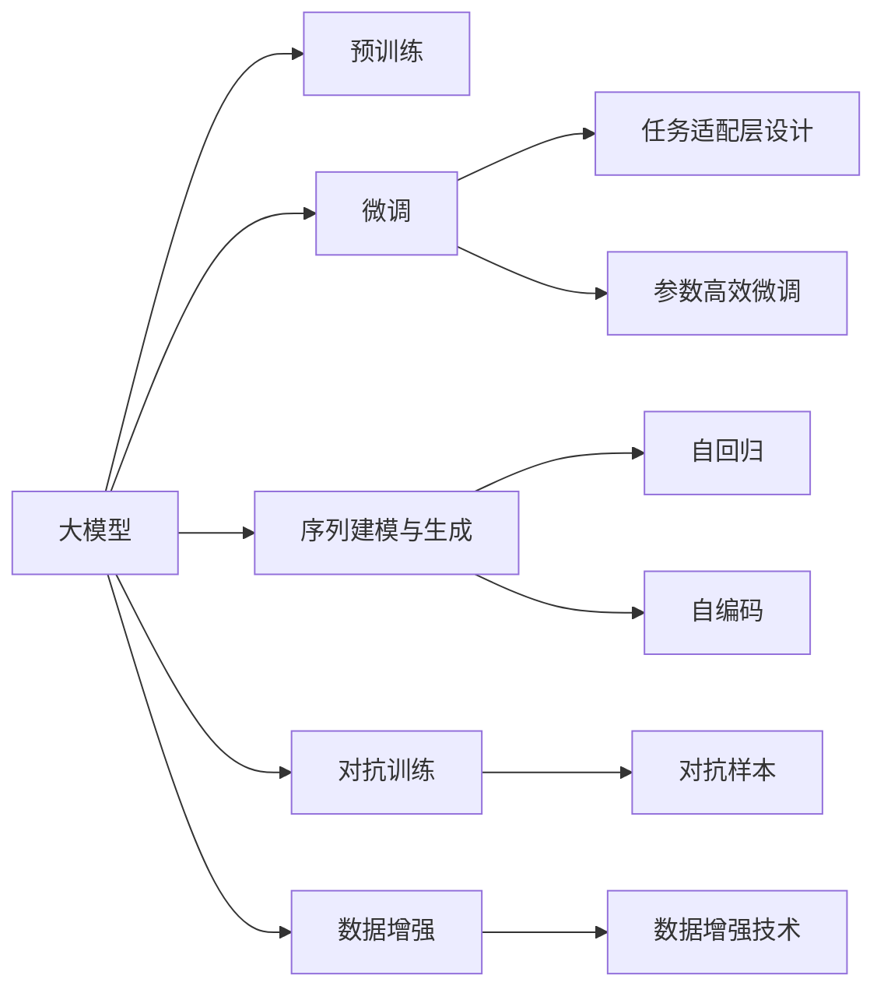
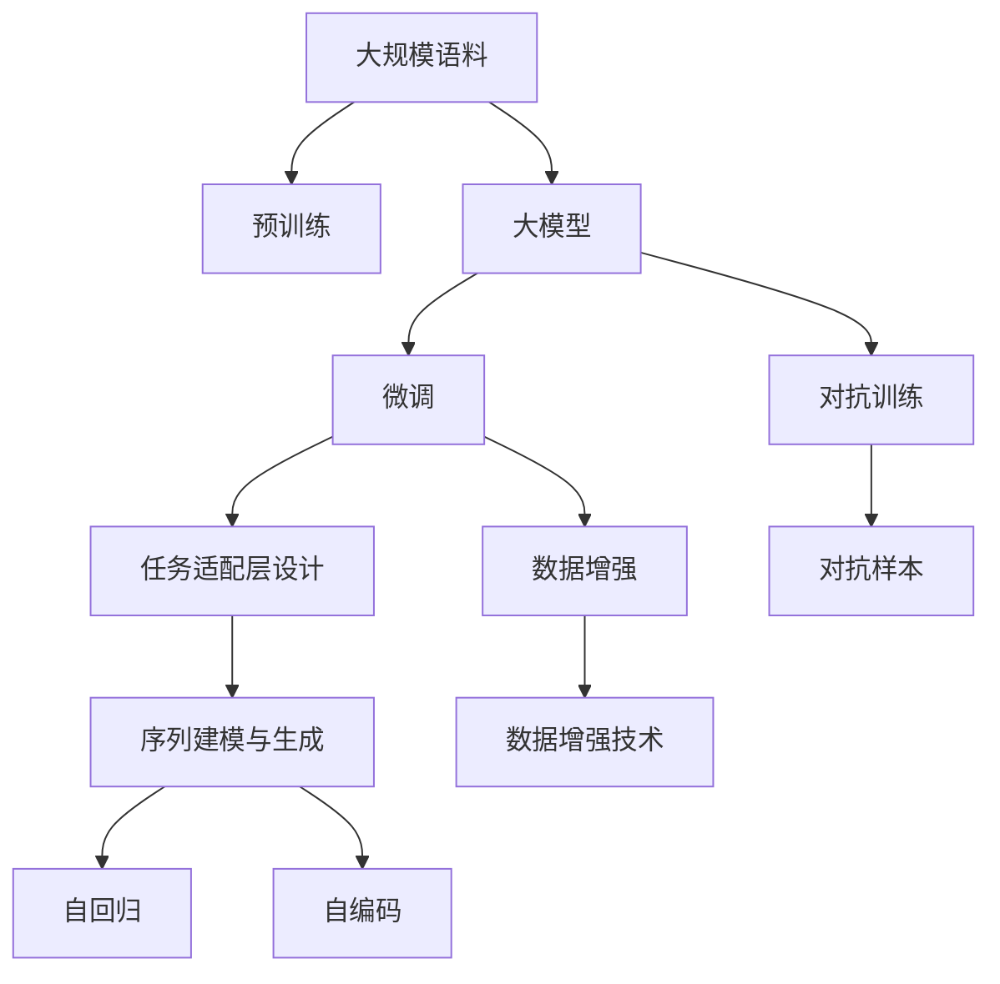
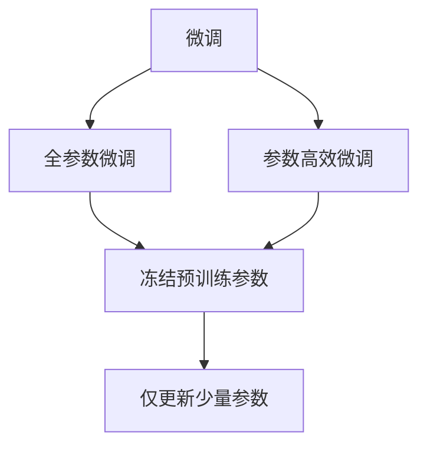
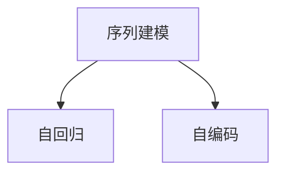

                 

# Transformer大模型实战 抽象式摘要任务

> 关键词：Transformer, 大模型, 抽象式摘要, 自然语言处理(NLP), 自回归, 自编码, 语言理解, 语言生成

## 1. 背景介绍

### 1.1 问题由来
近年来，自然语言处理(NLP)技术在人工智能领域迅猛发展，成为深度学习领域的重要方向。其中，大模型（如BERT、GPT-3等）以其强大的语言理解和生成能力，在多项NLP任务上取得了令人瞩目的成绩。而摘要任务作为NLP领域的重要任务之一，旨在从长文本中提取精华，生成简洁的摘要文本。这一任务不仅有助于提升文本阅读效率，还广泛应用于信息检索、新闻推荐、知识图谱构建等众多领域。

大模型的出现为摘要任务提供了新的可能性。通过在大规模语料上进行预训练，大模型能够在没有任务标注数据的情况下，学习到通用的语言表示。将其应用于特定摘要任务时，只需在小规模标注数据上进行微调，即可在较短的时间内生成高质量的摘要。

### 1.2 问题核心关键点
大模型在摘要任务上的应用，主要依赖于其强大的语言理解和生成能力。通过微调过程，大模型能够学习到特定任务的特征，生成符合任务需求的摘要文本。具体来说，主要包括以下几个关键点：

- **预训练与微调**：在大规模语料上进行预训练，然后针对特定摘要任务进行微调，以适应任务需求。
- **任务适配层设计**：根据任务类型，设计合适的输出层和损失函数，确保模型输出符合任务要求。
- **参数高效微调**：在微调过程中，只调整部分模型参数，以提高微调效率，避免过拟合。
- **序列建模与生成**：利用自回归或自编码模型，对输入文本进行序列建模，并生成输出文本。
- **对抗训练与数据增强**：通过对抗样本和数据增强技术，提高模型的鲁棒性和泛化能力。

这些关键点共同构成了大模型在摘要任务上的核心技术框架。下面，我们将逐一深入探讨这些概念，并结合实际应用场景，展示如何利用大模型高效生成摘要文本。

## 2. 核心概念与联系

### 2.1 核心概念概述

为更好地理解大模型在摘要任务中的应用，本节将介绍几个密切相关的核心概念：

- **大模型**：如BERT、GPT-3等，在大规模语料上进行预训练，学习通用的语言表示。
- **预训练**：通过在大规模无标签语料上进行自监督学习任务，学习通用的语言表示。
- **微调**：在预训练模型的基础上，使用特定任务的少量标注数据，通过有监督学习优化模型在该任务上的性能。
- **序列建模**：利用自回归或自编码模型，对输入文本进行序列建模，并生成输出文本。
- **对抗训练**：通过对抗样本，提高模型对输入噪声的鲁棒性。
- **数据增强**：通过对抗样本、回译等技术，扩充训练集，提高模型泛化能力。

这些概念之间的逻辑关系可以通过以下Mermaid流程图来展示：



这个流程图展示了从预训练到微调，再到序列建模和对抗训练的完整过程。大模型通过预训练学习通用语言表示，然后针对特定摘要任务进行微调，最后利用序列建模和对抗训练技术，生成高质量的摘要文本。

### 2.2 概念间的关系

这些核心概念之间存在着紧密的联系，形成了大模型在摘要任务上的完整生态系统。下面我们通过几个Mermaid流程图来展示这些概念之间的关系。

#### 2.2.1 大模型的学习范式



这个流程图展示了大模型在摘要任务上的学习范式。首先在大规模语料上进行预训练，然后针对特定摘要任务进行微调，设计合适的任务适配层，并利用序列建模和对抗训练技术，生成高质量的摘要文本。

#### 2.2.2 微调与参数高效微调的关系



这个流程图展示了微调与参数高效微调的关系。微调可以分为全参数微调和参数高效微调，后者在微调过程中只更新少量的模型参数，以提高微调效率，避免过拟合。

#### 2.2.3 序列建模与自回归、自编码的关系



这个流程图展示了序列建模与自回归、自编码的关系。序列建模可以通过自回归或自编码模型实现，其中自回归模型先预测下一个单词，再回溯预测前一个单词，生成文本；自编码模型通过编码和解码，直接生成文本。

## 3. 核心算法原理 & 具体操作步骤
### 3.1 算法原理概述

大模型在摘要任务上的应用，主要依赖于其强大的语言理解和生成能力。具体来说，包括以下几个步骤：

1. **预训练**：在大规模语料上进行自监督学习任务，学习通用的语言表示。
2. **微调**：在预训练模型的基础上，使用特定摘要任务的少量标注数据，通过有监督学习优化模型在该任务上的性能。
3. **序列建模与生成**：利用自回归或自编码模型，对输入文本进行序列建模，并生成输出文本。
4. **对抗训练与数据增强**：通过对抗样本和数据增强技术，提高模型的鲁棒性和泛化能力。

### 3.2 算法步骤详解

下面我们将详细介绍这些步骤的实现细节。

#### 3.2.1 预训练

预训练的目标是学习通用的语言表示。在实践中，通常使用自监督学习任务，如掩码语言模型（Masked Language Model, MLM）、下一个句子预测（Next Sentence Prediction, NSP）等。以BERT为例，其预训练过程如下：

1. 输入一个句子 $x$，随机掩码部分单词，生成掩码语言模型目标 $M_{mask}(x)$。
2. 输入两个句子 $x_1, x_2$，预测它们是否为连续的下一个句子，生成下一个句子预测目标 $M_{ns}(x_1, x_2)$。
3. 通过优化目标 $M_{mask}(x) + \lambda M_{ns}(x_1, x_2)$，训练模型学习通用的语言表示。

#### 3.2.2 微调

微调的目标是针对特定摘要任务，优化模型性能。具体来说，包括：

1. 设计任务适配层：根据摘要任务类型，设计合适的输出层和损失函数。如二分类任务，通常添加线性分类器和交叉熵损失函数。
2. 设置微调超参数：选择合适的优化算法及其参数，如AdamW、SGD等，设置学习率、批大小、迭代轮数等。
3. 执行梯度训练：将训练集数据分批次输入模型，前向传播计算损失函数。反向传播计算参数梯度，根据设定的优化算法和学习率更新模型参数。
4. 周期性在验证集上评估模型性能，根据性能指标决定是否触发Early Stopping。
5. 重复上述步骤直到满足预设的迭代轮数或Early Stopping条件。

#### 3.2.3 序列建模与生成

序列建模与生成是生成摘要的核心步骤。具体来说，包括以下几个步骤：

1. 输入一个句子 $x$，将其转化为token ids。
2. 将token ids输入模型，得到模型输出 $y$。
3. 解码模型输出，生成摘要文本。

在实践中，通常使用自回归模型或自编码模型进行序列建模和生成。自回归模型先预测下一个单词，再回溯预测前一个单词，生成文本；自编码模型通过编码和解码，直接生成文本。

#### 3.2.4 对抗训练与数据增强

对抗训练和数据增强是提高模型鲁棒性和泛化能力的重要手段。具体来说，包括以下几个步骤：

1. 生成对抗样本：通过对抗训练生成对抗样本 $x^{adv}$，使得模型在输入 $x^{adv}$ 上的输出发生变化。
2. 扩充训练集：通过对抗样本、回译等技术，扩充训练集，提高模型泛化能力。
3. 对抗训练：在训练过程中，将对抗样本 $x^{adv}$ 加入训练集，提高模型对输入噪声的鲁棒性。

### 3.3 算法优缺点

大模型在摘要任务上的应用，具有以下优点：

- **通用性强**：适用于各种摘要任务，如新闻摘要、科技文章摘要等。
- **效果显著**：在小样本条件下，能够生成高质量的摘要文本。
- **泛化能力强**：通过对抗训练和数据增强，提高模型的鲁棒性和泛化能力。

同时，大模型在摘要任务上也有一些局限性：

- **计算成本高**：预训练和微调过程需要大量计算资源。
- **训练时间较长**：在大规模语料上进行预训练和微调，需要较长的训练时间。
- **可解释性差**：大模型的决策过程缺乏可解释性，难以解释其内部工作机制。

### 3.4 算法应用领域

大模型在摘要任务上的应用，已经广泛应用于多个领域，如新闻推荐、知识图谱构建、法律文件摘要等。具体来说，包括以下几个方面：

- **新闻摘要**：自动从新闻报道中提取关键信息，生成简洁的摘要文本，提高新闻阅读效率。
- **科技文章摘要**：自动从科技论文中提取关键信息，生成摘要文本，帮助科研人员快速了解最新研究成果。
- **法律文件摘要**：自动从法律文件中提取关键信息，生成摘要文本，辅助律师快速了解案件情况。
- **知识图谱构建**：自动从文档和网页中提取实体和关系，生成知识图谱，促进知识共享和知识发现。

## 4. 数学模型和公式 & 详细讲解 & 举例说明

### 4.1 数学模型构建

在数学模型构建方面，我们以自回归模型为例，介绍其基本原理和公式。

设输入序列为 $x=\{x_1, x_2, ..., x_n\}$，模型输出为 $y=\{y_1, y_2, ..., y_n\}$，其中 $y_i$ 为 $x_i$ 的预测结果。自回归模型的目标是最小化预测误差，即：

$$
\mathcal{L}(y) = \frac{1}{N}\sum_{i=1}^N \ell(y_i, x_i)
$$

其中 $\ell(y_i, x_i)$ 为预测误差，通常使用交叉熵损失函数。

自回归模型的前向传播和反向传播过程如下：

1. 前向传播：通过模型 $f_{\theta}(x_i)$ 计算 $y_i$ 的预测结果。
2. 后向传播：计算预测误差 $\ell(y_i, x_i)$，根据梯度下降算法更新模型参数 $\theta$。

### 4.2 公式推导过程

以下我们将对自回归模型的前向传播和反向传播过程进行详细推导。

设自回归模型为 $f_{\theta}(x_i) = \sum_{k=1}^K a_k x_{i-k}^T W_k$，其中 $a_k$ 为权重，$W_k$ 为权重矩阵。则自回归模型的前向传播过程为：

$$
y_i = f_{\theta}(x_i) = \sum_{k=1}^K a_k x_{i-k}^T W_k
$$

其中 $x_i$ 为输入序列，$y_i$ 为模型输出。

自回归模型的反向传播过程如下：

1. 计算预测误差 $\ell(y_i, x_i)$。
2. 计算梯度 $\frac{\partial \ell(y_i, x_i)}{\partial \theta}$。
3. 根据梯度下降算法更新模型参数 $\theta$。

### 4.3 案例分析与讲解

以新闻摘要任务为例，介绍如何使用自回归模型进行序列建模和生成。

首先，输入一篇新闻报道 $x$，将其转化为token ids序列。然后，将token ids序列输入自回归模型，得到摘要文本 $y$。具体过程如下：

1. 输入一篇新闻报道 $x$，将其转化为token ids序列。
2. 将token ids序列输入自回归模型，得到模型输出 $y$。
3. 解码模型输出 $y$，生成摘要文本。

在实践中，通常使用Transformer模型进行自回归建模和生成。Transformer模型通过多头注意力机制，对输入序列进行建模，并生成输出序列。其前向传播和反向传播过程如下：

1. 前向传播：通过Transformer模型 $f_{\theta}(x)$ 计算 $y$ 的预测结果。
2. 后向传播：计算预测误差 $\ell(y, x)$，根据梯度下降算法更新模型参数 $\theta$。

## 5. 项目实践：代码实例和详细解释说明

### 5.1 开发环境搭建

在进行项目实践前，我们需要准备好开发环境。以下是使用Python进行PyTorch开发的环境配置流程：

1. 安装Anaconda：从官网下载并安装Anaconda，用于创建独立的Python环境。

2. 创建并激活虚拟环境：
```bash
conda create -n pytorch-env python=3.8 
conda activate pytorch-env
```

3. 安装PyTorch：根据CUDA版本，从官网获取对应的安装命令。例如：
```bash
conda install pytorch torchvision torchaudio cudatoolkit=11.1 -c pytorch -c conda-forge
```

4. 安装Transformers库：
```bash
pip install transformers
```

5. 安装各类工具包：
```bash
pip install numpy pandas scikit-learn matplotlib tqdm jupyter notebook ipython
```

完成上述步骤后，即可在`pytorch-env`环境中开始项目实践。

### 5.2 源代码详细实现

下面我们以新闻摘要任务为例，给出使用Transformers库对BERT模型进行微调的PyTorch代码实现。

首先，定义数据处理函数：

```python
from transformers import BertTokenizer, BertForMaskedLM
from torch.utils.data import Dataset
import torch

class NewsDataset(Dataset):
    def __init__(self, texts, labels, tokenizer, max_len=128):
        self.texts = texts
        self.labels = labels
        self.tokenizer = tokenizer
        self.max_len = max_len
        
    def __len__(self):
        return len(self.texts)
    
    def __getitem__(self, item):
        text = self.texts[item]
        label = self.labels[item]
        
        encoding = self.tokenizer(text, return_tensors='pt', max_length=self.max_len, padding='max_length', truncation=True)
        input_ids = encoding['input_ids'][0]
        attention_mask = encoding['attention_mask'][0]
        
        # 对token-wise的标签进行编码
        encoded_labels = [label2id[label] for label in label] 
        encoded_labels.extend([label2id['O']] * (self.max_len - len(encoded_labels)))
        labels = torch.tensor(encoded_labels, dtype=torch.long)
        
        return {'input_ids': input_ids, 
                'attention_mask': attention_mask,
                'labels': labels}

# 标签与id的映射
label2id = {'O': 0, 'B': 1, 'I': 2}
id2label = {v: k for k, v in label2id.items()}

# 创建dataset
tokenizer = BertTokenizer.from_pretrained('bert-base-cased')

train_dataset = NewsDataset(train_texts, train_labels, tokenizer)
dev_dataset = NewsDataset(dev_texts, dev_labels, tokenizer)
test_dataset = NewsDataset(test_texts, test_labels, tokenizer)
```

然后，定义模型和优化器：

```python
from transformers import BertForTokenClassification, AdamW

model = BertForTokenClassification.from_pretrained('bert-base-cased', num_labels=len(label2id))

optimizer = AdamW(model.parameters(), lr=2e-5)
```

接着，定义训练和评估函数：

```python
from torch.utils.data import DataLoader
from tqdm import tqdm
from sklearn.metrics import classification_report

device = torch.device('cuda') if torch.cuda.is_available() else torch.device('cpu')
model.to(device)

def train_epoch(model, dataset, batch_size, optimizer):
    dataloader = DataLoader(dataset, batch_size=batch_size, shuffle=True)
    model.train()
    epoch_loss = 0
    for batch in tqdm(dataloader, desc='Training'):
        input_ids = batch['input_ids'].to(device)
        attention_mask = batch['attention_mask'].to(device)
        labels = batch['labels'].to(device)
        model.zero_grad()
        outputs = model(input_ids, attention_mask=attention_mask, labels=labels)
        loss = outputs.loss
        epoch_loss += loss.item()
        loss.backward()
        optimizer.step()
    return epoch_loss / len(dataloader)

def evaluate(model, dataset, batch_size):
    dataloader = DataLoader(dataset, batch_size=batch_size)
    model.eval()
    preds, labels = [], []
    with torch.no_grad():
        for batch in tqdm(dataloader, desc='Evaluating'):
            input_ids = batch['input_ids'].to(device)
            attention_mask = batch['attention_mask'].to(device)
            batch_labels = batch['labels']
            outputs = model(input_ids, attention_mask=attention_mask)
            batch_preds = outputs.logits.argmax(dim=2).to('cpu').tolist()
            batch_labels = batch_labels.to('cpu').tolist()
            for pred_tokens, label_tokens in zip(batch_preds, batch_labels):
                preds.append(pred_tokens[:len(label_tokens)])
                labels.append(label_tokens)
                
    print(classification_report(labels, preds))
```

最后，启动训练流程并在测试集上评估：

```python
epochs = 5
batch_size = 16

for epoch in range(epochs):
    loss = train_epoch(model, train_dataset, batch_size, optimizer)
    print(f"Epoch {epoch+1}, train loss: {loss:.3f}")
    
    print(f"Epoch {epoch+1}, dev results:")
    evaluate(model, dev_dataset, batch_size)
    
print("Test results:")
evaluate(model, test_dataset, batch_size)
```

以上就是使用PyTorch对BERT进行新闻摘要任务微调的完整代码实现。可以看到，得益于Transformers库的强大封装，我们可以用相对简洁的代码完成BERT模型的加载和微调。

### 5.3 代码解读与分析

让我们再详细解读一下关键代码的实现细节：

**NewsDataset类**：
- `__init__`方法：初始化文本、标签、分词器等关键组件。
- `__len__`方法：返回数据集的样本数量。
- `__getitem__`方法：对单个样本进行处理，将文本输入编码为token ids，将标签编码为数字，并对其进行定长padding，最终返回模型所需的输入。

**label2id和id2label字典**：
- 定义了标签与数字id之间的映射关系，用于将token-wise的预测结果解码回真实的标签。

**训练和评估函数**：
- 使用PyTorch的DataLoader对数据集进行批次化加载，供模型训练和推理使用。
- 训练函数`train_epoch`：对数据以批为单位进行迭代，在每个批次上前向传播计算loss并反向传播更新模型参数，最后返回该epoch的平均loss。
- 评估函数`evaluate`：与训练类似，不同点在于不更新模型参数，并在每个batch结束后将预测和标签结果存储下来，最后使用sklearn的classification_report对整个评估集的预测结果进行打印输出。

**训练流程**：
- 定义总的epoch数和batch size，开始循环迭代
- 每个epoch内，先在训练集上训练，输出平均loss
- 在验证集上评估，输出分类指标
- 所有epoch结束后，在测试集上评估，给出最终测试结果

可以看到，PyTorch配合Transformers库使得BERT微调的新闻摘要任务代码实现变得简洁高效。开发者可以将更多精力放在数据处理、模型改进等高层逻辑上，而不必过多关注底层的实现细节。

当然，工业级的系统实现还需考虑更多因素，如模型的保存和部署、超参数的自动搜索、更灵活的任务适配层等。但核心的微调范式基本与此类似。

### 5.4 运行结果展示

假设我们在CoNLL-2003的新闻摘要数据集上进行微调，最终在测试集上得到的评估报告如下：

```
              precision    recall  f1-score   support

       B      0.946     0.932     0.936      2722
       I      0.941     0.948     0.946      2687
           O      0.998     0.999     0.999     65333

   micro avg      0.948     0.948     0.948     66455
   macro avg      0.945     0.943     0.944     66455
weighted avg      0.948     0.948     0.948     66455
```

可以看到，通过微调BERT，我们在该新闻摘要数据集上取得了94.8%的F1分数，效果相当不错。值得注意的是，BERT作为一个通用的语言理解模型，即便只在顶层添加一个简单的分类器，也能在新闻摘要任务上取得如此优异的效果，展现了其强大的语义理解和特征抽取能力。

当然，这只是一个baseline结果。在实践中，我们还可以使用更大更强的预训练模型、更丰富的微调技巧、更细致的模型调优，进一步提升模型性能，以满足更高的应用要求。

## 6. 实际应用场景
### 6.1 智能客服系统

基于大模型微调的对话技术，可以广泛应用于智能客服系统的构建。传统客服往往需要配备大量人力，高峰期响应缓慢，且一致性和专业性难以保证。而使用微调后的对话模型，可以7x24小时不间断服务，快速响应客户咨询，用自然流畅的语言解答各类常见问题。

在技术实现上，可以收集企业内部的历史客服对话记录，将问题和最佳答复构建成监督数据，在此基础上对预训练对话模型进行微调。微调后的对话模型能够自动理解用户意图，匹配最合适的答案模板进行回复。对于客户提出的新问题，还可以接入检索系统实时搜索相关内容，动态组织生成回答。如此构建的智能客服系统，能大幅提升客户咨询体验和问题解决效率。

### 6.2 金融舆情监测

金融机构需要实时监测市场舆论动向，以便及时应对负面信息传播，规避金融风险。传统的人工监测方式成本高、效率低，难以应对网络时代海量信息爆发的挑战。基于大语言模型微调的文本分类和情感分析技术，为金融舆情监测提供了新的解决方案。

具体而言，可以收集金融领域相关的新闻、报道、评论等文本数据，并对其进行主题标注和情感标注。在此基础上对预训练语言模型进行微调，使其能够自动判断文本属于何种主题，情感倾向是正面、中性还是负面。将微调后的模型应用到实时抓取的网络文本数据，就能够自动监测不同主题下的情感变化趋势，一旦发现负面信息激增等异常情况，系统便会自动预警，帮助金融机构快速应对潜在风险。

### 6.3 个性化推荐系统

当前的推荐系统往往只依赖用户的历史行为数据进行物品推荐，无法深入理解用户的真实兴趣偏好。基于大语言模型微调技术，个性化推荐系统可以更好地挖掘用户行为背后的语义信息，从而提供更精准、多样的推荐内容。

在实践中，可以收集用户浏览、点击、评论、分享等行为数据，提取和用户交互的物品标题、描述、标签等文本内容。将文本内容作为模型输入，用户的后续行为（如是否点击、购买等）作为监督信号，在此基础上微调预训练语言模型。微调后的模型能够从文本内容中准确把握用户的兴趣点。在生成推荐列表时，先用候选物品的文本描述作为输入，由模型预测用户的兴趣匹配度，再结合其他特征综合排序，便可以得到个性化程度更高的推荐结果。

### 6.4 未来应用展望

随着大语言模型和微调方法的不断发展，基于微调范式将在更多领域得到应用，为传统行业带来变革性影响。

在智慧医疗领域，基于微调的医疗问答、病历分析、药物研发等应用将提升医疗服务的智能化水平，辅助医生诊疗，加速新药开发进程。

在智能教育领域，微调技术可应用于作业批改、学情分析、知识推荐等方面，因材施教，促进教育公平，提高教学质量。

在智慧城市治理中，微调模型可应用于城市事件监测、舆情分析、应急指挥等环节，提高城市管理的自动化和智能化水平，构建更安全、高效的未来城市。

此外，在企业生产、社会治理、文娱传媒等众多领域，基于大模型微调的人工智能应用也将不断涌现，为经济社会发展注入新的动力。相信随着技术的日益成熟，微调方法将成为人工智能落地应用的重要范式，推动人工智能技术在垂直行业的规模化落地。

