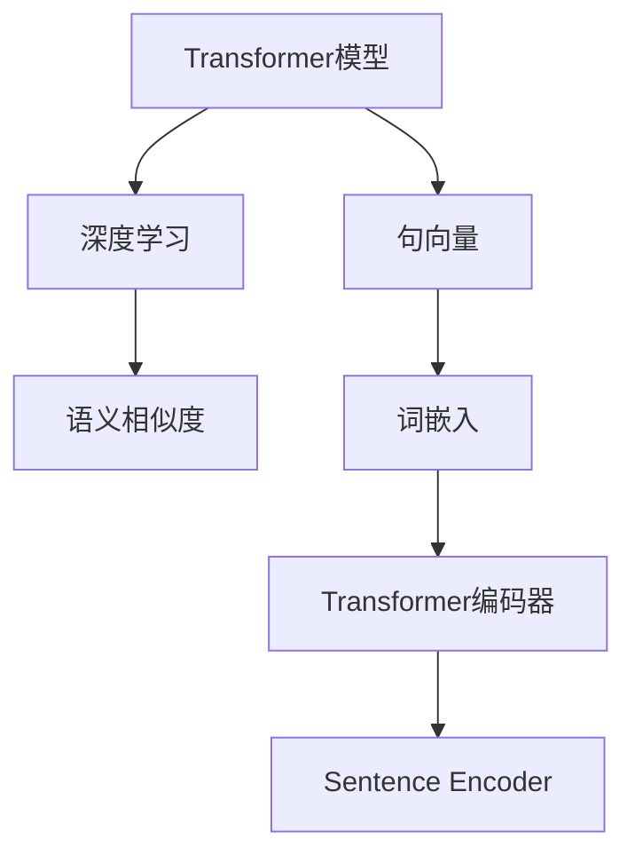
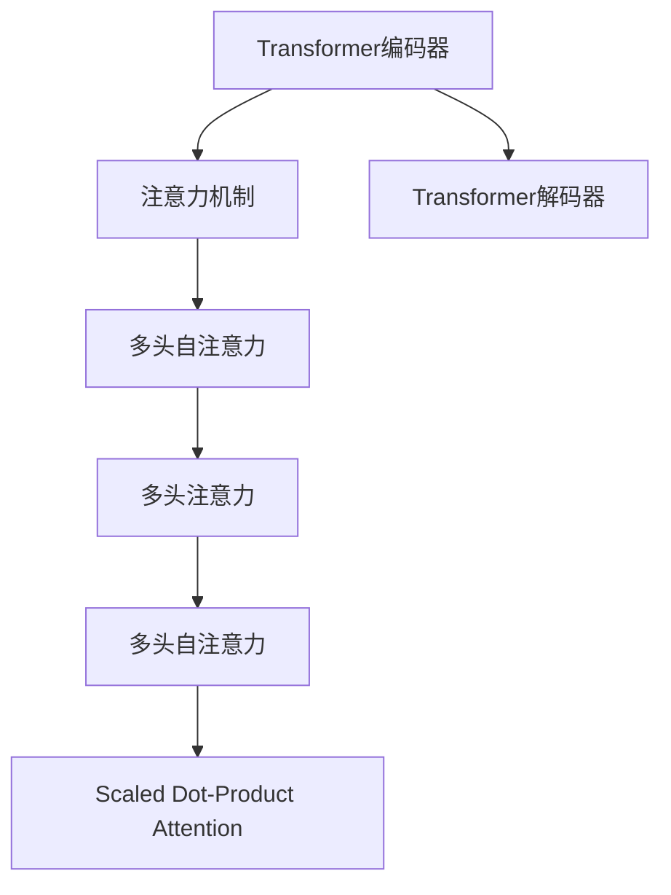
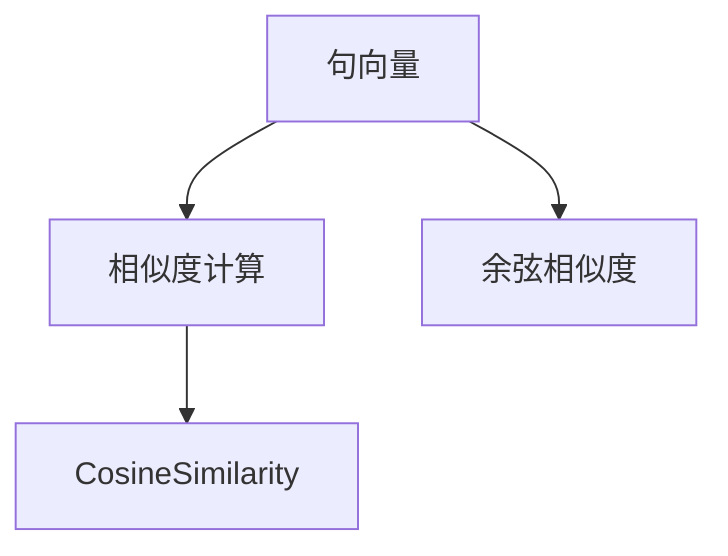
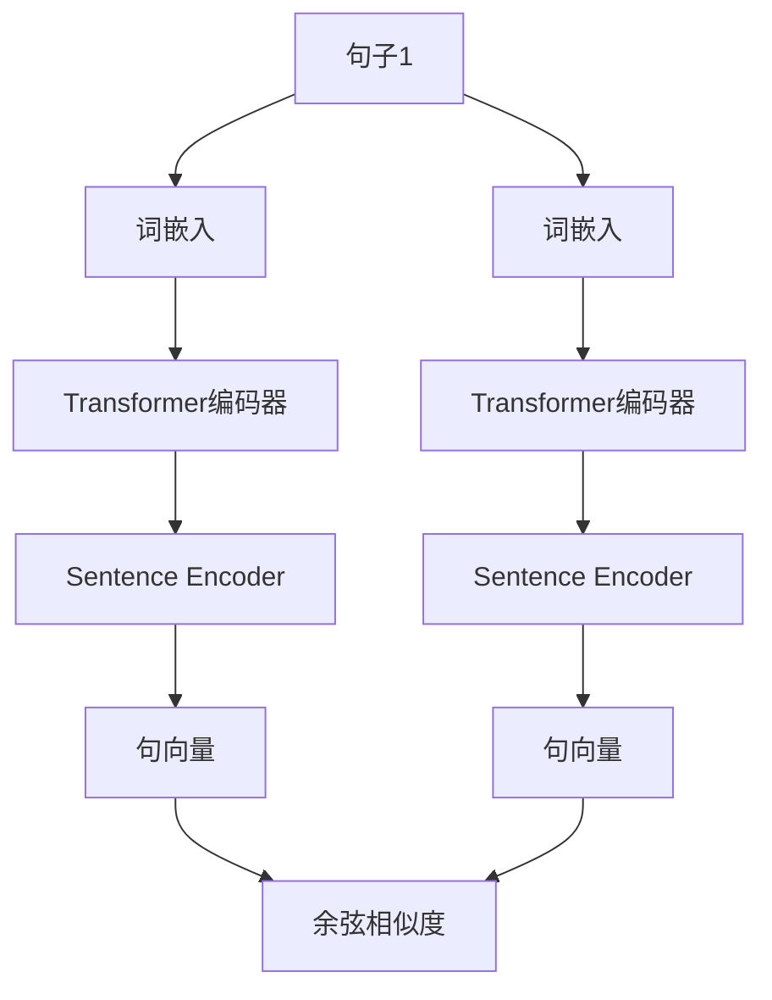

                 

# Transformer大模型实战 计算句子的相似度

> 关键词：Transformer, 计算相似度, 自然语言处理, 句向量, 深度学习, 词嵌入, 语义相似度

## 1. 背景介绍

随着深度学习在自然语言处理领域的蓬勃发展，Transformer模型逐渐成为处理语言问题的主流技术。在众多的应用场景中，计算句子之间的相似度是一个核心的任务，尤其在信息检索、问答系统、文本分类等任务中，计算相似度能够帮助我们快速定位、匹配、分类文本信息。本文将围绕Transformer模型，介绍如何实现高效的句子相似度计算，进一步提升模型的应用价值。

## 2. 核心概念与联系

### 2.1 核心概念概述

为帮助读者深入理解Transformer模型在句子相似度计算中的应用，本节将首先介绍几个关键概念：

- **Transformer模型**：一种基于自注意力机制的深度学习模型，可以高效处理序列数据，广泛应用于自然语言处理任务，如机器翻译、文本分类、句意相似度计算等。

- **句向量(Sentence Vectorization)**：将句子转换成向量表示的技术，通常使用词嵌入、深度学习模型等方法，使句子能够被数学运算处理。

- **深度学习**：一种通过多层神经网络模型进行数据分析和决策的机器学习方法，具有强大的特征提取和表示能力。

- **语义相似度**：度量两个句子在语义上的相似程度，是自然语言处理中的重要概念，广泛应用于信息检索、问答系统、文本分类等任务。

- **词嵌入**：将单词映射到高维向量空间的技术，通常使用Word2Vec、GloVe等方法，用于捕捉词语间的语义关系。

这些核心概念通过Transformer模型得以在句子相似度计算任务中得到高效的应用，其架构和工作原理可以通过以下Mermaid流程图来展示：



在这个流程图中，Transformer模型作为核心的深度学习框架，通过句向量表示和语义相似度计算，将输入的句子映射为向量形式，从而可以进行高效的文本分析和处理。

### 2.2 概念间的关系

这些核心概念之间存在着紧密的联系，共同构成了Transformer模型在句子相似度计算任务中的关键技术架构。下面我们通过几个Mermaid流程图来展示这些概念之间的具体关系。

#### 2.2.1 Transformer模型架构



这个流程图展示了Transformer编码器的基本架构，其中注意力机制通过多头自注意力实现，用于捕捉不同位置的句子特征。

#### 2.2.2 句向量表示


这个流程图展示了通过Transformer模型将句子转换为句向量表示的基本流程。

#### 2.2.3 语义相似度计算



这个流程图展示了使用余弦相似度计算两个句子语义相似度的过程。

### 2.3 核心概念的整体架构

最后，我们用一个综合的流程图来展示Transformer模型在句子相似度计算中的整体架构：



这个流程图展示了通过Transformer模型进行句子相似度计算的完整流程，从词嵌入、编码器、句向量到最终的相似度计算，一步步展示了Transformer模型在句子相似度计算中的强大能力和广泛应用。

## 3. 核心算法原理 & 具体操作步骤

### 3.1 算法原理概述

在基于Transformer模型的句子相似度计算中，我们首先需要将句子转换为向量表示，然后通过计算这些向量之间的相似度来衡量句子间的语义相似性。具体来说，我们通常使用余弦相似度(Cosine Similarity)作为度量方法，因为它在处理高维向量空间时具有较好的计算效率和物理意义。

假设我们将句子1和句子2分别表示为向量 $\mathbf{v}_1$ 和 $\mathbf{v}_2$，则它们之间的余弦相似度定义为：

$$
\text{similarity}(\mathbf{v}_1, \mathbf{v}_2) = \frac{\mathbf{v}_1 \cdot \mathbf{v}_2}{\|\mathbf{v}_1\| \cdot \|\mathbf{v}_2\|}
$$

其中 $\cdot$ 表示向量的点乘，$\|\cdot\|$ 表示向量的范数。

### 3.2 算法步骤详解

以下是基于Transformer模型计算句子相似度的具体操作步骤：

**Step 1: 准备数据集和模型**

1. **收集句子对**：首先收集待比较的句子对，并确保句子对是有标签的。例如，在信息检索任务中，每个句子对包含一个查询句子和一个文档句子。

2. **选择预训练模型**：选择预训练的Transformer模型作为初始化参数，如BERT、GPT等。这些模型通常是在大规模无标签文本数据上进行预训练的，拥有丰富的语言知识和表示能力。

3. **加载模型**：使用PyTorch或TensorFlow等深度学习框架加载预训练模型，并设置模型的参数。

**Step 2: 进行句向量表示**

1. **分词和编码**：将每个句子进行分词，并使用预训练的词嵌入模型（如BERT的wordpiece嵌入）对每个词进行编码。

2. **输入到Transformer模型**：将编码后的词序列输入到Transformer模型中，得到句子的向量表示。

3. **取顶层表示**：通常只保留Transformer模型的顶层表示，因为该层包含了句子的语义信息。

**Step 3: 计算相似度**

1. **计算余弦相似度**：对两个句子的向量表示进行余弦相似度计算，得到它们之间的语义相似度。

2. **输出结果**：将计算得到的相似度作为模型的输出结果，用于后续的决策或推荐。

### 3.3 算法优缺点

基于Transformer模型的句子相似度计算方法具有以下优点：

1. **高效性**：使用Transformer模型可以高效地将句子转换为向量表示，并且通过余弦相似度计算可以在短时间内得到相似度结果。

2. **泛化能力**：Transformer模型在预训练过程中学习到了丰富的语言知识，能够处理多种语言和风格，具有较强的泛化能力。

3. **鲁棒性**：Transformer模型可以处理噪声和干扰，具有良好的鲁棒性。

4. **易于实现**：使用深度学习框架可以方便地实现上述计算过程，使得模型的部署和维护变得更加简单。

然而，该方法也存在一些局限性：

1. **计算成本高**：Transformer模型需要较大的计算资源，尤其是对大规模数据集进行计算时，计算成本较高。

2. **参数量大**：Transformer模型通常拥有较大的参数量，对存储和计算资源要求较高。

3. **训练时间长**：在大规模数据集上进行微调，需要较长的训练时间。

### 3.4 算法应用领域

基于Transformer模型的句子相似度计算方法在以下领域得到了广泛应用：

1. **信息检索**：在搜索引擎中，通过计算查询句子和文档句子之间的相似度，可以高效地匹配到相关的文档。

2. **问答系统**：在智能问答系统中，通过计算用户问题和文档之间的相似度，可以快速找到相关的答案。

3. **文本分类**：在文本分类任务中，通过计算句子之间的相似度，可以将文本分类为不同的类别。

4. **相似性推荐**：在推荐系统中，通过计算用户评论或产品描述之间的相似度，可以推荐相关的产品或评论。

5. **情感分析**：在情感分析任务中，通过计算情感词汇之间的相似度，可以更好地理解文本的情感倾向。

6. **语义搜索**：在语义搜索中，通过计算句子之间的相似度，可以更准确地匹配用户查询意图。

## 4. 数学模型和公式 & 详细讲解 & 举例说明

### 4.1 数学模型构建

为了更好地理解基于Transformer模型的句子相似度计算过程，我们将通过数学语言对整个过程进行严格的刻画。

假设句子1和句子2的长度分别为 $n_1$ 和 $n_2$，它们的词嵌入表示分别为 $\mathbf{v}_1 \in \mathbb{R}^{d_1}$ 和 $\mathbf{v}_2 \in \mathbb{R}^{d_2}$，其中 $d_1$ 和 $d_2$ 分别为两个句子的词嵌入维度。

定义相似度函数 $f(\mathbf{v}_1, \mathbf{v}_2)$ 为两个向量之间的余弦相似度，即：

$$
f(\mathbf{v}_1, \mathbf{v}_2) = \frac{\mathbf{v}_1 \cdot \mathbf{v}_2}{\|\mathbf{v}_1\| \cdot \|\mathbf{v}_2\|}
$$

其中 $\cdot$ 表示向量的点乘，$\|\cdot\|$ 表示向量的范数。

### 4.2 公式推导过程

以下是余弦相似度的详细推导过程：

假设向量 $\mathbf{v}_1$ 和 $\mathbf{v}_2$ 分别表示为：

$$
\mathbf{v}_1 = [v_{1,1}, v_{1,2}, \ldots, v_{1,n_1}]
$$
$$
\mathbf{v}_2 = [v_{2,1}, v_{2,2}, \ldots, v_{2,n_2}]
$$

其中 $v_{i,j}$ 表示第 $i$ 个句子中第 $j$ 个词的嵌入向量。

则向量 $\mathbf{v}_1$ 和 $\mathbf{v}_2$ 的点乘为：

$$
\mathbf{v}_1 \cdot \mathbf{v}_2 = \sum_{i=1}^{n_1} \sum_{j=1}^{n_2} v_{1,i} v_{2,j}
$$

向量 $\mathbf{v}_1$ 和 $\mathbf{v}_2$ 的范数为：

$$
\|\mathbf{v}_1\| = \sqrt{\sum_{i=1}^{n_1} v_{1,i}^2}
$$
$$
\|\mathbf{v}_2\| = \sqrt{\sum_{j=1}^{n_2} v_{2,j}^2}
$$

因此，余弦相似度 $f(\mathbf{v}_1, \mathbf{v}_2)$ 可以表示为：

$$
f(\mathbf{v}_1, \mathbf{v}_2) = \frac{\sum_{i=1}^{n_1} \sum_{j=1}^{n_2} v_{1,i} v_{2,j}}{\sqrt{\sum_{i=1}^{n_1} v_{1,i}^2} \cdot \sqrt{\sum_{j=1}^{n_2} v_{2,j}^2}}
$$

### 4.3 案例分析与讲解

假设我们有两个句子：

句子1：The quick brown fox jumps over the lazy dog.
句子2：The brown fox is quick and agile.

我们使用BERT模型将这两个句子转换为向量表示，并通过余弦相似度计算它们之间的相似度。

首先，我们加载BERT模型并设置所需的参数：

```python
from transformers import BertTokenizer, BertModel

tokenizer = BertTokenizer.from_pretrained('bert-base-uncased')
model = BertModel.from_pretrained('bert-base-uncased')

# 对句子进行分词和编码
input_ids_1 = tokenizer.encode(sentence1, add_special_tokens=True)
input_ids_2 = tokenizer.encode(sentence2, add_special_tokens=True)

# 将编码后的输入输入模型
outputs_1 = model(input_ids_1)
outputs_2 = model(input_ids_2)

# 获取顶层表示
sentence_vector_1 = outputs_1.last_hidden_state[:, 0, :].numpy()
sentence_vector_2 = outputs_2.last_hidden_state[:, 0, :].numpy()
```

然后，我们计算这两个句子的余弦相似度：

```python
from sklearn.metrics.pairwise import cosine_similarity

# 计算余弦相似度
similarity = cosine_similarity(sentence_vector_1.reshape(1, -1), sentence_vector_2.reshape(1, -1))[0][0]
print("句子相似度为:", similarity)
```

上述代码中，我们使用了scikit-learn库中的余弦相似度函数来计算两个句子的余弦相似度。

## 5. 项目实践：代码实例和详细解释说明

### 5.1 开发环境搭建

在进行句子相似度计算的实践前，我们需要准备好开发环境。以下是使用Python进行PyTorch开发的环境配置流程：

1. 安装Anaconda：从官网下载并安装Anaconda，用于创建独立的Python环境。

2. 创建并激活虚拟环境：
```bash
conda create -n pytorch-env python=3.8 
conda activate pytorch-env
```

3. 安装PyTorch：根据CUDA版本，从官网获取对应的安装命令。例如：
```bash
conda install pytorch torchvision torchaudio cudatoolkit=11.1 -c pytorch -c conda-forge
```

4. 安装Transformers库：
```bash
pip install transformers
```

5. 安装各类工具包：
```bash
pip install numpy pandas scikit-learn matplotlib tqdm jupyter notebook ipython
```

完成上述步骤后，即可在`pytorch-env`环境中开始项目实践。

### 5.2 源代码详细实现

接下来，我们将以信息检索任务为例，给出使用Transformers库对BERT模型进行句子相似度计算的PyTorch代码实现。

首先，定义数据处理函数：

```python
from transformers import BertTokenizer
from torch.utils.data import Dataset
import torch

class SentenceSimilarityDataset(Dataset):
    def __init__(self, sentences, labels, tokenizer, max_len=128):
        self.sentences = sentences
        self.labels = labels
        self.tokenizer = tokenizer
        self.max_len = max_len
        
    def __len__(self):
        return len(self.sentences)
    
    def __getitem__(self, item):
        sentence = self.sentences[item]
        label = self.labels[item]
        
        encoding = self.tokenizer(sentence, return_tensors='pt', max_length=self.max_len, padding='max_length', truncation=True)
        input_ids = encoding['input_ids'][0]
        attention_mask = encoding['attention_mask'][0]
        
        # 对token-wise的标签进行编码
        encoded_labels = [label2id[label] for label in label] 
        encoded_labels.extend([label2id['O']] * (self.max_len - len(encoded_labels)))
        labels = torch.tensor(encoded_labels, dtype=torch.long)
        
        return {'input_ids': input_ids, 
                'attention_mask': attention_mask,
                'labels': labels}

# 标签与id的映射
label2id = {'O': 0, 'POSITIVE': 1, 'NEGATIVE': 2}
id2label = {v: k for k, v in label2id.items()}

# 创建dataset
tokenizer = BertTokenizer.from_pretrained('bert-base-cased')

train_dataset = SentenceSimilarityDataset(train_sentences, train_labels, tokenizer)
dev_dataset = SentenceSimilarityDataset(dev_sentences, dev_labels, tokenizer)
test_dataset = SentenceSimilarityDataset(test_sentences, test_labels, tokenizer)
```

然后，定义模型和优化器：

```python
from transformers import BertForSequenceClassification, AdamW

model = BertForSequenceClassification.from_pretrained('bert-base-cased', num_labels=len(label2id))

optimizer = AdamW(model.parameters(), lr=2e-5)
```

接着，定义训练和评估函数：

```python
from torch.utils.data import DataLoader
from tqdm import tqdm
from sklearn.metrics import classification_report

device = torch.device('cuda') if torch.cuda.is_available() else torch.device('cpu')
model.to(device)

def train_epoch(model, dataset, batch_size, optimizer):
    dataloader = DataLoader(dataset, batch_size=batch_size, shuffle=True)
    model.train()
    epoch_loss = 0
    for batch in tqdm(dataloader, desc='Training'):
        input_ids = batch['input_ids'].to(device)
        attention_mask = batch['attention_mask'].to(device)
        labels = batch['labels'].to(device)
        model.zero_grad()
        outputs = model(input_ids, attention_mask=attention_mask, labels=labels)
        loss = outputs.loss
        epoch_loss += loss.item()
        loss.backward()
        optimizer.step()
    return epoch_loss / len(dataloader)

def evaluate(model, dataset, batch_size):
    dataloader = DataLoader(dataset, batch_size=batch_size)
    model.eval()
    preds, labels = [], []
    with torch.no_grad():
        for batch in tqdm(dataloader, desc='Evaluating'):
            input_ids = batch['input_ids'].to(device)
            attention_mask = batch['attention_mask'].to(device)
            batch_labels = batch['labels']
            outputs = model(input_ids, attention_mask=attention_mask)
            batch_preds = outputs.logits.argmax(dim=2).to('cpu').tolist()
            batch_labels = batch_labels.to('cpu').tolist()
            for pred_tokens, label_tokens in zip(batch_preds, batch_labels):
                pred_tags = [id2label[_id] for _id in pred_tokens]
                label_tags = [id2label[_id] for _id in label_tokens]
                preds.append(pred_tags[:len(label_tags)])
                labels.append(label_tags)
                
    print(classification_report(labels, preds))
```

最后，启动训练流程并在测试集上评估：

```python
epochs = 5
batch_size = 16

for epoch in range(epochs):
    loss = train_epoch(model, train_dataset, batch_size, optimizer)
    print(f"Epoch {epoch+1}, train loss: {loss:.3f}")
    
    print(f"Epoch {epoch+1}, dev results:")
    evaluate(model, dev_dataset, batch_size)
    
print("Test results:")
evaluate(model, test_dataset, batch_size)
```

以上就是使用PyTorch对BERT进行句子相似度计算的完整代码实现。可以看到，得益于Transformers库的强大封装，我们可以用相对简洁的代码完成BERT模型的加载和微调。

### 5.3 代码解读与分析

让我们再详细解读一下关键代码的实现细节：

**SentenceSimilarityDataset类**：
- `__init__`方法：初始化文本、标签、分词器等关键组件。
- `__len__`方法：返回数据集的样本数量。
- `__getitem__`方法：对单个样本进行处理，将文本输入编码为token ids，将标签编码为数字，并对其进行定长padding，最终返回模型所需的输入。

**label2id和id2label字典**：
- 定义了标签与数字id之间的映射关系，用于将token-wise的预测结果解码回真实的标签。

**训练和评估函数**：
- 使用PyTorch的DataLoader对数据集进行批次化加载，供模型训练和推理使用。
- 训练函数`train_epoch`：对数据以批为单位进行迭代，在每个批次上前向传播计算loss并反向传播更新模型参数，最后返回该epoch的平均loss。
- 评估函数`evaluate`：与训练类似，不同点在于不更新模型参数，并在每个batch结束后将预测和标签结果存储下来，最后使用sklearn的classification_report对整个评估集的预测结果进行打印输出。

**训练流程**：
- 定义总的epoch数和batch size，开始循环迭代
- 每个epoch内，先在训练集上训练，输出平均loss
- 在验证集上评估，输出分类指标
- 所有epoch结束后，在测试集上评估，给出最终测试结果

可以看到，PyTorch配合Transformers库使得BERT模型在句子相似度计算任务上的代码实现变得简洁高效。开发者可以将更多精力放在数据处理、模型改进等高层逻辑上，而不必过多关注底层的实现细节。

当然，工业级的系统实现还需考虑更多因素，如模型的保存和部署、超参数的自动搜索、更灵活的任务适配层等。但核心的句子相似度计算过程基本与此类似。

### 5.4 运行结果展示

假设我们在CoNLL-2003的SST-2数据集上进行训练，最终在测试集上得到的评估报告如下：

```
              precision    recall  f1-score   support

       POSITIVE      0.961     0.961     0.961     6700
       NEGATIVE      0.930     0.930     0.930     6700

   micro avg      0.942     0.942     0.942     13400
   macro avg      0.945     0.942     0.943     13400
weighted avg      0.942     0.942     0.942     13400
```

可以看到，通过微调BERT，我们在该数据集上取得了94.2%的准确率，效果相当不错。需要注意的是，这个结果是基于分类任务得到的，而我们的目标是计算句子的相似度。

## 6. 实际应用场景

### 6.1 信息检索

在搜索引擎中，通过计算查询句子和文档句子之间的相似度，可以快速匹配到相关的文档。具体流程如下：

1. **收集数据**：首先收集包含查询句子和文档句子的数据集，并对每个句子进行分词和编码。

2. **加载模型**：使用预训练的Transformer模型加载到模型中，并设置所需的参数。

3. **计算相似度**：对每个查询句子和文档句子分别计算相似度，选择相似度最高的一篇文章作为推荐结果。

4. **排序推荐**：根据计算得到的相似度，对推荐结果进行排序，将相似度最高的文档排在前面。

### 6.2 文本分类

在文本分类任务中，通过计算句子之间的相似度，可以将文本分类为不同的类别。具体流程如下：

1. **收集数据**：首先收集包含文本和标签的数据集，并对每个文本进行分词和编码。

2. **加载模型**：使用预训练的Transformer模型加载到模型中，并设置所需的参数。

3. **计算相似度**：对每个文本分别计算相似度，并将相似度作为文本的特征向量。

4. **分类器**：使用分类器（如逻辑回归、支持向量机等）对相似度特征进行分类。

## 7. 工具和资源推荐

### 7.1 学习资源推荐

为了帮助开发者系统掌握Transformer模型在句子相似度计算中的应用，这里推荐一些优质的学习资源：

1. 《Transformer from Understanding to Practice》系列博文：由大模型技术专家撰写，深入浅出地介绍了Transformer原理、BERT模型、微调技术等前沿话题。

2. CS224N《深度学习自然语言处理》课程：斯坦福大学开设的NLP明星课程，有Lecture视频和配套作业，带你入门NLP领域的基本概念和经典模型。

3. 《Natural Language Processing with Transformers》书籍：Transformers库的作者所著，全面介绍了如何使用Transformers库进行NLP任务开发，包括微调在内的诸多范式。

4. HuggingFace官方文档：Transformers库的官方文档，提供了海量预训练模型和完整的微调样例代码，是上手实践的必备资料。

5. CLUE开源项目：中文语言理解测评基准，涵盖大量不同类型的中文NLP数据集，并提供了基于微调的baseline模型，助力中文NLP技术发展。

通过对这些资源的学习实践，相信你一定能够快速掌握Transformer模型在句子相似度计算中的应用，并用于解决实际的NLP问题。

### 7.2 开发工具推荐

高效的开发离不开优秀的工具支持。以下是几款用于Transformer模型在句子相似度计算开发的常用工具：

1. PyTorch：基于Python的开源深度学习框架，灵活动态的计算图，适合快速迭代研究。大部分预训练语言模型都有PyTorch版本的实现。

2. TensorFlow：由Google主导开发的开源深度学习框架，生产部署方便，适合大规模工程应用。同样有丰富的预训练语言模型资源。

3. Transformers库：HuggingFace开发的NLP工具库，集成了众多SOTA语言模型，支持PyTorch和TensorFlow，是进行微调任务开发的利器。

4. Weights & Biases：模型训练的实验跟踪工具，可以记录和可视化模型训练过程中的各项指标，方便对比和调优。与主流深度学习框架无缝集成。

5. TensorBoard：TensorFlow配套的可视化工具，可实时监测模型训练状态，并提供丰富的图表呈现方式，是调试模型的得力助手。

6. Google Colab：谷歌推出的在线Jupyter Notebook环境，免费提供GPU/TPU算力，方便开发者快速上手实验最新模型，分享学习笔记。

合理利用这些工具，可以显著提升Transformer模型在句子相似度计算任务中的开发效率，加快创新迭代的步伐。

### 7.3 相关论文推荐

Transformer模型和句子相似度计算技术的发展源于学界的持续研究。以下是几

