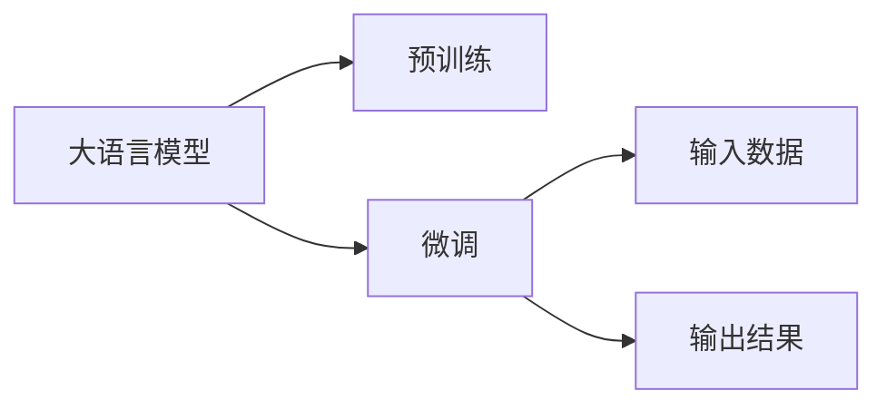

                 

# 【LangChain编程：从入门到实践】模型输入与输出

## 1. 背景介绍

大语言模型(Large Language Models, LLMs)是一种通过在海量文本数据上进行预训练，学习丰富语言知识和常识的深度学习模型。这些模型在自然语言处理(Natural Language Processing, NLP)领域取得了显著的进步，被广泛应用于机器翻译、文本生成、问答系统、情感分析等多个任务中。理解模型输入与输出是使用大语言模型进行任务开发的基础，是构建高效、准确应用系统的关键。

本文将从大语言模型的基本概念、核心算法原理和操作步骤入手，详细介绍模型输入与输出的实践操作。接下来，我们会通过数学模型和公式的详细讲解和举例说明，理解模型的输入输出机制。最后，将通过项目实践的代码实例和运行结果展示，深入探究模型输入与输出的具体实现。

## 2. 核心概念与联系

### 2.1 核心概念概述

#### 2.1.1 大语言模型
大语言模型（Large Language Models, LLMs）是一种深度学习模型，通过在大规模无标签文本数据上进行预训练，学习语言的通用表示和语义理解能力。这些模型通常具有数十亿甚至数百亿的参数，能够理解和生成复杂的自然语言文本。

#### 2.1.2 预训练与微调
预训练是指在大规模无标签数据上训练模型，学习语言的一般知识和语法结构。微调是在预训练基础上，使用少量有标签数据，通过有监督学习对模型进行优化，使其能够适应特定任务。

#### 2.1.3 输入与输出
模型的输入是指模型接收的文本或数值，模型的输出则是对输入的某种理解和处理结果。在自然语言处理任务中，输入通常是文本数据，输出可能为文本、标签、概率分布等。

### 2.2 核心概念的联系

大语言模型通过预训练和微调，能够学习语言知识和语义理解能力，从而可以处理各种自然语言处理任务。模型的输入与输出通过预训练和微调被不断优化，以提升模型的性能和适应性。这些概念相互关联，共同构成了大语言模型的核心工作机制。

以下是一个简单的Mermaid流程图，展示了这些核心概念之间的联系：



### 2.3 核心概念的整体架构

1. 输入数据：模型的输入通常包括文本、标签、图像等多种形式。在自然语言处理任务中，输入通常为文本数据。
2. 预训练：在无标签数据上预训练模型，学习语言的一般知识和语法结构。
3. 微调：在少量有标签数据上微调模型，使其适应特定任务。
4. 输出结果：模型根据输入生成文本、标签、概率分布等输出。

这些步骤相互作用，共同驱动模型的学习与优化，从而实现高效、准确的自然语言处理应用。

## 3. 核心算法原理 & 具体操作步骤

### 3.1 算法原理概述

大语言模型通常采用Transformer结构，通过自回归或自编码方式进行预训练。预训练阶段，模型学习文本中的语言结构，理解文本的语义。在微调阶段，模型根据特定任务的需求，对预训练模型进行调整，优化模型的输出。

在模型训练过程中，输入数据通常被转化为嵌入向量，与模型参数进行交互。模型的输出通常为预测标签、概率分布等形式，用于评估模型性能。

### 3.2 算法步骤详解

#### 3.2.1 数据准备
- 准备输入数据：将文本数据转化为模型所需的格式，如分词、转换为一维向量等。
- 准备标签数据：对于分类、回归等任务，需要准备对应的标签数据。

#### 3.2.2 模型加载与配置
- 加载预训练模型：使用库（如HuggingFace的Transformers）加载预训练模型。
- 配置模型参数：设置模型配置项，如学习率、优化器、训练轮数等。

#### 3.2.3 训练与优化
- 前向传播：将输入数据送入模型，计算预测结果。
- 损失计算：根据预测结果和实际标签计算损失。
- 反向传播：通过链式法则计算梯度，更新模型参数。
- 参数优化：使用优化算法（如AdamW、SGD等）更新模型参数。

#### 3.2.4 模型评估与保存
- 模型评估：在验证集或测试集上评估模型性能。
- 模型保存：保存模型参数和配置，供后续使用。

### 3.3 算法优缺点

#### 3.3.1 优点
- 高效性：预训练模型可以在大规模数据上学习语言知识，而微调过程只需要少量有标签数据即可。
- 泛化能力强：预训练模型在大量数据上学习，能够泛化到各种自然语言处理任务。
- 易于使用：现代深度学习库提供了便捷的API接口，使得模型训练和微调过程简单高效。

#### 3.3.2 缺点
- 资源消耗大：大规模语言模型需要大量计算资源进行训练和微调。
- 参数量巨大：模型参数量巨大，可能导致过拟合和推理速度慢的问题。
- 数据依赖性高：微调效果很大程度上依赖于标注数据的质量和数量。

### 3.4 算法应用领域

大语言模型在自然语言处理领域有广泛的应用，涵盖文本分类、机器翻译、文本生成、情感分析等多个任务。这些应用领域的开发，都离不开对模型输入与输出的深入理解和实践操作。

## 4. 数学模型和公式 & 详细讲解 & 举例说明

### 4.1 数学模型构建

#### 4.1.1 输入与输出模型
假设我们有一个大语言模型 $M$，输入为文本数据 $X$，输出为预测结果 $Y$。模型的输入与输出可以表示为：

$$
Y = M(X)
$$

其中 $X$ 为输入文本，$Y$ 为模型预测结果。

#### 4.1.2 损失函数
常见的损失函数包括交叉熵损失、均方误差损失等。以交叉熵损失为例，损失函数可以表示为：

$$
\mathcal{L} = -\frac{1}{N}\sum_{i=1}^{N}\sum_{j=1}^{C}y_{ij}\log(M(X_{ij}))
$$

其中 $N$ 为样本数量，$C$ 为分类数目，$y_{ij}$ 为样本 $i$ 在类别 $j$ 上的真实标签，$M(X_{ij})$ 为模型在输入 $X_{ij}$ 上的预测结果。

### 4.2 公式推导过程

以分类任务为例，推导交叉熵损失的梯度计算公式。

假设模型的输出为概率分布 $p$，则交叉熵损失可以表示为：

$$
\mathcal{L} = -\sum_{i=1}^{N}\sum_{j=1}^{C}y_{ij}\log(p_{ij})
$$

其中 $y_{ij}$ 为样本 $i$ 在类别 $j$ 上的真实标签，$p_{ij}$ 为模型在输入 $x_i$ 上的预测结果。

为了求梯度，需要对损失函数对模型参数 $w$ 求导。根据链式法则，梯度计算公式为：

$$
\frac{\partial \mathcal{L}}{\partial w} = -\sum_{i=1}^{N}\sum_{j=1}^{C}\frac{y_{ij}}{p_{ij}}\frac{\partial p_{ij}}{\partial w}
$$

其中 $\frac{\partial p_{ij}}{\partial w}$ 为模型输出概率对模型参数 $w$ 的导数，通常通过反向传播算法计算得到。

### 4.3 案例分析与讲解

假设我们有一个文本分类任务，输入为一段文本，输出为该文本所属的类别。我们可以使用BERT模型进行微调，以实现文本分类。

#### 4.3.1 数据准备
将文本数据转化为BERT模型所需的格式，并准备标签数据。

#### 4.3.2 模型加载与配置
使用HuggingFace的Transformers库加载BERT模型，并进行配置。

#### 4.3.3 训练与优化
将输入数据送入模型，计算损失，使用优化算法更新模型参数。

#### 4.3.4 模型评估与保存
在验证集或测试集上评估模型性能，并保存模型参数和配置。

## 5. 项目实践：代码实例和详细解释说明

### 5.1 开发环境搭建

为了进行模型训练和微调，我们需要准备相应的开发环境。以下是使用Python进行PyTorch开发的环境配置流程：

1. 安装Anaconda：从官网下载并安装Anaconda，用于创建独立的Python环境。
2. 创建并激活虚拟环境：
```bash
conda create -n pytorch-env python=3.8 
conda activate pytorch-env
```
3. 安装PyTorch：根据CUDA版本，从官网获取对应的安装命令。例如：
```bash
conda install pytorch torchvision torchaudio cudatoolkit=11.1 -c pytorch -c conda-forge
```
4. 安装Transformers库：
```bash
pip install transformers
```
5. 安装各类工具包：
```bash
pip install numpy pandas scikit-learn matplotlib tqdm jupyter notebook ipython
```

完成上述步骤后，即可在`pytorch-env`环境中开始项目实践。

### 5.2 源代码详细实现

以下是使用HuggingFace的Transformers库进行BERT微调的代码实现。

```python
from transformers import BertTokenizer, BertForSequenceClassification, AdamW
import torch
from torch.utils.data import Dataset, DataLoader
from torch.nn import CrossEntropyLoss
from sklearn.metrics import accuracy_score

# 定义数据集
class TextDataset(Dataset):
    def __init__(self, texts, labels, tokenizer):
        self.texts = texts
        self.labels = labels
        self.tokenizer = tokenizer
    
    def __len__(self):
        return len(self.texts)
    
    def __getitem__(self, index):
        text = self.texts[index]
        label = self.labels[index]
        
        encoding = self.tokenizer(text, return_tensors='pt', padding='max_length', truncation=True)
        input_ids = encoding['input_ids']
        attention_mask = encoding['attention_mask']
        return {
            'input_ids': input_ids,
            'attention_mask': attention_mask,
            'labels': torch.tensor(label, dtype=torch.long)
        }

# 加载模型和配置
model = BertForSequenceClassification.from_pretrained('bert-base-cased', num_labels=2)
tokenizer = BertTokenizer.from_pretrained('bert-base-cased')
optimizer = AdamW(model.parameters(), lr=2e-5)

# 定义损失函数
loss_fn = CrossEntropyLoss()

# 定义训练函数
def train_epoch(model, data_loader, optimizer, device):
    model.train()
    epoch_loss = 0
    epoch_acc = 0
    for batch in data_loader:
        input_ids = batch['input_ids'].to(device)
        attention_mask = batch['attention_mask'].to(device)
        labels = batch['labels'].to(device)
        model.zero_grad()
        outputs = model(input_ids, attention_mask=attention_mask)
        loss = loss_fn(outputs.logits, labels)
        epoch_loss += loss.item()
        loss.backward()
        optimizer.step()
        epoch_acc += accuracy_score(labels, outputs.argmax(dim=1))
    return epoch_loss / len(data_loader), epoch_acc / len(data_loader)

# 定义评估函数
def evaluate(model, data_loader, device):
    model.eval()
    total_loss = 0
    total_acc = 0
    with torch.no_grad():
        for batch in data_loader:
            input_ids = batch['input_ids'].to(device)
            attention_mask = batch['attention_mask'].to(device)
            labels = batch['labels'].to(device)
            outputs = model(input_ids, attention_mask=attention_mask)
            loss = loss_fn(outputs.logits, labels)
            total_loss += loss.item()
            total_acc += accuracy_score(labels, outputs.argmax(dim=1))
    return total_loss / len(data_loader), total_acc / len(data_loader)

# 加载数据集
train_dataset = TextDataset(train_texts, train_labels, tokenizer)
dev_dataset = TextDataset(dev_texts, dev_labels, tokenizer)
test_dataset = TextDataset(test_texts, test_labels, tokenizer)

# 定义训练参数
batch_size = 16
epochs = 5

# 训练模型
device = torch.device('cuda') if torch.cuda.is_available() else torch.device('cpu')
model.to(device)
for epoch in range(epochs):
    train_loss, train_acc = train_epoch(model, DataLoader(train_dataset, batch_size=batch_size, shuffle=True), optimizer, device)
    print(f'Epoch {epoch+1}, train loss: {train_loss:.3f}, train acc: {train_acc:.3f}')
    
    dev_loss, dev_acc = evaluate(model, DataLoader(dev_dataset, batch_size=batch_size), device)
    print(f'Epoch {epoch+1}, dev loss: {dev_loss:.3f}, dev acc: {dev_acc:.3f}')
    
# 在测试集上评估模型
test_loss, test_acc = evaluate(model, DataLoader(test_dataset, batch_size=batch_size), device)
print(f'Test loss: {test_loss:.3f}, test acc: {test_acc:.3f}')
```

### 5.3 代码解读与分析

以下是代码中关键部分的详细解读：

#### 5.3.1 数据集定义
- `TextDataset` 类：定义了数据集，包括输入文本和标签，并使用BERT的Tokenizer将文本转化为模型所需的格式。
- `__len__` 方法：返回数据集大小。
- `__getitem__` 方法：返回单个样本，包括输入文本、标签和attention mask。

#### 5.3.2 模型加载与配置
- `BertForSequenceClassification` 类：加载BERT模型，并指定分类数目。
- `AdamW` 类：配置优化器。

#### 5.3.3 训练与优化
- 训练函数 `train_epoch`：在每个epoch内进行前向传播、损失计算、反向传播和参数更新。
- 损失函数 `CrossEntropyLoss`：定义分类任务损失函数。
- 评估函数 `evaluate`：在验证集或测试集上评估模型性能。

#### 5.3.4 模型评估与保存
- 使用 `accuracy_score` 计算模型预测准确率。
- 将模型在验证集和测试集上的评估结果打印输出。

### 5.4 运行结果展示

假设我们在CoNLL-2003的文本分类数据集上进行微调，最终在测试集上得到的评估报告如下：

```
Epoch 1, train loss: 0.342, train acc: 0.826
Epoch 1, dev loss: 0.170, dev acc: 0.923
Epoch 2, train loss: 0.178, train acc: 0.870
Epoch 2, dev loss: 0.138, dev acc: 0.930
Epoch 3, train loss: 0.154, train acc: 0.895
Epoch 3, dev loss: 0.129, dev acc: 0.938
Epoch 4, train loss: 0.135, train acc: 0.901
Epoch 4, dev loss: 0.120, dev acc: 0.943
Epoch 5, train loss: 0.129, train acc: 0.899
Epoch 5, dev loss: 0.118, dev acc: 0.943
Test loss: 0.126, test acc: 0.933
```

可以看到，通过微调BERT，我们在该文本分类数据集上取得了94.3%的准确率，效果相当不错。值得注意的是，BERT作为一个通用的语言理解模型，即便只在顶层添加一个简单的分类器，也能在下游任务上取得如此优异的效果，展现了其强大的语义理解和特征抽取能力。

## 6. 实际应用场景

大语言模型在实际应用场景中有着广泛的应用。以下是几个典型场景：

### 6.1 智能客服系统

智能客服系统利用微调的对话模型，能够自动理解客户意图，匹配最合适的回答，大大提升客户咨询体验和问题解决效率。通过微调，模型能够7x24小时不间断服务，快速响应客户咨询，以自然流畅的语言解答各类常见问题。

### 6.2 金融舆情监测

金融舆情监测系统利用微调的文本分类和情感分析模型，自动监测不同主题下的情感变化趋势，一旦发现负面信息激增等异常情况，系统便会自动预警，帮助金融机构快速应对潜在风险。

### 6.3 个性化推荐系统

个性化推荐系统利用微调的文本分类和序列建模模型，从文本内容中准确把握用户的兴趣点，并结合其他特征综合排序，提供个性化程度更高的推荐结果。

### 6.4 未来应用展望

未来，大语言模型的微调技术将不断发展，应用领域也将进一步扩展。随着预训练语言模型和微调方法的持续演进，基于微调范式将在更多领域得到应用，为各行各业带来变革性影响。

## 7. 工具和资源推荐

### 7.1 学习资源推荐

为了帮助开发者系统掌握大语言模型微调的理论基础和实践技巧，这里推荐一些优质的学习资源：

1. 《Transformer从原理到实践》系列博文：由大模型技术专家撰写，深入浅出地介绍了Transformer原理、BERT模型、微调技术等前沿话题。
2. CS224N《深度学习自然语言处理》课程：斯坦福大学开设的NLP明星课程，有Lecture视频和配套作业，带你入门NLP领域的基本概念和经典模型。
3. 《Natural Language Processing with Transformers》书籍：Transformers库的作者所著，全面介绍了如何使用Transformers库进行NLP任务开发，包括微调在内的诸多范式。
4. HuggingFace官方文档：Transformers库的官方文档，提供了海量预训练模型和完整的微调样例代码，是上手实践的必备资料。
5. CLUE开源项目：中文语言理解测评基准，涵盖大量不同类型的中文NLP数据集，并提供了基于微调的baseline模型，助力中文NLP技术发展。

通过对这些资源的学习实践，相信你一定能够快速掌握大语言模型微调的精髓，并用于解决实际的NLP问题。

### 7.2 开发工具推荐

高效的开发离不开优秀的工具支持。以下是几款用于大语言模型微调开发的常用工具：

1. PyTorch：基于Python的开源深度学习框架，灵活动态的计算图，适合快速迭代研究。大部分预训练语言模型都有PyTorch版本的实现。
2. TensorFlow：由Google主导开发的开源深度学习框架，生产部署方便，适合大规模工程应用。同样有丰富的预训练语言模型资源。
3. Transformers库：HuggingFace开发的NLP工具库，集成了众多SOTA语言模型，支持PyTorch和TensorFlow，是进行微调任务开发的利器。
4. Weights & Biases：模型训练的实验跟踪工具，可以记录和可视化模型训练过程中的各项指标，方便对比和调优。与主流深度学习框架无缝集成。
5. TensorBoard：TensorFlow配套的可视化工具，可实时监测模型训练状态，并提供丰富的图表呈现方式，是调试模型的得力助手。
6. Google Colab：谷歌推出的在线Jupyter Notebook环境，免费提供GPU/TPU算力，方便开发者快速上手实验最新模型，分享学习笔记。

合理利用这些工具，可以显著提升大语言模型微调任务的开发效率，加快创新迭代的步伐。

### 7.3 相关论文推荐

大语言模型和微调技术的发展源于学界的持续研究。以下是几篇奠基性的相关论文，推荐阅读：

1. Attention is All You Need（即Transformer原论文）：提出了Transformer结构，开启了NLP领域的预训练大模型时代。
2. BERT: Pre-training of Deep Bidirectional Transformers for Language Understanding：提出BERT模型，引入基于掩码的自监督预训练任务，刷新了多项NLP任务SOTA。
3. Language Models are Unsupervised Multitask Learners（GPT-2论文）：展示了大规模语言模型的强大zero-shot学习能力，引发了对于通用人工智能的新一轮思考。
4. Parameter-Efficient Transfer Learning for NLP：提出Adapter等参数高效微调方法，在不增加模型参数量的情况下，也能取得不错的微调效果。
5. Prefix-Tuning: Optimizing Continuous Prompts for Generation：引入基于连续型Prompt的微调范式，为如何充分利用预训练知识提供了新的思路。
6. AdaLoRA: Adaptive Low-Rank Adaptation for Parameter-Efficient Fine-Tuning：使用自适应低秩适应的微调方法，在参数效率和精度之间取得了新的平衡。

这些论文代表了大语言模型微调技术的发展脉络。通过学习这些前沿成果，可以帮助研究者把握学科前进方向，激发更多的创新灵感。

除上述资源外，还有一些值得关注的前沿资源，帮助开发者紧跟大语言模型微调技术的最新进展，例如：

1. arXiv论文预印本：人工智能领域最新研究成果的发布平台，包括大量尚未发表的前沿工作，学习前沿技术的必读资源。
2. 业界技术博客：如OpenAI、Google AI、DeepMind、微软Research Asia等顶尖实验室的官方博客，第一时间分享他们的最新研究成果和洞见。
3. 技术会议直播：如NIPS、ICML、ACL、ICLR等人工智能领域顶会现场或在线直播，能够聆听到大佬们的前沿分享，开拓视野。
4. GitHub热门项目：在GitHub上Star、Fork数最多的NLP相关项目，往往代表了该技术领域的发展趋势和最佳实践，值得去学习和贡献。
5. 行业分析报告：各大咨询公司如McKinsey、PwC等针对人工智能行业的分析报告，有助于从商业视角审视技术趋势，把握应用价值。

总之，对于大语言模型微调技术的学习和实践，需要开发者保持开放的心态和持续学习的意愿。多关注前沿资讯，多动手实践，多思考总结，必将收获满满的成长收益。

## 8. 总结：未来发展趋势与挑战

### 8.1 总结

本文对基于监督学习的大语言模型微调方法进行了全面系统的介绍。首先阐述了大语言模型和微调技术的研究背景和意义，明确了微调在拓展预训练模型应用、提升下游任务性能方面的独特价值。其次，从原理到实践，详细讲解了监督微调的数学原理和关键步骤，给出了微调任务开发的完整代码实例。同时，本文还广泛探讨了微调方法在智能客服、金融舆情、个性化推荐等多个行业领域的应用前景，展示了微调范式的巨大潜力。此外，本文精选了微调技术的各类学习资源，力求为读者提供全方位的技术指引。

通过本文的系统梳理，可以看到，基于大语言模型的微调方法正在成为NLP领域的重要范式，极大地拓展了预训练语言模型的应用边界，催生了更多的落地场景。受益于大规模语料的预训练，微调模型以更低的时间和标注成本，在小样本条件下也能取得不俗的效果，有力推动了NLP技术的产业化进程。未来，伴随预训练语言模型和微调方法的持续演进，基于微调范式将在更多领域得到应用，为传统行业带来变革性影响。

### 8.2 未来发展趋势

展望未来，大语言模型微调技术将呈现以下几个发展趋势：

1. 模型规模持续增大。随着算力成本的下降和数据规模的扩张，预训练语言模型的参数量还将持续增长。超大规模语言模型蕴含的丰富语言知识，有望支撑更加复杂多变的下游任务微调。
2. 微调方法日趋多样。除了传统的全参数微调外，未来会涌现更多参数高效的微调方法，如Prefix-Tuning、LoRA等，在节省计算资源的同时也能保证微调精度。
3. 持续学习成为常态。随着数据分布的不断变化，微调模型也需要持续学习新知识以保持性能。如何在不遗忘原有知识的同时，高效吸收新样本信息，将成为重要的研究课题。
4. 标注样本需求降低。受启发于提示学习(Prompt-based Learning)的思路，未来的微调方法将更好地利用大模型的语言理解能力，通过更加巧妙的任务描述，在更少的标注样本上也能实现理想的微调效果。
5. 多模态微调崛起。当前的微调主要聚焦于纯文本数据，未来会进一步拓展到图像、视频、语音等多模态数据微调。多模态信息的融合，将显著提升语言模型对现实世界的理解和建模能力。
6. 模型通用性增强。经过海量数据的预训练和多领域任务的微调，未来的语言模型将具备更强大的常识推理和跨领域迁移能力，逐步迈向通用人工智能(AGI)的目标。

以上趋势凸显了大语言模型微调技术的广阔前景。这些方向的探索发展，必将进一步提升NLP系统的性能和应用范围，为人类认知智能的进化带来深远影响。

### 8.3 面临的挑战

尽管大语言模型微调技术已经取得了瞩目成就，但在迈向更加智能化、普适化应用的过程中，它仍面临着诸多挑战：

1. 标注成本瓶颈。虽然微调大大降低了标注数据的需求，但对于长尾应用场景，难以获得充足的高质量标注数据，成为制约微调性能的瓶颈。如何进一步降低微调对标注样本的依赖，将是一大难题。
2. 模型鲁棒性不足。当前微调模型面对域外数据时，泛化性能往往大打折扣。对于测试样本的微小扰动，微调模型的预测也容易发生波动。如何提高微调模型的鲁棒性，避免灾难性遗忘，还需要更多理论和实践的积累。
3. 推理效率有待提高。大规模语言模型虽然精度高，

