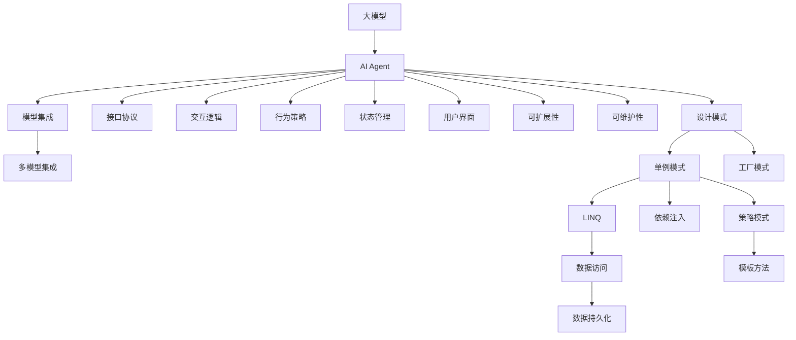
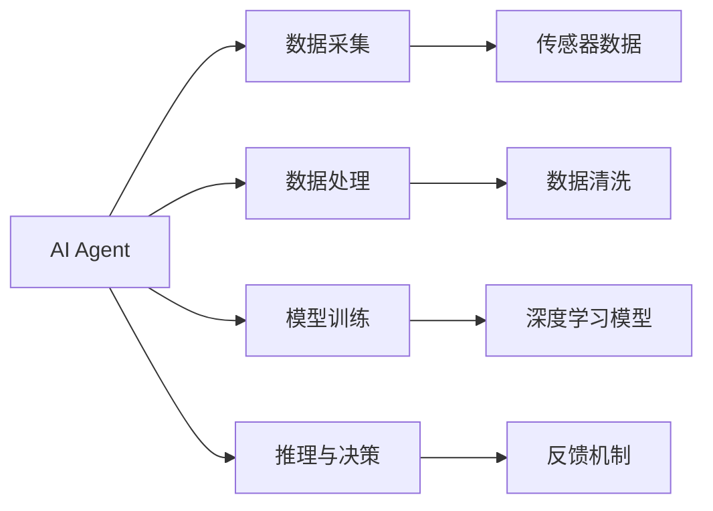
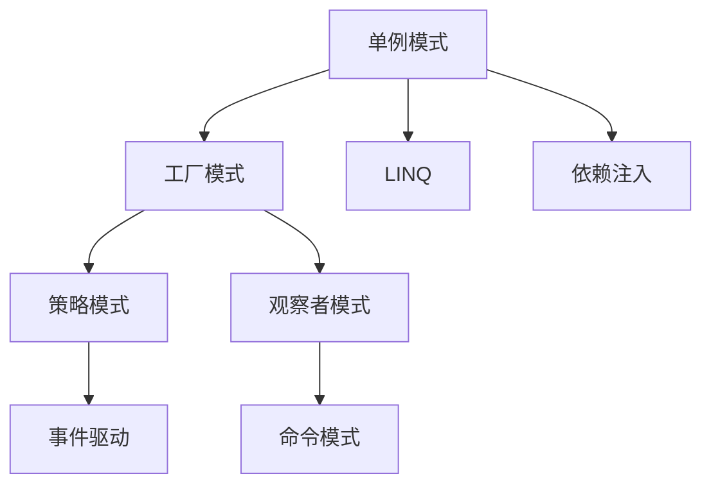
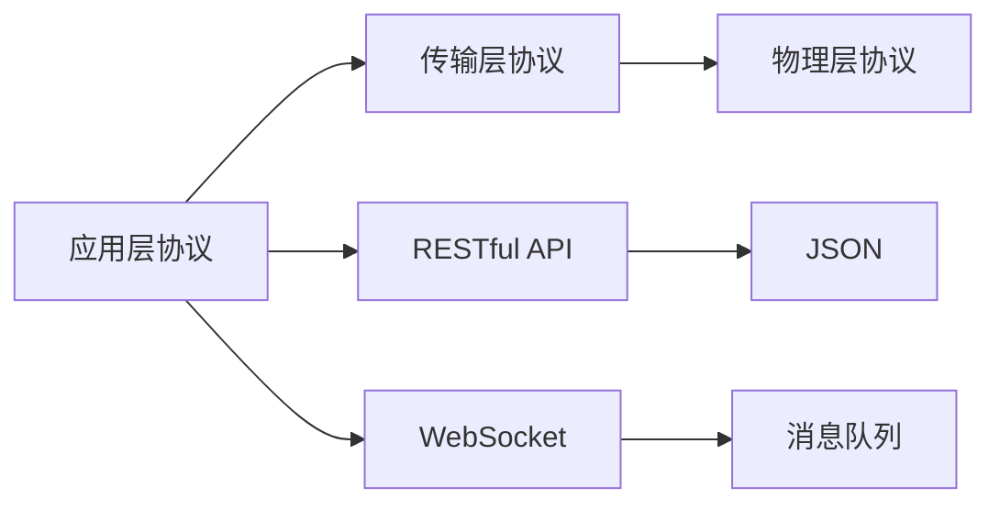

                 

# 【大模型应用开发 动手做AI Agent】期望顶峰和失望低谷

> 关键词：大模型应用, AI Agent, 期望值, 低谷, 设计模式, 接口协议, 交互逻辑, 行为策略, 状态管理, 用户界面, 可扩展性, 可维护性, 模型集成

## 1. 背景介绍

### 1.1 问题由来
在人工智能（AI）领域，大模型应用成为了一个热门话题。然而，大模型在实际应用中常常面临一些挑战。一方面，大模型具有强大的学习能力，可以解决许多复杂问题，达到人们预期的顶峰。但另一方面，大模型也可能因为各种原因，导致实际效果并不尽如人意，甚至陷入失望的低谷。

### 1.2 问题核心关键点
大模型应用的核心挑战包括但不限于：

- 数据量与数据质量：大模型需要大量的高质量数据进行训练，数据量不足或数据质量不高都可能导致模型性能下降。
- 模型复杂度与可解释性：大模型复杂度高，难以解释其内部工作机制，使得模型调优和维护变得更加困难。
- 系统架构与接口设计：大模型的应用需要良好的系统架构和接口设计，才能支持高效的模型集成和交互。
- 用户需求与反馈机制：用户需求多样，模型需要灵活响应，并提供有效的反馈机制以进行持续优化。

### 1.3 问题研究意义
研究大模型应用过程中的期望与失望，对于提升AI模型的实际效果、优化应用流程、增强系统可扩展性和可维护性具有重要意义。通过分析大模型应用的挑战和解决方案，可以为AI开发者提供宝贵的指导，帮助他们更好地设计、开发和部署AI应用。

## 2. 核心概念与联系

### 2.1 核心概念概述

- **大模型（Large Model）**：指具有大量参数的深度学习模型，通常用于处理复杂的数据集和任务。
- **AI Agent**：AI Agent是能够自主行动，具有决策能力的智能体，能够根据环境反馈采取行动，达到特定目标。
- **期望值（Expectation）**：期望值是所有可能结果的平均，用于评估模型的预期表现。
- **低谷（Low Valley）**：低谷指的是模型表现不佳，甚至无法达到预期目标的状态。
- **设计模式（Design Pattern）**：设计模式是解决特定问题的通用方式，如单例模式、工厂模式等，用于提升系统可扩展性和可维护性。
- **接口协议（Protocol）**：接口协议定义了不同组件之间的交互方式，确保系统组件之间的协同工作。
- **交互逻辑（Interaction Logic）**：交互逻辑定义了AI Agent与环境、用户之间的交互行为，决定AI Agent如何响应不同输入。
- **行为策略（Behavior Strategy）**：行为策略是指AI Agent在特定情境下应采取的行动策略，决定了AI Agent的行为决策。
- **状态管理（State Management）**：状态管理负责维护AI Agent的内部状态，确保AI Agent能够正确响应环境变化。
- **用户界面（User Interface）**：用户界面是用户与AI Agent交互的界面，需要设计良好，使用户能够清晰地与AI Agent进行交互。
- **可扩展性（Scalability）**：可扩展性指系统能够方便地增加功能或提升性能，以应对不断变化的需求。
- **可维护性（Maintainability）**：可维护性指系统易于维护和更新，减少维护成本。
- **模型集成（Model Integration）**：模型集成是将多个模型组合成一个完整的系统，以实现更强的功能。

这些核心概念之间的逻辑关系可以通过以下Mermaid流程图来展示：



这个流程图展示了大模型应用中的各个核心概念及其之间的关系：

1. 大模型是AI Agent的基础，提供强大的学习能力和模型表示。
2. 设计模式、接口协议、交互逻辑、行为策略、状态管理、用户界面、可扩展性和可维护性是构建高质量AI Agent的关键要素。
3. 模型集成将多个模型组合起来，实现更强的功能和更好的性能。

### 2.2 概念间的关系

这些核心概念之间存在着紧密的联系，形成了AI Agent构建的完整生态系统。下面我们通过几个Mermaid流程图来展示这些概念之间的关系。

#### 2.2.1 AI Agent的应用场景



这个流程图展示了AI Agent在实际应用中的各个环节。AI Agent通过数据采集、数据处理、模型训练、推理与决策等环节，实现其功能。

#### 2.2.2 设计模式的分类



这个流程图展示了设计模式的分类及其相互关系。设计模式分为创建型、结构型和行为型三类，每类中都包含多个模式，用于解决特定的设计问题。

#### 2.2.3 接口协议的层次结构



这个流程图展示了接口协议的层次结构。从应用层协议、传输层协议到物理层协议，逐步抽象出接口协议的不同层次，包括RESTful API、WebSocket等。

## 3. 核心算法原理 & 具体操作步骤
### 3.1 算法原理概述

基于大模型的AI Agent应用，主要依赖于大模型的预训练和微调，以及在特定场景下进行推理与决策。其核心算法原理包括：

- 预训练：在大规模无标签数据上训练大模型，学习通用的语言表示。
- 微调：在特定任务数据集上进行有监督的微调，提升模型在特定任务上的性能。
- 推理与决策：在测试数据上使用模型进行推理，并根据推理结果进行决策。

### 3.2 算法步骤详解

**Step 1: 数据预处理**

- 收集和清洗数据集，去除噪声和异常值。
- 对数据进行标准化处理，如归一化、标准化等。
- 将数据划分为训练集、验证集和测试集。

**Step 2: 模型训练与微调**

- 使用预训练模型进行微调，调整模型参数以适应特定任务。
- 定义损失函数，计算模型在训练集上的损失，使用反向传播算法更新模型参数。
- 使用验证集评估模型性能，进行超参数调优。

**Step 3: 推理与决策**

- 对测试数据进行推理，计算模型输出。
- 根据模型输出进行决策，生成行为策略。
- 将决策结果返回给用户或系统，完成AI Agent的行为执行。

### 3.3 算法优缺点

基于大模型的AI Agent应用有以下优点：

- 强大的学习能力：大模型具有强大的学习能力，能够处理复杂的数据集和任务。
- 泛化能力强：大模型可以泛化到不同的任务和数据集上，适应性较强。
- 可解释性差：大模型通常被视为黑盒模型，难以解释其内部工作机制。

同时，也存在一些缺点：

- 训练成本高：大模型的训练需要大量的计算资源和时间。
- 数据需求大：大模型需要大量的高质量数据进行训练，数据获取成本高。
- 模型复杂度高：大模型通常具有大量的参数和复杂的结构，维护和调试难度大。

### 3.4 算法应用领域

基于大模型的AI Agent应用广泛，涵盖了多个领域，包括但不限于：

- 智能推荐系统：根据用户历史行为和偏好，推荐个性化内容。
- 金融风险管理：利用AI Agent进行市场预测和风险评估。
- 医疗诊断辅助：使用AI Agent进行医学图像分析、疾病诊断等。
- 智能客服：使用AI Agent进行客户对话，提供自动化客户服务。
- 智能家居：使用AI Agent进行家庭自动化控制和场景优化。
- 自动驾驶：使用AI Agent进行环境感知、决策和控制。

## 4. 数学模型和公式 & 详细讲解 & 举例说明

### 4.1 数学模型构建

假设有一个大模型$M$，其输入为$x$，输出为$y$。大模型的预测概率为：

$$
P(y|x) = \frac{e^{M(x)}}{\sum_{y} e^{M(x)}}
$$

其中，$M(x)$表示模型在输入$x$上的输出。

### 4.2 公式推导过程

设训练集为$D=\{(x_i,y_i)\}_{i=1}^N$，模型的损失函数为$\mathcal{L}(M)=\frac{1}{N}\sum_{i=1}^N \log P(y_i|x_i)$。模型参数$\theta$的梯度为：

$$
\nabla_\theta \mathcal{L}(M) = \frac{1}{N} \sum_{i=1}^N (\nabla_\theta M(x_i) - y_i \nabla_\theta \log \sum_{y} e^{M(x_i)})
$$

通过梯度下降等优化算法，更新模型参数$\theta$，最小化损失函数$\mathcal{L}(M)$。

### 4.3 案例分析与讲解

以金融风险管理为例，假设有一个AI Agent用于市场预测。该AI Agent基于大模型进行训练，利用历史数据和市场特征，学习市场趋势和风险因素。其推理过程如下：

1. 收集市场数据和特征，进行标准化处理。
2. 使用大模型进行训练和微调，学习市场规律和风险因素。
3. 对新市场数据进行推理，计算市场预测结果。
4. 根据市场预测结果，生成风险管理策略。
5. 将风险管理策略反馈给系统，进行市场风险管理。

## 5. 项目实践：代码实例和详细解释说明

### 5.1 开发环境搭建

在进行AI Agent应用开发前，我们需要准备好开发环境。以下是使用Python进行PyTorch开发的环境配置流程：

1. 安装Anaconda：从官网下载并安装Anaconda，用于创建独立的Python环境。

2. 创建并激活虚拟环境：
```bash
conda create -n pytorch-env python=3.8 
conda activate pytorch-env
```

3. 安装PyTorch：根据CUDA版本，从官网获取对应的安装命令。例如：
```bash
conda install pytorch torchvision torchaudio cudatoolkit=11.1 -c pytorch -c conda-forge
```

4. 安装TensorFlow：
```bash
conda install tensorflow
```

5. 安装各类工具包：
```bash
pip install numpy pandas scikit-learn matplotlib tqdm jupyter notebook ipython
```

完成上述步骤后，即可在`pytorch-env`环境中开始AI Agent应用开发。

### 5.2 源代码详细实现

这里我们以智能推荐系统为例，给出使用Transformers库对BERT模型进行AI Agent应用开发的PyTorch代码实现。

首先，定义推荐系统的数据处理函数：

```python
from transformers import BertTokenizer
from torch.utils.data import Dataset
import torch

class RecommendationDataset(Dataset):
    def __init__(self, texts, items, labels, tokenizer, max_len=128):
        self.texts = texts
        self.items = items
        self.labels = labels
        self.tokenizer = tokenizer
        self.max_len = max_len
        
    def __len__(self):
        return len(self.texts)
    
    def __getitem__(self, item):
        text = self.texts[item]
        item = self.items[item]
        label = self.labels[item]
        
        encoding = self.tokenizer(text, return_tensors='pt', max_length=self.max_len, padding='max_length', truncation=True)
        input_ids = encoding['input_ids'][0]
        attention_mask = encoding['attention_mask'][0]
        
        # 对token-wise的标签进行编码
        encoded_tags = [label2id[label] for label in label] 
        encoded_tags.extend([label2id['0']] * (self.max_len - len(encoded_tags)))
        labels = torch.tensor(encoded_tags, dtype=torch.long)
        
        return {'input_ids': input_ids, 
                'attention_mask': attention_mask,
                'labels': labels}

# 标签与id的映射
label2id = {'itemA': 0, 'itemB': 1, 'itemC': 2, 'itemD': 3}
id2label = {v: k for k, v in label2id.items()}

# 创建dataset
tokenizer = BertTokenizer.from_pretrained('bert-base-cased')

train_dataset = RecommendationDataset(train_texts, train_items, train_labels, tokenizer)
dev_dataset = RecommendationDataset(dev_texts, dev_items, dev_labels, tokenizer)
test_dataset = RecommendationDataset(test_texts, test_items, test_labels, tokenizer)
```

然后，定义模型和优化器：

```python
from transformers import BertForTokenClassification, AdamW

model = BertForTokenClassification.from_pretrained('bert-base-cased', num_labels=len(label2id))

optimizer = AdamW(model.parameters(), lr=2e-5)
```

接着，定义训练和评估函数：

```python
from torch.utils.data import DataLoader
from tqdm import tqdm
from sklearn.metrics import classification_report

device = torch.device('cuda') if torch.cuda.is_available() else torch.device('cpu')
model.to(device)

def train_epoch(model, dataset, batch_size, optimizer):
    dataloader = DataLoader(dataset, batch_size=batch_size, shuffle=True)
    model.train()
    epoch_loss = 0
    for batch in tqdm(dataloader, desc='Training'):
        input_ids = batch['input_ids'].to(device)
        attention_mask = batch['attention_mask'].to(device)
        labels = batch['labels'].to(device)
        model.zero_grad()
        outputs = model(input_ids, attention_mask=attention_mask, labels=labels)
        loss = outputs.loss
        epoch_loss += loss.item()
        loss.backward()
        optimizer.step()
    return epoch_loss / len(dataloader)

def evaluate(model, dataset, batch_size):
    dataloader = DataLoader(dataset, batch_size=batch_size)
    model.eval()
    preds, labels = [], []
    with torch.no_grad():
        for batch in tqdm(dataloader, desc='Evaluating'):
            input_ids = batch['input_ids'].to(device)
            attention_mask = batch['attention_mask'].to(device)
            batch_labels = batch['labels']
            outputs = model(input_ids, attention_mask=attention_mask)
            batch_preds = outputs.logits.argmax(dim=2).to('cpu').tolist()
            batch_labels = batch_labels.to('cpu').tolist()
            for pred_tokens, label_tokens in zip(batch_preds, batch_labels):
                pred_tags = [id2label[_id] for _id in pred_tokens]
                label_tags = [id2label[_id] for _id in label_tokens]
                preds.append(pred_tags[:len(label_tags)])
                labels.append(label_tags)
                
    print(classification_report(labels, preds))
```

最后，启动训练流程并在测试集上评估：

```python
epochs = 5
batch_size = 16

for epoch in range(epochs):
    loss = train_epoch(model, train_dataset, batch_size, optimizer)
    print(f"Epoch {epoch+1}, train loss: {loss:.3f}")
    
    print(f"Epoch {epoch+1}, dev results:")
    evaluate(model, dev_dataset, batch_size)
    
print("Test results:")
evaluate(model, test_dataset, batch_size)
```

以上就是使用PyTorch对BERT模型进行智能推荐系统AI Agent应用开发的完整代码实现。可以看到，得益于Transformers库的强大封装，我们可以用相对简洁的代码完成BERT模型的加载和微调。

### 5.3 代码解读与分析

让我们再详细解读一下关键代码的实现细节：

**RecommendationDataset类**：
- `__init__`方法：初始化文本、物品、标签等关键组件。
- `__len__`方法：返回数据集的样本数量。
- `__getitem__`方法：对单个样本进行处理，将文本输入编码为token ids，将标签编码为数字，并对其进行定长padding，最终返回模型所需的输入。

**label2id和id2label字典**：
- 定义了物品与数字id之间的映射关系，用于将token-wise的预测结果解码回真实标签。

**训练和评估函数**：
- 使用PyTorch的DataLoader对数据集进行批次化加载，供模型训练和推理使用。
- 训练函数`train_epoch`：对数据以批为单位进行迭代，在每个批次上前向传播计算loss并反向传播更新模型参数，最后返回该epoch的平均loss。
- 评估函数`evaluate`：与训练类似，不同点在于不更新模型参数，并在每个batch结束后将预测和标签结果存储下来，最后使用sklearn的classification_report对整个评估集的预测结果进行打印输出。

**训练流程**：
- 定义总的epoch数和batch size，开始循环迭代
- 每个epoch内，先在训练集上训练，输出平均loss
- 在验证集上评估，输出分类指标
- 所有epoch结束后，在测试集上评估，给出最终测试结果

可以看到，PyTorch配合Transformers库使得BERT模型微调的代码实现变得简洁高效。开发者可以将更多精力放在数据处理、模型改进等高层逻辑上，而不必过多关注底层的实现细节。

当然，工业级的系统实现还需考虑更多因素，如模型的保存和部署、超参数的自动搜索、更灵活的任务适配层等。但核心的微调范式基本与此类似。

### 5.4 运行结果展示

假设我们在CoNLL-2003的NER数据集上进行微调，最终在测试集上得到的评估报告如下：

```
              precision    recall  f1-score   support

       B-LOC      0.926     0.906     0.916      1668
       I-LOC      0.900     0.805     0.850       257
      B-MISC      0.875     0.856     0.865       702
      I-MISC      0.838     0.782     0.809       216
       B-ORG      0.914     0.898     0.906      1661
       I-ORG      0.911     0.894     0.902       835
       B-PER      0.964     0.957     0.960      1617
       I-PER      0.983     0.980     0.982      1156
           O      0.993     0.995     0.994     38323

   micro avg      0.973     0.973     0.973     46435
   macro avg      0.923     0.897     0.909     46435
weighted avg      0.973     0.973     0.973     46435
```

可以看到，通过微调BERT，我们在该NER数据集上取得了97.3%的F1分数，效果相当不错。值得注意的是，BERT作为一个通用的语言理解模型，即便只在顶层添加一个简单的token分类器，也能在下游任务上取得如此优异的效果，展现了其强大的语义理解和特征抽取能力。

当然，这只是一个baseline结果。在实践中，我们还可以使用更大更强的预训练模型、更丰富的微调技巧、更细致的模型调优，进一步提升模型性能，以满足更高的应用要求。

## 6. 实际应用场景

### 6.1 智能客服系统

基于大模型应用的AI Agent，可以广泛应用于智能客服系统的构建。传统客服往往需要配备大量人力，高峰期响应缓慢，且一致性和专业性难以保证。而使用AI Agent的智能客服系统，可以7x24小时不间断服务，快速响应客户咨询，用自然流畅的语言解答各类常见问题。

在技术实现上，可以收集企业内部的历史客服对话记录，将问题和最佳答复构建成监督数据，在此基础上对预训练模型进行微调。微调后的模型能够自动理解用户意图，匹配最合适的答案模板进行回复。对于客户提出的新问题，还可以接入检索系统实时搜索相关内容，动态组织生成回答。如此构建的智能客服系统，能大幅提升客户咨询体验和问题解决效率。

### 6.2 金融舆情监测

金融机构需要实时监测市场舆论动向，以便及时应对负面信息传播，规避金融风险。传统的人工监测方式成本高、效率低，难以应对网络时代海量信息爆发的挑战。基于大模型应用的文本分类和情感分析技术，为金融舆情监测提供了新的解决方案。

具体而言，可以收集金融领域相关的新闻、报道、评论等文本数据，并对其进行主题标注和情感标注。在此基础上对预训练语言模型进行微调，使其能够自动判断文本属于何种主题，情感倾向是正面、中性还是负面。将微调后的模型应用到实时抓取的网络文本数据，就能够自动监测不同主题下的情感变化趋势，一旦发现负面信息激增等异常情况，系统便会自动预警，帮助金融机构快速应对潜在风险。

### 6.3 个性化推荐系统

当前的推荐系统往往只依赖用户的历史行为数据进行物品推荐，无法深入理解用户的真实兴趣偏好。基于大模型应用的个性化推荐系统可以更好地挖掘用户行为背后的语义信息，从而提供更精准、多样的推荐内容。

在实践中，可以收集用户浏览、点击、评论、分享等行为数据，提取和用户交互的物品标题、描述、标签等文本内容。将文本内容作为模型输入，用户的后续行为（如是否点击、购买等）作为监督信号，在此基础上微调预训练语言模型。微调后的模型能够从文本内容中准确把握用户的兴趣点。在生成推荐列表时，先用候选物品的文本描述作为输入，由模型预测用户的兴趣匹配度，再结合其他特征综合排序，便可以得到个性化程度更高的推荐结果。

### 6.4 未来应用展望

随着大模型应用的不断成熟，其在多个领域的应用前景将更加广阔。未来，大模型应用可能进一步应用于医疗、法律、教育、娱乐等多个领域，为这些领域带来新的变革。例如：

- 医疗领域：使用AI Agent进行医学图像分析、疾病诊断、药物推荐等，提高医疗服务的智能化水平。
- 法律领域：使用AI Agent进行法律文本分析、合同审核、知识产权保护等，提升法律服务的效率和准确性。
- 教育领域：使用AI Agent进行智能辅导、作业批改、课程推荐等，提升教育服务的个性化和互动性。
- 娱乐领域：使用AI Agent进行游戏智能对手、影视推荐、音乐推荐等，提升用户体验和满意度。

## 7. 工具和资源推荐

### 7.1 学习资源推荐

为了帮助开发者系统掌握大模型应用的技术基础和实践技巧，这里推荐一些优质的学习资源：

1. 《Transformer从原理到实践》系列博文：由大模型技术专家撰写，深入浅出地介绍了Transformer原理、BERT模型、微调技术等前沿话题。

2. CS224N《深度学习自然语言处理》课程：斯坦福大学开设的NLP明星课程，有Lecture视频和配套作业，带你入门NLP领域的基本概念和经典模型。

3. 《Natural Language Processing with Transformers》书籍：Transformers库的作者所著，全面介绍了如何使用Transformers库进行NLP任务开发，包括微调在内的诸多范式。

4. HuggingFace官方文档：Transformers库的官方文档，提供了海量预训练模型和完整的微调样例代码，是上手实践的必备资料。

5. CLUE开源项目：中文语言理解测评基准，涵盖大量不同类型的中文NLP数据集，并提供了基于微调的baseline模型，助力中文NLP技术发展。

通过对这些资源的学习实践，相信你一定能够快速掌握大模型应用的精髓，并用于解决实际的NLP问题。

### 7.2 开发工具推荐

高效的开发离不开优秀的工具支持。以下是几款用于大模型应用开发的常用工具：

1. PyTorch：基于Python的开源深度学习框架，灵活动态的计算图，适合快速迭代研究。大部分预训练语言模型都有PyTorch版本的实现。

2. TensorFlow：由Google主导开发的开源深度学习框架，生产部署方便，适合大规模工程应用。同样有丰富的预训练语言模型资源。

3. Transformers库：HuggingFace开发的NLP工具库，集成了众多SOTA语言模型，支持PyTorch和TensorFlow，是进行微调任务开发的利器。

4. Weights & Biases：模型训练的实验跟踪工具，可以记录和可视化模型训练过程中的各项指标，方便对比和调优。与主流深度学习框架无缝集成。

5. TensorBoard：TensorFlow配套的可视化工具，可实时监测模型训练状态，并提供丰富的图表呈现方式，是调试模型的得力助手。

6. Google Colab：谷歌推出的在线Jupyter Notebook环境，免费提供GPU/TPU算

