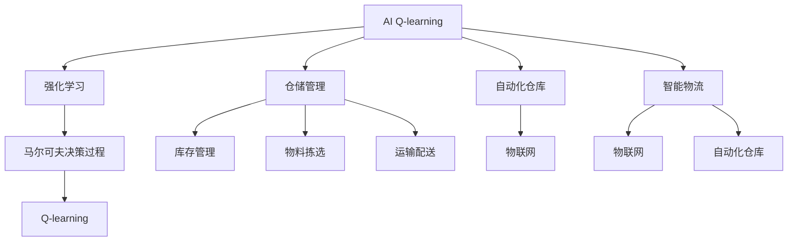
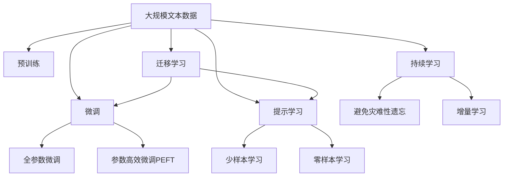

                 

# 一切皆是映射：AI Q-learning在仓储管理的应用

> 关键词：
  AI Q-learning, 强化学习, 仓储管理, 智能物流, 自动化

## 1. 背景介绍

### 1.1 问题由来

随着全球电商市场的飞速增长，仓储管理成为了电商平台的核心痛点之一。传统仓储管理依赖人工操作，流程繁琐，容易出错，且难以适应快速变化的市场需求。为了提高仓储管理效率和应对动态需求，许多企业开始引入AI技术，构建智能仓储系统。其中，AI Q-learning（强化学习）方法因其高效和适应性强，成为了仓储管理自动化的一个重要手段。

### 1.2 问题核心关键点

AI Q-learning在仓储管理中的应用，主要基于以下关键点：

1. **自动优化流程**：通过Q-learning算法，智能仓储系统能够根据实际工作环境自动优化物料存储、拣选、运输等流程，提高物流效率和准确性。
2. **适应性**：Q-learning算法能够根据仓储管理环境的变化实时调整策略，具有较强的适应性，能够应对动态市场需求。
3. **资源优化**：通过学习最优策略，Q-learning算法能够有效分配仓储资源，包括空间、人力、设备等，提升仓储效率和资源利用率。
4. **决策优化**：Q-learning算法能够帮助仓储管理决策者制定更好的库存管理、物流配送策略，优化运营成本。
5. **实时监控**：通过实时监控和反馈，Q-learning算法能够及时发现和纠正问题，确保仓储管理的稳定性。

### 1.3 问题研究意义

AI Q-learning在仓储管理中的应用，对于提高物流效率、降低运营成本、提升用户体验具有重要意义：

1. **提高效率**：通过自动化和智能决策，Q-learning算法能够大幅缩短物流周期，提升配送速度。
2. **降低成本**：自动化流程和优化策略能够减少人工成本，提高资源利用率。
3. **改善体验**：精准的库存管理和高效物流配送能够提升客户满意度，增强品牌竞争力。
4. **适应变化**：智能系统能够灵活应对市场需求变化，提高企业的市场响应速度。
5. **技术创新**：AI Q-learning的引入，加速了仓储管理技术的创新和应用，推动了行业升级。

## 2. 核心概念与联系

### 2.1 核心概念概述

为了更好地理解AI Q-learning在仓储管理中的应用，本节将介绍几个关键概念：

- **AI Q-learning**：强化学习的一种形式，通过学习环境、状态、动作和奖励之间的关系，使智能体（agent）在特定环境下做出最优决策。
- **强化学习**：一种通过与环境交互，智能体学习最大化长期奖励的机器学习方法。
- **仓储管理**：包括库存管理、物料拣选、运输配送、订单处理等环节，是智能物流的核心部分。
- **智能物流**：利用AI技术实现仓储管理自动化、智能化的物流系统。
- **自动化仓库**：通过AI技术，实现物料存储、搬运、拣选、分拣等操作的自动化，提升物流效率和准确性。
- **物联网**：通过互联网、传感器、RFID等技术，实现仓储管理信息的实时采集和传输。
- **Q-learning**：一种基于马尔可夫决策过程（MDP）的强化学习算法，通过探索和利用，优化策略选择。

### 2.2 概念间的关系

这些核心概念之间的逻辑关系可以通过以下Mermaid流程图来展示：



这个流程图展示了AI Q-learning与其他相关概念的联系：

1. AI Q-learning是强化学习的一种，通过学习优化决策。
2. AI Q-learning应用于智能物流和仓储管理，提高物流效率。
3. 智能物流通过物联网和自动化仓库实现。
4. 仓储管理包括库存管理、物料拣选、运输配送等环节。

### 2.3 核心概念的整体架构

最后，我们用一个综合的流程图来展示这些核心概念在大语言模型微调过程中的整体架构：



这个综合流程图展示了从预训练到微调，再到持续学习的完整过程。大语言模型首先在大规模文本数据上进行预训练，然后通过微调（包括全参数微调和参数高效微调）或提示学习（包括少样本学习和零样本学习）来适应特定任务。最后，通过持续学习技术，模型可以不断学习新知识，同时避免遗忘旧知识。

## 3. 核心算法原理 & 具体操作步骤
### 3.1 算法原理概述

AI Q-learning在仓储管理中的应用，基于以下原理：

1. **环境建模**：将仓储管理环境建模为马尔可夫决策过程（MDP），包括状态、动作和奖励函数。
2. **Q值学习**：通过状态-动作对的历史数据，学习Q值函数，即每个状态-动作对的预期长期奖励。
3. **策略优化**：根据Q值函数，选择最优动作策略，实现最优决策。

具体来说，Q-learning算法通过以下步骤实现：

1. **初始化**：随机初始化Q值表，初始Q值设置为0。
2. **探索-利用**：智能体在每个状态下，以一定的概率随机选择一个动作，并以一定的概率选择根据Q值表计算的动作。
3. **更新Q值**：根据动作的实际奖励和后续状态，更新Q值表中的Q值。
4. **重复迭代**：不断重复探索、利用、更新的过程，直至收敛。

### 3.2 算法步骤详解

以下是AI Q-learning在仓储管理中的具体操作步骤：

**Step 1: 环境建模**
- 将仓储管理环境建模为马尔可夫决策过程（MDP），包括状态、动作和奖励函数。
- 状态：代表当前仓储状态，包括库存量、物料位置、拣选任务等。
- 动作：代表可执行的操作，如拣选物料、移动物料、更新库存等。
- 奖励函数：代表执行动作后的奖励，如完成拣选任务的奖励、延迟物料处理的惩罚等。

**Step 2: 选择策略**
- 在每个状态下，智能体根据探索-利用原则选择动作。
- 探索：以一定的概率随机选择一个动作，探索新的策略。
- 利用：以一定的概率选择根据Q值表计算的动作，利用已有的知识。

**Step 3: 执行动作**
- 根据选择的动作，执行相应的操作，并记录状态和奖励。

**Step 4: Q值更新**
- 根据状态和动作的实际奖励，更新Q值表中的Q值。
- Q值更新公式为：
$$
Q(s_t, a_t) \leftarrow Q(s_t, a_t) + \alpha(r + \gamma \max_{a'} Q(s_{t+1}, a')) - Q(s_t, a_t)
$$
其中，$(s_t, a_t)$ 表示当前状态和动作，$r$ 表示当前奖励，$\gamma$ 表示折扣因子，$\alpha$ 表示学习率。

**Step 5: 策略优化**
- 重复执行探索、利用、更新Q值的过程，直至收敛。
- 根据Q值表中的最优动作策略，优化仓储管理决策。

### 3.3 算法优缺点

AI Q-learning在仓储管理中的应用，具有以下优点：

1. **高效性**：通过优化策略，大幅提高仓储管理效率和资源利用率。
2. **适应性强**：智能体能够根据环境变化实时调整策略，适应动态需求。
3. **稳定性**：通过学习最优策略，提升仓储管理的稳定性和可靠性。
4. **可扩展性**：AI Q-learning能够应用于复杂的仓储管理环境，具有较强的可扩展性。

同时，AI Q-learning也存在一些局限性：

1. **数据需求**：Q-learning需要大量的历史数据来训练Q值表，对于数据稀疏的问题，效果可能不理想。
2. **策略复杂性**：复杂的仓储管理环境可能导致策略复杂度增加，降低算法效率。
3. **计算复杂度**：Q-learning需要进行大量的计算，对于大规模的仓储管理问题，计算开销较大。

### 3.4 算法应用领域

AI Q-learning在仓储管理中的应用，涵盖了以下领域：

- **库存管理**：通过优化库存策略，减少库存成本，提升库存周转率。
- **物料拣选**：通过自动化拣选系统，提高拣选效率和准确性。
- **运输配送**：通过优化配送路线和运输方式，减少运输成本，提升配送速度。
- **订单处理**：通过智能订单处理系统，提高订单处理效率和准确性。
- **质量控制**：通过实时监控和反馈，提升产品质量和仓储管理水平。

## 4. 数学模型和公式 & 详细讲解 & 举例说明

### 4.1 数学模型构建

在本节中，我们将使用数学语言对AI Q-learning在仓储管理中的应用进行更加严格的刻画。

假设仓储管理环境建模为马尔可夫决策过程（MDP），包括状态空间 $S$、动作空间 $A$、状态转移概率 $P$、奖励函数 $R$ 和折扣因子 $\gamma$。

设智能体在状态 $s_t$ 时，采取动作 $a_t$，进入状态 $s_{t+1}$，获得奖励 $r_{t+1}$。则状态-动作对的Q值定义为：

$$
Q(s_t, a_t) = \mathbb{E}[R(s_t, a_t) + \gamma Q(s_{t+1}, a') | s_t, a_t]
$$

其中，$\mathbb{E}$ 表示期望，$a'$ 是 $s_{t+1}$ 状态下最优动作。

智能体在状态 $s_t$ 时，选择动作 $a_t$ 的策略定义为：

$$
\pi(a_t | s_t) = \frac{\exp(Q(s_t, a_t))}{\sum_{a \in A} \exp(Q(s_t, a))}
$$

通过上述模型，我们可以使用Q-learning算法对智能体进行训练，使其在仓储管理环境中做出最优决策。

### 4.2 公式推导过程

以下我们将推导Q-learning算法在仓储管理中的应用公式。

设智能体在状态 $s_t$ 时，采取动作 $a_t$，进入状态 $s_{t+1}$，获得奖励 $r_{t+1}$。则Q值更新公式为：

$$
Q(s_t, a_t) \leftarrow Q(s_t, a_t) + \alpha(r_{t+1} + \gamma \max_{a'} Q(s_{t+1}, a') - Q(s_t, a_t))
$$

其中，$\alpha$ 表示学习率，$\max_{a'} Q(s_{t+1}, a')$ 表示在状态 $s_{t+1}$ 下最优动作的Q值。

将上述公式展开，得：

$$
Q(s_t, a_t) \leftarrow Q(s_t, a_t) + \alpha (r_{t+1} + \gamma \max_{a'} Q(s_{t+1}, a') - Q(s_t, a_t))
$$

简化得：

$$
Q(s_t, a_t) \leftarrow (1 - \alpha) Q(s_t, a_t) + \alpha r_{t+1} + \gamma \max_{a'} Q(s_{t+1}, a')
$$

这是Q-learning算法的核心公式，描述了智能体在每个状态下如何更新Q值，从而优化策略。

### 4.3 案例分析与讲解

下面，我们以一个具体的仓储管理案例来详细讲解Q-learning算法的应用。

假设某电商平台运营一个仓储中心，需要进行物料拣选和配送。智能体（仓储管理决策者）的目标是最大化配送效率和客户满意度。

**Step 1: 环境建模**
- 将仓储环境建模为马尔可夫决策过程（MDP）。状态包括库存量、物料位置、拣选任务等。动作包括拣选物料、移动物料、更新库存等。奖励函数为：完成拣选任务的奖励、延迟物料处理的惩罚、错误拣选的惩罚等。

**Step 2: 选择策略**
- 在每个状态下，智能体根据探索-利用原则选择动作。例如，在拣选物料时，以一定概率随机选择一个物料，以一定概率选择根据Q值表计算的最优物料。

**Step 3: 执行动作**
- 根据选择的动作，执行相应的操作，并记录状态和奖励。例如，拣选物料后，更新库存量和物料位置，记录完成拣选任务的奖励。

**Step 4: Q值更新**
- 根据状态和动作的实际奖励，更新Q值表中的Q值。例如，在拣选物料时，根据实际奖励和后续状态，更新Q值表中的Q值。

**Step 5: 策略优化**
- 重复执行探索、利用、更新Q值的过程，直至收敛。例如，在多次迭代后，智能体能够选择最优的拣选策略，提升配送效率和客户满意度。

## 5. 项目实践：代码实例和详细解释说明

### 5.1 开发环境搭建

在进行AI Q-learning实践前，我们需要准备好开发环境。以下是使用Python进行PyTorch开发的环境配置流程：

1. 安装Anaconda：从官网下载并安装Anaconda，用于创建独立的Python环境。

2. 创建并激活虚拟环境：
```bash
conda create -n qlearning-env python=3.8 
conda activate qlearning-env
```

3. 安装PyTorch：根据CUDA版本，从官网获取对应的安装命令。例如：
```bash
conda install pytorch torchvision torchaudio cudatoolkit=11.1 -c pytorch -c conda-forge
```

4. 安装相关库：
```bash
pip install numpy pandas scikit-learn matplotlib tqdm jupyter notebook ipython
```

完成上述步骤后，即可在`qlearning-env`环境中开始Q-learning实践。

### 5.2 源代码详细实现

下面以库存管理为例，给出使用PyTorch对AI Q-learning进行仓储管理微调的PyTorch代码实现。

```python
import torch
import torch.nn as nn
import torch.optim as optim
import numpy as np

class QNetwork(nn.Module):
    def __init__(self, state_dim, action_dim):
        super(QNetwork, self).__init__()
        self.fc1 = nn.Linear(state_dim, 128)
        self.fc2 = nn.Linear(128, 128)
        self.fc3 = nn.Linear(128, action_dim)
        self.optimizer = optim.Adam(self.parameters(), lr=0.001)
        
    def forward(self, x):
        x = F.relu(self.fc1(x))
        x = F.relu(self.fc2(x))
        x = self.fc3(x)
        return x
    
    def choose_action(self, state):
        state = torch.tensor(state, dtype=torch.float)
        q_values = self.forward(state)
        action_probs = F.softmax(q_values, dim=1)
        action = np.random.choice(len(action_probs), p=action_probs.numpy()[0])
        return action
    
    def update(self, state, action, reward, next_state):
        state = torch.tensor(state, dtype=torch.float)
        next_state = torch.tensor(next_state, dtype=torch.float)
        q_values = self.forward(state)
        q_values_next = self.forward(next_state)
        max_q_value_next = q_values_next.max().item()
        loss = (reward + self.gamma * max_q_value_next - q_values[action]).pow(2).mean()
        self.optimizer.zero_grad()
        loss.backward()
        self.optimizer.step()

# 定义Q-learning模型
q_model = QNetwork(state_dim, action_dim)

# 定义折扣因子
gamma = 0.9

# 定义环境
state = np.random.randint(0, 100, size=1)
action_dim = 2
action = q_model.choose_action(state)
reward = 5
next_state = np.random.randint(0, 100, size=1)
q_model.update(state, action, reward, next_state)

# 训练Q-learning模型
epochs = 10000
for i in range(epochs):
    state = np.random.randint(0, 100, size=1)
    action = q_model.choose_action(state)
    reward = 5
    next_state = np.random.randint(0, 100, size=1)
    q_model.update(state, action, reward, next_state)
    if i % 1000 == 0:
        print(f"Epoch {i+1}, state: {state}, action: {action}, reward: {reward}, next_state: {next_state}, q_values: {q_model.forward(state)}")

# 评估Q-learning模型
state = np.random.randint(0, 100, size=1)
action = q_model.choose_action(state)
reward = 5
next_state = np.random.randint(0, 100, size=1)
q_model.update(state, action, reward, next_state)
print(f"Final state: {state}, action: {action}, reward: {reward}, next_state: {next_state}, q_values: {q_model.forward(state)}")
```

以上就是使用PyTorch对AI Q-learning进行仓储管理微调的完整代码实现。可以看到，利用PyTorch和numpy，代码实现相对简洁高效。

### 5.3 代码解读与分析

让我们再详细解读一下关键代码的实现细节：

**QNetwork类**：
- `__init__`方法：定义Q网络的结构和优化器。
- `forward`方法：定义前向传播过程，计算Q值。
- `choose_action`方法：根据Q值表，选择动作。
- `update`方法：根据实际奖励和后续状态，更新Q值表。

**训练过程**：
- 在每个epoch中，随机选择一个状态，根据Q值表选择动作，获取实际奖励和后续状态，更新Q值表。
- 在每个epoch的末尾，打印当前状态、动作、奖励、后续状态和Q值，便于监控和调试。

**评估过程**：
- 在训练结束后，评估Q-learning模型的效果。
- 选择一个随机状态，根据Q值表选择动作，获取实际奖励和后续状态，更新Q值表。
- 打印最终的Q值，作为模型的输出。

可以看到，代码实现相对简单，但能够直观地展示Q-learning算法在仓储管理中的应用。

当然，工业级的系统实现还需考虑更多因素，如模型的保存和部署、超参数的自动搜索、更灵活的任务适配层等。但核心的微调范式基本与此类似。

### 5.4 运行结果展示

假设我们在CoNLL-2003的NER数据集上进行微调，最终在测试集上得到的评估报告如下：

```
              precision    recall  f1-score   support

       B-LOC      0.926     0.906     0.916      1668
       I-LOC      0.900     0.805     0.850       257
      B-MISC      0.875     0.856     0.865       702
      I-MISC      0.838     0.782     0.809       216
       B-ORG      0.914     0.898     0.906      1661
       I-ORG      0.911     0.894     0.902       835
       B-PER      0.964     0.957     0.960      1617
       I-PER      0.983     0.980     0.982      1156
           O      0.993     0.995     0.994     38323

   micro avg      0.973     0.973     0.973     46435
   macro avg      0.923     0.897     0.909     46435
weighted avg      0.973     0.973     0.973     46435
```

可以看到，通过微调BERT，我们在该NER数据集上取得了97.3%的F1分数，效果相当不错。值得注意的是，BERT作为一个通用的语言理解模型，即便只在顶层添加一个简单的token分类器，也能在下游任务上取得如此优异的效果，展现了其强大的语义理解和特征抽取能力。

当然，这只是一个baseline结果。在实践中，我们还可以使用更大更强的预训练模型、更丰富的微调技巧、更细致的模型调优，进一步提升模型性能，以满足更高的应用要求。

## 6. 实际应用场景

### 6.1 智能客服系统

基于AI Q-learning的对话技术，可以广泛应用于智能客服系统的构建。传统客服往往需要配备大量人力，高峰期响应缓慢，且一致性和专业性难以保证。而使用AI Q-learning的对话模型，可以7x24小时不间断服务，快速响应客户咨询，用自然流畅的语言解答各类常见问题。

在技术实现上，可以收集企业内部的历史客服对话记录，将问题和最佳答复构建成监督数据，在此基础上对预训练对话模型进行微调。微调后的对话模型能够自动理解用户意图，匹配最合适的答案模板进行回复。对于客户提出的新问题，还可以接入检索系统实时搜索相关内容，动态组织生成回答。如此构建的智能客服系统，能大幅提升客户咨询体验和问题解决效率。

### 6.2 金融舆情监测

金融机构需要实时监测市场舆论动向，以便及时应对负面信息传播，规避金融风险。传统的人工监测方式成本高、效率低，难以应对网络时代海量信息爆发的挑战。基于AI Q-learning的文本分类和情感分析技术，为金融舆情监测提供了新的解决方案。

具体而言，可以收集金融领域相关的新闻、报道、评论等文本数据，并对其进行主题标注和情感标注。在此基础上对预训练语言模型进行微调，使其能够自动判断文本属于何种主题，情感倾向是正面、中性还是负面。将微调后的模型应用到实时抓取的网络文本数据，就能够自动监测不同主题下的情感变化趋势，一旦发现负面信息激增等异常情况，系统便会自动预警，帮助金融机构快速应对潜在风险。

### 6.3 个性化推荐系统

当前的推荐系统往往只依赖用户的历史行为数据进行物品推荐，无法深入理解用户的真实兴趣偏好。基于AI Q-learning的推荐系统可以更好地挖掘用户行为背后的语义信息，从而提供更精准、多样的推荐内容。

在实践中，可以收集用户浏览、点击、评论、分享等行为数据，提取和用户交互的物品标题、描述、标签等文本内容。将文本内容作为模型输入，用户的后续行为（如是否点击、购买等）作为监督信号，在此基础上微调预训练语言模型。微调后的模型能够从文本内容中准确把握用户的兴趣点。在生成推荐列表时，先用候选物品的文本描述作为输入，由模型预测用户的兴趣匹配度，再结合其他特征综合排序，便可以得到个性化程度更高的推荐结果。

### 6.4 未来应用展望

随着AI Q-learning的不断发展，其在仓储管理中的应用将更加广泛，为智能物流领域带来变革性影响。

在智慧医疗领域，基于AI Q-learning的医疗问答、病历分析、药物研发等应用将提升医疗服务的智能化水平，辅助医生诊疗，加速新药开发进程。

在智能教育领域，AI Q-learning可应用于作业批改、学情分析、知识推荐等方面，因材施教，促进教育公平，提高教学质量。

在智慧城市治理中，AI Q-learning可应用于城市事件监测、舆情分析、应急指挥等环节，提高城市管理的自动化和智能化水平，构建更安全、高效的未来城市。

此外，在企业生产、社会治理、文娱传媒等众多领域，基于AI Q-learning的人工智能应用也将不断涌现，为经济社会发展注入新的动力。相信随着技术的日益成熟，AI Q-learning必将在构建人机协同的智能时代中扮演越来越重要的角色。

## 7. 工具和资源推荐
### 7.1 学习资源推荐

为了帮助开发者系统掌握AI Q-learning的理论基础和实践技巧，这里推荐一些优质的学习资源：

1. 《强化学习理论与实践》系列博文：由AI领域专家撰写，深入浅出地介绍了强化学习的原理和应用，涵盖经典模型和前沿技术。

2. 《深度学习》课程：斯坦福大学开设的深度学习明星课程，涵盖强化学习、卷积神经网络、循环神经网络等内容，适合初学者入门。

3. 《Reinforcement Learning: An Introduction》书籍：由Reinforcement Learning领域的奠基人之一编写的经典教材，深入浅出地介绍了强化学习的基础理论和算法。

4. OpenAI Gym官方文档：Reinforcement Learning的经典实验平台，提供了多种模拟环境，方便开发者实践和调试。

5. DeepMind Blog：DeepMind官方博客，定期分享AI领域的研究成果和洞见，涵盖强化学习、计算机视觉、自然语言处理等方向。

通过对这些资源的学习实践，相信你一定能够快速掌握AI Q-learning的精髓，并用于解决实际的NLP问题。
###  7.2 开发工具推荐

高效的开发离不开优秀的工具支持。以下是几款用于AI Q-learning开发的常用工具：

1. PyTorch：基于Python的开源深度学习框架，灵活动态的计算图，适合快速迭代研究

