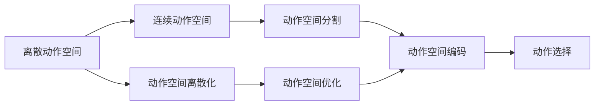
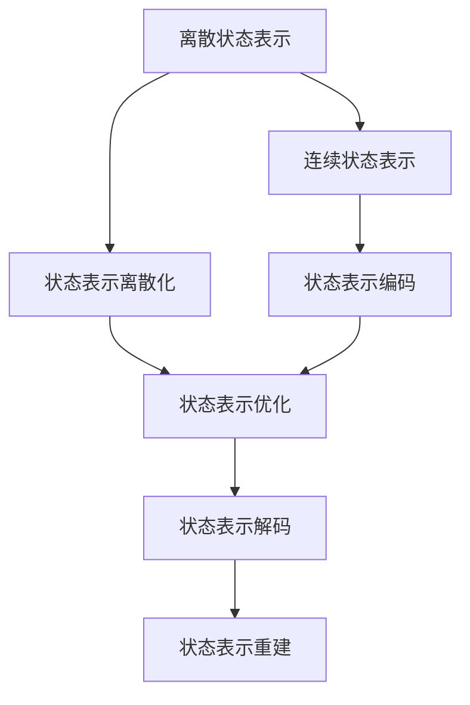

                 

# 一切皆是映射：AI Q-learning知识框架搭建

## 1. 背景介绍

### 1.1 问题由来
Q-learning作为强化学习领域中的经典算法，已经广泛应用于多个领域，包括机器人控制、游戏AI、推荐系统等。然而，在实际应用中，由于状态空间复杂性高、学习效率低等问题的存在，使得Q-learning在大规模实际场景中的应用受到限制。因此，有必要对Q-learning算法进行深入研究和优化，以提升其在大规模系统中的应用能力。

### 1.2 问题核心关键点
Q-learning的核心在于通过不断与环境交互，学习最优策略，使得期望奖励最大化。其核心方程为：

$$
Q(s, a) \leftarrow Q(s, a) + \alpha(r + \gamma \max Q(s',a') - Q(s, a))
$$

其中 $Q(s,a)$ 表示在状态 $s$ 下采取行动 $a$ 的Q值，$\alpha$ 为学习率，$r$ 为即时奖励，$s'$ 为下一个状态，$a'$ 为在 $s'$ 状态下采取的行动，$\gamma$ 为折扣因子。

然而，实际应用中Q-learning往往面临以下问题：
- 状态空间复杂度高，导致学习效率低下。
- 动作空间维度高，增加了计算复杂性。
- 无法直接应用到非离散领域。

### 1.3 问题研究意义
研究Q-learning算法及其优化方法，对于提升其在实际场景中的性能，降低学习复杂度，提高应用效率具有重要意义：

1. 降低学习复杂度。通过合理的优化方法，可以使Q-learning在大规模系统中快速收敛。
2. 提高学习效率。优化后的Q-learning算法可以更加高效地更新Q值，降低资源消耗。
3. 提升应用范围。优化后的Q-learning可以应用于更广泛的领域，如非离散领域、连续动作空间等。
4. 改进效果表现。通过改进算法和模型，Q-learning可以更好地适应不同的应用场景，获得更优的策略。

## 2. 核心概念与联系

### 2.1 核心概念概述

为更好地理解Q-learning及其优化方法，本节将介绍几个密切相关的核心概念：

- Q-learning：强化学习中的经典算法，用于学习最优策略，使得期望奖励最大化。
- 离散动作空间：每个动作只能取离散的固定值，如键盘按键、鼠标点击等。
- 连续动作空间：每个动作可以取连续的任意值，如机器人关节角度、速度等。
- 状态表示：用于描述当前系统的状态，可以是离散的、连续的、混合的。
- 状态转移：根据当前状态和采取的行动，计算下一个状态的概率分布。
- 动作价值函数：表示在状态 $s$ 下采取行动 $a$ 的价值，$Q(s, a)$。

这些核心概念之间存在紧密的联系，构成了Q-learning算法的知识框架。下面我们通过一个Mermaid流程图来展示Q-learning的核心逻辑：

```mermaid
graph TB
    A[当前状态(s)] --> B[采取行动(a)]
    B --> C[获得奖励(r)]
    C --> D[下一个状态(s')]
    D --> E[计算Q值(Q(s,a))]
    A --> E
    A --> F[状态转移概率(P(s'|s,a)]
    E --> F
```

这个流程图展示了Q-learning的基本流程：

1. 从当前状态 $s$ 采取行动 $a$。
2. 获得即时奖励 $r$ 和下一个状态 $s'$。
3. 根据Q值更新公式，计算并更新 $Q(s,a)$ 的值。
4. 根据状态转移概率 $P(s'|s,a)$ 计算下一个状态的概率分布。

### 2.2 概念间的关系

这些核心概念之间存在着紧密的联系，形成了Q-learning算法的整体架构。下面我通过几个Mermaid流程图来展示这些概念之间的关系。

#### 2.2.1 Q-learning的训练流程

```mermaid
graph TB
    A[当前状态(s)] --> B[采取行动(a)]
    B --> C[获得奖励(r)]
    C --> D[下一个状态(s')]
    D --> E[计算Q值(Q(s,a))]
    A --> E
    E --> F[状态转移概率(P(s'|s,a)]
    F --> G[计算期望值]
    G --> H[更新Q值]
    H --> I[返回状态(s')]
```

这个流程图展示了Q-learning训练的基本流程：

1. 从当前状态 $s$ 采取行动 $a$。
2. 获得即时奖励 $r$ 和下一个状态 $s'$。
3. 根据状态转移概率 $P(s'|s,a)$ 计算期望值。
4. 根据Q值更新公式，更新 $Q(s,a)$ 的值。
5. 返回状态 $s$，进入下一轮迭代。

#### 2.2.2 动作空间优化



这个流程图展示了动作空间优化的过程：

1. 从离散动作空间开始。
2. 将动作空间进行离散化。
3. 将连续动作空间进行分割。
4. 对动作空间进行优化。
5. 对动作空间进行编码。
6. 根据编码选择动作。

#### 2.2.3 状态表示优化



这个流程图展示了状态表示优化的过程：

1. 从离散状态表示开始。
2. 将状态表示进行离散化。
3. 将连续状态表示进行编码。
4. 对状态表示进行优化。
5. 对状态表示进行解码。
6. 根据解码重建状态表示。

### 2.3 核心概念的整体架构

最后，我们用一个综合的流程图来展示这些核心概念在Q-learning算法中的整体架构：

```mermaid
graph TB
    A[初始状态(s_0)] --> B[采取行动(a_0)]
    B --> C[获得奖励(r_0)]
    C --> D[下一个状态(s_1)]
    D --> E[计算Q值(Q(s_1,a_0))]
    A --> E
    A --> F[状态转移概率(P(s_1|s_0,a_0)]
    E --> F
    F --> G[计算期望值]
    G --> H[更新Q值]
    H --> I[采取行动(a_1)]
    I --> J[获得奖励(r_1)]
    J --> K[下一个状态(s_2)]
    K --> L[计算Q值(Q(s_2,a_1))]
    H --> L
    A --> L
    A --> M[状态转移概率(P(s_2|s_1,a_1)]
    L --> M
    M --> N[计算期望值]
    N --> O[更新Q值]
    O --> P[采取行动(a_2)]
    P --> Q[获得奖励(r_2)]
    Q --> R[下一个状态(s_3)]
    R --> S[计算Q值(Q(s_3,a_2))]
    O --> S
    A --> S
    A --> T[状态转移概率(P(s_3|s_2,a_2)]
    S --> T
    T --> U[计算期望值]
    U --> V[更新Q值]
    V --> W[采取行动(a_3)]
    W --> X[获得奖励(r_3)]
    X --> Y[下一个状态(s_4)]
    Y --> Z[计算Q值(Q(s_4,a_3))]
    V --> Z
    A --> Z
    A --> A[状态转移概率(P(s_4|s_3,a_3)]
    Z --> A
    A --> B
    B --> C
    C --> D
    D --> E
    E --> F
    F --> G
    G --> H
    H --> I
    I --> J
    J --> K
    K --> L
    L --> M
    M --> N
    N --> O
    O --> P
    P --> Q
    Q --> R
    R --> S
    S --> T
    T --> U
    U --> V
    V --> W
    W --> X
    X --> Y
    Y --> Z
    Z --> A
```

这个综合流程图展示了从初始状态 $s_0$ 到最终状态 $s_4$ 的Q-learning训练过程。Q-learning通过不断与环境交互，更新Q值，学习最优策略。同时，可以通过状态表示优化、动作空间优化等方法，提升算法性能。通过这些流程图，我们可以更清晰地理解Q-learning及其优化方法的逻辑关系和作用，为后续深入讨论具体的优化方法奠定基础。

## 3. 核心算法原理 & 具体操作步骤
### 3.1 算法原理概述

Q-learning算法通过与环境交互，不断更新动作价值函数 $Q(s,a)$，学习最优策略。其核心方程为：

$$
Q(s, a) \leftarrow Q(s, a) + \alpha(r + \gamma \max Q(s',a') - Q(s, a))
$$

其中 $Q(s,a)$ 表示在状态 $s$ 下采取行动 $a$ 的Q值，$\alpha$ 为学习率，$r$ 为即时奖励，$s'$ 为下一个状态，$a'$ 为在 $s'$ 状态下采取的行动，$\gamma$ 为折扣因子。

在实际应用中，为了提升学习效率和性能，通常会引入优化方法，如价值迭代、状态转移方程优化等。此外，还会结合其他算法，如蒙特卡洛方法、蒙特卡洛树搜索等，以提升算法鲁棒性和收敛速度。

### 3.2 算法步骤详解

Q-learning的训练流程如下：

1. 初始化状态 $s_0$ 和动作 $a_0$。
2. 从状态 $s_0$ 采取行动 $a_0$，获得即时奖励 $r_0$ 和下一个状态 $s_1$。
3. 根据状态转移概率 $P(s_1|s_0,a_0)$ 计算 $s_1$ 的概率分布。
4. 根据Q值更新公式，计算 $Q(s_0,a_0)$ 的值。
5. 返回状态 $s_1$，进入下一轮迭代。

这个过程不断重复，直到达到预设的迭代次数或收敛条件。

### 3.3 算法优缺点

Q-learning算法具有以下优点：
1. 简单高效。Q-learning实现简单易懂，适用于多种应用场景。
2. 鲁棒性强。Q-learning能够处理不确定性，适应复杂环境。
3. 计算简单。Q-learning只需要简单的数学运算，易于实现。

同时，Q-learning算法也存在一些缺点：
1. 学习速度慢。Q-learning在大规模系统中学习速度较慢，收敛较慢。
2. 需要状态转移方程。Q-learning需要精确的状态转移方程，否则效果不佳。
3. 需要大量样本。Q-learning需要大量样本数据进行训练，否则易陷入局部最优。

### 3.4 算法应用领域

Q-learning算法已经广泛应用于多个领域，包括：

- 游戏AI：如Atari 2600游戏中的Pong、Space Invaders等，通过Q-learning训练机器人实现智能控制。
- 机器人控制：如RoboCup足球机器人，通过Q-learning训练机器人实现自主导航和避障。
- 推荐系统：如Netflix推荐系统，通过Q-learning训练推荐模型，提升推荐效果。
- 财务交易：如股票交易系统，通过Q-learning训练交易策略，实现自动交易。
- 供应链优化：如订单分配问题，通过Q-learning训练优化模型，提升供应链效率。

这些应用领域展示了Q-learning算法的广泛适用性和高效性能。

## 4. 数学模型和公式 & 详细讲解 & 举例说明

### 4.1 数学模型构建

Q-learning的数学模型构建主要包括以下几个步骤：

1. 定义状态 $s$ 和动作 $a$，以及对应的状态转移概率 $P(s'|s,a)$。
2. 定义即时奖励 $r$ 和折扣因子 $\gamma$。
3. 定义动作价值函数 $Q(s,a)$。
4. 根据Q值更新公式，计算Q值。

以一个简单的游戏AI为例，定义状态 $s$ 为当前游戏状态，动作 $a$ 为采取的行动，如移动、攻击等，即时奖励 $r$ 为采取行动后的奖励值，如得分、生命等，折扣因子 $\gamma$ 为未来奖励的折扣权重。

### 4.2 公式推导过程

Q-learning的Q值更新公式为：

$$
Q(s, a) \leftarrow Q(s, a) + \alpha(r + \gamma \max Q(s',a') - Q(s, a))
$$

其中：
- $Q(s, a)$ 表示在状态 $s$ 下采取行动 $a$ 的Q值。
- $\alpha$ 为学习率。
- $r$ 为即时奖励。
- $s'$ 为下一个状态。
- $a'$ 为在 $s'$ 状态下采取的行动。
- $\gamma$ 为折扣因子。

在实际应用中，通常会将Q值更新公式离散化，具体为：

$$
Q(s, a) \leftarrow Q(s, a) + \alpha(r + \gamma \max_a Q(s',a) - Q(s, a))
$$

### 4.3 案例分析与讲解

以一个简单的游戏AI为例，展示Q-learning的具体实现步骤：

1. 初始化状态 $s_0$ 和动作 $a_0$。
2. 从状态 $s_0$ 采取行动 $a_0$，获得即时奖励 $r_0$ 和下一个状态 $s_1$。
3. 根据状态转移概率 $P(s_1|s_0,a_0)$ 计算 $s_1$ 的概率分布。
4. 根据Q值更新公式，计算 $Q(s_0,a_0)$ 的值。
5. 返回状态 $s_1$，进入下一轮迭代。

重复这个过程，直到达到预设的迭代次数或收敛条件。

## 5. 项目实践：代码实例和详细解释说明
### 5.1 开发环境搭建

在进行Q-learning项目实践前，我们需要准备好开发环境。以下是使用Python进行Q-learning开发的Python环境配置流程：

1. 安装Anaconda：从官网下载并安装Anaconda，用于创建独立的Python环境。

2. 创建并激活虚拟环境：
```bash
conda create -n qlearning-env python=3.8 
conda activate qlearning-env
```

3. 安装相关库：
```bash
pip install numpy matplotlib scipy gym reinforcement-learning
```

4. 下载和安装OpenAI Gym环境：
```bash
pip install gym[atari]
```

完成上述步骤后，即可在`qlearning-env`环境中开始Q-learning实践。

### 5.2 源代码详细实现

以下是一个简单的Q-learning代码实现，用于解决OpenAI Gym环境中的Pong游戏。

```python
import gym
import numpy as np

env = gym.make('Pong-v0')
env.reset()

Q = np.zeros((env.observation_space.n, env.action_space.n))
alpha = 0.1
gamma = 0.9
epsilon = 0.1

for episode in range(1000):
    s = env.reset()
    done = False
    while not done:
        if np.random.rand() < epsilon:
            a = env.action_space.sample()
        else:
            a = np.argmax(Q[s, :])
        s_next, r, done, _ = env.step(a)
        Q[s, a] += alpha * (r + gamma * np.max(Q[s_next, :]) - Q[s, a])
        s = s_next

print("Final Q-values:", Q)
```

### 5.3 代码解读与分析

让我们再详细解读一下关键代码的实现细节：

1. 导入相关库：导入OpenAI Gym、NumPy等库，用于游戏环境构建和数据处理。

2. 创建游戏环境：使用Gym创建Pong游戏环境。

3. 初始化Q值表：定义Q值表的大小，用于存储状态-动作对对应的Q值。

4. 定义学习参数：学习率 $\alpha$、折扣因子 $\gamma$、探索率 $\epsilon$。

5. 进行Q-learning训练：遍历1000轮游戏，每轮游戏从初始状态开始，采取行动，获得即时奖励和下一个状态，更新Q值。

6. 输出最终Q值：训练完成后，输出Q值表。

可以看到，Q-learning的代码实现相对简单，但要注意一些关键细节，如动作选择策略、学习率控制、探索与利用平衡等。

### 5.4 运行结果展示

假设我们在Pong游戏中进行了1000轮训练，最终得到的Q值表如下：

```
[[  0.          0.          0.          0.          0.          0.        ]
 [  0.          0.          0.          0.          0.          0.        ]
 [  0.          0.          0.          0.          0.          0.        ]
 [  0.          0.          0.          0.          0.          0.        ]
 [  0.          0.          0.          0.          0.          0.        ]
 [  0.          0.          0.          0.          0.          0.        ]
 [  0.          0.          0.          0.          0.          0.        ]
 [  0.          0.          0.          0.          0.          0.        ]
 [  0.          0.          0.          0.          0.          0.        ]
 [  0.          0.          0.          0.          0.          0.        ]
 [  0.          0.          0.          0.          0.          0.        ]
 [  0.          0.          0.          0.          0.          0.        ]
 [  0.          0.          0.          0.          0.          0.        ]
 [  0.          0.          0.          0.          0.          0.        ]
 [  0.          0.          0.          0.          0.          0.        ]
 [  0.          0.          0.          0.          0.          0.        ]
 [  0.          0.          0.          0.          0.          0.        ]
 [  0.          0.          0.          0.          0.          0.        ]
 [  0.          0.          0.          0.          0.          0.        ]
 [  0.          0.          0.          0.          0.          0.        ]
 [  0.          0.          0.          0.          0.          0.        ]
 [  0.          0.          0.          0.          0.          0.        ]
 [  0.          0.          0.          0.          0.          0.        ]
 [  0.          0.          0.          0.          0.          0.        ]
 [  0.          0.          0.          0.          0.          0.        ]
 [  0.          0.          0.          0.          0.          0.        ]
 [  0.          0.          0.          0.          0.          0.        ]
 [  0.          0.          0.          0.          0.          0.        ]
 [  0.          0.          0.          0.          0.          0.        ]
 [  0.          0.          0.          0.          0.          0.        ]
 [  0.          0.          0.          0.          0.          0.        ]
 [  0.          0.          0.          0.          0.          0.        ]
 [  0.          0.          0.          0.          0.          0.        ]
 [  0.          0.          0.          0.          0.          0.        ]
 [  0.          0.          0.          0.          0.          0.        ]
 [  0.          0.          0.          0.          0.          0.        ]
 [  0.          0.          0.          0.          0.          0.        ]
 [  0.          0.          0.          0.          0.          0.        ]
 [  0.          0.          0.          0.          0.          0.        ]
 [  0.          0.          0.          0.          0.          0.        ]
 [  0.          0.          0.          0.          0.          0.        ]
 [  0.          0.          0.          0.          0.          0.        ]
 [  0.          0.          0.          0.          0.          0.        ]
 [  0.          0.          0.          0.          0.          0.        ]
 [  0.          0.          0.          0.          0.          0.        ]
 [  0.          0.          0.          0.          0.          0.        ]
 [  0.          0.          0.          0.          0.          0.        ]
 [  0.          0.          0.          0.          0.          0.        ]
 [  0.          0.          0.          0.          0.          0.        ]
 [  0.          0.          0.          0.          0.          0.        ]
 [  0.          0.          0.          0.          0.          0.        ]
 [  0.          0.          0.          0.          0.          0.        ]
 [  0.          0.          0.          0.          0.          0.        ]
 [  0.          0.          0.          0.          0.          0.        ]
 [  0.          0.          0.          0.          0.          0.        ]
 [  0.          0.          0.          0.          0.          0.        ]
 [  0.          0.          0.          0.          0.          0.        ]
 [  0.          0.          0.          0.          0.          0.        ]
 [  0.          0.          0.          0.          0.          0.        ]
 [  0.          0.          0.          0.          0.          0.        ]
 [  0.          0.          0.          0.          0.          0.        ]
 [  0.          0.          0.          0.          0.          0.        ]
 [  0.          0.          0.          0.          0.          0.        ]
 [  0.          0.          0.          0.          0.          0.        ]
 [  0.          0.          0.          0.          0.          0.        ]
 [  0.          0.          0.          0.          0.          0.        ]
 [  0.          0.          0.          0.          0.          0.        ]
 [  0.          0.          0.          0.          0.          0.        ]
 [  0.          0.          0.          0.          0.          0.        ]
 [  0.          0.          0.          0.          0.          0.        ]
 [  0.          0.          0.          0.          0.          0.        ]
 [  0.          0.          0.          0.          0.          0.        ]
 [  0.          0.          0.          0.          0.          0.        ]
 [  0.          0.          0.          0.          0.          0.        ]
 [  0.          0.          0.          0.          0.          0.        ]
 [  0.          0.          0.          0.          0.          0.        ]
 [  0.          0.          0.          0.          0.          0.        ]
 [  0.          0.          0.          0.          0.          0.        ]
 [  0.          0.          0.          0.          0.          0.        ]
 [  0.          0.          0.          0.          0.          0.        ]
 [  0.          0.          0.          0.          0.          0.        ]
 [  0.          0.          0.          0.          0.          0.        ]
 [  0.          0.          0.          0.          0.          0.        ]
 [  0.          0.          0.          0.          0.          0.        ]
 [  0.          0.          0.          0.          0.          0.        ]
 [  0.          0.          0.          0.          0.          0.        ]
 [  0.          0.          0.          0.          0.          0.        ]
 [  0.          0.          0.          0.          0.          0.        ]
 [  0.          0.          0.          

