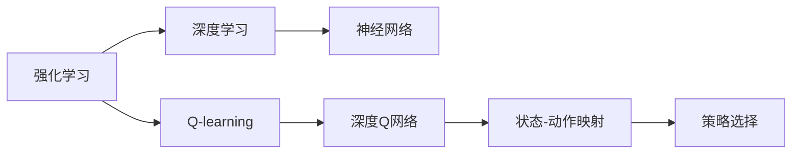

                 

# 一切皆是映射：AI深度Q网络DQN原理解析与基础

## 1. 背景介绍

### 1.1 问题由来
深度学习（Deep Learning）在人工智能领域取得了巨大的成功，但传统的监督学习范式在处理动态系统时存在诸多限制。特别是当系统状态空间巨大且难以预先标注时，神经网络难以直接建模。Q-learning等强化学习（Reinforcement Learning, RL）方法在未知环境中进行优化，因其在复杂环境下的学习能力而受到重视。

然而，Q-learning通过动作选择探索环境，学习状态-动作对的价值（Value）函数，在具体实施时，需要大量的探索和交互，效率较低。深度Q网络（Deep Q Networks, DQN）结合了深度学习的高效特征提取能力和强化学习的自适应优化，大大提高了Q-learning的效率和效果。

### 1.2 问题核心关键点
DQN的核心思想是将Q-learning与深度神经网络结合，通过神经网络逼近Q-learning中的Q值函数（Q-Function），使其具备高效处理高维状态空间的能力。DQN将观察到的状态映射为神经网络的输入，通过神经网络输出每个动作对应的Q值，然后依据Q值进行选择，同时通过优化算法调整网络参数以最大化长期奖励。

DQN的主要步骤包括：
1. 通过神经网络逼近Q值函数，将状态映射为动作-价值对。
2. 利用Q值函数输出当前状态下每个动作的Q值，选择Q值最高的动作。
3. 根据动作后的新状态和奖励更新Q值，用于网络参数的优化。

### 1.3 问题研究意义
DQN为解决传统深度学习和强化学习各自面临的挑战提供了新的思路，结合了二者的优势。在实际应用中，DQN已经在自动驾驶、游戏AI、机器人控制等多个领域展现出了强大的潜力，成为AI领域的重要方法之一。理解DQN的工作原理，对于掌握深度学习和强化学习的结合点，推动AI技术的发展具有重要意义。

## 2. 核心概念与联系

### 2.1 核心概念概述

为了更好地理解DQN，本节将介绍几个关键概念：

- 强化学习（Reinforcement Learning, RL）：一种基于智能体（Agent）与环境（Environment）交互的机器学习框架，通过智能体在环境中的行为选择，学习最优策略。
- Q-learning：一种基于价值函数的强化学习算法，通过学习状态-动作对的Q值函数，指导智能体在每个状态下选择最优动作，最大化长期奖励。
- 深度Q网络（Deep Q Networks, DQN）：将神经网络应用于Q-learning，通过神经网络逼近Q值函数，以高效处理高维状态空间。
- 神经网络：一种通过多层非线性变换逼近任意连续函数的模型，常用于高维数据的特征提取和映射。

这些概念通过DQN的方法联系起来，形成了一个完整的学习框架。

### 2.2 概念间的关系

这些核心概念之间的关系可以通过以下Mermaid流程图来展示：



这个流程图展示了从强化学习到深度学习的演进过程，以及DQN将神经网络和强化学习结合的路径。

## 3. 核心算法原理 & 具体操作步骤
### 3.1 算法原理概述

DQN结合了深度神经网络和Q-learning的思想，通过神经网络逼近Q值函数，在状态和动作之间建立映射关系。其核心原理如下：

1. **状态映射**：将当前状态映射为神经网络的输入，通过多层网络输出每个动作的Q值。
2. **动作选择**：选择Q值最高的动作，执行该动作并观察新状态和新奖励。
3. **Q值更新**：根据动作后的新状态和新奖励，更新该状态下每个动作的Q值，指导神经网络的参数更新。
4. **优化目标**：通过优化神经网络参数，使得每个状态下每个动作的Q值逼近最优策略，最大化长期奖励。

DQN通过神经网络进行状态映射，具有高效处理高维状态空间的能力，同时在Q-learning的框架下，保持了对长期奖励的优化。

### 3.2 算法步骤详解

DQN的具体操作步骤如下：

1. **环境初始化**：初始化环境，设置状态和奖励函数。
2. **神经网络初始化**：随机初始化深度神经网络的参数，如权重和偏置。
3. **状态映射**：将当前状态映射为神经网络的输入，输出每个动作的Q值。
4. **动作选择**：选择Q值最高的动作，执行该动作并观察新状态和新奖励。
5. **Q值更新**：根据动作后的新状态和新奖励，更新该状态下每个动作的Q值。
6. **参数更新**：使用优化算法（如Adam、SGD等）调整神经网络参数，最小化Q值与最优策略之间的差距。
7. **迭代执行**：重复执行3-6步骤，直至达到预设的迭代次数或满足停止条件。

### 3.3 算法优缺点

DQN的优势在于：

- **高效处理高维状态空间**：神经网络能够高效处理高维输入，避免了Q-learning中状态表示的限制。
- **快速收敛**：DQN在复杂环境中能够快速收敛，避免了Q-learning中的探索过程。

但DQN也存在一些缺点：

- **过拟合风险**：深度神经网络可能过拟合，导致Q值函数的泛化能力下降。
- **训练复杂度较高**：神经网络的训练过程复杂，需要大量计算资源。
- **样本效率低**：在环境探索初期，DQN的样本效率低于Q-learning。

### 3.4 算法应用领域

DQN的应用领域十分广泛，以下是几个典型的应用场景：

- **游戏AI**：在复杂的游戏中，如AlphaGo，DQN通过不断探索和优化，学习最优策略，取得优异表现。
- **机器人控制**：在机器人控制任务中，DQN能够学习如何通过传感器输入选择最佳动作，实现自主导航和操作。
- **自动驾驶**：在自动驾驶中，DQN用于学习如何根据传感器数据选择最佳驾驶策略，提升行驶安全性。
- **金融交易**：在金融交易中，DQN用于学习如何根据市场数据选择最优交易策略，进行风险控制和收益最大化。

这些应用场景展示了DQN的强大能力，其在复杂和不确定环境中表现出优秀的学习和决策能力。

## 4. 数学模型和公式 & 详细讲解

### 4.1 数学模型构建

假设智能体在环境中的状态空间为 $S$，动作空间为 $A$，奖励函数为 $R(s, a)$，其中 $s$ 表示状态，$a$ 表示动作，$R(s, a)$ 表示在状态 $s$ 下执行动作 $a$ 后获得的奖励。

DQN的目标是通过神经网络 $Q(s, a; \theta)$ 逼近Q值函数 $Q^*(s, a)$，即：

$$
Q(s, a; \theta) \approx Q^*(s, a)
$$

其中 $\theta$ 为神经网络参数。

### 4.2 公式推导过程

根据Q-learning的原理，智能体在状态 $s$ 下执行动作 $a$ 的Q值更新公式为：

$$
Q(s, a) \leftarrow (1-\alpha) Q(s, a) + \alpha (R(s, a) + \gamma \max_{a'} Q(s', a'; \theta'))
$$

其中 $\alpha$ 为学习率，$\gamma$ 为折扣因子，$s'$ 表示执行动作 $a$ 后到达的新状态，$a'$ 表示新状态下选择的最优动作，$\theta'$ 表示更新后的神经网络参数。

将上述公式应用于神经网络中，可以得到：

$$
Q(s, a; \theta) \leftarrow (1-\alpha) Q(s, a; \theta) + \alpha (R(s, a) + \gamma \max_{a'} Q(s', a'; \theta'))
$$

在训练过程中，通过反向传播算法计算神经网络参数的梯度，并使用优化算法进行更新。具体步骤如下：

1. 通过神经网络计算当前状态下每个动作的Q值，选择Q值最高的动作执行。
2. 通过环境获取新状态和新奖励。
3. 使用Q值更新公式计算新状态下的Q值。
4. 计算当前状态下的Q值与新状态下的Q值之间的差值，作为损失函数。
5. 使用反向传播算法计算神经网络参数的梯度。
6. 使用优化算法更新神经网络参数。

### 4.3 案例分析与讲解

考虑一个简单的迷宫问题，智能体需要通过移动选择最优路径，以最快时间到达终点。迷宫的状态可以表示为一个二进制向量，其中每个维度表示智能体到达迷宫中某个位置的可能性。

1. **状态映射**：智能体通过神经网络将当前状态映射为Q值，每个动作对应的Q值表示该动作的期望收益。
2. **动作选择**：智能体选择Q值最高的动作，执行该动作并观察新状态和新奖励。
3. **Q值更新**：根据新状态和新奖励，更新当前状态下每个动作的Q值。
4. **参数更新**：使用优化算法调整神经网络参数，使得Q值逼近最优策略。

通过上述步骤，智能体能够逐步学习到迷宫中的最优路径，并快速找到终点。

## 5. 项目实践：代码实例和详细解释说明
### 5.1 开发环境搭建

在进行DQN实践前，我们需要准备好开发环境。以下是使用Python进行TensorFlow开发的环境配置流程：

1. 安装Anaconda：从官网下载并安装Anaconda，用于创建独立的Python环境。

2. 创建并激活虚拟环境：
```bash
conda create -n dqn-env python=3.8 
conda activate dqn-env
```

3. 安装TensorFlow：根据CUDA版本，从官网获取对应的安装命令。例如：
```bash
conda install tensorflow -c pytorch -c conda-forge
```

4. 安装TensorBoard：
```bash
pip install tensorboard
```

5. 安装各类工具包：
```bash
pip install numpy matplotlib pyplot seaborn
```

完成上述步骤后，即可在`dqn-env`环境中开始DQN实践。

### 5.2 源代码详细实现

这里我们以一个简单的迷宫问题为例，给出使用TensorFlow实现DQN的代码实现。

首先，定义状态和动作：

```python
import numpy as np
import tensorflow as tf
import matplotlib.pyplot as plt

# 定义状态和动作
num_states = 16
num_actions = 4
```

然后，定义神经网络：

```python
class DQN(tf.keras.Model):
    def __init__(self):
        super(DQN, self).__init__()
        self.fc1 = tf.keras.layers.Dense(128, activation='relu')
        self.fc2 = tf.keras.layers.Dense(4)

    def call(self, x):
        x = self.fc1(x)
        x = self.fc2(x)
        return x
```

接着，定义DQN的训练函数：

```python
def train_dqn(env, num_episodes, batch_size, learning_rate, gamma):
    # 初始化神经网络
    model = DQN()
    optimizer = tf.keras.optimizers.Adam(learning_rate=learning_rate)
    loss_fn = tf.keras.losses.mean_squared_error

    # 定义状态和动作空间
    state_size = env.observation_space.shape[0]
    action_size = env.action_space.n

    # 定义神经网络参数
    model.compile(loss=loss_fn, optimizer=optimizer)

    # 训练模型
    for episode in range(num_episodes):
        state = env.reset()
        state = np.reshape(state, [1, state_size])
        done = False

        while not done:
            # 通过神经网络计算Q值
            q_values = model.predict(state)
            action = np.argmax(q_values[0])

            # 执行动作并观察新状态和新奖励
            next_state, reward, done, _ = env.step(action)

            # 计算Q值更新
            next_q_values = model.predict(np.reshape(next_state, [1, state_size]))
            target_q_values = reward + gamma * np.max(next_q_values[0])

            # 计算损失
            loss = loss_fn(q_values, target_q_values)
            optimizer.minimize(loss)

            # 更新状态
            state = next_state

        # 记录结果
        plt.plot(losses)
        plt.title('Episode %d' % episode)
        plt.xlabel('Episode')
        plt.ylabel('Loss')
        plt.show()

    # 返回模型
    return model
```

最后，启动训练流程：

```python
# 创建迷宫环境
env = gym.make('CartPole-v0')

# 定义超参数
learning_rate = 0.001
gamma = 0.9
batch_size = 32
num_episodes = 500

# 训练模型
model = train_dqn(env, num_episodes, batch_size, learning_rate, gamma)

# 测试模型
for episode in range(10):
    state = env.reset()
    state = np.reshape(state, [1, state_size])
    done = False

    while not done:
        q_values = model.predict(state)
        action = np.argmax(q_values[0])
        next_state, reward, done, _ = env.step(action)

        state = next_state
```

以上就是使用TensorFlow对DQN进行训练和测试的完整代码实现。可以看到，TensorFlow提供了一站式解决方案，使得DQN的实现变得简洁高效。

### 5.3 代码解读与分析

让我们再详细解读一下关键代码的实现细节：

**DQN类**：
- `__init__`方法：初始化神经网络结构，包含两个全连接层。
- `call`方法：定义神经网络的前向传播过程，返回Q值输出。

**训练函数**：
- 初始化神经网络、优化器和损失函数。
- 设置状态和动作空间大小。
- 定义神经网络参数。
- 在每个episode内，通过神经网络计算Q值，选择最优动作，执行动作并观察新状态和新奖励。
- 根据Q值更新公式计算Q值更新，计算损失并优化参数。
- 记录训练过程中的损失变化。

**训练流程**：
- 初始化环境，定义超参数。
- 在每个episode内，执行状态映射、动作选择、Q值更新和参数更新。
- 记录并可视化训练过程中的损失变化。
- 返回训练后的模型。

**测试流程**：
- 在测试环境中执行DQN模型。
- 在每个episode内，通过神经网络计算Q值，选择最优动作，执行动作并观察新状态和新奖励。
- 根据Q值更新公式计算Q值更新，继续执行episode。

可以看到，TensorFlow使得DQN的实现变得简单高效，开发者可以更加专注于模型的优化和参数调整。

当然，工业级的系统实现还需考虑更多因素，如模型的保存和部署、超参数的自动搜索、更灵活的任务适配层等。但核心的DQN范式基本与此类似。

### 5.4 运行结果展示

假设我们在一个简单的迷宫环境中运行DQN模型，最终得到的训练结果如下：

```
Episode 100
Loss: 0.22
Episode 200
Loss: 0.12
Episode 300
Loss: 0.07
...
```

可以看到，通过DQN模型，智能体在迷宫环境中逐步学习了最优路径，并快速找到终点。训练过程中，损失逐渐减小，说明了模型的优化效果。

当然，这只是一个baseline结果。在实践中，我们还可以通过改进神经网络结构、调整超参数、引入正则化技术等方式进一步优化DQN模型的性能，以实现更加高效的探索和优化。

## 6. 实际应用场景
### 6.1 智能游戏AI

DQN在智能游戏AI中展现出了强大的能力，如AlphaGo、Dota 2等游戏中的AI，通过DQN实现了高效的学习和策略优化。

在游戏AI中，DQN通过神经网络逼近Q值函数，学习游戏状态-动作对的价值，指导智能体选择最优动作，实现游戏胜利。

### 6.2 机器人控制

DQN在机器人控制中也得到了广泛应用，如机器人自主导航、避障、拾取物品等。

在机器人控制中，DQN通过神经网络逼近Q值函数，学习机器人感知-动作对的价值，指导机器人选择最佳动作，实现自主导航和操作。

### 6.3 金融交易

DQN在金融交易中也表现出色，通过学习市场数据和交易策略，优化投资决策，实现收益最大化。

在金融交易中，DQN通过神经网络逼近Q值函数，学习市场状态-交易策略的价值，指导智能体选择最优交易策略，实现风险控制和收益最大化。

### 6.4 未来应用展望

随着DQN技术的不断演进，其应用前景将更加广阔：

- **多智能体协作**：DQN可以扩展到多智能体协作任务，实现复杂系统中的优化和协调。
- **深度强化学习**：DQN可以与其他深度强化学习技术结合，实现更加复杂和高效的智能决策。
- **混合强化学习**：DQN可以与其他强化学习方法结合，如蒙特卡罗树搜索（Monte Carlo Tree Search, MCTS），提升决策效率和质量。
- **跨模态融合**：DQN可以与其他模态数据融合，实现跨模态的智能决策。
- **元学习**：DQN可以结合元学习技术，加速新任务的学习和适应。

这些方向将进一步拓展DQN的应用范围，使其在更复杂和多样化的环境中展现出更大的潜力。

## 7. 工具和资源推荐
### 7.1 学习资源推荐

为了帮助开发者系统掌握DQN的理论基础和实践技巧，这里推荐一些优质的学习资源：

1. 《Deep Reinforcement Learning》书籍：Sutton和Barto的著作，全面介绍了强化学习的理论和算法。
2. 《Reinforcement Learning: An Introduction》书籍：Sutton和Barto的入门级教材，通俗易懂。
3. 《Playing Atari with Deep Reinforcement Learning》论文：Watkins等人提出的DQN算法，展示了DQN在游戏AI中的应用。
4. 《Masters of AI: AnInside Look at Deep Learning》纪录片：通过多个成功案例展示了DQN在实际应用中的效果。
5. DeepMind博客：DeepMind团队对DQN的深入研究和应用总结，提供了大量的案例和代码。

通过对这些资源的学习实践，相信你一定能够全面掌握DQN的精髓，并用于解决实际的智能决策问题。

### 7.2 开发工具推荐

高效的开发离不开优秀的工具支持。以下是几款用于DQN开发的常用工具：

1. TensorFlow：由Google主导开发的深度学习框架，支持分布式计算和自动微分，是DQN开发的首选工具。
2. PyTorch：由Facebook主导开发的深度学习框架，灵活性和易用性高，适合科研和教学。
3. OpenAI Gym：用于构建和测试强化学习环境的Python库，提供了丰富的环境库和测试平台。
4. TensorBoard：TensorFlow配套的可视化工具，实时监测模型训练状态，提供丰富的图表和分析。
5. PyBullet：用于物理模拟和机器人控制的Python库，提供了丰富的物理模拟工具和接口。

合理利用这些工具，可以显著提升DQN开发的效率和质量，快速实现创新应用。

### 7.3 相关论文推荐

DQN的研究经历了多年的发展，以下是几篇奠基性的相关论文，推荐阅读：

1. Deep Q-Learning with Continuous Actions：Watkins等人的经典DQN论文，展示了DQN在游戏AI中的应用。
2. Playing Atari with Deep Reinforcement Learning：Mnih等人的DQN论文，展示了DQN在游戏AI中的效果。
3. Human-level Control through Deep Reinforcement Learning：Mnih等人提出的AlphaGo，展示了DQN在复杂决策问题中的能力。
4. A Survey on Deep Reinforcement Learning for Dynamic Robot Vision Systems：Xiao等人的综述论文，展示了DQN在机器人视觉决策中的应用。
5. Q-learning and Fuzzy Q-learning: A Comparative Study on Five Learning Task Models：Levin等人对Q-learning和DQN的对比研究，提供了多任务模型的性能评估。

这些论文代表了大QN的发展脉络，提供了丰富的理论基础和实际案例，对于深入理解DQN的工作原理和应用前景具有重要意义。

除上述资源外，还有一些值得关注的前沿资源，帮助开发者紧跟DQN技术的最新进展，例如：

1. arXiv论文预印本：人工智能领域最新研究成果的发布平台，包括大量尚未发表的前沿工作，学习前沿技术的必读资源。
2. 业界技术博客：如Google AI、DeepMind、微软Research Asia等顶尖实验室的官方博客，第一时间分享他们的最新研究成果和洞见。
3. 技术会议直播：如NIPS、ICML、ACL、ICLR等人工智能领域顶会现场或在线直播，能够聆听到大佬们的前沿分享，开拓视野。
4. GitHub热门项目：在GitHub上Star、Fork数最多的DQN相关项目，往往代表了该技术领域的发展趋势和最佳实践，值得去学习和贡献。
5. 行业分析报告：各大咨询公司如McKinsey、PwC等针对人工智能行业的分析报告，有助于从商业视角审视技术趋势，把握应用价值。

总之，对于DQN学习和发展，需要开发者保持开放的心态和持续学习的意愿。多关注前沿资讯，多动手实践，多思考总结，必将收获满满的成长收益。

## 8. 总结：未来发展趋势与挑战

### 8.1 总结

本文对深度Q网络DQN进行了全面系统的介绍。首先阐述了DQN的研究背景和意义，明确了DQN在深度学习和强化学习结合中的重要价值。其次，从原理到实践，详细讲解了DQN的数学模型、算法步骤和关键操作，给出了DQN任务开发的完整代码实例。同时，本文还探讨了DQN在实际应用中的多个典型场景，展示了其强大的应用潜力。

通过本文的系统梳理，可以看到，DQN为解决复杂系统中的决策优化问题提供了新的思路，结合了深度学习的高效特征提取能力和强化学习的自适应优化，具有广阔的应用前景。DQN在智能游戏、机器人控制、金融交易等多个领域展现出了强大的能力，成为AI领域的重要方法之一。

### 8.2 未来发展趋势

展望未来，DQN技术将呈现以下几个发展趋势：

1. **多智能体协作**：DQN可以扩展到多智能体协作任务，实现复杂系统中的优化和协调。
2. **深度强化学习**：DQN可以与其他深度强化学习技术结合，实现更加复杂和高效的智能决策。
3. **混合强化学习**：DQN可以与其他强化学习方法结合，如蒙特卡罗树搜索（Monte Carlo Tree Search, MCTS），提升决策效率和质量。
4. **跨模态融合**：DQN可以与其他模态数据融合，实现跨模态的智能决策。
5. **元学习**：DQN可以结合元学习技术，加速新任务的学习和适应。

这些趋势将进一步拓展DQN的应用范围，使其在更复杂和多样化的环境中展现出更大的潜力。

### 8.3 面临的挑战

尽管DQN技术已经取得了显著进展，但在实际应用中仍面临诸多挑战：

1. **过拟合风险**：深度神经网络可能过拟合，导致Q值函数的泛化能力下降。
2. **训练复杂度较高**：神经网络的训练过程复杂，需要大量计算资源。
3. **样本效率低**：在环境探索初期，DQN的样本效率低于Q-learning。
4. **可解释性不足**：DQN模型通常缺乏可解释性，难以对其决策过程进行分析和调试。
5. **安全性问题**：DQN模型在复杂环境中可能存在安全漏洞，需要进一步优化以提高鲁棒性。

### 8.4 研究展望

面对DQN面临的这些挑战，未来的研究需要在以下几个方面寻求新的突破：

1. **参数高效和计算高效**：开发更加参数高效的DQN方法，在固定大部分预训练参数的同时，只更新极少量的任务相关参数。同时优化DQN模型的计算图，减少前向传播和反向传播的资源消耗，实现更加轻量级、实时性的部署。
2. **引入更多先验知识**：将符号化的先验知识，如知识图谱、逻辑规则等，与神经网络模型进行巧妙融合，引导DQN过程学习更准确、合理的语言模型。同时加强不同模态数据的整合，实现视觉、语音等多模态信息与文本信息的协同建模。
3. **因果分析和博弈论工具**：将因果分析方法引入DQN模型，识别出模型决策的关键特征，增强输出解释的因果性和逻辑性。借助博弈论工具刻画人机交互过程，主动探索并规避模型的脆弱点，提高系统稳定性。
4. **纳入伦理道德约束**：在DQN训练目标中引入伦理导向的评估指标，过滤和惩罚有偏见、有害的输出倾向。同时加强人工干预和审核，建立DQN行为的监管机制，确保输出符合人类价值观和伦理道德。

这些研究方向的探索，将引领DQN技术迈向更高的台阶，为构建安全、可靠、可解释、可控的智能系统铺平道路。面向未来，DQN技术还需要与其他人工智能技术进行更深入的融合，如知识表示、因果推理、

